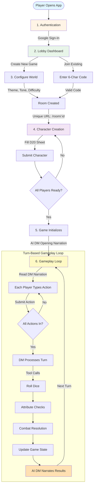

# Daicer - Multiplayer D&D with an AI Dungeon Master

<div align="center">


[](https://github.com/YOUR_USERNAME/daicer/actions)
[](https://github.com/YOUR_USERNAME/daicer/actions)
[](https://www.typescriptlang.org/)
[](https://nodejs.org/)
[](./LICENSE)
[](https://prettier.io/)
[](https://github.com/airbnb/javascript)

</div>

🎲 **Forge your legend in a world brought to life by an intelligent AI Dungeon Master.** Daicer is a turn-based, multiplayer tabletop RPG that combines the timeless thrill of D&D with cutting-edge technology. It's a persistent, stateful adventure where your choices matter, combat is tactical, and the story is dynamically crafted around your party's actions using **LangChain** and **LangGraph**.

This isn't just an AI storyteller—it's a complete game engine with real dice mechanics, structured AI tool usage, and even **combat time-travel**.

---

## 🗺️ Project Roadmap

This project is actively evolving. Here's where we are and where we're headed:

### ✅ Complete

- [x] **Core Multiplayer System** — Real-time room creation, joining, player sync via Socket.io
- [x] **Stateful Narrative Engine** — LangGraph managing turn-based gameplay and world state
- [x] **AI DM with Tool Calling** — LLM uses real dice mechanics, structured tool usage
- [x] **Character Creation & Sheets** — Complete D20 character creation system
- [x] **Firebase Integration** — Auth, Firestore, emulator support
- [x] **CI/CD Pipeline** — Automated linting, formatting, type-checking, testing with coverage
- [x] **Component Library** — Storybook with 60+ documented UI components

### 🚧 In Progress

- [🚧] **Tactical Grid Combat** — Grid-based movement, positioning, spell AoE, time-travel mechanics

### 📋 Planned

- [ ] **Environmental Dynamics** — Entropy system for random world events (weather, discoveries)
- [ ] **Creature Compendium (RAG)** — Monster manual searchable by AI DM for stats and lore
- [ ] **Dynamic Encounter Generation** — AI tool for balanced, thematic combat encounters
- [ ] **World Map & Travel** — Spatial awareness, travel time calculations
- [ ] **In-Game Time Tracking** — Universal clock (combat rounds = seconds, turns = minutes, travel = hours)
- [ ] **Character Progression** — XP, loot, level-ups
- [ ] **Death & Resurrection** — Spectator mode, revival mechanics, new character creation

---

## 🚀 Quick Start

```bash
# Install dependencies across the entire project
yarn install:all

# Start the complete development environment (emulators + backend + frontend)
yarn dev

# View the frontend component library
yarn storybook

# Run all tests and generate a coverage report
yarn test:coverage

# Run a full QA check (format, lint, typecheck, test)
yarn qa
```

📖 **[Complete Command Reference](./COMMANDS.md)** | 🤝 **[Contributing Guide](./CONTRIBUTING.md)** | 📦 **[File Header Standard](./FILE_HEADER_STANDARD.md)**

## 📜 Complete Gameplay Flow

The following diagram illustrates the end-to-end player journey from authentication through the turn-based gameplay loop:



### Flow Breakdown

1. **Authentication** — Firebase Auth with Google (any email works in emulator mode)
2. **Lobby** — Create new room or join with 6-character code
3. **World Configuration** — Set theme, tone, difficulty (room creator only)
4. **Character Creation** — Fill complete D20 sheet (STR, DEX, CON, INT, WIS, CHA, race, class, alignment)
5. **Game Initialization** — AI DM generates opening narration once all players ready
6. **Turn-Based Loop** — Players submit actions → DM uses tools (dice, checks) → Narration → Repeat

## 🧠 How It Works

### 1. **Authentication**
-   Click "Continue with Google".
-   Uses Firebase Auth (with local emulators for development). Any email works locally.

### 2. **Create or Join Room**
-   **Create**: Configure your world's theme, tone, and difficulty to get a 6-character room code.
-   **Join**: Enter an existing room code (e.g., "ABC123") to join a party.

### 3. **Character Creation**
-   Fill out a complete D20 character sheet, including attributes (STR, DEX, etc.), race, class, and alignment.
-   Submit your character and wait for the rest of your party to get ready.

### 4. **Gameplay - Turn-Based System**
Each narrative turn unfolds in a synchronized loop:
1.  **Read** the DM's latest narration.
2.  **Type** your character's action (e.g., "I search for traps," "I try to persuade the guard").
3.  **Submit** your action and wait for all other players.
4.  **Process**: Once all actions are in, the AI DM processes the turn, using its tools to determine outcomes.
5.  **Narrate**: The DM describes what happens next, and the loop repeats.

### 5. **Dice System & AI Tools**
The AI DM is bound by the rules of the game. It cannot invent outcomes. It **must** use tools to resolve actions, providing full transparency to the players.
-   `roll_dice("2d6+3")`: Executes real, random dice rolls.
-   `attribute_check(character, "Strength", DC=15)`: Performs a d20 skill check against a difficulty class.
-   `attack_roll(attacker, target)`: Resolves an attack roll against a target's Armor Class.
-   `deal_damage(target, "1d8+2", "slashing")`: Applies damage to a character.

The results are returned to the LLM, which then creatively interprets them to write the ongoing narrative.

### 6. **Real-Time Synchronization**
-   Powered by Socket.io, the game state is always in sync.
-   See other players' characters and know who has submitted their action.
-   The turn automatically processes when everyone is ready.

---

## 🏛️ Architecture & The Daicer Engine

Daicer's architecture is designed for robustness and intelligent orchestration. The **LangGraph Engine** is the core component, acting as the "brain" that manages the game's stateful flow.

```mermaid
graph LR
    Player[Player Browser] -->|HTTP/WS| Frontend[React Frontend]
    Frontend -->|API Calls| Backend[Express Backend]
    Frontend -->|WebSocket| Backend
    Backend -->|Auth| FirebaseAuth[Firebase Auth]
    Backend -->|Data & Checkpointing| Firestore[(Firestore)]
    Backend -->|Orchestration| LG[LangGraph Engine]
    LG -->|Generate| LLM[LangChain LLMs]
    LLM -->|Tools| Dice[Real Dice Rolls]
    LLM -.->|Fallback| Gemini
    LLM -.->|Fallback| OpenAI
    LLM -.->|Fallback| Anthropic
````

### The Engine: A Deeper Dive

The game's logic is modeled as stateful graphs, providing unprecedented control, determinism, and features like time-travel.

```mermaid
graph TD
    subgraph "LangGraph Gameplay Loop"
        A[Turn Processing Node]
    end

    subgraph "AI DM Tools & Systems"
        B[Environmental Dynamics<br/>(Entropy Roll)]
        C[Encounter Generation]
        D[World & Time Awareness]
        E[Core Mechanics<br/>(Dice, Skill Checks)]
        F[Progression & Rewards<br/>(XP, Loot)]
        G[Creature Compendium<br/>(RAG)]
    end

    A -->|Calls Tools| B
    A -->|Calls Tools| C
    A -->|Reads State| D
    A -->|Calls Tools| E
    A -->|Calls Tools| F
    C -->|Uses| G
```

- **Stateful Graphs**: We use two primary graphs: a **Gameplay Graph** for narrative and a **Combat Graph** for tactical encounters. LangGraph ensures their state persists between turns and sessions.
- **Deterministic Combat**: The combat graph is initialized with a **seed**. Every dice roll is derived from this seed, making the entire combat sequence reproducible. This allows for a "replay" feature and our revolutionary **Time-Travel** capability, where players can rewind and explore different tactical choices.
- **Systems as Tools**: Complex game systems (like encounter generation or world events) are exposed to the AI DM as simple tools. This keeps the core logic robust and allows the LLM to focus on creative narration while the system handles the complex mechanics. All tool calls and state changes are logged, making the entire game flow traceable and debuggable.

---

## ✅ Key Features Checklist

- [x] **Turn-Based Multiplayer** - Real-time sync, room-based gameplay.
- [x] **Real Dice Mechanics** - `Math.random()` dice rolls, not AI-decided.
- [x] **LLM Tool Calling** - DM uses dice/check tools to determine outcomes.
- [x] **Full D20 System** - Attributes, skills, saves, and character sheets.
- [x] **URL Routing** - Each room has a unique URL `/room/:id`.
- [x] **Firebase Emulators** - Zero-cloud local development.
- [x] **Debug Panel** - Real-time event inspector (`Ctrl+D` in frontend).
- [x] **Multi-LLM Support** - Fallback chain for Gemini, OpenAI, Anthropic via LangChain.
- [x] **Infrastructure as Code** - Terraform for reproducible Google Cloud deployments.
- [🚧] **Tactical Grid Combat** - Grid movement, positioning, and spell AoE. `(In Progress)`
- [🧠] **Stateful Gameplay with LangGraph** - The core engine for durable, persistent adventures. `(Conceptual)`
- [🧠] **Combat Time-Travel** - Rewind and fork the combat timeline. `(Conceptual)`

---

## 🚀 Getting Started

### Prerequisites

- Node.js 20+
- Yarn
- Java 11+ (for Firebase emulators)
- Firebase CLI (`npm install -g firebase-tools`)
- Docker (optional)

### Local Development

1.  **Clone and install dependencies:**

    ```bash
    yarn install:all
    ```

2.  **Configure environment:**

    ```bash
    # Root directory
    cp .env.example .env.local

    # Backend
    cd backend
    cp .env.example .env.local
    ```

3.  **Add your Gemini API key to `backend/.env.local`:**

    ```
    GEMINI_API_KEY=your-key-here
    ```

4.  **Start everything with one command:**

    ```bash
    yarn dev
    ```

    This command starts:
    - Firebase Emulators (Firestore + Auth)
    - Backend server (with hot reload)
    - Frontend dev server (with hot reload)

    **Alternative:** Use Docker Compose:

    ```bash
    docker-compose up
    ```

5.  **Access the app:**
    - **Frontend:** [http://localhost:3000](http://localhost:3000)
    - **Backend API:** [http://localhost:3001](http://localhost:3001)
    - **Firebase Emulator UI:** [http://localhost:4000](http://localhost:4000)

---

## 📂 Project Structure

```daicer/
├── backend/              # Node.js/Express backend & Core Game Engine
│   ├── src/
│   │   ├── api/         # REST endpoints
│   │   ├── combat/      # Tactical grid combat engine and rules
│   │   ├── graph/       # LangGraph state machine definitions
│   │   ├── services/    # Business logic (Firestore, LLM calls, RAG)
│   │   ├── socket/      # Socket.io handlers
│   │   └── ...
│   ├── Dockerfile
│   └── package.json
├── src/                  # React frontend application
│   ├── components/
│   ├── hooks/
│   └── ...
├── infrastructure/       # Terraform IaC for Google Cloud
├── firebase.json         # Firebase Emulator configuration
├── firestore.rules       # Firestore security rules
├── docker-compose.yml    # Local development stack with Docker
└── package.json          # Root workspace for monorepo commands
```

_(For a more detailed breakdown, see the `README.md` inside the `backend` and `src` directories.)_

---

## _(Sections for Development Commands, API Endpoints, Socket.io Events, Configuration, Deployment, Code Quality, Testing, Tech Stack, Contributing, and Common Issues are omitted for brevity in this response but should remain in your file.)_

## ⚖️ License

This project is licensed under the **MIT License**.
