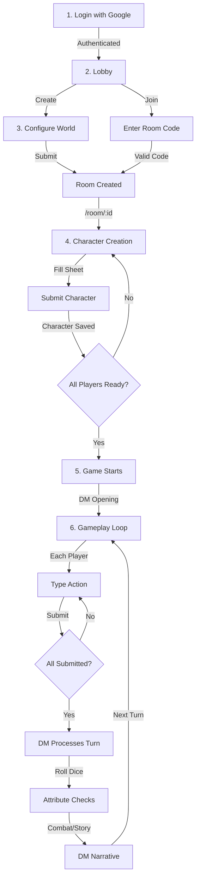
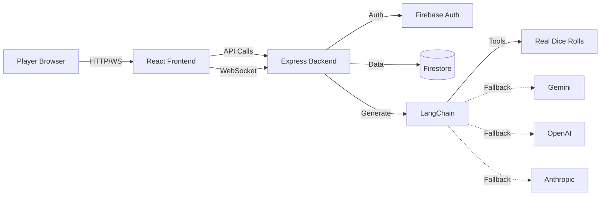

# D20 AI - Multiplayer D&D with AI Dungeon Master

🎲 **Turn-based multiplayer tabletop RPG** powered by AI. Create characters, join adventures, and let an intelligent Dungeon Master guide your story using real dice mechanics and LangChain with support for Gemini, OpenAI, and Anthropic.

## Game Flow



## How It Works

### 1. **Authentication**

- Click "Continue with Google"
- Uses Firebase Auth (emulators for local dev)
- Any email works locally - no password needed!

### 2. **Create or Join Room**

- **Create**: Click "Create New Adventure" → Configure world settings → Get room code
- **Join**: Enter 6-character room code (e.g., "ABC123")

### 3. **Character Creation**

- Fill out D20 character sheet:
  - Name, Race, Class, Alignment
  - Attributes (STR, DEX, CON, INT, WIS, CHA)
  - Auto-calculates modifiers
- Submit character
- Wait for all players to create characters

### 4. **Gameplay - Turn-Based System**

Each turn:

1. **Read** DM narration and previous actions
2. **Type** your action (e.g., "I search for traps", "I attack the goblin")
3. **Submit** and wait for others
4. **Process**: DM uses real dice tools to determine outcomes
5. **Narrative**: DM describes what happens
6. **Repeat**!

### 5. **Dice System**

The LLM uses **real random dice rolls** via tools:

- `roll_dice("2d6+3")` - Actual Math.random() results
- `attribute_check(character, "Strength", DC=15)` - d20 + modifier
- `saving_throw(character, "reflex", DC=12)` - Reflex/Fort/Will saves
- `attack_roll(attacker, target)` - d20 + attack bonus vs AC
- `deal_damage(target, "1d8+2", "slashing")` - Damage rolls

**Results are returned to the LLM**, which interprets them and writes the narrative.

### 6. **Real-Time Synchronization**

- See other players' characters instantly
- Know who's submitted their action
- Turn auto-processes when everyone's ready
- WebSocket updates via Socket.io

## Architecture



## Key Features

✅ **Turn-Based Multiplayer** - Real-time sync, room-based gameplay  
✅ **Real Dice Mechanics** - Math.random() dice rolls, not AI-decided  
✅ **LLM Tool Calling** - DM uses dice/check tools to determine outcomes  
✅ **Full D20 System** - Attributes, skills, saves, combat  
✅ **URL Routing** - Each room has unique URL `/room/:id`  
✅ **Character Sheets** - Complete D20 character creation  
✅ **Firebase Emulators** - Zero-cloud local development  
✅ **Debug Panel** - Real-time event inspector (Ctrl+D)  
✅ **Multi-LLM Support** - Gemini, OpenAI, Anthropic via LangChain  
✅ **Infrastructure as Code** - Terraform for Google Cloud

## Quick Start

### Prerequisites

- Node.js 20+
- Yarn
- Java 11+ (for Firebase emulators)
- Firebase CLI
- Docker (optional)

### Local Development

1. **Clone and install dependencies:**

```bash
yarn install:all
```

2. **Configure environment:**

```bash
# Root directory
cp .env.example .env.local

# Backend
cd backend
cp .env.example .env.local
```

3. **Add your Gemini API key to `.env.local`:**

```
GEMINI_API_KEY=your-key-here
```

4. **Start everything with one command:**

```bash
yarn dev
```

This single command starts:

- Firebase Emulators (Firestore + Auth)
- Backend server (with hot reload)
- Frontend dev server (with hot reload)

**Alternative:** Use Docker Compose:

```bash
docker-compose up
```

5. **Access the app:**

- Frontend: http://localhost:3000
- Backend: http://localhost:3001
- Firebase UI: http://localhost:4000

## Project Structure

```
d20ai/
├── backend/              # Node.js/Express backend
│   ├── src/
│   │   ├── api/         # REST endpoints
│   │   ├── socket/      # Socket.io handlers
│   │   ├── services/    # Business logic
│   │   ├── middleware/  # Auth, validation, errors
│   │   ├── config/      # Firebase, LangChain setup
│   │   ├── utils/       # Helpers
│   │   └── types/       # TypeScript types
│   ├── tests/           # Jest tests
│   ├── Dockerfile       # Container definition
│   └── package.json
├── src/                 # React frontend
│   ├── components/      # UI components
│   ├── hooks/          # Custom React hooks
│   ├── services/       # API/Socket clients
│   ├── types/          # Shared types
│   └── state/          # State management
├── infrastructure/      # Terraform IaC
├── firebase.json       # Emulator config
├── firestore.rules     # Security rules
├── docker-compose.yml  # Local dev stack
└── package.json        # Root workspace

```

## Development Commands

### Root

- `yarn dev` - **Start everything** (emulators + backend + frontend)
- `yarn install:all` - Install all dependencies
- `yarn dev:frontend` - Start frontend only
- `yarn dev:backend` - Start backend only
- `yarn dev:emulators` - Start emulators only
- `yarn docker:up` - Start full stack with Docker
- `yarn lint` - Lint all code
- `yarn format` - Format with Prettier
- `yarn test` - Run all tests
- `yarn typecheck` - TypeScript check

### Backend

- `yarn dev` - Start with hot reload
- `yarn build` - Build for production
- `yarn test` - Run Jest tests
- `yarn test:coverage` - Generate coverage report
- `yarn lint:check` - Lint without fixing

## API Endpoints

### Rooms

- `POST /api/rooms` - Create new room
- `POST /api/rooms/:code/join` - Join by code
- `GET /api/rooms/:roomId` - Get room state
- `PATCH /api/rooms/:roomId/settings` - Update settings
- `DELETE /api/rooms/:roomId` - Delete room

### Game

- `POST /api/game/:roomId/world` - Generate world
- `POST /api/game/:roomId/character` - Add character
- `POST /api/game/:roomId/start` - Start adventure
- `POST /api/game/:roomId/turn` - Process turn

### Users

- `GET /api/users/me` - Get current user

## Socket.io Events

### Client → Server

- `room:join` - Join game room
- `room:leave` - Leave room
- `player:action` - Submit action
- `turn:process` - Process turn

### Server → Client

- `game:state` - Full state sync
- `room:updated` - Room changed
- `player:joined` - Player joined
- `player:left` - Player left
- `turn:processing` - Turn processing
- `turn:complete` - Turn complete

## Configuration

### Environment Variables

**Frontend (.env.local):**

```
VITE_API_URL=http://localhost:3001
VITE_FIREBASE_PROJECT_ID=demo-project
VITE_USE_EMULATORS=true
```

**Backend (.env.local):**

```
NODE_ENV=development
PORT=3001
FRONTEND_URL=http://localhost:3000
FIREBASE_PROJECT_ID=demo-project
FIRESTORE_EMULATOR_HOST=localhost:8080
FIREBASE_AUTH_EMULATOR_HOST=localhost:9099
GEMINI_API_KEY=your-key
LLM_PROVIDER=gemini
LLM_FALLBACK_CHAIN=gemini,openai,anthropic
```

## Deployment

### Backend to Cloud Run

```bash
# Build and deploy
gcloud builds submit --config backend/cloudbuild.yaml

# Or use Terraform
cd infrastructure
terraform init
terraform apply
```

### Frontend to Vercel

```bash
# Install Vercel CLI
yarn global add vercel

# Deploy
vercel
```

## Code Quality Standards

- **TypeScript Strict Mode** - No `any` types allowed
- **ESLint** - Airbnb config with TypeScript
- **Prettier** - 2-space indent, single quotes
- **Max Function Length** - 25 lines
- **Max File Length** - 200 lines
- **Complexity** - Cyclomatic < 10
- **JSDoc** - All exports documented
- **Test Coverage** - 80%+ target

## Testing

### Backend (Jest)

```bash
cd backend
yarn test
yarn test:coverage
```

### Frontend (Vitest)

```bash
yarn test:frontend
```

### E2E (Playwright)

```bash
yarn test:e2e
```

## Tech Stack

**Frontend:**

- React 19
- TypeScript
- Vite
- Tailwind CSS
- Firebase Auth
- Socket.io Client

**Backend:**

- Node.js 20
- Express
- Socket.io
- Firebase Admin SDK
- LangChain
- Zod
- Winston

**Infrastructure:**

- Google Cloud Run
- Firebase Firestore
- Secret Manager
- Cloud Build
- Terraform

**Development:**

- Firebase Emulators
- Docker Compose
- ESLint + Prettier
- Jest + Vitest
- Playwright

## Contributing

1. Follow code quality standards
2. Write tests for new features
3. Update documentation
4. Run linting and type-checking

---

## Quick Start (3 Commands)

```bash
# 1. Install
yarn install:all

# 2. Add Gemini API key
echo "GEMINI_API_KEY=your-key" > .env.local
echo "GEMINI_API_KEY=your-key" > backend/.env.local

# 3. Start
yarn dev
```

Access: http://localhost:3000

---

## Common Issues

### Java Not Found

```bash
brew install openjdk@17  # macOS
sudo apt install openjdk-17-jdk  # Linux
```

### Connection Failed

- Verify all 3 services running (emulators, backend, frontend)
- Check `.env.local` exists in root
- Restart: `yarn dev`

### Auth Error

- Hard refresh browser (Cmd+Shift+R)
- Clear cookies
- Verify emulators running on port 4000

### LLM Timeout

- Check `GEMINI_API_KEY` in `backend/.env.local`
- Verify key at https://ai.google.dev/
- Check backend logs (blue output)

---

## License

MIT
