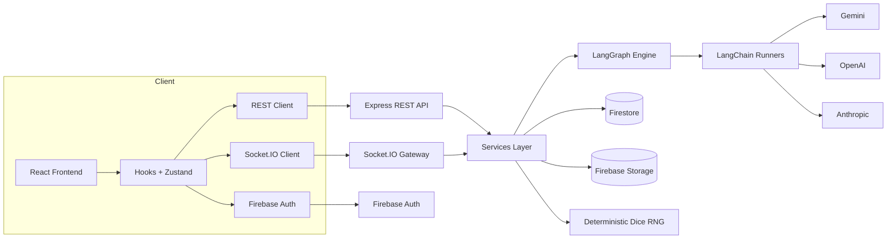

# Daicer

Multiplayer tabletop RPG powered by an AI Dungeon Master. Daicer fuses deterministic dice mechanics, LangGraph orchestration, and a modern React client to deliver cooperative storytelling that stays faithful to D&D 5e.

---

## Why Daicer

- **AI DM with guardrails**: LangChain/LangGraph workflows enforce rules, track state, and expose every tool call.
- **Deterministic combat**: Seeded dice rolls make tactical encounters reproducible — rewind turns, branch timelines.
- **Emulator-first**: Firebase emulators ship in the dev loop for zero-cost local development.
- **Full-stack TypeScript**: Strict typing across backend + frontend, shared domain models, and colocated tests.
- **Documented**: Every submodule ships with living READMEs (see links below).

---

## Monorepo Layout

```text
daicer/
├── backend/      Express + Socket.IO API, LangGraph services
├── frontend/     React 19 + Vite client, Storybook, Playwright
├── docs/         Mermaid diagrams, design notes
├── seeds/        SRD datasets and seeding scripts
├── scripts/      Repo-wide maintenance scripts
└── package.json  Yarn workspaces + shared tooling
```

Detailed docs:

- Backend: `backend/README.md`
- Frontend: `frontend/README.md`
- API controllers: `backend/src/api/README.md`
- Combat UI: `frontend/src/components/combat/README.md`
- Spell system: `backend/src/types/README-SPELLS.md`

---

## System Architecture



---

## Quick Start

1. **Prerequisites**
   - Node.js 22+
   - Yarn (Berry, shipped via repo)
   - Java 11+ (Firebase emulators)
   - Docker (optional, for container workflows)
   - Firebase CLI (`npm i -g firebase-tools`)

2. **Install dependencies**

   ```bash
   yarn install:all
   ```

3. **Copy env templates**

   ```bash
   cp .env.example .env.local
   cp backend/.env.example backend/.env.local
   ```

4. **Start full stack**

   ```bash
   yarn dev
   ```

   - Spins up Firebase emulators, backend watcher (`http://localhost:3001`), and frontend dev server (`http://localhost:3000`).

5. **Seed SRD data (optional)**

   ```bash
   yarn workspace @daicer/seeds seed:all
   ```

---

## Daily Commands

| Task                | Command                               |
| ------------------- | ------------------------------------- |
| Frontend dev server | `yarn workspace @daicer/frontend dev` |
| Backend only        | `yarn workspace @daicer/backend dev`  |
| Firebase emulators  | `yarn emulators`                      |
| Storybook           | `yarn storybook`                      |
| Run tests (all)     | `yarn test:coverage`                  |
| Backend QA          | `yarn qa backend`                     |
| Frontend QA         | `yarn qa frontend`                    |
| Lint + format       | `yarn lint && yarn format`            |

Complete CLI reference: `COMMANDS.md`

---

## Development Workflow

- **TDD**: Tests live beside code (`*.spec.ts` / `*.spec.tsx`). Write failing tests before modifying behavior.
- **Storybook**: Document UI states in `frontend/src/components/**/`. Stories double as visual regression baselines.
- **Graph Diagrams**: Mermaid diagrams in `docs/graphs/` illustrate gameplay and combat flow. Update when nodes change.
- **Data Seeds**: SRD data + spells reside in `seeds/`. Use `yarn workspace @daicer/seeds seed-spells` after modifying parser.
- **Debugging**: Press `Ctrl+D` in dev to open the in-app debug panel (socket traffic, LangGraph trace, combat timeline).

---

## Testing & QA

```bash
# Backend unit + integration
yarn test backend

# Frontend component tests
yarn test frontend

# Playwright smoke tests
yarn workspace @daicer/frontend test:e2e

# Full suite (lint, format, typecheck, test)
yarn qa
```

Testing stack:

- Jest (backend) with Firebase emulators + LangGraph mocks.
- Vitest + Testing Library (frontend) with MSW.
- Playwright E2E (auth, lobby, gameplay happy path).
- Coverage enforced at 80%+ statements/branches.

---

## Observability & Ops

- Structured logging via Winston (`backend/src/utils/logger.ts`).
- LangGraph emits per-node traces stored in Firestore (`turn_history` collection).
- Health check at `GET /health` validates Firestore + LangGraph readiness.
- Cloud Run deployment pipeline defined in `backend/cloudbuild.yaml`.

Deployment steps (summary):

```bash
gcloud builds submit --config backend/cloudbuild.yaml
gcloud run deploy daicer-backend \
  --image gcr.io/<PROJECT_ID>/daicer-backend \
  --region us-central1 \
  --allow-unauthenticated
```

Refer to `backend/README.md` for full instructions.

---

## Troubleshooting

| Symptom                     | Likely Cause             | Resolution                                                    |
| --------------------------- | ------------------------ | ------------------------------------------------------------- |
| Cannot authenticate locally | Emulators not running    | `yarn emulators` then reload frontend                         |
| Socket disconnect loops     | Token expired or missing | Trigger `signOut()` and login again; inspect browser console  |
| LangGraph turn stuck        | Missing AI provider key  | Set `GEMINI_API_KEY` (or alternative) in `backend/.env.local` |
| Combat overlay incorrect    | Spell dataset outdated   | Rerun `yarn workspace @daicer/seeds seed-spells`              |
| Build fails on lint         | Airbnb rule violation    | Run `yarn lint:fix` or update offending code/tests            |

---

## Contributing

1. Create feature branch off `main`.
2. Update relevant README(s) when behavior or contracts change.
3. Run appropriate QA commands (`yarn qa backend`, `yarn qa frontend`).
4. Provide tests (unit, integration, or e2e as appropriate).
5. Submit PR with context, screenshots (if UI), and verification checklist.

See `CONTRIBUTING.md` for broader guidelines.

---

## License

MIT — see `LICENSE`.

SRD content follows Wizards of the Coast Open Gaming License (refer to `docs/LICENSE-SRD.md`).
