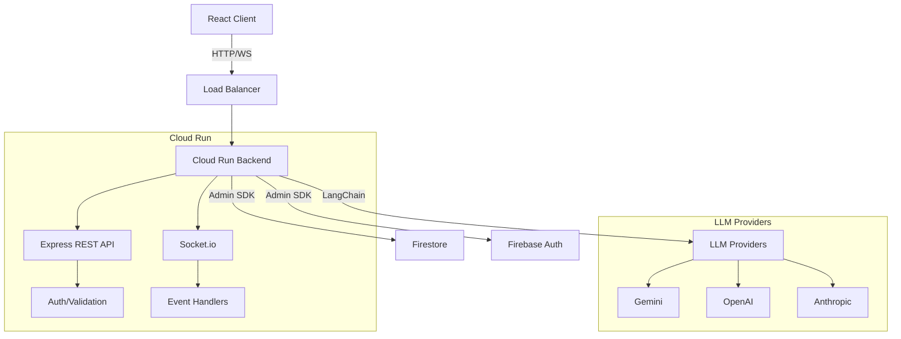
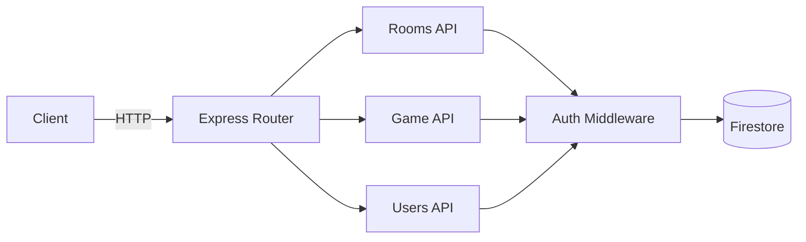
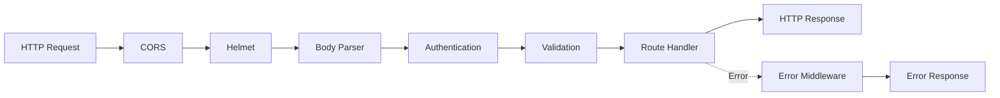
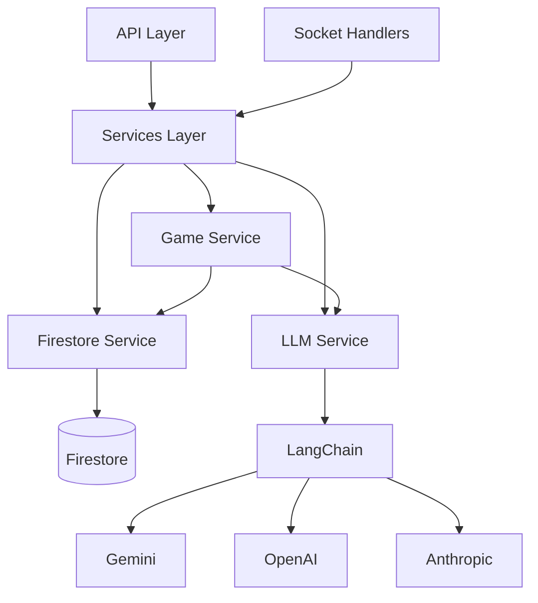
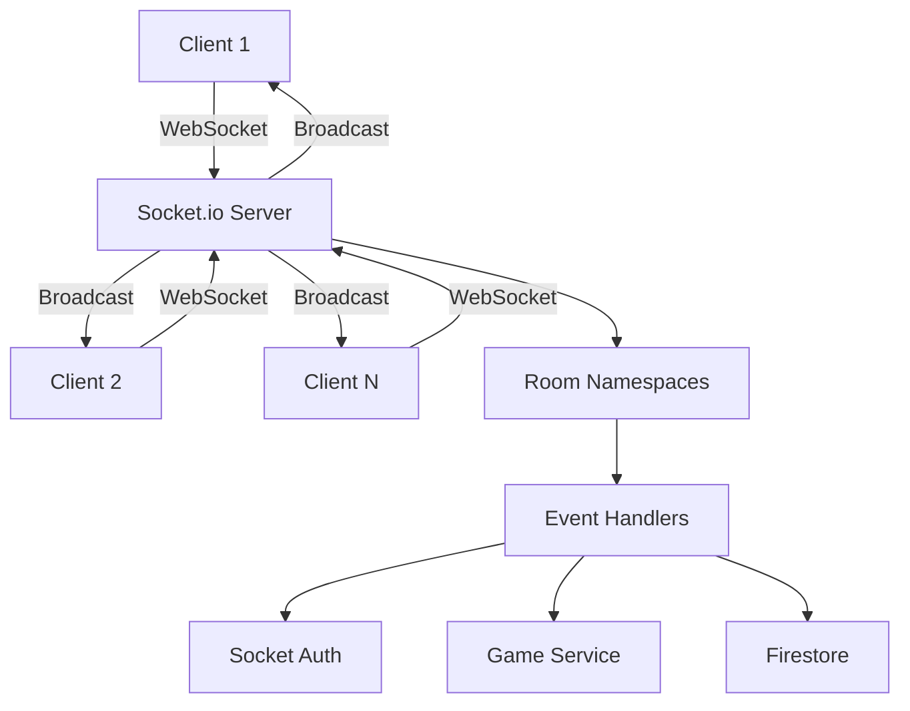
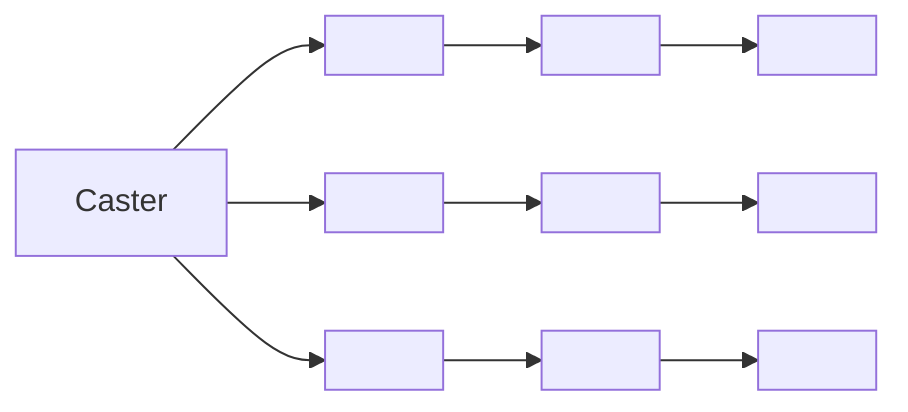
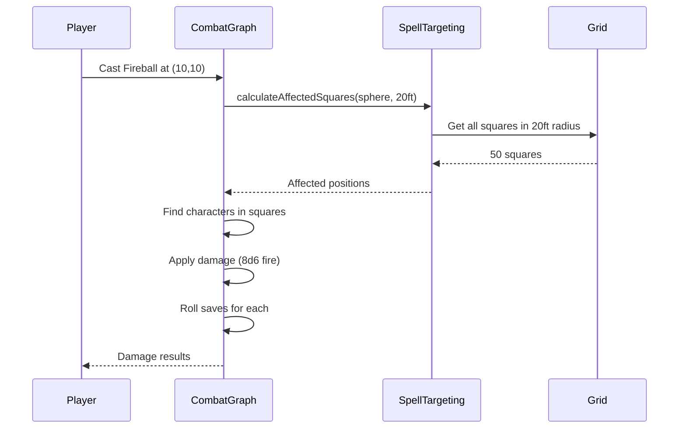

File: .eslintrc.json
""""""
{
"parser": "@typescript-eslint/parser",
"parserOptions": {
"ecmaVersion": 2022,
"sourceType": "module"
},
"extends": ["airbnb-base", "plugin:@typescript-eslint/recommended", "prettier"],
"plugins": ["@typescript-eslint"],
"env": {
"node": true,
"es2022": true
},
"rules": {
"max-len": [
"error",
{ "code": 140, "ignoreComments": true, "ignoreStrings": true, "ignoreTemplateLiterals": true }
],
"no-console": "off",
"import/prefer-default-export": "off",
"import/extensions": "off",
"class-methods-use-this": "off",
"@typescript-eslint/no-explicit-any": "error",
"@typescript-eslint/no-unsafe-member-access": "off",
"@typescript-eslint/no-unsafe-argument": "off",
"@typescript-eslint/no-unsafe-assignment": "off",
"@typescript-eslint/no-unsafe-enum-comparison": "off",
"@typescript-eslint/restrict-template-expressions": "off",
"@typescript-eslint/require-await": "off",
"@typescript-eslint/no-redundant-type-constituents": "off",
"complexity": ["warn", 25],
"max-lines-per-function": ["warn", { "max": 200, "skipBlankLines": true, "skipComments": true }],
"max-lines": ["warn", { "max": 500, "skipBlankLines": true, "skipComments": true }],
"max-classes-per-file": "off",
"no-plusplus": "off",
"default-param-last": "off",
"no-restricted-syntax": "off",
"no-await-in-loop": "off",
"no-shadow": "off",
"@typescript-eslint/no-shadow": [
"error",
{ "ignoreTypeValueShadow": true, "ignoreFunctionTypeParameterNameValueShadow": true }
],
"@typescript-eslint/no-unused-vars": ["error", { "argsIgnorePattern": "^_", "varsIgnorePattern": "^_" }]
},
"ignorePatterns": ["dist", "node_modules", "*.config.js", "**/__tests__/**"],
"settings": {
"import/resolver": {
"typescript": {
"project": "./tsconfig.json"
}
}
}
}
""""""

File: .gitignore
""""""

# Dependencies

node_modules/
yarn.lock
package-lock.json

# Build output

dist/
build/
\*.tsbuildinfo

# Environment

.env
.env.local
.env.\*.local

# Logs

logs/
_.log
npm-debug.log_
yarn-debug.log*
yarn-error.log*

# Testing

coverage/
.nyc_output/

# IDE

.vscode/
.idea/
_.swp
_.swo
\*~

# OS

.DS_Store
Thumbs.db

# Firebase

.firebase/
firebase-debug.log
firestore-debug.log

""""""

File: Dockerfile
""""""

# Multi-stage build for production

# Stage 1: Build

FROM node:20-alpine AS builder

WORKDIR /app

# Copy package files

COPY package.json yarn.lock ./

# Install dependencies

RUN yarn install --frozen-lockfile

# Copy source

COPY . .

# Build TypeScript

RUN yarn build

# Stage 2: Production

FROM node:20-alpine

WORKDIR /app

# Copy package files

COPY package.json yarn.lock ./

# Install production dependencies only

RUN yarn install --frozen-lockfile --production

# Copy built files from builder

COPY --from=builder /app/dist ./dist

# Set environment

ENV NODE_ENV=production
ENV PORT=8080

# Expose port

EXPOSE 8080

# Health check

HEALTHCHECK --interval=30s --timeout=3s --start-period=5s --retries=3 \
 CMD node -e "require('http').get('http://localhost:8080/health', (r) => process.exit(r.statusCode === 200 ? 0 : 1))"

# Start server

CMD ["node", "dist/server.js"]

""""""

File: GRAPH_ARCHITECTURE.md
""""""

# Graph Architecture Documentation

This document provides a comprehensive overview of the LangGraph-based game orchestration system in D20 AI.

## Table of Contents

1. [Overview](#overview)
2. [Gameplay Graph](#gameplay-graph)
3. [Combat Graph](#combat-graph)
4. [State Management](#state-management)
5. [Nodes](#nodes)
6. [Tool Calls](#tool-calls)
7. [Flow Diagrams](#flow-diagrams)

## Overview

D20 AI uses **LangGraph** as its core orchestration engine for managing game state and flow. The system is built around two main graphs:

- **Gameplay Graph** (`src/graph/gameplay-graph.ts`): Manages narrative gameplay
- **Combat Graph** (`src/combat/graph.ts`): Manages tactical combat with time-travel

Both graphs use deterministic execution patterns to ensure reproducible gameplay and support features like time-travel in combat.

## Gameplay Graph

### Purpose

Orchestrates turn-based narrative gameplay where players interact with the world, NPCs, and each other through natural language actions.

### Graph Structure

```
START
  ↓
combat_check ←────┐
  ↓               │
  ├─ (has actions?) → turn_processing ─┘
  │
  └─ (no actions/waiting) → END
```

### Nodes

#### 1. combat_check (Combat Coordinator Node)

**File**: `src/graph/nodes/combat-coordinator.ts`

**Purpose**: Acts as a state validator and flow controller

**Inputs**: Full GameplayState

**Outputs**:

- `waitingForAction: boolean` - Signals if graph should pause
- Potentially modified state based on combat triggers

**Logic**:

1. Checks if players have submitted actions
2. Evaluates if combat should be triggered (future feature)
3. Sets `waitingForAction` flag appropriately

#### 2. turn_processing (Turn Processing Node)

**File**: `src/graph/nodes/turn-processing.ts`

**Purpose**: Processes player actions and generates DM responses

**Inputs**:

- GameplayState with player actions
- Language setting from room

**Outputs**:

- New messages (summary + player perspectives)
- Updated players with cleared actions

**Logic**:

1. Collects all player action messages
2. Calls processTurn service with LLM
3. Generates:
   - Overall summary for all players
   - Individual perspectives for each player (private messages)
4. Clears player actions after processing

**LLM Integration**:

- Uses structured output with Zod schema
- Calls tools for dice rolls, checks, etc.
- Injects language-specific prompts

### State Flow

```typescript
// Initial state (players submitted actions)
{
  roomId: "abc123",
  players: [
    { id: "p1", action: "I search the room", ... },
    { id: "p2", action: "I examine the door", ... }
  ],
  messages: [...previous messages],
  waitingForAction: false
}

// After turn_processing
{
  roomId: "abc123",
  players: [
    { id: "p1", action: null, ... },  // Cleared
    { id: "p2", action: null, ... }   // Cleared
  ],
  messages: [
    ...previous,
    { sender: "Player1", text: "I search the room" },
    { sender: "Player2", text: "I examine the door" },
    { sender: "DM", text: "As you search...", recipientId: null },
    { sender: "DM", text: "You notice...", recipientId: "p1" },
    { sender: "DM", text: "The door feels...", recipientId: "p2" }
  ],
  waitingForAction: true  // Set by combat_check on next iteration
}
```

## Combat Graph

### Purpose

Manages tactical grid-based combat with deterministic dice rolling and time-travel capabilities.

### Graph Structure

```
START
  ↓
initiative
  ↓
turn_start ←──────┐
  ↓               │
  ├─ (combat over?) → END
  │
  └─ (active) → action_selection
                    ↓
                turn_end ─┘
```

### Key Features

#### Deterministic Dice Rolling

- Uses seeded random number generator
- All rolls are reproducible with the same seed
- Enables time-travel by replaying from a seed

#### Combat Session

```typescript
class CombatSession {
  - state: CombatState
  - diceRoller: DiceRoller (seeded)
  - stateHistory: Array<snapshot>

  // Methods
  - startCombat(characters)
  - moveCharacter(id, position)
  - attack(attacker, defender, options)
  - endTurn()
  - restoreState(historyIndex)  // Time-travel
  - forkFromState(historyIndex)  // Branch timeline
}
```

### Nodes

#### 1. initiative (Initiative Node)

**File**: `src/combat/nodes/InitiativeNode.ts`

**Purpose**: Rolls initiative for all characters and establishes turn order

**Inputs**: Array of CombatCharacters

**Outputs**:

- `turnOrder`: Sorted array of character IDs
- `round`: Set to 1
- `phase`: Set to 'in_progress'

**Logic**:

1. Roll d20 + Dexterity modifier for each character
2. Sort by initiative (highest first)
3. Set first character as active

#### 2. turn_start (Turn Start Node)

**File**: `src/combat/nodes/TurnStartNode.ts`

**Purpose**: Begins a character's turn

**Outputs**:

- Increment round if first character in turn order
- Add turn start log entry

#### 3. turn_end (Turn End Node)

**File**: `src/combat/nodes/TurnEndNode.ts`

**Purpose**: Ends a character's turn and advances to next

**Outputs**:

- `activeCharacterId`: Next character in turn order
- `isCombatOver`: true if all enemies/players defeated
- `winner`: 'player' or 'enemy' if combat over

#### 4. move (Move Node)

**File**: `src/combat/nodes/MoveNode.ts`

**Purpose**: Moves a character on the combat grid

**Inputs**:

- Character ID
- Target position (x, y)

**Outputs**:

- Updated character position
- Movement cost (based on difficult terrain, etc.)
- Opportunity attack triggers

#### 5. attack (Attack Node)

**File**: `src/combat/nodes/AttackNode.ts`

**Purpose**: Resolves an attack action

**Inputs**:

- Attacker ID
- Defender ID
- Weapon damage notation
- Attack options (finesse, ranged, etc.)

**Outputs**:

- Attack roll result
- Damage dealt
- Updated HP
- Combat log entry

**Logic**:

1. Roll attack: d20 + attack bonus
2. Compare to defender's AC
3. If hit, roll damage dice
4. Apply damage to defender
5. Check if defender drops to 0 HP

## State Management

### Gameplay State Schema

```typescript
const GameplayStateSchema = z.object({
  roomId: z.string(),
  ownerId: z.string(),
  phase: z.enum(['SETUP', 'CHARACTER_CREATION', 'GAMEPLAY', 'COMBAT']),
  settings: WorldSettingsSchema.nullable(),
  worldDescription: z.string(),
  language: z.enum(['en', 'es', 'pt-BR']),

  players: z.array(PlayerSchema),
  messages: z.array(MessageSchema),
  creatures: z.array(CreatureSchema),

  waitingForAction: z.boolean(),
});
```

### Combat State Schema

```typescript
const CombatStateSchema = z.object({
  sessionId: z.string(),
  characters: z.array(CombatCharacterSchema),

  turnOrder: z.array(z.string()), // Character IDs in order
  activeCharacterId: z.string().nullable(),
  round: z.number(),

  gridWidth: z.number(),
  gridHeight: z.number(),

  phase: z.enum(['setup', 'in_progress', 'complete']),
  isCombatOver: z.boolean(),
  winner: z.enum(['player', 'enemy']).nullable(),

  log: z.array(CombatLogEntrySchema),
  diceHistory: z.array(DiceRollSchema),
  diceRollerSeed: z.number(),

  pendingOpportunityAttacks: z.array(OpportunityAttackSchema),
});
```

## Nodes

All nodes follow this pattern:

```typescript
async function myNode(state: GameState, config?: LangGraphRunnableConfig): Promise<Partial<GameState>> {
  // 1. Read from state
  const { players, messages } = state;

  // 2. Perform logic
  const result = await someOperation();

  // 3. Return partial state update
  return {
    messages: [...messages, newMessage],
    someField: updatedValue,
  };
}
```

### Important Patterns

#### State Reducers

Messages use append-only reducer:

```typescript
messages: z.array(MessageSchema).register(registry, {
  reducer: {
    fn: (existing, newMessages) => existing.concat(newMessages),
  },
  default: () => [],
});
```

Players use upsert reducer (by ID):

```typescript
players: z.array(PlayerSchema).register(registry, {
  reducer: {
    fn: (existing, updates) => {
      const playerMap = new Map(existing.map((p) => [p.id, p]));
      updates.forEach((update) => playerMap.set(update.id, update));
      return Array.from(playerMap.values());
    },
  },
  default: () => [],
});
```

#### Task Wrapping

All non-deterministic operations MUST be wrapped in `task()`:

```typescript
import { task } from '@langchain/langgraph';

const processTurnTask = task('processGameTurn', async (params) => {
  return await processTurnService(...params);
});

// In node
async function myNode(state) {
  const result = await processTurnTask(state.params);
  return { result };
}
```

## Tool Calls

Tools are exposed to the LLM for game mechanics:

### Available Tools

- `roll_dice`: Roll any dice notation (1d20, 2d6+3, etc.)
- `attribute_check`: Make attribute check (d20 + modifier vs DC)
- `saving_throw`: Make saving throw
- `attack_roll`: Make attack roll
- `deal_damage`: Roll and apply damage

### Tool Notification System

When tools are called:

1. Backend logs tool call with parameters and result
2. Socket emits `tool:calls` event to room
3. Frontend displays toast notification
4. Full history available in ToolsPanel

## Flow Diagrams

### Complete Turn Processing Flow

```
Player submits action
      ↓
Socket handler receives action
      ↓
Update Firestore player.action
      ↓
Emit room:updated event
      ↓
Check if all players have actions
      ↓
   YES → Invoke gameplay graph
      ↓
Graph: START → combat_check
      ↓
combat_check: Has actions?
      ↓
   YES → turn_processing
      ↓
turn_processing:
  - Build context (messages, players, world)
  - Call processTurn with LLM
  - LLM may call tools (roll_dice, etc.)
  - Generate structured response:
      * overall_summary
      * player_perspectives[]
  - Create message objects
  - Clear player actions
      ↓
Loop to combat_check
      ↓
combat_check: Has actions?
      ↓
   NO → Set waitingForAction = true
      ↓
Graph: END
      ↓
Socket: Emit tool:calls (if any)
Socket: Emit turn:complete
      ↓
Frontend: Update UI
Frontend: Show tool notifications
```

### Combat Session Flow

```
DM triggers combat
      ↓
Create CombatSession(seed)
      ↓
session.startCombat(characters)
      ↓
Initiative rolls (deterministic)
      ↓
Turn order established
      ↓
┌─────────────────────┐
│  Active Character   │
│       Turn          │
└─────────────────────┘
      ↓
Player/DM chooses action:
  - Move
  - Attack
  - Cast Spell
  - End Turn
      ↓
Execute action node
      ↓
Record in state history
      ↓
session.endTurn()
      ↓
Next character active
      ↓
Check if combat over
      ↓
   NO → Loop to next turn
   YES → Determine winner
      ↓
Return to gameplay
```

### Time-Travel in Combat

```
Combat in progress
  Round 3, Character 2
      ↓
Player: "I want to go back to Round 2"
      ↓
session.getHistory()
  → Returns all state snapshots
      ↓
session.restoreState(historyIndex: 5)
  → Loads state from snapshot 5
  → Resets dice roller to that seed
      ↓
Combat continues from Round 2
  All subsequent rolls deterministic
```

## Summary

The D20 AI graph architecture provides:

- **Deterministic execution** via task wrapping and seeded dice
- **Persistent state** via Firestore checkpointing
- **Real-time updates** via Socket.io events
- **Tool transparency** via notification system
- **Time-travel** in combat sessions
- **Multi-language support** via language injection in prompts

For more details on LangGraph patterns, see `LANGGRAPH_GUIDE.md`.
""""""

File: LANGGRAPH_GUIDE.md
""""""

# LangGraph Usage Guide for D20 AI

This guide explains how we use LangGraph v1 in the D20 AI project for game orchestration and combat management.

## Table of Contents

1. [Overview](#overview)
2. [Architecture](#architecture)
3. [Core Patterns](#core-patterns)
4. [Combat System](#combat-system)
5. [Determinism & Time-Travel](#determinism--time-travel)
6. [Best Practices](#best-practices)

## Overview

D20 AI uses **LangGraph v1** as the backbone for stateful game orchestration. The system is built on two main graphs:

- **Game Graph** (`src/graph/game-graph.ts`): Manages overall game flow (world generation, character creation, gameplay, combat)
- **Combat Graph** (`src/combat/graph.ts`): Manages tactical combat with time-travel and deterministic dice rolling

### Why LangGraph?

LangGraph provides critical features for D&D gameplay:

- **Durable execution**: Game state persists through failures
- **Checkpointing**: Every game state is saved for recovery and time-travel
- **Human-in-the-loop**: Combat requires player input at each turn
- **Streaming**: Real-time updates to players via Socket.io
- **Deterministic replay**: Combat can be rewound and replayed exactly

## Architecture

### State Management

All game state is defined using **Zod schemas** in `src/graph/state.ts`:

```typescript
import { GameStateSchema } from '@/graph/state';
import { StateGraph } from '@langchain/langgraph';

const graph = new StateGraph(GameStateSchema).addNode('my_node', nodeFunction).compile({ checkpointer });
```

### State Schema Structure

```typescript
const GameStateSchema = z.object({
  roomId: z.string(),
  phase: z.enum(['SETUP', 'CHARACTER_CREATION', 'GAMEPLAY', 'COMBAT']),
  players: z.array(PlayerSchema).register(registry, { reducer: ... }),
  messages: z.array(MessageSchema).register(registry, { reducer: ... }),
  combatState: CombatStateSchema.nullable(),
  // ... more fields
});
```

### Reducers

We use **reducers** to control how state updates are applied:

```typescript
// Append-only messages
messages: z.array(MessageSchema).register(registry, {
  reducer: {
    fn: (existing, newMessages) => existing.concat(newMessages),
  },
  default: () => [],
}),

// Upsert players by ID
players: z.array(PlayerSchema).register(registry, {
  reducer: {
    fn: (existing, updates) => {
      const playerMap = new Map(existing.map(p => [p.id, p]));
      updates.forEach(update => playerMap.set(update.id, update));
      return Array.from(playerMap.values());
    },
  },
  default: () => [],
}),
```

## Core Patterns

### Pattern 1: Nodes as State Transformers

Nodes receive state and return partial updates:

```typescript
export async function worldGenerationNode(state: GameState): Promise<Partial<GameState>> {
  const worldDescription = await generateWorldTask({
    theme: state.settings.theme,
    // ... other params
  });

  return {
    worldDescription,
    phase: 'CHARACTER_CREATION', // Transition to next phase
  };
}
```

### Pattern 2: Tasks for Determinism

**CRITICAL**: Wrap all LLM calls and dice rolls in `task()` for deterministic replay:

```typescript
import { task } from '@langchain/langgraph';

// ✅ CORRECT: LLM call wrapped in task
const generateWorldTask = task('generateWorld', async (params: WorldParams): Promise<string> => {
  return await generateText(systemPrompt, userPrompt, params.language);
});

// ❌ WRONG: Direct LLM call in node
async function worldGenerationNode(state: GameState) {
  // This will break time-travel/replay!
  const result = await generateText(system, prompt, lang);
  return { worldDescription: result };
}
```

### Why Tasks Matter

When you resume a workflow (e.g., after an interrupt or error):

- LangGraph re-executes the node **from the beginning**
- Tasks that already ran are **retrieved from checkpoints** instead of re-executed
- This ensures **deterministic replay** and **idempotency**

### Pattern 3: Conditional Edges for Routing

```typescript
.addConditionalEdges(START, (state) => {
  switch (state.phase) {
    case 'SETUP':
      return 'world_generation';
    case 'CHARACTER_CREATION':
      return 'character_openings';
    case 'GAMEPLAY':
    case 'COMBAT':
      return 'combat_check';
    default:
      return 'combat_check';
  }
})
```

### Pattern 4: Checkpointing with Firestore

We implemented a custom `FirestoreCheckpointer` that persists state to Firestore:

```typescript
import { FirestoreCheckpointer } from '@/graph/firestore-checkpointer';

const checkpointer = new FirestoreCheckpointer();
const graph = builder.compile({ checkpointer });
```

**Storage location**: `rooms/{roomId}/checkpoints/{checkpoint_id}`

**Thread ID = Room ID**: Each game room is a separate thread

```typescript
await graph.invoke(input, {
  configurable: {
    thread_id: roomId, // Room ID is the thread
  },
});
```

## Combat System

### Combat as Tools for DM Agent

Combat actions are exposed as **LangChain tools** that the DM (LLM) can call:

```typescript
import { combatTools } from '@/combat/tools';

const tools = [
  ...combatTools, // start_combat, combat_attack, combat_move, end_turn, end_combat
  ...otherDMTools,
];

const dmAgent = model.bindTools(tools);
```

### Combat Tool Pattern

Each tool wraps combat graph operations:

```typescript
export const attackTool = tool(
  async (input, config) => {
    const roomId = config.configurable?.roomId;
    const session = getCombatSession(roomId);

    // Execute attack via combat session
    const updatedState = await session.attack(input.attackerId, input.targetId, { weaponDamage: input.weaponDamage });

    // Return Command to update game state
    return new Command({
      update: {
        combatState: updatedState,
      },
    });
  },
  { name: 'combat_attack', schema: AttackSchema }
);
```

### Deterministic Combat

Combat uses **seeded dice rolling** to ensure deterministic results:

```typescript
import { DiceRoller } from '@/combat/dice';

// Create roller with seed
const diceRoller = new DiceRoller({ seed: 42, enableHistory: true });

// All rolls are deterministic
const attack1 = diceRoller.rollAttack(5); // Always same result with seed 42
const damage1 = diceRoller.rollDamage('1d8', 3);

// History is tracked
const history = diceRoller.getHistory(); // All rolls preserved
```

### Time-Travel in Combat

Combat sessions maintain full state history:

```typescript
const session = createCombatSession('session-id', seed);

// Execute combat actions
await session.startCombat(characters);
await session.attack('fighter-1', 'goblin-1');

// Get history
const history = session.getHistory();

// Restore to previous state
await session.restoreState(historyIndex);

// Fork from a state (creates new branch)
await session.forkFromState(historyIndex);
```

## Determinism & Time-Travel

### Critical Rules for Determinism

#### Rule 1: Wrap Non-Deterministic Operations

```typescript
// ✅ CORRECT
const rollDiceTask = task('rollDice', async (notation: string) => {
  const roller = new DiceRoller({ seed: Date.now() });
  return roller.roll(notation);
});

// ❌ WRONG
async function myNode(state) {
  const roller = new DiceRoller({ seed: Date.now() }); // Different each time!
  const result = roller.roll('1d20');
  return { result };
}
```

#### Rule 2: Use Idempotent Operations Before Interrupts

If you place side effects before an interrupt, they must be idempotent:

```typescript
// ✅ GOOD: Idempotent upsert
async function approvalNode(state) {
  await db.upsertRecord({ id: state.id, status: 'pending' });
  const approved = interrupt('Approve?');
  return { approved };
}

// ❌ BAD: Non-idempotent create
async function approvalNode(state) {
  await db.createRecord({ status: 'pending' }); // Duplicate on resume!
  const approved = interrupt('Approve?');
  return { approved };
}
```

#### Rule 3: Do Not Wrap `interrupt()` in try/catch

```typescript
// ✅ CORRECT
async function reviewNode(state) {
  const review = interrupt('Please review');
  try {
    await saveToDatabase(review);
  } catch (err) {
    console.error(err);
  }
  return { review };
}

// ❌ WRONG
async function reviewNode(state) {
  try {
    const review = interrupt('Please review'); // Will catch interrupt exception!
  } catch (err) {
    console.error(err);
  }
  return {};
}
```

### State Streaming

Stream state updates to clients in real-time:

```typescript
import { streamGameGraph } from '@/graph/game-graph';

for await (const [mode, chunk] of streamGameGraph(roomId, input)) {
  if (mode === 'updates') {
    io.to(roomId).emit('game:state_update', chunk);
  }
  if (mode === 'custom') {
    io.to(roomId).emit('game:custom_event', chunk);
  }
}
```

### Custom Streaming from Nodes

Emit custom data during execution:

```typescript
import { LangGraphRunnableConfig } from '@langchain/langgraph';

async function processTurnNode(state: GameState, config: LangGraphRunnableConfig): Promise<Partial<GameState>> {
  config.writer?.('Processing player actions...'); // Custom event

  const result = await llmTask(state.playerActions);

  config.writer?.({ type: 'progress', value: 100 }); // Custom event

  return { messages: result };
}
```

## Best Practices

### 1. Always Use Thread IDs

Every graph invocation must include a thread ID (room ID):

```typescript
await graph.invoke(input, {
  configurable: {
    thread_id: roomId,
  },
});
```

### 2. Use Partial State Updates

Nodes only return fields they modify:

```typescript
// ✅ CORRECT
return {
  messages: newMessages,
  phase: 'GAMEPLAY',
};

// ❌ WRONG
return {
  ...state,
  messages: newMessages,
  phase: 'GAMEPLAY',
};
```

### 3. Handle Errors in Nodes

```typescript
async function myNode(state: GameState): Promise<Partial<GameState>> {
  try {
    const result = await someTask();
    return { result };
  } catch (error) {
    logger.error('Error in node:', error);
    return {
      messages: [
        {
          id: `error-${Date.now()}`,
          sender: 'DM',
          text: 'An error occurred. Please try again.',
          timestamp: Date.now(),
        },
      ],
    };
  }
}
```

### 4. Test with Fixed Seeds

Always test combat/dice logic with fixed seeds:

```typescript
it('should produce deterministic results', () => {
  const session1 = createCombatSession('test', 42);
  const session2 = createCombatSession('test', 42);

  const state1 = await session1.startCombat(characters);
  const state2 = await session2.startCombat(characters);

  expect(state1.turnOrder).toEqual(state2.turnOrder);
});
```

### 5. Use Type Guards

```typescript
export function hasActiveCombat(state: GameState): boolean {
  return state.combatState !== null && !state.combatState.isCombatOver;
}

export function isInCombat(state: GameState): boolean {
  return state.phase === 'COMBAT';
}
```

## Common Pitfalls

### Pitfall 1: Forgetting to Wrap LLM Calls

```typescript
// ❌ BREAKS TIME-TRAVEL
async function dmNode(state) {
  const response = await llm.invoke(prompt); // Not wrapped!
  return { response };
}

// ✅ CORRECT
const generateResponseTask = task('generateResponse', async (prompt) => {
  return await llm.invoke(prompt);
});

async function dmNode(state) {
  const response = await generateResponseTask(state.prompt);
  return { response };
}
```

### Pitfall 2: Mutating State

```typescript
// ❌ WRONG
function myNode(state: GameState) {
  state.messages.push(newMessage); // Mutation!
  return state;
}

// ✅ CORRECT
function myNode(state: GameState) {
  return {
    messages: [...state.messages, newMessage],
  };
}
```

### Pitfall 3: Non-Serializable State

```typescript
// ❌ WRONG
return {
  callback: () => console.log('hi'), // Functions not serializable!
  instance: new MyClass(), // Class instances not serializable!
};

// ✅ CORRECT
return {
  result: 'hi',
  data: { key: 'value' },
};
```

## Example: Complete Combat Flow

```typescript
import { invokeGameGraph } from '@/graph/game-graph';
import { getCombatSession } from '@/combat/tools';

// 1. Player submits "I attack the goblin"
const gameState = await invokeGameGraph(roomId, {
  ...currentState,
  players: updatedPlayersWithActions,
});

// 2. DM agent processes turn, detects combat
// 3. DM calls start_combat tool
// Tool creates combat session and updates state

// 4. Combat session manages tactical grid
const session = getCombatSession(roomId);
await session.startCombat(characters);

// 5. Players take tactical actions
await session.attack('fighter-1', 'goblin-1', {
  weaponDamage: '1d8',
  damageType: 'slashing',
});

// 6. State is checkpointed after each action

// 7. Time-travel available
const history = session.getHistory();
await session.restoreState(previousIndex);

// 8. Combat ends, state returns to game graph
const finalState = await invokeGameGraph(roomId, {
  phase: 'GAMEPLAY',
  combatState: null,
});
```

## Reference

### Key LangGraph Concepts

- **StateGraph**: Main graph class, parameterized by state schema
- **task()**: Wraps functions for checkpointing and determinism
- **Nodes**: Functions that transform state
- **Edges**: Define control flow between nodes
- **Checkpointer**: Persists state for durability
- **Thread ID**: Unique identifier for a workflow instance (room ID)

### Key Files

- `src/graph/state.ts`: All Zod schemas
- `src/graph/game-graph.ts`: Main game orchestration
- `src/graph/firestore-checkpointer.ts`: Persistence layer
- `src/graph/nodes/*.ts`: Individual graph nodes
- `src/combat/graph.ts`: Combat-specific graph
- `src/combat/tools.ts`: Combat tools for DM agent
- `src/combat/dice.ts`: Deterministic dice roller

### Further Reading

For more LangGraph patterns and examples, see:

- LangGraph JS Documentation: https://langchain-ai.github.io/langgraphjs/
- Durable Execution: https://langchain-ai.github.io/langgraphjs/concepts/durable_execution
- Human-in-the-Loop: https://langchain-ai.github.io/langgraphjs/concepts/interrupts
- Streaming: https://langchain-ai.github.io/langgraphjs/concepts/streaming
- Time Travel: https://langchain-ai.github.io/langgraphjs/how-tos/time-travel

## Debugging

### Enable LangSmith Tracing

```typescript
process.env.LANGCHAIN_TRACING_V2 = 'true';
process.env.LANGCHAIN_API_KEY = 'your-api-key';
```

### View Checkpoints

```typescript
const state = await graph.getState({ configurable: { thread_id: roomId } });
console.log(state.values); // Current state
console.log(state.next); // Next nodes to execute

// View history
for await (const checkpoint of graph.getStateHistory({ configurable: { thread_id: roomId } })) {
  console.log(checkpoint.values);
}
```

### Inspect Combat State

```typescript
const session = getCombatSession(roomId);
const state = session.getState();
const history = session.getHistory();
const diceHistory = session.getDiceHistory();

console.log('Active character:', session.getActiveCharacter());
console.log('Combat log:', session.getLog());
```

## Summary

LangGraph enables D20 AI to provide:

- **Persistent game state** across sessions
- **Deterministic combat** with time-travel
- **Tool-based combat** for LLM agents
- **Streaming updates** for real-time gameplay
- **Checkpointing** for recovery and exploration

Always remember: **Wrap LLM calls and dice rolls in `task()`** to maintain determinism!
""""""

File: README.md
""""""

# Daicer Backend

Multiplayer D&D dungeon master backend built with Express, Socket.io, Firebase, and LangChain.

## Architecture



## Project Structure

```
backend/
├── src/
│   ├── api/           # REST API endpoints
│   ├── socket/        # Socket.io event handlers
│   ├── services/      # Business logic (Firebase, LLM, Game)
│   ├── middleware/    # Express middleware (auth, validation, error)
│   ├── types/         # TypeScript type definitions
│   ├── utils/         # Helper functions
│   ├── config/        # Configuration (Firebase, LangChain)
│   └── server.ts      # Entry point
├── tests/             # Test files
├── Dockerfile         # Container definition
└── cloudbuild.yaml    # Cloud Build config
```

## Local Development

### Prerequisites

- Node.js 20+
- Yarn
- Firebase CLI
- Docker (optional)

### Setup

1. Install dependencies:

```bash
yarn install
```

2. Configure environment:

```bash
cp .env.example .env.local
# Edit .env.local with your values
```

3. Start Firebase emulators (Terminal 1):

```bash
cd ..
yarn emulators
```

4. Start backend (Terminal 2):

```bash
yarn dev
```

Backend runs on `http://localhost:3001`

### With Docker

```bash
docker-compose up backend
```

## Available Scripts

- `yarn dev` - Start development server with hot reload
- `yarn build` - Build for production
- `yarn start` - Start production server
- `yarn lint` - Lint code
- `yarn lint:fix` - Fix linting issues
- `yarn format` - Format code with Prettier
- `yarn test` - Run tests
- `yarn test:watch` - Run tests in watch mode
- `yarn test:coverage` - Generate coverage report
- `yarn typecheck` - Type-check without emitting

## API Endpoints

### Health

- `GET /health` - Health check

### Rooms

- `POST /api/rooms` - Create new room
- `POST /api/rooms/:code/join` - Join room by code
- `GET /api/rooms/:roomId` - Get room state
- `PATCH /api/rooms/:roomId/settings` - Update settings (owner only)
- `DELETE /api/rooms/:roomId` - Delete room (owner only)

### Game

- `POST /api/game/:roomId/world` - Generate world (owner only)
- `POST /api/game/:roomId/character` - Add character
- `POST /api/game/:roomId/turn` - Process turn

## Socket.io Events

### Client → Server

- `room:join` - Join room
- `room:leave` - Leave room
- `player:action` - Submit player action
- `turn:process` - Request turn processing

### Server → Client

- `room:updated` - Room state changed
- `player:joined` - Player joined
- `player:left` - Player left
- `game:state` - Full game state sync
- `error` - Error occurred

## Testing

```bash
# Unit tests
yarn test

# With coverage
yarn test:coverage

# CI mode
yarn test:ci
```

Tests use Firebase emulators automatically.

## Deployment

### Cloud Run

```bash
# Build
gcloud builds submit --config cloudbuild.yaml

# Deploy
gcloud run deploy daicer-backend \
  --image gcr.io/PROJECT_ID/daicer-backend \
  --region us-central1 \
  --allow-unauthenticated
```

### Environment Variables

Set via Secret Manager:

- `GEMINI_API_KEY`
- `OPENAI_API_KEY`
- `ANTHROPIC_API_KEY`
- `FIREBASE_PRIVATE_KEY`

## Code Quality

- **Linting:** ESLint (Airbnb TypeScript config)
- **Formatting:** Prettier
- **Type Safety:** Strict TypeScript, no `any`
- **Testing:** Jest with 80%+ coverage
- **Standards:**
  - Max function length: 25 lines
  - Max file length: 200 lines
  - Complexity: < 10
  - All exports have JSDoc

## License

MIT
""""""

File: cloudbuild.yaml
""""""

# Cloud Build configuration for backend deployment

steps:

# Build the container image

- name: 'gcr.io/cloud-builders/docker'
  args:
  - 'build'
  - '-t'
  - 'gcr.io/$PROJECT_ID/daicer-backend:$COMMIT_SHA'
  - '-t'
  - 'gcr.io/$PROJECT_ID/daicer-backend:latest'
  - '.'
    dir: 'backend'

# Push the container image to Container Registry

- name: 'gcr.io/cloud-builders/docker'
  args:
  - 'push'
  - 'gcr.io/$PROJECT_ID/daicer-backend:$COMMIT_SHA'

- name: 'gcr.io/cloud-builders/docker'
  args:
  - 'push'
  - 'gcr.io/$PROJECT_ID/daicer-backend:latest'

# Deploy container image to Cloud Run

- name: 'gcr.io/google.com/cloudsdktool/cloud-sdk'
  entrypoint: gcloud
  args:
  - 'run'
  - 'deploy'
  - 'daicer-backend'
  - '--image'
  - 'gcr.io/$PROJECT_ID/daicer-backend:$COMMIT_SHA'
  - '--region'
  - 'us-central1'
  - '--platform'
  - 'managed'
  - '--allow-unauthenticated'
  - '--set-env-vars'
  - 'NODE_ENV=production'
  - '--set-secrets'
  - 'GEMINI_API_KEY=GEMINI_API_KEY:latest,FIREBASE_PRIVATE_KEY=FIREBASE_PRIVATE_KEY:latest'

images:

- 'gcr.io/$PROJECT_ID/daicer-backend:$COMMIT_SHA'
- 'gcr.io/$PROJECT_ID/daicer-backend:latest'

timeout: 1200s

""""""

File: convert-to-json.js
""""""
#!/usr/bin/env node
/\*\*

- Convert TypeScript game data files to JSON
  \*/

const fs = require('fs');
const path = require('path');

const dataDir = path.join(\_\_dirname, 'data/game-data');

// Mapping of file names to their exported constant names
const fileToConstant = {
'character-abilities.ts': 'ABILITIES',
'character-alignments.ts': 'ALIGNMENTS',
'character-backgrounds.ts': 'BACKGROUNDS',
'character-classes.ts': 'CLASSES',
'character-races.ts': 'RACES',
'character-skills.ts': 'SKILLS',
'combat-conditions.ts': 'CONDITIONS',
'combat-damage-types.ts': 'DAMAGE_TYPES',
'equipment-categories.ts': 'EQUIPMENT_CATEGORIES',
'equipment-items.ts': ['COMMON_WEAPONS', 'COMMON_ARMOR'], // Special case: multiple exports
'equipment-weapon-properties.ts': 'WEAPON_PROPERTIES',
'magic-schools.ts': 'MAGIC_SCHOOLS',
'world-languages.ts': 'LANGUAGES',
};

function convertFile(filename, constantName) {
const tsPath = path.join(dataDir, filename);
const jsonFilename = filename.replace('.ts', '.json');
const jsonPath = path.join(dataDir, jsonFilename);

if (!fs.existsSync(tsPath)) {
console.log(`⚠️  Skipped ${filename} (not found)`);
return;
}

const content = fs.readFileSync(tsPath, 'utf8');

// Extract the array using regex
const pattern = new RegExp(
`export const ${constantName}[^=]*=\\s*\\[([\\s\\S]*?)\\]\\s*(?:as const)?;`,
'm'
);
const match = content.match(pattern);

if (!match) {
console.log(`❌ Failed to extract ${constantName} from ${filename}`);
return;
}

try {
// Parse the array content as JavaScript
const arrayContent = '[' + match[1] + ']';
const data = eval('(' + arrayContent + ')');

    fs.writeFileSync(jsonPath, JSON.stringify(data, null, 2));
    console.log(`✓ Converted ${filename} → ${jsonFilename}`);

} catch (error) {
console.log(`❌ Error parsing ${filename}:`, error.message);
}
}

// Special handler for equipment-items.ts (has two exports)
function convertEquipmentItems() {
const tsPath = path.join(dataDir, 'equipment-items.ts');
const content = fs.readFileSync(tsPath, 'utf8');

// Extract COMMON*WEAPONS
const weaponsMatch = content.match(/export const COMMON_WEAPONS[^=]*=\s*\[([\s\S]*?)\]\s*(?:as const)?;/m);
// Extract COMMON_ARMOR
const armorMatch = content.match(/export const COMMON_ARMOR[^=]*=\s*\[([\s\S]*?)\]\s\_(?:as const)?;/m);

if (weaponsMatch && armorMatch) {
try {
const weapons = eval('([' + weaponsMatch[1] + '])');
const armor = eval('([' + armorMatch[1] + '])');
const combined = [...weapons, ...armor];

      fs.writeFileSync(
        path.join(dataDir, 'equipment-items.json'),
        JSON.stringify(combined, null, 2)
      );
      console.log(`✓ Converted equipment-items.ts → equipment-items.json (merged weapons + armor)`);
    } catch (error) {
      console.log(`❌ Error parsing equipment-items.ts:`, error.message);
    }

}
}

console.log('🔄 Converting TypeScript game data to JSON...\n');

// Convert all files
for (const [filename, constantName] of Object.entries(fileToConstant)) {
if (Array.isArray(constantName)) {
// Special case for multiple exports
convertEquipmentItems();
} else {
convertFile(filename, constantName);
}
}

console.log('\n✅ Conversion complete!');

""""""

File: docs/graphs/combat-graph.mmd
""""""
graph TD
START([START]) --> initiative[Initiative]
initiative --> turn_start[Turn Start]
turn_start --> action_selection[Action Selection]
action_selection --> turn_end[Turn End]
turn_end --> turn_start
""""""

File: docs/graphs/gameplay-graph.mmd
""""""
graph TD
START([START]) --> combat_check
combat_check{Combat Check} -->|Yes| turn_processing[Turn Processing]
combat_check -->|No| END([END])
turn_processing --> combat_check
""""""

File: jest.config.js
""""""
export default {
preset: 'ts-jest/presets/default-esm',
testEnvironment: 'node',
extensionsToTreatAsEsm: ['.ts'],
moduleNameMapper: {
'^@/(._)$': '<rootDir>/src/$1',
'^(\\.{1,2}/._)\\.js$': '$1',
  },
  transform: {
    '^.+\\.ts$': [
'ts-jest',
{
useESM: true,
},
],
},
collectCoverageFrom: [
'src/**/*.ts',
'!src/**/*.spec.ts',
'!src/**/*.test.ts',
'!src/server.ts',
],
coverageThreshold: {
global: {
branches: 80,
functions: 80,
lines: 80,
statements: 80,
},
},
};

""""""

File: package.json
""""""
{
"name": "daicer-backend",
"version": "1.0.0",
"description": "Multiplayer D&D backend with Express, Socket.io, and Firebase for Daicer",
"type": "module",
"main": "dist/server.js",
"scripts": {
"dev": "echo '🚀 Starting backend dev server on http://localhost:3001' && tsx watch src/server.ts",
"build": "echo '📦 Building backend...' && tsc && echo '✅ Backend build complete! Output: dist/'",
"start": "echo '🌐 Starting production server...' && node dist/server.js",
"seed:gamedata": "echo '🌱 Seeding game data...' && tsx ../seeds/scripts/seed-game-data.ts && echo '✅ Game data seeded!'",
"seed:srd": "echo '📚 Seeding SRD rules...' && tsx ../seeds/scripts/seed-srd-rules.ts && echo '✅ SRD rules seeded!'",
"seed:spells": "echo '🔮 Seeding spells...' && tsx ../seeds/scripts/seed-spells.ts && echo '✅ Spells seeded!'",
"lint": "echo '🔍 Linting backend code...' && eslint . --ext .ts",
"lint:fix": "echo '🔧 Fixing linting issues...' && eslint . --ext .ts --fix && echo '✅ Linting complete!'",
"lint:check": "echo '🔍 Checking lint (CI mode)...' && eslint . --ext .ts --max-warnings 0",
"format": "echo '✨ Formatting backend code...' && prettier --write \"src/**/\*.ts\" && echo '✅ Formatting complete!'",
"format:check": "echo '🔍 Checking formatting...' && prettier --check \"src/**/\*.ts\"",
"typecheck": "echo '🔬 Type checking backend...' && NODE_OPTIONS='--max-old-space-size=8192' tsc --noEmit && echo '✅ Type check passed!'",
"test": "echo '🧪 Running backend tests...' && NODE_ENV=test jest",
"test:watch": "echo '👀 Running tests in watch mode...' && NODE_ENV=test jest --watch",
"test:coverage": "echo '📊 Running tests with coverage...' && NODE_ENV=test jest --coverage && echo '✅ Coverage report: coverage/index.html'",
"test:ci": "echo '🤖 Running tests (CI mode)...' && NODE_ENV=test jest --coverage --ci --maxWorkers=2",
"test:ui": "echo '⚠️ Backend uses Jest (no UI mode). Starting watch mode instead...' && yarn test:watch"
},
"dependencies": {
"@faker-js/faker": "^10.1.0",
"@langchain/core": "^1.0.4",
"@langchain/google-genai": "^1.0.0",
"@langchain/langgraph": "^1.0.1",
"@langchain/openai": "^1.1.0",
"cors": "^2.8.5",
"dotenv": "^16.6.1",
"express": "^4.21.2",
"firebase-admin": "^12.7.0",
"helmet": "^7.2.0",
"langchain": "^1.0.4",
"socket.io": "^4.8.1",
"uuid": "^13.0.0",
"winston": "^3.18.3",
"zod": "^4.1.12",
"zod-to-json-schema": "^3.24.6"
},
"devDependencies": {
"@types/cors": "^2.8.19",
"@types/express": "^4.17.25",
"@types/jest": "^29.5.14",
"@types/node": "^22.14.0",
"@types/supertest": "^6.0.3",
"@types/uuid": "^9.0.8",
"@typescript-eslint/eslint-plugin": "^7.18.0",
"@typescript-eslint/parser": "^7.18.0",
"eslint": "^8.57.1",
"eslint-config-airbnb-base": "^15.0.0",
"eslint-config-airbnb-typescript": "^18.0.0",
"eslint-import-resolver-typescript": "^4.4.4",
"eslint-plugin-import": "^2.29.1",
"husky": "^9.1.7",
"jest": "^29.7.0",
"prettier": "^3.2.5",
"supertest": "^6.3.4",
"ts-jest": "^29.1.2",
"tsx": "^4.20.6",
"typescript": "^5.8.3"
},
"engines": {
"node": ">=22.0.0"
}
}
""""""

File: src/api/README.md
""""""

# API Endpoints

REST API endpoints for D20 AI backend.

## Structure



## Files

- `rooms.ts` - Room management (create, join, update, delete)
- `game.ts` - Game logic (world generation, turn processing)
- `users.ts` - User profile management

## Endpoint Patterns

All endpoints follow RESTful conventions:

- `POST` - Create resources
- `GET` - Read resources
- `PATCH` - Update resources
- `DELETE` - Delete resources

## Error Responses

```typescript
{
  success: false,
  error: {
    message: string,
    stack?: string // Only in development
  }
}
```

## Success Responses

```typescript
{
  success: true,
  data: T
}
```

""""""

File: src/api/**tests**/game-data.test.ts
""""""
/\*\*

- Game Data API endpoint tests
  \*/

import { describe, test, expect, beforeAll, afterAll } from '@jest/globals';
import request from 'supertest';
import { app } from '../../server';
import { initializeFirebase, getDb } from '@/config/firebase';

describe('Game Data API', () => {
beforeAll(async () => {
// Ensure Firebase is initialized for tests
initializeFirebase();

    // Seed minimal test data
    const db = getDb();

    // Add test race
    await db
      .collection('game_data_races')
      .doc('human')
      .set({
        id: 'human',
        name: 'Human',
        description: 'Humans are the most adaptable and ambitious people.',
        speed: 30,
        size: 'Medium',
        abilityBonuses: [
          { ability: 'STR', bonus: 1 },
          { ability: 'DEX', bonus: 1 },
          { ability: 'CON', bonus: 1 },
          { ability: 'INT', bonus: 1 },
          { ability: 'WIS', bonus: 1 },
          { ability: 'CHA', bonus: 1 },
        ],
      });

    // Add test class
    await db
      .collection('game_data_classes')
      .doc('fighter')
      .set({
        id: 'fighter',
        name: 'Fighter',
        description: 'A master of martial combat.',
        hitDie: 10,
        primaryAbility: 'Strength or Dexterity',
        savingThrows: ['Strength', 'Constitution'],
        proficiencies: {
          armor: ['All armor', 'shields'],
          weapons: ['Simple weapons', 'martial weapons'],
          skills: {
            choose: 2,
            from: [
              'Acrobatics',
              'Animal Handling',
              'Athletics',
              'History',
              'Insight',
              'Intimidation',
              'Perception',
              'Survival',
            ],
          },
        },
      });

    // Add test background
    await db
      .collection('game_data_backgrounds')
      .doc('soldier')
      .set({
        id: 'soldier',
        name: 'Soldier',
        description: 'You have a military background.',
        skillProficiencies: ['Athletics', 'Intimidation'],
        toolProficiencies: ['Gaming set'],
        languages: 0,
        equipment: ['Insignia of rank', 'Trophy', 'Playing card set', 'Common clothes', '10 gp'],
      });

    // Add test alignment
    await db.collection('game_data_alignments').doc('lawful-good').set({
      id: 'lawful-good',
      name: 'Lawful Good',
      abbreviation: 'LG',
      description: 'Creatures that can be counted on to do the right thing.',
    });

    // Add test ability
    await db.collection('game_data_abilities').doc('strength').set({
      id: 'strength',
      name: 'Strength',
      abbreviation: 'STR',
      description: 'Measures physical power.',
    });

    // Add test skill
    await db.collection('game_data_skills').doc('athletics').set({
      id: 'athletics',
      name: 'Athletics',
      ability: 'Strength',
      description: 'Your Strength check covers difficult situations.',
    });

});

afterAll(async () => {
// Clean up test data
const db = getDb();
await db.collection('game_data_races').doc('human').delete();
await db.collection('game_data_classes').doc('fighter').delete();
await db.collection('game_data_backgrounds').doc('soldier').delete();
await db.collection('game_data_alignments').doc('lawful-good').delete();
await db.collection('game_data_abilities').doc('strength').delete();
await db.collection('game_data_skills').doc('athletics').delete();
});

describe('GET /api/game-data/races', () => {
test('returns list of races', async () => {
const res = await request(app).get('/api/game-data/races').expect(200);

      expect(res.body.success).toBe(true);
      expect(Array.isArray(res.body.data)).toBe(true);
      expect(res.body.data.length).toBeGreaterThan(0);

      const human = res.body.data.find((r: any) => r.id === 'human');
      expect(human).toBeDefined();
      expect(human.name).toBe('Human');
      expect(human.speed).toBe(30);
    });

    test('includes required fields', async () => {
      const res = await request(app).get('/api/game-data/races').expect(200);

      const race = res.body.data[0];
      expect(race).toHaveProperty('id');
      expect(race).toHaveProperty('name');
      expect(race).toHaveProperty('description');
      expect(race).toHaveProperty('speed');
      expect(race).toHaveProperty('size');
    });

});

describe('GET /api/game-data/classes', () => {
test('returns list of classes', async () => {
const res = await request(app).get('/api/game-data/classes').expect(200);

      expect(res.body.success).toBe(true);
      expect(Array.isArray(res.body.data)).toBe(true);
      expect(res.body.data.length).toBeGreaterThan(0);

      const fighter = res.body.data.find((c: any) => c.id === 'fighter');
      expect(fighter).toBeDefined();
      expect(fighter.name).toBe('Fighter');
      expect(fighter.hitDie).toBe(10);
    });

    test('includes required fields', async () => {
      const res = await request(app).get('/api/game-data/classes').expect(200);

      const charClass = res.body.data[0];
      expect(charClass).toHaveProperty('id');
      expect(charClass).toHaveProperty('name');
      expect(charClass).toHaveProperty('description');
      expect(charClass).toHaveProperty('hitDie');
      expect(charClass).toHaveProperty('primaryAbility');
      expect(charClass).toHaveProperty('savingThrows');
    });

});

describe('GET /api/game-data/backgrounds', () => {
test('returns list of backgrounds', async () => {
const res = await request(app).get('/api/game-data/backgrounds').expect(200);

      expect(res.body.success).toBe(true);
      expect(Array.isArray(res.body.data)).toBe(true);
      expect(res.body.data.length).toBeGreaterThan(0);

      const soldier = res.body.data.find((b: any) => b.id === 'soldier');
      expect(soldier).toBeDefined();
      expect(soldier.name).toBe('Soldier');
    });

    test('includes required fields', async () => {
      const res = await request(app).get('/api/game-data/backgrounds').expect(200);

      const background = res.body.data[0];
      expect(background).toHaveProperty('id');
      expect(background).toHaveProperty('name');
      expect(background).toHaveProperty('description');
    });

});

describe('GET /api/game-data/alignments', () => {
test('returns list of alignments', async () => {
const res = await request(app).get('/api/game-data/alignments').expect(200);

      expect(res.body.success).toBe(true);
      expect(Array.isArray(res.body.data)).toBe(true);
      expect(res.body.data.length).toBeGreaterThan(0);
    });

    test('includes abbreviations', async () => {
      const res = await request(app).get('/api/game-data/alignments').expect(200);

      const alignment = res.body.data[0];
      expect(alignment).toHaveProperty('id');
      expect(alignment).toHaveProperty('name');
      expect(alignment).toHaveProperty('abbreviation');
    });

});

describe('GET /api/game-data/skills', () => {
test('returns list of skills', async () => {
const res = await request(app).get('/api/game-data/skills').expect(200);

      expect(res.body.success).toBe(true);
      expect(Array.isArray(res.body.data)).toBe(true);
      expect(res.body.data.length).toBeGreaterThan(0);
    });

    test('skills have ability associations', async () => {
      const res = await request(app).get('/api/game-data/skills').expect(200);

      const athletics = res.body.data.find((s: any) => s.id === 'athletics');
      expect(athletics).toBeDefined();
      expect(athletics.ability).toBe('Strength');
    });

});

describe('GET /api/game-data/abilities', () => {
test('returns list of abilities', async () => {
const res = await request(app).get('/api/game-data/abilities').expect(200);

      expect(res.body.success).toBe(true);
      expect(Array.isArray(res.body.data)).toBe(true);
      expect(res.body.data.length).toBeGreaterThan(0);
    });

    test('abilities have abbreviations', async () => {
      const res = await request(app).get('/api/game-data/abilities').expect(200);

      const strength = res.body.data.find((a: any) => a.id === 'strength');
      expect(strength).toBeDefined();
      expect(strength.abbreviation).toBe('STR');
    });

});

describe('GET /api/game-data/conditions', () => {
test('returns list of conditions', async () => {
const res = await request(app).get('/api/game-data/conditions').expect(200);

      expect(res.body.success).toBe(true);
      expect(Array.isArray(res.body.data)).toBe(true);
    });

});

describe('GET /api/game-data/damage-types', () => {
test('returns list of damage types', async () => {
const res = await request(app).get('/api/game-data/damage-types').expect(200);

      expect(res.body.success).toBe(true);
      expect(Array.isArray(res.body.data)).toBe(true);
    });

});

describe('GET /api/game-data/languages', () => {
test('returns list of languages', async () => {
const res = await request(app).get('/api/game-data/languages').expect(200);

      expect(res.body.success).toBe(true);
      expect(Array.isArray(res.body.data)).toBe(true);
    });

});

describe('GET /api/game-data/magic-schools', () => {
test('returns list of magic schools', async () => {
const res = await request(app).get('/api/game-data/magic-schools').expect(200);

      expect(res.body.success).toBe(true);
      expect(Array.isArray(res.body.data)).toBe(true);
    });

});

describe('GET /api/game-data/equipment-categories', () => {
test('returns list of equipment categories', async () => {
const res = await request(app).get('/api/game-data/equipment-categories').expect(200);

      expect(res.body.success).toBe(true);
      expect(Array.isArray(res.body.data)).toBe(true);
    });

});

describe('GET /api/game-data/equipment', () => {
test('returns list of equipment', async () => {
const res = await request(app).get('/api/game-data/equipment').expect(200);

      expect(res.body.success).toBe(true);
      expect(Array.isArray(res.body.data)).toBe(true);
    });

});

describe('GET /api/game-data/weapon-properties', () => {
test('returns list of weapon properties', async () => {
const res = await request(app).get('/api/game-data/weapon-properties').expect(200);

      expect(res.body.success).toBe(true);
      expect(Array.isArray(res.body.data)).toBe(true);
    });

});
});
""""""

File: src/api/**tests**/rooms.test.ts
""""""
/\*\*

- Room API endpoint tests
  \*/

import { describe, test, expect, beforeAll } from '@jest/globals';
import request from 'supertest';
import { app } from '../../server';

describe('Room API', () => {
let authToken: string;

beforeAll(async () => {
// Mock auth token for testing
authToken = 'test-token';
});

describe('POST /api/rooms', () => {
test('creates a new room', async () => {
const response = await request(app).post('/api/rooms').set('Authorization', `Bearer ${authToken}`).expect(201);

      expect(response.body.success).toBe(true);
      expect(response.body.data).toHaveProperty('id');
      expect(response.body.data).toHaveProperty('code');
      expect(response.body.data.code).toHaveLength(6);
    });

    test('requires authentication', async () => {
      await request(app).post('/api/rooms').expect(401);
    });

});

describe('POST /api/rooms/:code/join', () => {
test('joins existing room', async () => {
// Create room first
const createRes = await request(app).post('/api/rooms').set('Authorization', `Bearer ${authToken}`).expect(201);

      const { code } = createRes.body.data;

      // Join the room
      const joinRes = await request(app)
        .post(`/api/rooms/${code}/join`)
        .set('Authorization', `Bearer ${authToken}`)
        .expect(200);

      expect(joinRes.body.success).toBe(true);
      expect(joinRes.body.data.code).toBe(code);
    });

    test('returns 404 for non-existent room', async () => {
      await request(app).post('/api/rooms/INVALID/join').set('Authorization', `Bearer ${authToken}`).expect(404);
    });

});
});
""""""

File: src/api/**tests**/spells.test.ts
""""""
/\*\*

- @file backend/src/api/**tests**/spells.test.ts
- @description Tests for spell API endpoints and data structure
  \*/

import { describe, it, expect } from '@jest/globals';
import { readFileSync } from 'fs';
import { join } from 'path';

// Test the spell data directly without server dependencies
function loadSpells() {
// Use relative path from test file location
const spellsPath = join(process.cwd(), '..', 'seeds', 'game-data', 'spells.json');
const data = readFileSync(spellsPath, 'utf-8');
return JSON.parse(data);
}

describe('Spells API Logic', () => {
describe('Spell Data Loading', () => {
it('loads spell data from JSON', () => {
const spells = loadSpells();

      expect(Array.isArray(spells)).toBe(true);
      expect(spells.length).toBeGreaterThan(400);
    });

    it('all spells have required fields', () => {
      const spells = loadSpells();

      spells.forEach((spell: any) => {
        expect(spell).toHaveProperty('id');
        expect(spell).toHaveProperty('name');
        expect(spell).toHaveProperty('level');
        expect(spell).toHaveProperty('school');
        expect(spell).toHaveProperty('effectShape');
        expect(spell).toHaveProperty('effectDimensions');
      });
    });

    it('spell levels are 0-9 (not character levels)', () => {
      const spells = loadSpells();

      spells.forEach((spell: any) => {
        expect(spell.level).toBeGreaterThanOrEqual(0);
        expect(spell.level).toBeLessThanOrEqual(9);
      });
    });

});

describe('Filtering Logic', () => {
it('filters by spell level', () => {
const spells = loadSpells();
const cantrips = spells.filter((s: any) => s.level === 0);

      expect(cantrips.length).toBeGreaterThan(0);
      expect(cantrips.every((s: any) => s.level === 0)).toBe(true);
    });

    it('filters by school', () => {
      const spells = loadSpells();
      const evocation = spells.filter((s: any) => s.school === 'evocation');

      expect(evocation.length).toBeGreaterThan(0);
      expect(evocation.every((s: any) => s.school === 'evocation')).toBe(true);
    });

    it('filters by effect shape', () => {
      const spells = loadSpells();
      const cones = spells.filter((s: any) => s.effectShape === 'cone');

      expect(cones.length).toBeGreaterThan(0);
      expect(cones.every((s: any) => s.effectShape === 'cone')).toBe(true);
    });

    it('finds specific spell by ID', () => {
      const spells = loadSpells();
      const fireball = spells.find((s: any) => s.id === 'fireball');

      expect(fireball).toBeDefined();
      expect(fireball.name).toContain('Fire');
      expect(fireball.effectShape).toBe('sphere');
    });

});

describe('Effect Shape Coverage', () => {
it('has cone spells', () => {
const spells = loadSpells();
const cones = spells.filter((s: any) => s.effectShape === 'cone');
expect(cones.length).toBeGreaterThan(5);
});

    it('has sphere spells', () => {
      const spells = loadSpells();
      const spheres = spells.filter((s: any) => s.effectShape === 'sphere');
      expect(spheres.length).toBeGreaterThan(15);
    });

    it('has line spells', () => {
      const spells = loadSpells();
      const lines = spells.filter((s: any) => s.effectShape === 'line');
      expect(lines.length).toBeGreaterThan(5);
    });

    it('has cube spells', () => {
      const spells = loadSpells();
      const cubes = spells.filter((s: any) => s.effectShape === 'cube');
      expect(cubes.length).toBeGreaterThan(20);
    });

    it('has all critical shapes for combat', () => {
      const spells = loadSpells();
      const shapes = new Set(spells.map((s: any) => s.effectShape));

      expect(shapes.has('cone')).toBe(true);
      expect(shapes.has('line')).toBe(true);
      expect(shapes.has('sphere')).toBe(true);
      expect(shapes.has('cube')).toBe(true);
      expect(shapes.has('cylinder')).toBe(true);
      expect(shapes.has('melee_touch')).toBe(true);
      expect(shapes.has('ranged_single')).toBe(true);
    });

});
});
""""""

File: src/api/game-data.ts
""""""
/\*\*

- Game Data API endpoints
- Provides access to D&D 5e SRD data for the frontend
- Now powered by Firestore with caching
  \*/

import { Router } from 'express';
import {
getAlignments,
getAbilities,
getSkills,
getRaces,
getClasses,
getBackgrounds,
getLanguages,
getMagicSchools,
getConditions,
getDamageTypes,
getEquipmentCategories,
getEquipment,
getWeaponProperties,
} from '@/services/game-data';
import {
generateCharacterFromArchetype,
getAvailableArchetypes,
getArchetypeInfo,
} from '@/services/character-templates';
import { successResponse } from '@/utils/response';

const router = Router();

/\*\*

- GET /api/game-data/alignments
- Get all character alignments
  \*/
  router.get('/alignments', async (\_req, res) => {
  try {
  const data = await getAlignments();
  res.json(successResponse(data));
  } catch (error) {
  res.status(500).json({ error: 'Failed to fetch alignments' });
  }
  });

/\*\*

- GET /api/game-data/abilities
- Get all ability scores
  \*/
  router.get('/abilities', async (\_req, res) => {
  try {
  const data = await getAbilities();
  res.json(successResponse(data));
  } catch (error) {
  res.status(500).json({ error: 'Failed to fetch abilities' });
  }
  });

/\*\*

- GET /api/game-data/skills
- Get all skills
  \*/
  router.get('/skills', async (\_req, res) => {
  try {
  const data = await getSkills();
  res.json(successResponse(data));
  } catch (error) {
  res.status(500).json({ error: 'Failed to fetch skills' });
  }
  });

/\*\*

- GET /api/game-data/races
- Get all player races
  \*/
  router.get('/races', async (\_req, res) => {
  try {
  const data = await getRaces();
  res.json(successResponse(data));
  } catch (error) {
  res.status(500).json({ error: 'Failed to fetch races' });
  }
  });

/\*\*

- GET /api/game-data/classes
- Get all character classes
  \*/
  router.get('/classes', async (\_req, res) => {
  try {
  const data = await getClasses();
  res.json(successResponse(data));
  } catch (error) {
  res.status(500).json({ error: 'Failed to fetch classes' });
  }
  });

/\*\*

- GET /api/game-data/backgrounds
- Get all character backgrounds
  \*/
  router.get('/backgrounds', async (\_req, res) => {
  try {
  const data = await getBackgrounds();
  res.json(successResponse(data));
  } catch (error) {
  res.status(500).json({ error: 'Failed to fetch backgrounds' });
  }
  });

/\*\*

- GET /api/game-data/languages
- Get all languages
  \*/
  router.get('/languages', async (\_req, res) => {
  try {
  const data = await getLanguages();
  res.json(successResponse(data));
  } catch (error) {
  res.status(500).json({ error: 'Failed to fetch languages' });
  }
  });

/\*\*

- GET /api/game-data/magic-schools
- Get all schools of magic
  \*/
  router.get('/magic-schools', async (\_req, res) => {
  try {
  const data = await getMagicSchools();
  res.json(successResponse(data));
  } catch (error) {
  res.status(500).json({ error: 'Failed to fetch magic schools' });
  }
  });

/\*\*

- GET /api/game-data/conditions
- Get all combat conditions
  \*/
  router.get('/conditions', async (\_req, res) => {
  try {
  const data = await getConditions();
  res.json(successResponse(data));
  } catch (error) {
  res.status(500).json({ error: 'Failed to fetch conditions' });
  }
  });

/\*\*

- GET /api/game-data/damage-types
- Get all damage types
  \*/
  router.get('/damage-types', async (\_req, res) => {
  try {
  const data = await getDamageTypes();
  res.json(successResponse(data));
  } catch (error) {
  res.status(500).json({ error: 'Failed to fetch damage types' });
  }
  });

/\*\*

- GET /api/game-data/equipment-categories
- Get all equipment categories
  \*/
  router.get('/equipment-categories', async (\_req, res) => {
  try {
  const data = await getEquipmentCategories();
  res.json(successResponse(data));
  } catch (error) {
  res.status(500).json({ error: 'Failed to fetch equipment categories' });
  }
  });

/\*\*

- GET /api/game-data/equipment
- Get all equipment items
  \*/
  router.get('/equipment', async (\_req, res) => {
  try {
  const data = await getEquipment();
  res.json(successResponse(data));
  } catch (error) {
  res.status(500).json({ error: 'Failed to fetch equipment' });
  }
  });

/\*\*

- GET /api/game-data/weapon-properties
- Get all weapon properties
  \*/
  router.get('/weapon-properties', async (\_req, res) => {
  try {
  const data = await getWeaponProperties();
  res.json(successResponse(data));
  } catch (error) {
  res.status(500).json({ error: 'Failed to fetch weapon properties' });
  }
  });

/\*\*

- GET /api/game-data/character-templates
- Get list of available pre-made character templates
  \*/
  router.get('/character-templates', async (\_req, res) => {
  try {
  const archetypes = getAvailableArchetypes();
  const templates = archetypes.map((key) => ({
  id: key,
  ...getArchetypeInfo(key),
  }));
  res.json(successResponse(templates));
  } catch (error) {
  res.status(500).json({ error: 'Failed to fetch character templates' });
  }
  });

/\*\*

- GET /api/game-data/character-templates/:archetype
- Generate a complete character from a template
  \*/
  router.get('/character-templates/:archetype', async (req, res) => {
  try {
  const { archetype } = req.params;
  const character = generateCharacterFromArchetype(archetype);
  res.json(successResponse(character));
  } catch (error) {
  res.status(404).json({ error: 'Template not found' });
  }
  });

export default router;
""""""

File: src/api/game.ts
""""""
/\*\*

- Game logic API endpoints
  \*/

import { Router } from 'express';
import type { Response } from 'express';
import { z } from 'zod';
import { authenticate, type AuthRequest } from '@/middleware/auth';
import {
getRoom,
updateRoomWorld,
getPlayers,
addPlayer,
addMessage,
getMessages,
getCreatures,
updatePlayerAction,
} from '@/services/firestore';
import { generateWorld, generateCharacterOpenings, processTurn } from '@/services/game';
import { ApiError } from '@/middleware/error';
import { NEW_CHARACTER_TEMPLATE } from '@/constants';
import { GamePhase, type Player, type Message, type CharacterSheet } from '@/types/index';
import { io } from '@/server';

const router = Router();

/\*\*

- Character creation schema
  \*/
  const characterSchema = z.object({
  name: z.string().min(1),
  race: z.string().min(1),
  characterClass: z.string().min(1),
  alignment: z.string().min(1),
  attributes: z.object({
  Strength: z.number().min(1).max(30),
  Dexterity: z.number().min(1).max(30),
  Constitution: z.number().min(1).max(30),
  Intelligence: z.number().min(1).max(30),
  Wisdom: z.number().min(1).max(30),
  Charisma: z.number().min(1).max(30),
  }),
  armorClass: z.number().min(1),
  });

/\*\*

- Generate world description
- @route POST /api/game/:roomId/world
  \*/
  router.post('/:roomId/world', authenticate, async (req: AuthRequest, res: Response) => {
  const { roomId } = req.params;
  if (!roomId) {
  throw new ApiError(400, 'Room ID is required');
  }

const room = await getRoom(roomId);

if (!room) {
throw new ApiError(404, 'Room not found');
}

if (room.ownerId !== req.user!.uid) {
throw new ApiError(403, 'Only room owner can generate world');
}

if (!room.settings) {
throw new ApiError(400, 'Room settings not configured');
}

// Use language from room settings, NOT request body
const language = room.settings.language || 'en';
const worldDescription = await generateWorld(room.settings, language);
const updatedRoom = await updateRoomWorld(roomId, worldDescription, GamePhase.CHARACTER_CREATION);

res.json({ success: true, data: updatedRoom });
});

/\*\*

- Add character to room
- @route POST /api/game/:roomId/character
  \*/
  router.post('/:roomId/character', authenticate, async (req: AuthRequest, res: Response) => {
  const { roomId } = req.params;
  if (!roomId) {
  throw new ApiError(400, 'Room ID is required');
  }

const room = await getRoom(roomId);

if (!room) {
throw new ApiError(404, 'Room not found');
}

if (room.phase !== GamePhase.CHARACTER_CREATION) {
throw new ApiError(400, 'Not in character creation phase');
}

const charData = characterSchema.parse(req.body);
const character: CharacterSheet = {
...NEW_CHARACTER_TEMPLATE,
...charData,
};

const player: Player = {
id: req.user!.uid,
userId: req.user!.uid,
name: character.name,
character,
action: null,
isReady: false,
joinedAt: Date.now(),
};

await addPlayer(roomId, player);

// Broadcast to all players in room
io.to(roomId).emit('player:created', player);

res.status(201).json({ success: true, data: player });
});

/\*\*

- Start adventure (generate personalized openings)
- @route POST /api/game/:roomId/start
  \*/
  router.post('/:roomId/start', authenticate, async (req: AuthRequest, res: Response) => {
  const { roomId } = req.params;
  if (!roomId) {
  throw new ApiError(400, 'Room ID is required');
  }

const room = await getRoom(roomId);

if (!room) {
throw new ApiError(404, 'Room not found');
}

if (room.ownerId !== req.user!.uid) {
throw new ApiError(403, 'Only room owner can start game');
}

const players = await getPlayers(roomId);

if (players.length === 0) {
throw new ApiError(400, 'No players in room');
}

// Use language from room settings, NOT request body
const language = room.settings?.language || 'en';
const openings = await generateCharacterOpenings(room.worldDescription, players, language);

const messages: Message[] = [];

for (const { playerId, message: opening } of openings.openings) {
const msg: Message = {
id: `msg-${Date.now()}-${playerId}`,
sender: 'DM',
text: opening,
timestamp: Date.now(),
targetPlayer: playerId,
};

    await addMessage(roomId, msg);
    messages.push(msg);

}

await updateRoomWorld(roomId, room.worldDescription, GamePhase.GAMEPLAY);

res.json({ success: true, data: messages });
});

/\*\*

- Process game turn
- @route POST /api/game/:roomId/turn
  \*/
  router.post('/:roomId/turn', authenticate, async (req: AuthRequest, res: Response) => {
  const { roomId } = req.params;
  if (!roomId) {
  throw new ApiError(400, 'Room ID is required');
  }

const room = await getRoom(roomId);

if (!room) {
throw new ApiError(404, 'Room not found');
}

if (room.phase !== GamePhase.GAMEPLAY) {
throw new ApiError(400, 'Game not started');
}

const players = await getPlayers(roomId);
const messages = await getMessages(roomId);
const creatures = await getCreatures(roomId);

// Add player action messages
for (const player of players) {
if (player.action) {
const msg: Message = {
id: `msg-${Date.now()}-${player.id}`,
sender: player.character.name,
text: player.action,
timestamp: Date.now(),
};
await addMessage(roomId, msg);
}
}

// Generate DM response using language and DM style from room settings
const language = room.settings?.language || 'en';
const dmStyle = room.settings?.dmStyle;
const dmResponse = await processTurn(room.worldDescription, messages, players, creatures, language, dmStyle);

const dmMessage: Message = {
id: `msg-${Date.now()}-dm`,
sender: 'DM',
text: dmResponse.overall_summary,
timestamp: Date.now(),
};

await addMessage(roomId, dmMessage);

// Clear player actions
for (const player of players) {
await updatePlayerAction(roomId, player.id, '');
}

res.json({ success: true, data: dmMessage });
});

export default router;
""""""

File: src/api/rooms.ts
""""""
/\*\*

- Room management API endpoints
  \*/

import { Router } from 'express';
import type { Response } from 'express';
import { z } from 'zod';
import { authenticate, type AuthRequest } from '@/middleware/auth';
import { createRoom, findRoomByCode, getRoom, updateRoomSettings, deleteRoom, getPlayers } from '@/services/firestore';
import { ApiError } from '@/middleware/error';
import type { WorldSettings } from '@/types/index';

const router = Router();

/\*\*

- Create world settings schema
  \*/
  const worldSettingsSchema = z.object({
  theme: z.string(),
  setting: z.string(),
  tone: z.string(),
  playerCount: z.number().min(1).max(8),
  adventureLength: z.enum(['short', 'medium', 'epic']),
  difficulty: z.enum(['easy', 'medium', 'hard']),
  });

/\*\*

- Create a new room
- @route POST /api/rooms
  \*/
  router.post('/', authenticate, async (req: AuthRequest, res: Response) => {
  const room = await createRoom(req.user!.uid);
  res.status(201).json({ success: true, data: room });
  });

/\*\*

- Join room by code
- @route POST /api/rooms/:code/join
  \*/
  router.post('/:code/join', authenticate, async (req: AuthRequest, res: Response) => {
  const { code } = req.params;
  if (!code) {
  throw new ApiError(400, 'Room code is required');
  }

const room = await findRoomByCode(code.toUpperCase());

if (!room) {
throw new ApiError(404, 'Room not found');
}

res.json({ success: true, data: room });
});

/\*\*

- Get room state
- @route GET /api/rooms/:roomId
  \*/
  router.get('/:roomId', authenticate, async (req: AuthRequest, res: Response) => {
  const { roomId } = req.params;
  if (!roomId) {
  throw new ApiError(400, 'Room ID is required');
  }

const room = await getRoom(roomId);

if (!room) {
throw new ApiError(404, 'Room not found');
}

const players = await getPlayers(roomId);

res.json({
success: true,
data: {
room,
players,
},
});
});

/\*\*

- Update room settings
- @route PATCH /api/rooms/:roomId/settings
  \*/
  router.patch('/:roomId/settings', authenticate, async (req: AuthRequest, res: Response) => {
  const { roomId } = req.params;
  if (!roomId) {
  throw new ApiError(400, 'Room ID is required');
  }

const room = await getRoom(roomId);

if (!room) {
throw new ApiError(404, 'Room not found');
}

if (room.ownerId !== req.user!.uid) {
throw new ApiError(403, 'Only room owner can update settings');
}

const settings = worldSettingsSchema.parse(req.body) as WorldSettings;
const updatedRoom = await updateRoomSettings(roomId, settings);

res.json({ success: true, data: updatedRoom });
});

/\*\*

- Delete room
- @route DELETE /api/rooms/:roomId
  \*/
  router.delete('/:roomId', authenticate, async (req: AuthRequest, res: Response) => {
  const { roomId } = req.params;
  if (!roomId) {
  throw new ApiError(400, 'Room ID is required');
  }

const room = await getRoom(roomId);

if (!room) {
throw new ApiError(404, 'Room not found');
}

if (room.ownerId !== req.user!.uid) {
throw new ApiError(403, 'Only room owner can delete room');
}

await deleteRoom(roomId);

res.json({ success: true, data: null });
});

export default router;
""""""

File: src/api/spells.ts
""""""
/\*\*

- @file backend/src/api/spells.ts
- @description REST API endpoints for spell data
  \*/

import { Router } from 'express';
import type { Request, Response } from 'express';
import { readFileSync } from 'fs';
import { join, dirname } from 'path';
import { fileURLToPath } from 'url';
import type { SpellData } from '../types/spells';
import { SpellEffectShape } from '../types/spells';

/_ eslint-disable no-underscore-dangle _/
const **filename = fileURLToPath(import.meta.url);
const **dirname = dirname(\_\_filename);
/_ eslint-enable no-underscore-dangle _/

const router = Router();

// Load spells from JSON
let spellsCache: SpellData[] | null = null;

function loadSpells(): SpellData[] {
if (spellsCache) return spellsCache;

try {
const spellsPath = join(\_\_dirname, '../../../seeds/game-data/spells.json');
const data = readFileSync(spellsPath, 'utf-8');
spellsCache = JSON.parse(data) as SpellData[];
return spellsCache;
} catch (error) {
console.error('Failed to load spells:', error);
return [];
}
}

/\*\*

- GET /api/spells
- List all spells with optional filtering
  \*/
  router.get('/', (req: Request, res: Response) => {
  try {
  let spells = loadSpells();

      // Filter by level
      if (req.query.level) {
        const level = parseInt(req.query.level as string, 10);
        spells = spells.filter((s) => s.level === level);
      }

      // Filter by school
      if (req.query.school) {
        const school = (req.query.school as string).toLowerCase();
        spells = spells.filter((s) => s.school === school);
      }

      // Filter by effect shape
      if (req.query.effectShape) {
        const shape = req.query.effectShape as string;
        spells = spells.filter((s) => s.effectShape === shape);
      }

      // Filter by class
      if (req.query.class) {
        const className = req.query.class as string;
        spells = spells.filter((s) => s.classes?.includes(className));
      }

      // Search by name
      if (req.query.name) {
        const search = (req.query.name as string).toLowerCase();
        spells = spells.filter((s) => s.name.toLowerCase().includes(search));
      }

      // Pagination
      const page = parseInt((req.query.page as string) || '1', 10);
      const limit = parseInt((req.query.limit as string) || '50', 10);
      const start = (page - 1) * limit;
      const end = start + limit;

      const paginatedSpells = spells.slice(start, end);

      res.json({
        spells: paginatedSpells,
        total: spells.length,
        page,
        limit,
        totalPages: Math.ceil(spells.length / limit),
      });

  } catch (error) {
  console.error('Error fetching spells:', error);
  res.status(500).json({ error: 'Failed to fetch spells' });
  }
  });

/\*\*

- GET /api/spells/:id
- Get single spell by ID
  \*/
  router.get('/:id', (req: Request, res: Response) => {
  try {
  const spells = loadSpells();
  const spell = spells.find((s) => s.id === req.params.id);

      if (!spell) {
        res.status(404).json({ error: 'Spell not found' });
        return;
      }

      res.json(spell);

  } catch (error) {
  console.error('Error fetching spell:', error);
  res.status(500).json({ error: 'Failed to fetch spell' });
  }
  });

/\*\*

- GET /api/spells/search/query
- Search spells by name or description
  \*/
  router.get('/search/query', (req: Request, res: Response) => {
  try {
  const query = ((req.query.q as string) || '').toLowerCase();

      if (!query) {
        res.json({ spells: [], total: 0 });
        return;
      }

      const spells = loadSpells();
      const results = spells.filter(
        (s) => s.name.toLowerCase().includes(query) || s.description.toLowerCase().includes(query)
      );

      res.json({
        spells: results,
        total: results.length,
        query,
      });

  } catch (error) {
  console.error('Error searching spells:', error);
  res.status(500).json({ error: 'Failed to search spells' });
  }
  });

/\*\*

- GET /api/spells/shapes/:shape
- Get all spells with specific effect shape
  \*/
  router.get('/shapes/:shape', (req: Request, res: Response) => {
  try {
  const shape = req.params.shape as SpellEffectShape;
  const spells = loadSpells();
  const results = spells.filter((s) => s.effectShape === shape);

      res.json({
        shape,
        spells: results,
        total: results.length,
      });

  } catch (error) {
  console.error('Error fetching spells by shape:', error);
  res.status(500).json({ error: 'Failed to fetch spells' });
  }
  });

/\*\*

- GET /api/spells/levels/:level
- Get all spells of specific level
  \*/
  router.get('/levels/:level', (req: Request, res: Response) => {
  try {
  const level = parseInt(req.params.level, 10);

      if (level < 0 || level > 9) {
        res.status(400).json({ error: 'Invalid spell level (must be 0-9)' });
        return;
      }

      const spells = loadSpells();
      const results = spells.filter((s) => s.level === level);

      res.json({
        level,
        spells: results,
        total: results.length,
      });

  } catch (error) {
  console.error('Error fetching spells by level:', error);
  res.status(500).json({ error: 'Failed to fetch spells' });
  }
  });

export default router;
""""""

File: src/api/users.ts
""""""
/\*\*

- User management API endpoints
  \*/

import { Router } from 'express';
import type { Response } from 'express';
import { authenticate, type AuthRequest } from '@/middleware/auth';
import { createUser, getUser } from '@/services/firestore';

const router = Router();

/\*\*

- Get or create current user profile
- @route GET /api/users/me
  \*/
  router.get('/me', authenticate, async (req: AuthRequest, res: Response) => {
  const { uid, email, name } = req.user!;

let user = await getUser(uid);

if (!user) {
// Create user profile on first login
user = await createUser(uid, email, name, '');
}

res.json({ success: true, data: user });
});

export default router;
""""""

File: src/combat/**tests**/combat-graph.test.ts
""""""
import { describe, it, expect, beforeEach } from '@jest/globals';
import { createCombatSession } from '../graph';
import type { CombatCharacter } from '@/graph/state';

describe('Combat Graph', () => {
let characters: CombatCharacter[];

beforeEach(() => {
characters = [
{
id: 'fighter-1',
name: 'Fighter',
hp: 50,
maxHp: 50,
tempHp: 0,
armorClass: 16,
position: { x: 2, y: 2 },
initiative: 0,
avatar: '',
isPlayer: true,
strength: 16,
dexterity: 12,
constitution: 14,
intelligence: 10,
wisdom: 10,
charisma: 10,
proficiencyBonus: 2,
speed: 6,
reach: 1,
hasMoved: false,
hasActed: false,
hasReaction: true,
hasBonusAction: true,
movementRemaining: 6,
conditions: [],
},
{
id: 'goblin-1',
name: 'Goblin',
hp: 15,
maxHp: 15,
tempHp: 0,
armorClass: 13,
position: { x: 7, y: 7 },
initiative: 0,
avatar: '',
isPlayer: false,
strength: 8,
dexterity: 14,
constitution: 10,
intelligence: 10,
wisdom: 8,
charisma: 8,
proficiencyBonus: 2,
speed: 6,
reach: 1,
hasMoved: false,
hasActed: false,
hasReaction: true,
hasBonusAction: true,
movementRemaining: 6,
conditions: [],
},
];
});

it('should initialize combat with initiative rolling', async () => {
const session = createCombatSession('test-session', 42);
const state = await session.startCombat(characters);

    expect(state.characters).toHaveLength(2);
    expect(state.round).toBe(1);
    expect(state.phase).toBe('turn_start');
    expect(state.turnOrder).toHaveLength(2);
    expect(state.activeCharacterId).toBeTruthy();

    // All characters should have initiative rolled
    state.characters.forEach((char) => {
      expect(char.initiative).toBeGreaterThan(0);
    });

});

it('should maintain deterministic results with same seed', async () => {
const session1 = createCombatSession('test-1', 100);
const session2 = createCombatSession('test-2', 100);

    const state1 = await session1.startCombat([...characters]);
    const state2 = await session2.startCombat([...characters]);

    // Same seed should produce identical initiative order
    expect(state1.turnOrder).toEqual(state2.turnOrder);
    expect(state1.characters.map((c) => c.initiative)).toEqual(state2.characters.map((c) => c.initiative));

});

it('should advance turns correctly', async () => {
const session = createCombatSession('test-turns', 42);

    await session.startCombat(characters);
    const initialState = session.getState();
    const firstCharId = initialState.activeCharacterId;

    await session.startTurn();
    await session.endTurn();

    const newState = session.getState();
    expect(newState.activeCharacterId).not.toBe(firstCharId);

});

it('should track state history for time-travel', async () => {
const session = createCombatSession('test-history', 42);

    await session.startCombat(characters);
    await session.startTurn();

    const history = session.getHistory();
    expect(history.length).toBeGreaterThan(0);

    // Each history entry should have timestamp and description
    history.forEach((entry) => {
      expect(entry.timestamp).toBeGreaterThan(0);
      expect(entry.description).toBeTruthy();
      expect(entry.state).toBeDefined();
    });

});

it('should restore to previous state', async () => {
const session = createCombatSession('test-restore', 42);

    await session.startCombat(characters);
    const state0 = session.getState();

    await session.startTurn();
    await session.moveCharacter(state0.activeCharacterId!, { x: 3, y: 3 });

    const state1 = session.getState();
    const movedChar = state1.characters.find((c) => c.id === state0.activeCharacterId);
    expect(movedChar?.position).toEqual({ x: 3, y: 3 });

    // Restore to state before movement
    const history = session.getHistory();
    await session.restoreState(history.length - 2);

    const restoredState = session.getState();
    const restoredChar = restoredState.characters.find((c) => c.id === state0.activeCharacterId);
    expect(restoredChar?.position).not.toEqual({ x: 3, y: 3 });

});

it('should support forking from a state', async () => {
const session = createCombatSession('test-fork', 42);

    await session.startCombat(characters);
    await session.startTurn();
    await session.moveCharacter(session.getState().activeCharacterId!, { x: 3, y: 3 });
    await session.endTurn();

    const historyBefore = session.getHistory();
    const forkPoint = Math.floor(historyBefore.length / 2);

    await session.forkFromState(forkPoint);

    const historyAfter = session.getHistory();
    expect(historyAfter.length).toBeLessThanOrEqual(forkPoint + 1);

});

it('should log all combat events', async () => {
const session = createCombatSession('test-logging', 42);

    await session.startCombat(characters);

    const state = session.getState();
    expect(state.log.length).toBeGreaterThan(0);

    // Should have combat start and initiative logs
    const combatStartLog = state.log.find((l) => l.message.includes('Combat begins'));
    expect(combatStartLog).toBeDefined();

});
});
""""""

File: src/combat/**tests**/dice.test.ts
""""""
import { describe, it, expect, beforeEach } from '@jest/globals';
import { DiceRoller } from '../dice';

describe('DiceRoller', () => {
let roller: DiceRoller;

beforeEach(() => {
roller = new DiceRoller({ seed: 12345, enableHistory: true });
});

describe('Basic rolling', () => {
it('should roll a d20', () => {
const result = roller.roll('1d20');
expect(result.diceType).toBe('d20');
expect(result.numberOfDice).toBe(1);
expect(result.rawRolls).toHaveLength(1);
const first = result.rawRolls.at(0);
expect(first).toBeDefined();
expect(first).toBeGreaterThanOrEqual(1);
expect(first).toBeLessThanOrEqual(20);
expect(result.finalResult).toBe(first);
});

    it('should roll multiple dice', () => {
      const result = roller.roll('2d6');
      expect(result.diceType).toBe('d6');
      expect(result.numberOfDice).toBe(2);
      expect(result.rawRolls).toHaveLength(2);
      const [first, second] = result.rawRolls;
      expect(first).toBeDefined();
      expect(second).toBeDefined();
      expect(result.finalResult).toBe((first ?? 0) + (second ?? 0));
    });

    it('should apply modifiers', () => {
      const result = roller.roll('1d20', { modifier: 5 });
      expect(result.modifier).toBe(5);
      const first = result.rawRolls.at(0) ?? 0;
      expect(result.finalResult).toBe(first + 5);
    });

    it('should handle different dice types', () => {
      const d4 = roller.roll('1d4');
      const d6 = roller.roll('1d6');
      const d8 = roller.roll('1d8');
      const d10 = roller.roll('1d10');
      const d12 = roller.roll('1d12');
      const d100 = roller.roll('1d100');

      const d4Roll = d4.rawRolls.at(0);
      const d6Roll = d6.rawRolls.at(0);
      const d8Roll = d8.rawRolls.at(0);
      const d10Roll = d10.rawRolls.at(0);
      const d12Roll = d12.rawRolls.at(0);
      const d100Roll = d100.rawRolls.at(0);

      expect(d4Roll).toBeDefined();
      expect(d4Roll).toBeGreaterThanOrEqual(1);
      expect(d4Roll).toBeLessThanOrEqual(4);

      expect(d6Roll).toBeDefined();
      expect(d6Roll).toBeGreaterThanOrEqual(1);
      expect(d6Roll).toBeLessThanOrEqual(6);

      expect(d8Roll).toBeDefined();
      expect(d8Roll).toBeGreaterThanOrEqual(1);
      expect(d8Roll).toBeLessThanOrEqual(8);

      expect(d10Roll).toBeDefined();
      expect(d10Roll).toBeGreaterThanOrEqual(1);
      expect(d10Roll).toBeLessThanOrEqual(10);

      expect(d12Roll).toBeDefined();
      expect(d12Roll).toBeGreaterThanOrEqual(1);
      expect(d12Roll).toBeLessThanOrEqual(12);

      expect(d100Roll).toBeDefined();
      expect(d100Roll).toBeGreaterThanOrEqual(1);
      expect(d100Roll).toBeLessThanOrEqual(100);
    });

});

describe('Advantage and Disadvantage', () => {
it('should roll with advantage', () => {
const result = roller.rollWithAdvantage('1d20');
expect(result.advantageType).toBe('advantage');
expect(result.rawRolls).toHaveLength(2);
expect(result.finalResult).toBe(Math.max(...result.rawRolls));
});

    it('should roll with disadvantage', () => {
      const result = roller.rollWithDisadvantage('1d20');
      expect(result.advantageType).toBe('disadvantage');
      expect(result.rawRolls).toHaveLength(2);
      expect(result.finalResult).toBe(Math.min(...result.rawRolls));
    });

    it('should only apply advantage/disadvantage to d20 rolls', () => {
      const result = roller.roll('2d6', { advantageType: 'advantage' });
      expect(result.rawRolls).toHaveLength(2);
      const [first, second] = result.rawRolls;
      expect(result.finalResult).toBe((first ?? 0) + (second ?? 0));
    });

});

describe('Specific roll types', () => {
it('should roll initiative', () => {
const result = roller.rollInitiative(3, 'Fighter initiative');
expect(result.rollType).toBe('initiative');
expect(result.modifier).toBe(3);
expect(result.description).toContain('initiative');
});

    it('should roll attack', () => {
      const result = roller.rollAttack(5, 'normal', 'Longsword attack');
      expect(result.rollType).toBe('attack');
      expect(result.modifier).toBe(5);
      expect(result.advantageType).toBe('normal');
    });

    it('should roll damage', () => {
      const result = roller.rollDamage('2d6', 3, 'Greatsword damage');
      expect(result.rollType).toBe('damage');
      expect(result.diceType).toBe('d6');
      expect(result.numberOfDice).toBe(2);
      expect(result.modifier).toBe(3);
      expect(result.finalResult).toBe(result.rawRolls[0]! + result.rawRolls[1]! + 3);
    });

    it('should roll saving throw', () => {
      const result = roller.rollSavingThrow(2, 'disadvantage', 'DEX save');
      expect(result.rollType).toBe('saving_throw');
      expect(result.advantageType).toBe('disadvantage');
    });

});

describe('History tracking', () => {
it('should track roll history', () => {
roller.clearHistory();

      roller.roll('1d20');
      roller.roll('2d6');
      roller.roll('1d8');

      const history = roller.getHistory();
      expect(history).toHaveLength(3);
      expect(history[0]!.diceType).toBe('d20');
      expect(history[1]!.diceType).toBe('d6');
      expect(history[2]!.diceType).toBe('d8');
    });

    it('should filter rolls by context ID', () => {
      roller.clearHistory();

      roller.roll('1d20', { contextId: 'attack-1' });
      roller.roll('2d6', { contextId: 'attack-1' });
      roller.roll('1d20', { contextId: 'attack-2' });

      const attack1Rolls = roller.getRollsByContext('attack-1');
      expect(attack1Rolls).toHaveLength(2);
    });

    it('should clear history', () => {
      roller.roll('1d20');
      roller.roll('1d20');
      expect(roller.getHistory()).toHaveLength(2);

      roller.clearHistory();
      expect(roller.getHistory()).toHaveLength(0);
    });

});

describe('Deterministic rolling with seeds', () => {
it('should produce same results with same seed', () => {
const roller1 = new DiceRoller({ seed: 42 });
const roller2 = new DiceRoller({ seed: 42 });

      const result1 = roller1.roll('1d20');
      const result2 = roller2.roll('1d20');

      expect(result1.rawRolls).toEqual(result2.rawRolls);
      expect(result1.finalResult).toBe(result2.finalResult);
    });

    it('should allow seed changes', () => {
      const roller1 = new DiceRoller({ seed: 100 });
      const roll1 = roller1.roll('1d20');

      roller1.setSeed(100); // Reset to same seed
      const roll2 = roller1.roll('1d20');

      expect(roll2.rawRolls[0]).toBe(roll1.rawRolls[0]);
    });

    it('should produce different results with different seeds', () => {
      const roller1 = new DiceRoller({ seed: 1 });
      const roller2 = new DiceRoller({ seed: 999999 });

      const results1 = [roller1.roll('1d20'), roller1.roll('1d20'), roller1.roll('1d20')];
      const results2 = [roller2.roll('1d20'), roller2.roll('1d20'), roller2.roll('1d20')];

      // At least one result should be different across multiple rolls
      const allSame = results1.every((r, i) => r.rawRolls[0] === results2[i]!.rawRolls[0]);
      expect(allSame).toBe(false);
    });

});

describe('Edge cases', () => {
it('should handle zero modifier', () => {
const result = roller.roll('1d20', { modifier: 0 });
expect(result.finalResult).toBe(result.rawRolls[0]);
});

    it('should handle negative modifiers', () => {
      const result = roller.roll('1d20', { modifier: -2 });
      expect(result.finalResult).toBe(result.rawRolls[0]! - 2);
    });

    it('should throw on invalid dice notation', () => {
      expect(() => roller.roll('invalid')).toThrow();
      expect(() => roller.roll('d20')).toThrow();
      expect(() => roller.roll('2x6')).toThrow();
    });

});

describe('Roll formatting', () => {
it('should format basic roll', () => {
const result = roller.roll('1d20', { modifier: 5 });
const formatted = DiceRoller.formatRoll(result);
expect(formatted).toContain('[' + result.rawRolls[0] + ']');
expect(formatted).toContain('+ 5');
expect(formatted).toContain('**' + result.finalResult + '**');
});

    it('should format advantage roll', () => {
      const result = roller.rollWithAdvantage('1d20');
      const formatted = DiceRoller.formatRoll(result);
      expect(formatted).toContain('(Advantage)');
      expect(formatted).toContain('[' + result.rawRolls.join(', ') + ']');
    });

    it('should format disadvantage roll', () => {
      const result = roller.rollWithDisadvantage('1d20');
      const formatted = DiceRoller.formatRoll(result);
      expect(formatted).toContain('(Disadvantage)');
    });

});
});
""""""

File: src/combat/**tests**/integration/combat-scenarios.test.ts
""""""
import { describe, it, expect, beforeEach } from '@jest/globals';
import { createCombatSession } from '../../graph';
import type { CombatCharacter } from '@/graph/state';

describe('Combat Scenarios', () => {
let fighter: CombatCharacter;
let wizard: CombatCharacter;
let goblin1: CombatCharacter;
let goblin2: CombatCharacter;

beforeEach(() => {
fighter = {
id: 'fighter-1',
name: 'Grommash',
hp: 50,
maxHp: 50,
tempHp: 0,
armorClass: 18,
position: { x: 2, y: 2 },
initiative: 0,
avatar: '',
isPlayer: true,
strength: 18,
dexterity: 12,
constitution: 16,
intelligence: 8,
wisdom: 10,
charisma: 10,
proficiencyBonus: 3,
speed: 6,
reach: 1,
hasMoved: false,
hasActed: false,
hasReaction: true,
hasBonusAction: true,
movementRemaining: 6,
conditions: [],
};

    wizard = {
      id: 'wizard-1',
      name: 'Elara',
      hp: 28,
      maxHp: 28,
      tempHp: 0,
      armorClass: 12,
      position: { x: 1, y: 2 },
      initiative: 0,
      avatar: '',
      isPlayer: true,
      strength: 8,
      dexterity: 14,
      constitution: 12,
      intelligence: 18,
      wisdom: 14,
      charisma: 12,
      proficiencyBonus: 3,
      speed: 6,
      reach: 1,
      hasMoved: false,
      hasActed: false,
      hasReaction: true,
      hasBonusAction: true,
      movementRemaining: 6,
      conditions: [],
    };

    goblin1 = {
      id: 'goblin-1',
      name: 'Goblin 1',
      hp: 15,
      maxHp: 15,
      tempHp: 0,
      armorClass: 13,
      position: { x: 7, y: 7 },
      initiative: 0,
      avatar: '',
      isPlayer: false,
      strength: 8,
      dexterity: 14,
      constitution: 10,
      intelligence: 10,
      wisdom: 8,
      charisma: 8,
      proficiencyBonus: 2,
      speed: 6,
      reach: 1,
      hasMoved: false,
      hasActed: false,
      hasReaction: true,
      hasBonusAction: true,
      movementRemaining: 6,
      conditions: [],
    };

    goblin2 = {
      id: 'goblin-2',
      name: 'Goblin 2',
      hp: 15,
      maxHp: 15,
      tempHp: 0,
      armorClass: 13,
      position: { x: 8, y: 7 },
      initiative: 0,
      avatar: '',
      isPlayer: false,
      strength: 8,
      dexterity: 14,
      constitution: 10,
      intelligence: 10,
      wisdom: 8,
      charisma: 8,
      proficiencyBonus: 2,
      speed: 6,
      reach: 1,
      hasMoved: false,
      hasActed: false,
      hasReaction: true,
      hasBonusAction: true,
      movementRemaining: 6,
      conditions: [],
    };

});

it('should run a complete combat sequence', async () => {
const session = createCombatSession('test-combat', 42);

    // Start combat
    const startState = await session.startCombat([fighter, wizard, goblin1, goblin2]);

    expect(startState.characters).toHaveLength(4);
    expect(startState.round).toBe(1);
    expect(startState.turnOrder).toHaveLength(4);
    expect(startState.activeCharacterId).toBeTruthy();

    // Start first turn
    await session.startTurn();
    const state1 = session.getState();
    expect(state1.phase).toBe('action_selection');

    // Get active character
    const activeChar = session.getActiveCharacter();
    expect(activeChar).toBeTruthy();

    // Execute attack if in range
    if (activeChar) {
      // Find an enemy
      const enemies = state1.characters.filter((c) => c.isPlayer !== activeChar.isPlayer);
      if (enemies.length > 0 && enemies[0]) {
        await session.attack(activeChar.id, enemies[0].id, {
          weaponDamage: '1d8',
          damageType: 'slashing',
        });
      }
    }

    // End turn
    await session.endTurn();
    const state2 = session.getState();

    // Should advance to next character
    expect(state2.activeCharacterId).not.toBe(state1.activeCharacterId);

});

it('should detect combat end when all enemies defeated', async () => {
const weakGoblin = { ...goblin1, hp: 1, maxHp: 1 };
const session = createCombatSession('test-combat-end', 42);

    await session.startCombat([fighter, weakGoblin]);
    await session.startTurn();

    // Attack until goblin is defeated
    let attempts = 0;
    while (!session.isCombatOver() && attempts < 20) {
      const activeChar = session.getActiveCharacter();
      if (activeChar?.isPlayer && !activeChar.hasActed) {
        await session.attack(activeChar.id, weakGoblin.id, {
          weaponDamage: '2d6',
          damageType: 'slashing',
        });
      }

      if (!session.isCombatOver()) {
        await session.endTurn();
        await session.startTurn();
      }

      attempts++;
    }

    // Combat should end when goblin is defeated
    if (session.isCombatOver()) {
      expect(session.getWinner()).toBe('player');
    }

});

it('should support time-travel', async () => {
const session = createCombatSession('test-timetravel', 123);

    await session.startCombat([fighter, goblin1]);
    await session.startTurn();

    const state1 = session.getState();

    // Move fighter
    await session.moveCharacter(fighter.id, { x: 3, y: 3 });

    const state2 = session.getState();
    expect(state2.characters.find((c) => c.id === fighter.id)?.position).toEqual({ x: 3, y: 3 });

    // Get history
    const history = session.getHistory();
    expect(history.length).toBeGreaterThan(0);

    // Restore to state before movement
    await session.restoreState(history.length - 2);
    const restoredState = session.getState();

    expect(restoredState.characters.find((c) => c.id === fighter.id)?.position).toEqual(
      state1.characters.find((c) => c.id === fighter.id)?.position
    );

});
});
""""""

File: src/combat/**tests**/rules/attack.test.ts
""""""
import { describe, it, expect, beforeEach } from '@jest/globals';
import {
makeAttackRoll,
rollDamage,
applyDamage,
calculateAttackBonus,
calculateDamageBonus,
resolveAttack,
} from '../../rules/attack';
import type { CombatCharacter } from '@/graph/state';
import { DiceRoller } from '../../dice';

describe('Attack Rules', () => {
let diceRoller: DiceRoller;
let attacker: CombatCharacter;
let defender: CombatCharacter;

beforeEach(() => {
diceRoller = new DiceRoller({ seed: 12345 });

    attacker = {
      id: 'attacker-1',
      name: 'Fighter',
      hp: 50,
      maxHp: 50,
      tempHp: 0,
      armorClass: 16,
      position: { x: 0, y: 0 },
      initiative: 15,
      avatar: '',
      isPlayer: true,
      strength: 16,
      dexterity: 12,
      constitution: 14,
      intelligence: 10,
      wisdom: 10,
      charisma: 10,
      proficiencyBonus: 2,
      speed: 6,
      reach: 1,
      hasMoved: false,
      hasActed: false,
      hasReaction: true,
      hasBonusAction: true,
      movementRemaining: 6,
      conditions: [],
    };

    defender = {
      id: 'defender-1',
      name: 'Goblin',
      hp: 20,
      maxHp: 20,
      tempHp: 0,
      armorClass: 13,
      position: { x: 1, y: 0 },
      initiative: 10,
      avatar: '',
      isPlayer: false,
      strength: 8,
      dexterity: 14,
      constitution: 10,
      intelligence: 10,
      wisdom: 8,
      charisma: 8,
      proficiencyBonus: 2,
      speed: 6,
      reach: 1,
      hasMoved: false,
      hasActed: false,
      hasReaction: true,
      hasBonusAction: true,
      movementRemaining: 6,
      conditions: [],
    };

});

describe('calculateAttackBonus', () => {
it('should calculate attack bonus with STR', () => {
const bonus = calculateAttackBonus(attacker, false);
const expectedMod = Math.floor((16 - 10) / 2); // +3 from STR
expect(bonus).toBe(expectedMod + 2); // +3 STR + 2 proficiency = +5
});

    it('should use DEX for finesse weapons', () => {
      const bonus = calculateAttackBonus(attacker, true);
      const strMod = Math.floor((16 - 10) / 2); // +3
      const dexMod = Math.floor((12 - 10) / 2); // +1
      expect(bonus).toBe(Math.max(strMod, dexMod) + 2); // Uses better of STR/DEX
    });

});

describe('calculateDamageBonus', () => {
it('should calculate damage bonus with STR', () => {
const bonus = calculateDamageBonus(attacker, false);
expect(bonus).toBe(3); // +3 from STR 16
});

    it('should use DEX for finesse weapons', () => {
      const bonus = calculateDamageBonus(attacker, true);
      expect(bonus).toBe(3); // Uses better of STR(+3) or DEX(+1)
    });

});

describe('makeAttackRoll', () => {
it('should make a basic attack roll', () => {
const result = makeAttackRoll({ attacker, defender }, diceRoller, 5);

      expect(result.roll.rollType).toBe('attack');
      expect(result.roll.modifier).toBe(5);
      expect(result.targetAC).toBe(defender.armorClass);
      expect(typeof result.isHit).toBe('boolean');
    });

    it('should detect critical hit on natural 20', () => {
      const roller = new DiceRoller({ seed: 12345 });
      let foundCrit = false;

      for (let i = 0; i < 10000; i++) {
        roller.setSeed(i);
        roller.clearHistory();
        const result = makeAttackRoll({ attacker, defender }, roller, 0);

        if (result.roll.rawRolls.includes(20)) {
          expect(result.isCriticalHit).toBe(true);
          expect(result.isHit).toBe(true); // Natural 20 always hits
          foundCrit = true;
          break;
        }
      }

      expect(foundCrit).toBe(true);
    });

    it('should detect critical miss on natural 1', () => {
      const roller = new DiceRoller({ seed: 12345 });
      let foundCritMiss = false;

      for (let i = 0; i < 10000; i++) {
        roller.setSeed(i);
        roller.clearHistory();
        const result = makeAttackRoll({ attacker, defender }, roller, 100); // High bonus

        if (result.roll.rawRolls.includes(1)) {
          expect(result.isCriticalMiss).toBe(true);
          expect(result.isHit).toBe(false); // Natural 1 always misses
          foundCritMiss = true;
          break;
        }
      }

      expect(foundCritMiss).toBe(true);
    });

});

describe('rollDamage', () => {
it('should roll normal damage', () => {
const result = rollDamage('2d6', 3, false, 'slashing', diceRoller);

      expect(result.isCritical).toBe(false);
      expect(result.damageType).toBe('slashing');
      expect(result.roll.numberOfDice).toBe(2);
      expect(result.roll.modifier).toBe(3);
      expect(result.totalDamage).toBeGreaterThanOrEqual(5); // Min 2 + 3
      expect(result.totalDamage).toBeLessThanOrEqual(15); // Max 12 + 3
    });

    it('should double dice on critical hit', () => {
      diceRoller.clearHistory();
      const result = rollDamage('2d6', 3, true, 'slashing', diceRoller);

      expect(result.isCritical).toBe(true);
      expect(result.roll.rawRolls.length).toBe(4); // 2d6 rolled twice
      expect(result.totalDamage).toBeGreaterThanOrEqual(7); // Min 4 + 3
      expect(result.totalDamage).toBeLessThanOrEqual(27); // Max 24 + 3
    });

});

describe('applyDamage', () => {
it('should reduce HP', () => {
const result = applyDamage(defender, 10);

      expect(result.hpLost).toBe(10);
      expect(result.tempHpLost).toBe(0);
      expect(result.newHp).toBe(10);
      expect(result.isDead).toBe(false);
    });

    it('should absorb damage with temp HP first', () => {
      const charWithTempHp = { ...defender, tempHp: 5 };
      const result = applyDamage(charWithTempHp, 10);

      expect(result.tempHpLost).toBe(5);
      expect(result.hpLost).toBe(5);
      expect(result.newHp).toBe(15);
      expect(result.newTempHp).toBe(0);
    });

    it('should detect death', () => {
      const result = applyDamage(defender, 100);

      expect(result.isDead).toBe(true);
      expect(result.newHp).toBe(0);
    });

    it('should not go below 0 HP', () => {
      const result = applyDamage(defender, 1000);
      expect(result.newHp).toBe(0);
    });

});

describe('resolveAttack', () => {
it('should resolve complete attack sequence on hit', () => {
for (let i = 0; i < 1000; i++) {
const testRoller = new DiceRoller({ seed: i });
const attackBonus = calculateAttackBonus(attacker);
const testAttackRoll = testRoller.rollAttack(attackBonus);

        if (testAttackRoll.finalResult >= defender.armorClass && !testAttackRoll.rawRolls.includes(20)) {
          diceRoller.setSeed(i);
          diceRoller.clearHistory();

          const result = resolveAttack({ attacker, defender }, '1d8', 'slashing', diceRoller, false);

          expect(result.attackRoll.isHit).toBe(true);
          expect(result.damageRoll).toBeDefined();
          expect(result.damageResult).toBeDefined();
          expect(result.updatedDefender).toBeDefined();
          expect(result.updatedDefender!.hp).toBeLessThan(defender.hp);
          break;
        }
      }
    });

    it('should handle miss', () => {
      for (let i = 0; i < 1000; i++) {
        const testRoller = new DiceRoller({ seed: i });
        const attackBonus = calculateAttackBonus(attacker);
        const testAttackRoll = testRoller.rollAttack(attackBonus);

        if (testAttackRoll.finalResult < defender.armorClass && !testAttackRoll.rawRolls.includes(1)) {
          diceRoller.setSeed(i);
          diceRoller.clearHistory();

          const result = resolveAttack({ attacker, defender }, '1d8', 'slashing', diceRoller, false);

          expect(result.attackRoll.isHit).toBe(false);
          expect(result.damageRoll).toBeUndefined();
          expect(result.updatedDefender).toBeUndefined();
          break;
        }
      }
    });

});
});
""""""

File: src/combat/**tests**/rules/movement.test.ts
""""""
import { describe, it, expect, beforeEach } from '@jest/globals';
import {
calculateDistance,
isValidPosition,
isPositionOccupied,
validateMovement,
findReachableSquares,
isWithinReach,
} from '../../rules/movement';
import type { CombatCharacter } from '@/graph/state';

describe('Movement Rules', () => {
let character: CombatCharacter;
let characters: CombatCharacter[];

beforeEach(() => {
character = {
id: 'char-1',
name: 'Fighter',
hp: 50,
maxHp: 50,
tempHp: 0,
armorClass: 16,
position: { x: 5, y: 5 },
initiative: 15,
avatar: '',
isPlayer: true,
strength: 16,
dexterity: 12,
constitution: 14,
intelligence: 10,
wisdom: 10,
charisma: 10,
proficiencyBonus: 2,
speed: 6,
reach: 1,
hasMoved: false,
hasActed: false,
hasReaction: true,
hasBonusAction: true,
movementRemaining: 6,
conditions: [],
};

    characters = [
      character,
      {
        ...character,
        id: 'char-2',
        name: 'Goblin',
        position: { x: 7, y: 7 },
        isPlayer: false,
      },
    ];

});

describe('calculateDistance', () => {
it('should calculate Chebyshev distance', () => {
expect(calculateDistance({ x: 0, y: 0 }, { x: 3, y: 4 })).toBe(4);
expect(calculateDistance({ x: 0, y: 0 }, { x: 5, y: 5 })).toBe(5);
expect(calculateDistance({ x: 2, y: 2 }, { x: 2, y: 2 })).toBe(0);
});

    it('should handle diagonal movement correctly', () => {
      expect(calculateDistance({ x: 0, y: 0 }, { x: 1, y: 1 })).toBe(1);
      expect(calculateDistance({ x: 0, y: 0 }, { x: 2, y: 2 })).toBe(2);
    });

});

describe('isValidPosition', () => {
it('should validate positions within grid', () => {
expect(isValidPosition({ x: 0, y: 0 }, 10, 10)).toBe(true);
expect(isValidPosition({ x: 9, y: 9 }, 10, 10)).toBe(true);
expect(isValidPosition({ x: 5, y: 5 }, 10, 10)).toBe(true);
});

    it('should reject positions outside grid', () => {
      expect(isValidPosition({ x: -1, y: 0 }, 10, 10)).toBe(false);
      expect(isValidPosition({ x: 0, y: -1 }, 10, 10)).toBe(false);
      expect(isValidPosition({ x: 10, y: 0 }, 10, 10)).toBe(false);
      expect(isValidPosition({ x: 0, y: 10 }, 10, 10)).toBe(false);
    });

});

describe('isPositionOccupied', () => {
it('should detect occupied positions', () => {
expect(isPositionOccupied({ x: 5, y: 5 }, characters)).toBe(true);
expect(isPositionOccupied({ x: 7, y: 7 }, characters)).toBe(true);
});

    it('should allow exclusion of specific character', () => {
      expect(isPositionOccupied({ x: 5, y: 5 }, characters, 'char-1')).toBe(false);
      expect(isPositionOccupied({ x: 7, y: 7 }, characters, 'char-2')).toBe(false);
    });

    it('should return false for empty positions', () => {
      expect(isPositionOccupied({ x: 0, y: 0 }, characters)).toBe(false);
      expect(isPositionOccupied({ x: 9, y: 9 }, characters)).toBe(false);
    });

});

describe('validateMovement', () => {
it('should validate valid movement', () => {
const result = validateMovement({
character,
fromPosition: { x: 5, y: 5 },
toPosition: { x: 6, y: 6 },
characters,
gridWidth: 10,
gridHeight: 10,
});

      expect(result.isValid).toBe(true);
      expect(result.movementCost).toBe(1);
    });

    it('should reject movement to occupied square', () => {
      const result = validateMovement({
        character,
        fromPosition: { x: 5, y: 5 },
        toPosition: { x: 7, y: 7 }, // Occupied by char-2
        characters,
        gridWidth: 10,
        gridHeight: 10,
      });

      expect(result.isValid).toBe(false);
      expect(result.reason).toContain('occupied');
    });

    it('should reject movement outside grid', () => {
      const result = validateMovement({
        character,
        fromPosition: { x: 5, y: 5 },
        toPosition: { x: 15, y: 15 },
        characters,
        gridWidth: 10,
        gridHeight: 10,
      });

      expect(result.isValid).toBe(false);
      expect(result.reason).toContain('outside grid');
    });

    it('should reject movement exceeding remaining movement', () => {
      const slowChar = { ...character, movementRemaining: 1 };
      const result = validateMovement({
        character: slowChar,
        fromPosition: { x: 5, y: 5 },
        toPosition: { x: 8, y: 8 }, // Distance 3
        characters,
        gridWidth: 10,
        gridHeight: 10,
      });

      expect(result.isValid).toBe(false);
      expect(result.reason).toContain('Insufficient movement');
    });

});

describe('findReachableSquares', () => {
it('should find all squares within movement range', () => {
const reachable = findReachableSquares({ x: 5, y: 5 }, 2, characters, 10, 10, 'char-1', []);

      expect(reachable.length).toBeGreaterThan(0);

      // All reachable squares should be within distance 2
      reachable.forEach((pos) => {
        const distance = calculateDistance({ x: 5, y: 5 }, pos);
        expect(distance).toBeLessThanOrEqual(2);
      });
    });

    it('should not include occupied squares', () => {
      const reachable = findReachableSquares({ x: 5, y: 5 }, 6, characters, 10, 10, 'char-1', []);

      // Position (7, 7) is occupied by char-2
      const hasOccupied = reachable.some((pos) => pos.x === 7 && pos.y === 7);
      expect(hasOccupied).toBe(false);
    });

});

describe('isWithinReach', () => {
it('should check melee reach', () => {
expect(isWithinReach({ x: 0, y: 0 }, { x: 1, y: 0 }, 1)).toBe(true);
expect(isWithinReach({ x: 0, y: 0 }, { x: 1, y: 1 }, 1)).toBe(true);
expect(isWithinReach({ x: 0, y: 0 }, { x: 2, y: 0 }, 1)).toBe(false);
});

    it('should handle extended reach', () => {
      expect(isWithinReach({ x: 0, y: 0 }, { x: 2, y: 2 }, 2)).toBe(true);
      expect(isWithinReach({ x: 0, y: 0 }, { x: 3, y: 0 }, 2)).toBe(false);
    });

});
});
""""""

File: src/combat/**tests**/spell-targeting.test.ts
""""""
/\*\*

- @file backend/src/combat/**tests**/spell-targeting.test.ts
- @description Tests for CORE spell targeting grid calculations
  \*/

import { describe, it, expect } from '@jest/globals';
import {
feetToSquares,
getManhattanDistance,
getEuclideanDistance,
getChebyshevDistance,
calculateConeArea,
calculateLineArea,
calculateSphereArea,
calculateCylinderArea,
calculateCubeArea,
calculateWallArea,
calculateSelfAuraArea,
calculateMeleeTouchArea,
calculateProjectilePath,
calculateAffectedSquares,
canCauseFriendlyFire,
requiresLineOfSight,
hasLineOfSight,
} from '../spell-targeting';
import { SpellEffectShape } from '../../types/spells';
import type { GridPosition, EffectDimensions } from '../../types/spells';

describe('Spell Targeting - Core Combat Calculations', () => {
describe('Distance Calculations', () => {
it('converts feet to grid squares correctly', () => {
expect(feetToSquares(5)).toBe(1);
expect(feetToSquares(10)).toBe(2);
expect(feetToSquares(15)).toBe(3);
expect(feetToSquares(20)).toBe(4);
expect(feetToSquares(30)).toBe(6);
expect(feetToSquares(7)).toBe(1); // Rounds down
});

    it('calculates Manhattan distance', () => {
      expect(getManhattanDistance({ x: 0, y: 0 }, { x: 3, y: 4 })).toBe(7);
      expect(getManhattanDistance({ x: 5, y: 5 }, { x: 5, y: 5 })).toBe(0);
      expect(getManhattanDistance({ x: 0, y: 0 }, { x: 10, y: 0 })).toBe(10);
    });

    it('calculates Euclidean distance', () => {
      expect(getEuclideanDistance({ x: 0, y: 0 }, { x: 3, y: 4 })).toBe(5);
      expect(getEuclideanDistance({ x: 0, y: 0 }, { x: 0, y: 0 })).toBe(0);
    });

    it('calculates Chebyshev distance', () => {
      expect(getChebyshevDistance({ x: 0, y: 0 }, { x: 3, y: 4 })).toBe(4);
      expect(getChebyshevDistance({ x: 5, y: 5 }, { x: 8, y: 7 })).toBe(3);
      expect(getChebyshevDistance({ x: 0, y: 0 }, { x: 5, y: 5 })).toBe(5);
    });

});

describe('CONE - Spell Shape', () => {
it('calculates cone area spreading from caster', () => {
const origin = { x: 5, y: 5 };
const direction = { x: 1, y: 0 }; // East
const length = 15; // 15 feet = 3 squares

      const affected = calculateConeArea(origin, direction, length);

      expect(affected.length).toBeGreaterThan(0);
      // Cone should spread wider as it extends
      expect(affected.some((p) => p.x === 6 && p.y === 5)).toBe(true);
      expect(affected.some((p) => p.x === 7)).toBe(true);
    });

    it('calculates cone in different directions', () => {
      const origin = { x: 5, y: 5 };

      // North
      const north = calculateConeArea(origin, { x: 0, y: -1 }, 15);
      expect(north.length).toBeGreaterThan(0);
      expect(north.some((p) => p.y < 5)).toBe(true);

      // Diagonal NE
      const ne = calculateConeArea(origin, { x: 1, y: -1 }, 15);
      expect(ne.length).toBeGreaterThan(0);
    });

    it('handles 30-foot cone (Burning Hands)', () => {
      const affected = calculateConeArea({ x: 5, y: 5 }, { x: 1, y: 0 }, 30);
      expect(affected.length).toBeGreaterThan(6); // Should affect multiple squares
    });

});

describe('LINE - Spell Shape', () => {
it('calculates straight line area', () => {
const start = { x: 0, y: 5 };
const end = { x: 10, y: 5 };
const length = 50; // 10 squares

      const affected = calculateLineArea(start, end, length, 5);

      expect(affected.length).toBeGreaterThan(0);
      // Should create line along y=5
      expect(affected.some((p) => p.y === 5)).toBe(true);
    });

    it('calculates diagonal line', () => {
      const start = { x: 0, y: 0 };
      const end = { x: 5, y: 5 };

      const affected = calculateLineArea(start, end, 35, 5);

      expect(affected.length).toBeGreaterThan(0);
      // Should include diagonal squares
    });

    it('handles wide lines (10ft wide)', () => {
      const affected = calculateLineArea({ x: 5, y: 5 }, { x: 15, y: 5 }, 50, 10);

      // 10ft wide = 2 squares, should hit y=4,5,6
      expect(affected.length).toBeGreaterThan(10);
    });

    it('calculates Lightning Bolt (100ft line, 5ft wide)', () => {
      const affected = calculateLineArea({ x: 5, y: 5 }, { x: 25, y: 5 }, 100, 5);
      expect(affected.length).toBeGreaterThan(15);
    });

});

describe('SPHERE - Spell Shape', () => {
it('calculates sphere/radius area', () => {
const center = { x: 5, y: 5 };
const radius = 20; // 20 feet = 4 squares

      const affected = calculateSphereArea(center, radius, 20, 20);

      expect(affected.length).toBeGreaterThan(10);
      // Center should be included
      expect(affected.some((p) => p.x === 5 && p.y === 5)).toBe(true);

      // Squares at radius edge
      expect(affected.some((p) => p.x === 9 && p.y === 5)).toBe(true);
    });

    it('calculates Fireball (20ft radius)', () => {
      const affected = calculateSphereArea({ x: 10, y: 10 }, 20, 30, 30);

      // 20ft radius = 4 squares, area ≈ π * 4² ≈ 50 squares
      expect(affected.length).toBeGreaterThan(30);
      expect(affected.length).toBeLessThan(60);
    });

    it('respects grid boundaries', () => {
      const affected = calculateSphereArea({ x: 0, y: 0 }, 20, 10, 10);

      // Should not include negative coordinates
      expect(affected.every((p) => p.x >= 0 && p.y >= 0)).toBe(true);
      expect(affected.every((p) => p.x < 10 && p.y < 10)).toBe(true);
    });

});

describe('CUBE - Spell Shape', () => {
it('calculates cube area from corner', () => {
const corner = { x: 5, y: 5 };
const size = 20; // 20ft = 4x4 squares

      const affected = calculateCubeArea(corner, size, false);

      expect(affected.length).toBe(16); // 4x4 = 16 squares
      expect(affected.some((p) => p.x === 5 && p.y === 5)).toBe(true);
      expect(affected.some((p) => p.x === 8 && p.y === 8)).toBe(true);
    });

    it('calculates cube area from center', () => {
      const center = { x: 5, y: 5 };
      const size = 10; // 10ft = 2x2 squares

      const affected = calculateCubeArea(center, size, true);

      expect(affected.length).toBe(4); // 2x2 = 4 squares
      // Should be centered around 5,5
    });

    it('calculates Thunderwave (15ft cube)', () => {
      const affected = calculateCubeArea({ x: 5, y: 5 }, 15, false);
      expect(affected.length).toBe(9); // 3x3 = 9 squares
    });

});

describe('CYLINDER - Spell Shape', () => {
it('calculates cylinder area (2D projection)', () => {
const center = { x: 10, y: 10 };
const radius = 20;
const height = 20; // Height matters for 3D but not 2D grid

      const affected = calculateCylinderArea(center, radius, height, 30, 30);

      // Same as sphere in 2D
      expect(affected.length).toBeGreaterThan(30);
      expect(affected.some((p) => p.x === 10 && p.y === 10)).toBe(true);
    });

});

describe('MELEE_TOUCH - Spell Shape', () => {
it('calculates adjacent squares for touch spells', () => {
const caster = { x: 5, y: 5 };

      const affected = calculateMeleeTouchArea(caster, 5);

      expect(affected.length).toBe(8); // 8 adjacent squares (including diagonals)
      expect(affected.some((p) => p.x === 4 && p.y === 5)).toBe(true); // West
      expect(affected.some((p) => p.x === 6 && p.y === 5)).toBe(true); // East
      expect(affected.some((p) => p.x === 5 && p.y === 4)).toBe(true); // North
      expect(affected.some((p) => p.x === 5 && p.y === 6)).toBe(true); // South
      expect(affected.some((p) => p.x === 4 && p.y === 4)).toBe(true); // NW

      // Should not include caster's own square
      expect(affected.some((p) => p.x === 5 && p.y === 5)).toBe(false);
    });

    it('handles 10ft reach', () => {
      const affected = calculateMeleeTouchArea({ x: 5, y: 5 }, 10);

      // 10ft = 2 squares, should reach further
      expect(affected.length).toBeGreaterThan(8);
    });

});

describe('PROJECTILE_STRAIGHT - Spell Shape', () => {
it('calculates ray path to target', () => {
const start = { x: 0, y: 0 };
const end = { x: 5, y: 0 };

      const affected = calculateProjectilePath(start, end, 50);

      expect(affected.length).toBeGreaterThan(0);
      expect(affected[affected.length - 1]).toEqual(end);
    });

    it('respects maximum range', () => {
      const start = { x: 0, y: 0 };
      const end = { x: 20, y: 0 }; // 20 squares = 100ft

      const affected = calculateProjectilePath(start, end, 50); // Only 50ft range

      expect(affected.length).toBe(0); // Out of range
    });

    it('creates path through obstacles', () => {
      const path = calculateProjectilePath({ x: 0, y: 5 }, { x: 10, y: 5 }, 100);

      // Should create continuous path
      expect(path.length).toBeGreaterThan(5);
      // Should end at or near target
      const lastSquare = path[path.length - 1];
      if (lastSquare) {
        expect(lastSquare.x).toBeGreaterThanOrEqual(9);
      }
    });

});

describe('SELF_AURA - Spell Shape', () => {
it('calculates aura around caster', () => {
const caster = { x: 10, y: 10 };
const affected = calculateSelfAuraArea(caster, 10, 30, 30); // 10ft radius

      expect(affected.length).toBeGreaterThan(5);
      // Caster square included
      expect(affected.some((p) => p.x === 10 && p.y === 10)).toBe(true);
      // Squares within 2 grid squares (10ft)
      expect(affected.some((p) => p.x === 12 && p.y === 10)).toBe(true);
    });

});

describe('WALL - Spell Shape', () => {
it('calculates wall along multiple points', () => {
const points: GridPosition[] = [
{ x: 5, y: 5 },
{ x: 5, y: 10 },
{ x: 10, y: 10 },
];

      const affected = calculateWallArea(points, 5);

      expect(affected.length).toBeGreaterThan(10);
      // Should include all points
      expect(affected.some((p) => p.x === 5 && p.y === 5)).toBe(true);
      expect(affected.some((p) => p.x === 10 && p.y === 10)).toBe(true);
    });

    it('handles thick walls', () => {
      const points: GridPosition[] = [
        { x: 0, y: 0 },
        { x: 10, y: 0 },
      ];

      const thin = calculateWallArea(points, 5);
      const thick = calculateWallArea(points, 10);

      expect(thick.length).toBeGreaterThan(thin.length);
    });

});

describe('Line of Sight', () => {
it('checks clear line of sight', () => {
const from = { x: 0, y: 0 };
const to = { x: 5, y: 0 };
const blocked: GridPosition[] = [];

      expect(hasLineOfSight(from, to, blocked)).toBe(true);
    });

    it('detects blocked line of sight', () => {
      const from = { x: 0, y: 0 };
      const to = { x: 5, y: 0 };
      const blocked: GridPosition[] = [{ x: 2, y: 0 }];

      expect(hasLineOfSight(from, to, blocked)).toBe(false);
    });

    it('allows LOS that does not cross obstacles', () => {
      const from = { x: 0, y: 0 };
      const to = { x: 5, y: 5 };
      const blocked: GridPosition[] = [{ x: 3, y: 0 }]; // Not in path

      expect(hasLineOfSight(from, to, blocked)).toBe(true);
    });

});

describe('calculateAffectedSquares - Integration', () => {
const gridWidth = 20;
const gridHeight = 20;
const caster = { x: 10, y: 10 };

    it('handles SELF_ONLY spells', () => {
      const affected = calculateAffectedSquares(SpellEffectShape.SELF_ONLY, {}, caster, caster, gridWidth, gridHeight);

      expect(affected).toEqual([caster]);
    });

    it('handles MELEE_TOUCH spells', () => {
      const target = { x: 11, y: 10 };
      const affected = calculateAffectedSquares(
        SpellEffectShape.MELEE_TOUCH,
        {},
        caster,
        target,
        gridWidth,
        gridHeight
      );

      expect(affected).toEqual([target]);
    });

    it('handles RANGED_SINGLE spells', () => {
      const target = { x: 15, y: 15 };
      const affected = calculateAffectedSquares(
        SpellEffectShape.RANGED_SINGLE,
        {},
        caster,
        target,
        gridWidth,
        gridHeight
      );

      expect(affected).toEqual([target]);
    });

    it('handles CONE spells with dimensions', () => {
      const dimensions: EffectDimensions = { length: 15 };
      const target = { x: 15, y: 10 }; // Direction

      const affected = calculateAffectedSquares(
        SpellEffectShape.CONE,
        dimensions,
        caster,
        target,
        gridWidth,
        gridHeight
      );

      expect(affected.length).toBeGreaterThan(3);
    });

    it('handles SPHERE spells (Fireball)', () => {
      const dimensions: EffectDimensions = { radius: 20 };
      const target = { x: 15, y: 15 };

      const affected = calculateAffectedSquares(
        SpellEffectShape.SPHERE,
        dimensions,
        caster,
        target,
        gridWidth,
        gridHeight
      );

      expect(affected.length).toBeGreaterThan(20);
      // Target point should be in area
      expect(affected.some((p) => p.x === 15 && p.y === 15)).toBe(true);
    });

    it('handles LINE spells (Lightning Bolt)', () => {
      const dimensions: EffectDimensions = { lineLength: 100, lineWidth: 5 };
      const target = { x: 19, y: 10 }; // East

      const affected = calculateAffectedSquares(
        SpellEffectShape.LINE,
        dimensions,
        caster,
        target,
        gridWidth,
        gridHeight
      );

      expect(affected.length).toBeGreaterThan(10);
    });

    it('handles CUBE spells', () => {
      const dimensions: EffectDimensions = { size: 20 };
      const target = { x: 15, y: 15 };

      const affected = calculateAffectedSquares(
        SpellEffectShape.CUBE,
        dimensions,
        caster,
        target,
        gridWidth,
        gridHeight
      );

      expect(affected.length).toBe(16); // 4x4 = 16 squares
    });

    it('handles SELF_AURA spells', () => {
      const dimensions: EffectDimensions = { radius: 10 };

      const affected = calculateAffectedSquares(
        SpellEffectShape.SELF_AURA,
        dimensions,
        caster,
        caster,
        gridWidth,
        gridHeight
      );

      expect(affected.length).toBeGreaterThan(5);
      expect(affected.some((p) => p.x === 10 && p.y === 10)).toBe(true);
    });

    it('returns empty for missing dimensions', () => {
      const affected = calculateAffectedSquares(
        SpellEffectShape.CONE,
        {}, // No length
        caster,
        { x: 15, y: 10 },
        gridWidth,
        gridHeight
      );

      expect(affected.length).toBe(0);
    });

});

describe('Friendly Fire Detection', () => {
it('identifies single-target spells as no friendly fire', () => {
expect(canCauseFriendlyFire(SpellEffectShape.MELEE_TOUCH)).toBe(false);
expect(canCauseFriendlyFire(SpellEffectShape.RANGED_SINGLE)).toBe(false);
expect(canCauseFriendlyFire(SpellEffectShape.PROJECTILE_STRAIGHT)).toBe(false);
expect(canCauseFriendlyFire(SpellEffectShape.SELF_ONLY)).toBe(false);
});

    it('identifies area effects as friendly fire risk', () => {
      expect(canCauseFriendlyFire(SpellEffectShape.CONE)).toBe(true);
      expect(canCauseFriendlyFire(SpellEffectShape.LINE)).toBe(true);
      expect(canCauseFriendlyFire(SpellEffectShape.SPHERE)).toBe(true);
      expect(canCauseFriendlyFire(SpellEffectShape.CUBE)).toBe(true);
      expect(canCauseFriendlyFire(SpellEffectShape.CYLINDER)).toBe(true);
      expect(canCauseFriendlyFire(SpellEffectShape.SELF_AURA)).toBe(true);
    });

});

describe('Line of Sight Requirements', () => {
it('identifies spells that require LOS', () => {
expect(requiresLineOfSight(SpellEffectShape.PROJECTILE_STRAIGHT)).toBe(true);
expect(requiresLineOfSight(SpellEffectShape.CONE)).toBe(true);
expect(requiresLineOfSight(SpellEffectShape.LINE)).toBe(true);
expect(requiresLineOfSight(SpellEffectShape.RANGED_SINGLE)).toBe(true);
});

    it('identifies self-cast spells as no LOS needed', () => {
      expect(requiresLineOfSight(SpellEffectShape.SELF_ONLY)).toBe(false);
      expect(requiresLineOfSight(SpellEffectShape.SELF_AURA)).toBe(false);
    });

});

describe('Edge Cases', () => {
it('handles zero-radius sphere', () => {
const affected = calculateSphereArea({ x: 5, y: 5 }, 0, 10, 10);
expect(affected.length).toBeGreaterThan(0); // Should at least include center
});

    it('handles caster at grid edge', () => {
      const affected = calculateConeArea({ x: 0, y: 0 }, { x: 1, y: 1 }, 15);
      expect(affected.length).toBeGreaterThan(0);
      expect(affected.every((p) => p.x >= 0 && p.y >= 0)).toBe(true);
    });

    it('handles same start and end for line', () => {
      const pos = { x: 5, y: 5 };
      const affected = calculateLineArea(pos, pos, 50, 5);

      // Should handle gracefully (may return just origin or empty)
      expect(affected).toBeDefined();
    });

    it('handles very large effect areas', () => {
      const affected = calculateSphereArea({ x: 50, y: 50 }, 60, 100, 100); // 60ft radius

      // Should calculate but be large
      expect(affected.length).toBeGreaterThan(100);
      expect(affected.length).toBeLessThan(500); // Sanity check
    });

});
});
""""""

File: src/combat/dice.ts
""""""
/\*\*

- Dice rolling system for D&D 5e combat
- Provides deterministic dice rolls with full history tracking for time-travel
  \*/

export type DiceType = 'd4' | 'd6' | 'd8' | 'd10' | 'd12' | 'd20' | 'd100';
export type RollType = 'initiative' | 'attack' | 'damage' | 'saving_throw' | 'ability_check';
export type AdvantageType = 'normal' | 'advantage' | 'disadvantage';

export interface DiceRollResult {
id: string;
timestamp: number;
rollType: RollType;
diceType: DiceType;
numberOfDice: number;
rawRolls: number[];
modifier: number;
advantageType: AdvantageType;
finalResult: number;
description: string;
contextId?: string;
}

export interface DiceRollerOptions {
seed?: number;
enableHistory?: boolean;
}

/\*\*

- Seeded pseudo-random number generator for deterministic dice rolls
  \*/
  class SeededRandom {
  private seed: number;

constructor(seed: number = Date.now()) {
this.seed = seed;
}

next(): number {
// LCG algorithm for deterministic randomness
// eslint-disable-next-line no-bitwise
this.seed = (this.seed \* 1664525 + 1013904223) % 4294967296;
return this.seed / 4294967296;
}

setSeed(seed: number): void {
this.seed = seed;
}

getSeed(): number {
return this.seed;
}
}

// eslint-disable-next-line max-classes-per-file
export class DiceRoller {
private rng: SeededRandom;

private history: DiceRollResult[] = [];

private enableHistory: boolean;

private rollCounter = 0;

constructor(options: DiceRollerOptions = {}) {
this.rng = new SeededRandom(options.seed);
this.enableHistory = options.enableHistory ?? true;
}

/\*\*

- Roll a single die
  _/
  private rollDie(sides: number): number {
  return Math.floor(this.rng.next() _ sides) + 1;
  }

/\*\*

- Parse dice notation (e.g., "2d6" -> { number: 2, type: 'd6' })
  \*/
  private parseDiceNotation(notation: string): { numberOfDice: number; diceType: DiceType } {
  const match = notation.match(/^(\d+)(d\d+)$/i);
  if (!match || !match[1] || !match[2]) {
  throw new Error(`Invalid dice notation: ${notation}`);
  }
  return {
  numberOfDice: parseInt(match[1], 10),
  diceType: match[2].toLowerCase() as DiceType,
  };
  }

/\*\*

- Get the number of sides for a dice type
  \*/
  private getSides(diceType: DiceType): number {
  const sidesMap: Record<DiceType, number> = {
  d4: 4,
  d6: 6,
  d8: 8,
  d10: 10,
  d12: 12,
  d20: 20,
  d100: 100,
  };
  return sidesMap[diceType];
  }

/\*\*

- Core roll method
  \*/
  roll(
  diceNotation: string,
  options: {
  rollType?: RollType;
  modifier?: number;
  advantageType?: AdvantageType;
  description?: string;
  contextId?: string;
  } = {}
  ): DiceRollResult {
  const { numberOfDice, diceType } = this.parseDiceNotation(diceNotation);
  const sides = this.getSides(diceType);
  const modifier = options.modifier ?? 0;
  const advantageType = options.advantageType ?? 'normal';
  const rollType = options.rollType ?? 'ability_check';

  let rawRolls: number[] = [];

  // Handle advantage/disadvantage for d20 rolls
  if (diceType === 'd20' && numberOfDice === 1 && advantageType !== 'normal') {
  const roll1 = this.rollDie(sides);
  const roll2 = this.rollDie(sides);
  rawRolls = [roll1, roll2];
  } else {
  // Normal roll
  rawRolls = Array.from({ length: numberOfDice }, () => this.rollDie(sides));
  }

  // Calculate final result
  let finalResult: number;
  if (diceType === 'd20' && numberOfDice === 1 && advantageType !== 'normal') {
  // Advantage: take max, Disadvantage: take min
  const selectedRoll = advantageType === 'advantage' ? Math.max(...rawRolls) : Math.min(...rawRolls);
  finalResult = selectedRoll + modifier;
  } else {
  // Sum all dice and add modifier
  finalResult = rawRolls.reduce((sum, roll) => sum + roll, 0) + modifier;
  }

  const result: DiceRollResult = {
  // eslint-disable-next-line no-plusplus
  id: `roll-${this.rollCounter++}-${Date.now()}`,
  timestamp: Date.now(),
  rollType,
  diceType,
  numberOfDice,
  rawRolls,
  modifier,
  advantageType,
  finalResult,
  description: options.description ?? `${diceNotation}${modifier !== 0 ? ` + ${modifier}` : ''}`,
  contextId: options.contextId,
  };

  if (this.enableHistory) {
  this.history.push(result);
  }

  return result;

}

/\*\*

- Roll with advantage (for d20 rolls)
  \*/
  rollWithAdvantage(
  options: Omit<Parameters<typeof this.roll>[1], 'advantageType'> = {},
  diceNotation: string = '1d20'
  ): DiceRollResult {
  return this.roll(diceNotation, { ...options, advantageType: 'advantage' });
  }

/\*\*

- Roll with disadvantage (for d20 rolls)
  \*/
  rollWithDisadvantage(
  options: Omit<Parameters<typeof this.roll>[1], 'advantageType'> = {},
  diceNotation: string = '1d20'
  ): DiceRollResult {
  return this.roll(diceNotation, { ...options, advantageType: 'disadvantage' });
  }

/\*\*

- Roll for initiative
  \*/
  rollInitiative(modifier?: number, description?: string): DiceRollResult {
  return this.roll('1d20', {
  rollType: 'initiative',
  modifier: modifier ?? 0,
  description: description ?? `Initiative roll (1d20 + ${modifier ?? 0})`,
  });
  }

/\*\*

- Roll attack (d20)
  \*/
  rollAttack(
  modifier?: number,
  advantageType?: AdvantageType,
  description?: string,
  contextId?: string
  ): DiceRollResult {
  return this.roll('1d20', {
  rollType: 'attack',
  modifier: modifier ?? 0,
  advantageType: advantageType ?? 'normal',
  description: description ?? `Attack roll (1d20 + ${modifier ?? 0})`,
  contextId,
  });
  }

/\*\*

- Roll damage
  \*/
  rollDamage(diceNotation: string, modifier?: number, description?: string, contextId?: string): DiceRollResult {
  return this.roll(diceNotation, {
  rollType: 'damage',
  modifier: modifier ?? 0,
  description: description ?? `Damage roll (${diceNotation} + ${modifier ?? 0})`,
  contextId,
  });
  }

/\*\*

- Roll saving throw
  \*/
  rollSavingThrow(modifier?: number, advantageType?: AdvantageType, description?: string): DiceRollResult {
  return this.roll('1d20', {
  rollType: 'saving_throw',
  modifier: modifier ?? 0,
  advantageType: advantageType ?? 'normal',
  description: description ?? `Saving throw (1d20 + ${modifier ?? 0})`,
  });
  }

/\*\*

- Get roll history
  \*/
  getHistory(): DiceRollResult[] {
  return [...this.history];
  }

/\*\*

- Get rolls for specific context
  \*/
  getRollsByContext(contextId: string): DiceRollResult[] {
  return this.history.filter((r) => r.contextId === contextId);
  }

/\*\*

- Clear history
  \*/
  clearHistory(): void {
  this.history = [];
  }

/\*\*

- Set seed for deterministic rolls (useful for testing)
  \*/
  setSeed(seed: number): void {
  this.rng.setSeed(seed);
  }

/\*\*

- Get current seed
  \*/
  getSeed(): number {
  return this.rng.getSeed();
  }

/\*\*

- Format a roll result for display
  \*/
  static formatRoll(roll: DiceRollResult): string {
  let advantageText = '';
  if (roll.advantageType === 'advantage') {
  advantageText = ' (Advantage)';
  } else if (roll.advantageType === 'disadvantage') {
  advantageText = ' (Disadvantage)';
  }

  let rawRollsText = '';
  if (roll.rawRolls.length > 1 && roll.diceType === 'd20') {
  rawRollsText = ` [${roll.rawRolls.join(', ')}]`;
  } else if (roll.rawRolls.length > 1) {
  rawRollsText = ` [${roll.rawRolls.join(' + ')}]`;
  } else {
  rawRollsText = ` [${roll.rawRolls[0]}]`;
  }

  const modifierText = roll.modifier !== 0 ? ` + ${roll.modifier}` : '';

  return `${roll.description}${advantageText}: ${rawRollsText}${modifierText} = **${roll.finalResult}**`;

}
}

/\*\*

- Global dice roller instance (can be replaced for testing)
  \*/
  export const globalDiceRoller = new DiceRoller();
  """"""

File: src/combat/graph.ts
""""""
/\*\*

- LangGraph combat system graph
- Manages combat state with time-travel and deterministic execution
  \*/

import { StateGraph, START, END, task } from '@langchain/langgraph';
import type { CombatState, CombatCharacter } from '@/graph/state';
import { CombatStateSchema } from '@/graph/state';
import { DiceRoller } from './dice';
import { initiativeNode } from './nodes/InitiativeNode';
import { turnStartNode } from './nodes/TurnStartNode';
import { turnEndNode } from './nodes/TurnEndNode';
import { moveNode } from './nodes/MoveNode';
import { attackNode } from './nodes/AttackNode';

/\*\*

- Task for rolling initiative (wraps dice rolling for determinism)
  \*/
  const rollInitiativeTask = task(
  'rollInitiative',
  async (params: { characters: CombatCharacter[]; seed: number }): Promise<Partial<CombatState>> => {
  const diceRoller = new DiceRoller({ seed: params.seed, enableHistory: true });
  // Initiative node is already deterministic, but wrapped for consistency
  const result = initiativeNode({} as CombatState, {
  characters: params.characters,
  diceRoller,
  });
  return result;
  }
  );

/\*\*

- Create combat StateGraph
- This graph manages a single combat encounter from start to finish
  \*/
  export function createCombatGraph() {
  // eslint-disable-next-line @typescript-eslint/no-explicit-any
  const builder = (new StateGraph<CombatState>(CombatStateSchema as any) as any)
  // Combat initialization
  .addNode('initiative', async (state: CombatState) => {
  // Initiative rolling happens here
  const result = await rollInitiativeTask({
  characters: state.characters,
  seed: state.diceRollerSeed,
  });
  return result;
  })

      // Turn start
      .addNode('turn_start', turnStartNode)

      // Turn end
      .addNode('turn_end', turnEndNode)

      // Action selection (this is where external input comes in)
      .addNode(
        'action_selection',
        ((state: CombatState) =>
          // This node just waits for external action
          // The actual action execution happens via tool calls
          // eslint-disable-next-line @typescript-eslint/no-explicit-any
          state) as any
      )

      // Setup edges
      .addEdge(START, 'initiative')
      .addEdge('initiative', 'turn_start')

      // Turn cycle
      .addConditionalEdges('turn_start', ((state: CombatState) => {
        if (state.isCombatOver) return END;
        return 'action_selection';
        // eslint-disable-next-line @typescript-eslint/no-explicit-any
      }) as any)

      .addConditionalEdges('action_selection', ((state: CombatState) => {
        if (state.isCombatOver) return END;
        // External control determines when to end turn
        return 'action_selection';
        // eslint-disable-next-line @typescript-eslint/no-explicit-any
      }) as any)

      .addEdge('turn_end', 'turn_start');

return builder;
}

/\*\*

- Combat session API - provides high-level interface to combat graph
  \*/
  export class CombatSession {
  private state: CombatState;

private diceRoller: DiceRoller;

private stateHistory: Array<{ timestamp: number; state: CombatState; description: string }> = [];

constructor(sessionId: string, diceRollerSeed?: number) {
const seed = diceRollerSeed ?? Date.now();
this.diceRoller = new DiceRoller({ seed, enableHistory: true });

    this.state = {
      sessionId,
      characters: [],
      activeCharacterId: null,
      turnOrder: [],
      round: 0,
      isCombatOver: false,
      winner: null,
      log: [],
      diceHistory: [],
      gridWidth: 10,
      gridHeight: 10,
      phase: 'setup',
      pendingOpportunityAttacks: [],
      diceRollerSeed: seed,
    };

}

/\*\*

- Initialize combat with characters
  \*/
  async startCombat(characters: CombatCharacter[]): Promise<CombatState> {
  const result = initiativeNode(this.state, {
  characters,
  diceRoller: this.diceRoller,
  });

  this.state = { ...this.state, ...result };
  this.recordState('Combat started');

  return this.state;

}

/\*\*

- Start the active character's turn
  \*/
  async startTurn(): Promise<CombatState> {
  const result = turnStartNode(this.state);
  this.state = { ...this.state, ...result };
  this.recordState('Turn started');

  return this.state;

}

/\*\*

- End the active character's turn
  \*/
  async endTurn(): Promise<CombatState> {
  const result = turnEndNode(this.state);
  this.state = { ...this.state, ...result };
  this.recordState('Turn ended');

  return this.state;

}

/\*\*

- Move a character
  \*/
  async moveCharacter(characterId: string, targetPosition: { x: number; y: number }): Promise<CombatState> {
  const result = moveNode(this.state, {
  characterId,
  targetPosition,
  diceRoller: this.diceRoller,
  });

  this.state = { ...this.state, ...result };
  this.recordState(`${characterId} moved`);

  return this.state;

}

/\*\*

- Make an attack
  \*/
  async attack(
  attackerId: string,
  defenderId: string,
  options: {
  weaponDamage?: string;
  damageType?: string;
  isFinesse?: boolean;
  isRanged?: boolean;
  } = {}
  ): Promise<CombatState> {
  const result = attackNode(this.state, {
  attackerId,
  defenderId,
  diceRoller: this.diceRoller,
  ...options,
  });

  this.state = { ...this.state, ...result };
  this.recordState(`${attackerId} attacked ${defenderId}`);

  return this.state;

}

/\*\*

- Get current state
  \*/
  getState(): CombatState {
  return this.state;
  }

/\*\*

- Get active character
  \*/
  getActiveCharacter(): CombatCharacter | null {
  if (!this.state.activeCharacterId) return null;
  return this.state.characters.find((c) => c.id === this.state.activeCharacterId) ?? null;
  }

/\*\*

- Get character by ID
  \*/
  getCharacter(id: string): CombatCharacter | undefined {
  return this.state.characters.find((c) => c.id === id);
  }

/\*\*

- Get all alive characters
  \*/
  getAliveCharacters(): CombatCharacter[] {
  return this.state.characters.filter((c) => c.hp > 0);
  }

/\*\*

- Record state for time-travel
  \*/
  private recordState(description: string): void {
  this.stateHistory.push({
  timestamp: Date.now(),
  state: JSON.parse(JSON.stringify(this.state)), // Deep clone
  description,
  });
  }

/\*\*

- Get state history for time-travel
  \*/
  getHistory(): Array<{ timestamp: number; state: CombatState; description: string }> {
  return this.stateHistory;
  }

/\*\*

- Restore to a previous state (time-travel)
  \*/
  async restoreState(historyIndex: number): Promise<CombatState> {
  if (historyIndex < 0 || historyIndex >= this.stateHistory.length) {
  throw new Error('Invalid history index');
  }

  const snapshot = this.stateHistory[historyIndex];
  if (!snapshot) {
  throw new Error('Snapshot not found');
  }
  this.state = JSON.parse(JSON.stringify(snapshot.state)); // Deep clone

  // Restore dice roller seed
  this.diceRoller.setSeed(this.state.diceRollerSeed);

  return this.state;

}

/\*\*

- Fork from a previous state (creates new branch in history)
  \*/
  async forkFromState(historyIndex: number): Promise<CombatState> {
  const restoredState = await this.restoreState(historyIndex);

  // Truncate history to fork point
  this.stateHistory = this.stateHistory.slice(0, historyIndex + 1);

  return restoredState;

}

/\*\*

- Check if combat is over
  \*/
  isCombatOver(): boolean {
  return this.state.isCombatOver;
  }

/\*\*

- Get winner
  \*/
  getWinner(): 'player' | 'enemy' | null {
  return this.state.winner;
  }
  }

/\*\*

- Create a new combat session
  \*/
  export function createCombatSession(sessionId: string, seed?: number): CombatSession {
  return new CombatSession(sessionId, seed);
  }
  """"""

File: src/combat/nodes/AttackNode.ts
""""""
/\*\*

- Attack Node - Handles attack actions with full D&D 5e rules
  \*/

import type { CombatState, CombatCharacter } from '@/graph/state';
import { resolveAttack, AttackContext } from '../rules/attack';
import { isWithinReach } from '../rules/movement';
import { DiceRoller } from '../dice';

type CombatLogEntry = CombatState['log'][number];

export interface AttackNodeInput {
attackerId: string;
defenderId: string;
diceRoller: DiceRoller;
weaponDamage?: string;
damageType?: string;
isFinesse?: boolean;
isRanged?: boolean;
}

export function attackNode(state: CombatState, input: AttackNodeInput): Partial<CombatState> {
const {
attackerId,
defenderId,
diceRoller,
weaponDamage = '1d6',
damageType = 'slashing',
isFinesse = false,
isRanged = false,
} = input;

const attacker = state.characters.find((c) => c.id === attackerId);
const defender = state.characters.find((c) => c.id === defenderId);

if (!attacker || !defender) {
return {
log: [
...state.log,
{
id: `log-attack-error-${Date.now()}`,
timestamp: Date.now(),
message: `Error: Invalid attacker or defender`,
type: 'info' as const,
relatedRolls: [],
},
],
};
}

// Check if attacker can attack
if (attacker.hasActed) {
return {
log: [
...state.log,
{
id: `log-attack-already-${Date.now()}`,
timestamp: Date.now(),
message: `${attacker.name} has already acted this turn`,
type: 'info' as const,
relatedRolls: [],
},
],
};
}

// Check reach
if (!isRanged && !isWithinReach(attacker.position, defender.position, attacker.reach)) {
return {
log: [
...state.log,
{
id: `log-attack-range-${Date.now()}`,
timestamp: Date.now(),
message: `${attacker.name} is not within reach of ${defender.name}`,
type: 'info' as const,
relatedRolls: [],
},
],
};
}

// Build attack context
const context: AttackContext = {
attacker,
defender,
attackerPosition: attacker.position,
defenderPosition: defender.position,
isRangedAttack: isRanged,
weaponReach: attacker.reach,
};

// Track dice history before resolving the attack to capture new rolls precisely
const historyBefore = diceRoller.getHistory().length;

// Resolve the attack
const result = resolveAttack(context, weaponDamage, damageType, diceRoller, isFinesse);

// Update attacker (has acted)
const updatedAttacker: CombatCharacter = {
...attacker,
hasActed: true,
};

// Update defender if hit
let updatedDefender = defender;
if (result.updatedDefender) {
updatedDefender = result.updatedDefender;
}

const updatedCharacters = state.characters.map((c) => {
if (c.id === attackerId) return updatedAttacker;
if (c.id === defenderId) return updatedDefender;
return c;
});

// Build log entries
const attackLog: CombatLogEntry = {
id: `log-attack-${Date.now()}`,
timestamp: Date.now(),
message: `⚔️ ${attacker.name} attacks ${defender.name}!`,
type: 'attack',
relatedRolls: [result.attackRoll.roll.id],
};

const logs: CombatLogEntry[] = [attackLog];

if (result.attackRoll.isCriticalHit) {
logs.push({
id: `log-crit-${Date.now()}`,
timestamp: Date.now(),
message: `🎯 **CRITICAL HIT!**`,
type: 'info',
relatedRolls: [],
});
}

if (result.attackRoll.isHit && result.damageRoll) {
logs.push({
id: `log-damage-${Date.now()}`,
timestamp: Date.now(),
message: `💥 ${result.damageRoll.totalDamage} ${result.damageRoll.damageType} damage dealt to ${defender.name}`,
type: 'damage',
relatedRolls: [result.damageRoll.roll.id],
});

    if (result.damageResult?.isDead && !result.damageResult.wasAlreadyDead) {
      logs.push({
        id: `log-death-${Date.now()}`,
        timestamp: Date.now(),
        message: `💀 **${defender.name} has fallen!**`,
        type: 'info',
        relatedRolls: [],
      });
    }

} else if (result.attackRoll.isCriticalMiss) {
logs.push({
id: `log-miss-${Date.now()}`,
timestamp: Date.now(),
message: `❌ Critical miss!`,
type: 'info',
relatedRolls: [],
});
} else {
logs.push({
id: `log-miss-${Date.now()}`,
timestamp: Date.now(),
message: `❌ Miss! (${result.attackRoll.roll.finalResult} vs AC ${result.attackRoll.targetAC})`,
type: 'info',
relatedRolls: [],
});
}

// Check if combat is over
const aliveCharacters = updatedCharacters.filter((c) => c.hp > 0);
const isPlayerTeamAlive = aliveCharacters.some((c) => c.isPlayer);
const isEnemyTeamAlive = aliveCharacters.some((c) => !c.isPlayer);
const isCombatOver = !isPlayerTeamAlive || !isEnemyTeamAlive;
let winner: 'player' | 'enemy' | null = null;
if (isCombatOver) {
winner = isPlayerTeamAlive ? 'player' : 'enemy';
}

if (isCombatOver) {
logs.push({
id: `log-victory-${Date.now()}`,
timestamp: Date.now(),
message: `🏆 **The ${winner} team is victorious!**`,
type: 'victory',
relatedRolls: [],
});
}

const historyAfter = diceRoller.getHistory();
const newDiceHistory = historyAfter.slice(historyBefore);
const baseDiceHistory = state.diceHistory ?? [];
const updatedDiceHistory = newDiceHistory.length > 0 ? [...baseDiceHistory, ...newDiceHistory] : [...baseDiceHistory];

return {
characters: updatedCharacters,
log: [...state.log, ...logs],
diceHistory: updatedDiceHistory,
isCombatOver,
winner,
phase: isCombatOver ? 'combat_end' : 'action_selection',
};
}
""""""

File: src/combat/nodes/InitiativeNode.ts
""""""
/\*\*

- Initiative Node - Rolls initiative for all characters and establishes turn order
  \*/

import type { CombatState, CombatCharacter } from '@/graph/state';
import { getAbilityModifier } from '../state';
import { DiceRoller } from '../dice';

export interface InitiativeNodeInput {
characters: CombatCharacter[];
diceRoller: DiceRoller;
}

export function initiativeNode(\_state: CombatState, input: InitiativeNodeInput): Partial<CombatState> {
const { characters, diceRoller } = input;

// Roll initiative for each character
const charactersWithInitiative = characters.map((char) => {
const dexMod = getAbilityModifier(char.dexterity);
const initiativeRoll = diceRoller.rollInitiative(dexMod, `${char.name} initiative`);

    return {
      ...char,
      initiative: initiativeRoll.finalResult,
      movementRemaining: char.speed,
      hasMoved: false,
      hasActed: false,
      hasReaction: true,
      hasBonusAction: true,
    };

});

// Sort by initiative (highest first)
const sorted = [...charactersWithInitiative].sort((a, b) => {
if (b.initiative !== a.initiative) {
return b.initiative - a.initiative;
}
// Tiebreaker: higher dexterity wins
return b.dexterity - a.dexterity;
});

const turnOrder = sorted.map((c) => c.id);
const activeCharacterId = turnOrder[0] ?? null;

// Create initiative log entries
const initiativeLog = sorted.map((char) => ({
id: `log-initiative-${char.id}-${Date.now()}`,
timestamp: Date.now(),
message: `${char.name} rolled ${char.initiative} for initiative`,
type: 'info' as const,
relatedRolls: [],
}));

const startLog = {
id: `log-start-${Date.now()}`,
timestamp: Date.now(),
message: '⚔️ **Combat begins!**',
type: 'info' as const,
relatedRolls: [],
};

return {
characters: sorted,
turnOrder,
activeCharacterId,
round: 1,
phase: 'turn_start',
log: [startLog, ...initiativeLog],
diceHistory: diceRoller.getHistory().filter((r) => r !== undefined),
};
}
""""""

File: src/combat/nodes/MoveNode.ts
""""""
/\*\*

- Move Node - Handles character movement with opportunity attack checks
  \*/

import type { CombatState, CombatCharacter } from '@/graph/state';
import { validateMovement } from '../rules/movement';
import { processOpportunityAttacks } from '../rules/opportunityAttack';
import { DiceRoller } from '../dice';

type CombatLogEntry = CombatState['log'][number];

export interface Position {
x: number;
y: number;
}

export interface MoveNodeInput {
characterId: string;
targetPosition: Position;
diceRoller: DiceRoller;
}

export function moveNode(state: CombatState, input: MoveNodeInput): Partial<CombatState> {
const { characterId, targetPosition, diceRoller } = input;

const character = state.characters.find((c) => c.id === characterId);
if (!character) {
return {
log: [
...state.log,
{
id: `log-move-error-${Date.now()}`,
timestamp: Date.now(),
message: `Error: Character ${characterId} not found`,
type: 'info' as const,
relatedRolls: [],
},
],
};
}

// Validate movement
const validation = validateMovement({
character,
fromPosition: character.position,
toPosition: targetPosition,
characters: state.characters,
gridWidth: state.gridWidth,
gridHeight: state.gridHeight,
});

if (!validation.isValid) {
return {
log: [
...state.log,
{
id: `log-move-invalid-${Date.now()}`,
timestamp: Date.now(),
message: `❌ ${character.name} cannot move: ${validation.reason}`,
type: 'info' as const,
relatedRolls: [],
},
],
};
}

// Track dice history prior to resolving reactions so we can append only new rolls
const historyBefore = diceRoller.getHistory().length;

// Check for opportunity attacks
const opportunityResult = processOpportunityAttacks(
character,
character.position,
targetPosition,
state.characters,
diceRoller
);

const historyAfter = diceRoller.getHistory();
const newDiceHistory = historyAfter.slice(historyBefore);

const baseDefender = opportunityResult.updatedDefender;
const wasKilled = baseDefender.hp <= 0 && character.hp > 0;
const remainingMovement = Math.max(0, character.movementRemaining - validation.movementCost);

// Update character position and movement
const updatedCharacter: CombatCharacter = {
...baseDefender,
position: wasKilled ? character.position : targetPosition,
hasMoved: wasKilled ? character.hasMoved : true,
movementRemaining: wasKilled ? character.movementRemaining : remainingMovement,
};

// Update all characters (mover + those who used reactions)
const updatedCharacters = state.characters.map((c) => {
if (c.id === characterId) return updatedCharacter;

    // Update attackers who used their reaction
    const attackerUpdate = opportunityResult.updatedAttackers.find((a) => a.id === c.id);
    if (attackerUpdate) return attackerUpdate;

    return c;

});

// Build log entries
const moveLog: CombatLogEntry = {
id: `log-move-${Date.now()}`,
timestamp: Date.now(),
message: `🏃 ${character.name} moves to (${targetPosition.x}, ${targetPosition.y}) [${validation.movementCost} ft used, ${updatedCharacter.movementRemaining} ft remaining]`,
type: 'move',
relatedRolls: [],
};

const opportunityLogs = opportunityResult.attacks.flatMap((oa) => {
const attacker = state.characters.find((c) => c.id === oa.trigger.attackerId);
const logs: CombatLogEntry[] = [
{
id: `log-opportunity-${Date.now()}`,
timestamp: Date.now(),
message: `⚡ ${attacker?.name} makes an opportunity attack!`,
type: 'attack',
relatedRolls: [oa.resolution.attackRoll.roll.id],
},
];

    if (oa.resolution.damageRoll) {
      const hitMsg = oa.resolution.attackRoll.isCriticalHit ? 'Critical Hit!' : 'Hit!';
      logs.push({
        id: `log-opportunity-damage-${Date.now()}`,
        timestamp: Date.now(),
        message: `💥 ${hitMsg} ${oa.resolution.damageRoll.totalDamage} ${oa.resolution.damageRoll.damageType} damage`,
        type: 'damage',
        relatedRolls: [oa.resolution.damageRoll.roll.id],
      });
    } else {
      logs.push({
        id: `log-opportunity-miss-${Date.now()}`,
        timestamp: Date.now(),
        message: `❌ Miss!`,
        type: 'info',
        relatedRolls: [],
      });
    }

    return logs;

});

const baseDiceHistory = state.diceHistory ?? [];
const updatedDiceHistory = newDiceHistory.length > 0 ? [...baseDiceHistory, ...newDiceHistory] : [...baseDiceHistory];

const additionalLogs: CombatLogEntry[] = [];
if (wasKilled) {
additionalLogs.push({
id: `log-move-failed-${Date.now()}`,
timestamp: Date.now(),
message: `💀 ${character.name} is cut down while trying to retreat!`,
type: 'info',
relatedRolls: [],
});
} else {
additionalLogs.push(moveLog);
}

return {
characters: updatedCharacters,
log: [...state.log, ...additionalLogs, ...opportunityLogs],
diceHistory: updatedDiceHistory,
};
}
""""""

File: src/combat/nodes/SpellCastNode.ts
""""""
/\*\*

- @file backend/src/combat/nodes/SpellCastNode.ts
- @description Combat graph node for spell casting - integrates spatial targeting with damage
- @note This shows how spell effect shapes integrate into CORE combat resolution
  \*/

import type { CombatState } from '../state';
import type { SpellData, GridPosition } from '../../types/spells';
import { calculateAffectedSquares, canCauseFriendlyFire } from '../spell-targeting';
import { rollDice } from '../dice';

/\*\*

- Cast a spell in combat - CORE integration of spatial targeting
-
- @param state - Current combat state
- @param casterId - Character casting the spell
- @param spellData - Spell being cast
- @param targetPosition - Target point/creature position
- @returns Updated combat state
  \*/
  export function castSpell(
  state: CombatState,
  casterId: string,
  spellData: SpellData,
  targetPosition: GridPosition
  ): CombatState {
  const caster = state.characters.find((c) => c.id === casterId);
  if (!caster) return state;

// STEP 1: Calculate affected grid squares using CORE spatial targeting
const affectedSquares = calculateAffectedSquares(
spellData.effectShape,
spellData.effectDimensions,
caster.position,
targetPosition,
state.gridWidth,
state.gridHeight
);

// STEP 2: Find all characters in affected squares
const affectedCharacters = state.characters.filter((char) =>
affectedSquares.some((sq) => sq.x === char.position.x && sq.y === char.position.y && char.hp > 0)
);

// STEP 3: Check for friendly fire
const friendlyFireRisk = canCauseFriendlyFire(spellData.effectShape);
const allies = affectedCharacters.filter((c) => c.isPlayer === caster.isPlayer);

if (friendlyFireRisk && allies.length > 0) {
state.log.push({
id: `spell-warning-${Date.now()}`,
timestamp: Date.now(),
message: `⚠️ Warning: ${spellData.name} may hit ${allies.length} allies!`,
type: 'warning',
relatedRolls: [],
});
}

// STEP 4: Apply damage/effects to each affected character
const updatedCharacters = state.characters.map((char) => {
if (!affectedCharacters.find((ac) => ac.id === char.id)) return char;

    // Roll spell attack or saving throw
    let damage = 0;

    if (spellData.damage) {
      const damageRoll = rollDice(
        spellData.damage.diceType,
        spellData.damage.diceCount,
        spellData.damage.bonus || 0,
        state.diceRollerSeed
      );

      damage = damageRoll.total;

      // Handle saving throw
      if (spellData.savingThrow) {
        const saveRoll = rollDice(20, 1, 0, state.diceRollerSeed);
        const saveDC = 8 + caster.proficiencyBonus + 3; // Simplified spellcasting modifier

        if (saveRoll.total >= saveDC) {
          if (spellData.savingThrow.damageOnSave === 'half') {
            damage = Math.floor(damage / 2);
          } else if (spellData.savingThrow.damageOnSave === 'none') {
            damage = 0;
          }
        }
      }
    }

    return {
      ...char,
      hp: Math.max(0, char.hp - damage),
    };

});

// STEP 5: Generate combat log
state.log.push({
id: `spell-cast-${Date.now()}`,
timestamp: Date.now(),
message: `${caster.name} casts **${spellData.name}** affecting ${affectedCharacters.length} targets!`,
type: 'attack',
relatedRolls: [],
});

return {
...state,
characters: updatedCharacters,
log: [...state.log],
};
}

/\*\*

- Example usage in combat graph:
-
- const spell = await loadSpellById('fireball');
- const newState = castSpell(currentState, casterId, spell, targetPoint);
-
- This uses calculateAffectedSquares() to determine which grid squares
- are hit, then applies damage to all characters in those squares.
  \*/
  """"""

File: src/combat/nodes/TurnEndNode.ts
""""""
/\*\*

- Turn End Node - Advances to the next character's turn
  \*/

import type { CombatState } from '@/graph/state';
import { isAlive } from '../state';

export function turnEndNode(state: CombatState): Partial<CombatState> {
if (state.isCombatOver) {
return { phase: 'combat_end' };
}

// Find current index in turn order
const currentIndex = state.turnOrder.findIndex((id) => id === state.activeCharacterId);
if (currentIndex === -1) {
return { phase: 'combat_end' };
}

// Find next alive character
let nextIndex = (currentIndex + 1) % state.turnOrder.length;
let attempts = 0;
const maxAttempts = state.turnOrder.length;

while (attempts < maxAttempts) {
const nextCharId = state.turnOrder[nextIndex];
const nextChar = state.characters.find((c) => c.id === nextCharId);

    if (nextChar && isAlive(nextChar)) {
      break;
    }

    nextIndex = (nextIndex + 1) % state.turnOrder.length;
    attempts += 1;

}

if (attempts >= maxAttempts) {
// No alive characters found - combat should be over
return {
phase: 'combat_end',
isCombatOver: true,
};
}

const nextCharacterId = state.turnOrder[nextIndex];
const isNewRound = nextIndex <= currentIndex;
const newRound = isNewRound ? state.round + 1 : state.round;

// Reset reactions at start of character's turn
const updatedCharacters = state.characters.map((c) => (c.id === nextCharacterId ? { ...c, hasReaction: true } : c));

const logs = [];
if (isNewRound) {
logs.push({
id: `log-round-${Date.now()}`,
timestamp: Date.now(),
message: `\n═══ **Round ${newRound}** ═══`,
type: 'round' as const,
relatedRolls: [],
});
}

return {
characters: updatedCharacters,
activeCharacterId: nextCharacterId,
round: newRound,
log: [...state.log, ...logs],
phase: 'turn_start',
};
}
""""""

File: src/combat/nodes/TurnStartNode.ts
""""""
/\*\*

- Turn Start Node - Resets turn-based resources and checks for turn start effects
  \*/

import type { CombatState, CombatCharacter } from '@/graph/state';

export function turnStartNode(state: CombatState): Partial<CombatState> {
const { activeCharacterId } = state;
if (!activeCharacterId) {
return { phase: 'combat_end' };
}

const activeChar = state.characters.find((c) => c.id === activeCharacterId);
if (!activeChar) {
return { phase: 'combat_end' };
}

// Reset turn-based resources
const updatedCharacter: CombatCharacter = {
...activeChar,
hasMoved: false,
hasActed: false,
hasBonusAction: true,
movementRemaining: activeChar.speed,
};

// Apply exhaustion speed reduction if needed
const exhaustionLevel = activeChar.conditions.find((c) => c.type === 'exhaustion')?.level ?? 0;
if (exhaustionLevel >= 2) {
updatedCharacter.movementRemaining = Math.floor(updatedCharacter.movementRemaining / 2);
}

const updatedCharacters = state.characters.map((c) => (c.id === activeCharacterId ? updatedCharacter : c));

// Check if character is surprised (can't act on first turn)
// TODO: Implement surprise mechanics

// Log turn start
const turnLog = {
id: `log-turn-start-${Date.now()}`,
timestamp: Date.now(),
message: `--- **${activeChar.name}'s turn** ---`,
type: 'turn' as const,
relatedRolls: [],
};

return {
characters: updatedCharacters,
log: [...state.log, turnLog],
phase: 'action_selection',
};
}
""""""

File: src/combat/nodes/**tests**/attackNode.test.ts
""""""
import { describe, it, expect } from '@jest/globals';
import { attackNode } from '../AttackNode';
import type { CombatState, CombatCharacter } from '@/graph/state';
import { DiceRoller } from '../../dice';

function createCharacter(overrides: Partial<CombatCharacter> = {}): CombatCharacter {
return {
id: overrides.id ?? 'character-1',
name: overrides.name ?? 'Hero',
hp: overrides.hp ?? 40,
maxHp: overrides.maxHp ?? 40,
tempHp: overrides.tempHp ?? 0,
armorClass: overrides.armorClass ?? 15,
position: overrides.position ?? { x: 0, y: 0 },
initiative: overrides.initiative ?? 10,
avatar: overrides.avatar ?? '',
isPlayer: overrides.isPlayer ?? true,
strength: overrides.strength ?? 16,
dexterity: overrides.dexterity ?? 12,
constitution: overrides.constitution ?? 14,
intelligence: overrides.intelligence ?? 10,
wisdom: overrides.wisdom ?? 10,
charisma: overrides.charisma ?? 10,
proficiencyBonus: overrides.proficiencyBonus ?? 2,
speed: overrides.speed ?? 6,
reach: overrides.reach ?? 1,
hasMoved: overrides.hasMoved ?? false,
hasActed: overrides.hasActed ?? false,
hasReaction: overrides.hasReaction ?? true,
hasBonusAction: overrides.hasBonusAction ?? true,
movementRemaining: overrides.movementRemaining ?? 6,
conditions: overrides.conditions ?? [],
deathSaves: overrides.deathSaves,
};
}

function createState(characters: CombatCharacter[]): CombatState {
return {
sessionId: 'session-1',
characters,
activeCharacterId: characters[0]?.id ?? null,
turnOrder: characters.map((c) => c.id),
round: 1,
isCombatOver: false,
winner: null,
log: [],
diceHistory: [],
gridWidth: 10,
gridHeight: 10,
phase: 'action_selection',
pendingOpportunityAttacks: [],
diceRollerSeed: 123,
};
}

function findCriticalSeed(attackBonus: number): number {
for (let seed = 0; seed < 50000; seed += 1) {
const roller = new DiceRoller({ seed });
const roll = roller.rollAttack(attackBonus);
if (roll.rawRolls.includes(20)) {
return seed;
}
}
throw new Error('Failed to locate seed producing a critical hit');
}

function findHitSeed(attackBonus: number, targetAC: number): number {
for (let seed = 0; seed < 50000; seed += 1) {
const roller = new DiceRoller({ seed });
const roll = roller.rollAttack(attackBonus);
const isCritMiss = roll.rawRolls.includes(1);
if (!isCritMiss && roll.finalResult >= targetAC) {
return seed;
}
}
throw new Error('Failed to locate seed producing a normal hit');
}

describe('attackNode', () => {
it('includes the attack roll in dice history for critical hits', () => {
const attacker = createCharacter({ id: 'attacker', name: 'Fighter' });
const defender = createCharacter({
id: 'defender',
name: 'Goblin',
isPlayer: false,
position: { x: 1, y: 0 },
armorClass: 10,
hp: 12,
maxHp: 12,
});
const state = createState([attacker, defender]);

    const attackBonus = 5; // STR 16 (+3) + proficiency 2
    const criticalSeed = findCriticalSeed(attackBonus);
    const diceRoller = new DiceRoller({ seed: criticalSeed });

    const result = attackNode(state, {
      attackerId: 'attacker',
      defenderId: 'defender',
      diceRoller,
      weaponDamage: '1d8',
      damageType: 'slashing',
    });

    const newHistory = diceRoller.getHistory().slice(-3);

    const history = result.diceHistory;
    expect(history).toBeDefined();
    if (!history) {
      throw new Error('Expected dice history to be returned');
    }
    expect(history).toHaveLength(3);
    expect(history).toEqual(newHistory);
    const first = history.at(0);
    if (!first) {
      throw new Error('Expected attack roll in dice history');
    }
    expect(first.rollType).toBe('attack');

});

it('appends new dice rolls after existing history entries', () => {
const attacker = createCharacter({ id: 'attacker', name: 'Fighter' });
const defender = createCharacter({
id: 'defender',
name: 'Goblin',
isPlayer: false,
position: { x: 1, y: 0 },
armorClass: 10,
hp: 12,
maxHp: 12,
});

    const existingHistoryRoller = new DiceRoller({ seed: 777 });
    existingHistoryRoller.rollInitiative(2);
    const previousHistory = existingHistoryRoller.getHistory();

    const state = createState([attacker, defender]);
    state.diceHistory = previousHistory;

    const attackBonus = 5;
    const criticalSeed = findCriticalSeed(attackBonus);
    const diceRoller = new DiceRoller({ seed: criticalSeed });
    const historyStartLength = diceRoller.getHistory().length;

    const result = attackNode(state, {
      attackerId: 'attacker',
      defenderId: 'defender',
      diceRoller,
      weaponDamage: '1d8',
      damageType: 'slashing',
    });

    if (!result.diceHistory) {
      throw new Error('Expected dice history to be returned');
    }

    const updatedHistory = diceRoller.getHistory().slice(historyStartLength);
    expect(result.diceHistory).toHaveLength(previousHistory.length + updatedHistory.length);
    expect(result.diceHistory.slice(previousHistory.length)).toEqual(updatedHistory);

});

it('logs a defeat message when the defender is reduced to zero HP', () => {
const attacker = createCharacter({ id: 'attacker', name: 'Fighter' });
const defender = createCharacter({
id: 'defender',
name: 'Goblin',
isPlayer: false,
position: { x: 1, y: 0 },
armorClass: 10,
hp: 1,
maxHp: 1,
});
const state = createState([attacker, defender]);

    const attackBonus = 5;
    const hitSeed = findHitSeed(attackBonus, defender.armorClass);
    const diceRoller = new DiceRoller({ seed: hitSeed });

    const result = attackNode(state, {
      attackerId: 'attacker',
      defenderId: 'defender',
      diceRoller,
      weaponDamage: '1d8',
      damageType: 'slashing',
    });

    const messages = result.log?.map((entry) => entry.message) ?? [];
    expect(messages.some((msg) => msg.includes('has fallen'))).toBe(true);

});
});
""""""

File: src/combat/nodes/**tests**/moveNode.test.ts
""""""
import { describe, it, expect } from '@jest/globals';
import { moveNode } from '../MoveNode';
import type { CombatState, CombatCharacter } from '@/graph/state';
import { DiceRoller } from '../../dice';
import \* as opportunityAttack from '../../rules/opportunityAttack';

function createCharacter(overrides: Partial<CombatCharacter> = {}): CombatCharacter {
return {
id: overrides.id ?? 'character-1',
name: overrides.name ?? 'Hero',
hp: overrides.hp ?? 40,
maxHp: overrides.maxHp ?? 40,
tempHp: overrides.tempHp ?? 0,
armorClass: overrides.armorClass ?? 15,
position: overrides.position ?? { x: 0, y: 0 },
initiative: overrides.initiative ?? 10,
avatar: overrides.avatar ?? '',
isPlayer: overrides.isPlayer ?? true,
strength: overrides.strength ?? 16,
dexterity: overrides.dexterity ?? 12,
constitution: overrides.constitution ?? 14,
intelligence: overrides.intelligence ?? 10,
wisdom: overrides.wisdom ?? 10,
charisma: overrides.charisma ?? 10,
proficiencyBonus: overrides.proficiencyBonus ?? 2,
speed: overrides.speed ?? 6,
reach: overrides.reach ?? 1,
hasMoved: overrides.hasMoved ?? false,
hasActed: overrides.hasActed ?? false,
hasReaction: overrides.hasReaction ?? true,
hasBonusAction: overrides.hasBonusAction ?? true,
movementRemaining: overrides.movementRemaining ?? 6,
conditions: overrides.conditions ?? [],
deathSaves: overrides.deathSaves,
};
}

function createState(
characters: CombatCharacter[],
diceHistory: CombatState['diceHistory'] = [] as CombatState['diceHistory']
): CombatState {
return {
sessionId: 'session-1',
characters,
activeCharacterId: characters[0]?.id ?? null,
turnOrder: characters.map((c) => c.id),
round: 1,
isCombatOver: false,
winner: null,
log: [],
diceHistory,
gridWidth: 10,
gridHeight: 10,
phase: 'action_selection',
pendingOpportunityAttacks: [],
diceRollerSeed: 123,
};
}

describe('moveNode', () => {
it('does not duplicate dice history when no opportunity attacks occur', () => {
const mover = createCharacter({ id: 'mover', name: 'Rogue', position: { x: 2, y: 2 } });
const ally = createCharacter({
id: 'ally',
name: 'Cleric',
position: { x: 5, y: 5 },
hasReaction: true,
});
const diceRoller = new DiceRoller({ seed: 99 });
diceRoller.rollInitiative(2);
diceRoller.rollAttack(4);
const existingHistory = diceRoller.getHistory();
const state = createState([mover, ally], existingHistory);

    const result = moveNode(state, {
      characterId: 'mover',
      targetPosition: { x: 3, y: 3 },
      diceRoller,
    });

    expect(result.diceHistory).toBeDefined();
    expect(result.diceHistory).toHaveLength(existingHistory.length);
    expect(result.diceHistory).toEqual(existingHistory);

});

it('keeps the character in place if an opportunity attack reduces them to zero HP', () => {
const mover = createCharacter({
id: 'mover',
name: 'Rogue',
position: { x: 2, y: 2 },
hp: 5,
movementRemaining: 6,
});
const enemy = createCharacter({
id: 'enemy',
name: 'Orc',
isPlayer: false,
position: { x: 3, y: 2 },
});
const state = createState([mover, enemy]);
const diceRoller = new DiceRoller({ seed: 42 });

    const spy = jest.spyOn(opportunityAttack, 'processOpportunityAttacks').mockReturnValue({
      attacks: [],
      updatedDefender: { ...mover, hp: 0 },
      updatedAttackers: [],
    });

    const result = moveNode(state, {
      characterId: 'mover',
      targetPosition: { x: 5, y: 5 },
      diceRoller,
    });

    spy.mockRestore();

    if (!result.characters) {
      throw new Error('Expected characters to be returned');
    }
    const updatedMover = result.characters.find((c) => c.id === 'mover');
    if (!updatedMover) {
      throw new Error('Mover was not present in updated characters');
    }

    expect(updatedMover.hp).toBe(0);
    expect(updatedMover.position).toEqual(mover.position);
    expect(updatedMover.movementRemaining).toBe(mover.movementRemaining);

});
});
""""""

File: src/combat/rules/attack.ts
""""""
/\*\*

- D&D 5e attack resolution rules
- Handles attack rolls, hit/miss determination, critical hits, and damage calculation
  \*/

import type { CombatCharacter } from '@/graph/state';
import { hasCondition, getAbilityModifier } from '../state';
import { DiceRoller, DiceRollResult, AdvantageType } from '../dice';

export interface Position {
x: number;
y: number;
}

export interface AttackContext {
attacker: CombatCharacter;
defender: CombatCharacter;
attackerPosition?: Position;
defenderPosition?: Position;
isRangedAttack?: boolean;
weaponReach?: number;
}

export interface AttackRollResult {
roll: DiceRollResult;
targetAC: number;
isHit: boolean;
isCriticalHit: boolean;
isCriticalMiss: boolean;
hasAdvantage: boolean;
hasDisadvantage: boolean;
finalAdvantageType: AdvantageType;
}

export interface DamageRollResult {
roll: DiceRollResult;
isCritical: boolean;
damageType: string;
totalDamage: number;
}

/\*\*

- Calculate if attacker has advantage on the attack
  \*/
  export function calculateAttackAdvantage(context: AttackContext): {
  hasAdvantage: boolean;
  hasDisadvantage: boolean;
  sources: string[];
  } {
  const { attacker, defender, isRangedAttack } = context;
  const advantages: string[] = [];
  const disadvantages: string[] = [];

// Attacker conditions
if (hasCondition(attacker, 'invisible')) {
advantages.push('Attacker is invisible');
}
if (hasCondition(attacker, 'prone') && !isRangedAttack) {
disadvantages.push('Attacker is prone (melee)');
}
if (hasCondition(attacker, 'poisoned')) {
disadvantages.push('Attacker is poisoned');
}
if (hasCondition(attacker, 'frightened')) {
disadvantages.push('Attacker is frightened');
}
if (hasCondition(attacker, 'restrained')) {
disadvantages.push('Attacker is restrained');
}

// Defender conditions
if (hasCondition(defender, 'prone')) {
if (isRangedAttack) {
disadvantages.push('Defender is prone (ranged attack)');
} else {
advantages.push('Defender is prone (melee attack within 5ft)');
}
}
if (
hasCondition(defender, 'paralyzed') ||
hasCondition(defender, 'stunned') ||
hasCondition(defender, 'unconscious')
) {
advantages.push('Defender is incapacitated');
}
if (hasCondition(defender, 'invisible')) {
disadvantages.push('Defender is invisible');
}
if (hasCondition(defender, 'restrained')) {
advantages.push('Defender is restrained');
}

return {
hasAdvantage: advantages.length > 0,
hasDisadvantage: disadvantages.length > 0,
sources: [...advantages, ...disadvantages],
};
}

/\*\*

- Resolve advantage/disadvantage (they cancel out)
  \*/
  export function resolveAdvantageType(hasAdvantage: boolean, hasDisadvantage: boolean): AdvantageType {
  if (hasAdvantage && hasDisadvantage) {
  return 'normal'; // They cancel each other
  }
  if (hasAdvantage) return 'advantage';
  if (hasDisadvantage) return 'disadvantage';
  return 'normal';
  }

/\*\*

- Make an attack roll
  \*/
  export function makeAttackRoll(
  context: AttackContext,
  diceRoller: DiceRoller,
  attackBonus: number,
  contextId?: string
  ): AttackRollResult {
  const { defender } = context;
  const { hasAdvantage, hasDisadvantage } = calculateAttackAdvantage(context);
  const finalAdvantageType = resolveAdvantageType(hasAdvantage, hasDisadvantage);

const roll = diceRoller.rollAttack(attackBonus, finalAdvantageType, `Attack roll`, contextId);

const targetAC = defender.armorClass;
const isCriticalHit = roll.rawRolls.includes(20);
const isCriticalMiss = roll.rawRolls.includes(1);

// Natural 20 always hits, natural 1 always misses
const isHit = isCriticalHit || (!isCriticalMiss && roll.finalResult >= targetAC);

return {
roll,
targetAC,
isHit,
isCriticalHit,
isCriticalMiss,
hasAdvantage,
hasDisadvantage,
finalAdvantageType,
};
}

/\*\*

- Roll damage for an attack
  \*/
  export function rollDamage(
  diceNotation: string,
  damageBonus: number,
  isCritical: boolean,
  damageType: string,
  diceRoller: DiceRoller,
  contextId?: string
  ): DamageRollResult {
  let totalDamage = 0;

if (isCritical) {
// Critical hit: roll damage dice twice
const roll1 = diceRoller.rollDamage(
diceNotation,
0, // Don't add modifier yet
`Critical damage roll (${diceNotation}) - Roll 1`,
contextId
);
const roll2 = diceRoller.rollDamage(diceNotation, 0, `Critical damage roll (${diceNotation}) - Roll 2`, contextId);

    totalDamage = roll1.finalResult + roll2.finalResult + damageBonus;

    // Return combined roll result
    return {
      roll: {
        ...roll1,
        rawRolls: [...roll1.rawRolls, ...roll2.rawRolls],
        modifier: damageBonus,
        finalResult: totalDamage,
        description: `Critical ${damageType} damage (${diceNotation} x2 + ${damageBonus})`,
      },
      isCritical: true,
      damageType,
      totalDamage,
    };

}
// Normal damage roll
const roll = diceRoller.rollDamage(
diceNotation,
damageBonus,
`${damageType} damage (${diceNotation} + ${damageBonus})`,
contextId
);

return {
roll,
isCritical: false,
damageType,
totalDamage: roll.finalResult,
};
}

/\*\*

- Apply damage to a character (considering temp HP, resistance, vulnerability)
  \*/
  export interface ApplyDamageResult {
  damageDealt: number;
  tempHpLost: number;
  hpLost: number;
  newHp: number;
  newTempHp: number;
  isDead: boolean;
  wasAlreadyDead: boolean;
  }

export function applyDamage(character: CombatCharacter, damage: number): ApplyDamageResult {
const wasAlreadyDead = character.hp <= 0;

// TODO: Implement resistance/vulnerability based on damage type
// For now, just apply damage directly
let remainingDamage = damage;
let tempHpLost = 0;
let hpLost = 0;

// Temp HP absorbs damage first
if (character.tempHp > 0) {
tempHpLost = Math.min(character.tempHp, remainingDamage);
remainingDamage -= tempHpLost;
}

// Apply remaining damage to HP
if (remainingDamage > 0) {
hpLost = Math.min(character.hp, remainingDamage);
}

const newHp = Math.max(0, character.hp - hpLost);
const newTempHp = Math.max(0, character.tempHp - tempHpLost);
const isDead = newHp <= 0;

return {
damageDealt: damage,
tempHpLost,
hpLost,
newHp,
newTempHp,
isDead,
wasAlreadyDead,
};
}

/\*\*

- Calculate attack bonus for a character
  \*/
  export function calculateAttackBonus(character: CombatCharacter, isFinesse: boolean = false): number {
  const strengthMod = getAbilityModifier(character.strength);
  const dexterityMod = getAbilityModifier(character.dexterity);

// Finesse weapons can use either STR or DEX
const abilityMod = isFinesse ? Math.max(strengthMod, dexterityMod) : strengthMod;

return abilityMod + character.proficiencyBonus;
}

/\*\*

- Calculate damage bonus for a character
  \*/
  export function calculateDamageBonus(character: CombatCharacter, isFinesse: boolean = false): number {
  const strengthMod = getAbilityModifier(character.strength);
  const dexterityMod = getAbilityModifier(character.dexterity);

return isFinesse ? Math.max(strengthMod, dexterityMod) : strengthMod;
}

/\*\*

- Complete attack resolution
  \*/
  export interface AttackResolutionResult {
  attackRoll: AttackRollResult;
  damageRoll?: DamageRollResult;
  damageResult?: ApplyDamageResult;
  updatedDefender?: CombatCharacter;
  }

export function resolveAttack(
context: AttackContext,
weaponDamage: string,
damageType: string,
diceRoller: DiceRoller,
isFinesse: boolean = false
): AttackResolutionResult {
const contextId = `attack-${Date.now()}`;
const attackBonus = calculateAttackBonus(context.attacker, isFinesse);

const attackRoll = makeAttackRoll(context, diceRoller, attackBonus, contextId);

if (!attackRoll.isHit) {
// Miss - no damage
return { attackRoll };
}

// Hit - roll damage
const damageBonus = calculateDamageBonus(context.attacker, isFinesse);
const damageRoll = rollDamage(weaponDamage, damageBonus, attackRoll.isCriticalHit, damageType, diceRoller, contextId);

// Apply damage to defender
const damageResult = applyDamage(context.defender, damageRoll.totalDamage);

const updatedDefender: CombatCharacter = {
...context.defender,
hp: damageResult.newHp,
tempHp: damageResult.newTempHp,
};

return {
attackRoll,
damageRoll,
damageResult,
updatedDefender,
};
}
""""""

File: src/combat/rules/movement.ts
""""""
/\*\*

- D&D 5e movement rules
- Handles grid movement, reach calculations, difficult terrain, and position validation
  \*/

import type { CombatCharacter } from '@/graph/state';
import { hasCondition, canMove } from '../state';

export interface Position {
x: number;
y: number;
}

export interface MovementContext {
character: CombatCharacter;
fromPosition: Position;
toPosition: Position;
characters: CombatCharacter[];
gridWidth: number;
gridHeight: number;
difficultTerrainSquares?: Position[];
}

export interface MovementValidationResult {
isValid: boolean;
reason?: string;
movementCost: number;
path?: Position[];
}

/\*\*

- Calculate Chebyshev distance (grid distance allowing diagonals)
  \*/
  export function calculateDistance(pos1: Position, pos2: Position): number {
  return Math.max(Math.abs(pos1.x - pos2.x), Math.abs(pos1.y - pos2.y));
  }

/\*\*

- Calculate Euclidean distance (straight-line)
  _/
  export function calculateEuclideanDistance(pos1: Position, pos2: Position): number {
  const dx = pos1.x - pos2.x;
  const dy = pos1.y - pos2.y;
  return Math.sqrt(dx _ dx + dy \* dy);
  }

/\*\*

- Check if position is within grid bounds
  \*/
  export function isValidPosition(pos: Position, gridWidth: number, gridHeight: number): boolean {
  return pos.x >= 0 && pos.x < gridWidth && pos.y >= 0 && pos.y < gridHeight;
  }

/\*\*

- Check if position is occupied by any character
  \*/
  export function isPositionOccupied(pos: Position, characters: CombatCharacter[], excludeCharacterId?: string): boolean {
  return characters.some(
  (c) => c.hp > 0 && c.id !== excludeCharacterId && c.position.x === pos.x && c.position.y === pos.y
  );
  }

/\*\*

- Get character at position
  \*/
  export function getCharacterAtPosition(pos: Position, characters: CombatCharacter[]): CombatCharacter | undefined {
  return characters.find((c) => c.hp > 0 && c.position.x === pos.x && c.position.y === pos.y);
  }

/\*\*

- Check if position is difficult terrain
  \*/
  export function isDifficultTerrain(pos: Position, difficultTerrainSquares: Position[] = []): boolean {
  return difficultTerrainSquares.some((dt) => dt.x === pos.x && dt.y === pos.y);
  }

/\*\*

- Calculate movement cost for a character
  \*/
  export function calculateMovementSpeed(character: CombatCharacter): number {
  let { speed } = character;

// Exhaustion level 2: speed halved
const exhaustionLevel = character.conditions.find((c) => c.type === 'exhaustion')?.level ?? 0;
if (exhaustionLevel >= 2) {
speed = Math.floor(speed / 2);
}

// Grappled or restrained: movement affected
if (hasCondition(character, 'grappled')) {
// Grappled: speed becomes 0
speed = 0;
}

// Prone: crawling costs extra movement
if (hasCondition(character, 'prone')) {
speed = Math.floor(speed / 2);
}

return speed;
}

/\*\*

- Find all reachable squares from a starting position
  \*/
  export function findReachableSquares(
  startPos: Position,
  movementRemaining: number,
  characters: CombatCharacter[],
  gridWidth: number,
  gridHeight: number,
  characterId?: string,
  difficultTerrainSquares: Position[] = []
  ): Position[] {
  const reachable: Position[] = [];
  const queue: { pos: Position; cost: number }[] = [{ pos: startPos, cost: 0 }];
  const visited = new Set<string>([`${startPos.x},${startPos.y}`]);

while (queue.length > 0) {
const current = queue.shift();
if (!current) break;
const { pos, cost } = current;

    // Explore all 8 adjacent squares (including diagonals)
    for (let dx = -1; dx <= 1; dx += 1) {
      for (let dy = -1; dy <= 1; dy += 1) {
        if (dx === 0 && dy === 0) {
          // eslint-disable-next-line no-continue
          continue;
        }

        const nextPos = { x: pos.x + dx, y: pos.y + dy };
        const posKey = `${nextPos.x},${nextPos.y}`;

        if (visited.has(posKey)) {
          // eslint-disable-next-line no-continue
          continue;
        }
        if (!isValidPosition(nextPos, gridWidth, gridHeight)) {
          // eslint-disable-next-line no-continue
          continue;
        }

        // Calculate movement cost
        let moveCost = 1;

        // Difficult terrain costs extra movement
        if (isDifficultTerrain(nextPos, difficultTerrainSquares)) {
          moveCost = 2; // Costs 1 extra foot per foot
        }

        // Another creature's space is difficult terrain
        if (isPositionOccupied(nextPos, characters, characterId)) {
          moveCost = 2;
        }

        const nextCost = cost + moveCost;

        if (nextCost <= movementRemaining) {
          visited.add(posKey);

          // Can't end movement on an occupied square
          if (!isPositionOccupied(nextPos, characters, characterId)) {
            reachable.push(nextPos);
            queue.push({ pos: nextPos, cost: nextCost });
          }
        }
      }
    }

}

return reachable;
}

/\*\*

- Validate a movement attempt
  \*/
  export function validateMovement(context: MovementContext): MovementValidationResult {
  const {
  character,
  fromPosition,
  toPosition,
  characters,
  gridWidth,
  gridHeight,
  difficultTerrainSquares = [],
  } = context;

// Check if character can move
if (!canMove(character)) {
return {
isValid: false,
reason: 'Character cannot move (incapacitated, grappled, or no movement remaining)',
movementCost: 0,
};
}

// Check if target position is valid
if (!isValidPosition(toPosition, gridWidth, gridHeight)) {
return {
isValid: false,
reason: 'Target position is outside grid bounds',
movementCost: 0,
};
}

// Check if target position is occupied
if (isPositionOccupied(toPosition, characters, character.id)) {
return {
isValid: false,
reason: 'Target position is occupied',
movementCost: 0,
};
}

// Calculate movement cost
const distance = calculateDistance(fromPosition, toPosition);
let movementCost = distance;

// Apply difficult terrain multiplier
if (isDifficultTerrain(toPosition, difficultTerrainSquares)) {
movementCost \*= 2;
}

// Check if character has enough movement
if (movementCost > character.movementRemaining) {
return {
isValid: false,
reason: `Insufficient movement (need ${movementCost}, have ${character.movementRemaining})`,
movementCost,
};
}

return {
isValid: true,
movementCost,
};
}

/\*\*

- Check if attacker is within reach of defender
  \*/
  export function isWithinReach(attackerPos: Position, defenderPos: Position, reach: number = 1): boolean {
  return calculateDistance(attackerPos, defenderPos) <= reach;
  }

/\*\*

- Get all adjacent positions (for reach = 1)
  \*/
  export function getAdjacentPositions(pos: Position, gridWidth: number, gridHeight: number): Position[] {
  const adjacent: Position[] = [];

for (let dx = -1; dx <= 1; dx += 1) {
for (let dy = -1; dy <= 1; dy += 1) {
if (dx === 0 && dy === 0) {
// eslint-disable-next-line no-continue
continue;
}

      const adjPos = { x: pos.x + dx, y: pos.y + dy };
      if (isValidPosition(adjPos, gridWidth, gridHeight)) {
        adjacent.push(adjPos);
      }
    }

}

return adjacent;
}

/\*\*

- Get all positions within reach
  \*/
  export function getPositionsWithinReach(
  pos: Position,
  reach: number,
  gridWidth: number,
  gridHeight: number
  ): Position[] {
  const positions: Position[] = [];

for (let x = 0; x < gridWidth; x += 1) {
for (let y = 0; y < gridHeight; y += 1) {
const testPos = { x, y };
if (calculateDistance(pos, testPos) <= reach && !(pos.x === x && pos.y === y)) {
positions.push(testPos);
}
}
}

return positions;
}

/\*\*

- Check if movement provokes opportunity attacks
  \*/
  export function checksOpportunityAttacks(
  fromPos: Position,
  toPos: Position,
  movingCharacter: CombatCharacter,
  allCharacters: CombatCharacter[]
  ): Array<{ attacker: CombatCharacter; trigger: string }> {
  const opportunityAttackers: Array<{ attacker: CombatCharacter; trigger: string }> = [];

// Find hostile characters that can make opportunity attacks
const hostileCharacters = allCharacters.filter(
(c) => c.hp > 0 && c.id !== movingCharacter.id && c.isPlayer !== movingCharacter.isPlayer && c.hasReaction
);

for (const hostile of hostileCharacters) {
const wasInReach = isWithinReach(fromPos, hostile.position, hostile.reach);
const isInReach = isWithinReach(toPos, hostile.position, hostile.reach);

    // Opportunity attack triggered when leaving reach
    if (wasInReach && !isInReach) {
      opportunityAttackers.push({
        attacker: hostile,
        trigger: `${movingCharacter.name} left ${hostile.name}'s reach`,
      });
    }

}

return opportunityAttackers;
}
""""""

File: src/combat/rules/opportunityAttack.ts
""""""
/\*\*

- D&D 5e opportunity attack rules
- Handles triggering and resolution of opportunity attacks
  \*/

import type { CombatCharacter } from '@/graph/state';
import { resolveAttack, AttackContext, AttackResolutionResult } from './attack';
import { DiceRoller } from '../dice';
import { isWithinReach } from './movement';

export interface Position {
x: number;
y: number;
}

export interface OpportunityAttackTrigger {
attackerId: string;
defenderId: string;
trigger: string;
attackerPosition: Position;
defenderPosition: Position;
}

export interface OpportunityAttackResult {
trigger: OpportunityAttackTrigger;
resolution: AttackResolutionResult;
attackerUsedReaction: boolean;
}

/\*\*

- Check if a character's movement triggers opportunity attacks
- Returns list of potential opportunity attackers
  \*/
  export function checkOpportunityAttackTriggers(
  movingCharacter: CombatCharacter,
  fromPosition: Position,
  toPosition: Position,
  allCharacters: CombatCharacter[]
  ): OpportunityAttackTrigger[] {
  const triggers: OpportunityAttackTrigger[] = [];

// Characters that could make opportunity attacks
const potentialAttackers = allCharacters.filter(
(c) =>
c.hp > 0 &&
c.id !== movingCharacter.id &&
c.isPlayer !== movingCharacter.isPlayer && // Must be hostile
c.hasReaction // Must have reaction available
);

for (const attacker of potentialAttackers) {
const wasInReach = isWithinReach(fromPosition, attacker.position, attacker.reach);
const stillInReach = isWithinReach(toPosition, attacker.position, attacker.reach);

    // Opportunity attack triggered when leaving reach
    if (wasInReach && !stillInReach) {
      triggers.push({
        attackerId: attacker.id,
        defenderId: movingCharacter.id,
        trigger: `${movingCharacter.name} left ${attacker.name}'s reach`,
        attackerPosition: attacker.position,
        defenderPosition: fromPosition, // Attack happens before they leave
      });
    }

}

return triggers;
}

/\*\*

- Resolve an opportunity attack
  \*/
  export function resolveOpportunityAttack(
  attacker: CombatCharacter,
  defender: CombatCharacter,
  trigger: OpportunityAttackTrigger,
  diceRoller: DiceRoller,
  weaponDamage: string = '1d6',
  damageType: string = 'slashing'
  ): OpportunityAttackResult {
  const context: AttackContext = {
  attacker,
  defender,
  attackerPosition: trigger.attackerPosition,
  defenderPosition: trigger.defenderPosition,
  isRangedAttack: false, // Opportunity attacks are always melee
  };

const resolution = resolveAttack(
context,
weaponDamage,
damageType,
diceRoller,
false // Not finesse for default attack
);

return {
trigger,
resolution,
attackerUsedReaction: true,
};
}

/\*\*

- Check if character has the Disengage action active
- (would prevent opportunity attacks)
  \*/
  export function hasDisengageActive(): boolean {
  // This would be tracked in character state or as a condition
  // For now, we'll return false - implement when Disengage action is added
  return false;
  }

/\*\*

- Process all opportunity attacks for a movement
  \*/
  export interface ProcessOpportunityAttacksResult {
  attacks: OpportunityAttackResult[];
  updatedDefender: CombatCharacter;
  updatedAttackers: CombatCharacter[];
  }

export function processOpportunityAttacks(
movingCharacter: CombatCharacter,
fromPosition: Position,
toPosition: Position,
allCharacters: CombatCharacter[],
diceRoller: DiceRoller
): ProcessOpportunityAttacksResult {
// Check if character has Disengage active
if (hasDisengageActive()) {
return {
attacks: [],
updatedDefender: movingCharacter,
updatedAttackers: [],
};
}

const triggers = checkOpportunityAttackTriggers(movingCharacter, fromPosition, toPosition, allCharacters);

const attacks: OpportunityAttackResult[] = [];
const updatedAttackers: CombatCharacter[] = [];
let currentDefender = movingCharacter;

for (const trigger of triggers) {
const attacker = allCharacters.find((c) => c.id === trigger.attackerId);
if (!attacker) {
// eslint-disable-next-line no-continue
continue;
}

    // Resolve the opportunity attack
    const result = resolveOpportunityAttack(attacker, currentDefender, trigger, diceRoller);

    attacks.push(result);

    // Update defender with damage
    if (result.resolution.updatedDefender) {
      currentDefender = result.resolution.updatedDefender;
    }

    // Mark attacker as having used their reaction
    updatedAttackers.push({
      ...attacker,
      hasReaction: false,
    });

}

return {
attacks,
updatedDefender: currentDefender,
updatedAttackers,
};
}

/\*\*

- Get all characters that could threaten a position (within reach)
  \*/
  export function getThreateningCharacters(
  position: Position,
  allCharacters: CombatCharacter[],
  forCharacterId: string
  ): CombatCharacter[] {
  const character = allCharacters.find((c) => c.id === forCharacterId);
  if (!character) return [];

return allCharacters.filter(
(c) =>
c.hp > 0 &&
c.id !== forCharacterId &&
c.isPlayer !== character.isPlayer &&
isWithinReach(position, c.position, c.reach)
);
}

/\*\*

- Calculate the safest movement path (avoiding opportunity attacks when possible)
- TODO: Implement pathfinding that minimizes opportunity attacks
  \*/
  export function findSafestPath(to: Position): Position[] {
  return [to];
  }
  """"""

File: src/combat/spell-targeting.ts
""""""
/\*\*

- @file backend/src/combat/spell-targeting.ts
- @description CORE combat grid targeting calculations for spell effect shapes
- @note These functions determine which squares are affected - critical for combat resolution
  \*/

import { SpellEffectShape } from '../types/spells';
import type { EffectDimensions, GridPosition } from '../types/spells';

/\*\*

- Convert feet to grid squares (5ft = 1 square)
  \*/
  export function feetToSquares(feet: number): number {
  return Math.floor(feet / 5);
  }

/\*\*

- Calculate Manhattan distance between two positions
  \*/
  export function getManhattanDistance(a: GridPosition, b: GridPosition): number {
  return Math.abs(a.x - b.x) + Math.abs(a.y - b.y);
  }

/\*\*

- Calculate Euclidean distance between two positions
  \*/
  export function getEuclideanDistance(a: GridPosition, b: GridPosition): number {
  return Math.sqrt((a.x - b.x) ** 2 + (a.y - b.y) ** 2);
  }

/\*\*

- Calculate Chebyshev distance (diagonal movement allowed)
  \*/
  export function getChebyshevDistance(a: GridPosition, b: GridPosition): number {
  return Math.max(Math.abs(a.x - b.x), Math.abs(a.y - b.y));
  }

/\*\*

- CONE: Calculate squares in cone emanating from caster
- @param origin - Caster position
- @param direction - Direction vector (normalized)
- @param length - Cone length in feet
- @returns Array of affected grid positions
  \*/
  export function calculateConeArea(
  origin: GridPosition,
  direction: { x: number; y: number },
  length: number
  ): GridPosition[] {
  const affected: GridPosition[] = [];
  const squares = feetToSquares(length);

// Normalize direction
const mag = Math.sqrt(direction.x ** 2 + direction.y ** 2);
const dx = direction.x / mag;
const dy = direction.y / mag;

// Cone spreads as it extends
for (let distance = 1; distance <= squares; distance++) {
const spread = Math.floor(distance / 2); // Cone width increases with distance

    for (let perpendicular = -spread; perpendicular <= spread; perpendicular++) {
      // Calculate perpendicular offset
      const px = -dy * perpendicular;
      const py = dx * perpendicular;

      // Calculate point along cone
      const x = Math.round(origin.x + dx * distance + px);
      const y = Math.round(origin.y + dy * distance + py);

      affected.push({ x, y });
    }

}

return affected;
}

/\*\*

- LINE: Calculate squares in straight line
- @param start - Starting position (usually caster)
- @param end - End position or direction
- @param length - Line length in feet
- @param width - Line width in feet (default 5)
- @returns Array of affected grid positions
  \*/
  export function calculateLineArea(
  start: GridPosition,
  end: GridPosition,
  length: number,
  width: number = 5
  ): GridPosition[] {
  const affected: GridPosition[] = [];
  const squares = feetToSquares(length);
  const widthSquares = Math.max(1, feetToSquares(width));

// Direction vector
const dx = end.x - start.x;
const dy = end.y - start.y;
const mag = Math.sqrt(dx ** 2 + dy ** 2);
const dirX = dx / mag;
const dirY = dy / mag;

// Calculate line squares
for (let dist = 0; dist <= squares; dist++) {
for (let w = -Math.floor(widthSquares / 2); w <= Math.floor(widthSquares / 2); w++) {
// Perpendicular offset for width
const px = -dirY _ w;
const py = dirX _ w;

      const x = Math.round(start.x + dirX * dist + px);
      const y = Math.round(start.y + dirY * dist + py);

      affected.push({ x, y });
    }

}

return affected;
}

/\*\*

- SPHERE: Calculate squares in radius around center point
- @param center - Center of sphere
- @param radius - Radius in feet
- @param gridWidth - Grid boundary
- @param gridHeight - Grid boundary
- @returns Array of affected grid positions
  \*/
  export function calculateSphereArea(
  center: GridPosition,
  radius: number,
  gridWidth: number,
  gridHeight: number
  ): GridPosition[] {
  const affected: GridPosition[] = [];
  const radiusSquares = feetToSquares(radius);

for (let x = 0; x < gridWidth; x++) {
for (let y = 0; y < gridHeight; y++) {
const distance = getEuclideanDistance(center, { x, y });
if (distance <= radiusSquares) {
affected.push({ x, y });
}
}
}

return affected;
}

/\*\*

- CYLINDER: Calculate squares in vertical cylinder
- @param center - Center of cylinder base
- @param radius - Radius in feet
- @param height - Height in feet (for multi-level grids)
- @param gridWidth - Grid boundary
- @param gridHeight - Grid boundary
- @returns Array of affected grid positions
  \*/
  export function calculateCylinderArea(
  center: GridPosition,
  radius: number,
  \_height: number,
  gridWidth: number,
  gridHeight: number
  ): GridPosition[] {
  // For 2D grid, cylinder is same as sphere
  // Height would matter for 3D/multi-level combat
  return calculateSphereArea(center, radius, gridWidth, gridHeight);
  }

/\*\*

- CUBE: Calculate squares in cubic area
- @param corner - Corner or center of cube
- @param size - Cube side length in feet
- @param centered - Whether position is center (true) or corner (false)
- @returns Array of affected grid positions
  \*/
  export function calculateCubeArea(corner: GridPosition, size: number, centered: boolean = false): GridPosition[] {
  const affected: GridPosition[] = [];
  const squares = feetToSquares(size);

const startX = centered ? corner.x - Math.floor(squares / 2) : corner.x;
const startY = centered ? corner.y - Math.floor(squares / 2) : corner.y;

for (let x = startX; x < startX + squares; x++) {
for (let y = startY; y < startY + squares; y++) {
affected.push({ x, y });
}
}

return affected;
}

/\*\*

- WALL: Calculate squares for wall placement
- @param points - Array of points defining the wall path
- @param thickness - Wall thickness in feet
- @returns Array of affected grid positions
  \*/
  export function calculateWallArea(points: GridPosition[], thickness: number = 5): GridPosition[] {
  const affected: GridPosition[] = [];
  const thickSquares = Math.max(1, feetToSquares(thickness));

if (points.length < 2) return affected;

// For each segment of the wall
for (let i = 0; i < points.length - 1; i++) {
const start = points[i];
const end = points[i + 1];

    // eslint-disable-next-line no-continue
    if (!start || !end) continue;

    // Calculate squares along this segment
    const dx = end.x - start.x;
    const dy = end.y - start.y;
    const steps = Math.max(Math.abs(dx), Math.abs(dy));

    for (let step = 0; step <= steps; step++) {
      const t = steps === 0 ? 0 : step / steps;
      const x = Math.round(start.x + dx * t);
      const y = Math.round(start.y + dy * t);

      // Add thickness
      for (let tx = -Math.floor(thickSquares / 2); tx <= Math.floor(thickSquares / 2); tx++) {
        for (let ty = -Math.floor(thickSquares / 2); ty <= Math.floor(thickSquares / 2); ty++) {
          affected.push({ x: x + tx, y: y + ty });
        }
      }
    }

}

return affected;
}

/\*\*

- SELF_AURA: Calculate moving aura around caster
- @param casterPosition - Current caster position
- @param radius - Aura radius in feet
- @param gridWidth - Grid boundary
- @param gridHeight - Grid boundary
- @returns Array of affected grid positions
  \*/
  export function calculateSelfAuraArea(
  casterPosition: GridPosition,
  radius: number,
  gridWidth: number,
  gridHeight: number
  ): GridPosition[] {
  return calculateSphereArea(casterPosition, radius, gridWidth, gridHeight);
  }

/\*\*

- MELEE_TOUCH: Calculate adjacent squares (5ft reach)
- @param casterPosition - Caster position
- @param reach - Reach in feet (default 5)
- @returns Array of reachable grid positions
  \*/
  export function calculateMeleeTouchArea(casterPosition: GridPosition, reach: number = 5): GridPosition[] {
  const affected: GridPosition[] = [];
  const reachSquares = feetToSquares(reach);

// All squares within reach (including diagonals)
for (let x = casterPosition.x - reachSquares; x <= casterPosition.x + reachSquares; x++) {
for (let y = casterPosition.y - reachSquares; y <= casterPosition.y + reachSquares; y++) {
// Skip caster square
if (x !== casterPosition.x || y !== casterPosition.y) {
const distance = getChebyshevDistance(casterPosition, { x, y });
if (distance <= reachSquares) {
affected.push({ x, y });
}
}
}
}

return affected;
}

/\*\*

- PROJECTILE_STRAIGHT: Calculate straight ray path (stops at first target)
- @param start - Starting position
- @param end - Target position
- @param maxRange - Maximum range in feet
- @returns Array of squares in projectile path
  \*/
  export function calculateProjectilePath(start: GridPosition, end: GridPosition, maxRange: number): GridPosition[] {
  const affected: GridPosition[] = [];
  const maxSquares = feetToSquares(maxRange);

const dx = end.x - start.x;
const dy = end.y - start.y;
const distance = Math.sqrt(dx ** 2 + dy ** 2);

if (distance > maxSquares) return affected; // Out of range

const steps = Math.ceil(distance);
for (let step = 1; step <= steps; step++) {
const t = step / steps;
const x = Math.round(start.x + dx _ t);
const y = Math.round(start.y + dy _ t);
affected.push({ x, y });

    // Could add logic to stop at first obstacle

}

return affected;
}

/\*\*

- Check line of sight between two positions
- @param from - Starting position
- @param to - Target position
- @param blockedSquares - Squares that block LOS (walls, obstacles)
- @returns Whether LOS exists
  \*/
  export function hasLineOfSight(from: GridPosition, to: GridPosition, blockedSquares: GridPosition[]): boolean {
  const path = calculateProjectilePath(from, to, 1000); // Arbitrary large range

// Check if any square in path is blocked
for (const square of path) {
if (square.x === to.x && square.y === to.y) {
return true; // Reached target
}

    if (blockedSquares.some((blocked) => blocked.x === square.x && blocked.y === square.y)) {
      return false; // Blocked
    }

}

return true;
}

/\*\*

- Get valid target squares for a spell
- @param spell - Spell data
- @param casterPosition - Caster's current position
- @param range - Spell range in feet
- @param gridWidth - Grid boundary
- @param gridHeight - Grid boundary
- @returns Squares that can be targeted
  \*/
  export function getValidTargetSquares(
  effectShape: SpellEffectShape,
  casterPosition: GridPosition,
  range: number,
  gridWidth: number,
  gridHeight: number
  ): GridPosition[] {
  const rangeSquares = feetToSquares(range);
  const valid: GridPosition[] = [];

switch (effectShape) {
case SpellEffectShape.SELF_ONLY:
case SpellEffectShape.SELF_AURA:
// No targeting needed
return [];

    case SpellEffectShape.MELEE_TOUCH:
      // Adjacent squares only
      return calculateMeleeTouchArea(casterPosition);

    case SpellEffectShape.CONE:
    case SpellEffectShape.LINE:
    case SpellEffectShape.PROJECTILE_STRAIGHT:
      // Need direction, return all squares in range for direction selection
      for (let x = 0; x < gridWidth; x++) {
        for (let y = 0; y < gridHeight; y++) {
          const dist = getChebyshevDistance(casterPosition, { x, y });
          if (dist > 0 && dist <= rangeSquares) {
            valid.push({ x, y });
          }
        }
      }
      return valid;

    case SpellEffectShape.RANGED_SINGLE:
    case SpellEffectShape.SPHERE:
    case SpellEffectShape.CYLINDER:
    case SpellEffectShape.CUBE:
      // Point/creature targeting within range
      for (let x = 0; x < gridWidth; x++) {
        for (let y = 0; y < gridHeight; y++) {
          const dist = getEuclideanDistance(casterPosition, { x, y });
          if (dist <= rangeSquares) {
            valid.push({ x, y });
          }
        }
      }
      return valid;

    default:
      return [];

}
}

/\*\*

- Calculate affected squares based on spell shape and target
- THIS IS THE CORE FUNCTION USED BY COMBAT SYSTEM
-
- @param effectShape - Spell effect shape
- @param dimensions - Effect dimensions
- @param casterPosition - Caster's position
- @param targetPosition - Target point/creature position
- @param gridWidth - Grid width
- @param gridHeight - Grid height
- @returns All affected grid squares
  \*/
  export function calculateAffectedSquares(
  effectShape: SpellEffectShape,
  dimensions: EffectDimensions,
  casterPosition: GridPosition,
  targetPosition: GridPosition,
  gridWidth: number,
  gridHeight: number
  ): GridPosition[] {
  switch (effectShape) {
  case SpellEffectShape.SELF_ONLY:
  return [casterPosition];

      case SpellEffectShape.MELEE_TOUCH:
      case SpellEffectShape.RANGED_SINGLE:
        return [targetPosition];

      case SpellEffectShape.CONE:
        if (!dimensions.length) return [];
        return calculateConeArea(
          casterPosition,
          { x: targetPosition.x - casterPosition.x, y: targetPosition.y - casterPosition.y },
          dimensions.length
        );

      case SpellEffectShape.LINE:
        if (!dimensions.lineLength) return [];
        return calculateLineArea(casterPosition, targetPosition, dimensions.lineLength, dimensions.lineWidth || 5);

      case SpellEffectShape.SPHERE:
        if (!dimensions.radius) return [];
        return calculateSphereArea(targetPosition, dimensions.radius, gridWidth, gridHeight);

      case SpellEffectShape.CYLINDER:
        if (!dimensions.radius) return [];
        return calculateCylinderArea(targetPosition, dimensions.radius, dimensions.height || 0, gridWidth, gridHeight);

      case SpellEffectShape.CUBE:
        if (!dimensions.size) return [];
        return calculateCubeArea(targetPosition, dimensions.size, true);

      case SpellEffectShape.SELF_AURA:
        if (!dimensions.radius) return [];
        return calculateSelfAuraArea(casterPosition, dimensions.radius, gridWidth, gridHeight);

      case SpellEffectShape.PROJECTILE_STRAIGHT:
        if (!dimensions.lineLength) return [];
        return calculateProjectilePath(casterPosition, targetPosition, dimensions.lineLength);

      case SpellEffectShape.WALL:
        // Walls need custom point array - return empty for now
        return [];

      case SpellEffectShape.CHAIN:
      case SpellEffectShape.HEMISPHERE:
      case SpellEffectShape.CUSTOM:
        // Complex shapes need custom logic
        return [];

      default:
        return [];

  }
  }

/\*\*

- Check if friendly fire is possible for this spell shape
- @param effectShape - Spell effect shape
- @returns Whether allies can be hit
  \*/
  export function canCauseFriendlyFire(effectShape: SpellEffectShape): boolean {
  switch (effectShape) {
  case SpellEffectShape.MELEE_TOUCH:
  case SpellEffectShape.RANGED_SINGLE:
  case SpellEffectShape.PROJECTILE_STRAIGHT:
  case SpellEffectShape.SELF_ONLY:
  return false; // Single target or self - no friendly fire

      case SpellEffectShape.CONE:
      case SpellEffectShape.LINE:
      case SpellEffectShape.SPHERE:
      case SpellEffectShape.CYLINDER:
      case SpellEffectShape.CUBE:
      case SpellEffectShape.SELF_AURA:
      case SpellEffectShape.WALL:
        return true; // Area effects can hit allies

      default:
        return true; // Default to caution

  }
  }

/\*\*

- Check if line of sight is required for this spell shape
- @param effectShape - Spell effect shape
- @returns Whether LOS is needed
  \*/
  export function requiresLineOfSight(effectShape: SpellEffectShape): boolean {
  switch (effectShape) {
  case SpellEffectShape.SELF_ONLY:
  case SpellEffectShape.SELF_AURA:
  return false; // Self-cast

      case SpellEffectShape.PROJECTILE_STRAIGHT:
      case SpellEffectShape.CONE:
      case SpellEffectShape.LINE:
        return true; // Require clear path

      case SpellEffectShape.RANGED_SINGLE:
      case SpellEffectShape.MELEE_TOUCH:
        return true; // Must see target

      case SpellEffectShape.SPHERE:
      case SpellEffectShape.CYLINDER:
      case SpellEffectShape.CUBE:
        return true; // Usually require LOS to target point

      default:
        return true; // Default to requiring LOS

  }
  }
  """"""

File: src/combat/state.ts
""""""
/\*\*

- Combat state helpers and type guards
- Uses schemas from graph/state.ts
  \*/

import type { CombatCharacter, ConditionType } from '@/graph/state';

export interface Condition {
type: ConditionType;
level?: number;
source?: string;
duration?: number;
}

/\*\*

- Helper to calculate ability modifier from score
  \*/
  export function getAbilityModifier(score: number): number {
  return Math.floor((score - 10) / 2);
  }

/\*\*

- Helper to check if character has a condition
  \*/
  export function hasCondition(character: CombatCharacter, conditionType: ConditionType): boolean {
  return character.conditions.some((c) => c.type === conditionType);
  }

/\*\*

- Helper to add a condition to a character
  \*/
  export function addCondition(character: CombatCharacter, condition: Condition): CombatCharacter {
  // Check if condition already exists
  const existing = character.conditions.find((c) => c.type === condition.type);
  if (existing) {
  // For exhaustion, increase level
  if (condition.type === 'exhaustion' && existing.level !== undefined && condition.level !== undefined) {
  return {
  ...character,
  conditions: character.conditions.map((c) =>
  c.type === 'exhaustion' ? { ...c, level: Math.min(6, (c.level ?? 0) + (condition.level ?? 0)) } : c
  ),
  };
  }
  return character; // Condition already present
  }

return {
...character,
conditions: [...character.conditions, condition],
};
}

/\*\*

- Helper to remove a condition from a character
  \*/
  export function removeCondition(character: CombatCharacter, conditionType: ConditionType): CombatCharacter {
  return {
  ...character,
  conditions: character.conditions.filter((c) => c.type !== conditionType),
  };
  }

/\*\*

- Helper to check if character is alive
  \*/
  export function isAlive(character: CombatCharacter): boolean {
  return character.hp > 0;
  }

/\*\*

- Helper to check if character is incapacitated
  \*/
  export function isIncapacitated(character: CombatCharacter): boolean {
  return (
  hasCondition(character, 'incapacitated') ||
  hasCondition(character, 'paralyzed') ||
  hasCondition(character, 'petrified') ||
  hasCondition(character, 'stunned') ||
  hasCondition(character, 'unconscious') ||
  character.hp <= 0
  );
  }

/\*\*

- Helper to check if character can move
  \*/
  export function canMove(character: CombatCharacter): boolean {
  if (!isAlive(character)) return false;
  if (isIncapacitated(character)) return false;
  if (hasCondition(character, 'grappled')) return false;
  if (hasCondition(character, 'restrained')) return false;
  if (character.movementRemaining <= 0) return false;

const exhaustionLevel = character.conditions.find((c) => c.type === 'exhaustion')?.level ?? 0;
if (exhaustionLevel >= 5) return false; // Exhaustion level 5: speed reduced to 0

return true;
}

/\*\*

- Helper to check if character can take actions
  \*/
  export function canTakeAction(character: CombatCharacter): boolean {
  if (!isAlive(character)) return false;
  if (isIncapacitated(character)) return false;
  return !character.hasActed;
  }

/\*\*

- Helper to check if character can take reactions
  \*/
  export function canTakeReaction(character: CombatCharacter): boolean {
  if (!isAlive(character)) return false;
  if (isIncapacitated(character)) return false;
  return character.hasReaction;
  }
  """"""

File: src/combat/tools.ts
""""""
/\*\*

- Combat tools for DM (LLM) agent
- Exposes combat actions as LangChain tools with strict validation
  \*/

import { tool } from '@langchain/core/tools';
import { Command, LangGraphRunnableConfig } from '@langchain/langgraph';
import \* as z from 'zod';
import type { CombatCharacter, GameplayState } from '@/graph/state';
import type { Player } from '@/types/index';
import { v4 as uuidv4 } from 'uuid';
import { createCombatSession } from './graph';

/\*\*

- Schema for starting combat
  \*/
  const StartCombatSchema = z.object({
  playerIds: z.array(z.string()).describe('Array of player IDs to include in combat'),
  enemyNames: z.array(z.string()).describe('Array of enemy/creature names to include in combat'),
  });

/\*\*

- Schema for attack action
  \*/
  const AttackSchema = z.object({
  attackerName: z.string().describe('Name of the attacking character'),
  targetName: z.string().describe('Name of the target character'),
  weaponDamage: z.string().optional().describe('Weapon damage dice notation (e.g., "1d8", "2d6")'),
  damageType: z.string().optional().describe('Type of damage (e.g., "slashing", "piercing", "bludgeoning")'),
  });

/\*\*

- Schema for movement action
  \*/
  const MoveSchema = z.object({
  characterName: z.string().describe('Name of the character to move'),
  targetX: z.number().int().min(0).max(9).describe('Target X coordinate (0-9)'),
  targetY: z.number().int().min(0).max(9).describe('Target Y coordinate (0-9)'),
  });

/\*\*

- Schema for ending turn
  \*/
  const EndTurnSchema = z.object({
  confirm: z.boolean().describe('Confirm ending the current turn'),
  });

/\*\*

- Schema for ending combat
  \*/
  const EndCombatSchema = z.object({
  reason: z.string().describe('Reason for ending combat (e.g., "enemies defeated", "players fled")'),
  });

/\*\*

- Global combat session registry
- Maps room IDs to active combat sessions
  \*/
  const activeCombatSessions = new Map<string, ReturnType<typeof createCombatSession>>();

/\*\*

- Get or create combat session for a room
  \*/
  function getCombatSession(roomId: string, seed?: number): ReturnType<typeof createCombatSession> {
  let session = activeCombatSessions.get(roomId);
  if (!session) {
  session = createCombatSession(roomId, seed);
  activeCombatSessions.set(roomId, session);
  }
  return session;
  }

/\*\*

- Remove combat session
  \*/
  export function removeCombatSession(roomId: string): void {
  activeCombatSessions.delete(roomId);
  }

/\*\*

- Get combat session if exists
  \*/
  export function getActiveCombatSession(roomId: string): ReturnType<typeof createCombatSession> | undefined {
  return activeCombatSessions.get(roomId);
  }

/\*\*

- Convert Player to CombatCharacter
  \*/
  function playerToCombatCharacter(player: Player, position: { x: number; y: number }): CombatCharacter {
  const attributes = player.character.attributes as Record<string, number>;

return {
id: `player-${player.id}`,
name: player.character.name,
hp: player.character.hp,
maxHp: player.character.maxHp,
tempHp: player.character.temporaryHp,
armorClass: player.character.armorClass,
position,
initiative: 0, // Will be rolled
avatar: player.userId, // Can be replaced with actual avatar URL
isPlayer: true,
strength: attributes.STR ?? 10,
dexterity: attributes.DEX ?? 10,
constitution: attributes.CON ?? 10,
intelligence: attributes.INT ?? 10,
wisdom: attributes.WIS ?? 10,
charisma: attributes.CHA ?? 10,
proficiencyBonus: player.character.proficiencyBonus,
speed: player.character.speed,
reach: 1, // Default melee reach
hasMoved: false,
hasActed: false,
hasReaction: true,
hasBonusAction: true,
movementRemaining: player.character.speed,
conditions: [],
};
}

/\*\*

- Tool: Start Combat
- Initializes a combat encounter with specified characters
  \*/
  export const startCombatTool = tool(
  async (input: z.infer<typeof StartCombatSchema>, config: LangGraphRunnableConfig): Promise<Command> => {
  const roomId = config.configurable?.roomId as string;
  if (!roomId) {
  throw new Error('Room ID required in config');
  }

      // Get game state from config
      const gameplayState = config.configurable?.gameplayState as GameplayState;
      if (!gameplayState) {
        throw new Error('Gameplay state required');
      }

      // Create combat characters from players
      const players = (gameplayState.players as Player[]).filter((p) => input.playerIds.includes(p.id));
      const combatCharacters: CombatCharacter[] = players.map(
        (p, i) => playerToCombatCharacter(p, { x: 2 + i, y: 2 }) // Position players in starting area
      );

      // Add enemies (from game state creatures)
      const creatures = gameplayState.creatures as Array<{
        name: string;
        hp: number;
        maxHp: number;
        attackBonus: number;
        damage: string;
      }>;
      const enemies = creatures.filter((c) => input.enemyNames.includes(c.name));
      enemies.forEach((enemy, i) => {
        combatCharacters.push({
          id: `enemy-${uuidv4()}`,
          name: enemy.name,
          hp: enemy.hp,
          maxHp: enemy.maxHp,
          tempHp: 0,
          armorClass: 12, // Default AC
          position: { x: 7, y: 7 + i }, // Position enemies in opposite area
          initiative: 0,
          avatar: 'enemy',
          isPlayer: false,
          strength: 10,
          dexterity: 10,
          constitution: 10,
          intelligence: 10,
          wisdom: 10,
          charisma: 10,
          proficiencyBonus: 2,
          speed: 6,
          reach: 1,
          hasMoved: false,
          hasActed: false,
          hasReaction: true,
          hasBonusAction: true,
          movementRemaining: 6,
          conditions: [],
        });
      });

      // Create combat session
      const session = getCombatSession(roomId, Date.now());
      const combatState = await session.startCombat(combatCharacters);

      // Return Command to update gameplay state
      return new Command({
        update: {
          combatState,
        } as Partial<GameplayState>,
      });

  },
  {
  name: 'start_combat',
  description:
  'Initialize a combat encounter with specified players and enemies. Use this when combat is about to begin.',
  schema: StartCombatSchema,
  }
  );

/\*\*

- Tool: Attack
- Execute an attack from one character to another
  \*/
  export const attackTool = tool(
  async (input: z.infer<typeof AttackSchema>, config: LangGraphRunnableConfig): Promise<Command> => {
  const roomId = config.configurable?.roomId as string;
  const session = getCombatSession(roomId);

      const currentState = session.getState();
      const attacker = currentState.characters.find((c) => c.name === input.attackerName);
      const target = currentState.characters.find((c) => c.name === input.targetName);

      if (!attacker || !target) {
        throw new Error(`Character not found: ${input.attackerName} or ${input.targetName}`);
      }

      const updatedState = await session.attack(attacker.id, target.id, {
        weaponDamage: input.weaponDamage ?? '1d8',
        damageType: input.damageType ?? 'slashing',
      });

      return new Command({
        update: {
          combatState: updatedState,
        } as Partial<GameplayState>,
      });

  },
  {
  name: 'combat_attack',
  description: 'Make an attack against a target in combat. Returns attack roll and damage results.',
  schema: AttackSchema,
  }
  );

/\*\*

- Tool: Move Character
- Move a character on the grid
  \*/
  export const moveTool = tool(
  async (input: z.infer<typeof MoveSchema>, config: LangGraphRunnableConfig): Promise<Command> => {
  const roomId = config.configurable?.roomId as string;
  const session = getCombatSession(roomId);

      const currentState = session.getState();
      const character = currentState.characters.find((c) => c.name === input.characterName);

      if (!character) {
        throw new Error(`Character not found: ${input.characterName}`);
      }

      const updatedState = await session.moveCharacter(character.id, {
        x: input.targetX,
        y: input.targetY,
      });

      return new Command({
        update: {
          combatState: updatedState,
        } as Partial<GameplayState>,
      });

  },
  {
  name: 'combat_move',
  description: 'Move a character to a new position on the combat grid. Checks for opportunity attacks.',
  schema: MoveSchema,
  }
  );

/\*\*

- Tool: End Turn
- End the current character's turn
  \*/
  export const endTurnTool = tool(
  async (\_input: z.infer<typeof EndTurnSchema>, config: LangGraphRunnableConfig): Promise<Command> => {
  const roomId = config.configurable?.roomId as string;
  const session = getCombatSession(roomId);

      const updatedState = await session.endTurn();

      return new Command({
        update: {
          combatState: updatedState,
        } as Partial<GameplayState>,
      });

  },
  {
  name: 'end_turn',
  description: "End the current character's turn and advance to the next character in initiative order.",
  schema: EndTurnSchema,
  }
  );

/\*\*

- Tool: End Combat
- Terminate the combat encounter
  \*/
  export const endCombatTool = tool(
  async (\_input: z.infer<typeof EndCombatSchema>, config: LangGraphRunnableConfig): Promise<Command> => {
  const roomId = config.configurable?.roomId as string;

      // Remove the combat session
      removeCombatSession(roomId);

      return new Command({
        update: {
          combatState: null,
        } as Partial<GameplayState>,
      });

  },
  {
  name: 'end_combat',
  description: 'End the combat encounter and return to normal gameplay. Use when combat is resolved.',
  schema: EndCombatSchema,
  }
  );

/\*\*

- All combat tools for the DM agent
  \*/
  export const combatTools = [startCombatTool, attackTool, moveTool, endTurnTool, endCombatTool];
  """"""

File: src/config/firebase.ts
""""""
/\*\*

- Firebase Admin SDK configuration
  \*/

import admin from 'firebase-admin';
import { getFirestore } from 'firebase-admin/firestore';
import { getAuth } from 'firebase-admin/auth';

/\*\*

- Initialize Firebase Admin SDK
- Uses emulator in development, real Firebase in production
  \*/
  export function initializeFirebase(): void {
  if (admin.apps.length > 0) {
  return; // Already initialized
  }

const isDevelopment = process.env.NODE_ENV === 'development' || process.env.NODE_ENV === 'test';
const projectId = process.env.FIREBASE_PROJECT_ID || 'demo-project';

if (isDevelopment) {
// Use emulators in development/test
console.log(`🔥 Firebase initialized in ${process.env.NODE_ENV} mode`);
console.log(`📦 Project ID: ${projectId}`);
if (process.env.FIRESTORE_EMULATOR_HOST) {
console.log(`🔧 Firestore Emulator: ${process.env.FIRESTORE_EMULATOR_HOST}`);
}
if (process.env.FIREBASE_AUTH_EMULATOR_HOST) {
console.log(`🔧 Auth Emulator: ${process.env.FIREBASE_AUTH_EMULATOR_HOST}`);
}

    admin.initializeApp({
      projectId,
    });

} else {
// Production: use service account
if (!process.env.FIREBASE_PROJECT_ID || !process.env.FIREBASE_PRIVATE_KEY) {
throw new Error('Firebase credentials not configured for production');
}

    admin.initializeApp({
      credential: admin.credential.cert({
        projectId: process.env.FIREBASE_PROJECT_ID,
        clientEmail: process.env.FIREBASE_CLIENT_EMAIL,
        privateKey: process.env.FIREBASE_PRIVATE_KEY.replace(/\\n/g, '\n'),
      }),
    });

}
}

/\*\*

- Get Firestore instance
- @returns Firestore database instance
  \*/
  export function getDb() {
  return getFirestore();
  }

/\*\*

- Get Firestore instance (alias for compatibility)
- @returns Firestore database instance
  \*/
  export { getFirestore };

/\*\*

- Firestore database instance (lazy)
- Only call this after initializeFirebase() has been called
  \*/
  // eslint-disable-next-line no-underscore-dangle
  let \_db: ReturnType<typeof getFirestore> | null = null;
  export const db = (): ReturnType<typeof getFirestore> => {
  if (!\_db) {
  \_db = getFirestore();
  }
  return \_db;
  };

/\*\*

- Get Firebase Auth instance
- @returns Firebase Auth instance
  \*/
  export function getFirebaseAuth() {
  return getAuth();
  }
  """"""

File: src/config/langchain.ts
""""""
/\*\*

- LangChain configuration for Google Gemini
  \*/

import { initChatModel } from 'langchain';

/\*\*

- LangChain model configuration
  \*/
  interface ModelConfig {
  temperature: number;
  maxTokens: number;
  topP: number;
  }
  const DEFAULT_CONFIG: ModelConfig = {
  temperature: 0.4,
  maxTokens: 4096,
  topP: 0.95,
  };

/\*\*

- Get Gemini LLM model instance
- @param config - Model configuration
- @returns Gemini chat model instance
  \*/
  export async function getLLMModel() {
  // if (!process.env.GEMINI_API_KEY) throw new Error('GEMINI_API_KEY not con1figured');
  return initChatModel('gpt-4.1-mini', DEFAULT_CONFIG);
  }

export const { LANGSMITH_TRACING } = process.env;
export const { LANGSMITH_ENDPOINT } = process.env;
export const { LANGSMITH_API_KEY } = process.env;
export const { LANGSMITH_PROJECT } = process.env;

/\*\*

- Get fallback chain (only Gemini for now)
- @returns Array with single Gemini model
  \*/
  export async function getFallbackChain() {
  const model = await getLLMModel();
  return [model];
  }

/\*\*

- Message types for LangChain
  \*/
  export interface ChatMessage {
  role: 'system' | 'user' | 'assistant';
  content: string;
  }
  """"""

File: src/constants.ts
""""""
/\*\*

- Shared constants
  \*/

import type { CharacterSheet, WorldSettings } from '@/types/index';

/\*\*

- New character template with default values
  \*/
  export const NEW_CHARACTER_TEMPLATE: CharacterSheet = {
  name: '',
  race: 'Human',
  characterClass: 'Fighter',
  background: 'Folk Hero',
  alignment: 'Neutral Good',
  level: 1,
  xp: 0,
  hp: 10,
  maxHp: 10,
  temporaryHp: 0,
  hitDice: { total: 1, current: 1 },
  deathSaves: { successes: 0, failures: 0 },
  armorClass: 10,
  initiative: 0,
  speed: 30,
  proficiencyBonus: 2,
  inspiration: false,
  baseAttackBonus: 1,
  attributes: {
  Strength: 10,
  Dexterity: 10,
  Constitution: 10,
  Intelligence: 10,
  Wisdom: 10,
  Charisma: 10,
  },
  savingThrows: {
  fortitude: 2,
  reflex: 0,
  will: 0,
  },
  skills: {},
  attacks: [],
  equipment: '',
  currency: {
  cp: 0,
  sp: 0,
  ep: 0,
  gp: 0,
  pp: 0,
  },
  proficienciesAndLanguages: '',
  features: '',
  appearance: {
  age: '',
  height: '',
  weight: '',
  eyes: '',
  skin: '',
  hair: '',
  description: '',
  },
  personality: {
  traits: '',
  ideals: '',
  bonds: '',
  flaws: '',
  },
  backstory: '',
  alliesAndOrganizations: '',
  treasure: '',
  spellcasting: {
  class: '',
  ability: '',
  saveDC: 0,
  attackBonus: 0,
  cantrips: [],
  spellsKnown: [],
  slots: [],
  },
  };

/\*\*

- List of attributes
  \*/
  export const ATTRIBUTES = ['Strength', 'Dexterity', 'Constitution', 'Intelligence', 'Wisdom', 'Charisma'] as const;

/\*\*

- Default world settings
  \*/
  export const DEFAULT_WORLD_SETTINGS: WorldSettings = {
  theme: 'High Fantasy',
  setting: 'Medieval',
  tone: 'Heroic',
  playerCount: 4,
  adventureLength: 'medium',
  difficulty: 'medium',
  startingLevel: 1,
  attributePointBudget: 27,
  };

/\*\*

- D&D point-buy costs for attributes (score -> point cost)
  \*/
  export const POINT_BUY_COSTS: Record<number, number> = {
  8: 0,
  9: 1,
  10: 2,
  11: 3,
  12: 4,
  13: 5,
  14: 7,
  15: 9,
  };
  """"""

File: src/graph/**tests**/game-graph.test.ts
""""""
import { describe, it, expect, beforeEach } from '@jest/globals';
import { createGameGraph } from '../game-graph';
import type { GameState } from '../state';

describe('Game Graph', () => {
let initialState: GameState;

beforeEach(() => {
initialState = {
roomId: 'test-room-123',
ownerId: 'user-1',
code: 'ABC123',
phase: 'SETUP',
settings: {
theme: 'Fantasy',
setting: 'Forgotten Realms',
tone: 'Heroic',
playerCount: 2,
adventureLength: 'short',
difficulty: 'medium',
startingLevel: 1,
attributePointBudget: 27,
language: 'en',
},
worldDescription: '',
players: [],
messages: [],
creatures: [],
combatState: null,
createdAt: Date.now(),
updatedAt: Date.now(),
};
});

it('should create game graph successfully', () => {
const graph = createGameGraph();
expect(graph).toBeDefined();
});

it('should handle phase transitions', () => {
// Test that the graph properly routes based on phase
const states = [
{ ...initialState, phase: 'SETUP' as const },
{ ...initialState, phase: 'CHARACTER_CREATION' as const },
{ ...initialState, phase: 'GAMEPLAY' as const },
{ ...initialState, phase: 'COMBAT' as const },
];

    states.forEach((state) => {
      expect(state.phase).toMatch(/SETUP|CHARACTER_CREATION|GAMEPLAY|COMBAT/);
    });

});

it('should compile with checkpointer', () => {
const graph = createGameGraph();

    // Graph should be compiled and ready to invoke
    expect(typeof graph.invoke).toBe('function');
    expect(typeof graph.stream).toBe('function');
    expect(typeof graph.getState).toBe('function');

});
});

describe('Game State Management', () => {
it('should track combat state separately', () => {
const state: Partial<GameState> = {
roomId: 'test',
phase: 'COMBAT',
combatState: {
sessionId: 'combat-1',
characters: [],
activeCharacterId: null,
turnOrder: [],
round: 1,
isCombatOver: false,
winner: null,
log: [],
diceHistory: [],
gridWidth: 10,
gridHeight: 10,
phase: 'setup',
pendingOpportunityAttacks: [],
diceRollerSeed: 42,
},
};

    expect(state.combatState).toBeDefined();
    expect(state.combatState?.sessionId).toBe('combat-1');

});

it('should validate combat state null when not in combat', () => {
const state: Partial<GameState> = {
roomId: 'test',
phase: 'GAMEPLAY',
combatState: null,
};

    expect(state.combatState).toBeNull();

});
});
""""""

File: src/graph/character-creation-graph.ts
""""""
/\*\*

- Character Creation Graph using LangGraph StateGraph
- Handles SETUP and CHARACTER_CREATION phases with simplified state
  \*/

import { StateGraph, START, END } from '@langchain/langgraph';
import { logger } from '@/utils/logger';
import { CharacterCreationStateSchema, type CharacterCreationState } from './state';
import { worldGenerationNode } from './nodes/world-generation';
import { characterOpeningsNode } from './nodes/character-openings';

/\*\*

- Create the character creation StateGraph
- Simplified state reduces type complexity significantly
  \*/
  export function createCharacterCreationGraph() {
  // eslint-disable-next-line @typescript-eslint/no-explicit-any
  const builder = (new StateGraph<CharacterCreationState>(CharacterCreationStateSchema as any) as any)
  // World generation node
  .addNode('world_generation', worldGenerationNode)

      // Character creation node (openings generation)
      .addNode('character_openings', characterOpeningsNode)

      // Entry point: always start with world generation
      .addEdge(START, 'world_generation')

      // World generation -> character openings
      .addEdge('world_generation', 'character_openings')

      // Character openings -> end
      .addEdge('character_openings', END);

const graph = builder.compile();

logger.info('Character creation graph compiled');

return graph;
}

/\*\*

- Character creation graph singleton instance
  \*/
  let characterCreationGraphInstance: ReturnType<typeof createCharacterCreationGraph> | null = null;

/\*\*

- Get or create character creation graph instance
  \*/
  export function getCharacterCreationGraph(): ReturnType<typeof createCharacterCreationGraph> {
  if (!characterCreationGraphInstance) {
  characterCreationGraphInstance = createCharacterCreationGraph();
  }
  return characterCreationGraphInstance;
  }

/\*\*

- Invoke character creation graph
  \*/
  export async function invokeCharacterCreationGraph(input: CharacterCreationState): Promise<CharacterCreationState> {
  const graph = getCharacterCreationGraph();

logger.info(`Invoking character creation graph for room ${input.roomId}`);

try {
const result = await graph.invoke(input);
return result as CharacterCreationState;
} catch (error) {
logger.error('Error invoking character creation graph:', error);
throw error;
}
}
""""""

File: src/graph/firestore-checkpointer.ts
""""""
/\*\*

- Firestore-based checkpointer for LangGraph
- Persists graph state to Firestore for durable execution
-
- NOTE: Currently not compatible with latest LangGraph API
- TODO: Update to new BaseCheckpointSaver interface
  \*/

import { BaseCheckpointSaver, Checkpoint, CheckpointMetadata, CheckpointTuple } from '@langchain/langgraph';
import { RunnableConfig } from '@langchain/core/runnables';
import { getFirestore } from '@/config/firebase';
import { logger } from '@/utils/logger';

/\*\*

- Firestore checkpointer implementation
- Stores checkpoints in: rooms/{roomId}/checkpoints/{checkpoint_id}
  \*/
  export class FirestoreCheckpointer extends BaseCheckpointSaver<number> {
  private db = getFirestore();

/\*\*

- Save a checkpoint to Firestore
  \*/
  async put(config: RunnableConfig, checkpoint: Checkpoint, metadata: CheckpointMetadata): Promise<RunnableConfig> {
  const threadId = config.configurable?.thread_id as string;
  if (!threadId) {
  throw new Error('thread_id required in config.configurable');
  }

  const checkpointId = checkpoint.id;
  const checkpointNs = config.configurable?.checkpoint_ns ?? '';

  try {
  // Store checkpoint in Firestore
  const checkpointRef = this.db.collection('rooms').doc(threadId).collection('checkpoints').doc(checkpointId);

      await checkpointRef.set({
        checkpoint,
        metadata,
        checkpoint_ns: checkpointNs,
        created_at: Date.now(),
      });

      logger.info(`Checkpoint saved: ${threadId}/${checkpointId}`);

      return {
        ...config,
        configurable: {
          ...config.configurable,
          checkpoint_id: checkpointId,
          checkpoint_ns: checkpointNs,
        },
      };

  } catch (error) {
  logger.error('Error saving checkpoint:', error);
  throw error;
  }

}

/\*\*

- Get a specific checkpoint tuple from Firestore (new API)
  \*/
  async getTuple(config: RunnableConfig): Promise<CheckpointTuple | undefined> {
  const threadId = config.configurable?.thread_id as string;
  if (!threadId) {
  return undefined;
  }

  const checkpointId = config.configurable?.checkpoint_id as string | undefined;
  const checkpointNs = config.configurable?.checkpoint_ns ?? '';

  try {
  if (checkpointId) {
  // Get specific checkpoint
  const checkpointRef = this.db.collection('rooms').doc(threadId).collection('checkpoints').doc(checkpointId);

        const doc = await checkpointRef.get();

        if (!doc.exists) {
          return undefined;
        }

        const data = doc.data();
        if (!data) return undefined;

        return {
          config: {
            ...config,
            configurable: {
              ...config.configurable,
              checkpoint_id: checkpointId,
              checkpoint_ns: data.checkpoint_ns,
            },
          },
          checkpoint: data.checkpoint,
          metadata: data.metadata,
          parentConfig: data.parent_config,
        };
      }
      // Get latest checkpoint
      const checkpointsRef = this.db
        .collection('rooms')
        .doc(threadId)
        .collection('checkpoints')
        .where('checkpoint_ns', '==', checkpointNs)
        .orderBy('created_at', 'desc')
        .limit(1);

      const snapshot = await checkpointsRef.get();

      if (snapshot.empty) {
        return undefined;
      }

      const doc = snapshot.docs[0];
      if (!doc) return undefined;
      const data = doc.data();

      return {
        config: {
          ...config,
          configurable: {
            ...config.configurable,
            checkpoint_id: doc.id,
            checkpoint_ns: data.checkpoint_ns,
          },
        },
        checkpoint: data.checkpoint as Checkpoint,
        metadata: data.metadata,
        parentConfig: data.parent_config,
      };

  } catch (error) {
  logger.error('Error retrieving checkpoint:', error);
  return undefined;
  }

}

/\*\*

- Delete a thread and all its checkpoints
  \*/
  async deleteThread(threadId: string): Promise<void> {
  try {
  const checkpointsRef = this.db.collection('rooms').doc(threadId).collection('checkpoints');
  const snapshot = await checkpointsRef.get();

      const deletePromises = snapshot.docs.map((doc) => doc.ref.delete());
      await Promise.all(deletePromises);

      logger.info(`Deleted thread: ${threadId}`);

  } catch (error) {
  logger.error('Error deleting thread:', error);
  throw error;
  }
  }

/\*\*

- Get checkpoint history for a thread
  */
  async *list(
  config: RunnableConfig,
  options?: { limit?: number; before?: RunnableConfig }
  ): AsyncGenerator<CheckpointTuple> {
  const threadId = config.configurable?.thread_id as string;
  if (!threadId) {
  return;
  }

  const checkpointNs = config.configurable?.checkpoint_ns ?? '';

  try {
  let query = this.db
  .collection('rooms')
  .doc(threadId)
  .collection('checkpoints')
  .where('checkpoint_ns', '==', checkpointNs)
  .orderBy('created_at', 'desc');

      if (options?.limit) {
        query = query.limit(options.limit);
      }

      if (options?.before) {
        const beforeCheckpointId = options.before.configurable?.checkpoint_id as string;
        if (beforeCheckpointId) {
          const beforeDoc = await this.db
            .collection('rooms')
            .doc(threadId)
            .collection('checkpoints')
            .doc(beforeCheckpointId)
            .get();

          if (beforeDoc.exists) {
            const beforeData = beforeDoc.data();
            if (beforeData) {
              query = query.where('created_at', '<', beforeData.created_at);
            }
          }
        }
      }

      const snapshot = await query.get();

      for (const doc of snapshot.docs) {
        const data = doc.data();
        yield {
          config: {
            ...config,
            configurable: {
              ...config.configurable,
              checkpoint_id: doc.id,
              checkpoint_ns: data.checkpoint_ns,
            },
          },
          checkpoint: data.checkpoint,
          metadata: data.metadata,
          parentConfig: data.parent_config,
        };
      }

  } catch (error) {
  logger.error('Error listing checkpoints:', error);
  }

}

/\*\*

- Put writes (not used in current implementation)
  \*/
  async putWrites(): Promise<void> {
  // Not implemented - writes are bundled with checkpoints
  logger.debug('putWrites called (not implemented)');
  }
  }
  """"""

File: src/graph/gameplay-graph.ts
""""""
/\*\*

- Gameplay Graph using LangGraph StateGraph
-
- OVERVIEW:
- This graph manages the GAMEPLAY phase of the game - the non-combat narrative
- portion where players explore, interact with NPCs, and make decisions.
-
- GRAPH STRUCTURE:
- START → combat_check → turn_processing → combat_check → END
-                   ↓
-                  END (if no pending actions)
-
- NODES:
- - combat_check: Verifies game state and decides if turn processing should occur
- - turn_processing: Processes player actions and generates DM responses
-
- STATE:
- The graph uses GameplayState which includes:
- - roomId: Unique room identifier
- - players: Array of player objects with their characters and pending actions
- - messages: Chat message history
- - creatures: Active NPCs/monsters
- - settings: World configuration (theme, difficulty, language, etc.)
- - worldDescription: Generated world narrative
- - waitingForAction: Flag to pause graph execution until players submit actions
-
- FLOW:
- 1.  Graph starts at combat_check
- 2.  If players have pending actions, proceed to turn_processing
- 3.  turn_processing generates DM response using LLM with tool calling
- 4.  Loop back to combat_check to see if more actions need processing
- 5.  End when no more actions or waiting for player input
      \*/

import { StateGraph, START, END } from '@langchain/langgraph';
import { logger } from '@/utils/logger';
import { GameplayStateSchema, type GameplayState } from './state';
import { turnProcessingNode } from './nodes/turn-processing';
import { combatCoordinatorNode } from './nodes/combat-coordinator';

/\*\*

- Create the gameplay StateGraph
-
- This function builds and compiles the gameplay graph that orchestrates
- turn-based narrative gameplay. The graph is stateful and persists between
- invocations using Firestore checkpointing (when configured).
-
- @returns Compiled StateGraph ready for execution
  \*/
  export function createGameplayGraph() {
  // eslint-disable-next-line @typescript-eslint/no-explicit-any
  const builder = (new StateGraph<GameplayState>(GameplayStateSchema as any) as any)
  // === NODES ===
  // Main gameplay loop node - processes player actions and generates DM responses
  .addNode('turn_processing', turnProcessingNode)

      // Combat coordination node - manages game state and checks for combat triggers
      .addNode('combat_check', combatCoordinatorNode)

      // === EDGES ===
      // Entry point: Always start at combat_check to verify state
      .addEdge(START, 'combat_check')

      // Combat check decision: Route to turn processing or end
      .addConditionalEdges('combat_check', ((state: GameplayState) => {
        // If waiting for player action, pause execution (return to END)
        // The graph will resume when reinvoked with new player actions
        if (state.waitingForAction) {
          return END;
        }

        // Check if any players have pending actions to process
        const hasPendingActions = state.players.some((p) => p.action !== null);
        if (!hasPendingActions) {
          // No actions to process - end execution
          return END;
        }

        // Actions available - proceed to turn processing
        return 'turn_processing';
        // eslint-disable-next-line @typescript-eslint/no-explicit-any
      }) as any)

      // After turn processing, loop back to combat_check to see if more work needed
      .addEdge('turn_processing', 'combat_check');

// Compile the graph (no checkpointer here - added at invocation time if needed)
const graph = builder.compile();

logger.info('Gameplay graph compiled');

return graph;
}

/\*\*

- Gameplay graph singleton instance
  \*/
  let gameplayGraphInstance: ReturnType<typeof createGameplayGraph> | null = null;

/\*\*

- Get or create gameplay graph instance
  \*/
  export function getGameplayGraph(): ReturnType<typeof createGameplayGraph> {
  if (!gameplayGraphInstance) {
  gameplayGraphInstance = createGameplayGraph();
  }
  return gameplayGraphInstance;
  }

/\*\*

- Invoke gameplay graph
  \*/
  export async function invokeGameplayGraph(input: GameplayState): Promise<GameplayState> {
  const graph = getGameplayGraph();

logger.info(`Invoking gameplay graph for room ${input.roomId}`);

try {
const result = await graph.invoke(input);
return result as GameplayState;
} catch (error) {
logger.error('Error invoking gameplay graph:', error);
throw error;
}
}
""""""

File: src/graph/nodes/character-openings.ts
""""""
/\*\*

- Character Openings Node
- Generates personalized opening narratives for each character
  \*/

import { task } from '@langchain/langgraph';
import { generateCharacterOpenings as generateOpeningsService } from '@/services/game';
import { logger } from '@/utils/logger';
import type { Message, Player } from '@/types/index';
import type { CharacterCreationState } from '../state';

/\*\*

- Task: Generate character openings
- Wrapped in task() for deterministic replay
  \*/

const generateOpeningsTask = task(
'generateCharacterOpenings',
async (params: {
worldDescription: string;
players: Player[];
language: string;
}): Promise<{
openings: Array<{ playerId: string; message: string }>;
mainMessage: string;
}> => {
logger.info('Generating character openings');
const lang = params.language as 'en' | 'es' | 'pt-BR';
return generateOpeningsService(params.worldDescription, params.players, lang);
}
);

/\*\*

- Character openings node
- Generates personalized introductions when all players are ready
  \*/
  export async function characterOpeningsNode(state: CharacterCreationState): Promise<Partial<CharacterCreationState>> {
  // Get language from settings with fallback chain
  const language = state.settings?.language || state.language || 'en';

logger.info(`Character openings using language: ${language}`);

const { openings, mainMessage } = await generateOpeningsTask({
worldDescription: state.worldDescription,
players: state.players as Player[],
language,
});

// Create message objects
const mainMsg: Message = {
id: `msg-${Date.now()}-dm`,
sender: 'DM',
text: mainMessage,
timestamp: Date.now(),
};

const personalMessages: Message[] = openings.map((opening) => ({
id: `msg-${Date.now()}-dm-${opening.playerId}`,
sender: 'DM',
text: opening.message,
recipientId: opening.playerId,
timestamp: Date.now(),
}));

logger.info('Character openings generated');

return {
messages: [mainMsg, ...personalMessages],
};
}
""""""

File: src/graph/nodes/combat-coordinator.ts
""""""
/\*\*

- Combat Coordinator Node
- Detects combat initiation and coordinates combat flow
  \*/

import { logger } from '@/utils/logger';
import type { Creature, Player } from '@/types/index';
import type { GameplayState } from '../state';
import { hasActiveCombat } from '../state';

/\*\*

- Combat coordinator node
- Routes between combat and normal gameplay based on state
  \*/
  export function combatCoordinatorNode(state: GameplayState): Partial<GameplayState> {
  // Check if we're already in combat
  if (hasActiveCombat(state)) {
  logger.info('Combat is active');
  return {};
  }

// Check if combat state exists but is over
const { combatState } = state;
if (combatState && combatState.isCombatOver) {
logger.info('Combat has ended, returning to gameplay');

    // Update creature HP based on combat results if they exist in creatures
    const creatures = state.creatures as Creature[];
    const updatedCreatures = creatures.map((creature) => {
      const combatChar = combatState.characters.find((c) => !c.isPlayer && c.name === creature.name);

      if (combatChar) {
        return {
          ...creature,
          hp: combatChar.hp,
        };
      }
      return creature;
    });

    return {
      combatState: null,
      creatures: updatedCreatures,
    };

}

// Not in combat, stay in gameplay
return {};
}

/\*\*

- Check if player actions indicate combat should start
- This is a helper function that can be called before turn processing
  \*/
  export function shouldStartCombat(state: GameplayState): boolean {
  // Check if any player action mentions combat keywords
  const combatKeywords = ['attack', 'strike', 'fight', 'combat', 'hit', 'shoot', 'stab', 'slash'];

const players = state.players as Player[];
return players.some((p) => {
if (!p.action) return false;
const action = p.action.toLowerCase();
return combatKeywords.some((keyword) => action.includes(keyword));
});
}
""""""

File: src/graph/nodes/turn-processing.ts
""""""
/\*\*

- Turn Processing Node
- Processes player actions and generates DM response
  \*/

import { task } from '@langchain/langgraph';
import { processTurn as processTurnService } from '@/services/game';
import { logger } from '@/utils/logger';
import type { Message, Player, Creature } from '@/types/index';
import type { GameplayState } from '../state';

/\*\*

- Task: Process game turn with LLM
- Wrapped in task() for deterministic replay
  \*/

const processTurnTask = task(
'processGameTurn',
async (params: {
worldDescription: string;
messages: Message[];
players: Player[];
creatures: Creature[];
language: string;
}): Promise<{
overall_summary: string;
player_perspectives: Array<{ playerName: string; perspective: string }>;
}> => {
logger.info('Processing turn with LLM');
const lang = params.language as 'en' | 'es' | 'pt-BR';
return processTurnService(params.worldDescription, params.messages, params.players, params.creatures, lang);
}
);

/\*\*

- Turn processing node
- Generates DM response based on player actions
  \*/
  export async function turnProcessingNode(state: GameplayState): Promise<Partial<GameplayState>> {
  // Add player action messages first
  const players = state.players as Player[];
  const messages = state.messages as Message[];
  const creatures = state.creatures as Creature[];

const actionMessages: Message[] = players
.filter((p) => p.action)
.map((p) => ({
id: `msg-${Date.now()}-${p.id}`,
sender: p.character.name,
text: p.action!,
timestamp: Date.now(),
}));

// Get language from settings with fallback
const language = state.settings?.language || state.language || 'en';

logger.info(`Turn processing using language: ${language}`);

// Process turn with LLM
const dmResponse = await processTurnTask({
worldDescription: state.worldDescription,
messages: [...messages, ...actionMessages],
players,
creatures,
language,
});

// Create DM message
const summaryMessage: Message = {
id: `msg-${Date.now()}-dm-summary`,
sender: 'DM',
text: dmResponse.overall_summary,
timestamp: Date.now(),
};

// Create perspective messages
const perspectiveMessages: Message[] = dmResponse.player_perspectives.map((p) => {
const player = players.find((pl) => pl.character.name === p.playerName);
return {
id: `msg-${Date.now()}-dm-perspective-${player?.id}`,
sender: 'DM',
text: p.perspective,
recipientId: player?.id,
timestamp: Date.now(),
};
});

// Clear player actions
const updatedPlayers = players.map((p) => ({
...p,
action: null,
}));

logger.info('Turn processed successfully');

return {
messages: [...actionMessages, summaryMessage, ...perspectiveMessages],
players: updatedPlayers,
};
}
""""""

File: src/graph/nodes/world-generation.ts
""""""
/\*\*

- World Generation Node
- Generates world description using LLM (wrapped in task for determinism)
  \*/

import { task } from '@langchain/langgraph';
import { generateText } from '@/services/llm';
import { logger } from '@/utils/logger';
import type { CharacterCreationState } from '../state';

/\*\*

- Task: Generate world description
- Wrapped in task() to ensure deterministic replay
  \*/
  const generateWorldTask = task(
  'generateWorld',
  async (params: {
  theme: string;
  setting: string;
  tone: string;
  playerCount: number;
  adventureLength: string;
  difficulty: string;
  startingLevel: number;
  language: string;
  }): Promise<string> => {
  const systemPrompt = `You are a creative Dungeon Master creating a rich D&D 5e world.`;

      const userPrompt = `Create a ${params.adventureLength} ${params.difficulty} adventure for ${params.playerCount} level ${params.startingLevel} characters.

  Theme: ${params.theme}
  Setting: ${params.setting}
  Tone: ${params.tone}

Generate a compelling world description with:

1. The setting and atmosphere
2. The initial hook/quest
3. Key NPCs and factions
4. Potential challenges and encounters

Make it immersive and exciting!`;

    logger.info('Generating world description');
    const lang = params.language as 'en' | 'es' | 'pt-BR';
    return generateText(systemPrompt, userPrompt, lang);

}
);

/\*\*

- World generation node
  \*/
  export async function worldGenerationNode(state: CharacterCreationState): Promise<Partial<CharacterCreationState>> {
  const { settings } = state;
  if (!settings) {
  logger.error('No settings found for world generation');
  return {};
  }

const worldDescription = await generateWorldTask({
theme: settings.theme,
setting: settings.setting,
tone: settings.tone,
playerCount: settings.playerCount,
adventureLength: settings.adventureLength,
difficulty: settings.difficulty,
startingLevel: settings.startingLevel,
language: settings.language ?? 'en',
});

logger.info('World description generated');

return {
worldDescription,
};
}
""""""

File: src/graph/state-mapper.ts
""""""
/\*\*

- State mapping layer for converting between Firestore GameState and phase-specific graph states
  \*/

import type { GamePhase } from '@/types/index';
import type { GameState, CharacterCreationState, GameplayState } from './state';

/\*\*

- Convert full GameState to CharacterCreationState
  \*/
  export function toCharacterCreationState(gameState: GameState): CharacterCreationState {
  return {
  roomId: gameState.roomId,
  ownerId: gameState.ownerId,
  code: gameState.code,
  settings: gameState.settings,
  worldDescription: gameState.worldDescription,
  players: gameState.players,
  messages: gameState.messages,
  createdAt: gameState.createdAt,
  updatedAt: gameState.updatedAt,
  };
  }

/\*\*

- Convert full GameState to GameplayState
  \*/
  export function toGameplayState(gameState: GameState): GameplayState {
  return {
  roomId: gameState.roomId,
  ownerId: gameState.ownerId,
  code: gameState.code,
  settings: gameState.settings,
  worldDescription: gameState.worldDescription,
  players: gameState.players,
  messages: gameState.messages,
  creatures: gameState.creatures,
  waitingForAction: gameState.waitingForAction,
  combatState: gameState.combatState,
  createdAt: gameState.createdAt,
  updatedAt: gameState.updatedAt,
  };
  }

/\*\*

- Convert graph state back to partial GameState for Firestore updates
  \*/
  export function fromGraphState(
  graphState: CharacterCreationState | GameplayState,
  phase: GamePhase
  ): Partial<GameState> {
  // Common fields present in all graph states
  const baseState: Partial<GameState> = {
  roomId: graphState.roomId,
  ownerId: graphState.ownerId,
  code: graphState.code,
  settings: graphState.settings,
  worldDescription: graphState.worldDescription,
  players: graphState.players,
  messages: graphState.messages,
  updatedAt: graphState.updatedAt,
  phase,
  };

// Add phase-specific fields
if ('creatures' in graphState) {
// GameplayState
baseState.creatures = graphState.creatures;
baseState.waitingForAction = graphState.waitingForAction;
baseState.combatState = graphState.combatState;
} else {
// CharacterCreationState
baseState.creatures = [];
baseState.waitingForAction = false;
baseState.combatState = null;
}

return baseState;
}

/\*\*

- Merge graph state updates back into full GameState
  \*/
  export function mergeGraphStateIntoGameState(
  originalState: GameState,
  graphUpdate: Partial<CharacterCreationState> | Partial<GameplayState>
  ): GameState {
  return {
  ...originalState,
  ...graphUpdate,
  updatedAt: Date.now(),
  } as GameState;
  }
  """"""

File: src/graph/state.ts
""""""
/\*\*

- Game state schema using Zod for LangGraph StateGraph
- Defines the complete game state with reducers for state management
  \*/

import \* as z from 'zod';

/\*\*

- Message schema with MessagesZodMeta for proper message handling
  \*/
  export const MessageSchema = z.object({
  id: z.string(),
  sender: z.union([z.literal('DM'), z.string()]),
  recipientId: z.string().optional(),
  text: z.string(),
  images: z.array(z.string()).optional(),
  timestamp: z.number(),
  targetPlayer: z.string().optional(),
  });

/\*\*

- Character sheet schema (complete D&D 5e character)
  \*/
  const CharacterSheetSchema = z.object({
  name: z.string(),
  race: z.string(),
  characterClass: z.string(),
  background: z.string(),
  alignment: z.string(),
  level: z.number(),
  xp: z.number(),
  hp: z.number(),
  maxHp: z.number(),
  temporaryHp: z.number(),
  hitDice: z.object({ total: z.number(), current: z.number() }),
  deathSaves: z.object({ successes: z.number(), failures: z.number() }),
  armorClass: z.number(),
  initiative: z.number(),
  speed: z.number(),
  proficiencyBonus: z.number(),
  inspiration: z.boolean(),
  attributes: z.record(z.string(), z.number()),
  savingThrows: z.object({
  fortitude: z.number(),
  reflex: z.number(),
  will: z.number(),
  }),
  skills: z.record(z.string(), z.number()),
  baseAttackBonus: z.number(),
  attacks: z.array(
  z.object({
  name: z.string(),
  bonus: z.string(),
  damageType: z.string(),
  })
  ),
  equipment: z.string(),
  currency: z.object({
  cp: z.number(),
  sp: z.number(),
  ep: z.number(),
  gp: z.number(),
  pp: z.number(),
  }),
  proficienciesAndLanguages: z.string(),
  features: z.string(),
  appearance: z.object({
  age: z.string(),
  height: z.string(),
  weight: z.string(),
  eyes: z.string(),
  skin: z.string(),
  hair: z.string(),
  description: z.string(),
  }),
  personality: z.object({
  traits: z.string(),
  ideals: z.string(),
  bonds: z.string(),
  flaws: z.string(),
  }),
  backstory: z.string(),
  alliesAndOrganizations: z.string(),
  treasure: z.string(),
  spellcasting: z.object({
  class: z.string(),
  ability: z.string(),
  saveDC: z.number(),
  attackBonus: z.number(),
  cantrips: z.array(z.string()),
  spellsKnown: z.array(z.string()),
  slots: z.array(
  z.object({
  level: z.number(),
  total: z.number(),
  expended: z.number(),
  })
  ),
  }),
  });

/\*\*

- Player schema
  \*/
  export const PlayerSchema = z.object({
  id: z.string(),
  userId: z.string(),
  name: z.string(),
  character: CharacterSheetSchema,
  action: z.string().nullable(),
  isReady: z.boolean(),
  joinedAt: z.number(),
  });

/\*\*

- Creature schema
  \*/
  export const CreatureSchema = z.object({
  name: z.string(),
  hp: z.number(),
  maxHp: z.number(),
  attackBonus: z.number(),
  damage: z.string(),
  });

/\*\*

- Position on the grid
  \*/
  export const PositionSchema = z.object({
  x: z.number().int().min(0),
  y: z.number().int().min(0),
  });

/\*\*

- D&D 5e conditions
  \*/
  export const ConditionType = z.enum([
  'blinded',
  'charmed',
  'deafened',
  'frightened',
  'grappled',
  'incapacitated',
  'invisible',
  'paralyzed',
  'petrified',
  'poisoned',
  'prone',
  'restrained',
  'stunned',
  'unconscious',
  'exhaustion',
  ]);

export type ConditionType = z.infer<typeof ConditionType>;

export const ConditionSchema = z.object({
type: ConditionType,
level: z.number().int().min(0).max(6).optional(),
source: z.string().optional(),
duration: z.number().int().optional(),
});

/\*\*

- Combat character schema
  \*/
  export const CombatCharacterSchema = z.object({
  id: z.string(),
  name: z.string(),
  hp: z.number().int().min(0),
  maxHp: z.number().int().positive(),
  tempHp: z.number().int().min(0).default(0),
  armorClass: z.number().int().positive(),
  position: PositionSchema,
  initiative: z.number(),
  avatar: z.string(),
  isPlayer: z.boolean(),

// Ability scores
strength: z.number().int().min(1).max(30).default(10),
dexterity: z.number().int().min(1).max(30).default(10),
constitution: z.number().int().min(1).max(30).default(10),
intelligence: z.number().int().min(1).max(30).default(10),
wisdom: z.number().int().min(1).max(30).default(10),
charisma: z.number().int().min(1).max(30).default(10),

// Combat stats
proficiencyBonus: z.number().int().min(2).default(2),
speed: z.number().int().positive(),
reach: z.number().int().positive().default(1),

// Turn state
hasMoved: z.boolean().default(false),
hasActed: z.boolean().default(false),
hasReaction: z.boolean().default(true),
hasBonusAction: z.boolean().default(true),
movementRemaining: z.number().int().min(0).default(0),

// Conditions and effects
conditions: z.array(ConditionSchema).default([]),

// Death saves (for PCs)
deathSaves: z
.object({
successes: z.number().int().min(0).max(3).default(0),
failures: z.number().int().min(0).max(3).default(0),
})
.optional(),
});

export type CombatCharacter = z.infer<typeof CombatCharacterSchema>;
export type Condition = z.infer<typeof ConditionSchema>;

/\*\*

- Dice roll result schema
  \*/
  export const DiceRollResultSchema = z.object({
  id: z.string(),
  timestamp: z.number(),
  rollType: z.enum(['initiative', 'attack', 'damage', 'saving_throw', 'ability_check']),
  diceType: z.enum(['d4', 'd6', 'd8', 'd10', 'd12', 'd20', 'd100']),
  numberOfDice: z.number().int().positive(),
  rawRolls: z.array(z.number().int()),
  modifier: z.number().int(),
  advantageType: z.enum(['normal', 'advantage', 'disadvantage']),
  finalResult: z.number().int(),
  description: z.string(),
  contextId: z.string().optional(),
  });

/\*\*

- Combat log entry
  \*/
  export const CombatLogEntrySchema = z.object({
  id: z.string(),
  timestamp: z.number(),
  message: z.string(),
  type: z.enum(['info', 'attack', 'damage', 'move', 'turn', 'round', 'victory']).default('info'),
  relatedRolls: z.array(z.string()).default([]),
  });

/\*\*

- Combat state schema
  \*/
  export const CombatStateSchema = z.object({
  // Combat session ID
  sessionId: z.string(),

// Characters in combat
characters: z.array(CombatCharacterSchema),

// Turn tracking
activeCharacterId: z.string().nullable(),
turnOrder: z.array(z.string()),
round: z.number().int().min(0).default(0),

// Combat status
isCombatOver: z.boolean().default(false),
winner: z.enum(['player', 'enemy']).nullable().default(null),

// Logging
log: z.array(CombatLogEntrySchema).default([]),

// Dice history for time-travel
diceHistory: z.array(DiceRollResultSchema).default([]),

// Grid configuration
gridWidth: z.number().int().positive().default(10),
gridHeight: z.number().int().positive().default(10),

// Combat phase tracking
phase: z
.enum([
'setup',
'initiative',
'turn_start',
'action_selection',
'movement',
'action',
'bonus_action',
'reaction',
'turn_end',
'combat_end',
])
.default('setup'),

// Pending opportunity attacks
pendingOpportunityAttacks: z
.array(
z.object({
attackerId: z.string(),
defenderId: z.string(),
trigger: z.string(),
})
)
.default([]),

// Dice roller seed for determinism
diceRollerSeed: z.number(),
});

export type CombatState = z.infer<typeof CombatStateSchema>;

/\*\*

- Main game state schema with reducers
  \*/
  export const GameStateSchema = z.object({
  // Room identification
  roomId: z.string(),
  ownerId: z.string(),
  code: z.string(),

// Game phase
phase: z.enum(['SETUP', 'CHARACTER_CREATION', 'GAMEPLAY', 'COMBAT']),

// World settings
settings: z
.object({
theme: z.string(),
setting: z.string(),
tone: z.string(),
playerCount: z.number(),
adventureLength: z.enum(['short', 'medium', 'epic']),
difficulty: z.enum(['easy', 'medium', 'hard']),
startingLevel: z.number(),
attributePointBudget: z.number(),
language: z.enum(['en', 'es', 'pt-BR']).optional(),
})
.nullable(),

// World description
worldDescription: z.string(),

// Players (array of players)
players: z.array(PlayerSchema),

// Messages (append-only)
messages: z.array(MessageSchema),

// Creatures
creatures: z.array(CreatureSchema),

// Combat state (null when not in combat)
combatState: CombatStateSchema.nullable().default(null),

// Turn flow control
waitingForAction: z.boolean().default(false),

// Timestamps
createdAt: z.number(),
updatedAt: z.number(),
});

export type GameState = z.infer<typeof GameStateSchema>;

/\*\*

- Character Creation Phase State (Simplified)
- Used during SETUP and CHARACTER_CREATION phases
  \*/
  export const CharacterCreationStateSchema = z.object({
  roomId: z.string(),
  ownerId: z.string(),
  code: z.string(),
  settings: z
  .object({
  theme: z.string(),
  setting: z.string(),
  tone: z.string(),
  playerCount: z.number(),
  adventureLength: z.enum(['short', 'medium', 'epic']),
  difficulty: z.enum(['easy', 'medium', 'hard']),
  startingLevel: z.number(),
  attributePointBudget: z.number(),
  language: z.enum(['en', 'es', 'pt-BR']).optional(),
  })
  .nullable(),
  worldDescription: z.string(),
  players: z.array(PlayerSchema),
  messages: z.array(MessageSchema),
  createdAt: z.number(),
  updatedAt: z.number(),
  });

export type CharacterCreationState = z.infer<typeof CharacterCreationStateSchema>;

/\*\*

- Gameplay Phase State (Simplified)
- Used during GAMEPLAY phase (non-combat)
  \*/
  export const GameplayStateSchema = z.object({
  roomId: z.string(),
  ownerId: z.string(),
  code: z.string(),
  settings: z
  .object({
  theme: z.string(),
  setting: z.string(),
  tone: z.string(),
  playerCount: z.number(),
  adventureLength: z.enum(['short', 'medium', 'epic']),
  difficulty: z.enum(['easy', 'medium', 'hard']),
  startingLevel: z.number(),
  attributePointBudget: z.number(),
  language: z.enum(['en', 'es', 'pt-BR']).default('en'),
  })
  .nullable(),
  worldDescription: z.string(),
  players: z.array(PlayerSchema),
  messages: z.array(MessageSchema),
  creatures: z.array(CreatureSchema),
  waitingForAction: z.boolean().default(false),
  combatState: CombatStateSchema.nullable().default(null),
  createdAt: z.number(),
  updatedAt: z.number(),
  });

export type GameplayState = z.infer<typeof GameplayStateSchema>;

/\*\*

- Type guard to check if state has active combat
  \*/
  export function hasActiveCombat(state: GameState | GameplayState): boolean {
  const { combatState } = state;
  return combatState !== null && !combatState.isCombatOver;
  }

/\*\*

- Type guard to check if phase is COMBAT
  \*/
  export function isInCombat(state: GameState): boolean {
  return state.phase === 'COMBAT';
  }
  """"""

File: src/middleware/README.md
""""""

# Middleware

Express middleware for authentication, validation, and error handling.

## Flow



## Files

- `auth.ts` - Firebase token verification
- `error.ts` - Error handling and formatting
- `validate.ts` - Request validation with Zod

## Usage

```typescript
import { authenticate } from '@/middleware/auth.js';
import { validate } from '@/middleware/validate.js';
import { createRoomSchema } from '@/schemas/room.js';

router.post('/rooms', authenticate, validate(createRoomSchema), createRoomHandler);
```

""""""

File: src/middleware/**tests**/auth.test.ts
""""""
import { describe, it, expect, beforeEach, jest } from '@jest/globals';
import type { Response } from 'express';
import { authenticate, type AuthRequest } from '../auth';
import { ApiError } from '../error';
import \* as firebase from '@/config/firebase';

type DecodedIdToken = {
uid: string;
email?: string | null;
name?: string | null;
};

describe('authenticate middleware', () => {
const verifyIdToken = jest.fn<(token: string) => Promise<DecodedIdToken>>();
const getFirebaseAuthSpy = jest.spyOn(firebase, 'getFirebaseAuth');

beforeEach(() => {
verifyIdToken.mockReset();
getFirebaseAuthSpy.mockReset();
getFirebaseAuthSpy.mockReturnValue({
verifyIdToken,
} as unknown as ReturnType<typeof firebase.getFirebaseAuth>);
});

it('attaches decoded user on valid bearer token', async () => {
verifyIdToken.mockResolvedValue({
uid: 'user-123',
email: 'user@example.com',
name: 'Test User',
});
const req = {
headers: { authorization: 'Bearer valid-token' },
} as unknown as AuthRequest;
const next = jest.fn();

    await authenticate(req, {} as Response, next);

    expect(verifyIdToken).toHaveBeenCalledWith('valid-token');
    expect(req.user).toEqual({
      uid: 'user-123',
      email: 'user@example.com',
      name: 'Test User',
    });
    expect(next).toHaveBeenCalledTimes(1);
    expect(next).toHaveBeenCalledWith();

});

it('accepts lowercase bearer scheme', async () => {
verifyIdToken.mockResolvedValue({
uid: 'user-123',
});

    const req = {
      headers: { authorization: 'bearer valid-token' },
    } as unknown as AuthRequest;
    const next = jest.fn();

    await authenticate(req, {} as Response, next);

    expect(verifyIdToken).toHaveBeenCalledWith('valid-token');
    expect(next).toHaveBeenCalledWith();

});

it('rejects requests without an authorization header', async () => {
const req = { headers: {} } as unknown as AuthRequest;
const next = jest.fn();

    await authenticate(req, {} as Response, next);

    expect(getFirebaseAuthSpy).not.toHaveBeenCalled();
    expect(next).toHaveBeenCalledTimes(1);
    const firstCall = next.mock.calls.at(0);
    expect(firstCall).toBeDefined();
    const [error] = firstCall as [ApiError];
    expect(error).toBeInstanceOf(ApiError);
    expect(error.message).toBe('No authentication token provided');
    expect(error.statusCode).toBe(401);

});

it('rejects non-bearer authorization schemes', async () => {
const req = {
headers: { authorization: 'Basic abc123' },
} as unknown as AuthRequest;
const next = jest.fn();

    await authenticate(req, {} as Response, next);

    expect(getFirebaseAuthSpy).not.toHaveBeenCalled();
    const firstCall = next.mock.calls.at(0);
    expect(firstCall).toBeDefined();
    const [error] = firstCall as [ApiError];
    expect(error.message).toBe('Invalid authentication scheme');

});

it('rejects empty bearer tokens', async () => {
const req = {
headers: { authorization: 'Bearer ' },
} as unknown as AuthRequest;
const next = jest.fn();

    await authenticate(req, {} as Response, next);

    expect(getFirebaseAuthSpy).not.toHaveBeenCalled();
    const firstCall = next.mock.calls.at(0);
    expect(firstCall).toBeDefined();
    const [error] = firstCall as [ApiError];
    expect(error.message).toBe('No authentication token provided');

});

it('rejects literal undefined bearer tokens', async () => {
const req = {
headers: { authorization: 'Bearer undefined' },
} as unknown as AuthRequest;
const next = jest.fn();

    await authenticate(req, {} as Response, next);

    expect(getFirebaseAuthSpy).not.toHaveBeenCalled();
    const firstCall = next.mock.calls.at(0);
    expect(firstCall).toBeDefined();
    const [error] = firstCall as [ApiError];
    expect(error.message).toBe('Invalid authentication token');

});

it('rejects literal null bearer tokens', async () => {
const req = {
headers: { authorization: 'Bearer null' },
} as unknown as AuthRequest;
const next = jest.fn();

    await authenticate(req, {} as Response, next);

    expect(getFirebaseAuthSpy).not.toHaveBeenCalled();
    const firstCall = next.mock.calls.at(0);
    expect(firstCall).toBeDefined();
    const [error] = firstCall as [ApiError];
    expect(error.message).toBe('Invalid authentication token');

});

it('rejects when Firebase verification fails', async () => {
verifyIdToken.mockRejectedValue(new Error('invalid token'));
const req = {
headers: { authorization: 'Bearer bad-token' },
} as unknown as AuthRequest;
const next = jest.fn();

    await authenticate(req, {} as Response, next);

    expect(verifyIdToken).toHaveBeenCalledWith('bad-token');
    const firstCall = next.mock.calls.at(0);
    expect(firstCall).toBeDefined();
    const [error] = firstCall as [ApiError];
    expect(error.message).toBe('Invalid authentication token');

});
});
""""""

File: src/middleware/auth.ts
""""""
/\*\*

- Authentication middleware using Firebase Auth
  \*/

import type { Request, Response, NextFunction } from 'express';
import { getFirebaseAuth } from '@/config/firebase';
import { ApiError } from './error.js';

/\*\*

- Extended request with authenticated user
  \*/
  export interface AuthRequest extends Request {
  user?: {
  uid: string;
  email: string;
  name: string;
  };
  }

/\*\*

- Verify Firebase ID token and attach user to request
- @param req - Express request
- @param res - Express response
- @param next - Next function
  \*/
  export async function authenticate(req: AuthRequest, \_res: Response, next: NextFunction): Promise<void> {
  const authHeader = req.headers.authorization;

if (!authHeader) {
next(new ApiError(401, 'No authentication token provided'));
return;
}

const [scheme, ...rest] = authHeader.trim().split(/\s+/);
if (!scheme || scheme.toLowerCase() !== 'bearer') {
next(new ApiError(401, 'Invalid authentication scheme'));
return;
}

const token = rest.join(' ').trim();
if (!token) {
next(new ApiError(401, 'No authentication token provided'));
return;
}

const loweredToken = token.toLowerCase();
if (loweredToken === 'undefined' || loweredToken === 'null') {
next(new ApiError(401, 'Invalid authentication token'));
return;
}

try {
const auth = getFirebaseAuth();
const decodedToken = await auth.verifyIdToken(token);

    req.user = {
      uid: decodedToken.uid,
      email: decodedToken.email || '',
      name: decodedToken.name || '',
    };

    next();

} catch (error) {
next(new ApiError(401, 'Invalid authentication token'));
}
}
""""""

File: src/middleware/error.ts
""""""
/\*\*

- Error handling middleware
  \*/

import type { Request, Response, NextFunction } from 'express';
import { logger } from '@/utils/logger';

/\*\*

- Custom API error class
  \*/
  export class ApiError extends Error {
  constructor(
  public statusCode: number,
  message: string,
  public isOperational = true
  ) {
  super(message);
  Object.setPrototypeOf(this, ApiError.prototype);
  }
  }

/\*\*

- Error handler middleware
- @param err - Error object
- @param req - Express request
- @param res - Express response
- @param next - Next function
  \*/
  export function errorHandler(
  err: Error | ApiError,
  req: Request,
  res: Response,
  // eslint-disable-next-line @typescript-eslint/no-unused-vars
  \_next: NextFunction
  ): void {
  const statusCode = err instanceof ApiError ? err.statusCode : 500;
  const message = err.message || 'Internal server error';

logger.error(`Error: ${message}`, {
statusCode,
path: req.path,
method: req.method,
stack: err.stack,
});

res.status(statusCode).json({
success: false,
error: {
message,
...(process.env.NODE_ENV === 'development' && { stack: err.stack }),
},
});
}

/\*\*

- Not found handler
- @param req - Express request
- @param res - Express response
  \*/
  export function notFoundHandler(req: Request, res: Response): void {
  res.status(404).json({
  success: false,
  error: {
  message: `Route ${req.method} ${req.path} not found`,
  },
  });
  }
  """"""

File: src/schemas/dm-response.ts
""""""
/\*\*

- Zod schemas for structured LLM responses
  \*/

import { z } from 'zod';

/\*\*

- Tool call result schema
  \*/
  export const ToolCallSchema = z.object({
  tool: z.enum(['roll_dice', 'attribute_check', 'saving_throw', 'attack_roll', 'deal_damage']),
  params: z.record(z.string(), z.any()),
  result: z.any(),
  });

/\*\*

- State change schema
  \*/
  export const StateChangeSchema = z.object({
  type: z.enum(['hp_change', 'creature_spawn', 'item_gain', 'status_effect']),
  target: z.string().describe('Character or creature name'),
  value: z.any().describe('The change value'),
  });

/\*\*

- DM response schema with structured output
  \*/
  export const DMResponseSchema = z.object({
  narrative: z.string().describe('The DM narration in markdown format with rich formatting'),
  toolCalls: z.array(ToolCallSchema).optional().describe('Dice rolls and checks performed'),
  stateChanges: z.array(StateChangeSchema).optional().describe('Game state updates'),
  });

export type DMResponse = z.infer<typeof DMResponseSchema>;
""""""

File: src/scripts/parse-spells.ts
""""""
/\*\*

- @file backend/src/scripts/parse-spells.ts
- @description Parse raw_spell_book.html into structured JSON with spatial effect categorization
  \*/

import { readFileSync, writeFileSync } from 'fs';
import { join, dirname } from 'path';
import { fileURLToPath } from 'url';

/_ eslint-disable no-underscore-dangle _/
const **filename = fileURLToPath(import.meta.url);
const **dirname = dirname(\_\_filename);
/_ eslint-enable no-underscore-dangle _/

interface ParsedSpell {
id: string;
name: string;
level: number;
school: string;
castingTime: string;
range: string;
components: {
verbal: boolean;
somatic: boolean;
material: string | null;
};
duration: string;
description: string;
isRitual: boolean;
effectShape: string;
effectDimensions: Record<string, number>;
higherLevels?: string;
}

/\*\*

- Extract text content from HTML element
  \*/
  function extractText(html: string): string {
  return html
  .replace(/<[^>]+>/g, '')
  .replace(/&apos;/g, "'")
  .replace(/&nbsp;/g, ' ')
  .trim();
  }

/\*\*

- Parse level and school from format like "level 3 - evocation" or "level 0 - conjuration"
  \*/
  function parseLevelAndSchool(ecoleText: string): { level: number; school: string; isRitual: boolean } {
  const text = extractText(ecoleText);
  const levelMatch = text.match(/level (\d+)/i);
  const schoolMatch = text.match(/- ([a-z]+)/i);
  const isRitual = text.includes('ritual');

return {
level: levelMatch ? parseInt(levelMatch[1], 10) : 0,
school: schoolMatch ? schoolMatch[1] : 'unknown',
isRitual,
};
}

/\*\*

- Parse components from format like "V, S, M (material description)"
  \*/
  function parseComponents(componentText: string): {
  verbal: boolean;
  somatic: boolean;
  material: string | null;
  } {
  const text = extractText(componentText);
  const hasVerbal = /\bV\b/.test(text);
  const hasSomatic = /\bS\b/.test(text);
  const materialMatch = text.match(/M \(([^)]+)\)/);

return {
verbal: hasVerbal,
somatic: hasSomatic,
material: materialMatch ? materialMatch[1] : null,
};
}

/\*\*

- Categorize spell effect shape based on description keywords
  \*/
  function categorizeEffectShape(
  description: string,
  range: string
  ): {
  shape: string;
  dimensions: Record<string, number>;
  } {
  const desc = description.toLowerCase();
  const rangeText = range.toLowerCase();

// Self-only (no area effect)
if (rangeText === 'self' && !desc.includes('radius') && !desc.includes('aura') && !desc.includes('cone')) {
return { shape: 'self_only', dimensions: {} };
}

// Self aura (moves with caster)
if ((rangeText.includes('self') && desc.includes('radius')) || desc.includes('aura')) {
const radiusMatch = desc.match(/(\d+)[- ]foot[- ]radius/);
return {
shape: 'self_aura',
dimensions: { radius: radiusMatch ? parseInt(radiusMatch[1], 10) : 0 },
};
}

// Cone
if (desc.includes('cone')) {
const lengthMatch = desc.match(/(\d+)[- ]foot[- ]cone/);
return {
shape: 'cone',
dimensions: { length: lengthMatch ? parseInt(lengthMatch[1], 10) : 0 },
};
}

// Line (straight through)
if (desc.includes('line') && !desc.includes('line of sight')) {
const lengthMatch = desc.match(/(\d+)[- ]foot[- ]long/);
const widthMatch = desc.match(/(\d+)[- ]foot[- ]wide/);
return {
shape: 'line',
dimensions: {
length: lengthMatch ? parseInt(lengthMatch[1], 10) : 0,
width: widthMatch ? parseInt(widthMatch[1], 10) : 5,
},
};
}

// Sphere/radius
if (desc.includes('radius') && desc.includes('sphere')) {
const radiusMatch = desc.match(/(\d+)[- ]foot[- ]radius/);
return {
shape: 'sphere',
dimensions: { radius: radiusMatch ? parseInt(radiusMatch[1], 10) : 0 },
};
}

// Cylinder
if (desc.includes('cylinder')) {
const radiusMatch = desc.match(/(\d+)[- ]foot[- ]radius/);
const heightMatch = desc.match(/(\d+)[- ]foot[- ](high|tall)/);
return {
shape: 'cylinder',
dimensions: {
radius: radiusMatch ? parseInt(radiusMatch[1], 10) : 0,
height: heightMatch ? parseInt(heightMatch[1], 10) : 0,
},
};
}

// Cube
if (desc.includes('cube')) {
const sizeMatch = desc.match(/(\d+)[- ]foot[- ]cube/);
return {
shape: 'cube',
dimensions: { size: sizeMatch ? parseInt(sizeMatch[1], 10) : 0 },
};
}

// Wall
if (desc.includes('wall')) {
const lengthMatch = desc.match(/(\d+)[- ]feet long/);
const heightMatch = desc.match(/(\d+)[- ]feet (high|tall)/);
const thickMatch = desc.match(/(\d+)[- ]foot thick/);
return {
shape: 'wall',
dimensions: {
maxLength: lengthMatch ? parseInt(lengthMatch[1], 10) : 0,
height: heightMatch ? parseInt(heightMatch[1], 10) : 0,
thickness: thickMatch ? parseInt(thickMatch[1], 10) : 0,
},
};
}

// Melee touch
if (rangeText === 'touch' || desc.includes('creature within your reach')) {
return { shape: 'melee_touch', dimensions: {} };
}

// Ranged single target (spell attack)
if (desc.includes('ranged spell attack') || desc.includes('make a ranged spell attack')) {
return { shape: 'ranged_single', dimensions: {} };
}

// Default to ranged single if has range in feet
if (rangeText.includes('feet')) {
return { shape: 'ranged_single', dimensions: {} };
}

return { shape: 'custom', dimensions: {} };
}

/\*\*

- Generate slug ID from spell name
  \*/
  function generateId(name: string): string {
  return name
  .toLowerCase()
  .replace(/['']/g, '')
  .replace(/[^a-z0-9]+/g, '-')
  .replace(/^-+|-+$/g, '');
  }

/\*\*

- Parse a single spell card
  \*/
  function parseSpellCard(cardHtml: string): ParsedSpell | null {
  try {
  // Extract name
  const nameMatch = cardHtml.match(/<h1>([^<]+)<\/h1>/);
  if (!nameMatch) return null;
  const name = extractText(nameMatch[1]);

      // Extract school and level
      const ecoleMatch = cardHtml.match(/<div class="ecole">([^<]+)<\/div>/);
      // eslint-disable-next-line no-continue
      if (!ecoleMatch) return null;
      const { level, school, isRitual } = parseLevelAndSchool(ecoleMatch[1]);

      // Extract casting time
      const castingTimeMatch = cardHtml.match(/<strong>Casting Time<\/strong>:\s*([^<]+)/);
      const castingTime = castingTimeMatch ? extractText(castingTimeMatch[1]) : '';

      // Extract range
      const rangeMatch = cardHtml.match(/<strong>Range<\/strong>:\s*([^<]+)/);
      const range = rangeMatch ? extractText(rangeMatch[1]) : '';

      // Extract components
      const componentsMatch = cardHtml.match(/<strong>Components<\/strong>:\s*([^<]+(?:<[^>]+>[^<]*<\/[^>]+>)?[^<]*)/);
      const components = componentsMatch
        ? parseComponents(componentsMatch[1])
        : { verbal: false, somatic: false, material: null };

      // Extract duration
      const durationMatch = cardHtml.match(/<strong>Duration<\/strong>:\s*([^<]+)/);
      const duration = durationMatch ? extractText(durationMatch[1]) : '';

      // Extract description
      const descMatch = cardHtml.match(/<div class="description">([\s\S]+?)<\/div>/);
      const description = descMatch ? extractText(descMatch[1]) : '';

      // Extract "At Higher Levels" section
      const higherLevelsMatch = description.match(/At Higher Levels[.\s]+(.*?)$/i);
      const higherLevels = higherLevelsMatch ? higherLevelsMatch[1] : undefined;

      // Categorize effect shape
      const { shape, dimensions } = categorizeEffectShape(description, range);

      return {
        id: generateId(name),
        name,
        level,
        school,
        castingTime,
        range,
        components,
        duration,
        description,
        isRitual,
        effectShape: shape,
        effectDimensions: dimensions,
        higherLevels,
      };

  } catch (error) {
  console.error('Error parsing spell card:', error);
  return null;
  }
  }

/\*\*

- Main parser function
  \*/
  function parseSpellBook(): void {
  console.log('📚 Parsing spell book...\n');

// Read HTML file
const htmlPath = join(\_\_dirname, '../../../seeds/game-data/raw_spell_book.html');
const html = readFileSync(htmlPath, 'utf-8');

// Split into individual spell cards - match all blocCarte variants
const cardMatches = html.matchAll(/<div class="blocCarte[^>]_>([\s\S]_?)(?=<div class="blocCarte|$)/g);

const spells: ParsedSpell[] = [];
let skipped = 0;

for (const match of cardMatches) {
const spell = parseSpellCard(match[1]);
if (spell) {
spells.push(spell);
console.log(`✓ Parsed: ${spell.name} (Level ${spell.level}, ${spell.effectShape})`);
} else {
skipped++;
}
}

// Write to JSON
const outputPath = join(\_\_dirname, '../../../seeds/game-data/spells.json');
writeFileSync(outputPath, JSON.stringify(spells, null, 2), 'utf-8');

console.log(`\n✅ Parsed ${spells.length} spells`);
console.log(`⚠️  Skipped ${skipped} cards`);
console.log(`📄 Output: seeds/game-data/spells.json\n`);

// Show shape distribution
const shapeCount: Record<string, number> = {};
spells.forEach((s) => {
shapeCount[s.effectShape] = (shapeCount[s.effectShape] || 0) + 1;
});

console.log('📊 Effect Shape Distribution:');
Object.entries(shapeCount)
.sort((a, b) => b[1] - a[1])
.forEach(([shape, count]) => {
console.log(`  ${shape}: ${count}`);
});
}

// Run parser
parseSpellBook();
""""""

File: src/scripts/visualize-graphs.ts
""""""
/\*\*

- Graph Visualizer Script
- Generates Mermaid diagrams from graph definitions
-
- Usage: npx tsx src/scripts/visualize-graphs.ts
  \*/

import _ as fs from 'fs';
import _ as path from 'path';

/\*\*

- Generate Mermaid diagram for Gameplay Graph
  \*/
  function generateGameplayGraphDiagram(): string {
  return `graph TD
  START([START]) --> combat_check

      combat_check{Combat Check<br/>Has pending actions?}
      combat_check -->|Yes| turn_processing[Turn Processing<br/>- Process player actions<br/>- Generate DM responses<br/>- Create perspective messages]
      combat_check -->|No or Waiting| END([END])

      turn_processing --> combat_check

      style START fill:#90EE90
      style END fill:#FFB6C1
      style combat_check fill:#87CEEB
      style turn_processing fill:#DDA0DD

      classDef nodeStyle fill:#f9f,stroke:#333,stroke-width:2px
      classDef decisionStyle fill:#ff9,stroke:#333,stroke-width:2px

  `;
  }

/\*\*

- Generate Mermaid diagram for Combat Graph
  \*/
  function generateCombatGraphDiagram(): string {
  return `graph TD
  START([START]) --> initiative

      initiative[Initiative Node<br/>- Roll d20 + DEX for all<br/>- Establish turn order<br/>- Set round to 1]
      initiative --> turn_start

      turn_start[Turn Start Node<br/>- Increment round if needed<br/>- Log turn start]
      turn_start --> combat_check

      combat_check{Combat Over?<br/>All enemies or<br/>players defeated?}
      combat_check -->|Yes| END([END])
      combat_check -->|No| action_selection

      action_selection[Action Selection<br/>- Move<br/>- Attack<br/>- Cast Spell<br/>- Use Item<br/>- End Turn]
      action_selection --> execute_action

      execute_action[Execute Action<br/>- MoveNode<br/>- AttackNode<br/>- SpellCastNode]
      execute_action --> turn_end

      turn_end[Turn End Node<br/>- Advance to next character<br/>- Check victory conditions<br/>- Record state history]
      turn_end --> turn_start

      style START fill:#90EE90
      style END fill:#FFB6C1
      style initiative fill:#DDA0DD
      style turn_start fill:#87CEEB
      style combat_check fill:#FFD700
      style action_selection fill:#FFA07A
      style execute_action fill:#98FB98
      style turn_end fill:#87CEEB

      classDef nodeStyle fill:#f9f,stroke:#333,stroke-width:2px
      classDef decisionStyle fill:#ff9,stroke:#333,stroke-width:2px

  `;
  }

/\*\*

- Generate Mermaid diagram for Complete Turn Flow
  \*/
  function generateTurnFlowDiagram(): string {
  return `sequenceDiagram
  participant Player
  participant Frontend
  participant Socket
  participant Backend
  participant Graph
  participant LLM

      Player->>Frontend: Submit action
      Frontend->>Socket: player:action
      Socket->>Backend: Update Firestore
      Backend-->>Socket: Confirm

      alt All players have actions
          Backend->>Graph: Invoke gameplay graph
          Graph->>Graph: START → combat_check
          Graph->>Graph: combat_check: has actions? YES
          Graph->>Graph: turn_processing
          Graph->>LLM: Process turn with context

          loop For each needed roll
              LLM->>Backend: Call tool (roll_dice, etc.)
              Backend-->>LLM: Return result
          end

          LLM-->>Graph: Structured response<br/>(summary + perspectives)
          Graph->>Graph: Create messages
          Graph->>Graph: Clear player actions
          Graph->>Graph: combat_check: no actions
          Graph->>Graph: END

          Backend->>Socket: Emit tool:calls
          Backend->>Socket: Emit turn:complete
          Socket-->>Frontend: Tool notifications
          Socket-->>Frontend: New messages
          Frontend-->>Player: Display results
      end

  `;
  }

/\*\*

- Generate Mermaid diagram for State Flow
  _/
  function generateStateFlowDiagram(): string {
  return `stateDiagram-v2
  [_] --> SETUP: Room Created

      SETUP --> CHARACTER_CREATION: World Generated

      CHARACTER_CREATION --> CHARACTER_CREATION: Players Creating Characters
      CHARACTER_CREATION --> GAMEPLAY: All Players Ready

      GAMEPLAY --> GAMEPLAY: Turn Processing
      GAMEPLAY --> COMBAT: Combat Triggered
      GAMEPLAY --> [*]: Adventure Complete

      COMBAT --> COMBAT: Combat Rounds
      COMBAT --> GAMEPLAY: Combat Resolved

      note right of SETUP
          Phase: SETUP
          - Room configuration
          - World settings
      end note

      note right of CHARACTER_CREATION
          Phase: CHARACTER_CREATION
          - Character sheets
          - Party composition
          - Opening narratives
      end note

      note right of GAMEPLAY
          Phase: GAMEPLAY
          - Narrative gameplay
          - NPC interactions
          - Exploration
          - Turn-based actions
      end note

      note right of COMBAT
          Phase: COMBAT
          - Tactical grid combat
          - Initiative order
          - Time-travel enabled
      end note

  `;
  }

/\*\*

- Main function
  \*/
  function main() {
  const docsDir = path.join(\_\_dirname, '..', '..', 'docs', 'graphs');

// Create docs directory if it doesn't exist
if (!fs.existsSync(docsDir)) {
fs.mkdirSync(docsDir, { recursive: true });
}

// Generate diagrams
const diagrams = {
'gameplay-graph.mmd': generateGameplayGraphDiagram(),
'combat-graph.mmd': generateCombatGraphDiagram(),
'turn-flow.mmd': generateTurnFlowDiagram(),
'state-flow.mmd': generateStateFlowDiagram(),
};

// Write files
for (const [filename, content] of Object.entries(diagrams)) {
const filepath = path.join(docsDir, filename);
fs.writeFileSync(filepath, content);
console.log(`✓ Generated ${filename}`);
}

console.log(`\n✨ All Mermaid diagrams generated in ${docsDir}\n`);
console.log('To view these diagrams:');
console.log('1. Use a Mermaid preview extension in your editor');
console.log('2. Visit https://mermaid.live and paste the content');
console.log('3. Use GitHub/GitLab markdown preview (they support Mermaid)');
}

// Run the script
main();
""""""

File: src/server.ts
""""""
/\*\*

- Main server entry point
- Initializes Express, Socket.io, and Firebase
  \*/

import express from 'express';
import { createServer } from 'http';
import { Server } from 'socket.io';
import cors from 'cors';
import helmet from 'helmet';
import dotenv from 'dotenv';
import path from 'path';
import { initializeFirebase } from '@/config/firebase';
import { logger } from '@/utils/logger';
import { errorHandler, notFoundHandler } from '@/middleware/error';

// Import API routes
import usersRouter from '@/api/users';
import roomsRouter from '@/api/rooms';
import gameRouter from '@/api/game';
import gameDataRouter from '@/api/game-data';
import spellsRouter from '@/api/spells';

// Socket.io handlers
import { initializeSocketHandlers } from '@/socket/handlers';

// Get directory path for ES modules
// Load environment variables from backend and root
const appRoot = process.cwd();
const backendEnvLocal = path.resolve(appRoot, '.env.local');
const rootEnvLocal = path.resolve(appRoot, '../.env.local');
const backendEnv = path.resolve(appRoot, '.env');

dotenv.config({ path: backendEnvLocal });
dotenv.config({ path: rootEnvLocal });
dotenv.config({ path: backendEnv });

// Initialize Firebase
initializeFirebase();

const app = express();
const httpServer = createServer(app);

// Socket.io setup
const io = new Server(httpServer, {
cors: {
origin: process.env.FRONTEND_URL || 'http://localhost:3000',
credentials: true,
},
});

// Middleware
app.use(helmet());
app.use(
cors({
origin: process.env.FRONTEND_URL || 'http://localhost:3000',
credentials: true,
})
);
app.use(express.json());

// Health check
app.get('/health', (\_req, res) => {
res.json({ status: 'ok', timestamp: new Date().toISOString() });
});

// API routes
app.use('/api/users', usersRouter);
app.use('/api/rooms', roomsRouter);
app.use('/api/game', gameRouter);
app.use('/api/game-data', gameDataRouter);
app.use('/api/spells', spellsRouter);

// Error handling
app.use(notFoundHandler);
app.use(errorHandler);
initializeSocketHandlers(io);

const PORT = process.env.PORT || 3001;

httpServer.listen(PORT, () => {
logger.info(`Server running on port ${PORT}`);
logger.info(`Environment: ${process.env.NODE_ENV || 'development'}`);
});

export { app, io };
""""""

File: src/services/README.md
""""""

# Services

Business logic layer for D20 AI backend.

## Architecture



## Files

- `firestore.ts` - Firestore database operations
- `llm.ts` - LLM integration via LangChain
- `game.ts` - Game logic (world gen, turn processing, DM AI)

## Service Pattern

Each service:

1. Exports pure functions
2. Has comprehensive JSDoc
3. Handles errors gracefully
4. Logs all operations
5. Returns typed responses

## Testing

Services are fully testable with:

- Firebase emulators
- LLM mocks
- Dependency injection
  """"""

File: src/services/character-templates.ts
""""""
/_ eslint-disable max-lines _/
/\*\*

- Pre-made character templates for quick testing
- Generates complete characters with random names
  \*/

import { faker } from '@faker-js/faker';
import type { CharacterSheet } from '@/types/index';

/\*\*

- Character archetypes with optimized attributes and backgrounds
  \*/
  interface CharacterArchetype {
  class: string;
  race: string;
  alignment: string;
  background: string;
  attributes: Record<string, number>;
  backstory: string;
  personality: {
  traits: string;
  ideals: string;
  bonds: string;
  flaws: string;
  };
  appearance: {
  age: string;
  height: string;
  weight: string;
  eyes: string;
  skin: string;
  hair: string;
  description: string;
  };
  }

const ARCHETYPES: Record<string, CharacterArchetype> = {
fighter: {
class: 'Fighter',
race: 'Human',
alignment: 'Lawful Good',
background: 'Soldier',
attributes: {
Strength: 15,
Dexterity: 13,
Constitution: 14,
Intelligence: 8,
Wisdom: 10,
Charisma: 12,
},
backstory:
"A veteran soldier who served in the kingdom's army for years. Hardened by battle but maintains a strong moral code. Left military service to seek adventure and right wrongs across the land. Has seen comrades fall and carries their memory with honor.",
personality: {
traits: 'Disciplined, protective of allies, speaks in military terms',
ideals: 'Duty - Must protect those who cannot protect themselves',
bonds: 'My fallen squad mates - I fight in their memory',
flaws: 'Struggles with authority after leaving the military',
},
appearance: {
age: '28',
height: '6ft 2in',
weight: '190 lbs',
eyes: 'Steel Gray',
skin: 'Tanned',
hair: 'Short Brown',
description: 'Battle-scarred with a military bearing. Wears armor comfortably like a second skin.',
},
},

wizard: {
class: 'Wizard',
race: 'High Elf',
alignment: 'Neutral Good',
background: 'Sage',
attributes: {
Strength: 8,
Dexterity: 14,
Constitution: 12,
Intelligence: 15,
Wisdom: 13,
Charisma: 10,
},
backstory:
'Spent years studying ancient tomes in a great library. Discovered a mysterious prophecy that led them to leave the safety of academia. Seeks lost knowledge and arcane artifacts. believes magic should be used to better the world, not dominate it.',
personality: {
traits: 'Curious about everything, speaks in scholarly terms, always taking notes',
ideals: 'Knowledge - Learning is the path to power and enlightenment',
bonds: 'The library that trained me - must preserve its legacy',
flaws: 'Overconfident in academic knowledge, sometimes misses practical solutions',
},
appearance: {
age: '112',
height: '5ft 8in',
weight: '130 lbs',
eyes: 'Violet',
skin: 'Pale',
hair: 'Silver, Long',
description: 'Slender frame, often has ink stains on fingers. Carries themselves with quiet confidence.',
},
},

rogue: {
class: 'Rogue',
race: 'Halfling',
alignment: 'Chaotic Good',
background: 'Criminal',
attributes: {
Strength: 10,
Dexterity: 15,
Constitution: 12,
Intelligence: 13,
Wisdom: 14,
Charisma: 8,
},
backstory:
'Grew up on the streets, learned to survive by wit and nimble fingers. Once stole from the rich to feed the poor, but a close call made them rethink their path. Now uses skills for good, though old habits die hard. Has a network of contacts in the underworld.',
personality: {
traits: 'Quick-witted, always has an exit plan, light-fingered',
ideals: 'Freedom - Everyone deserves to live free from oppression',
bonds: 'The street kids I grew up with - must protect them',
flaws: "Can't resist a good heist, even when it's risky",
},
appearance: {
age: '32',
height: '3ft 4in',
weight: '40 lbs',
eyes: 'Green',
skin: 'Tan',
hair: 'Curly Brown',
description: 'Nimble and quick, with a mischievous glint in the eye. Wears dark, practical clothes.',
},
},

cleric: {
class: 'Cleric',
race: 'Dwarf',
alignment: 'Lawful Good',
background: 'Acolyte',
attributes: {
Strength: 14,
Dexterity: 8,
Constitution: 15,
Intelligence: 10,
Wisdom: 13,
Charisma: 12,
},
backstory:
'Raised in a temple, devoted to a deity of healing and protection. Received a divine vision calling them to adventure and spread their faith. Believes in the power of community and healing. Has performed many miracles but remains humble.',
personality: {
traits: 'Compassionate healer, quotes scripture, always helps those in need',
ideals: 'Faith - Trust in the divine plan guides my path',
bonds: 'My temple and the priests who raised me',
flaws: 'Too trusting of those who show religious devotion',
},
appearance: {
age: '87',
height: '4ft 6in',
weight: '165 lbs',
eyes: 'Deep Brown',
skin: 'Ruddy',
hair: 'Red Beard, Braided',
description: 'Stout and strong, with a holy symbol always visible. Kind eyes that have seen much suffering.',
},
},

ranger: {
class: 'Ranger',
race: 'Wood Elf',
alignment: 'Neutral Good',
background: 'Outlander',
attributes: {
Strength: 12,
Dexterity: 15,
Constitution: 13,
Intelligence: 10,
Wisdom: 14,
Charisma: 8,
},
backstory:
'Grew up in the deep forest, learning the ways of nature from an early age. Acts as a guardian of the wilderness, protecting it from those who would exploit it. Has tracked dangerous beasts and knows every path through the woods. Prefers the company of animals to people.',
personality: {
traits: 'Speaks to animals, uncomfortable in cities, excellent tracker',
ideals: 'Nature - The natural world must be preserved and protected',
bonds: 'The forest that raised me is my true home',
flaws: 'Distrusts civilization and cities',
},
appearance: {
age: '134',
height: '5ft 10in',
weight: '145 lbs',
eyes: 'Forest Green',
skin: 'Tan, Weather-beaten',
hair: 'Brown with Leaves',
description: 'Lithe and weathered, moves silently. Often has a small animal companion nearby.',
},
},

paladin: {
class: 'Paladin',
race: 'Human',
alignment: 'Lawful Good',
background: 'Noble',
attributes: {
Strength: 15,
Dexterity: 10,
Constitution: 13,
Intelligence: 8,
Wisdom: 12,
Charisma: 14,
},
backstory:
'Born to nobility but chose the path of divine service. Swore sacred oaths to uphold justice and protect the innocent. Has vanquished many evils in the name of their deity. Believes their noble birth comes with responsibility to help others.',
personality: {
traits: 'Honor-bound, never breaks an oath, inspirational leader',
ideals: 'Justice - All people deserve fair treatment under the law',
bonds: 'My oath is my life - I will never forsake it',
flaws: 'Too rigid in following my code, sees world in black and white',
},
appearance: {
age: '26',
height: '6ft 0in',
weight: '180 lbs',
eyes: 'Blue',
skin: 'Fair',
hair: 'Blonde, Well-kept',
description: 'Noble bearing, armor always polished. Radiates confidence and righteousness.',
},
},

barbarian: {
class: 'Barbarian',
race: 'Half-Orc',
alignment: 'Chaotic Neutral',
background: 'Outlander',
attributes: {
Strength: 15,
Dexterity: 12,
Constitution: 14,
Intelligence: 8,
Wisdom: 13,
Charisma: 10,
},
backstory:
'Raised among wild tribes in the northern wastes. Survived brutal rites of passage to become a warrior. Left tribe to prove strength against civilized lands. Channels primal rage in battle but is surprisingly gentle outside combat.',
personality: {
traits: 'Direct and honest, solves problems with strength, respectful of nature',
ideals: 'Strength - The strong survive and protect the weak',
bonds: 'My tribe - I must bring them honor',
flaws: 'Quick to anger, struggles with complex social situations',
},
appearance: {
age: '22',
height: '6ft 6in',
weight: '240 lbs',
eyes: 'Amber',
skin: 'Grayish-Green',
hair: 'Black, Wild',
description: 'Powerfully built with tusks and tribal tattoos. Scars tell stories of many battles.',
},
},

bard: {
class: 'Bard',
race: 'Half-Elf',
alignment: 'Chaotic Good',
background: 'Entertainer',
attributes: {
Strength: 8,
Dexterity: 14,
Constitution: 12,
Intelligence: 10,
Wisdom: 13,
Charisma: 15,
},
backstory:
'Traveled with a troupe of performers since childhood. Learned that words and music can be as powerful as any weapon. Uses charm and wit to navigate dangerous situations. Collects stories and songs from every adventure.',
personality: {
traits: 'Charismatic performer, always ready with a joke or song, excellent storyteller',
ideals: 'Creativity - The world needs art and beauty, not just strength',
bonds: "My lute is my most precious possession - it was my mentor's gift",
flaws: "Can't resist a dramatic entrance or showing off",
},
appearance: {
age: '42',
height: '5ft 9in',
weight: '150 lbs',
eyes: 'Hazel',
skin: 'Olive',
hair: 'Chestnut, Flowing',
description: 'Graceful and expressive, with elaborate clothing. Always carries a musical instrument.',
},
},

monk: {
class: 'Monk',
race: 'Human',
alignment: 'Lawful Neutral',
background: 'Hermit',
attributes: {
Strength: 12,
Dexterity: 15,
Constitution: 13,
Intelligence: 10,
Wisdom: 14,
Charisma: 8,
},
backstory:
'Trained in a secluded monastery high in the mountains. Mastered ancient martial arts and meditation techniques. Seeking enlightenment through adventure and testing skills against the world. Lives simply and values discipline above all.',
personality: {
traits: 'Calm and centered, speaks rarely but wisely, meditates daily',
ideals: 'Discipline - Through control of self, one controls destiny',
bonds: 'My monastery and the masters who taught me',
flaws: "Detached from others' emotions, struggles with material desires",
},
appearance: {
age: '24',
height: '5ft 11in',
weight: '160 lbs',
eyes: 'Dark Brown',
skin: 'Bronze',
hair: 'Shaved',
description: 'Lean and muscular, moves with fluid grace. Wears simple robes and no armor.',
},
},

warlock: {
class: 'Warlock',
race: 'Tiefling',
alignment: 'Chaotic Neutral',
background: 'Charlatan',
attributes: {
Strength: 8,
Dexterity: 13,
Constitution: 14,
Intelligence: 12,
Wisdom: 10,
Charisma: 15,
},
backstory:
'Made a pact with a mysterious entity for power after a desperate moment. The bargain came with strange visions and otherworldly knowledge. Uses gifts to survive and seeks to understand the true nature of the pact. Questions whether power came at too great a cost.',
personality: {
traits: 'Mysterious, speaks in riddles, has unsettling presence',
ideals: 'Power - Knowledge and strength are the only true currencies',
bonds: 'Must understand my patron and the pact I made',
flaws: 'Tempted by forbidden knowledge, makes risky deals',
},
appearance: {
age: '27',
height: '5ft 7in',
weight: '140 lbs',
eyes: 'Glowing Red',
skin: 'Deep Crimson',
hair: 'Black with Purple Tint',
description: 'Horns curve back from forehead, tail swishes when agitated. Otherworldly aura surrounds them.',
},
},

druid: {
class: 'Druid',
race: 'Wood Elf',
alignment: 'Neutral',
background: 'Hermit',
attributes: {
Strength: 10,
Dexterity: 12,
Constitution: 13,
Intelligence: 12,
Wisdom: 15,
Charisma: 10,
},
backstory:
'Grew up among druidic circles, learning to commune with nature and take animal forms. Witnessed civilization encroach on sacred groves and swore to protect the balance. Can speak with beasts and plants. Believes in the cycle of life and death.',
personality: {
traits: 'Speaks for nature, calm until nature is threatened, prefers wild shape',
ideals: 'Balance - Nature must be preserved, neither good nor evil matters',
bonds: 'My druid circle and the sacred grove we protect',
flaws: 'Values nature over civilization, uncomfortable with technology',
},
appearance: {
age: '189',
height: '5ft 6in',
weight: '125 lbs',
eyes: 'Amber',
skin: 'Bark-like Tan',
hair: 'Moss Green',
description: 'Adorned with natural elements - leaves, flowers, vines. Moves like a wild creature.',
},
},

sorcerer: {
class: 'Sorcerer',
race: 'Dragonborn',
alignment: 'Chaotic Good',
background: 'Noble',
attributes: {
Strength: 10,
Dexterity: 13,
Constitution: 14,
Intelligence: 10,
Wisdom: 8,
Charisma: 15,
},
backstory:
'Born with draconic bloodline magic surging through veins. Noble family tried to suppress these wild powers, but they could not be contained. Ran away to master abilities and embrace true nature. Magic is instinctual and tied to emotions.',
personality: {
traits: 'Passionate and impulsive, magic manifests with emotions, proud heritage',
ideals: 'Independence - Must be free to choose my own path',
bonds: 'My draconic ancestor whose blood flows in my veins',
flaws: 'Arrogant about innate abilities, magic sometimes escapes control',
},
appearance: {
age: '19',
height: '6ft 4in',
weight: '220 lbs',
eyes: 'Golden',
skin: 'Brass Scales',
hair: 'None',
description: 'Reptilian features with scales that shimmer. Breath sometimes smokes when emotional.',
},
},

ranger_archer: {
class: 'Ranger',
race: 'Wood Elf',
alignment: 'Neutral Good',
background: 'Outlander',
attributes: {
Strength: 10,
Dexterity: 15,
Constitution: 13,
Intelligence: 12,
Wisdom: 14,
Charisma: 8,
},
backstory:
'Master archer who protects the forest borders from monsters and invaders. Trained by ancient rangers in the art of the bow and wilderness survival. Has a favored enemy (orcs) after they raided homeland. Silent guardian of the wild places.',
personality: {
traits: 'Patient hunter, expert tracker, prefers actions to words',
ideals: 'Protection - Must guard the natural world from corruption',
bonds: 'The forest and all creatures within it',
flaws: 'Holds grudges against favored enemies',
},
appearance: {
age: '156',
height: '5ft 11in',
weight: '142 lbs',
eyes: 'Leaf Green',
skin: 'Copper',
hair: 'Auburn, Braided',
description: 'Lean and agile, with a longbow always within reach. Moves silently through any terrain.',
},
},
};

/\*\*

- Generate a complete character from an archetype with a random name
  \*/
  export function generateCharacterFromArchetype(archetypeKey: string): CharacterSheet {
  const archetype = ARCHETYPES[archetypeKey];
  if (!archetype) {
  throw new Error(`Unknown archetype: ${archetypeKey}`);
  }

// Generate random fantasy name based on race
// eslint-disable-next-line no-use-before-define
const name = generateFantasyName(archetype.race);

// Calculate derived stats
const conModifier = Math.floor(((archetype.attributes.Constitution ?? 10) - 10) / 2);
const dexModifier = Math.floor(((archetype.attributes.Dexterity ?? 10) - 10) / 2);

return {
name,
race: archetype.race,
characterClass: archetype.class,
background: archetype.background,
alignment: archetype.alignment,
level: 1,
xp: 0,
hp: 10 + conModifier,
maxHp: 10 + conModifier,
temporaryHp: 0,
hitDice: { total: 1, current: 1 },
deathSaves: { successes: 0, failures: 0 },
armorClass: 10 + dexModifier,
initiative: dexModifier,
speed: (() => {
if (archetype.race.includes('Elf')) return 35;
if (archetype.race.includes('Dwarf')) return 25;
if (archetype.race.includes('Halfling')) return 25;
return 30;
})(),
proficiencyBonus: 2,
inspiration: false,
attributes: archetype.attributes,
savingThrows: {
fortitude: 2,
reflex: dexModifier,
will: 0,
},
skills: {},
baseAttackBonus: 1,
attacks: [],
equipment: 'Standard adventuring gear',
currency: {
cp: 0,
sp: 0,
ep: 0,
gp: 50,
pp: 0,
},
proficienciesAndLanguages: 'Common, and racial languages',
features: `${archetype.class} features and ${archetype.race} racial traits`,
appearance: archetype.appearance,
personality: archetype.personality,
backstory: archetype.backstory,
alliesAndOrganizations: '',
treasure: '',
spellcasting: {
class: '',
ability: '',
saveDC: 0,
attackBonus: 0,
cantrips: [],
spellsKnown: [],
slots: [],
},
};
}

/\*\*

- Generate a fantasy name based on race
  \*/
  function generateFantasyName(race: string): string {
  const firstName = faker.person.firstName();
  const lastName = faker.person.lastName();

// Customize names by race
if (race.includes('Elf')) {
return `${firstName} ${faker.word.adjective()}leaf`.replace(/\s+/g, ' ');
}

if (race.includes('Dwarf')) {
return `${firstName} ${faker.word.adjective()}hammer`;
}

if (race.includes('Halfling')) {
return `${firstName} ${faker.word.adjective()}foot`;
}

if (race.includes('Tiefling')) {
return `${faker.word.adjective()} ${firstName}`;
}

if (race.includes('Dragonborn')) {
return `${firstName}rax ${faker.word.adjective()}claw`;
}

if (race.includes('Orc')) {
return `${firstName} ${faker.word.noun()}smasher`;
}

// Default human names
return `${firstName} ${lastName}`;
}

/\*\*

- Get all available archetype keys
  \*/
  export function getAvailableArchetypes(): string[] {
  return Object.keys(ARCHETYPES);
  }

/\*\*

- Get archetype info
  \*/
  export function getArchetypeInfo(key: string): { class: string; race: string } | null {
  const archetype = ARCHETYPES[key];
  if (!archetype) return null;

return {
class: archetype.class,
race: archetype.race,
};
}
""""""

File: src/services/firestore.ts
""""""
/\*\*

- Firestore database operations
  \*/

import { getDb } from '@/config/firebase';
import type { Room, Player, Message, Creature, User, WorldSettings, GamePhase } from '@/types/index';
import { generateRoomCode } from '@/utils/room-code';
import { logger } from '@/utils/logger';

const db = () => getDb();

/\*\*

- Create a new user profile
- @param userId - User ID
- @param email - User email
- @param displayName - Display name
- @param photoURL - Profile photo URL
- @returns Created user
  \*/
  export async function createUser(userId: string, email: string, displayName: string, photoURL: string): Promise<User> {
  const user: User = {
  id: userId,
  email,
  displayName,
  photoURL,
  createdAt: Date.now(),
  };

await db().collection('users').doc(userId).set(user);
logger.info(`User created: ${userId}`);
return user;
}

/\*\*

- Get user by ID
- @param userId - User ID
- @returns User or null
  \*/
  export async function getUser(userId: string): Promise<User | null> {
  const doc = await db().collection('users').doc(userId).get();
  return doc.exists ? (doc.data() as User) : null;
  }

/\*\*

- Create a new game room
- @param ownerId - Room owner user ID
- @returns Created room
  \*/
  export async function createRoom(ownerId: string): Promise<Room> {
  const code = generateRoomCode();
  const roomRef = db().collection('rooms').doc();

const room: Room = {
id: roomRef.id,
code,
ownerId,
settings: null,
worldDescription: '',
phase: 'SETUP' as GamePhase,
createdAt: Date.now(),
updatedAt: Date.now(),
};

await roomRef.set(room);
logger.info(`Room created: ${room.id} with code ${code}`);
return room;
}

/\*\*

- Find room by code
- @param code - Room code
- @returns Room or null
  \*/
  export async function findRoomByCode(code: string): Promise<Room | null> {
  const snapshot = await db().collection('rooms').where('code', '==', code).limit(1).get();

if (snapshot.empty) {
return null;
}

const doc = snapshot.docs[0];
if (!doc) {
return null;
}

return doc.data() as Room;
}

/\*\*

- Get room by ID
- @param roomId - Room ID
- @returns Room or null
  \*/
  export async function getRoom(roomId: string): Promise<Room | null> {
  const doc = await db().collection('rooms').doc(roomId).get();
  return doc.exists ? (doc.data() as Room) : null;
  }

/\*\*

- Update room settings
- @param roomId - Room ID
- @param settings - World settings
- @returns Updated room
  \*/
  export async function updateRoomSettings(roomId: string, settings: WorldSettings): Promise<Room> {
  await db().collection('rooms').doc(roomId).update({
  settings,
  updatedAt: Date.now(),
  });

return (await getRoom(roomId))!;
}

/\*\*

- Update room world description and phase
- @param roomId - Room ID
- @param worldDescription - Generated world description
- @param phase - New game phase
- @returns Updated room
  \*/
  export async function updateRoomWorld(roomId: string, worldDescription: string, phase: GamePhase): Promise<Room> {
  await db().collection('rooms').doc(roomId).update({
  worldDescription,
  phase,
  updatedAt: Date.now(),
  });

return (await getRoom(roomId))!;
}

/\*\*

- Delete a room and all subcollections
- @param roomId - Room ID
  \*/
  export async function deleteRoom(roomId: string): Promise<void> {
  const roomRef = db().collection('rooms').doc(roomId);

// Delete all subcollections
const collections = ['players', 'messages', 'creatures'];
await Promise.all(
collections.map(async (col) => {
const snapshot = await roomRef.collection(col).get();
const batch = db().batch();
snapshot.docs.forEach((doc) => batch.delete(doc.ref));
await batch.commit();
})
);

// Delete room document
await roomRef.delete();
logger.info(`Room deleted: ${roomId}`);
}

/\*\*

- Add player to room
- @param roomId - Room ID
- @param player - Player data
  \*/
  export async function addPlayer(roomId: string, player: Player): Promise<void> {
  await db().collection('rooms').doc(roomId).collection('players').doc(player.id).set(player);

logger.info(`Player ${player.id} joined room ${roomId}`);
}

/\*\*

- Get all players in room
- @param roomId - Room ID
- @returns Array of players
  \*/
  export async function getPlayers(roomId: string): Promise<Player[]> {
  const snapshot = await db().collection('rooms').doc(roomId).collection('players').get();

return snapshot.docs.map((doc) => doc.data() as Player);
}

/\*\*

- Update player action
- @param roomId - Room ID
- @param playerId - Player ID
- @param action - Player action
  \*/
  export async function updatePlayerAction(roomId: string, playerId: string, action: string): Promise<void> {
  await db().collection('rooms').doc(roomId).collection('players').doc(playerId).update({ action });
  }

/\*\*

- Set player ready state
- @param roomId - Room ID
- @param playerId - Player ID
- @param isReady - Ready state
  \*/
  export async function setPlayerReady(roomId: string, playerId: string, isReady: boolean): Promise<void> {
  await db().collection('rooms').doc(roomId).collection('players').doc(playerId).update({ isReady });
  logger.info(`Player ${playerId} ready state: ${isReady}`);
  }

/\*\*

- Check if all players are ready
- @param roomId - Room ID
- @returns True if all players ready
  \*/
  export async function areAllPlayersReady(roomId: string): Promise<boolean> {
  const players = await getPlayers(roomId);
  return players.length > 0 && players.every((p) => p.isReady);
  }

/\*\*

- Remove player from room
- @param roomId - Room ID
- @param playerId - Player ID
  \*/
  export async function removePlayer(roomId: string, playerId: string): Promise<void> {
  await db().collection('rooms').doc(roomId).collection('players').doc(playerId).delete();

logger.info(`Player ${playerId} left room ${roomId}`);
}

/\*\*

- Add message to room
- @param roomId - Room ID
- @param message - Message data
  \*/
  export async function addMessage(roomId: string, message: Message): Promise<void> {
  await db().collection('rooms').doc(roomId).collection('messages').doc(message.id).set(message);
  }

/\*\*

- Get room messages
- @param roomId - Room ID
- @param limit - Max messages to return
- @returns Array of messages
  \*/
  export async function getMessages(roomId: string, limit = 100): Promise<Message[]> {
  const snapshot = await db()
  .collection('rooms')
  .doc(roomId)
  .collection('messages')
  .orderBy('timestamp', 'asc')
  .limit(limit)
  .get();

return snapshot.docs.map((doc) => doc.data() as Message);
}

/\*\*

- Add creature to room
- @param roomId - Room ID
- @param creature - Creature data
  \*/
  export async function addCreature(roomId: string, creature: Creature): Promise<void> {
  await db().collection('rooms').doc(roomId).collection('creatures').doc(creature.name).set(creature);
  }

/\*\*

- Get all creatures in room
- @param roomId - Room ID
- @returns Array of creatures
  \*/
  export async function getCreatures(roomId: string): Promise<Creature[]> {
  const snapshot = await db().collection('rooms').doc(roomId).collection('creatures').get();

return snapshot.docs.map((doc) => doc.data() as Creature);
}

/\*\*

- Update creature HP
- @param roomId - Room ID
- @param creatureName - Creature name
- @param hp - New HP value
  \*/
  export async function updateCreatureHp(roomId: string, creatureName: string, hp: number): Promise<void> {
  await db().collection('rooms').doc(roomId).collection('creatures').doc(creatureName).update({ hp });
  }
  """"""

File: src/services/game-data.ts
""""""
/\*\*

- Game Data Service
- Provides cached access to all D&D 5e game data from Firestore
  \*/

import { db, initializeFirebase } from '../config/firebase.js';
import { logger } from '../utils/logger.js';
import {
GAME_DATA_COLLECTIONS,
type RaceDocument,
type CharacterClassDocument,
type BackgroundDocument,
type EquipmentDocument,
type EquipmentCategoryDocument,
type WeaponPropertyDocument,
type AbilityDocument,
type SkillDocument,
type ConditionDocument,
type DamageTypeDocument,
type LanguageDocument,
type MagicSchoolDocument,
type AlignmentDocument,
} from '../types/game-data.js';

// ============================================================================
// Cache Layer
// ============================================================================

interface CacheEntry<T> {
data: T;
timestamp: number;
}

const CACHE*TTL = 1000 * 60 \_ 60; // 1 hour
// eslint-disable-next-line @typescript-eslint/no-explicit-any
const cache = new Map<string, CacheEntry<any>>();

function getCached<T>(key: string): T | null {
const entry = cache.get(key);
if (!entry) return null;

const now = Date.now();
if (now - entry.timestamp > CACHE_TTL) {
cache.delete(key);
return null;
}

return entry.data as T;
}

function setCache<T>(key: string, data: T): void {
cache.set(key, { data, timestamp: Date.now() });
}

function clearCache(): void {
cache.clear();
logger.info('Game data cache cleared');
}

// ============================================================================
// Generic Firestore Query Helpers
// ============================================================================

async function getCollection<T>(collectionName: string): Promise<T[]> {
const cacheKey = `collection:${collectionName}`;
const cached = getCached<T[]>(cacheKey);
if (cached) {
return cached;
}

// Ensure Firebase is initialized before querying
initializeFirebase();

const snapshot = await db().collection(collectionName).get();
const documents = snapshot.docs.map((doc) => ({
...doc.data(),
id: doc.id,
})) as T[];

setCache(cacheKey, documents);
return documents;
}

async function getDocument<T>(collectionName: string, docId: string): Promise<T | null> {
const cacheKey = `doc:${collectionName}:${docId}`;
const cached = getCached<T>(cacheKey);
if (cached) {
return cached;
}

// Ensure Firebase is initialized before querying
initializeFirebase();

const docRef = await db().collection(collectionName).doc(docId).get();
if (!docRef.exists) {
return null;
}

const document = {
...docRef.data(),
id: docRef.id,
} as T;

setCache(cacheKey, document);
return document;
}

// ============================================================================
// Races
// ============================================================================

export async function getRaces(): Promise<RaceDocument[]> {
return getCollection<RaceDocument>(GAME_DATA_COLLECTIONS.RACES);
}

export async function getRace(id: string): Promise<RaceDocument | null> {
return getDocument<RaceDocument>(GAME_DATA_COLLECTIONS.RACES, id);
}

// ============================================================================
// Classes
// ============================================================================

export async function getClasses(): Promise<CharacterClassDocument[]> {
return getCollection<CharacterClassDocument>(GAME_DATA_COLLECTIONS.CLASSES);
}

export async function getClass(id: string): Promise<CharacterClassDocument | null> {
return getDocument<CharacterClassDocument>(GAME_DATA_COLLECTIONS.CLASSES, id);
}

// ============================================================================
// Backgrounds
// ============================================================================

export async function getBackgrounds(): Promise<BackgroundDocument[]> {
return getCollection<BackgroundDocument>(GAME_DATA_COLLECTIONS.BACKGROUNDS);
}

export async function getBackground(id: string): Promise<BackgroundDocument | null> {
return getDocument<BackgroundDocument>(GAME_DATA_COLLECTIONS.BACKGROUNDS, id);
}

// ============================================================================
// Equipment
// ============================================================================

export async function getEquipment(): Promise<EquipmentDocument[]> {
return getCollection<EquipmentDocument>(GAME_DATA_COLLECTIONS.EQUIPMENT);
}

export async function getEquipmentItem(id: string): Promise<EquipmentDocument | null> {
return getDocument<EquipmentDocument>(GAME_DATA_COLLECTIONS.EQUIPMENT, id);
}

export async function getEquipmentByCategory(category: string): Promise<EquipmentDocument[]> {
const cacheKey = `equipment:category:${category}`;
const cached = getCached<EquipmentDocument[]>(cacheKey);
if (cached) {
return cached;
}

// Ensure Firebase is initialized before querying
initializeFirebase();

const snapshot = await db()
.collection(GAME_DATA_COLLECTIONS.EQUIPMENT)
.where('equipmentCategory', '==', category)
.get();

const items = snapshot.docs.map((doc) => ({
...doc.data(),
id: doc.id,
})) as EquipmentDocument[];

setCache(cacheKey, items);
return items;
}

// ============================================================================
// Equipment Categories
// ============================================================================

export async function getEquipmentCategories(): Promise<EquipmentCategoryDocument[]> {
return getCollection<EquipmentCategoryDocument>(GAME_DATA_COLLECTIONS.EQUIPMENT_CATEGORIES);
}

export async function getEquipmentCategory(id: string): Promise<EquipmentCategoryDocument | null> {
return getDocument<EquipmentCategoryDocument>(GAME_DATA_COLLECTIONS.EQUIPMENT_CATEGORIES, id);
}

// ============================================================================
// Weapon Properties
// ============================================================================

export async function getWeaponProperties(): Promise<WeaponPropertyDocument[]> {
return getCollection<WeaponPropertyDocument>(GAME_DATA_COLLECTIONS.WEAPON_PROPERTIES);
}

export async function getWeaponProperty(id: string): Promise<WeaponPropertyDocument | null> {
return getDocument<WeaponPropertyDocument>(GAME_DATA_COLLECTIONS.WEAPON_PROPERTIES, id);
}

// ============================================================================
// Abilities
// ============================================================================

export async function getAbilities(): Promise<AbilityDocument[]> {
return getCollection<AbilityDocument>(GAME_DATA_COLLECTIONS.ABILITIES);
}

export async function getAbility(id: string): Promise<AbilityDocument | null> {
return getDocument<AbilityDocument>(GAME_DATA_COLLECTIONS.ABILITIES, id);
}

// ============================================================================
// Skills
// ============================================================================

export async function getSkills(): Promise<SkillDocument[]> {
return getCollection<SkillDocument>(GAME_DATA_COLLECTIONS.SKILLS);
}

export async function getSkill(id: string): Promise<SkillDocument | null> {
return getDocument<SkillDocument>(GAME_DATA_COLLECTIONS.SKILLS, id);
}

// ============================================================================
// Conditions
// ============================================================================

export async function getConditions(): Promise<ConditionDocument[]> {
return getCollection<ConditionDocument>(GAME_DATA_COLLECTIONS.CONDITIONS);
}

export async function getCondition(id: string): Promise<ConditionDocument | null> {
return getDocument<ConditionDocument>(GAME_DATA_COLLECTIONS.CONDITIONS, id);
}

// ============================================================================
// Damage Types
// ============================================================================

export async function getDamageTypes(): Promise<DamageTypeDocument[]> {
return getCollection<DamageTypeDocument>(GAME_DATA_COLLECTIONS.DAMAGE_TYPES);
}

export async function getDamageType(id: string): Promise<DamageTypeDocument | null> {
return getDocument<DamageTypeDocument>(GAME_DATA_COLLECTIONS.DAMAGE_TYPES, id);
}

// ============================================================================
// Languages
// ============================================================================

export async function getLanguages(): Promise<LanguageDocument[]> {
return getCollection<LanguageDocument>(GAME_DATA_COLLECTIONS.LANGUAGES);
}

export async function getLanguage(id: string): Promise<LanguageDocument | null> {
return getDocument<LanguageDocument>(GAME_DATA_COLLECTIONS.LANGUAGES, id);
}

// ============================================================================
// Magic Schools
// ============================================================================

export async function getMagicSchools(): Promise<MagicSchoolDocument[]> {
return getCollection<MagicSchoolDocument>(GAME_DATA_COLLECTIONS.MAGIC_SCHOOLS);
}

export async function getMagicSchool(id: string): Promise<MagicSchoolDocument | null> {
return getDocument<MagicSchoolDocument>(GAME_DATA_COLLECTIONS.MAGIC_SCHOOLS, id);
}

// ============================================================================
// Alignments
// ============================================================================

export async function getAlignments(): Promise<AlignmentDocument[]> {
return getCollection<AlignmentDocument>(GAME_DATA_COLLECTIONS.ALIGNMENTS);
}

export async function getAlignment(id: string): Promise<AlignmentDocument | null> {
return getDocument<AlignmentDocument>(GAME_DATA_COLLECTIONS.ALIGNMENTS, id);
}

// ============================================================================
// Utility Functions
// ============================================================================

/\*\*

- Warm up cache by loading all game data
  \*/
  export async function warmUpCache(): Promise<void> {
  logger.info('Warming up game data cache...');

await Promise.all([
getRaces(),
getClasses(),
getBackgrounds(),
getEquipment(),
getEquipmentCategories(),
getWeaponProperties(),
getAbilities(),
getSkills(),
getConditions(),
getDamageTypes(),
getLanguages(),
getMagicSchools(),
getAlignments(),
]);

logger.info('Game data cache warmed up successfully');
}

/\*\*

- Clear cache (useful for testing or manual refresh)
  \*/
  export { clearCache };
  """"""

File: src/services/game.ts
""""""
/\*\*

- Game logic service - world generation and turn processing
  \*/

import { getLLMModel } from '@/config/langchain';
import type { WorldSettings, Player, Creature, Message, Language, CharacterSheet, DMStyle } from '@/types/index';
import { logger } from '@/utils/logger';
import { z } from 'zod';
import { generateText } from './llm';
import { getRuleContext } from './rag';

/\*\*

- Generate world description from settings
- @param settings - World generation settings
- @param language - World description language
- @returns Generated world description in markdown
  \*/
  export async function generateWorld(settings: WorldSettings, language: Language = 'en'): Promise<string> {
  const systemPrompt = `You are a world-class Dungeon Master creating immersive RPG campaign backgrounds.
Create rich, detailed world descriptions using markdown formatting.`;

const userPrompt = `Generate a compelling world description for an RPG campaign.

**Campaign Details:**

- Players: ${settings.playerCount}
- Length: ${settings.adventureLength}
- Difficulty: ${settings.difficulty}
- Theme: ${settings.theme}
- Setting: ${settings.setting}
- Tone: ${settings.tone}

**Format your response with markdown:**

- Use **bold** for important locations and characters
- Use _italics_ for atmosphere and mood
- Use > blockquotes for prophecies or ancient texts
- Use headers (##) to organize sections
- Use lists for key points

Provide a rich 2-3 paragraph world description that sets the scene and hints at adventure.`;

logger.info('Generating world description');
const description = await generateText(systemPrompt, userPrompt, language);
logger.info('World description generated successfully');

return description;
}

/\*\*

- Build DM system instruction
- @param worldDescription - World background
- @param players - Current players
- @param creatures - Active creatures
- @returns System instruction for DM
  \*/
  function buildDMSystemInstruction(
  worldDescription: string,
  players: Player[],
  creatures: Creature[],
  dmStyle?: DMStyle
  ): string {
  const playerSummaries = players
  .map((p) => {
  const char = p.character;
  return `- ${char.name} (${char.alignment} ${char.race} ${char.characterClass} Lvl ${char.level}) | HP: ${char.hp}/${char.maxHp} | AC: ${char.armorClass}`;
  })
  .join('\n');

const creatureSummaries = creatures.map((c) => `- ${c.name}, HP: ${c.hp}/${c.maxHp}`).join('\n');

// Build DM style instructions
let styleInstructions = '';
if (dmStyle) {
const specialModeDescriptions: Record<NonNullable<DMStyle['specialMode']>, string> = {
pirate: 'Speak like a pirate (arr, matey, ye, etc.)',
shakespearean: 'Use Shakespearean English (thee, thou, hath, etc.)',
noir: 'Film noir style (gritty, cynical detective narration)',
};

    const specialModeInstruction =
      dmStyle.specialMode && specialModeDescriptions[dmStyle.specialMode]
        ? `- Special Mode: ${dmStyle.specialMode.toUpperCase()} - ${specialModeDescriptions[dmStyle.specialMode]}\n`
        : '';

    styleInstructions = `

DM PERSONALITY SETTINGS:

- Verbosity: ${dmStyle.verbosity} (${dmStyle.verbosity === 'concise' ? 'Keep responses brief and to the point' : dmStyle.verbosity === 'moderate' ? 'Balance detail with brevity' : 'Provide rich, detailed descriptions'})
- Detail Level: ${dmStyle.detail} (${dmStyle.detail === 'straightforward' ? 'Focus on facts and mechanics' : dmStyle.detail === 'balanced' ? 'Mix mechanics with narrative' : 'Deep environmental and emotional detail'})
- Engagement: ${dmStyle.engagement} (${dmStyle.engagement === 'accurate' ? 'Prioritize mechanical accuracy' : dmStyle.engagement === 'balanced' ? 'Balance rules with fun' : 'Prioritize dramatic moments and player enjoyment'})
- Narrative Style: ${dmStyle.narrative} (${dmStyle.narrative === 'player-driven' ? 'Let players control the story direction' : dmStyle.narrative === 'balanced' ? 'Guide but don't railroad' : 'Weave a rich narrative with plot hooks'})
  ${specialModeInstruction}

APPLY THESE PERSONALITY SETTINGS to all your responses.
`;
}

return `You are a world-class Dungeon Master for a d20-based tabletop RPG.
${styleInstructions}

WORLD CONTEXT:
${worldDescription}

CURRENT PARTY:
${playerSummaries}

ACTIVE CREATURES/NPCs:
${creatureSummaries || 'None currently active.'}

CRITICAL: TEAMWORK & PARTY COHESION:

- This is a TEAM adventure - the party works TOGETHER
- Create situations that require cooperation and reward working as a group
- Encourage players to combine their unique abilities and support each other
- NPCs should recognize and respond to party dynamics and teamwork
- Challenges should be balanced for the full party, not solo play
- Highlight moments when players help each other or coordinate strategies
- The adventure succeeds through UNITY, not individual glory

D&D 5E MECHANICS REFERENCE:

**Advantage/Disadvantage:**

- Advantage: Roll 2d20, take higher result
- Disadvantage: Roll 2d20, take lower result
- Never stack (multiple sources = still just 1 advantage/disadvantage)

**Common DCs:**

- Very Easy: 5
- Easy: 10
- Medium: 15
- Hard: 20
- Very Hard: 25
- Nearly Impossible: 30

**Death Saves:**

- Unconscious at 0 HP
- Each turn: DC 10 death save
- 3 successes = stabilized
- 3 failures = dead
- Natural 20 = regain 1 HP
- Natural 1 = 2 failures

**Critical Hits:**

- Natural 20 on attack = critical hit
- Double all damage dice (not modifiers)

**Conditions (common):**

- Blinded: Can't see, attacks have Disadvantage, attacks against have Advantage
- Charmed: Can't attack charmer, charmer has Advantage on social checks
- Frightened: Disadvantage on checks/attacks while source in sight, can't move closer
- Poisoned: Disadvantage on attack rolls and ability checks
- Prone: Disadvantage on attacks, melee attacks against have Advantage
- Restrained: Speed 0, Disadvantage on Dex saves, attacks against have Advantage
- Stunned: Incapacitated, can't move, auto-fail Str/Dex saves
- Unconscious: Incapacitated, can't move/speak, drops items, auto-fail Str/Dex saves

**Spellcasting Basics:**

- Spell Save DC = 8 + proficiency bonus + spellcasting ability modifier
- Spell Attack Bonus = proficiency bonus + spellcasting ability modifier
- Concentration: Some spells require concentration, broken by damage (DC 10 or half damage, whichever is higher)

**Ability Checks:**

- d20 + ability modifier + proficiency bonus (if proficient) vs DC
- Skills use associated ability scores

FORMATTING RULES - EXTREMELY IMPORTANT:
You MUST use rich markdown formatting in your narrative:

- **Bold text** for critical information, dice results, and emphasis
- _Italic text_ for character thoughts, atmosphere, and mood
- ### Headers for scene changes or major events
- > Blockquotes for spoken dialogue, prophecies, or inscriptions
- Lists (- item) for choices, observations, or status updates
- --- (horizontal rule) for dramatic scene breaks
- \`code\` for game mechanics or rules references

EXAMPLE FORMAT:

### The Battle Begins

The goblin snarls and charges!

**Attack Roll:** d20(15) + 3 = 18 vs AC 16 → **HIT!**

_The rusty blade glints in the torchlight..._

> "You'll never leave here alive!" the creature shrieks.

**Damage:** 1d6(4) + 1 = **5 slashing damage**

**Alice's Status:**

- HP: 7/12 ❤️
- Condition: Wounded

---

What do you do?

GUIDELINES:

- Use tools for ALL dice rolls and checks
- Reference D&D 5e mechanics above when relevant
- Use lookup tools if you need details about conditions, skills, equipment, etc.
- Be dramatic and vivid
- Use markdown generously
- React to player actions realistically
- Create memorable moments`;
  }

/\*\*

- Process a game turn with LLM tool calling
- @param worldDescription - World background
- @param messages - Previous messages
- @param players - Current players
- @param creatures - Active creatures
- @param language - Game language
- @returns DM response
  \*/
  export async function processTurn(
  worldDescription: string,
  messages: Message[],
  players: Player[],
  creatures: Creature[],
  language: Language = 'en',
  dmStyle?: DMStyle
  ): Promise<{ overall_summary: string; player_perspectives: Array<{ playerName: string; perspective: string }> }> {
  const languageMap: Record<Language, string> = {
  en: 'English',
  es: 'Spanish',
  'pt-BR': 'Brazilian Portuguese',
  };
  const languageName = languageMap[language] || 'English';
  const systemPrompt = buildDMSystemInstruction(worldDescription, players, creatures, dmStyle);

// Define the structured output schema
const TurnResponseSchema = z.object({
overall_summary: z.string().describe('An overall summary of what happened this turn for everyone in the party.'),
player_perspectives: z
.array(
z.object({
playerName: z.string().describe("The character's name."),
perspective: z
.string()
.describe("A personalized, immersive description of events from this character's point of view."),
})
)
.describe('An array of personalized perspectives for each player.'),
});

// Get LLM model with the structured output schema
const model = await getLLMModel();
type TurnResponse = z.infer<typeof TurnResponseSchema>;
const structuredModel = model.withStructuredOutput<TurnResponse>(TurnResponseSchema);

// Build conversation
const conversationHistory = messages.map((msg) => `${msg.sender}: ${msg.text}`).join('\n\n');

const currentActions = players
.filter((p) => p.action)
.map((p) => `${p.character.name}: ${p.action}`)
.join('\n');

// Fetch relevant D&D rules via RAG
let relevantRules = '';
try {
const ruleQuery = currentActions || 'general gameplay';
relevantRules = await getRuleContext(ruleQuery, 3);
} catch (error) {
logger.warn('Failed to fetch RAG context, proceeding without it:', error);
}

const fullPrompt = `${systemPrompt}

${relevantRules ? `RELEVANT D&D 5E RULES:\n${relevantRules}\n\n` : ''}You MUST respond with a structured JSON object containing:

- overall_summary (string): An overall summary of what happened this turn
- player_perspectives (array): Personalized perspectives for each player

PREVIOUS STORY:
${conversationHistory}

CURRENT TURN ACTIONS:
${currentActions}

As the Dungeon Master, narrate what happens. First, provide an 'overall_summary' of the events that unfold. Then, provide a personalized 'player_perspectives' for each character involved in the current actions, describing what they see, feel, and experience from their unique point of view. Use the provided tools (roll_dice, attribute_check, saving_throw, attack_roll, deal_damage) to determine outcomes fairly.${relevantRules ? ' Apply the relevant D&D 5e rules provided above when adjudicating actions.' : ''}

Respond entirely in ${languageName}.`;

logger.info('Processing turn with LLM and structured output');

const response = await structuredModel.invoke(fullPrompt);

logger.info('Turn processed successfully');

return response as TurnResponse;
}

/\*\*

- Generate personalized opening for a specific character
- @param worldDescription - World background
- @param character - Character sheet
- @param language - Game language
- @returns Personalized opening narration
  \*/
  async function generateCharacterOpening(
  worldDescription: string,
  character: CharacterSheet,
  language: Language = 'en'
  ): Promise<string> {
  const languageMap: Record<Language, string> = {
  en: 'English',
  es: 'Spanish',
  'pt-BR': 'Brazilian Portuguese',
  };
  const languageName = languageMap[language] || 'English';

const systemPrompt = `You are the Dungeon Master. You provide immersive, personalized perspectives for each character.

WORLD CONTEXT:
${worldDescription}

LANGUAGE REQUIREMENT:
You MUST respond entirely in ${languageName}. Every word of the narrative must be in ${languageName}.`;

const userMessage = `Generate a personalized opening for this character:

CHARACTER:

- Name: **${character.name}**
- Race: ${character.race}
- Class: ${character.characterClass}
- Alignment: ${character.alignment}
- Key Stats: STR ${character.attributes.Strength}, DEX ${character.attributes.Dexterity}, INT ${character.attributes.Intelligence}, WIS ${character.attributes.Wisdom}

Describe what THIS specific character sees, feels, and notices based on their unique perspective:

**For a Fighter/Warrior:** Notice tactical details, defensive positions, weapon advantages
**For a Wizard/Caster:** Sense magical energies, arcane disturbances, mystical patterns
**For a Rogue/Scout:** Spot traps, hidden paths, suspicious details
**For a Cleric/Priest:** Feel divine presence, sense undead, notice religious symbols

**Format (use markdown):**

### Through [Character's] Eyes

[What they see with their unique perspective]

_[Their internal thoughts or feelings]_

**[Something they notice with their skills]:**

- Detail 1
- Detail 2

> "[Dialogue, inscription, or inner voice]"

What do you do?

REMEMBER: NO meta-text. Start directly with ### header.`;

const response = await generateText(systemPrompt, userMessage, language);
return response;
}

/\*\*

- Generate personalized openings for all characters
- @param worldDescription - World background
- @param players - All players
- @param language - Game language
- @returns Array of personalized messages and a main opening message
  \*/
  export async function generateCharacterOpenings(
  worldDescription: string,
  players: Player[],
  language: Language = 'en'
  ): Promise<{ openings: Array<{ playerId: string; message: string }>; mainMessage: string }> {
  logger.info(`Generating personalized openings for ${players.length} characters in language: ${language}`);

const languageMap: Record<Language, string> = {
en: 'English',
es: 'Spanish',
'pt-BR': 'Brazilian Portuguese',
};
const languageName = languageMap[language] || 'English';

const openingSystemPrompt = `You are a world-class Dungeon Master. Write a compelling, public opening narration for the entire party to set the scene. This is the first thing they will read.

LANGUAGE REQUIREMENT:
You MUST respond entirely in ${languageName}. Every word of the narrative must be in ${languageName}.`;

const openingUserPrompt = `Based on the world description below, write a 2-3 paragraph opening narration for the entire party. Introduce the immediate surroundings and hint at the brewing conflict or adventure.

WORLD:
${worldDescription}`;

const mainMessage = await generateText(openingSystemPrompt, openingUserPrompt, language);

const openings = await Promise.all(
players.map(async (player) => {
const message = await generateCharacterOpening(worldDescription, player.character, language);
return {
playerId: player.id,
message,
};
})
);

logger.info('All character openings generated');
return { openings, mainMessage };
}
""""""

File: src/services/llm.ts
""""""
/\*\*

- LLM service using LangChain for multi-provider support
  \*/

import { HumanMessage, SystemMessage, AIMessage } from 'langchain';
import { getLLMModel, getFallbackChain } from '@/config/langchain';
import { logger } from '@/utils/logger';
import type { Language } from '@/types/index';

const languageMap: Record<Language, string> = {
en: 'English',
es: 'Spanish',
'pt-BR': 'Brazilian Portuguese',
};

function buildSystemPrompt(language: Language, basePrompt: string): string {
const languageName = languageMap[language] || 'English';
return `${basePrompt}

CRITICAL RULES:

- You are THE DUNGEON MASTER, not an AI assistant
- Respond entirely in ${languageName}
- NO meta-text like "Here is...", "Claro, aqui está...", "I'll generate...", "As requested..."
- START IMMEDIATELY with the narrative content
- Use markdown formatting generously

FORBIDDEN phrases:
❌ "Claro, aqui está"
❌ "Here is your"
❌ "I'll create"
❌ "As you requested"
❌ "Let me generate"

CORRECT approach:
✅ Start directly with ### Header or narrative text`;
}

function extractErrorDetails(error: unknown): string {
if (!error) return 'Unknown error';

if (error instanceof Error) {
const status =
(error as { status?: number }).status ?? (error as { response?: { status?: number } }).response?.status;
const { code } = error as { code?: string };
const details = (error as { response?: { data?: unknown } }).response?.data;

    const parts = [
      error.name,
      status ? `status=${status}` : null,
      code ? `code=${code}` : null,
      error.message ? `message=${error.message}` : null,
      details ? `details=${JSON.stringify(details)}` : null,
    ].filter(Boolean);

    return parts.join(' | ');

}

return typeof error === 'string' ? error : JSON.stringify(error);
}

/\*\*

- Generate text using primary LLM with fallback
- @param systemPrompt - System instruction
- @param userPrompt - User prompt
- @param language - Response language
- @returns Generated text
  \*/
  export async function generateText(
  systemPrompt: string,
  userPrompt: string,
  language: Language = 'en'
  ): Promise<string> {
  const fullSystemPrompt = buildSystemPrompt(language, systemPrompt);
  const messages = [new SystemMessage(fullSystemPrompt), new HumanMessage(userPrompt)];

logger.info('[LLM] Generation requested', {
language,
systemPromptPreview: systemPrompt.slice(0, 80),
userPromptPreview: userPrompt.slice(0, 120),
});
logger.debug('[LLM] Full system prompt >>>\n%s', fullSystemPrompt);
logger.debug('[LLM] Full user prompt >>>\n%s', userPrompt);

const models = await getFallbackChain();
let lastError: unknown;
let lastErrorDetails = 'Unknown error';

for (let i = 0; i < models.length; i += 1) {
const model = models[i];
const attemptLabel = `[LLM] Provider ${i + 1}/${models.length}`;

    if (!model) {
      logger.warn(`${attemptLabel} missing model instance`);
      // eslint-disable-next-line no-continue
      continue;
    }

    const attemptStart = Date.now();
    logger.info(`${attemptLabel} invoking`);

    try {
      const response = await model.invoke(messages);
      const durationMs = Date.now() - attemptStart;

      logger.info(`${attemptLabel} succeeded`, { durationMs });
      const content = response.content.toString();
      logger.debug(`${attemptLabel} raw response >>>\n%s`, content);
      return content;
    } catch (error) {
      const durationMs = Date.now() - attemptStart;
      const details = extractErrorDetails(error);
      lastError = error;
      lastErrorDetails = details;

      logger.error(`${attemptLabel} failed: ${details}`, { durationMs, stack: (error as Error).stack });

      const isLastAttempt = i === models.length - 1;
      if (isLastAttempt) {
        if (error instanceof Error) {
          logger.error(`${attemptLabel} terminating with error`, { stack: error.stack });
          throw error;
        }
        throw new Error(`All LLM providers failed: ${details}`);
      }
    }

}

if (lastError instanceof Error) {
throw lastError;
}
throw new Error(`All LLM providers failed: ${lastErrorDetails}`);
}

/\*\*

- Generate text with conversation history
- @param systemPrompt - System instruction
- @param history - Conversation history
- @param userMessage - New user message
- @param language - Response language
- @returns Generated text
  \*/
  export async function generateWithHistory(
  systemPrompt: string,
  history: Array<{ role: 'user' | 'assistant'; content: string }>,
  userMessage: string,
  language: Language = 'en'
  ): Promise<string> {
  const languageName = languageMap[language] || 'English';
  const fullSystemPrompt = `${systemPrompt}\n\nIMPORTANT: Respond entirely in ${languageName}.`;

const messages = [
new SystemMessage(fullSystemPrompt),
...history.map((msg) => (msg.role === 'user' ? new HumanMessage(msg.content) : new AIMessage(msg.content))),
new HumanMessage(userMessage),
];

const model = await getLLMModel();
try {
// Generate content
const response = await model.invoke(messages);
return response.content.toString();
} catch (error) {
logger.error('Error generating text with retry:', error);
throw new Error('Failed to generate text with history');
}
}
""""""

File: src/services/rag.ts
""""""
/\*\*

- RAG (Retrieval Augmented Generation) Service
- Provides semantic search over D&D 5e SRD rules using embeddings
  \*/

import { OpenAIEmbeddings } from '@langchain/openai';
import { db } from '../config/firebase.js';
import { logger } from '../utils/logger.js';

const SRD_RULES_COLLECTION = 'srd_rules';

// ============================================================================
// Types
// ============================================================================

export interface SRDRule {
id: string;
title: string;
category: 'combat' | 'spells' | 'exploration' | 'conditions' | 'abilities' | 'general';
content: string;
tags: string[];
embedding: number[];
createdAt: number;
}

export interface SRDRuleSearchResult {
rule: SRDRule;
similarity: number;
}

// ============================================================================
// Cache Layer
// ============================================================================

interface CacheEntry<T> {
data: T;
timestamp: number;
}

const CACHE*TTL = 1000 * 60 \_ 60; // 1 hour
const rulesCache = new Map<string, CacheEntry<SRDRule[]>>();

function getCached<T>(key: string): T | null {
const entry = rulesCache.get(key);
if (!entry) return null;

const now = Date.now();
if (now - entry.timestamp > CACHE_TTL) {
rulesCache.delete(key);
return null;
}

return entry.data as T;
}

function setCache(key: string, data: SRDRule[]): void {
rulesCache.set(key, { data, timestamp: Date.now() });
}

// ============================================================================
// Vector Math
// ============================================================================

/\*\*

- Calculate cosine similarity between two vectors
  \*/
  function cosineSimilarity(vecA: number[], vecB: number[]): number {
  if (vecA.length !== vecB.length) {
  throw new Error('Vectors must have the same length');
  }

let dotProduct = 0;
let magnitudeA = 0;
let magnitudeB = 0;

for (let i = 0; i < vecA.length; i++) {
const a = vecA[i];
const b = vecB[i];
// eslint-disable-next-line no-continue
if (a === undefined || b === undefined) continue;

    dotProduct += a * b;
    magnitudeA += a * a;
    magnitudeB += b * b;

}

magnitudeA = Math.sqrt(magnitudeA);
magnitudeB = Math.sqrt(magnitudeB);

if (magnitudeA === 0 || magnitudeB === 0) {
return 0;
}

return dotProduct / (magnitudeA \* magnitudeB);
}

// ============================================================================
// Embeddings
// ============================================================================

let embeddingsInstance: OpenAIEmbeddings | null = null;

function getEmbeddingsInstance(): OpenAIEmbeddings {
if (!embeddingsInstance) {
if (!process.env.OPENAI_API_KEY) {
throw new Error('OPENAI_API_KEY environment variable is required');
}

    embeddingsInstance = new OpenAIEmbeddings({
      openAIApiKey: process.env.OPENAI_API_KEY,
      modelName: 'text-embedding-3-small',
    });

}

return embeddingsInstance;
}

/\*\*

- Generate embedding for a query
  \*/
  async function embedQuery(query: string): Promise<number[]> {
  const embeddings = getEmbeddingsInstance();
  const vector = await embeddings.embedQuery(query);
  return vector;
  }

// ============================================================================
// Rule Retrieval
// ============================================================================

/\*\*

- Get all rules from Firestore (cached)
  \*/
  async function getAllRules(): Promise<SRDRule[]> {
  const cacheKey = 'all_rules';
  const cached = getCached<SRDRule[]>(cacheKey);
  if (cached) {
  return cached;
  }

const snapshot = await db().collection(SRD_RULES_COLLECTION).get();
const rules = snapshot.docs.map((doc) => doc.data() as SRDRule);

setCache(cacheKey, rules);
return rules;
}

/\*\*

- Get rules by category (cached)
  \*/
  async function getRulesByCategory(category: string): Promise<SRDRule[]> {
  const cacheKey = `category:${category}`;
  const cached = getCached<SRDRule[]>(cacheKey);
  if (cached) {
  return cached;
  }

const snapshot = await db().collection(SRD_RULES_COLLECTION).where('category', '==', category).get();

const rules = snapshot.docs.map((doc) => doc.data() as SRDRule);
setCache(cacheKey, rules);
return rules;
}

// ============================================================================
// Semantic Search
// ============================================================================

/\*\*

- Search rules by semantic similarity
- @param query - Natural language query
- @param limit - Maximum number of results to return
- @param category - Optional category filter
- @returns Top-k most relevant rules with similarity scores
  \*/
  export async function searchRules(query: string, limit: number = 3, category?: string): Promise<SRDRuleSearchResult[]> {
  try {
  // Generate query embedding
  const queryEmbedding = await embedQuery(query);

      // Get rules (filtered by category if specified)
      const rules = category ? await getRulesByCategory(category) : await getAllRules();

      // Calculate similarities
      const results: SRDRuleSearchResult[] = rules.map((rule) => ({
        rule,
        similarity: cosineSimilarity(queryEmbedding, rule.embedding),
      }));

      // Sort by similarity (descending) and take top-k
      results.sort((a, b) => b.similarity - a.similarity);
      const topResults = results.slice(0, limit);

      logger.info(`RAG search: "${query}" → ${topResults.length} results (category: ${category || 'all'})`);

      return topResults;

  } catch (error) {
  logger.error('Error searching rules:', error);
  throw error;
  }
  }

/\*\*

- Get rule context for LLM
- Formats search results as a string for injection into prompts
  \*/
  export async function getRuleContext(query: string, limit: number = 3, category?: string): Promise<string> {
  const results = await searchRules(query, limit, category);

if (results.length === 0) {
return 'No relevant rules found.';
}

const contextParts = results.map((result, index) => {
const { rule, similarity } = result;
return `**Rule ${index + 1}: ${rule.title}** (relevance: ${(similarity * 100).toFixed(1)}%)
Category: ${rule.category}
${rule.content}`.trim();
});

return contextParts.join('\n\n---\n\n');
}

/\*\*

- Search rules by tags
  \*/
  export async function searchRulesByTags(tags: string[], limit: number = 5): Promise<SRDRule[]> {
  const allRules = await getAllRules();

const scoredRules = allRules.map((rule) => {
const matchCount = tags.filter((tag) => rule.tags.includes(tag)).length;
return { rule, score: matchCount };
});

scoredRules.sort((a, b) => b.score - a.score);
return scoredRules
.filter((item) => item.score > 0)
.slice(0, limit)
.map((item) => item.rule);
}

/\*\*

- Clear rules cache
  \*/
  export function clearRulesCache(): void {
  rulesCache.clear();
  logger.info('RAG rules cache cleared');
  }
  """"""

File: src/services/srd-tools.ts
""""""
/\*\*

- D&D 5e SRD reference tools for LLM
- Provides lookup functions for game mechanics, equipment, conditions, etc.
  \*/

import { DynamicStructuredTool } from 'langchain';
import { z } from 'zod';
import {
getSkills,
getConditions,
getEquipment,
getDamageTypes,
getAlignments,
getLanguages,
getMagicSchools,
getWeaponProperties,
} from './game-data.js';
// import { logger } from '@/utils/logger';

/\*\*

- Skill lookup tool
  \*/
  export const lookupSkillTool = new DynamicStructuredTool({
  name: 'lookup_skill',
  description:
  'Look up D&D 5e skill information including description and associated ability score. Use this to understand what skills do and which ability score they use.',
  schema: z.object({
  skillName: z.string().describe('Name of the skill (e.g., "Acrobatics", "Stealth", "Perception")'),
  }),
  func: async ({ skillName }: { skillName: string }) => {
  const skills = await getSkills();
  const skill = skills.find(
  (s) => s.name.toLowerCase() === skillName.toLowerCase() || s.index === skillName.toLowerCase()
  );

      if (!skill) {
        return JSON.stringify({
          found: false,
          message: `Skill "${skillName}" not found. Available skills include: Acrobatics, Animal Handling, Arcana, Athletics, Deception, History, Insight, Intimidation, Investigation, Medicine, Nature, Perception, Performance, Persuasion, Religion, Sleight of Hand, Stealth, Survival`,
        });
      }

      return JSON.stringify({
        found: true,
        name: skill.name,
        abilityScore: skill.abilityScore,
        description: skill.description,
      });

  },
  });

/\*\*

- Condition lookup tool
  \*/
  export const lookupConditionTool = new DynamicStructuredTool({
  name: 'lookup_condition',
  description:
  'Look up D&D 5e condition effects (Blinded, Charmed, Exhaustion, etc.). Use this to understand what conditions do to characters.',
  schema: z.object({
  conditionName: z.string().describe('Name of the condition (e.g., "Blinded", "Poisoned", "Exhaustion")'),
  }),
  func: async ({ conditionName }: { conditionName: string }) => {
  const conditions = await getConditions();
  const condition = conditions.find(
  (c) => c.name.toLowerCase() === conditionName.toLowerCase() || c.index === conditionName.toLowerCase()
  );

      if (!condition) {
        const available = conditions.map((c) => c.name).join(', ');
        return JSON.stringify({
          found: false,
          message: `Condition "${conditionName}" not found. Available conditions: ${available}`,
        });
      }

      return JSON.stringify({
        found: true,
        name: condition.name,
        description: condition.description,
      });

  },
  });

/\*\*

- Equipment lookup tool
  \*/
  export const lookupEquipmentTool = new DynamicStructuredTool({
  name: 'lookup_equipment',
  description:
  'Look up D&D 5e equipment details including cost, weight, and properties. Use this to find information about weapons, armor, and items.',
  schema: z.object({
  equipmentName: z.string().describe('Name of the equipment (e.g., "Longsword", "Chain Mail", "Rope")'),
  }),
  func: async ({ equipmentName }: { equipmentName: string }) => {
  const equipmentItems = await getEquipment();
  const equipment = equipmentItems.find(
  (e) => e.name.toLowerCase() === equipmentName.toLowerCase() || e.index === equipmentName.toLowerCase()
  );

      if (!equipment) {
        return JSON.stringify({
          found: false,
          message: `Equipment "${equipmentName}" not found. Try searching for specific weapon, armor, or item names.`,
        });
      }

      const result: Record<string, unknown> = {
        found: true,
        name: equipment.name,
        description: equipment.description || 'No description available',
      };

      if (equipment.cost) {
        result.cost = `${equipment.cost.quantity} ${equipment.cost.unit}`;
      }

      if (equipment.weight !== undefined) {
        result.weight = `${equipment.weight} lb`;
      }

      if (equipment.armorClass) {
        result.armorClass = equipment.armorClass;
      }

      if (equipment.damage) {
        result.damage = equipment.damage;
      }

      if (equipment.range) {
        result.range = equipment.range;
      }

      if (equipment.properties && equipment.properties.length > 0) {
        result.properties = equipment.properties;
      }

      return JSON.stringify(result);

  },
  });

/\*\*

- Damage type lookup tool
  \*/
  export const lookupDamageTypeTool = new DynamicStructuredTool({
  name: 'lookup_damage_type',
  description:
  'Look up D&D 5e damage type descriptions (Acid, Fire, Slashing, etc.). Use this to understand different types of damage.',
  schema: z.object({
  damageType: z.string().describe('Type of damage (e.g., "Fire", "Slashing", "Necrotic")'),
  }),
  func: async ({ damageType }: { damageType: string }) => {
  const damageTypes = await getDamageTypes();
  const damage = damageTypes.find(
  (d) => d.name.toLowerCase() === damageType.toLowerCase() || d.index === damageType.toLowerCase()
  );

      if (!damage) {
        const available = damageTypes.map((d) => d.name).join(', ');
        return JSON.stringify({
          found: false,
          message: `Damage type "${damageType}" not found. Available types: ${available}`,
        });
      }

      return JSON.stringify({
        found: true,
        name: damage.name,
        description: damage.description,
      });

  },
  });

/\*\*

- Alignment lookup tool
  \*/
  export const lookupAlignmentTool = new DynamicStructuredTool({
  name: 'lookup_alignment',
  description:
  'Look up D&D 5e alignment descriptions (Lawful Good, Chaotic Evil, etc.). Use this to understand what alignments mean.',
  schema: z.object({
  alignment: z.string().describe('Alignment name (e.g., "Lawful Good", "Chaotic Neutral")'),
  }),
  func: async ({ alignment }: { alignment: string }) => {
  const alignments = await getAlignments();
  const align = alignments.find(
  (a) => a.name.toLowerCase() === alignment.toLowerCase() || a.id === alignment.toLowerCase()
  );

      if (!align) {
        const available = alignments.map((a) => a.name).join(', ');
        return JSON.stringify({
          found: false,
          message: `Alignment "${alignment}" not found. Available alignments: ${available}`,
        });
      }

      return JSON.stringify({
        found: true,
        name: align.name,
        abbreviation: align.abbreviation,
        description: align.description,
      });

  },
  });

/\*\*

- Language lookup tool
  \*/
  export const lookupLanguageTool = new DynamicStructuredTool({
  name: 'lookup_language',
  description: 'Look up D&D 5e language information. Use this to check if a language exists and if it is rare.',
  schema: z.object({
  language: z.string().describe('Language name (e.g., "Common", "Elvish", "Draconic")'),
  }),
  func: async ({ language }: { language: string }) => {
  const languages = await getLanguages();
  const lang = languages.find(
  (l) => l.name.toLowerCase() === language.toLowerCase() || l.index === language.toLowerCase()
  );

      if (!lang) {
        const available = languages.map((l) => l.name).join(', ');
        return JSON.stringify({
          found: false,
          message: `Language "${language}" not found. Available languages: ${available}`,
        });
      }

      return JSON.stringify({
        found: true,
        name: lang.name,
        isRare: lang.isRare,
        note: lang.note || 'No additional notes',
      });

  },
  });

/\*\*

- Magic school lookup tool
  \*/
  export const lookupMagicSchoolTool = new DynamicStructuredTool({
  name: 'lookup_magic_school',
  description:
  'Look up D&D 5e school of magic descriptions (Evocation, Abjuration, etc.). Use this to understand magic schools.',
  schema: z.object({
  school: z.string().describe('Magic school name (e.g., "Evocation", "Necromancy", "Illusion")'),
  }),
  func: async ({ school }: { school: string }) => {
  const magicSchools = await getMagicSchools();
  const magicSchool = magicSchools.find(
  (s) => s.name.toLowerCase() === school.toLowerCase() || s.index === school.toLowerCase()
  );

      if (!magicSchool) {
        const available = magicSchools.map((s) => s.name).join(', ');
        return JSON.stringify({
          found: false,
          message: `Magic school "${school}" not found. Available schools: ${available}`,
        });
      }

      return JSON.stringify({
        found: true,
        name: magicSchool.name,
        description: magicSchool.description,
      });

  },
  });

/\*\*

- Weapon property lookup tool
  \*/
  export const lookupWeaponPropertyTool = new DynamicStructuredTool({
  name: 'lookup_weapon_property',
  description:
  'Look up D&D 5e weapon property descriptions (Finesse, Heavy, Reach, etc.). Use this to understand weapon mechanics.',
  schema: z.object({
  property: z.string().describe('Weapon property name (e.g., "Finesse", "Heavy", "Versatile")'),
  }),
  func: async ({ property }: { property: string }) => {
  const weaponProperties = await getWeaponProperties();
  const prop = weaponProperties.find(
  (p) => p.name.toLowerCase() === property.toLowerCase() || p.index === property.toLowerCase()
  );

      if (!prop) {
        const available = weaponProperties.map((p) => p.name).join(', ');
        return JSON.stringify({
          found: false,
          message: `Weapon property "${property}" not found. Available properties: ${available}`,
        });
      }

      return JSON.stringify({
        found: true,
        name: prop.name,
        description: prop.description,
      });

  },
  });

/\*\*

- Get all SRD lookup tools
- @returns Array of SRD reference tools
  \*/
  export function getSRDTools() {
  return [
  lookupSkillTool,
  lookupConditionTool,
  lookupEquipmentTool,
  lookupDamageTypeTool,
  lookupAlignmentTool,
  lookupLanguageTool,
  lookupMagicSchoolTool,
  lookupWeaponPropertyTool,
  ];
  }
  """"""

File: src/services/tools.ts
""""""
/\*\*

- Game mechanic tools for LLM function calling
  \*/

import { DynamicStructuredTool } from 'langchain';
import { z } from 'zod';
import { rollD20, parseDiceRoll, getModifier } from '@/utils/game-mechanics';
import type { Player, Creature, Attribute } from '@/types/index';
import { logger } from '@/utils/logger';
import { getSRDTools } from './srd-tools';

/\*\*

- Roll dice tool
  \*/
  export const rollDiceTool = new DynamicStructuredTool({
  name: 'roll_dice',
  description: 'Roll dice with notation like "2d6+3". Returns actual random results.',
  schema: z.object({
  notation: z.string().describe('Dice notation like "1d20", "2d6+3", "4d8-2"'),
  reason: z.string().describe('Why this roll is being made'),
  }),
  func: async ({ notation, reason }: { notation: string; reason: string }) => {
  const total = parseDiceRoll(notation);
  logger.info(`Dice roll: ${notation} = ${total} (${reason})`);
  return JSON.stringify({ notation, total, reason });
  },
  });

/\*\*

- Attribute check tool (d20 + modifier vs DC)
  \*/
  export const attributeCheckTool = new DynamicStructuredTool({
  name: 'attribute_check',
  description: 'Make an attribute check for a character (d20 + modifier vs DC)',
  schema: z.object({
  characterName: z.string().describe('Name of the character'),
  attribute: z.enum(['Strength', 'Dexterity', 'Constitution', 'Intelligence', 'Wisdom', 'Charisma']),
  dc: z.number().describe('Difficulty Class to beat'),
  reason: z.string().describe('What the check is for'),
  }),
  func: async ({
  characterName,
  attribute,
  dc,
  reason,
  }: {
  characterName: string;
  attribute: string;
  dc: number;
  reason: string;
  }) => {
  // TODO: Pass game state through proper tool context
  // For now, return a placeholder response
  const players: Player[] = [];
  const character = players.find((p) => p.character.name === characterName);

      if (!character) {
        return JSON.stringify({ success: false, error: 'Character not found' });
      }

      const attrScore = character.character.attributes[attribute as Attribute];
      const modifier = getModifier(attrScore);
      const roll = rollD20();
      const total = roll + modifier;
      const success = total >= dc;

      logger.info(
        `${characterName} ${attribute} check: d20(${roll}) + ${modifier} = ${total} vs DC ${dc} - ${success ? 'SUCCESS' : 'FAIL'}`
      );

      return JSON.stringify({
        character: characterName,
        attribute,
        roll,
        modifier,
        total,
        dc,
        success,
        reason,
      });

  },
  });

/\*\*

- Saving throw tool
  \*/
  export const savingThrowTool = new DynamicStructuredTool({
  name: 'saving_throw',
  description: 'Make a saving throw for a character (Fortitude, Reflex, or Will)',
  schema: z.object({
  characterName: z.string().describe('Name of the character'),
  saveType: z.enum(['fortitude', 'reflex', 'will']),
  dc: z.number().describe('Difficulty Class to beat'),
  reason: z.string().describe('What caused the saving throw'),
  }),
  func: async ({
  characterName,
  saveType,
  dc,
  reason,
  }: {
  characterName: string;
  saveType: 'fortitude' | 'reflex' | 'will';
  dc: number;
  reason: string;
  }) => {
  // TODO: Pass game state through proper tool context
  const players: Player[] = [];
  const character = players.find((p) => p.character.name === characterName);

      if (!character) {
        return JSON.stringify({ success: false, error: 'Character not found' });
      }

      const saveBonus = character.character.savingThrows[saveType];
      const roll = rollD20();
      const total = roll + saveBonus;
      const success = total >= dc;

      logger.info(
        `${characterName} ${saveType} save: d20(${roll}) + ${saveBonus} = ${total} vs DC ${dc} - ${success ? 'SUCCESS' : 'FAIL'}`
      );

      return JSON.stringify({
        character: characterName,
        saveType,
        roll,
        bonus: saveBonus,
        total,
        dc,
        success,
        reason,
      });

  },
  });

/\*\*

- Attack roll tool
  \*/
  export const attackRollTool = new DynamicStructuredTool({
  name: 'attack_roll',
  description: 'Make an attack roll for a character or creature',
  schema: z.object({
  attackerName: z.string().describe('Name of the attacker'),
  targetName: z.string().describe('Name of the target'),
  reason: z.string().describe('Description of the attack'),
  }),
  func: async ({ attackerName, targetName, reason }: { attackerName: string; targetName: string; reason: string }) => {
  // TODO: Pass game state through proper tool context
  const players: Player[] = [];
  const creatures: Creature[] = [];

      const attacker =
        players.find((p) => p.character.name === attackerName) || creatures.find((c) => c.name === attackerName);
      const target = players.find((p) => p.character.name === targetName) || creatures.find((c) => c.name === targetName);

      if (!attacker || !target) {
        return JSON.stringify({ success: false, error: 'Attacker or target not found' });
      }

      const roll = rollD20();
      let attackBonus = 0;
      let targetAC = 10;

      if ('character' in attacker) {
        attackBonus = attacker.character.baseAttackBonus;
        targetAC = 'character' in target ? target.character.armorClass : 10;
      } else {
        attackBonus = attacker.attackBonus;
        targetAC = 'character' in target ? target.character.armorClass : 10;
      }

      const total = roll + attackBonus;
      const hit = total >= targetAC;

      logger.info(
        `${attackerName} attacks ${targetName}: d20(${roll}) + ${attackBonus} = ${total} vs AC ${targetAC} - ${hit ? 'HIT' : 'MISS'}`
      );

      return JSON.stringify({
        attacker: attackerName,
        target: targetName,
        roll,
        attackBonus,
        total,
        targetAC,
        hit,
        reason,
      });

  },
  });

/\*\*

- Damage roll tool
  \*/
  export const damageRollTool = new DynamicStructuredTool({
  name: 'deal_damage',
  description: 'Roll damage dice and apply to a target',
  schema: z.object({
  targetName: z.string().describe('Name of the target taking damage'),
  damageNotation: z.string().describe('Damage dice notation like "1d8+3"'),
  damageType: z.string().describe('Type of damage (e.g., slashing, fire)'),
  }),
  func: async ({
  targetName,
  damageNotation,
  damageType,
  }: {
  targetName: string;
  damageNotation: string;
  damageType: string;
  }) => {
  const damage = parseDiceRoll(damageNotation);

      logger.info(`${targetName} takes ${damage} ${damageType} damage (${damageNotation})`);

      return JSON.stringify({
        target: targetName,
        damage,
        damageType,
        notation: damageNotation,
      });

  },
  });

/\*\*

- Get all game mechanic tools
- @returns Array of tools
  \*/
  export function getGameTools() {
  return [rollDiceTool, attributeCheckTool, savingThrowTool, attackRollTool, damageRollTool, ...getSRDTools()];
  }
  """"""

File: src/socket/README.md
""""""

# Socket.io Handlers

Real-time WebSocket communication for multiplayer gameplay.

## Architecture



## Events

### Client → Server

- `room:join` - Join a game room
- `room:leave` - Leave a game room
- `player:action` - Submit player action
- `turn:process` - Request turn processing

### Server → Client

- `room:updated` - Room state changed
- `player:joined` - New player joined
- `player:left` - Player left
- `game:state` - Full state sync
- `error` - Error occurred

## Room Namespacing

Each game room operates in isolation:

- Clients join `/room/{roomId}` namespace
- Events only broadcast within the room
- Automatic cleanup on disconnect

## Authentication

Socket connections require:

1. Valid Firebase ID token
2. Active user session
3. Room membership (after joining)
   """"""

File: src/socket/handlers.ts
""""""
/\*\*

- Socket.io event handlers for real-time gameplay
- Refactored to use LangGraph game graph
  \*/

import type { Server, Socket } from 'socket.io';
import { getFirebaseAuth } from '@/config/firebase';
import {
getRoom,
getPlayers,
getMessages,
getCreatures,
updatePlayerAction,
addMessage,
setPlayerReady,
areAllPlayersReady,
updateRoomWorld,
} from '@/services/firestore';
import { invokeCharacterCreationGraph } from '@/graph/character-creation-graph';
import { invokeGameplayGraph } from '@/graph/gameplay-graph';
import { getActiveCombatSession } from '@/combat/tools';
import { logger } from '@/utils/logger';
import { DEFAULT_WORLD_SETTINGS } from '@/constants';
import { GamePhase, type Language, type WorldSettings } from '@/types/index';

/\*\*

- Socket authentication data
  \*/
  interface SocketData {
  userId: string;
  roomId?: string;
  }

/\*\*

- Processing locks to prevent duplicate turn processing
  \*/
  const processingRooms = new Set<string>();

function resolveWorldSettings(settings: Partial<WorldSettings> | null | undefined): WorldSettings {
const base = settings ?? {};

return {
...DEFAULT_WORLD_SETTINGS,
...base,
startingLevel: typeof base.startingLevel === 'number' ? base.startingLevel : DEFAULT_WORLD_SETTINGS.startingLevel,
attributePointBudget:
typeof base.attributePointBudget === 'number'
? base.attributePointBudget
: DEFAULT_WORLD_SETTINGS.attributePointBudget,
};
}

/\*\*

- Verify Firebase token from socket handshake
- @param socket - Socket connection
- @returns User ID or null
  \*/
  async function verifySocketAuth(socket: Socket): Promise<string | null> {
  try {
  const token = socket.handshake.auth.token as string;

      if (!token) {
        return null;
      }

      const auth = getFirebaseAuth();
      const decodedToken = await auth.verifyIdToken(token);
      return decodedToken.uid;

  } catch (error) {
  logger.error('Socket authentication failed:', error);
  return null;
  }
  }

/\*\*

- Handle room:join event
  \*/
  async function handleJoinRoom(socket: Socket, userId: string, data: { roomId: string }, socketData: SocketData) {
  try {
  const { roomId } = data;
  const room = await getRoom(roomId);

      if (!room) {
        socket.emit('error', { message: 'Room not found' });
        return;
      }

      // Join socket room
      await socket.join(roomId);
      // eslint-disable-next-line no-param-reassign
      socketData.roomId = roomId;

      logger.info(`User ${userId} joined room ${roomId}`);

      // Get current state from Firestore
      const [players, messages, creatures] = await Promise.all([
        getPlayers(roomId),
        getMessages(roomId),
        getCreatures(roomId),
      ]);

      socket.emit('game:state', {
        room,
        players,
        messages,
        creatures,
      });

      // Notify others
      socket.to(roomId).emit('player:joined', { userId });

  } catch (error) {
  logger.error('Error joining room:', error);
  socket.emit('error', { message: 'Failed to join room' });
  }
  }

/\*\*

- Handle room:leave event
  \*/
  async function handleLeaveRoom(socket: Socket, userId: string, socketData: SocketData) {
  if (!socketData.roomId) {
  return;
  }

const { roomId } = socketData;
await socket.leave(roomId);

logger.info(`User ${userId} left room ${roomId}`);
socket.to(roomId).emit('player:left', { userId });

// eslint-disable-next-line no-param-reassign
socketData.roomId = undefined;
}

/\*\*

- Handle player:ready event
  \*/
  async function handlePlayerReady(
  io: Server,
  socket: Socket,
  userId: string,
  data: { roomId: string; isReady: boolean }
  ) {
  try {
  const { roomId, isReady } = data;

      await setPlayerReady(roomId, userId, isReady);

      // Notify room
      io.to(roomId).emit('player:ready_updated', { userId, isReady });

      // Check if all players ready
      const allReady = await areAllPlayersReady(roomId);
      if (allReady) {
        io.to(roomId).emit('room:all_ready');

        // Trigger character openings via game graph
        const room = await getRoom(roomId);
        if (!room) return;

        const players = await getPlayers(roomId);
        const normalizedSettings = resolveWorldSettings(room.settings);

        // Invoke character creation graph to generate character openings
        const result = await invokeCharacterCreationGraph({
          roomId: room.id,
          ownerId: room.ownerId,
          code: room.code,
          settings: normalizedSettings,
          worldDescription: room.worldDescription,
          players,
          messages: [],
          createdAt: room.createdAt,
          updatedAt: Date.now(),
        });

        // Emit messages from graph result
        const messages = result.messages as Array<{
          id: string;
          sender: string;
          text: string;
          timestamp: number;
          recipientId?: string;
        }>;
        const newMessages = messages.slice(-players.length - 1); // Last N+1 messages
        for (const msg of newMessages) {
          if (msg.recipientId) {
            io.to(msg.recipientId).emit('message:new', msg);
          } else {
            io.to(roomId).emit('message:new', msg);
          }

          await addMessage(roomId, msg);
        }

        // Auto-transition to gameplay
        await updateRoomWorld(roomId, room.worldDescription, GamePhase.GAMEPLAY);
        io.to(roomId).emit('room:phase_changed', { phase: GamePhase.GAMEPLAY });
      }

      logger.info(`Player ${userId} ready: ${isReady} in room ${roomId}`);

  } catch (error) {
  logger.error('Error updating ready status:', error);
  socket.emit('error', { message: 'Failed to update ready status' });
  }
  }

/\*\*

- Handle player:action event
  \*/
  async function handlePlayerAction(
  io: Server,
  socket: Socket,
  userId: string,
  data: { roomId: string; action: string }
  ) {
  try {
  const { roomId, action } = data;

      await updatePlayerAction(roomId, userId, action);

      // Notify room
      io.to(roomId).emit('room:updated', {
        type: 'player_action',
        userId,
        action,
      });

      logger.info(`Player ${userId} submitted action in room ${roomId}`);

      // Check if all players have submitted actions
      const players = await getPlayers(roomId);
      const allPlayersHaveActions = players.every((p) => p.action !== null);

      if (allPlayersHaveActions) {
        // Auto-process turn when all players have submitted actions
        const room = await getRoom(roomId);
        if (!room) return;

        // Notify that turn is processing
        io.to(roomId).emit('turn:processing');

        // Get current state
        const [messages, creatures] = await Promise.all([getMessages(roomId), getCreatures(roomId)]);
        const normalizedSettings = resolveWorldSettings(room.settings);

        const currentState = {
          roomId: room.id,
          ownerId: room.ownerId,
          code: room.code,
          settings: normalizedSettings,
          worldDescription: room.worldDescription,
          players,
          messages,
          creatures,
          combatState: null,
          waitingForAction: false,
          createdAt: room.createdAt,
          updatedAt: Date.now(),
        };

        // Invoke gameplay graph to process turn
        const result = await invokeGameplayGraph(currentState);

        // Emit new messages
        const resultMessages = result.messages as Array<{
          id: string;
          sender: string;
          text: string;
          timestamp: number;
          recipientId?: string;
        }>;
        const newMessagesCount = resultMessages.length - messages.length;
        const newMessages = resultMessages.slice(-newMessagesCount);

        for (const msg of newMessages) {
          if (msg.recipientId) {
            io.to(msg.recipientId).emit('message:new', msg);
          } else {
            io.to(roomId).emit('message:new', msg);
          }

          await addMessage(roomId, msg);
        }

        // Emit tool calls if any
        const toolCalls = toolLogger.getAndClearToolCalls(roomId);
        if (toolCalls.length > 0) {
          io.to(roomId).emit('tool:calls', toolCalls);
        }

        // Notify turn complete
        io.to(roomId).emit('turn:complete');

        logger.info(`Turn auto-processed in room ${roomId} after all players submitted actions`);
      }

  } catch (error) {
  logger.error('Error updating player action:', error);
  socket.emit('error', { message: 'Failed to submit action' });
  }
  }

/\*\*

- Handle turn:process event
- Now uses game graph instead of direct service calls
  \*/
  async function handleProcessTurn(
  io: Server,
  socket: Socket,
  userId: string,
  data: { roomId: string; language?: Language }
  ) {
  try {
  const { roomId } = data;

      // LOCK: Prevent duplicate processing
      if (processingRooms.has(roomId)) {
        logger.warn(`Turn already processing for room ${roomId}, ignoring duplicate request`);
        return;
      }

      const room = await getRoom(roomId);

      if (!room) {
        socket.emit('error', { message: 'Room not found' });
        return;
      }

      // Only room owner can process turns
      if (room.ownerId !== userId) {
        socket.emit('error', { message: 'Only room owner can process turns' });
        return;
      }

      // Set processing lock
      processingRooms.add(roomId);

      // Notify that turn is processing
      io.to(roomId).emit('turn:processing');

      // Get current state from Firestore
      const [players, messages, creatures] = await Promise.all([
        getPlayers(roomId),
        getMessages(roomId),
        getCreatures(roomId),
      ]);
      const normalizedSettings = resolveWorldSettings(room.settings);

      const currentState = {
        roomId: room.id,
        ownerId: room.ownerId,
        code: room.code,
        settings: normalizedSettings,
        worldDescription: room.worldDescription,
        players,
        messages,
        creatures,
        combatState: null,
        waitingForAction: false,
        createdAt: room.createdAt,
        updatedAt: Date.now(),
      };

      // Invoke gameplay graph to process turn
      const result = await invokeGameplayGraph(currentState);

      // Emit new messages
      const resultMessages = result.messages as Array<{
        id: string;
        sender: string;
        text: string;
        timestamp: number;
        recipientId?: string;
      }>;
      const currentMessages = currentState.messages as Array<{
        id: string;
        sender: string;
        text: string;
        timestamp: number;
        recipientId?: string;
      }>;
      const newMessagesCount = resultMessages.length - currentMessages.length;
      const newMessages = resultMessages.slice(-newMessagesCount);

      for (const msg of newMessages) {
        if (msg.recipientId) {
          io.to(msg.recipientId).emit('message:new', msg);
        } else {
          io.to(roomId).emit('message:new', msg);
        }

        // Also save to Firestore for legacy compatibility
        await addMessage(roomId, msg);
      }

      // Clear player actions in Firestore
      const resultPlayers = result.players as Array<{ id: string; action: string | null }>;
      for (const player of resultPlayers) {
        await updatePlayerAction(roomId, player.id, '');
      }

      // Emit tool calls if any
      const toolCalls = toolLogger.getAndClearToolCalls(roomId);
      if (toolCalls.length > 0) {
        io.to(roomId).emit('tool:calls', toolCalls);
      }

      // Notify turn complete
      io.to(roomId).emit('turn:complete');

      logger.info(`Turn processed via graph in room ${roomId}`);

      // Release processing lock
      processingRooms.delete(roomId);

  } catch (error) {
  logger.error('Error processing turn:', error);
  io.to(data.roomId).emit('error', { message: 'Failed to process turn' });

      // Release processing lock on error
      processingRooms.delete(data.roomId);

  }
  }

/\*\*

- Handle combat:action event
- Routes combat actions through the game graph
  \*/
  async function handleCombatAction(
  io: Server,
  socket: Socket,
  \_userId: string,
  data: {
  roomId: string;
  action: 'attack' | 'move' | 'end_turn' | 'start_combat' | 'end_combat';
  params: Record<string, unknown>;
  }
  ) {
  try {
  const { roomId, action, params } = data;

      logger.info(`Combat action: ${action} in room ${roomId}`);

      const session = getActiveCombatSession(roomId);
      if (!session && action !== 'start_combat') {
        socket.emit('error', { message: 'No active combat session' });
        return;
      }

      let updatedState;

      switch (action) {
        case 'attack':
          if (session) {
            updatedState = await session.attack(params.attackerId as string, params.defenderId as string, {
              weaponDamage: params.weaponDamage as string | undefined,
              damageType: params.damageType as string | undefined,
            });
          }
          break;

        case 'move':
          if (session) {
            updatedState = await session.moveCharacter(params.characterId as string, {
              x: params.targetX as number,
              y: params.targetY as number,
            });
          }
          break;

        case 'end_turn':
          if (session) {
            updatedState = await session.endTurn();
          }
          break;

        default:
          socket.emit('error', { message: 'Unknown combat action' });
          return;
      }

      if (updatedState) {
        // Emit updated combat state
        io.to(roomId).emit('combat:state_update', updatedState);
      }

      logger.info(`Combat action ${action} completed`);

  } catch (error) {
  logger.error('Error handling combat action:', error);
  socket.emit('error', { message: 'Failed to execute combat action' });
  }
  }

/\*\*

- Handle combat:restore event (time-travel)
  \*/
  async function handleRestoreCombatState(
  io: Server,
  socket: Socket,
  \_userId: string,
  data: { roomId: string; historyIndex: number }
  ) {
  try {
  const { roomId, historyIndex } = data;

      const session = getActiveCombatSession(roomId);
      if (!session) {
        socket.emit('error', { message: 'No active combat session' });
        return;
      }

      // Restore to previous state
      const restoredState = await session.restoreState(historyIndex);

      // Emit restored state
      io.to(roomId).emit('combat:state_update', restoredState);

      logger.info(`Combat state restored to index ${historyIndex} in room ${roomId}`);

  } catch (error) {
  logger.error('Error restoring combat state:', error);
  socket.emit('error', { message: 'Failed to restore combat state' });
  }
  }

/\*\*

- Handle disconnect event
  \*/
  function handleDisconnect(socket: Socket, userId: string, socketData: SocketData) {
  logger.info(`Socket disconnected: ${socket.id}`);

if (socketData.roomId) {
socket.to(socketData.roomId).emit('player:disconnected', { userId });
}
}

/\*\*

- Initialize Socket.io handlers
- @param io - Socket.io server instance
  \*/
  export function initializeSocketHandlers(io: Server): void {
  io.on('connection', async (socket: Socket) => {
  logger.info(`Socket connected: ${socket.id}`);

      // Authenticate socket
      const userId = await verifySocketAuth(socket);

      if (!userId) {
        logger.warn(`Unauthenticated socket: ${socket.id}`);
        socket.emit('error', { message: 'Authentication required' });
        socket.disconnect();
        return;
      }

      const socketData: SocketData = { userId };

      socket.on('room:join', (data) => handleJoinRoom(socket, userId, data, socketData));
      socket.on('room:leave', () => handleLeaveRoom(socket, userId, socketData));
      socket.on('player:ready', (data) => handlePlayerReady(io, socket, userId, data));
      socket.on('player:action', (data) => handlePlayerAction(io, socket, userId, data));
      socket.on('turn:process', (data) => handleProcessTurn(io, socket, userId, data));
      socket.on('combat:action', (data) => handleCombatAction(io, socket, userId, data));
      socket.on('combat:restore', (data) => handleRestoreCombatState(io, socket, userId, data));
      socket.on('disconnect', () => handleDisconnect(socket, userId, socketData));

  });
  }
  """"""

File: src/types/README-SPELLS.md
""""""

# Spell System with Spatial Effect Types

**CORE combat mechanic** - Spell shapes determine which grid squares are affected in battle.

## Architecture

```mermaid
graph TD
    A[Spell System] --> B[Parsing]
    A --> C[Type System]
    A --> D[CORE Combat]
    A --> E[API]
    A --> F[Frontend]

    B --> B1[raw_spell_book.html]
    B1 --> B2[parse-spells.ts]
    B2 --> B3[spells.json - 487 spells]

    C --> C1[SpellEffectShape enum]
    C --> C2[EffectDimensions]
    C --> C3[SpellData interface]

    D --> D1[spell-targeting.ts]
    D1 --> D2[calculateConeArea]
    D1 --> D3[calculateSphereArea]
    D1 --> D4[calculateLineArea]
    D1 --> D5[calculateCubeArea]
    D1 --> D6[calculateAffectedSquares]

    E --> E1[/api/spells]
    E --> E2[/api/spells/:id]
    E --> E3[/api/spells/shapes/:shape]

    F --> F1[SpellEffectOverlay]
    F --> F2[28+ Storybook stories]

    style D fill:#ff6b6b
    style D1 fill:#ff6b6b
```

## Spatial Effect Shapes (CORE)

### Single Target

#### MELEE_TOUCH

- **Range**: Adjacent square (5ft)
- **Example**: Cure Wounds, Shocking Grasp
- **Friendly Fire**: No
- **LOS**: Yes

#### RANGED_SINGLE

- **Range**: Variable (30-120ft typical)
- **Example**: Eldritch Blast, Fire Bolt
- **Targets**: One creature, spell guides to target
- **Friendly Fire**: No
- **LOS**: Yes

#### PROJECTILE_STRAIGHT

- **Range**: Variable
- **Example**: Scorching Ray
- **Behavior**: Straight line, stops at first hit
- **Friendly Fire**: No (usually)
- **LOS**: Required

### Area of Effect

#### CONE



- **Dimensions**: Length in feet (15ft, 30ft, 60ft)
- **Example**: Burning Hands (15ft), Cone of Cold (60ft)
- **Spreads**: Wider as it extends
- **Friendly Fire**: YES
- **LOS**: Required from caster

#### LINE

- **Dimensions**: Length x Width (100ft x 5ft typical)
- **Example**: Lightning Bolt (100ft x 5ft)
- **Pattern**: Straight line through all targets
- **Friendly Fire**: YES
- **LOS**: Required

#### SPHERE

- **Dimensions**: Radius (10-40ft)
- **Example**: Fireball (20ft), Thunderwave (5ft)
- **Pattern**: Radius around target point
- **Friendly Fire**: YES
- **LOS**: To target point

#### CUBE

- **Dimensions**: Side length (10-30ft)
- **Example**: Thunderwave (15ft cube)
- **Pattern**: NxN grid squares
- **Friendly Fire**: YES
- **LOS**: To target point

#### CYLINDER

- **Dimensions**: Radius + Height
- **Example**: Flame Strike (10ft radius, 40ft height)
- **Pattern**: Vertical cylinder (2D = sphere)
- **Friendly Fire**: YES

### Special

#### SELF_ONLY

- **Targets**: Caster only
- **Example**: Shield, Mage Armor
- **Friendly Fire**: No
- **LOS**: No

#### SELF_AURA

- **Dimensions**: Radius
- **Example**: Spirit Guardians (15ft)
- **Pattern**: Moves with caster
- **Friendly Fire**: Can affect allies
- **LOS**: No

#### WALL

- **Dimensions**: Length, Height, Thickness
- **Example**: Wall of Fire, Wall of Stone
- **Pattern**: Linear or circular barrier
- **Blocks**: Movement and LOS

## Combat Integration



## Grid Calculations

### Core Functions

**`calculateAffectedSquares()`** - Main integration point

```typescript
// Example: Fireball
const affected = calculateAffectedSquares(
  SpellEffectShape.SPHERE,
  { radius: 20 },
  casterPos,
  targetPos,
  gridWidth,
  gridHeight
);
// Returns: Array of all grid squares in 20ft radius
```

**`canCauseFriendlyFire()`** - Safety check

```typescript
if (canCauseFriendlyFire(spell.effectShape)) {
  // Warn player about allies in area
}
```

**`requiresLineOfSight()`** - LOS check

```typescript
if (requiresLineOfSight(spell.effectShape)) {
  // Check LOS from caster to target
}
```

## Data Structure

**Spell Level**: 0-9 (spell level, NOT character level)

- 0 = Cantrip
- 1-9 = Spell levels

**487 Spells Parsed**:

- Level 0: ~50 cantrips
- Level 1-9: ~437 leveled spells

## API Endpoints

```bash
GET /api/spells                    # List all
GET /api/spells?level=3            # Level 3 spells
GET /api/spells?school=evocation   # By school
GET /api/spells?effectShape=cone   # By shape
GET /api/spells/:id                # Single spell
GET /api/spells/shapes/sphere      # All sphere spells
GET /api/spells/levels/0           # All cantrips
```

## Testing

**Backend**: 58/58 tests passing

- Targeting calculations: 46 tests
- API/Data structure: 12 tests

```bash
yarn test spell-targeting.test.ts
yarn test spells.test.ts
```

## Storybook Visualization

**28+ stories** showing:

- Cone in 8 directions
- Sphere at 5 radii (10, 15, 20, 30, 40ft)
- Line at 4 angles + diagonal
- Cube at 4 sizes
- Cylinder variants
- Single target types
- Self effects
- Famous spells (Fireball, Lightning Bolt, Cone of Cold)

```bash
yarn storybook
# Navigate to Combat/SpellEffectOverlay
```

## Usage Examples

### Fireball

```typescript
const spell = {
  name: 'Fireball',
  level: 3, // Spell level, not caster level
  effectShape: SpellEffectShape.SPHERE,
  effectDimensions: { radius: 20 },
};

const affected = calculateAffectedSquares(
  spell.effectShape,
  spell.effectDimensions,
  casterPosition,
  targetPoint,
  gridWidth,
  gridHeight
);
// Returns ~50 squares in 20ft radius
```

### Lightning Bolt

```typescript
const spell = {
  name: 'Lightning Bolt',
  level: 3,
  effectShape: SpellEffectShape.LINE,
  effectDimensions: { lineLength: 100, lineWidth: 5 },
};
// Affects ~20 squares in 100ft line
```

### Burning Hands

```typescript
const spell = {
  name: 'Burning Hands',
  level: 1,
  effectShape: SpellEffectShape.CONE,
  effectDimensions: { length: 15 },
};
// Affects spreading cone up to 15ft
```

## Files

- `backend/src/types/spells.ts` - Type definitions
- `backend/src/combat/spell-targeting.ts` - CORE calculations
- `backend/src/combat/__tests__/spell-targeting.test.ts` - 46 tests
- `backend/src/api/spells.ts` - REST endpoints
- `backend/src/api/__tests__/spells.test.ts` - 12 tests
- `backend/src/scripts/parse-spells.ts` - HTML parser
- `seeds/scripts/seed-spells.ts` - Firestore seeder
- `seeds/game-data/spells.json` - 487 spells
- `frontend/src/types/spells.ts` - Frontend types
- `frontend/src/components/combat/SpellEffectOverlay.tsx` - Visualization
- `frontend/src/components/combat/SpellEffectOverlay.stories.tsx` - 28+ stories
  """"""

File: src/types/game-data.ts
""""""
/\*\*

- Game Data Types for Firestore Collections
- All D&D 5e SRD data structures
  \*/

// ============================================================================
// Currency & Cost
// ============================================================================

export interface GameDataCost {
quantity: number;
unit: 'cp' | 'sp' | 'ep' | 'gp' | 'pp';
}

// ============================================================================
// Races
// ============================================================================

export interface RaceDocument {
id: string;
name: string;
description: string;
speed: number;
size: string;
abilityBonuses?: Array<{
ability: string;
bonus: number;
}>;
traits?: string[];
}

// ============================================================================
// Classes
// ============================================================================

export interface CharacterClassDocument {
id: string;
name: string;
description: string;
hitDie: number;
primaryAbility: string;
savingThrows: string[];
proficiencies?: {
armor?: string[];
weapons?: string[];
tools?: string[];
savingThrows?: string[];
skills?: {
choose: number;
from: string[];
};
};
}

// ============================================================================
// Backgrounds
// ============================================================================

export interface BackgroundDocument {
id: string;
name: string;
description: string;
skillProficiencies?: string[];
toolProficiencies?: string[];
languages?: number;
equipment?: string[];
feature?: {
name: string;
description: string;
};
}

// ============================================================================
// Equipment & Items
// ============================================================================

export interface EquipmentDamage {
damageDice: string;
damageType: string;
}

export interface EquipmentArmorClass {
base: number;
dexBonus: boolean;
maxBonus?: number;
}

export interface EquipmentRange {
normal: number;
long?: number;
}

export interface EquipmentDocument {
id: string;
index: string;
name: string;
equipmentCategory: string;
cost: GameDataCost;
weight: number;
description?: string;
damage?: EquipmentDamage;
armorClass?: number | EquipmentArmorClass;
range?: EquipmentRange;
properties?: string[];
weaponCategory?: 'Simple' | 'Martial';
armorCategory?: 'Light' | 'Medium' | 'Heavy' | 'Shield';
gearCategory?: string;
}

// ============================================================================
// Equipment Categories
// ============================================================================

export interface EquipmentCategoryDocument {
id: string;
index: string;
name: string;
equipment?: string[]; // References to equipment IDs
}

// ============================================================================
// Weapon Properties
// ============================================================================

export interface WeaponPropertyDocument {
id: string;
index: string;
name: string;
description: string;
}

// ============================================================================
// Abilities
// ============================================================================

export interface AbilityDocument {
id: string;
index: string;
name: string;
fullName: string;
description: string;
}

// ============================================================================
// Skills
// ============================================================================

export interface SkillDocument {
id: string;
index: string;
name: string;
description: string;
abilityScore: string;
}

// ============================================================================
// Conditions
// ============================================================================

export interface ConditionDocument {
id: string;
index: string;
name: string;
description: string;
}

// ============================================================================
// Damage Types
// ============================================================================

export interface DamageTypeDocument {
id: string;
index: string;
name: string;
description: string;
}

// ============================================================================
// Languages
// ============================================================================

export interface LanguageDocument {
id: string;
index: string;
name: string;
isRare: boolean;
note: string;
}

// ============================================================================
// Magic Schools
// ============================================================================

export interface MagicSchoolDocument {
id: string;
index: string;
name: string;
description: string;
}

// ============================================================================
// Alignments
// ============================================================================

export interface AlignmentDocument {
id: string;
index: string;
name: string;
abbreviation: string;
description: string;
}

// ============================================================================
// Collection Names (Constants)
// ============================================================================

export const GAME_DATA_COLLECTIONS = {
RACES: 'game_data_races',
CLASSES: 'game_data_classes',
BACKGROUNDS: 'game_data_backgrounds',
EQUIPMENT: 'game_data_equipment',
EQUIPMENT_CATEGORIES: 'game_data_equipment_categories',
WEAPON_PROPERTIES: 'game_data_weapon_properties',
ABILITIES: 'game_data_abilities',
SKILLS: 'game_data_skills',
CONDITIONS: 'game_data_conditions',
DAMAGE_TYPES: 'game_data_damage_types',
LANGUAGES: 'game_data_languages',
MAGIC_SCHOOLS: 'game_data_magic_schools',
ALIGNMENTS: 'game_data_alignments',
} as const;

// ============================================================================
// Union Types for Game Data
// ============================================================================

export type GameDataDocument =
| RaceDocument
| CharacterClassDocument
| BackgroundDocument
| EquipmentDocument
| EquipmentCategoryDocument
| WeaponPropertyDocument
| AbilityDocument
| SkillDocument
| ConditionDocument
| DamageTypeDocument
| LanguageDocument
| MagicSchoolDocument
| AlignmentDocument;
""""""

File: src/types/index.ts
""""""
/\*\*

- Shared type definitions for the D20 AI backend
  \*/

export enum GamePhase {
SETUP = 'SETUP',
CHARACTER_CREATION = 'CHARACTER_CREATION',
GAMEPLAY = 'GAMEPLAY',
COMBAT = 'COMBAT',
}

export enum Attribute {
STR = 'Strength',
DEX = 'Dexterity',
CON = 'Constitution',
INT = 'Intelligence',
WIS = 'Wisdom',
CHA = 'Charisma',
}

/\*\*

- Character saving throws
  \*/
  export interface SavingThrows {
  fortitude: number;
  reflex: number;
  will: number;
  }

/\*\*

- Complete character sheet
  \*/
  export interface CharacterSheet {
  // Basic info
  name: string;
  race: string;
  characterClass: string;
  background: string;
  alignment: string;
  level: number;
  xp: number;

// Core stats
hp: number;
maxHp: number;
temporaryHp: number;
hitDice: { total: number; current: number };
deathSaves: { successes: number; failures: number };

armorClass: number;
initiative: number;
speed: number;
proficiencyBonus: number;
inspiration: boolean;

// Attributes & skills
attributes: Record<Attribute, number>;
savingThrows: SavingThrows;
skills: Record<string, number>;

// Combat & equipment
baseAttackBonus: number;
attacks: Array<{ name: string; bonus: string; damageType: string }>;
equipment: string;

// Currency
currency: { cp: number; sp: number; ep: number; gp: number; pp: number };

// Character details
proficienciesAndLanguages: string;
features: string;

// Appearance & personality
appearance: {
age: string;
height: string;
weight: string;
eyes: string;
skin: string;
hair: string;
description: string;
};

personality: {
traits: string;
ideals: string;
bonds: string;
flaws: string;
};

backstory: string;
alliesAndOrganizations: string;
treasure: string;

// Spellcasting (all characters, empty for non-casters)
spellcasting: {
class: string;
ability: string;
saveDC: number;
attackBonus: number;
cantrips: string[];
spellsKnown: string[];
slots: { level: number; total: number; expended: number }[];
};
}

/\*\*

- Player in a game room
  \*/
  export interface Player {
  id: string;
  userId: string;
  name: string;
  character: CharacterSheet;
  action: string | null;
  isReady: boolean;
  joinedAt: number;
  }

/\*\*

- Game message (chat/DM narration)
  \*/
  export interface Message {
  id: string;
  sender: 'DM' | string;
  recipientId?: string; // For player-specific messages
  text: string;
  images?: string[];
  timestamp: number;
  targetPlayer?: string;
  }

/\*\*

- Adventure length options
  \*/
  export type AdventureLength = 'short' | 'medium' | 'epic';

/\*\*

- Difficulty levels
  \*/
  export type Difficulty = 'easy' | 'medium' | 'hard';

/\*\*

- Supported languages
  \*/
  export type Language = 'en' | 'es' | 'pt-BR';

/\*\*

- World archetype types
  \*/
  export type WorldType = 'terra' | 'water' | 'desert' | 'ice' | 'volcanic' | 'forest' | 'sky' | 'underground' | 'custom';
  export type WorldSize = 'small' | 'medium' | 'large' | 'epic';

/\*\*

- DM personality style
  \*/
  export interface DMStyle {
  verbosity: 'concise' | 'moderate' | 'verbose';
  detail: 'straightforward' | 'balanced' | 'detailed';
  engagement: 'accurate' | 'balanced' | 'engaging';
  narrative: 'player-driven' | 'balanced' | 'story-driven';
  specialMode?: 'pirate' | 'shakespearean' | 'noir' | null;
  }

/\*\*

- World generation settings
  \*/
  export interface WorldSettings {
  // World Archetype
  worldType: WorldType;
  worldSize: WorldSize;

// Theme (editable, pre-filled by archetype)
theme: string;
setting: string;
tone: string;

// DM Personality
dmStyle: DMStyle;

// Game Settings
playerCount: number;
adventureLength: AdventureLength;
difficulty: Difficulty;
startingLevel: number;
attributePointBudget: number;
language: Language;
}

/\*\*

- Creature/NPC in combat
  \*/
  export interface Creature {
  name: string;
  hp: number;
  maxHp: number;
  attackBonus: number;
  damage: string;
  }

/\*\*

- Game room state
  \*/
  export interface Room {
  id: string;
  code: string;
  ownerId: string;
  settings: WorldSettings | null;
  worldDescription: string;
  phase: GamePhase;
  createdAt: number;
  updatedAt: number;
  }

/\*\*

- User profile
  \*/
  export interface User {
  id: string;
  email: string;
  displayName: string;
  photoURL: string;
  createdAt: number;
  }

/\*\*

- LLM provider options
  \*/
  export type LLMProvider = 'gemini';
  """"""

File: src/types/spells.ts
""""""
/\*\*

- @file backend/src/types/spells.ts
- @description Spell type system with spatial effect shapes as CORE combat mechanics
- @note These shapes are fundamental to combat grid calculations, not just metadata
  \*/

/\*\*

- Spell effect shapes - CORE to combat targeting and damage calculation
- These determine which grid squares are affected in combat
  _/
  export enum SpellEffectShape {
  // ===== SINGLE TARGET =====
  /\*\* Touch range - affects adjacent square only (5ft reach) _/
  MELEE_TOUCH = 'melee_touch',

/\*_ Guided projectile - targets specific creature, ignores obstacles in path _/
RANGED_SINGLE = 'ranged_single',

/\*_ Straight projectile - ray/beam that stops at first obstacle or target _/
PROJECTILE_STRAIGHT = 'projectile_straight',

// ===== AREA OF EFFECT =====
/\*_ Cone emanating from caster - directional, spreads outward _/
CONE = 'cone',

/\*_ Straight line - affects all squares in line (Lightning Bolt) _/
LINE = 'line',

/\*_ Sphere/radius around target point - affects all within radius (Fireball) _/
SPHERE = 'sphere',

/\*_ Vertical cylinder - radius + height, for multi-level effects _/
CYLINDER = 'cylinder',

/\*_ Cubic area - NxN grid squares _/
CUBE = 'cube',

/\*_ Hemisphere/dome - half-sphere, usually upward from ground _/
HEMISPHERE = 'hemisphere',

// ===== SPECIAL SPATIAL =====
/\*_ Self only - affects caster's square only _/
SELF_ONLY = 'self_only',

/\*_ Moving aura - radius around caster that moves with them _/
SELF_AURA = 'self_aura',

/\*_ Wall/barrier - linear or circular, blocks movement/LOS _/
WALL = 'wall',

/\*_ Chain - bounces between targets within range _/
CHAIN = 'chain',

/\*_ Custom/complex - requires special handling _/
CUSTOM = 'custom',
}

/\*\*

- Targeting type - how the spell's target is selected
  _/
  export enum TargetingType {
  /\*\* No targeting - self-cast only _/
  NONE = 'none',

/\*_ Choose a point within range (for area effects) _/
POINT = 'point',

/\*_ Choose specific creature(s) _/
CREATURE = 'creature',

/\*_ Choose specific object(s) _/
OBJECT = 'object',

/\*_ Choose direction (for cones, lines from caster) _/
DIRECTION = 'direction',
}

/\*\*

- Attack/save type - determines combat resolution
  _/
  export enum AttackType {
  /\*\* No attack or save - automatic effect _/
  NONE = 'none',

/\*_ Melee spell attack roll _/
MELEE_SPELL = 'melee_spell',

/\*_ Ranged spell attack roll _/
RANGED_SPELL = 'ranged_spell',

/\*_ Target makes saving throw _/
SAVING_THROW = 'saving_throw',
}

/\*\*

- Spell level (0-9)
- 0 = Cantrip, 1-9 = spell levels
  \*/
  export type SpellLevel = 0 | 1 | 2 | 3 | 4 | 5 | 6 | 7 | 8 | 9;

/\*\*

- Magic schools
  \*/
  export type MagicSchool =
  | 'abjuration'
  | 'conjuration'
  | 'divination'
  | 'enchantment'
  | 'evocation'
  | 'illusion'
  | 'necromancy'
  | 'transmutation';

/\*\*

- D&D abilities for saving throws
  \*/
  export type Ability = 'Strength' | 'Dexterity' | 'Constitution' | 'Intelligence' | 'Wisdom' | 'Charisma';

/\*\*

- Damage types
  \*/
  export type DamageType =
  | 'acid'
  | 'bludgeoning'
  | 'cold'
  | 'fire'
  | 'force'
  | 'lightning'
  | 'necrotic'
  | 'piercing'
  | 'poison'
  | 'psychic'
  | 'radiant'
  | 'slashing'
  | 'thunder';

/\*\*

- Spell range specification
  \*/
  export interface SpellRange {
  type: 'self' | 'touch' | 'feet' | 'miles' | 'sight' | 'unlimited';
  distance?: number;
  }

/\*\*

- Effect dimensions - CRITICAL for grid calculations
- Dimensions in feet, converted to 5ft grid squares in combat
  _/
  export interface EffectDimensions {
  // For SPHERE/CYLINDER/SELF_AURA
  /\*\* Radius in feet _/
  radius?: number;
  /\*_ Height in feet (for CYLINDER) _/
  height?: number;

// For CONE
/\*_ Cone length in feet _/
length?: number;

// For LINE/PROJECTILE_STRAIGHT
/** Line length in feet \*/
lineLength?: number;
/** Line width in feet (default 5) \*/
lineWidth?: number;

// For CUBE
/\*_ Cube side length in feet _/
size?: number;

// For WALL
/** Maximum wall length in feet \*/
maxLength?: number;
/** Wall height in feet _/
wallHeight?: number;
/\*\* Wall thickness in feet _/
thickness?: number;
}

/\*\*

- Saving throw details
  _/
  export interface SavingThrow {
  /\*\* Ability to save against _/
  ability: Ability;
  /** Effect on successful save \*/
  damageOnSave: 'half' | 'none' | 'special';
  /** Description of save effect \*/
  saveDescription?: string;
  }

/\*\*

- Damage specification
  _/
  export interface SpellDamage {
  /\*\* Number of dice _/
  diceCount: number;
  /** Dice type (4, 6, 8, 10, 12) \*/
  diceType: number;
  /** Type of damage _/
  damageType: DamageType;
  /\*\* Additional flat damage _/
  bonus?: number;
  /\*_ How damage scales at higher levels _/
  scaling?: {
  perLevel: boolean;
  additionalDice?: number;
  additionalBonus?: number;
  };
  }

/\*\*

- Duration specification
  \*/
  export interface Duration {
  type: 'instantaneous' | 'rounds' | 'minutes' | 'hours' | 'days' | 'special' | 'permanent';
  value?: number;
  concentration: boolean;
  }

/\*\*

- Complete spell data structure
  _/
  export interface SpellData {
  /\*\* Unique identifier (slug) _/
  id: string;

/\*_ Spell name _/
name: string;

/\*_ Spell level (0=cantrip, 1-9=spell levels) _/
level: SpellLevel;

/\*_ School of magic _/
school: MagicSchool;

// ===== CASTING =====
/\*_ Casting time (action, bonus action, reaction, etc.) _/
castingTime: string;

/\*_ Can be cast as ritual _/
isRitual: boolean;

// ===== TARGETING & SPATIAL (CORE COMBAT) =====
/\*_ Range of the spell _/
range: SpellRange;

/\*_ How the target is selected _/
targeting: TargetingType;

/\*_ Effect shape - CORE for combat grid calculations _/
effectShape: SpellEffectShape;

/\*_ Spatial dimensions - CORE for determining affected squares _/
effectDimensions: EffectDimensions;

// ===== COMBAT MECHANICS =====
/\*_ Attack type (spell attack, saving throw, or none) _/
attackType: AttackType;

/\*_ Saving throw details if applicable _/
savingThrow?: SavingThrow;

/\*_ Damage details if applicable _/
damage?: SpellDamage;

/\*_ Additional effects (healing, buffs, etc.) _/
effects?: string[];

// ===== COMPONENTS & DURATION =====
/\*_ Spell components required _/
components: {
verbal: boolean;
somatic: boolean;
material: string | null;
};

/\*_ Duration of the spell _/
duration: Duration;

// ===== DESCRIPTION =====
/\*_ Full spell description _/
description: string;

/\*_ Effects when cast at higher levels _/
higherLevels?: string;

// ===== METADATA =====
/\*_ Classes that can cast this spell _/
classes?: string[];

/\*_ Source book _/
source?: string;
}

/\*\*

- Grid position for spatial calculations
  \*/
  export interface GridPosition {
  x: number;
  y: number;
  }

/\*\*

- Spell targeting result - which squares are affected
- Used by combat system to determine damage application
  _/
  export interface SpellTargetingResult {
  /\*\* Squares that are affected by the spell _/
  affectedSquares: GridPosition[];

/\*_ Squares that provide cover _/
coverSquares?: GridPosition[];

/\*_ Whether line of sight is required _/
requiresLOS: boolean;

/\*_ Whether friendly fire is possible _/
canHitAllies: boolean;
}

/\*\*

- Spell casting validation result
  \*/
  export interface SpellCastingValidation {
  valid: boolean;
  errors: string[];
  warnings: string[];
  }
  """"""

File: src/utils/README.md
""""""

# Utilities

Helper functions and shared utilities.

## Files

- `logger.ts` - Winston logger configuration
- `room-code.ts` - Room code generation and validation
- `game-mechanics.ts` - D20 game calculations
- `response.ts` - Standard API response formatters

## Principles

All utilities:

1. Are pure functions (where possible)
2. Have comprehensive JSDoc
3. Include input validation
4. Handle edge cases
5. Are fully unit tested

## Example

```typescript
import { generateRoomCode } from '@/utils/room-code.js';

const code = generateRoomCode(); // "ABC123"
```

""""""

File: src/utils/game-mechanics.ts
""""""
/\*\*

- D20 game mechanics and calculations
  \*/

/\*\*

- Calculate attribute modifier from score
- @param score - Attribute score (1-30)
- @returns Modifier value
  \*/
  export function getModifier(score: number): number {
  return Math.floor((score - 10) / 2);
  }

/\*\*

- Roll a d20 dice
- @returns Random number 1-20
  _/
  export function rollD20(): number {
  return Math.floor(Math.random() _ 20) + 1;
  }

/\*\*

- Roll any dice
- @param sides - Number of sides
- @returns Random number 1-sides
  _/
  export function rollDice(sides: number): number {
  return Math.floor(Math.random() _ sides) + 1;
  }

/\*\*

- Parse and roll dice notation (e.g., "2d6+3")
- @param notation - Dice notation string
- @returns Total roll result
  \*/
  export function parseDiceRoll(notation: string): number {
  const match = notation.match(/(\d+)d(\d+)(?:([+-])(\d+))?/);

if (!match) {
throw new Error(`Invalid dice notation: ${notation}`);
}

const count = parseInt(match[1]!, 10);
const sides = parseInt(match[2]!, 10);
const operator = match[3];
const modifier = match[4] ? parseInt(match[4], 10) : 0;

let total = 0;
for (let i = 0; i < count; i += 1) {
total += rollDice(sides);
}

if (operator === '+') {
total += modifier;
} else if (operator === '-') {
total -= modifier;
}

return total;
}

/\*\*

- Calculate attack roll
- @param attackBonus - Base attack bonus
- @param modifier - Attribute modifier
- @returns Roll result and total
  \*/
  export function rollAttack(attackBonus: number, modifier: number): { roll: number; total: number } {
  const roll = rollD20();
  return {
  roll,
  total: roll + attackBonus + modifier,
  };
  }

/\*\*

- Calculate skill check
- @param modifier - Skill modifier
- @returns Roll result and total
  \*/
  export function rollSkillCheck(modifier: number): { roll: number; total: number } {
  const roll = rollD20();
  return {
  roll,
  total: roll + modifier,
  };
  }
  """"""

File: src/utils/logger.ts
""""""
/\*\*

- Winston logger configuration
  \*/

import winston from 'winston';

const { combine, timestamp, printf, colorize, errors } = winston.format;

/\*\*

- Custom log format
  \*/
  const logFormat = printf(({ level, message, timestamp: ts, stack, ...meta }) => {
  const msg = stack || message;
  const metaString = Object.keys(meta).length > 0 ? ` ${JSON.stringify(meta)}` : '';
  return `${ts as string} [${level}]: ${msg as string}${metaString}`;
  });

/\*\*

- Create Winston logger instance
- @returns Configured logger
  \*/
  export const logger = winston.createLogger({
  level: process.env.LOG_LEVEL || 'silly',
  format: combine(errors({ stack: true }), timestamp({ format: 'YYYY-MM-DD HH:mm:ss' }), logFormat),
  transports: [
  new winston.transports.Console({
  handleExceptions: true,
  format: combine(colorize({ all: true }), timestamp({ format: 'YYYY-MM-DD HH:mm:ss' }), logFormat),
  }),
  ],
  exitOnError: false,
  });

/\*\*

- Log HTTP request
- @param method - HTTP method
- @param path - Request path
- @param statusCode - Response status code
- @param duration - Request duration in ms
  \*/
  export function logRequest(method: string, path: string, statusCode: number, duration: number): void {
  logger.info(`${method} ${path} ${statusCode} - ${duration}ms`);
  }

/\*\*

- Log error with context
- @param error - Error object
- @param context - Additional context
  \*/
  export function logError(error: Error, context?: Record<string, unknown>): void {
  logger.error('Error occurred', {
  message: error.message,
  stack: error.stack,
  ...context,
  });
  }
  """"""

File: src/utils/response.ts
""""""
/\*\*

- Standard API response formatters
  \*/

/\*\*

- Success response
- @param data - Response data
- @returns Formatted success response
  \*/
  export function successResponse<T>(data: T) {
  return {
  success: true,
  data,
  };
  }

/\*\*

- Error response
- @param message - Error message
- @param stack - Error stack trace (dev only)
- @returns Formatted error response
  \*/
  export function errorResponse(message: string, stack?: string) {
  return {
  success: false,
  error: {
  message,
  ...(process.env.NODE_ENV === 'development' && stack && { stack }),
  },
  };
  }
  """"""

File: src/utils/room-code.ts
""""""
/\*\*

- Room code generation utilities
  \*/

/\*\*

- Characters allowed in room codes (exclude ambiguous chars)
  \*/
  const CHARS = 'ABCDEFGHJKLMNPQRSTUVWXYZ23456789';

/\*\*

- Generate a random 6-character room code
- @returns Random room code
  _/
  export function generateRoomCode(): string {
  let code = '';
  for (let i = 0; i < 6; i += 1) {
  code += CHARS.charAt(Math.floor(Math.random() _ CHARS.length));
  }
  return code;
  }

/\*\*

- Validate room code format
- @param code - Code to validate
- @returns True if valid format
  \*/
  export function isValidRoomCode(code: string): boolean {
  return /^[A-Z0-9]{6}$/.test(code);
  }
  """"""

File: src/utils/tool-logger.ts
""""""
/\*\*

- Tool Call Logger
- Tracks tool calls for transparency and debugging
  \*/

import type { ToolCallEvent } from '@/types/index';

class ToolLogger {
private toolCalls: Map<string, ToolCallEvent[]> = new Map();

/\*\*

- Log a tool call for a specific room
  \*/
  logToolCall(roomId: string, toolCall: ToolCallEvent): void {
  if (!this.toolCalls.has(roomId)) {
  this.toolCalls.set(roomId, []);
  }
  this.toolCalls.get(roomId)!.push(toolCall);
  }

/\*\*

- Get all tool calls for a room
  \*/
  getToolCalls(roomId: string): ToolCallEvent[] {
  return this.toolCalls.get(roomId) || [];
  }

/\*\*

- Get and clear tool calls for a room
  \*/
  getAndClearToolCalls(roomId: string): ToolCallEvent[] {
  const calls = this.getToolCalls(roomId);
  this.toolCalls.delete(roomId);
  return calls;
  }

/\*\*

- Clear tool calls for a room
  \*/
  clearToolCalls(roomId: string): void {
  this.toolCalls.delete(roomId);
  }
  }

export const toolLogger = new ToolLogger();

/\*\*

- Create a tool call event
  \*/
  export function createToolCallEvent(
  toolName: string,
  parameters: Record<string, unknown>,
  result?: unknown
  ): ToolCallEvent {
  return {
  id: `tool-${Date.now()}-${Math.random().toString(36).substr(2, 9)}`,
  toolName,
  parameters,
  result,
  timestamp: Date.now(),
  };
  }
  """"""

File: tsconfig.json
""""""
{
"compilerOptions": {
"target": "ES2022",
"module": "ESNext",
"lib": ["ES2022"],
"moduleResolution": "bundler",
"esModuleInterop": true,
"allowSyntheticDefaultImports": true,
"incremental": true,
"tsBuildInfoFile": ".tsbuildinfo",
"strict": true,
"noImplicitAny": true,
"strictNullChecks": true,
"strictFunctionTypes": true,
"strictPropertyInitialization": true,
"noImplicitThis": true,
"alwaysStrict": true,
"noUnusedLocals": true,
"noUnusedParameters": true,
"noImplicitReturns": true,
"noFallthroughCasesInSwitch": true,
"noUncheckedIndexedAccess": true,
"skipLibCheck": true,
"forceConsistentCasingInFileNames": true,
"resolveJsonModule": true,
"outDir": "./dist",
"rootDir": "./src",
"baseUrl": ".",
"paths": {
"@/_": ["./src/_"]
}
},
"include": ["src/**/*"],
"exclude": ["node_modules", "dist", "**/*.spec.ts", "**/*.test.ts"]
}
""""""

File: tsconfig.typecheck.json
""""""
{
"extends": "./tsconfig.json",
"exclude": ["node_modules", "dist", "**/*.spec.ts", "**/*.test.ts", "**/__tests__/**"]
}
""""""
