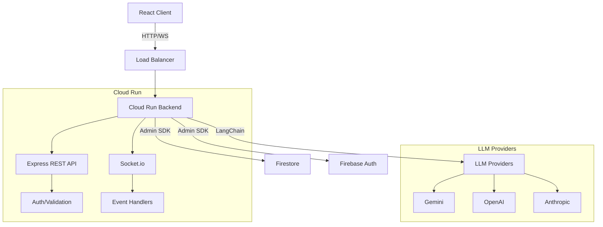

# D20 AI Backend

Multiplayer D&D dungeon master backend built with Express, Socket.io, Firebase, and LangChain.

## Architecture



## Project Structure

```
backend/
├── src/
│   ├── api/           # REST API endpoints
│   ├── socket/        # Socket.io event handlers
│   ├── services/      # Business logic (Firebase, LLM, Game)
│   ├── middleware/    # Express middleware (auth, validation, error)
│   ├── types/         # TypeScript type definitions
│   ├── utils/         # Helper functions
│   ├── config/        # Configuration (Firebase, LangChain)
│   └── server.ts      # Entry point
├── tests/             # Test files
├── Dockerfile         # Container definition
└── cloudbuild.yaml    # Cloud Build config
```

## Local Development

### Prerequisites

- Node.js 20+
- Yarn
- Firebase CLI
- Docker (optional)

### Setup

1. Install dependencies:
```bash
yarn install
```

2. Configure environment:
```bash
cp .env.example .env.local
# Edit .env.local with your values
```

3. Start Firebase emulators (Terminal 1):
```bash
cd ..
yarn emulators
```

4. Start backend (Terminal 2):
```bash
yarn dev
```

Backend runs on `http://localhost:3001`

### With Docker

```bash
docker-compose up backend
```

## Available Scripts

- `yarn dev` - Start development server with hot reload
- `yarn build` - Build for production
- `yarn start` - Start production server
- `yarn lint` - Lint code
- `yarn lint:fix` - Fix linting issues
- `yarn format` - Format code with Prettier
- `yarn test` - Run tests
- `yarn test:watch` - Run tests in watch mode
- `yarn test:coverage` - Generate coverage report
- `yarn typecheck` - Type-check without emitting

## API Endpoints

### Health
- `GET /health` - Health check

### Rooms
- `POST /api/rooms` - Create new room
- `POST /api/rooms/:code/join` - Join room by code
- `GET /api/rooms/:roomId` - Get room state
- `PATCH /api/rooms/:roomId/settings` - Update settings (owner only)
- `DELETE /api/rooms/:roomId` - Delete room (owner only)

### Game
- `POST /api/game/:roomId/world` - Generate world (owner only)
- `POST /api/game/:roomId/character` - Add character
- `POST /api/game/:roomId/turn` - Process turn

## Socket.io Events

### Client → Server
- `room:join` - Join room
- `room:leave` - Leave room
- `player:action` - Submit player action
- `turn:process` - Request turn processing

### Server → Client
- `room:updated` - Room state changed
- `player:joined` - Player joined
- `player:left` - Player left
- `game:state` - Full game state sync
- `error` - Error occurred

## Testing

```bash
# Unit tests
yarn test

# With coverage
yarn test:coverage

# CI mode
yarn test:ci
```

Tests use Firebase emulators automatically.

## Deployment

### Cloud Run

```bash
# Build
gcloud builds submit --config cloudbuild.yaml

# Deploy
gcloud run deploy d20ai-backend \
  --image gcr.io/PROJECT_ID/d20ai-backend \
  --region us-central1 \
  --allow-unauthenticated
```

### Environment Variables

Set via Secret Manager:
- `GEMINI_API_KEY`
- `OPENAI_API_KEY`
- `ANTHROPIC_API_KEY`
- `FIREBASE_PRIVATE_KEY`

## Code Quality

- **Linting:** ESLint (Airbnb TypeScript config)
- **Formatting:** Prettier
- **Type Safety:** Strict TypeScript, no `any`
- **Testing:** Jest with 80%+ coverage
- **Standards:**
  - Max function length: 25 lines
  - Max file length: 200 lines
  - Complexity: < 10
  - All exports have JSDoc

## License

MIT

