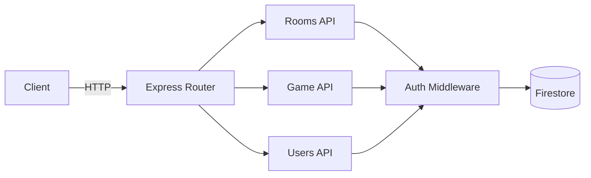

# API Endpoints

REST API endpoints for D20 AI backend.

## Structure



## Files

- `rooms.ts` - Room management (create, join, update, delete)
- `game.ts` - Game logic (world generation, turn processing)
- `users.ts` - User profile management

## Endpoint Patterns

All endpoints follow RESTful conventions:
- `POST` - Create resources
- `GET` - Read resources
- `PATCH` - Update resources
- `DELETE` - Delete resources

## Error Responses

```typescript
{
  success: false,
  error: {
    message: string,
    stack?: string // Only in development
  }
}
```

## Success Responses

```typescript
{
  success: true,
  data: T
}
```

