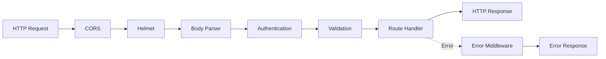

# Middleware

Express middleware for authentication, validation, and error handling.

## Flow



## Files

- `auth.ts` - Firebase token verification
- `error.ts` - Error handling and formatting
- `validate.ts` - Request validation with Zod

## Usage

```typescript
import { authenticate } from '@/middleware/auth.js';
import { validate } from '@/middleware/validate.js';
import { createRoomSchema } from '@/schemas/room.js';

router.post('/rooms', authenticate, validate(createRoomSchema), createRoomHandler);
```
