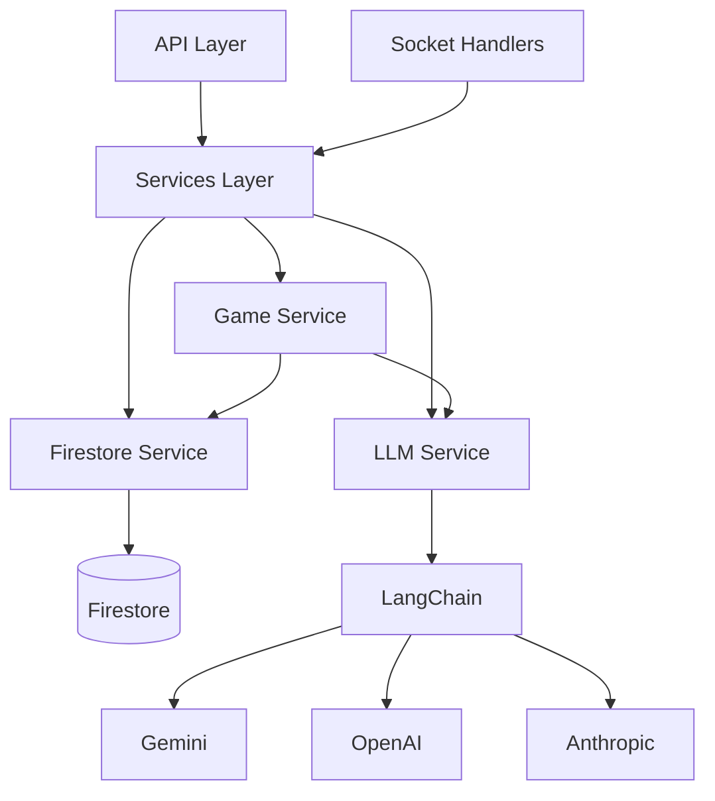

# Services

Business logic layer for D20 AI backend.

## Architecture

## Files

- `firestore.ts` - Firestore database operations
- `llm.ts` - LLM integration via LangChain
- `game.ts` - Game logic (world gen, turn processing, DM AI)

## Service Pattern

Each service:
1. Exports pure functions
2. Has comprehensive JSDoc
3. Handles errors gracefully
4. Logs all operations
5. Returns typed responses

## Testing

Services are fully testable with:
- Firebase emulators
- LLM mocks
- Dependency injection

