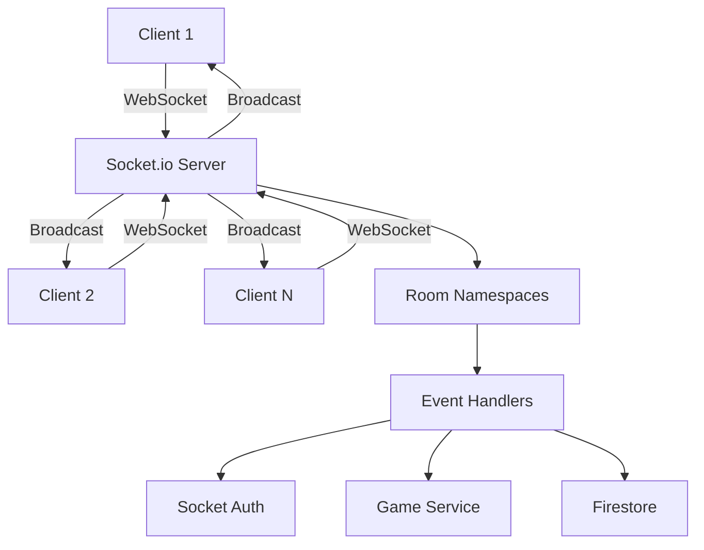

# Socket.io Handlers

Real-time WebSocket communication for multiplayer gameplay.

## Architecture

## Events

### Client → Server

- `room:join` - Join a game room
- `room:leave` - Leave a game room
- `player:action` - Submit player action
- `turn:process` - Request turn processing

### Server → Client

- `room:updated` - Room state changed
- `player:joined` - New player joined
- `player:left` - Player left
- `game:state` - Full state sync
- `error` - Error occurred

## Room Namespacing

Each game room operates in isolation:
- Clients join `/room/{roomId}` namespace
- Events only broadcast within the room
- Automatic cleanup on disconnect

## Authentication

Socket connections require:
1. Valid Firebase ID token
2. Active user session
3. Room membership (after joining)

