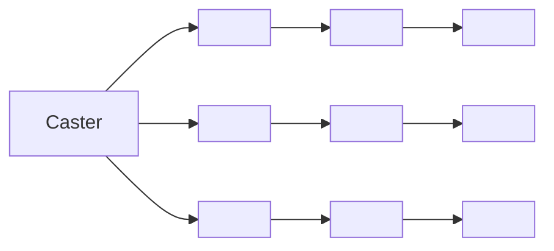
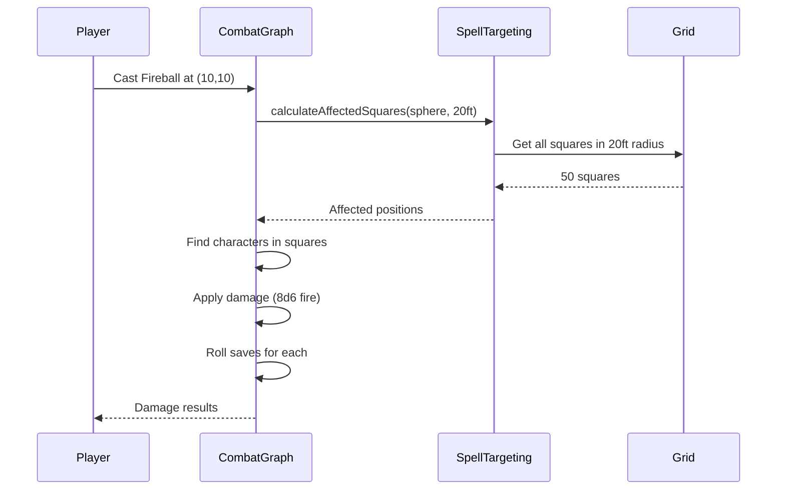

# Spell System with Spatial Effect Types

**CORE combat mechanic** - Spell shapes determine which grid squares are affected in battle.

## Architecture

```mermaid
graph TD
    A[Spell System] --> B[Parsing]
    A --> C[Type System]
    A --> D[CORE Combat]
    A --> E[API]
    A --> F[Frontend]

    B --> B1[raw_spell_book.html]
    B1 --> B2[parse-spells.ts]
    B2 --> B3[spells.json - 487 spells]

    C --> C1[SpellEffectShape enum]
    C --> C2[EffectDimensions]
    C --> C3[SpellData interface]

    D --> D1[spell-targeting.ts]
    D1 --> D2[calculateConeArea]
    D1 --> D3[calculateSphereArea]
    D1 --> D4[calculateLineArea]
    D1 --> D5[calculateCubeArea]
    D1 --> D6[calculateAffectedSquares]

    E --> E1[/api/spells]
    E --> E2[/api/spells/:id]
    E --> E3[/api/spells/shapes/:shape]

    F --> F1[SpellEffectOverlay]
    F --> F2[28+ Storybook stories]

    style D fill:#ff6b6b
    style D1 fill:#ff6b6b
```

## Spatial Effect Shapes (CORE)

### Single Target

#### MELEE_TOUCH

- **Range**: Adjacent square (5ft)
- **Example**: Cure Wounds, Shocking Grasp
- **Friendly Fire**: No
- **LOS**: Yes

#### RANGED_SINGLE

- **Range**: Variable (30-120ft typical)
- **Example**: Eldritch Blast, Fire Bolt
- **Targets**: One creature, spell guides to target
- **Friendly Fire**: No
- **LOS**: Yes

#### PROJECTILE_STRAIGHT

- **Range**: Variable
- **Example**: Scorching Ray
- **Behavior**: Straight line, stops at first hit
- **Friendly Fire**: No (usually)
- **LOS**: Required

### Area of Effect

#### CONE



- **Dimensions**: Length in feet (15ft, 30ft, 60ft)
- **Example**: Burning Hands (15ft), Cone of Cold (60ft)
- **Spreads**: Wider as it extends
- **Friendly Fire**: YES
- **LOS**: Required from caster

#### LINE

- **Dimensions**: Length x Width (100ft x 5ft typical)
- **Example**: Lightning Bolt (100ft x 5ft)
- **Pattern**: Straight line through all targets
- **Friendly Fire**: YES
- **LOS**: Required

#### SPHERE

- **Dimensions**: Radius (10-40ft)
- **Example**: Fireball (20ft), Thunderwave (5ft)
- **Pattern**: Radius around target point
- **Friendly Fire**: YES
- **LOS**: To target point

#### CUBE

- **Dimensions**: Side length (10-30ft)
- **Example**: Thunderwave (15ft cube)
- **Pattern**: NxN grid squares
- **Friendly Fire**: YES
- **LOS**: To target point

#### CYLINDER

- **Dimensions**: Radius + Height
- **Example**: Flame Strike (10ft radius, 40ft height)
- **Pattern**: Vertical cylinder (2D = sphere)
- **Friendly Fire**: YES

### Special

#### SELF_ONLY

- **Targets**: Caster only
- **Example**: Shield, Mage Armor
- **Friendly Fire**: No
- **LOS**: No

#### SELF_AURA

- **Dimensions**: Radius
- **Example**: Spirit Guardians (15ft)
- **Pattern**: Moves with caster
- **Friendly Fire**: Can affect allies
- **LOS**: No

#### WALL

- **Dimensions**: Length, Height, Thickness
- **Example**: Wall of Fire, Wall of Stone
- **Pattern**: Linear or circular barrier
- **Blocks**: Movement and LOS

## Combat Integration



## Grid Calculations

### Core Functions

**`calculateAffectedSquares()`** - Main integration point

```typescript
// Example: Fireball
const affected = calculateAffectedSquares(
  SpellEffectShape.SPHERE,
  { radius: 20 },
  casterPos,
  targetPos,
  gridWidth,
  gridHeight
);
// Returns: Array of all grid squares in 20ft radius
```

**`canCauseFriendlyFire()`** - Safety check

```typescript
if (canCauseFriendlyFire(spell.effectShape)) {
  // Warn player about allies in area
}
```

**`requiresLineOfSight()`** - LOS check

```typescript
if (requiresLineOfSight(spell.effectShape)) {
  // Check LOS from caster to target
}
```

## Data Structure

**Spell Level**: 0-9 (spell level, NOT character level)

- 0 = Cantrip
- 1-9 = Spell levels

**487 Spells Parsed**:

- Level 0: ~50 cantrips
- Level 1-9: ~437 leveled spells

## API Endpoints

```bash
GET /api/spells                    # List all
GET /api/spells?level=3            # Level 3 spells
GET /api/spells?school=evocation   # By school
GET /api/spells?effectShape=cone   # By shape
GET /api/spells/:id                # Single spell
GET /api/spells/shapes/sphere      # All sphere spells
GET /api/spells/levels/0           # All cantrips
```

## Testing

**Backend**: 58/58 tests passing

- Targeting calculations: 46 tests
- API/Data structure: 12 tests

```bash
yarn test spell-targeting.test.ts
yarn test spells.test.ts
```

## Storybook Visualization

**28+ stories** showing:

- Cone in 8 directions
- Sphere at 5 radii (10, 15, 20, 30, 40ft)
- Line at 4 angles + diagonal
- Cube at 4 sizes
- Cylinder variants
- Single target types
- Self effects
- Famous spells (Fireball, Lightning Bolt, Cone of Cold)

```bash
yarn storybook
# Navigate to Combat/SpellEffectOverlay
```

## Usage Examples

### Fireball

```typescript
const spell = {
  name: 'Fireball',
  level: 3, // Spell level, not caster level
  effectShape: SpellEffectShape.SPHERE,
  effectDimensions: { radius: 20 },
};

const affected = calculateAffectedSquares(
  spell.effectShape,
  spell.effectDimensions,
  casterPosition,
  targetPoint,
  gridWidth,
  gridHeight
);
// Returns ~50 squares in 20ft radius
```

### Lightning Bolt

```typescript
const spell = {
  name: 'Lightning Bolt',
  level: 3,
  effectShape: SpellEffectShape.LINE,
  effectDimensions: { lineLength: 100, lineWidth: 5 },
};
// Affects ~20 squares in 100ft line
```

### Burning Hands

```typescript
const spell = {
  name: 'Burning Hands',
  level: 1,
  effectShape: SpellEffectShape.CONE,
  effectDimensions: { length: 15 },
};
// Affects spreading cone up to 15ft
```

## Files

- `backend/src/types/spells.ts` - Type definitions
- `backend/src/combat/spell-targeting.ts` - CORE calculations
- `backend/src/combat/__tests__/spell-targeting.test.ts` - 46 tests
- `backend/src/api/spells.ts` - REST endpoints
- `backend/src/api/__tests__/spells.test.ts` - 12 tests
- `backend/src/scripts/parse-spells.ts` - HTML parser
- `seeds/scripts/seed-spells.ts` - Firestore seeder
- `seeds/game-data/spells.json` - 487 spells
- `frontend/src/types/spells.ts` - Frontend types
- `frontend/src/components/combat/SpellEffectOverlay.tsx` - Visualization
- `frontend/src/components/combat/SpellEffectOverlay.stories.tsx` - 28+ stories
