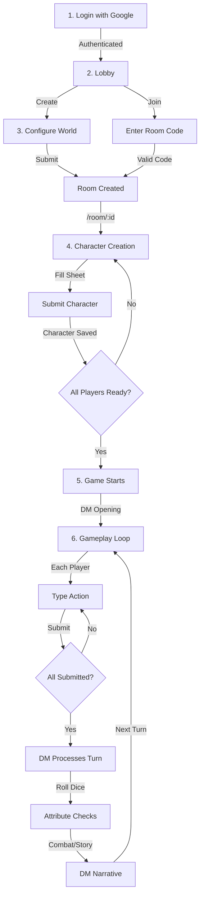
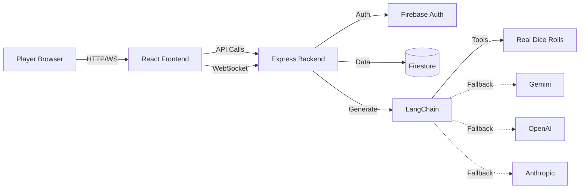
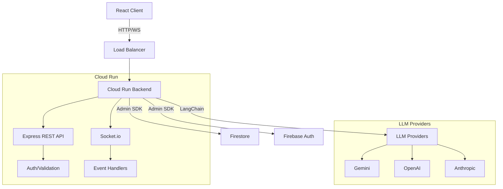
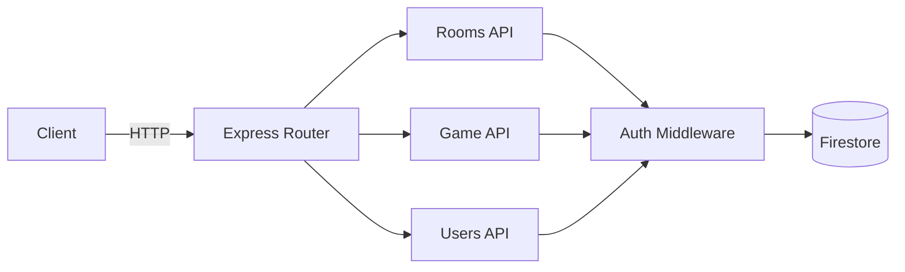
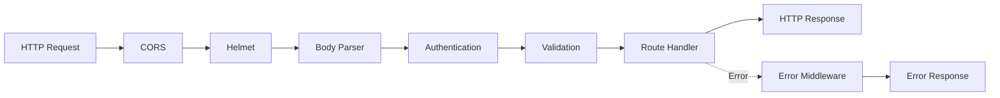
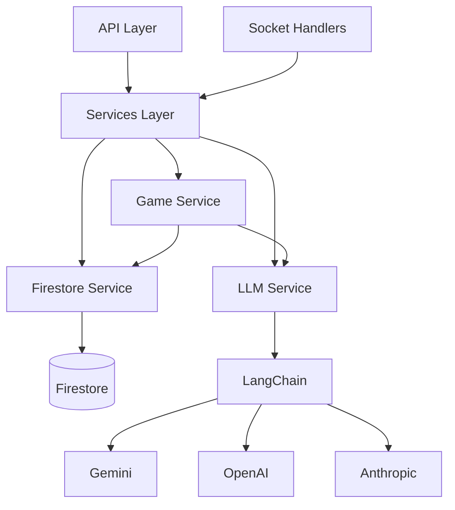
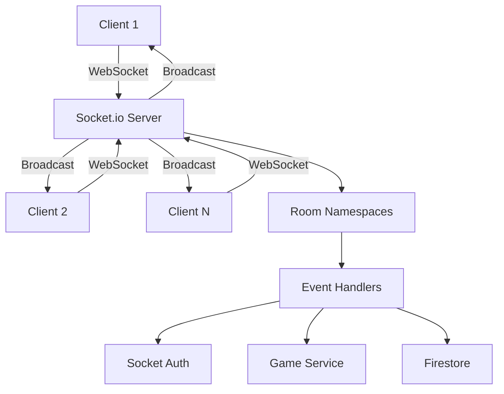
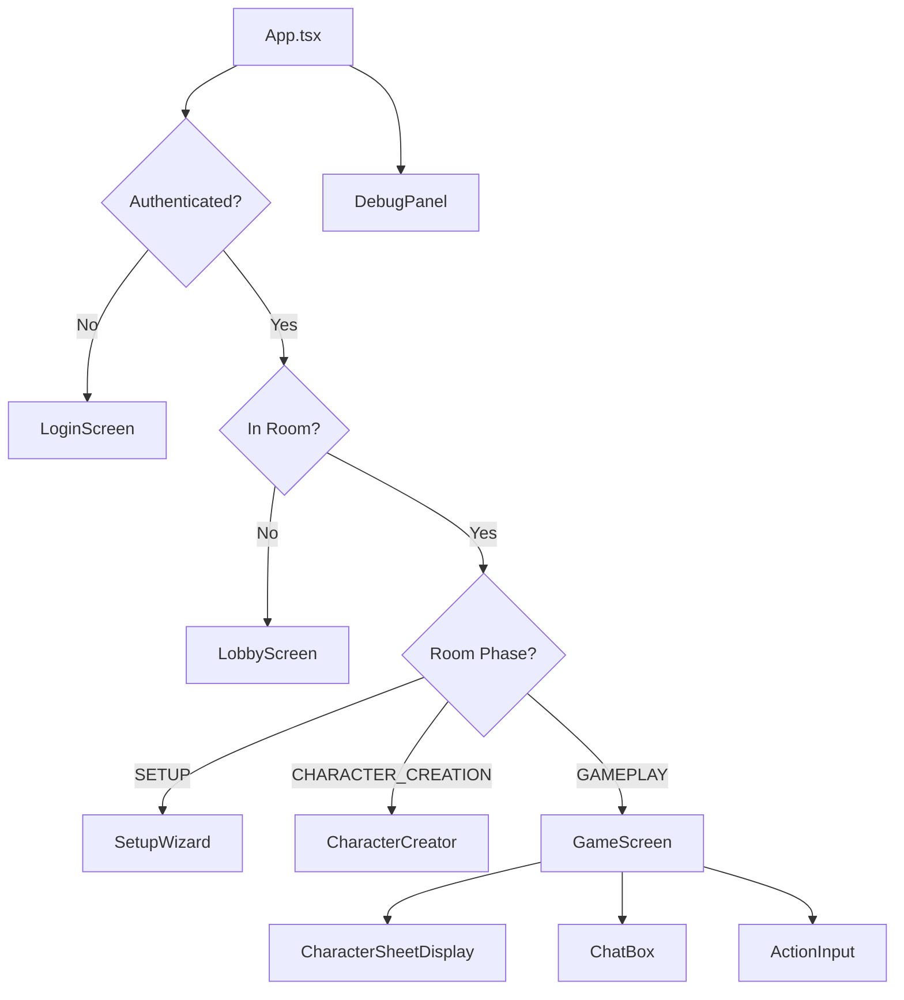
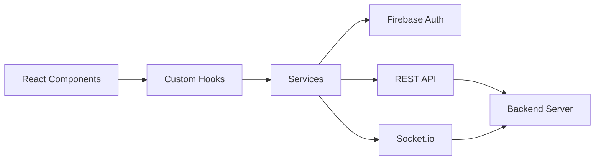

File: .dockerignore
""""""
node_modules
dist
*.log
.git
.env*
!.env.example
coverage
.vscode
.idea
*.md
!README.md

""""""


File: .gitignore
""""""
# Logs
logs
*.log
npm-debug.log*
yarn-debug.log*
yarn-error.log*
pnpm-debug.log*
lerna-debug.log*

node_modules
dist
dist-ssr
*.local

# Editor directories and files
.vscode/*
!.vscode/extensions.json
.idea
.DS_Store
*.suo
*.ntvs*
*.njsproj
*.sln
*.sw?
emulator-data
""""""


File: README.md
""""""
# D20 AI - Multiplayer D&D with AI Dungeon Master

🎲 **Turn-based multiplayer tabletop RPG** powered by AI. Create characters, join adventures, and let an intelligent Dungeon Master guide your story using real dice mechanics and LangChain with support for Gemini, OpenAI, and Anthropic.

## Game Flow



## How It Works

### 1. **Authentication**

- Click "Continue with Google"
- Uses Firebase Auth (emulators for local dev)
- Any email works locally - no password needed!

### 2. **Create or Join Room**

- **Create**: Click "Create New Adventure" → Configure world settings → Get room code
- **Join**: Enter 6-character room code (e.g., "ABC123")

### 3. **Character Creation**

- Fill out D20 character sheet:
  - Name, Race, Class, Alignment
  - Attributes (STR, DEX, CON, INT, WIS, CHA)
  - Auto-calculates modifiers
- Submit character
- Wait for all players to create characters

### 4. **Gameplay - Turn-Based System**

Each turn:

1. **Read** DM narration and previous actions
2. **Type** your action (e.g., "I search for traps", "I attack the goblin")
3. **Submit** and wait for others
4. **Process**: DM uses real dice tools to determine outcomes
5. **Narrative**: DM describes what happens
6. **Repeat**!

### 5. **Dice System**

The LLM uses **real random dice rolls** via tools:

- `roll_dice("2d6+3")` - Actual Math.random() results
- `attribute_check(character, "Strength", DC=15)` - d20 + modifier
- `saving_throw(character, "reflex", DC=12)` - Reflex/Fort/Will saves
- `attack_roll(attacker, target)` - d20 + attack bonus vs AC
- `deal_damage(target, "1d8+2", "slashing")` - Damage rolls

**Results are returned to the LLM**, which interprets them and writes the narrative.

### 6. **Real-Time Synchronization**

- See other players' characters instantly
- Know who's submitted their action
- Turn auto-processes when everyone's ready
- WebSocket updates via Socket.io

## Architecture



## Key Features

✅ **Turn-Based Multiplayer** - Real-time sync, room-based gameplay  
✅ **Real Dice Mechanics** - Math.random() dice rolls, not AI-decided  
✅ **LLM Tool Calling** - DM uses dice/check tools to determine outcomes  
✅ **Full D20 System** - Attributes, skills, saves, combat  
✅ **URL Routing** - Each room has unique URL `/room/:id`  
✅ **Character Sheets** - Complete D20 character creation  
✅ **Firebase Emulators** - Zero-cloud local development  
✅ **Debug Panel** - Real-time event inspector (Ctrl+D)  
✅ **Multi-LLM Support** - Gemini, OpenAI, Anthropic via LangChain  
✅ **Infrastructure as Code** - Terraform for Google Cloud

## Quick Start

### Prerequisites

- Node.js 20+
- Yarn
- Java 11+ (for Firebase emulators)
- Firebase CLI
- Docker (optional)

### Local Development

1. **Clone and install dependencies:**

```bash
yarn install:all
```

2. **Configure environment:**

```bash
# Root directory
cp .env.example .env.local

# Backend
cd backend
cp .env.example .env.local
```

3. **Add your Gemini API key to `.env.local`:**

```
GEMINI_API_KEY=your-key-here
```

4. **Start everything with one command:**

```bash
yarn dev
```

This single command starts:

- Firebase Emulators (Firestore + Auth)
- Backend server (with hot reload)
- Frontend dev server (with hot reload)

**Alternative:** Use Docker Compose:

```bash
docker-compose up
```

5. **Access the app:**

- Frontend: http://localhost:3000
- Backend: http://localhost:3001
- Firebase UI: http://localhost:4000

## Project Structure

```
d20ai/
├── backend/              # Node.js/Express backend
│   ├── src/
│   │   ├── api/         # REST endpoints
│   │   ├── socket/      # Socket.io handlers
│   │   ├── services/    # Business logic
│   │   ├── middleware/  # Auth, validation, errors
│   │   ├── config/      # Firebase, LangChain setup
│   │   ├── utils/       # Helpers
│   │   └── types/       # TypeScript types
│   ├── tests/           # Jest tests
│   ├── Dockerfile       # Container definition
│   └── package.json
├── src/                 # React frontend
│   ├── components/      # UI components
│   ├── hooks/          # Custom React hooks
│   ├── services/       # API/Socket clients
│   ├── types/          # Shared types
│   └── state/          # State management
├── infrastructure/      # Terraform IaC
├── firebase.json       # Emulator config
├── firestore.rules     # Security rules
├── docker-compose.yml  # Local dev stack
└── package.json        # Root workspace

```

## Development Commands

### Root

- `yarn dev` - **Start everything** (emulators + backend + frontend)
- `yarn install:all` - Install all dependencies
- `yarn dev:frontend` - Start frontend only
- `yarn dev:backend` - Start backend only
- `yarn dev:emulators` - Start emulators only
- `yarn docker:up` - Start full stack with Docker
- `yarn lint` - Lint all code
- `yarn format` - Format with Prettier
- `yarn test` - Run all tests
- `yarn typecheck` - TypeScript check

### Backend

- `yarn dev` - Start with hot reload
- `yarn build` - Build for production
- `yarn test` - Run Jest tests
- `yarn test:coverage` - Generate coverage report
- `yarn lint:check` - Lint without fixing

## API Endpoints

### Rooms

- `POST /api/rooms` - Create new room
- `POST /api/rooms/:code/join` - Join by code
- `GET /api/rooms/:roomId` - Get room state
- `PATCH /api/rooms/:roomId/settings` - Update settings
- `DELETE /api/rooms/:roomId` - Delete room

### Game

- `POST /api/game/:roomId/world` - Generate world
- `POST /api/game/:roomId/character` - Add character
- `POST /api/game/:roomId/start` - Start adventure
- `POST /api/game/:roomId/turn` - Process turn

### Users

- `GET /api/users/me` - Get current user

## Socket.io Events

### Client → Server

- `room:join` - Join game room
- `room:leave` - Leave room
- `player:action` - Submit action
- `turn:process` - Process turn

### Server → Client

- `game:state` - Full state sync
- `room:updated` - Room changed
- `player:joined` - Player joined
- `player:left` - Player left
- `turn:processing` - Turn processing
- `turn:complete` - Turn complete

## Configuration

### Environment Variables

**Frontend (.env.local):**

```
VITE_API_URL=http://localhost:3001
VITE_FIREBASE_PROJECT_ID=demo-project
VITE_USE_EMULATORS=true
```

**Backend (.env.local):**

```
NODE_ENV=development
PORT=3001
FRONTEND_URL=http://localhost:3000
FIREBASE_PROJECT_ID=demo-project
FIRESTORE_EMULATOR_HOST=localhost:8080
FIREBASE_AUTH_EMULATOR_HOST=localhost:9099
GEMINI_API_KEY=your-key
LLM_PROVIDER=gemini
LLM_FALLBACK_CHAIN=gemini,openai,anthropic
```

## Deployment

### Backend to Cloud Run

```bash
# Build and deploy
gcloud builds submit --config backend/cloudbuild.yaml

# Or use Terraform
cd infrastructure
terraform init
terraform apply
```

### Frontend to Vercel

```bash
# Install Vercel CLI
yarn global add vercel

# Deploy
vercel
```

## Code Quality Standards

- **TypeScript Strict Mode** - No `any` types allowed
- **ESLint** - Airbnb config with TypeScript
- **Prettier** - 2-space indent, single quotes
- **Max Function Length** - 25 lines
- **Max File Length** - 200 lines
- **Complexity** - Cyclomatic < 10
- **JSDoc** - All exports documented
- **Test Coverage** - 80%+ target

## Testing

### Backend (Jest)

```bash
cd backend
yarn test
yarn test:coverage
```

### Frontend (Vitest)

```bash
yarn test:frontend
```

### E2E (Playwright)

```bash
yarn test:e2e
```

## Tech Stack

**Frontend:**

- React 19
- TypeScript
- Vite
- Tailwind CSS
- Firebase Auth
- Socket.io Client

**Backend:**

- Node.js 20
- Express
- Socket.io
- Firebase Admin SDK
- LangChain
- Zod
- Winston

**Infrastructure:**

- Google Cloud Run
- Firebase Firestore
- Secret Manager
- Cloud Build
- Terraform

**Development:**

- Firebase Emulators
- Docker Compose
- ESLint + Prettier
- Jest + Vitest
- Playwright

## Contributing

1. Follow code quality standards
2. Write tests for new features
3. Update documentation
4. Run linting and type-checking

---

## Quick Start (3 Commands)

```bash
# 1. Install
yarn install:all

# 2. Add Gemini API key
echo "GEMINI_API_KEY=your-key" > .env.local
echo "GEMINI_API_KEY=your-key" > backend/.env.local

# 3. Start
yarn dev
```

Access: http://localhost:3000

---

## Common Issues

### Java Not Found

```bash
brew install openjdk@17  # macOS
sudo apt install openjdk-17-jdk  # Linux
```

### Connection Failed

- Verify all 3 services running (emulators, backend, frontend)
- Check `.env.local` exists in root
- Restart: `yarn dev`

### Auth Error

- Hard refresh browser (Cmd+Shift+R)
- Clear cookies
- Verify emulators running on port 4000

### LLM Timeout

- Check `GEMINI_API_KEY` in `backend/.env.local`
- Verify key at https://ai.google.dev/
- Check backend logs (blue output)

---

## License

MIT
""""""


File: backend/.eslintrc.json
""""""
{
  "parser": "@typescript-eslint/parser",
  "parserOptions": {
    "ecmaVersion": 2022,
    "sourceType": "module"
  },
  "extends": ["airbnb-base", "plugin:@typescript-eslint/recommended", "prettier"],
  "plugins": ["@typescript-eslint"],
  "env": {
    "node": true,
    "es2022": true
  },
  "rules": {
    "max-len": [
      "error",
      { "code": 140, "ignoreComments": true, "ignoreStrings": true, "ignoreTemplateLiterals": true }
    ],
    "no-console": "off",
    "import/prefer-default-export": "off",
    "import/extensions": "off",
    "class-methods-use-this": "off",
    "@typescript-eslint/no-explicit-any": "warn",
    "@typescript-eslint/no-unsafe-member-access": "off",
    "@typescript-eslint/no-unsafe-argument": "off",
    "@typescript-eslint/no-unsafe-assignment": "off",
    "@typescript-eslint/no-unsafe-enum-comparison": "off",
    "@typescript-eslint/restrict-template-expressions": "off",
    "@typescript-eslint/require-await": "off",
    "@typescript-eslint/no-redundant-type-constituents": "off",
    "complexity": ["error", 15],
    "max-lines-per-function": ["error", { "max": 150, "skipBlankLines": true, "skipComments": true }],
    "max-lines": ["error", { "max": 350, "skipBlankLines": true, "skipComments": true }],
    "no-restricted-syntax": "off",
    "no-await-in-loop": "off",
    "no-shadow": "off",
    "@typescript-eslint/no-shadow": [
      "error",
      { "ignoreTypeValueShadow": true, "ignoreFunctionTypeParameterNameValueShadow": true }
    ]
  },
  "ignorePatterns": ["dist", "node_modules", "*.config.js", "**/__tests__/**"],
  "settings": {
    "import/resolver": {
      "typescript": {
        "project": "./tsconfig.json"
      }
    }
  }
}
""""""


File: backend/.gitignore
""""""
# Dependencies
node_modules/
yarn.lock
package-lock.json

# Build output
dist/
build/
*.tsbuildinfo

# Environment
.env
.env.local
.env.*.local

# Logs
logs/
*.log
npm-debug.log*
yarn-debug.log*
yarn-error.log*

# Testing
coverage/
.nyc_output/

# IDE
.vscode/
.idea/
*.swp
*.swo
*~

# OS
.DS_Store
Thumbs.db

# Firebase
.firebase/
firebase-debug.log
firestore-debug.log

""""""


File: backend/Dockerfile
""""""
# Multi-stage build for production

# Stage 1: Build
FROM node:20-alpine AS builder

WORKDIR /app

# Copy package files
COPY package.json yarn.lock ./

# Install dependencies
RUN yarn install --frozen-lockfile

# Copy source
COPY . .

# Build TypeScript
RUN yarn build

# Stage 2: Production
FROM node:20-alpine

WORKDIR /app

# Copy package files
COPY package.json yarn.lock ./

# Install production dependencies only
RUN yarn install --frozen-lockfile --production

# Copy built files from builder
COPY --from=builder /app/dist ./dist

# Set environment
ENV NODE_ENV=production
ENV PORT=8080

# Expose port
EXPOSE 8080

# Health check
HEALTHCHECK --interval=30s --timeout=3s --start-period=5s --retries=3 \
  CMD node -e "require('http').get('http://localhost:8080/health', (r) => process.exit(r.statusCode === 200 ? 0 : 1))"

# Start server
CMD ["node", "dist/server.js"]

""""""


File: backend/README.md
""""""
# D20 AI Backend

Multiplayer D&D dungeon master backend built with Express, Socket.io, Firebase, and LangChain.

## Architecture



## Project Structure

```
backend/
├── src/
│   ├── api/           # REST API endpoints
│   ├── socket/        # Socket.io event handlers
│   ├── services/      # Business logic (Firebase, LLM, Game)
│   ├── middleware/    # Express middleware (auth, validation, error)
│   ├── types/         # TypeScript type definitions
│   ├── utils/         # Helper functions
│   ├── config/        # Configuration (Firebase, LangChain)
│   └── server.ts      # Entry point
├── tests/             # Test files
├── Dockerfile         # Container definition
└── cloudbuild.yaml    # Cloud Build config
```

## Local Development

### Prerequisites

- Node.js 20+
- Yarn
- Firebase CLI
- Docker (optional)

### Setup

1. Install dependencies:

```bash
yarn install
```

2. Configure environment:

```bash
cp .env.example .env.local
# Edit .env.local with your values
```

3. Start Firebase emulators (Terminal 1):

```bash
cd ..
yarn emulators
```

4. Start backend (Terminal 2):

```bash
yarn dev
```

Backend runs on `http://localhost:3001`

### With Docker

```bash
docker-compose up backend
```

## Available Scripts

- `yarn dev` - Start development server with hot reload
- `yarn build` - Build for production
- `yarn start` - Start production server
- `yarn lint` - Lint code
- `yarn lint:fix` - Fix linting issues
- `yarn format` - Format code with Prettier
- `yarn test` - Run tests
- `yarn test:watch` - Run tests in watch mode
- `yarn test:coverage` - Generate coverage report
- `yarn typecheck` - Type-check without emitting

## API Endpoints

### Health

- `GET /health` - Health check

### Rooms

- `POST /api/rooms` - Create new room
- `POST /api/rooms/:code/join` - Join room by code
- `GET /api/rooms/:roomId` - Get room state
- `PATCH /api/rooms/:roomId/settings` - Update settings (owner only)
- `DELETE /api/rooms/:roomId` - Delete room (owner only)

### Game

- `POST /api/game/:roomId/world` - Generate world (owner only)
- `POST /api/game/:roomId/character` - Add character
- `POST /api/game/:roomId/turn` - Process turn

## Socket.io Events

### Client → Server

- `room:join` - Join room
- `room:leave` - Leave room
- `player:action` - Submit player action
- `turn:process` - Request turn processing

### Server → Client

- `room:updated` - Room state changed
- `player:joined` - Player joined
- `player:left` - Player left
- `game:state` - Full game state sync
- `error` - Error occurred

## Testing

```bash
# Unit tests
yarn test

# With coverage
yarn test:coverage

# CI mode
yarn test:ci
```

Tests use Firebase emulators automatically.

## Deployment

### Cloud Run

```bash
# Build
gcloud builds submit --config cloudbuild.yaml

# Deploy
gcloud run deploy d20ai-backend \
  --image gcr.io/PROJECT_ID/d20ai-backend \
  --region us-central1 \
  --allow-unauthenticated
```

### Environment Variables

Set via Secret Manager:

- `GEMINI_API_KEY`
- `OPENAI_API_KEY`
- `ANTHROPIC_API_KEY`
- `FIREBASE_PRIVATE_KEY`

## Code Quality

- **Linting:** ESLint (Airbnb TypeScript config)
- **Formatting:** Prettier
- **Type Safety:** Strict TypeScript, no `any`
- **Testing:** Jest with 80%+ coverage
- **Standards:**
  - Max function length: 25 lines
  - Max file length: 200 lines
  - Complexity: < 10
  - All exports have JSDoc

## License

MIT
""""""


File: backend/cloudbuild.yaml
""""""
# Cloud Build configuration for backend deployment

steps:
  # Build the container image
  - name: 'gcr.io/cloud-builders/docker'
    args:
      - 'build'
      - '-t'
      - 'gcr.io/$PROJECT_ID/d20ai-backend:$COMMIT_SHA'
      - '-t'
      - 'gcr.io/$PROJECT_ID/d20ai-backend:latest'
      - '.'
    dir: 'backend'

  # Push the container image to Container Registry
  - name: 'gcr.io/cloud-builders/docker'
    args:
      - 'push'
      - 'gcr.io/$PROJECT_ID/d20ai-backend:$COMMIT_SHA'

  - name: 'gcr.io/cloud-builders/docker'
    args:
      - 'push'
      - 'gcr.io/$PROJECT_ID/d20ai-backend:latest'

  # Deploy container image to Cloud Run
  - name: 'gcr.io/google.com/cloudsdktool/cloud-sdk'
    entrypoint: gcloud
    args:
      - 'run'
      - 'deploy'
      - 'd20ai-backend'
      - '--image'
      - 'gcr.io/$PROJECT_ID/d20ai-backend:$COMMIT_SHA'
      - '--region'
      - 'us-central1'
      - '--platform'
      - 'managed'
      - '--allow-unauthenticated'
      - '--set-env-vars'
      - 'NODE_ENV=production'
      - '--set-secrets'
      - 'GEMINI_API_KEY=GEMINI_API_KEY:latest,FIREBASE_PRIVATE_KEY=FIREBASE_PRIVATE_KEY:latest'

images:
  - 'gcr.io/$PROJECT_ID/d20ai-backend:$COMMIT_SHA'
  - 'gcr.io/$PROJECT_ID/d20ai-backend:latest'

timeout: 1200s

""""""


File: backend/jest.config.js
""""""
export default {
  preset: 'ts-jest/presets/default-esm',
  testEnvironment: 'node',
  extensionsToTreatAsEsm: ['.ts'],
  moduleNameMapper: {
    '^@/(.*)$': '<rootDir>/src/$1',
    '^(\\.{1,2}/.*)\\.js$': '$1',
  },
  transform: {
    '^.+\\.ts$': [
      'ts-jest',
      {
        useESM: true,
      },
    ],
  },
  collectCoverageFrom: [
    'src/**/*.ts',
    '!src/**/*.spec.ts',
    '!src/**/*.test.ts',
    '!src/server.ts',
  ],
  coverageThreshold: {
    global: {
      branches: 80,
      functions: 80,
      lines: 80,
      statements: 80,
    },
  },
};

""""""


File: backend/package.json
""""""
{
  "name": "d20ai-backend",
  "version": "1.0.0",
  "description": "Multiplayer D&D backend with Express, Socket.io, and Firebase",
  "type": "module",
  "main": "dist/server.js",
  "scripts": {
    "dev": "tsx watch src/server.ts",
    "build": "tsc",
    "start": "node dist/server.js",
    "lint": "eslint . --ext .ts",
    "lint:fix": "eslint . --ext .ts --fix",
    "lint:check": "eslint . --ext .ts --max-warnings 0",
    "format": "prettier --write \"src/**/*.ts\"",
    "format:check": "prettier --check \"src/**/*.ts\"",
    "test": "NODE_ENV=test jest",
    "test:watch": "NODE_ENV=test jest --watch",
    "test:coverage": "NODE_ENV=test jest --coverage",
    "test:ci": "NODE_ENV=test jest --coverage --ci --maxWorkers=2",
    "typecheck": "tsc --noEmit"
  },
  "dependencies": {
    "@langchain/core": "^1.0.3",
    "@langchain/google-genai": "^1.0.0",
    "cors": "^2.8.5",
    "dotenv": "^16.4.5",
    "express": "^4.18.2",
    "firebase-admin": "^12.0.0",
    "helmet": "^7.1.0",
    "langchain": "^1.0.3",
    "socket.io": "^4.6.1",
    "winston": "^3.11.0",
    "zod": "^3.22.4",
    "zod-to-json-schema": "^3.24.6"
  },
  "devDependencies": {
    "@types/cors": "^2.8.17",
    "@types/express": "^4.17.21",
    "@types/jest": "^29.5.12",
    "@types/node": "^20.11.17",
    "@types/supertest": "^6.0.2",
    "@typescript-eslint/eslint-plugin": "^7.0.1",
    "@typescript-eslint/parser": "^7.0.1",
    "eslint": "^8.56.0",
    "eslint-config-airbnb-base": "^15.0.0",
    "eslint-config-airbnb-typescript": "^18.0.0",
    "eslint-import-resolver-typescript": "^4.4.4",
    "eslint-plugin-import": "^2.29.1",
    "husky": "^9.0.10",
    "jest": "^29.7.0",
    "prettier": "^3.2.5",
    "supertest": "^6.3.4",
    "ts-jest": "^29.1.2",
    "tsx": "^4.7.1",
    "typescript": "^5.3.3"
  },
  "engines": {
    "node": ">=20.0.0"
  }
}
""""""


File: backend/src/api/README.md
""""""
# API Endpoints

REST API endpoints for D20 AI backend.

## Structure



## Files

- `rooms.ts` - Room management (create, join, update, delete)
- `game.ts` - Game logic (world generation, turn processing)
- `users.ts` - User profile management

## Endpoint Patterns

All endpoints follow RESTful conventions:

- `POST` - Create resources
- `GET` - Read resources
- `PATCH` - Update resources
- `DELETE` - Delete resources

## Error Responses

```typescript
{
  success: false,
  error: {
    message: string,
    stack?: string // Only in development
  }
}
```

## Success Responses

```typescript
{
  success: true,
  data: T
}
```
""""""


File: backend/src/api/__tests__/rooms.test.ts
""""""
/**
 * Room API endpoint tests
 */

import { describe, test, expect, beforeAll, afterAll } from '@jest/globals';
import request from 'supertest';
import { app } from '../../server';

describe('Room API', () => {
  let authToken: string;

  beforeAll(async () => {
    // Mock auth token for testing
    authToken = 'test-token';
  });

  describe('POST /api/rooms', () => {
    test('creates a new room', async () => {
      const response = await request(app).post('/api/rooms').set('Authorization', `Bearer ${authToken}`).expect(201);

      expect(response.body.success).toBe(true);
      expect(response.body.data).toHaveProperty('id');
      expect(response.body.data).toHaveProperty('code');
      expect(response.body.data.code).toHaveLength(6);
    });

    test('requires authentication', async () => {
      await request(app).post('/api/rooms').expect(401);
    });
  });

  describe('POST /api/rooms/:code/join', () => {
    test('joins existing room', async () => {
      // Create room first
      const createRes = await request(app).post('/api/rooms').set('Authorization', `Bearer ${authToken}`).expect(201);

      const { code } = createRes.body.data;

      // Join the room
      const joinRes = await request(app)
        .post(`/api/rooms/${code}/join`)
        .set('Authorization', `Bearer ${authToken}`)
        .expect(200);

      expect(joinRes.body.success).toBe(true);
      expect(joinRes.body.data.code).toBe(code);
    });

    test('returns 404 for non-existent room', async () => {
      await request(app).post('/api/rooms/INVALID/join').set('Authorization', `Bearer ${authToken}`).expect(404);
    });
  });
});
""""""


File: backend/src/api/game-data.ts
""""""
/**
 * Game Data API endpoints
 * Provides access to D&D 5e SRD data for the frontend
 */

import { Router } from 'express';
import {
  ALIGNMENTS,
  ABILITIES,
  SKILLS,
  RACES,
  CLASSES,
  BACKGROUNDS,
  LANGUAGES,
  MAGIC_SCHOOLS,
  CONDITIONS,
  DAMAGE_TYPES,
  EQUIPMENT_CATEGORIES,
  EQUIPMENT_ITEMS,
  WEAPON_PROPERTIES,
} from '@/game-data/index';
import { successResponse } from '@/utils/response';

const router = Router();

/**
 * GET /api/game-data/alignments
 * Get all character alignments
 */
router.get('/alignments', (_req, res) => {
  res.json(successResponse(ALIGNMENTS));
});

/**
 * GET /api/game-data/abilities
 * Get all ability scores
 */
router.get('/abilities', (_req, res) => {
  res.json(successResponse(ABILITIES));
});

/**
 * GET /api/game-data/skills
 * Get all skills
 */
router.get('/skills', (_req, res) => {
  res.json(successResponse(SKILLS));
});

/**
 * GET /api/game-data/races
 * Get all player races
 */
router.get('/races', (_req, res) => {
  res.json(successResponse(RACES));
});

/**
 * GET /api/game-data/classes
 * Get all character classes
 */
router.get('/classes', (_req, res) => {
  res.json(successResponse(CLASSES));
});

/**
 * GET /api/game-data/backgrounds
 * Get all character backgrounds
 */
router.get('/backgrounds', (_req, res) => {
  res.json(successResponse(BACKGROUNDS));
});

/**
 * GET /api/game-data/languages
 * Get all languages
 */
router.get('/languages', (_req, res) => {
  res.json(successResponse(LANGUAGES));
});

/**
 * GET /api/game-data/magic-schools
 * Get all schools of magic
 */
router.get('/magic-schools', (_req, res) => {
  res.json(successResponse(MAGIC_SCHOOLS));
});

/**
 * GET /api/game-data/conditions
 * Get all combat conditions
 */
router.get('/conditions', (_req, res) => {
  res.json(successResponse(CONDITIONS));
});

/**
 * GET /api/game-data/damage-types
 * Get all damage types
 */
router.get('/damage-types', (_req, res) => {
  res.json(successResponse(DAMAGE_TYPES));
});

/**
 * GET /api/game-data/equipment-categories
 * Get all equipment categories
 */
router.get('/equipment-categories', (_req, res) => {
  res.json(successResponse(EQUIPMENT_CATEGORIES));
});

/**
 * GET /api/game-data/equipment
 * Get all equipment items
 */
router.get('/equipment', (_req, res) => {
  res.json(successResponse(EQUIPMENT_ITEMS));
});

/**
 * GET /api/game-data/weapon-properties
 * Get all weapon properties
 */
router.get('/weapon-properties', (_req, res) => {
  res.json(successResponse(WEAPON_PROPERTIES));
});

export default router;
""""""


File: backend/src/api/game.ts
""""""
/**
 * Game logic API endpoints
 */

import { Router } from 'express';
import type { Response } from 'express';
import { z } from 'zod';
import { authenticate, type AuthRequest } from '@/middleware/auth';
import {
  getRoom,
  updateRoomWorld,
  getPlayers,
  addPlayer,
  addMessage,
  getMessages,
  getCreatures,
  updatePlayerAction,
} from '@/services/firestore';
import { generateWorld, generateCharacterOpenings, processTurn } from '@/services/game';
import { ApiError } from '@/middleware/error';
import { NEW_CHARACTER_TEMPLATE } from '@/constants';
import { GamePhase, type Player, type Message, type CharacterSheet } from '@/types/index';
import { io } from '@/server';

const router = Router();

/**
 * Character creation schema
 */
const characterSchema = z.object({
  name: z.string().min(1),
  race: z.string().min(1),
  characterClass: z.string().min(1),
  alignment: z.string().min(1),
  attributes: z.object({
    Strength: z.number().min(1).max(30),
    Dexterity: z.number().min(1).max(30),
    Constitution: z.number().min(1).max(30),
    Intelligence: z.number().min(1).max(30),
    Wisdom: z.number().min(1).max(30),
    Charisma: z.number().min(1).max(30),
  }),
  armorClass: z.number().min(1),
});

/**
 * Generate world description
 * @route POST /api/game/:roomId/world
 */
router.post('/:roomId/world', authenticate, async (req: AuthRequest, res: Response) => {
  const { roomId } = req.params;
  const room = await getRoom(roomId);

  if (!room) {
    throw new ApiError(404, 'Room not found');
  }

  if (room.ownerId !== req.user!.uid) {
    throw new ApiError(403, 'Only room owner can generate world');
  }

  if (!room.settings) {
    throw new ApiError(400, 'Room settings not configured');
  }

  const worldDescription = await generateWorld(room.settings, req.body.language || 'en');
  const updatedRoom = await updateRoomWorld(roomId, worldDescription, GamePhase.CHARACTER_CREATION);

  res.json({ success: true, data: updatedRoom });
});

/**
 * Add character to room
 * @route POST /api/game/:roomId/character
 */
router.post('/:roomId/character', authenticate, async (req: AuthRequest, res: Response) => {
  const { roomId } = req.params;
  const room = await getRoom(roomId);

  if (!room) {
    throw new ApiError(404, 'Room not found');
  }

  if (room.phase !== GamePhase.CHARACTER_CREATION) {
    throw new ApiError(400, 'Not in character creation phase');
  }

  const charData = characterSchema.parse(req.body);
  const character: CharacterSheet = {
    ...NEW_CHARACTER_TEMPLATE,
    ...charData,
  };

  const player: Player = {
    id: req.user!.uid,
    userId: req.user!.uid,
    name: character.name,
    character,
    action: null,
    isReady: false,
    joinedAt: Date.now(),
  };

  await addPlayer(roomId, player);

  // Broadcast to all players in room
  io.to(roomId).emit('player:created', player);

  res.status(201).json({ success: true, data: player });
});

/**
 * Start adventure (generate personalized openings)
 * @route POST /api/game/:roomId/start
 */
router.post('/:roomId/start', authenticate, async (req: AuthRequest, res: Response) => {
  const { roomId } = req.params;
  const room = await getRoom(roomId);

  if (!room) {
    throw new ApiError(404, 'Room not found');
  }

  if (room.ownerId !== req.user!.uid) {
    throw new ApiError(403, 'Only room owner can start game');
  }

  const players = await getPlayers(roomId);

  if (players.length === 0) {
    throw new ApiError(400, 'No players in room');
  }

  const openings = await generateCharacterOpenings(room.worldDescription, players, req.body.language || 'en');

  const messages: Message[] = [];

  for (const { playerId, message: opening } of openings.openings) {
    const msg: Message = {
      id: `msg-${Date.now()}-${playerId}`,
      sender: 'DM',
      text: opening,
      timestamp: Date.now(),
      targetPlayer: playerId,
    };

    await addMessage(roomId, msg);
    messages.push(msg);
  }

  await updateRoomWorld(roomId, room.worldDescription, GamePhase.GAMEPLAY);

  res.json({ success: true, data: messages });
});

/**
 * Process game turn
 * @route POST /api/game/:roomId/turn
 */
router.post('/:roomId/turn', authenticate, async (req: AuthRequest, res: Response) => {
  const { roomId } = req.params;
  const room = await getRoom(roomId);

  if (!room) {
    throw new ApiError(404, 'Room not found');
  }

  if (room.phase !== GamePhase.GAMEPLAY) {
    throw new ApiError(400, 'Game not started');
  }

  const players = await getPlayers(roomId);
  const messages = await getMessages(roomId);
  const creatures = await getCreatures(roomId);

  // Add player action messages
  for (const player of players) {
    if (player.action) {
      const msg: Message = {
        id: `msg-${Date.now()}-${player.id}`,
        sender: player.character.name,
        text: player.action,
        timestamp: Date.now(),
      };
      await addMessage(roomId, msg);
    }
  }

  // Generate DM response
  const dmResponse = await processTurn(room.worldDescription, messages, players, creatures, req.body.language || 'en');

  const dmMessage: Message = {
    id: `msg-${Date.now()}-dm`,
    sender: 'DM',
    text: dmResponse.overall_summary,
    timestamp: Date.now(),
  };

  await addMessage(roomId, dmMessage);

  // Clear player actions
  for (const player of players) {
    await updatePlayerAction(roomId, player.id, '');
  }

  res.json({ success: true, data: dmMessage });
});

export default router;
""""""


File: backend/src/api/rooms.ts
""""""
/**
 * Room management API endpoints
 */

import { Router } from 'express';
import type { Response } from 'express';
import { z } from 'zod';
import { authenticate, type AuthRequest } from '@/middleware/auth';
import { createRoom, findRoomByCode, getRoom, updateRoomSettings, deleteRoom, getPlayers } from '@/services/firestore';
import { ApiError } from '@/middleware/error';
import type { WorldSettings } from '@/types/index';

const router = Router();

/**
 * Create world settings schema
 */
const worldSettingsSchema = z.object({
  theme: z.string(),
  setting: z.string(),
  tone: z.string(),
  playerCount: z.number().min(1).max(8),
  adventureLength: z.enum(['short', 'medium', 'epic']),
  difficulty: z.enum(['easy', 'medium', 'hard']),
});

/**
 * Create a new room
 * @route POST /api/rooms
 */
router.post('/', authenticate, async (req: AuthRequest, res: Response) => {
  const room = await createRoom(req.user!.uid);
  res.status(201).json({ success: true, data: room });
});

/**
 * Join room by code
 * @route POST /api/rooms/:code/join
 */
router.post('/:code/join', authenticate, async (req: AuthRequest, res: Response) => {
  const { code } = req.params;
  const room = await findRoomByCode(code.toUpperCase());

  if (!room) {
    throw new ApiError(404, 'Room not found');
  }

  res.json({ success: true, data: room });
});

/**
 * Get room state
 * @route GET /api/rooms/:roomId
 */
router.get('/:roomId', authenticate, async (req: AuthRequest, res: Response) => {
  const { roomId } = req.params;
  const room = await getRoom(roomId);

  if (!room) {
    throw new ApiError(404, 'Room not found');
  }

  const players = await getPlayers(roomId);

  res.json({
    success: true,
    data: {
      room,
      players,
    },
  });
});

/**
 * Update room settings
 * @route PATCH /api/rooms/:roomId/settings
 */
router.patch('/:roomId/settings', authenticate, async (req: AuthRequest, res: Response) => {
  const { roomId } = req.params;
  const room = await getRoom(roomId);

  if (!room) {
    throw new ApiError(404, 'Room not found');
  }

  if (room.ownerId !== req.user!.uid) {
    throw new ApiError(403, 'Only room owner can update settings');
  }

  const settings = worldSettingsSchema.parse(req.body) as WorldSettings;
  const updatedRoom = await updateRoomSettings(roomId, settings);

  res.json({ success: true, data: updatedRoom });
});

/**
 * Delete room
 * @route DELETE /api/rooms/:roomId
 */
router.delete('/:roomId', authenticate, async (req: AuthRequest, res: Response) => {
  const { roomId } = req.params;
  const room = await getRoom(roomId);

  if (!room) {
    throw new ApiError(404, 'Room not found');
  }

  if (room.ownerId !== req.user!.uid) {
    throw new ApiError(403, 'Only room owner can delete room');
  }

  await deleteRoom(roomId);

  res.json({ success: true, data: null });
});

export default router;
""""""


File: backend/src/api/users.ts
""""""
/**
 * User management API endpoints
 */

import { Router } from 'express';
import type { Response } from 'express';
import { authenticate, type AuthRequest } from '@/middleware/auth';
import { createUser, getUser } from '@/services/firestore';

const router = Router();

/**
 * Get or create current user profile
 * @route GET /api/users/me
 */
router.get('/me', authenticate, async (req: AuthRequest, res: Response) => {
  const { uid, email, name } = req.user!;

  let user = await getUser(uid);

  if (!user) {
    // Create user profile on first login
    user = await createUser(uid, email, name, '');
  }

  res.json({ success: true, data: user });
});

export default router;
""""""


File: backend/src/config/firebase.ts
""""""
/**
 * Firebase Admin SDK configuration
 */

import admin from 'firebase-admin';
import { getFirestore } from 'firebase-admin/firestore';
import { getAuth } from 'firebase-admin/auth';

/**
 * Initialize Firebase Admin SDK
 * Uses emulator in development, real Firebase in production
 */
export function initializeFirebase(): void {
  if (admin.apps.length > 0) {
    return; // Already initialized
  }

  const isDevelopment = process.env.NODE_ENV === 'development' || process.env.NODE_ENV === 'test';
  const projectId = process.env.FIREBASE_PROJECT_ID || 'demo-project';

  if (isDevelopment) {
    // Use emulators in development/test
    console.log(`🔥 Firebase initialized in ${process.env.NODE_ENV} mode`);
    console.log(`📦 Project ID: ${projectId}`);
    if (process.env.FIRESTORE_EMULATOR_HOST) {
      console.log(`🔧 Firestore Emulator: ${process.env.FIRESTORE_EMULATOR_HOST}`);
    }
    if (process.env.FIREBASE_AUTH_EMULATOR_HOST) {
      console.log(`🔧 Auth Emulator: ${process.env.FIREBASE_AUTH_EMULATOR_HOST}`);
    }

    admin.initializeApp({
      projectId,
    });
  } else {
    // Production: use service account
    if (!process.env.FIREBASE_PROJECT_ID || !process.env.FIREBASE_PRIVATE_KEY) {
      throw new Error('Firebase credentials not configured for production');
    }

    admin.initializeApp({
      credential: admin.credential.cert({
        projectId: process.env.FIREBASE_PROJECT_ID,
        clientEmail: process.env.FIREBASE_CLIENT_EMAIL,
        privateKey: process.env.FIREBASE_PRIVATE_KEY.replace(/\\n/g, '\n'),
      }),
    });
  }
}

/**
 * Get Firestore instance
 * @returns Firestore database instance
 */
export function getDb() {
  return getFirestore();
}

/**
 * Get Firebase Auth instance
 * @returns Firebase Auth instance
 */
export function getFirebaseAuth() {
  return getAuth();
}
""""""


File: backend/src/config/langchain.ts
""""""
/**
 * LangChain configuration for Google Gemini
 */

import { initChatModel } from 'langchain';

/**
 * LangChain model configuration
 */
interface ModelConfig {
  temperature: number;
  maxTokens: number;
  topP: number;
}
const DEFAULT_CONFIG: ModelConfig = {
  temperature: 0.4,
  maxTokens: 4096,
  topP: 0.95,
};

/**
 * Get Gemini LLM model instance
 * @param config - Model configuration
 * @returns Gemini chat model instance
 */
export async function getLLMModel() {
  if (!process.env.GEMINI_API_KEY) throw new Error('GEMINI_API_KEY not con1figured');
  return initChatModel('google-genai:gemini-2.5-pro', DEFAULT_CONFIG);
}

/**
 * Get fallback chain (only Gemini for now)
 * @returns Array with single Gemini model
 */
export async function getFallbackChain() {
  const model = await getLLMModel();
  return [model];
}

/**
 * Message types for LangChain
 */
export interface ChatMessage {
  role: 'system' | 'user' | 'assistant';
  content: string;
}
""""""


File: backend/src/constants.ts
""""""
/**
 * Shared constants
 */

import type { CharacterSheet, WorldSettings } from '@/types/index';

/**
 * New character template with default values
 */
export const NEW_CHARACTER_TEMPLATE: CharacterSheet = {
  name: '',
  race: 'Human',
  characterClass: 'Fighter',
  background: 'Folk Hero',
  alignment: 'Neutral Good',
  level: 1,
  xp: 0,
  hp: 10,
  maxHp: 10,
  temporaryHp: 0,
  hitDice: { total: 1, current: 1 },
  deathSaves: { successes: 0, failures: 0 },
  armorClass: 10,
  initiative: 0,
  speed: 30,
  proficiencyBonus: 2,
  inspiration: false,
  baseAttackBonus: 1,
  attributes: {
    Strength: 10,
    Dexterity: 10,
    Constitution: 10,
    Intelligence: 10,
    Wisdom: 10,
    Charisma: 10,
  },
  savingThrows: {
    fortitude: 2,
    reflex: 0,
    will: 0,
  },
  skills: {},
  attacks: [],
  equipment: '',
  currency: {
    cp: 0,
    sp: 0,
    ep: 0,
    gp: 0,
    pp: 0,
  },
  proficienciesAndLanguages: '',
  features: '',
  appearance: {
    age: '',
    height: '',
    weight: '',
    eyes: '',
    skin: '',
    hair: '',
    description: '',
  },
  personality: {
    traits: '',
    ideals: '',
    bonds: '',
    flaws: '',
  },
  backstory: '',
  alliesAndOrganizations: '',
  treasure: '',
  spellcasting: {
    class: '',
    ability: '',
    saveDC: 0,
    attackBonus: 0,
    cantrips: [],
    spellsKnown: [],
    slots: [],
  },
};

/**
 * List of attributes
 */
export const ATTRIBUTES = ['Strength', 'Dexterity', 'Constitution', 'Intelligence', 'Wisdom', 'Charisma'] as const;

/**
 * Default world settings
 */
export const DEFAULT_WORLD_SETTINGS: WorldSettings = {
  theme: 'High Fantasy',
  setting: 'Medieval',
  tone: 'Heroic',
  playerCount: 4,
  adventureLength: 'medium',
  difficulty: 'medium',
  startingLevel: 1,
  attributePointBudget: 27,
};

/**
 * D&D point-buy costs for attributes (score -> point cost)
 */
export const POINT_BUY_COSTS: Record<number, number> = {
  8: 0,
  9: 1,
  10: 2,
  11: 3,
  12: 4,
  13: 5,
  14: 7,
  15: 9,
};
""""""


File: backend/src/game-data/character-abilities.ts
""""""
/**
 * D&D 5e Ability Scores
 */

export type AbilityId = 'str' | 'dex' | 'con' | 'int' | 'wis' | 'cha';

export interface Ability {
  id: AbilityId;
  index: string;
  name: string;
  fullName: string;
  description: string;
  skills: string[];
}

export const ABILITIES: readonly Ability[] = [
  {
    id: 'str',
    index: 'str',
    name: 'STR',
    fullName: 'Strength',
    description: 'Natural athleticism, bodily power',
    skills: ['Athletics'],
  },
  {
    id: 'dex',
    index: 'dex',
    name: 'DEX',
    fullName: 'Dexterity',
    description: 'Physical agility, reflexes, balance, poise',
    skills: ['Acrobatics', 'Sleight of Hand', 'Stealth'],
  },
  {
    id: 'con',
    index: 'con',
    name: 'CON',
    fullName: 'Constitution',
    description: 'Health, stamina, vital force',
    skills: [],
  },
  {
    id: 'int',
    index: 'int',
    name: 'INT',
    fullName: 'Intelligence',
    description: 'Mental acuity, information recall, analytical skill',
    skills: ['Arcana', 'History', 'Investigation', 'Nature', 'Religion'],
  },
  {
    id: 'wis',
    index: 'wis',
    name: 'WIS',
    fullName: 'Wisdom',
    description: 'Awareness, intuition, insight',
    skills: ['Animal Handling', 'Insight', 'Medicine', 'Perception', 'Survival'],
  },
  {
    id: 'cha',
    index: 'cha',
    name: 'CHA',
    fullName: 'Charisma',
    description: 'Confidence, eloquence, leadership',
    skills: ['Deception', 'Intimidation', 'Performance', 'Persuasion'],
  },
] as const;
""""""


File: backend/src/game-data/character-alignments.ts
""""""
/**
 * D&D 5e Character Alignments
 */

export type AlignmentId =
  | 'lawful-good'
  | 'neutral-good'
  | 'chaotic-good'
  | 'lawful-neutral'
  | 'neutral'
  | 'chaotic-neutral'
  | 'lawful-evil'
  | 'neutral-evil'
  | 'chaotic-evil'
  | 'unaligned';

export interface Alignment {
  id: AlignmentId;
  name: string;
  abbreviation: string;
  description: string;
}

export const ALIGNMENTS: readonly Alignment[] = [
  {
    id: 'lawful-good',
    name: 'Lawful Good',
    abbreviation: 'LG',
    description:
      'Lawful Good creatures endeavor to do the right thing as expected by society. Someone who fights injustice and protects the innocent without hesitation is probably Lawful Good.',
  },
  {
    id: 'neutral-good',
    name: 'Neutral Good',
    abbreviation: 'NG',
    description:
      'Neutral Good creatures do the best they can, working within rules but not feeling bound by them. A kindly person who helps others according to their needs is probably Neutral Good.',
  },
  {
    id: 'chaotic-good',
    name: 'Chaotic Good',
    abbreviation: 'CG',
    description:
      "Chaotic Good creatures act as their conscience directs with little regard for what others expect. A rebel who waylays a cruel baron's tax collectors and uses the stolen money to help the poor is probably Chaotic Good.",
  },
  {
    id: 'lawful-neutral',
    name: 'Lawful Neutral',
    abbreviation: 'LN',
    description:
      "Lawful Neutral individuals act in accordance with law, tradition, or personal codes. Someone who follows a disciplined rule of life--and isn't swayed either by the demands of those in need or by the temptations of evil--is probably Lawful Neutral.",
  },
  {
    id: 'neutral',
    name: 'Neutral',
    abbreviation: 'N',
    description:
      "Neutral is the alignment of those who prefer to avoid moral questions and don't take sides, doing what seems best at the time. Someone who's bored by moral debate is probably Neutral.",
  },
  {
    id: 'chaotic-neutral',
    name: 'Chaotic Neutral',
    abbreviation: 'CN',
    description:
      'Chaotic Neutral creatures follow their whims, valuing their personal freedom above all else. A scoundrel who wanders the land living by their wits is probably Chaotic Neutral.',
  },
  {
    id: 'lawful-evil',
    name: 'Lawful Evil',
    abbreviation: 'LE',
    description:
      'Lawful Evil creatures methodically take what they want within the limits of a code of tradition, loyalty, or order. An aristocrat exploiting citizens while scheming for power is probably Lawful Evil.',
  },
  {
    id: 'neutral-evil',
    name: 'Neutral Evil',
    abbreviation: 'NE',
    description:
      'Neutral Evil is the alignment of those who are untroubled by the harm they cause as they pursue their desires. A criminal who robs and murders as they please is probably Neutral Evil.',
  },
  {
    id: 'chaotic-evil',
    name: 'Chaotic Evil',
    abbreviation: 'CE',
    description:
      'Chaotic Evil creatures act with arbitrary violence, spurred by their hatred or bloodlust. A villain pursuing schemes of vengeance and havoc is probably Chaotic Evil.',
  },
  {
    id: 'unaligned',
    name: 'Unaligned',
    abbreviation: 'U',
    description:
      "Most creatures that lack the capacity for rational thought don't have alignments; they are unaligned. Sharks are savage predators, for example, but they aren't evil; they are unaligned.",
  },
] as const;
""""""


File: backend/src/game-data/character-backgrounds.ts
""""""
/**
 * D&D 5e Character Backgrounds
 */

export type BackgroundId =
  | 'acolyte'
  | 'charlatan'
  | 'criminal'
  | 'entertainer'
  | 'folk-hero'
  | 'guild-artisan'
  | 'hermit'
  | 'noble'
  | 'outlander'
  | 'sage'
  | 'sailor'
  | 'soldier'
  | 'urchin';

export interface Background {
  id: BackgroundId;
  name: string;
  description: string;
  skillProficiencies: string[];
}

export const BACKGROUNDS: readonly Background[] = [
  {
    id: 'acolyte',
    name: 'Acolyte',
    description: 'You have spent your life in service to a temple.',
    skillProficiencies: ['Insight', 'Religion'],
  },
  {
    id: 'charlatan',
    name: 'Charlatan',
    description: 'You have always had a way with people.',
    skillProficiencies: ['Deception', 'Sleight of Hand'],
  },
  {
    id: 'criminal',
    name: 'Criminal',
    description: 'You are an experienced criminal with a history of breaking the law.',
    skillProficiencies: ['Deception', 'Stealth'],
  },
  {
    id: 'entertainer',
    name: 'Entertainer',
    description: 'You thrive in front of an audience.',
    skillProficiencies: ['Acrobatics', 'Performance'],
  },
  {
    id: 'folk-hero',
    name: 'Folk Hero',
    description: 'You come from a humble social rank, but you are destined for so much more.',
    skillProficiencies: ['Animal Handling', 'Survival'],
  },
  {
    id: 'guild-artisan',
    name: 'Guild Artisan',
    description: "You are a member of an artisan's guild.",
    skillProficiencies: ['Insight', 'Persuasion'],
  },
  {
    id: 'hermit',
    name: 'Hermit',
    description: 'You lived in seclusion for a formative part of your life.',
    skillProficiencies: ['Medicine', 'Religion'],
  },
  {
    id: 'noble',
    name: 'Noble',
    description: 'You understand wealth, power, and privilege.',
    skillProficiencies: ['History', 'Persuasion'],
  },
  {
    id: 'outlander',
    name: 'Outlander',
    description: 'You grew up in the wilds, far from civilization.',
    skillProficiencies: ['Athletics', 'Survival'],
  },
  {
    id: 'sage',
    name: 'Sage',
    description: 'You spent years learning the lore of the multiverse.',
    skillProficiencies: ['Arcana', 'History'],
  },
  {
    id: 'sailor',
    name: 'Sailor',
    description: 'You sailed on a seagoing vessel for years.',
    skillProficiencies: ['Athletics', 'Perception'],
  },
  {
    id: 'soldier',
    name: 'Soldier',
    description: 'You have trained as a warrior and fought in battles.',
    skillProficiencies: ['Athletics', 'Intimidation'],
  },
  {
    id: 'urchin',
    name: 'Urchin',
    description: 'You grew up on the streets alone, orphaned, and poor.',
    skillProficiencies: ['Sleight of Hand', 'Stealth'],
  },
] as const;
""""""


File: backend/src/game-data/character-classes.ts
""""""
/**
 * D&D 5e Character Classes
 */

export type ClassId =
  | 'barbarian'
  | 'bard'
  | 'cleric'
  | 'druid'
  | 'fighter'
  | 'monk'
  | 'paladin'
  | 'ranger'
  | 'rogue'
  | 'sorcerer'
  | 'warlock'
  | 'wizard';

export interface CharacterClass {
  id: ClassId;
  name: string;
  description: string;
  hitDie: number;
  primaryAbility: string;
  savingThrows: string[];
}

export const CLASSES: readonly CharacterClass[] = [
  {
    id: 'barbarian',
    name: 'Barbarian',
    description: 'A fierce warrior who can enter a battle rage.',
    hitDie: 12,
    primaryAbility: 'Strength',
    savingThrows: ['Strength', 'Constitution'],
  },
  {
    id: 'bard',
    name: 'Bard',
    description: 'An inspiring magician whose power echoes the music of creation.',
    hitDie: 8,
    primaryAbility: 'Charisma',
    savingThrows: ['Dexterity', 'Charisma'],
  },
  {
    id: 'cleric',
    name: 'Cleric',
    description: 'A priestly champion who wields divine magic.',
    hitDie: 8,
    primaryAbility: 'Wisdom',
    savingThrows: ['Wisdom', 'Charisma'],
  },
  {
    id: 'druid',
    name: 'Druid',
    description: 'A priest of nature who wields primal magic.',
    hitDie: 8,
    primaryAbility: 'Wisdom',
    savingThrows: ['Intelligence', 'Wisdom'],
  },
  {
    id: 'fighter',
    name: 'Fighter',
    description: 'A master of martial combat, skilled with a variety of weapons.',
    hitDie: 10,
    primaryAbility: 'Strength or Dexterity',
    savingThrows: ['Strength', 'Constitution'],
  },
  {
    id: 'monk',
    name: 'Monk',
    description: 'A master of martial arts, harnessing the power of the body.',
    hitDie: 8,
    primaryAbility: 'Dexterity & Wisdom',
    savingThrows: ['Strength', 'Dexterity'],
  },
  {
    id: 'paladin',
    name: 'Paladin',
    description: 'A holy warrior bound to a sacred oath.',
    hitDie: 10,
    primaryAbility: 'Strength & Charisma',
    savingThrows: ['Wisdom', 'Charisma'],
  },
  {
    id: 'ranger',
    name: 'Ranger',
    description: 'A warrior who uses martial prowess and nature magic.',
    hitDie: 10,
    primaryAbility: 'Dexterity & Wisdom',
    savingThrows: ['Strength', 'Dexterity'],
  },
  {
    id: 'rogue',
    name: 'Rogue',
    description: 'A scoundrel who uses stealth and trickery to overcome obstacles.',
    hitDie: 8,
    primaryAbility: 'Dexterity',
    savingThrows: ['Dexterity', 'Intelligence'],
  },
  {
    id: 'sorcerer',
    name: 'Sorcerer',
    description: 'A spellcaster who draws on inherent magic.',
    hitDie: 6,
    primaryAbility: 'Charisma',
    savingThrows: ['Constitution', 'Charisma'],
  },
  {
    id: 'warlock',
    name: 'Warlock',
    description: 'A wielder of magic derived from a pact with an otherworldly entity.',
    hitDie: 8,
    primaryAbility: 'Charisma',
    savingThrows: ['Wisdom', 'Charisma'],
  },
  {
    id: 'wizard',
    name: 'Wizard',
    description: 'A scholarly magic-user capable of manipulating reality.',
    hitDie: 6,
    primaryAbility: 'Intelligence',
    savingThrows: ['Intelligence', 'Wisdom'],
  },
] as const;
""""""


File: backend/src/game-data/character-races.ts
""""""
/**
 * D&D 5e Player Races
 */

export type RaceId =
  | 'human'
  | 'elf'
  | 'dwarf'
  | 'halfling'
  | 'dragonborn'
  | 'gnome'
  | 'half-elf'
  | 'half-orc'
  | 'tiefling';

export interface Race {
  id: RaceId;
  name: string;
  description: string;
  speed: number;
  size: string;
}

export const RACES: readonly Race[] = [
  {
    id: 'human',
    name: 'Human',
    description: 'Versatile and ambitious, humans are the most common race.',
    speed: 30,
    size: 'Medium',
  },
  {
    id: 'elf',
    name: 'Elf',
    description: 'Graceful and long-lived, elves are magical beings with keen senses.',
    speed: 30,
    size: 'Medium',
  },
  {
    id: 'dwarf',
    name: 'Dwarf',
    description: 'Short and stout, dwarves are renowned craftsmen and warriors.',
    speed: 25,
    size: 'Medium',
  },
  {
    id: 'halfling',
    name: 'Halfling',
    description: 'Small and nimble, halflings are naturally lucky and brave.',
    speed: 25,
    size: 'Small',
  },
  {
    id: 'dragonborn',
    name: 'Dragonborn',
    description: 'Proud dragon-like humanoids with breath weapons.',
    speed: 30,
    size: 'Medium',
  },
  {
    id: 'gnome',
    name: 'Gnome',
    description: 'Inventive and curious, gnomes are masters of magic and engineering.',
    speed: 25,
    size: 'Small',
  },
  {
    id: 'half-elf',
    name: 'Half-Elf',
    description: 'Combining human ambition with elven grace.',
    speed: 30,
    size: 'Medium',
  },
  {
    id: 'half-orc',
    name: 'Half-Orc',
    description: 'Strong and resilient, combining human and orc heritage.',
    speed: 30,
    size: 'Medium',
  },
  {
    id: 'tiefling',
    name: 'Tiefling',
    description: 'Bearing infernal heritage, tieflings have innate magical abilities.',
    speed: 30,
    size: 'Medium',
  },
] as const;
""""""


File: backend/src/game-data/character-skills.ts
""""""
/**
 * D&D 5e Skills
 */

import type { AbilityId } from './character-abilities.js';

export type SkillId =
  | 'acrobatics'
  | 'animal-handling'
  | 'arcana'
  | 'athletics'
  | 'deception'
  | 'history'
  | 'insight'
  | 'intimidation'
  | 'investigation'
  | 'medicine'
  | 'nature'
  | 'perception'
  | 'performance'
  | 'persuasion'
  | 'religion'
  | 'sleight-of-hand'
  | 'stealth'
  | 'survival';

export interface Skill {
  id: SkillId;
  index: string;
  name: string;
  description: string;
  abilityScore: AbilityId;
}

export const SKILLS: readonly Skill[] = [
  {
    id: 'acrobatics',
    index: 'acrobatics',
    name: 'Acrobatics',
    description: 'Stay on your feet in a tricky situation, or perform an acrobatic stunt.',
    abilityScore: 'dex',
  },
  {
    id: 'animal-handling',
    index: 'animal-handling',
    name: 'Animal Handling',
    description: 'Calm or train an animal, or get an animal to behave in a certain way.',
    abilityScore: 'wis',
  },
  {
    id: 'arcana',
    index: 'arcana',
    name: 'Arcana',
    description: 'Recall lore about spells, magic items, and the planes of existence.',
    abilityScore: 'int',
  },
  {
    id: 'athletics',
    index: 'athletics',
    name: 'Athletics',
    description: 'Jump farther than normal, stay afloat in rough water, or break something.',
    abilityScore: 'str',
  },
  {
    id: 'deception',
    index: 'deception',
    name: 'Deception',
    description: 'Tell a convincing lie, or wear a disguise convincingly.',
    abilityScore: 'cha',
  },
  {
    id: 'history',
    index: 'history',
    name: 'History',
    description: 'Recall lore about historical events, people, nations, and cultures.',
    abilityScore: 'int',
  },
  {
    id: 'insight',
    index: 'insight',
    name: 'Insight',
    description: "Discern a person's mood and intentions.",
    abilityScore: 'wis',
  },
  {
    id: 'intimidation',
    index: 'intimidation',
    name: 'Intimidation',
    description: 'Awe or threaten someone into doing what you want.',
    abilityScore: 'cha',
  },
  {
    id: 'investigation',
    index: 'investigation',
    name: 'Investigation',
    description: 'Find obscure information in books, or deduce how something works.',
    abilityScore: 'int',
  },
  {
    id: 'medicine',
    index: 'medicine',
    name: 'Medicine',
    description: 'Diagnose an illness, or determine what killed the recently slain.',
    abilityScore: 'wis',
  },
  {
    id: 'nature',
    index: 'nature',
    name: 'Nature',
    description: 'Recall lore about terrain, plants, animals, and weather.',
    abilityScore: 'int',
  },
  {
    id: 'perception',
    index: 'perception',
    name: 'Perception',
    description: "Using a combination of senses, notice something that's easy to miss.",
    abilityScore: 'wis',
  },
  {
    id: 'performance',
    index: 'performance',
    name: 'Performance',
    description: 'Act, tell a story, perform music, or dance.',
    abilityScore: 'cha',
  },
  {
    id: 'persuasion',
    index: 'persuasion',
    name: 'Persuasion',
    description: 'Honestly and graciously convince someone of something.',
    abilityScore: 'cha',
  },
  {
    id: 'religion',
    index: 'religion',
    name: 'Religion',
    description: 'Recall lore about gods, religious rituals, and holy symbols.',
    abilityScore: 'int',
  },
  {
    id: 'sleight-of-hand',
    index: 'sleight-of-hand',
    name: 'Sleight of Hand',
    description: 'Pick a pocket, conceal a handheld object, or perform legerdemain.',
    abilityScore: 'dex',
  },
  {
    id: 'stealth',
    index: 'stealth',
    name: 'Stealth',
    description: 'Escape notice by moving quietly and hiding behind things.',
    abilityScore: 'dex',
  },
  {
    id: 'survival',
    index: 'survival',
    name: 'Survival',
    description: 'Follow tracks, forage, find a trail, or avoid natural hazards.',
    abilityScore: 'wis',
  },
] as const;
""""""


File: backend/src/game-data/combat-conditions.ts
""""""
/**
 * D&D 5e Combat Conditions
 */

export type ConditionId =
  | 'blinded'
  | 'charmed'
  | 'deafened'
  | 'exhaustion'
  | 'frightened'
  | 'grappled'
  | 'incapacitated'
  | 'invisible'
  | 'paralyzed'
  | 'petrified'
  | 'poisoned'
  | 'prone'
  | 'restrained'
  | 'stunned'
  | 'unconscious';

export interface Condition {
  id: ConditionId;
  index: string;
  name: string;
  description: string;
}

export const CONDITIONS: readonly Condition[] = [
  {
    id: 'blinded',
    index: 'blinded',
    name: 'Blinded',
    description:
      "While you have the Blinded condition, you experience the following effects.\n**Can't See.** You can't see and automatically fail any ability check that requires sight.\n**Attacks Affected.** Attack rolls against you have Advantage, and your attack rolls have Disadvantage.",
  },
  {
    id: 'charmed',
    index: 'charmed',
    name: 'Charmed',
    description:
      "While you have the Charmed condition, you experience the following effects.\n**Can't Harm the Charmer.** You can't attack the charmer or target the charmer with damaging abilities or magical effects.\n**Social Advantage.** The charmer has Advantage on ability checks to interact socially with you.",
  },
  {
    id: 'deafened',
    index: 'deafened',
    name: 'Deafened',
    description:
      "While you have the Deafened condition, you experience the following effect.\n**Can't Hear.** You can't hear and automatically fail any ability check that requires hearing.",
  },
  {
    id: 'exhaustion',
    index: 'exhaustion',
    name: 'Exhaustion',
    description:
      'While you have the Exhaustion condition, you experience the following effects.\n**Exhaustion Levels.** This condition is cumulative. Each time you receive it, you gain 1 Exhaustion level. You die if your Exhaustion level is 6.\n**D20 Tests Affected.** When you make a D20 Test, the roll is reduced by 2 times your Exhaustion level.\n**Speed Reduced.** Your Speed is reduced by a number of feet equal to 5 times your Exhaustion level.\n**Removing Exhaustion Levels.** Finishing a Long Rest removes 1 of your Exhaustion levels. When your Exhaustion level reaches 0, the condition ends.',
  },
  {
    id: 'frightened',
    index: 'frightened',
    name: 'Frightened',
    description:
      "While you have the Frightened condition, you experience the following effects.\n**Ability Checks and Attacks Affected.** You have Disadvantage on ability checks and attack rolls while the source of fear is within line of sight.\n**Can't Approach.** You can't willingly move closer to the source of your fear.",
  },
  {
    id: 'grappled',
    index: 'grappled',
    name: 'Grappled',
    description:
      "While you have the Grappled condition, you experience the following effects.\n**Speed 0.** Your Speed is 0 and can't increase.\n**Attacks Affected.** You have Disadvantage on attack rolls against any target other than the grappler.\n**Movable.** The grappler can drag or carry you when it moves, but every foot of movement costs it 1 extra foot unless you are Tiny or two or more sizes smaller.",
  },
  {
    id: 'incapacitated',
    index: 'incapacitated',
    name: 'Incapacitated',
    description:
      "While you have the Incapacitated condition, you experience the following effects.\n**Inactive.** You can't take any action, Bonus Action, or Reaction.\n**No Concentration.** Your Concentration is broken.\n**Speechless.** You can't speak.\n**Surprised.** If you're Incapacitated when you roll Initiative, you have Disadvantage on the roll.",
  },
  {
    id: 'invisible',
    index: 'invisible',
    name: 'Invisible',
    description:
      "While you have the Invisible condition, you experience the following effects.\n**Surprise.** If you're Invisible when you roll Initiative, you have Advantage on the roll.\n**Concealed.** You aren't affected by any effect that requires its target to be seen unless the effect's creator can somehow see you. Any equipment you are wearing or carrying is also concealed.\n**Attacks Affected.** Attack rolls against you have Disadvantage, and your attack rolls have Advantage. If a creature can somehow see you, you don't gain this benefit against that creature.",
  },
  {
    id: 'paralyzed',
    index: 'paralyzed',
    name: 'Paralyzed',
    description:
      "While you have the Paralyzed condition, you experience the following effects.\n**Incapacitated.** You have the Incapacitated condition.\n**Speed 0.** Your Speed is 0 and can't increase.\n**Saving Throws Affected.** You automatically fail Strength and Dexterity saving throws.\n**Attacks Affected.** Attack rolls against you have Advantage.\n**Automatic Critical Hits.** Any attack roll that hits you is a Critical Hit if the attacker is within 5 feet of you.",
  },
  {
    id: 'petrified',
    index: 'petrified',
    name: 'Petrified',
    description:
      "While you have the Petrified condition, you experience the following effects.\n**Turned to Inanimate Substance.** You are transformed, along with any nonmagical objects you are wearing and carrying, into a solid inanimate substance (usually stone). Your weight increases by a factor of ten, and you cease aging.\n**Incapacitated.** You have the Incapacitated condition.\n**Speed 0.** Your Speed is 0 and can't increase.\n**Attacks Affected.** Attack rolls against you have Advantage.\n**Saving Throws Affected.** You automatically fail Strength and Dexterity saving throws.\n**Resist Damage.** You have Resistance to all damage.\n**Poison Immunity.** You have Immunity to the Poisoned condition.",
  },
  {
    id: 'poisoned',
    index: 'poisoned',
    name: 'Poisoned',
    description:
      'While you have the Poisoned condition, you experience the following effect.\n**Ability Checks and Attacks Affected.** You have Disadvantage on attack rolls and ability checks.',
  },
  {
    id: 'prone',
    index: 'prone',
    name: 'Prone',
    description:
      "While you have the Prone condition, you experience the following effects.\n**Restricted Movement.** Your only movement options are to crawl or to spend an amount of movement equal to half your Speed (round down) to right yourself and thereby end the condition. If your Speed is 0, you can't right yourself.\n**Attacks Affected.** You have Disadvantage on attack rolls. An attack roll against you has Advantage if the attacker is within 5 feet of you. Otherwise, that attack roll has Disadvantage.",
  },
  {
    id: 'restrained',
    index: 'restrained',
    name: 'Restrained',
    description:
      "While you have the Restrained condition, you experience the following effects.\n**Speed 0.** Your Speed is 0 and can't increase.\n**Attacks Affected.** Attack rolls against you have Advantage, and your attack rolls have Disadvantage.\n**Saving Throws Affected.** You have Disadvantage on Dexterity saving throws.",
  },
  {
    id: 'stunned',
    index: 'stunned',
    name: 'Stunned',
    description:
      'While you have the Stunned condition, you experience the following effects.\n**Incapacitated.** You have the Incapacitated condition.\n**Saving Throws Affected.** You automatically fail Strength and Dexterity saving throws.\n**Attacks Affected.** Attack rolls against you have Advantage.',
  },
  {
    id: 'unconscious',
    index: 'unconscious',
    name: 'Unconscious',
    description:
      "While you have the Unconscious condition, you experience the following effects.\n**Inert.** You have the Incapacitated and Prone conditions, and you drop whatever you're holding. When this condition ends, you remain Prone.\n**Speed 0.** Your Speed is 0 and can't increase.\n**Attacks Affected.** Attack rolls against you have Advantage.\n**Saving Throws Affected.** You automatically fail Strength and Dexterity saving throws.\n**Automatic Critical Hits.** Any attack roll that hits you is a Critical Hit if the attacker is within 5 feet of you.\n**Unaware.** You're unaware of your surroundings.",
  },
] as const;
""""""


File: backend/src/game-data/combat-damage-types.ts
""""""
/**
 * D&D 5e Damage Types
 */

export type DamageTypeId =
  | 'acid'
  | 'bludgeoning'
  | 'cold'
  | 'fire'
  | 'force'
  | 'lightning'
  | 'necrotic'
  | 'piercing'
  | 'poison'
  | 'psychic'
  | 'radiant'
  | 'slashing'
  | 'thunder';

export interface DamageType {
  id: DamageTypeId;
  index: string;
  name: string;
  description: string;
}

export const DAMAGE_TYPES: readonly DamageType[] = [
  {
    id: 'acid',
    index: 'acid',
    name: 'Acid',
    description: 'Corrosive liquids, digestive enzymes',
  },
  {
    id: 'bludgeoning',
    index: 'bludgeoning',
    name: 'Bludgeoning',
    description: 'Blunt objects, constriction, falling',
  },
  {
    id: 'cold',
    index: 'cold',
    name: 'Cold',
    description: 'Freezing water, icy blasts',
  },
  {
    id: 'fire',
    index: 'fire',
    name: 'Fire',
    description: 'Flames, unbearable heat',
  },
  {
    id: 'force',
    index: 'force',
    name: 'Force',
    description: 'Pure magical energy',
  },
  {
    id: 'lightning',
    index: 'lightning',
    name: 'Lightning',
    description: 'Electricity',
  },
  {
    id: 'necrotic',
    index: 'necrotic',
    name: 'Necrotic',
    description: 'Life-draining energy',
  },
  {
    id: 'piercing',
    index: 'piercing',
    name: 'Piercing',
    description: 'Fangs, puncturing objects',
  },
  {
    id: 'poison',
    index: 'poison',
    name: 'Poison',
    description: 'Toxic gas, venom',
  },
  {
    id: 'psychic',
    index: 'psychic',
    name: 'Psychic',
    description: 'Mind-rending energy',
  },
  {
    id: 'radiant',
    index: 'radiant',
    name: 'Radiant',
    description: 'Holy energy, searing radiation',
  },
  {
    id: 'slashing',
    index: 'slashing',
    name: 'Slashing',
    description: 'Claws, cutting objects',
  },
  {
    id: 'thunder',
    index: 'thunder',
    name: 'Thunder',
    description: 'Concussive sound',
  },
] as const;
""""""


File: backend/src/game-data/equipment-categories.ts
""""""
/**
 * D&D 5e Equipment Categories
 */

export type EquipmentCategoryId =
  | 'weapon'
  | 'armor'
  | 'adventuring-gear'
  | 'tools'
  | 'mounts-and-vehicles'
  | 'ammunition';

export interface EquipmentCategory {
  id: EquipmentCategoryId;
  index: string;
  name: string;
  description: string;
}

export const EQUIPMENT_CATEGORIES: readonly EquipmentCategory[] = [
  {
    id: 'weapon',
    index: 'weapon',
    name: 'Weapon',
    description: 'Melee and ranged weapons',
  },
  {
    id: 'armor',
    index: 'armor',
    name: 'Armor',
    description: 'Light, medium, and heavy armor plus shields',
  },
  {
    id: 'adventuring-gear',
    index: 'adventuring-gear',
    name: 'Adventuring Gear',
    description: 'General equipment and supplies',
  },
  {
    id: 'tools',
    index: 'tools',
    name: 'Tools',
    description: 'Artisan tools, gaming sets, musical instruments',
  },
  {
    id: 'mounts-and-vehicles',
    index: 'mounts-and-vehicles',
    name: 'Mounts and Vehicles',
    description: 'Animals and transportation',
  },
  {
    id: 'ammunition',
    index: 'ammunition',
    name: 'Ammunition',
    description: 'Arrows, bolts, and other projectiles',
  },
] as const;
""""""


File: backend/src/game-data/equipment-items.ts
""""""
/**
 * D&D 5e Equipment Items (Common Weapons & Armor)
 * Note: This is a subset of the full equipment list for core items
 */

export interface EquipmentCost {
  quantity: number;
  unit: 'cp' | 'sp' | 'ep' | 'gp' | 'pp';
}

export interface EquipmentDamage {
  damageDice: string;
  damageType: string;
}

export interface EquipmentItem {
  index: string;
  name: string;
  equipmentCategory: string;
  cost: EquipmentCost;
  weight: number;
  description?: string;
  damage?: EquipmentDamage;
  armorClass?: number | { base: number; dexBonus: boolean; maxBonus?: number };
  range?: { normal: number; long?: number };
  properties?: string[];
}

// Common weapons
export const COMMON_WEAPONS: readonly EquipmentItem[] = [
  {
    index: 'club',
    name: 'Club',
    equipmentCategory: 'Weapon',
    cost: { quantity: 1, unit: 'sp' },
    weight: 2,
    damage: { damageDice: '1d4', damageType: 'bludgeoning' },
    properties: ['Light'],
  },
  {
    index: 'dagger',
    name: 'Dagger',
    equipmentCategory: 'Weapon',
    cost: { quantity: 2, unit: 'gp' },
    weight: 1,
    damage: { damageDice: '1d4', damageType: 'piercing' },
    range: { normal: 20, long: 60 },
    properties: ['Finesse', 'Light', 'Thrown'],
  },
  {
    index: 'greataxe',
    name: 'Greataxe',
    equipmentCategory: 'Weapon',
    cost: { quantity: 30, unit: 'gp' },
    weight: 7,
    damage: { damageDice: '1d12', damageType: 'slashing' },
    properties: ['Heavy', 'Two-Handed'],
  },
  {
    index: 'greatsword',
    name: 'Greatsword',
    equipmentCategory: 'Weapon',
    cost: { quantity: 50, unit: 'gp' },
    weight: 6,
    damage: { damageDice: '2d6', damageType: 'slashing' },
    properties: ['Heavy', 'Two-Handed'],
  },
  {
    index: 'longsword',
    name: 'Longsword',
    equipmentCategory: 'Weapon',
    cost: { quantity: 15, unit: 'gp' },
    weight: 3,
    damage: { damageDice: '1d8', damageType: 'slashing' },
    properties: ['Versatile'],
  },
  {
    index: 'shortbow',
    name: 'Shortbow',
    equipmentCategory: 'Weapon',
    cost: { quantity: 25, unit: 'gp' },
    weight: 2,
    damage: { damageDice: '1d6', damageType: 'piercing' },
    range: { normal: 80, long: 320 },
    properties: ['Ammunition', 'Two-Handed'],
  },
  {
    index: 'longbow',
    name: 'Longbow',
    equipmentCategory: 'Weapon',
    cost: { quantity: 50, unit: 'gp' },
    weight: 2,
    damage: { damageDice: '1d8', damageType: 'piercing' },
    range: { normal: 150, long: 600 },
    properties: ['Ammunition', 'Heavy', 'Two-Handed'],
  },
] as const;

// Common armor
export const COMMON_ARMOR: readonly EquipmentItem[] = [
  {
    index: 'padded',
    name: 'Padded',
    equipmentCategory: 'Armor',
    cost: { quantity: 5, unit: 'gp' },
    weight: 8,
    armorClass: { base: 11, dexBonus: true },
  },
  {
    index: 'leather',
    name: 'Leather',
    equipmentCategory: 'Armor',
    cost: { quantity: 10, unit: 'gp' },
    weight: 10,
    armorClass: { base: 11, dexBonus: true },
  },
  {
    index: 'chain-mail',
    name: 'Chain Mail',
    equipmentCategory: 'Armor',
    cost: { quantity: 75, unit: 'gp' },
    weight: 55,
    armorClass: { base: 16, dexBonus: false },
  },
  {
    index: 'plate',
    name: 'Plate',
    equipmentCategory: 'Armor',
    cost: { quantity: 1500, unit: 'gp' },
    weight: 65,
    armorClass: { base: 18, dexBonus: false },
  },
  {
    index: 'shield',
    name: 'Shield',
    equipmentCategory: 'Armor',
    cost: { quantity: 10, unit: 'gp' },
    weight: 6,
    armorClass: 2,
    description: 'A shield increases your Armor Class by 2',
  },
] as const;

export const EQUIPMENT_ITEMS = [...COMMON_WEAPONS, ...COMMON_ARMOR] as const;
""""""


File: backend/src/game-data/equipment-weapon-properties.ts
""""""
/**
 * D&D 5e Weapon Properties
 */

export type WeaponPropertyId =
  | 'ammunition'
  | 'finesse'
  | 'heavy'
  | 'light'
  | 'loading'
  | 'range'
  | 'reach'
  | 'thrown'
  | 'two-handed'
  | 'versatile';

export interface WeaponProperty {
  id: WeaponPropertyId;
  index: string;
  name: string;
  description: string;
}

export const WEAPON_PROPERTIES: readonly WeaponProperty[] = [
  {
    id: 'ammunition',
    index: 'ammunition',
    name: 'Ammunition',
    description:
      "You can use a weapon that has the Ammunition property to make a ranged attack only if you have ammunition to fire from it. The type of ammunition required is specified with the weapon's range. Each attack expends one piece of ammunition. Drawing the ammunition is part of the attack (you need a free hand to load a one-handed weapon). After a fight, you can spend 1 minute to recover half the ammunition (round down) you used in the fight; the rest is lost.",
  },
  {
    id: 'finesse',
    index: 'finesse',
    name: 'Finesse',
    description:
      'When making an attack with a Finesse weapon, use your choice of your Strength or Dexterity modifier for the attack and damage rolls. You must use the same modifier for both rolls.',
  },
  {
    id: 'heavy',
    index: 'heavy',
    name: 'Heavy',
    description:
      "You have Disadvantage on attack rolls with a Heavy weapon if it's a Melee weapon and your Strength score isn't at least 13 or if it's a Ranged weapon and your Dexterity score isn't at least 13.",
  },
  {
    id: 'light',
    index: 'light',
    name: 'Light',
    description:
      "When you take the Attack action on your turn and attack with a Light weapon, you can make one extra attack as a Bonus Action later on the same turn. That extra attack must be made with a different Light weapon, and you don't add your ability modifier to the extra attack's damage unless that modifier is negative. For example, you can attack with a Shortsword in one hand and a Dagger in the other using the Attack action and a Bonus Action, but you don't add your Strength or Dexterity modifier to the damage roll of the Bonus Action unless that modifier is negative.",
  },
  {
    id: 'loading',
    index: 'loading',
    name: 'Loading',
    description:
      'You can fire only one piece of ammunition from a Loading weapon when you use an action, a Bonus Action, or a Reaction to fire it, regardless of the number of attacks you can normally make.',
  },
  {
    id: 'range',
    index: 'range',
    name: 'Range',
    description:
      "A Range weapon has a range in parentheses after the Ammunition or Thrown property. The range lists two numbers. The first is the weapon's normal range in feet, and the second is the weapon's long range. When attacking a target beyond normal range, you have Disadvantage on the attack roll. You can't attack a target beyond the long range.",
  },
  {
    id: 'reach',
    index: 'reach',
    name: 'Reach',
    description:
      'A Reach weapon adds 5 feet to your reach when you attack with it, as well as when determining your reach for Opportunity Attacks with it.',
  },
  {
    id: 'thrown',
    index: 'thrown',
    name: 'Thrown',
    description:
      'If a weapon has the Thrown property, you can throw the weapon to make a ranged attack, and you can draw that weapon as part of the attack. If the weapon is a Melee weapon, use the same ability modifier for the attack and damage rolls that you use for a melee attack with that weapon.',
  },
  {
    id: 'two-handed',
    index: 'two-handed',
    name: 'Two-Handed',
    description: 'A Two-Handed weapon requires two hands when you attack with it.',
  },
  {
    id: 'versatile',
    index: 'versatile',
    name: 'Versatile',
    description:
      'A Versatile weapon can be used with one or two hands. A damage value in parentheses appears with the property. The weapon deals that damage when used with two hands to make a melee attack.',
  },
] as const;
""""""


File: backend/src/game-data/index.ts
""""""
/**
 * D&D 5e Game Data - Central Export
 * All SRD data converted to TypeScript with full type safety
 */

// Character data
export * from './character-alignments.js';
export * from './character-abilities.js';
export * from './character-skills.js';
export * from './character-races.js';
export * from './character-classes.js';
export * from './character-backgrounds.js';

// World/Rules data
export * from './world-languages.js';
export * from './magic-schools.js';
export * from './combat-conditions.js';
export * from './combat-damage-types.js';

// Equipment data
export * from './equipment-categories.js';
export * from './equipment-items.js';
export * from './equipment-weapon-properties.js';
""""""


File: backend/src/game-data/magic-schools.ts
""""""
/**
 * D&D 5e Schools of Magic
 */

export type MagicSchoolId =
  | 'abjuration'
  | 'conjuration'
  | 'divination'
  | 'enchantment'
  | 'evocation'
  | 'illusion'
  | 'necromancy'
  | 'transmutation';

export interface MagicSchool {
  id: MagicSchoolId;
  index: string;
  name: string;
  description: string;
}

export const MAGIC_SCHOOLS: readonly MagicSchool[] = [
  {
    id: 'abjuration',
    index: 'abjuration',
    name: 'Abjuration',
    description: 'Prevents or reverses harmful effects',
  },
  {
    id: 'conjuration',
    index: 'conjuration',
    name: 'Conjuration',
    description: 'Transports creatures or objects',
  },
  {
    id: 'divination',
    index: 'divination',
    name: 'Divination',
    description: 'Reveals information',
  },
  {
    id: 'enchantment',
    index: 'enchantment',
    name: 'Enchantment',
    description: 'Influences minds',
  },
  {
    id: 'evocation',
    index: 'evocation',
    name: 'Evocation',
    description: 'Channels energy to create effects that are often destructive',
  },
  {
    id: 'illusion',
    index: 'illusion',
    name: 'Illusion',
    description: 'Deceives the mind or senses',
  },
  {
    id: 'necromancy',
    index: 'necromancy',
    name: 'Necromancy',
    description: 'Manipulates life and death',
  },
  {
    id: 'transmutation',
    index: 'transmutation',
    name: 'Transmutation',
    description: 'Transforms creatures or objects',
  },
] as const;
""""""


File: backend/src/game-data/world-languages.ts
""""""
/**
 * D&D 5e Languages
 */

export type LanguageId =
  | 'common'
  | 'common-sign-language'
  | 'draconic'
  | 'dwarvish'
  | 'elvish'
  | 'giant'
  | 'gnomish'
  | 'goblin'
  | 'halfling'
  | 'orc'
  | 'abyssal'
  | 'celestial'
  | 'deep-speech'
  | 'druidic'
  | 'infernal'
  | 'primordial'
  | 'sylvan'
  | 'thieves-cant'
  | 'undercommon';

export interface Language {
  id: LanguageId;
  index: string;
  name: string;
  isRare: boolean;
  note: string;
}

export const LANGUAGES: readonly Language[] = [
  {
    id: 'common',
    index: 'common',
    name: 'Common',
    isRare: false,
    note: '',
  },
  {
    id: 'common-sign-language',
    index: 'common-sign-language',
    name: 'Common Sign Language',
    isRare: false,
    note: '',
  },
  {
    id: 'draconic',
    index: 'draconic',
    name: 'Draconic',
    isRare: false,
    note: '',
  },
  {
    id: 'dwarvish',
    index: 'dwarvish',
    name: 'Dwarvish',
    isRare: false,
    note: '',
  },
  {
    id: 'elvish',
    index: 'elvish',
    name: 'Elvish',
    isRare: false,
    note: '',
  },
  {
    id: 'giant',
    index: 'giant',
    name: 'Giant',
    isRare: false,
    note: '',
  },
  {
    id: 'gnomish',
    index: 'gnomish',
    name: 'Gnomish',
    isRare: false,
    note: '',
  },
  {
    id: 'goblin',
    index: 'goblin',
    name: 'Goblin',
    isRare: false,
    note: '',
  },
  {
    id: 'halfling',
    index: 'halfling',
    name: 'Halfling',
    isRare: false,
    note: '',
  },
  {
    id: 'orc',
    index: 'orc',
    name: 'Orc',
    isRare: false,
    note: '',
  },
  {
    id: 'abyssal',
    index: 'abyssal',
    name: 'Abyssal',
    isRare: true,
    note: '',
  },
  {
    id: 'celestial',
    index: 'celestial',
    name: 'Celestial',
    isRare: true,
    note: '',
  },
  {
    id: 'deep-speech',
    index: 'deep-speech',
    name: 'Deep Speech',
    isRare: true,
    note: '',
  },
  {
    id: 'druidic',
    index: 'druidic',
    name: 'Druidic',
    isRare: false,
    note: '',
  },
  {
    id: 'infernal',
    index: 'infernal',
    name: 'Infernal',
    isRare: true,
    note: '',
  },
  {
    id: 'primordial',
    index: 'primordial',
    name: 'Primordial',
    isRare: true,
    note: 'Primordial includes the Aquan, Auran, Ignan, and Terran dialects. Creatures that know one of these dialects can communicate with those that know a different one.',
  },
  {
    id: 'sylvan',
    index: 'sylvan',
    name: 'Sylvan',
    isRare: true,
    note: '',
  },
  {
    id: 'thieves-cant',
    index: 'thieves-cant',
    name: "Thieves' Cant",
    isRare: true,
    note: '',
  },
  {
    id: 'undercommon',
    index: 'undercommon',
    name: 'Undercommon',
    isRare: true,
    note: '',
  },
] as const;
""""""


File: backend/src/middleware/README.md
""""""
# Middleware

Express middleware for authentication, validation, and error handling.

## Flow



## Files

- `auth.ts` - Firebase token verification
- `error.ts` - Error handling and formatting
- `validate.ts` - Request validation with Zod

## Usage

```typescript
import { authenticate } from '@/middleware/auth.js';
import { validate } from '@/middleware/validate.js';
import { createRoomSchema } from '@/schemas/room.js';

router.post('/rooms', authenticate, validate(createRoomSchema), createRoomHandler);
```
""""""


File: backend/src/middleware/auth.ts
""""""
/**
 * Authentication middleware using Firebase Auth
 */

import type { Request, Response, NextFunction } from 'express';
import { getFirebaseAuth } from '@/config/firebase';
import { ApiError } from './error.js';

/**
 * Extended request with authenticated user
 */
export interface AuthRequest extends Request {
  user?: {
    uid: string;
    email: string;
    name: string;
  };
}

/**
 * Verify Firebase ID token and attach user to request
 * @param req - Express request
 * @param res - Express response
 * @param next - Next function
 */
export async function authenticate(req: AuthRequest, _res: Response, next: NextFunction): Promise<void> {
  try {
    const authHeader = req.headers.authorization;

    if (!authHeader || !authHeader.startsWith('Bearer ')) {
      throw new ApiError(401, 'No authentication token provided');
    }

    const token = authHeader.split('Bearer ')[1];
    const auth = getFirebaseAuth();
    const decodedToken = await auth.verifyIdToken(token);

    req.user = {
      uid: decodedToken.uid,
      email: decodedToken.email || '',
      name: decodedToken.name || '',
    };

    next();
  } catch (error) {
    next(new ApiError(401, 'Invalid authentication token'));
  }
}
""""""


File: backend/src/middleware/error.ts
""""""
/**
 * Error handling middleware
 */

import type { Request, Response, NextFunction } from 'express';
import { logger } from '@/utils/logger';

/**
 * Custom API error class
 */
export class ApiError extends Error {
  constructor(
    public statusCode: number,
    message: string,
    public isOperational = true
  ) {
    super(message);
    Object.setPrototypeOf(this, ApiError.prototype);
  }
}

/**
 * Error handler middleware
 * @param err - Error object
 * @param req - Express request
 * @param res - Express response
 * @param next - Next function
 */
export function errorHandler(
  err: Error | ApiError,
  req: Request,
  res: Response,
  // eslint-disable-next-line @typescript-eslint/no-unused-vars
  _next: NextFunction
): void {
  const statusCode = err instanceof ApiError ? err.statusCode : 500;
  const message = err.message || 'Internal server error';

  logger.error(`Error: ${message}`, {
    statusCode,
    path: req.path,
    method: req.method,
    stack: err.stack,
  });

  res.status(statusCode).json({
    success: false,
    error: {
      message,
      ...(process.env.NODE_ENV === 'development' && { stack: err.stack }),
    },
  });
}

/**
 * Not found handler
 * @param req - Express request
 * @param res - Express response
 */
export function notFoundHandler(req: Request, res: Response): void {
  res.status(404).json({
    success: false,
    error: {
      message: `Route ${req.method} ${req.path} not found`,
    },
  });
}
""""""


File: backend/src/schemas/dm-response.ts
""""""
/**
 * Zod schemas for structured LLM responses
 */

import { z } from 'zod';

/**
 * Tool call result schema
 */
export const ToolCallSchema = z.object({
  tool: z.enum(['roll_dice', 'attribute_check', 'saving_throw', 'attack_roll', 'deal_damage']),
  params: z.record(z.any()),
  result: z.any(),
});

/**
 * State change schema
 */
export const StateChangeSchema = z.object({
  type: z.enum(['hp_change', 'creature_spawn', 'item_gain', 'status_effect']),
  target: z.string().describe('Character or creature name'),
  value: z.any().describe('The change value'),
});

/**
 * DM response schema with structured output
 */
export const DMResponseSchema = z.object({
  narrative: z.string().describe('The DM narration in markdown format with rich formatting'),
  toolCalls: z.array(ToolCallSchema).optional().describe('Dice rolls and checks performed'),
  stateChanges: z.array(StateChangeSchema).optional().describe('Game state updates'),
});

export type DMResponse = z.infer<typeof DMResponseSchema>;
""""""


File: backend/src/server.ts
""""""
/**
 * Main server entry point
 * Initializes Express, Socket.io, and Firebase
 */

import express from 'express';
import { createServer } from 'http';
import { Server } from 'socket.io';
import cors from 'cors';
import helmet from 'helmet';
import dotenv from 'dotenv';
import { initializeFirebase } from '@/config/firebase';
import { logger } from '@/utils/logger';
import { errorHandler, notFoundHandler } from '@/middleware/error';

// Import API routes
import usersRouter from '@/api/users';
import roomsRouter from '@/api/rooms';
import gameRouter from '@/api/game';
import gameDataRouter from '@/api/game-data';

// Socket.io handlers
import { initializeSocketHandlers } from '@/socket/handlers';

// Load environment variables
dotenv.config({ path: '.env.local' });

// Initialize Firebase
initializeFirebase();

const app = express();
const httpServer = createServer(app);

// Socket.io setup
const io = new Server(httpServer, {
  cors: {
    origin: process.env.FRONTEND_URL || 'http://localhost:3000',
    credentials: true,
  },
});

// Middleware
app.use(helmet());
app.use(
  cors({
    origin: process.env.FRONTEND_URL || 'http://localhost:3000',
    credentials: true,
  })
);
app.use(express.json());

// Health check
app.get('/health', (_req, res) => {
  res.json({ status: 'ok', timestamp: new Date().toISOString() });
});

// API routes
app.use('/api/users', usersRouter);
app.use('/api/rooms', roomsRouter);
app.use('/api/game', gameRouter);
app.use('/api/game-data', gameDataRouter);

// Error handling
app.use(notFoundHandler);
app.use(errorHandler);
initializeSocketHandlers(io);

const PORT = process.env.PORT || 3001;

httpServer.listen(PORT, () => {
  logger.info(`Server running on port ${PORT}`);
  logger.info(`Environment: ${process.env.NODE_ENV || 'development'}`);
});

export { app, io };
""""""


File: backend/src/services/README.md
""""""
# Services

Business logic layer for D20 AI backend.

## Architecture



## Files

- `firestore.ts` - Firestore database operations
- `llm.ts` - LLM integration via LangChain
- `game.ts` - Game logic (world gen, turn processing, DM AI)

## Service Pattern

Each service:

1. Exports pure functions
2. Has comprehensive JSDoc
3. Handles errors gracefully
4. Logs all operations
5. Returns typed responses

## Testing

Services are fully testable with:

- Firebase emulators
- LLM mocks
- Dependency injection
""""""


File: backend/src/services/firestore.ts
""""""
/**
 * Firestore database operations
 */

import { getDb } from '@/config/firebase';
import type { Room, Player, Message, Creature, User, WorldSettings, GamePhase } from '@/types/index';
import { generateRoomCode } from '@/utils/room-code';
import { logger } from '@/utils/logger';

const db = () => getDb();

/**
 * Create a new user profile
 * @param userId - User ID
 * @param email - User email
 * @param displayName - Display name
 * @param photoURL - Profile photo URL
 * @returns Created user
 */
export async function createUser(userId: string, email: string, displayName: string, photoURL: string): Promise<User> {
  const user: User = {
    id: userId,
    email,
    displayName,
    photoURL,
    createdAt: Date.now(),
  };

  await db().collection('users').doc(userId).set(user);
  logger.info(`User created: ${userId}`);
  return user;
}

/**
 * Get user by ID
 * @param userId - User ID
 * @returns User or null
 */
export async function getUser(userId: string): Promise<User | null> {
  const doc = await db().collection('users').doc(userId).get();
  return doc.exists ? (doc.data() as User) : null;
}

/**
 * Create a new game room
 * @param ownerId - Room owner user ID
 * @returns Created room
 */
export async function createRoom(ownerId: string): Promise<Room> {
  const code = generateRoomCode();
  const roomRef = db().collection('rooms').doc();

  const room: Room = {
    id: roomRef.id,
    code,
    ownerId,
    settings: null,
    worldDescription: '',
    phase: 'SETUP' as GamePhase,
    createdAt: Date.now(),
    updatedAt: Date.now(),
  };

  await roomRef.set(room);
  logger.info(`Room created: ${room.id} with code ${code}`);
  return room;
}

/**
 * Find room by code
 * @param code - Room code
 * @returns Room or null
 */
export async function findRoomByCode(code: string): Promise<Room | null> {
  const snapshot = await db().collection('rooms').where('code', '==', code).limit(1).get();

  if (snapshot.empty) {
    return null;
  }

  return snapshot.docs[0].data() as Room;
}

/**
 * Get room by ID
 * @param roomId - Room ID
 * @returns Room or null
 */
export async function getRoom(roomId: string): Promise<Room | null> {
  const doc = await db().collection('rooms').doc(roomId).get();
  return doc.exists ? (doc.data() as Room) : null;
}

/**
 * Update room settings
 * @param roomId - Room ID
 * @param settings - World settings
 * @returns Updated room
 */
export async function updateRoomSettings(roomId: string, settings: WorldSettings): Promise<Room> {
  await db().collection('rooms').doc(roomId).update({
    settings,
    updatedAt: Date.now(),
  });

  return (await getRoom(roomId))!;
}

/**
 * Update room world description and phase
 * @param roomId - Room ID
 * @param worldDescription - Generated world description
 * @param phase - New game phase
 * @returns Updated room
 */
export async function updateRoomWorld(roomId: string, worldDescription: string, phase: GamePhase): Promise<Room> {
  await db().collection('rooms').doc(roomId).update({
    worldDescription,
    phase,
    updatedAt: Date.now(),
  });

  return (await getRoom(roomId))!;
}

/**
 * Delete a room and all subcollections
 * @param roomId - Room ID
 */
export async function deleteRoom(roomId: string): Promise<void> {
  const roomRef = db().collection('rooms').doc(roomId);

  // Delete all subcollections
  const collections = ['players', 'messages', 'creatures'];
  await Promise.all(
    collections.map(async (col) => {
      const snapshot = await roomRef.collection(col).get();
      const batch = db().batch();
      snapshot.docs.forEach((doc) => batch.delete(doc.ref));
      await batch.commit();
    })
  );

  // Delete room document
  await roomRef.delete();
  logger.info(`Room deleted: ${roomId}`);
}

/**
 * Add player to room
 * @param roomId - Room ID
 * @param player - Player data
 */
export async function addPlayer(roomId: string, player: Player): Promise<void> {
  await db().collection('rooms').doc(roomId).collection('players').doc(player.id).set(player);

  logger.info(`Player ${player.id} joined room ${roomId}`);
}

/**
 * Get all players in room
 * @param roomId - Room ID
 * @returns Array of players
 */
export async function getPlayers(roomId: string): Promise<Player[]> {
  const snapshot = await db().collection('rooms').doc(roomId).collection('players').get();

  return snapshot.docs.map((doc) => doc.data() as Player);
}

/**
 * Update player action
 * @param roomId - Room ID
 * @param playerId - Player ID
 * @param action - Player action
 */
export async function updatePlayerAction(roomId: string, playerId: string, action: string): Promise<void> {
  await db().collection('rooms').doc(roomId).collection('players').doc(playerId).update({ action });
}

/**
 * Set player ready state
 * @param roomId - Room ID
 * @param playerId - Player ID
 * @param isReady - Ready state
 */
export async function setPlayerReady(roomId: string, playerId: string, isReady: boolean): Promise<void> {
  await db().collection('rooms').doc(roomId).collection('players').doc(playerId).update({ isReady });
  logger.info(`Player ${playerId} ready state: ${isReady}`);
}

/**
 * Check if all players are ready
 * @param roomId - Room ID
 * @returns True if all players ready
 */
export async function areAllPlayersReady(roomId: string): Promise<boolean> {
  const players = await getPlayers(roomId);
  return players.length > 0 && players.every((p) => p.isReady);
}

/**
 * Remove player from room
 * @param roomId - Room ID
 * @param playerId - Player ID
 */
export async function removePlayer(roomId: string, playerId: string): Promise<void> {
  await db().collection('rooms').doc(roomId).collection('players').doc(playerId).delete();

  logger.info(`Player ${playerId} left room ${roomId}`);
}

/**
 * Add message to room
 * @param roomId - Room ID
 * @param message - Message data
 */
export async function addMessage(roomId: string, message: Message): Promise<void> {
  await db().collection('rooms').doc(roomId).collection('messages').doc(message.id).set(message);
}

/**
 * Get room messages
 * @param roomId - Room ID
 * @param limit - Max messages to return
 * @returns Array of messages
 */
export async function getMessages(roomId: string, limit = 100): Promise<Message[]> {
  const snapshot = await db()
    .collection('rooms')
    .doc(roomId)
    .collection('messages')
    .orderBy('timestamp', 'asc')
    .limit(limit)
    .get();

  return snapshot.docs.map((doc) => doc.data() as Message);
}

/**
 * Add creature to room
 * @param roomId - Room ID
 * @param creature - Creature data
 */
export async function addCreature(roomId: string, creature: Creature): Promise<void> {
  await db().collection('rooms').doc(roomId).collection('creatures').doc(creature.name).set(creature);
}

/**
 * Get all creatures in room
 * @param roomId - Room ID
 * @returns Array of creatures
 */
export async function getCreatures(roomId: string): Promise<Creature[]> {
  const snapshot = await db().collection('rooms').doc(roomId).collection('creatures').get();

  return snapshot.docs.map((doc) => doc.data() as Creature);
}

/**
 * Update creature HP
 * @param roomId - Room ID
 * @param creatureName - Creature name
 * @param hp - New HP value
 */
export async function updateCreatureHp(roomId: string, creatureName: string, hp: number): Promise<void> {
  await db().collection('rooms').doc(roomId).collection('creatures').doc(creatureName).update({ hp });
}
""""""


File: backend/src/services/game.ts
""""""
/**
 * Game logic service - world generation and turn processing
 */

import { getLLMModel } from '@/config/langchain';
import type { WorldSettings, Player, Creature, Message, Language, CharacterSheet } from '@/types/index';
import { logger } from '@/utils/logger';
import { z } from 'zod';
import { zodToJsonSchema } from 'zod-to-json-schema';
import { generateText } from './llm';

/**
 * Generate world description from settings
 * @param settings - World generation settings
 * @param language - World description language
 * @returns Generated world description in markdown
 */
export async function generateWorld(settings: WorldSettings, language: Language = 'en'): Promise<string> {
  const systemPrompt = `You are a world-class Dungeon Master creating immersive RPG campaign backgrounds.
Create rich, detailed world descriptions using markdown formatting.`;

  const userPrompt = `Generate a compelling world description for an RPG campaign.

**Campaign Details:**
- Players: ${settings.playerCount}
- Length: ${settings.adventureLength}
- Difficulty: ${settings.difficulty}
- Theme: ${settings.theme}
- Setting: ${settings.setting}
- Tone: ${settings.tone}

**Format your response with markdown:**
- Use **bold** for important locations and characters
- Use *italics* for atmosphere and mood
- Use > blockquotes for prophecies or ancient texts
- Use headers (##) to organize sections
- Use lists for key points

Provide a rich 2-3 paragraph world description that sets the scene and hints at adventure.`;

  logger.info('Generating world description');
  const description = await generateText(systemPrompt, userPrompt, language);
  logger.info('World description generated successfully');

  return description;
}

/**
 * Build DM system instruction
 * @param worldDescription - World background
 * @param players - Current players
 * @param creatures - Active creatures
 * @param language - Game language
 * @returns System instruction for DM
 */
function buildDMSystemInstruction(worldDescription: string, players: Player[], creatures: Creature[]): string {
  const playerSummaries = players
    .map((p) => {
      const char = p.character;
      return `- ${char.name} (${char.alignment} ${char.race} ${char.characterClass} Lvl ${char.level}) | HP: ${char.hp}/${char.maxHp} | AC: ${char.armorClass}`;
    })
    .join('\n');

  const creatureSummaries = creatures.map((c) => `- ${c.name}, HP: ${c.hp}/${c.maxHp}`).join('\n');

  return `You are a world-class Dungeon Master for a d20-based tabletop RPG.

WORLD CONTEXT:
${worldDescription}

CURRENT PARTY:
${playerSummaries}

ACTIVE CREATURES/NPCs:
${creatureSummaries || 'None currently active.'}

CRITICAL: TEAMWORK & PARTY COHESION:
- This is a TEAM adventure - the party works TOGETHER
- Create situations that require cooperation and reward working as a group
- Encourage players to combine their unique abilities and support each other
- NPCs should recognize and respond to party dynamics and teamwork
- Challenges should be balanced for the full party, not solo play
- Highlight moments when players help each other or coordinate strategies
- The adventure succeeds through UNITY, not individual glory

D&D 5E MECHANICS REFERENCE:

**Advantage/Disadvantage:**
- Advantage: Roll 2d20, take higher result
- Disadvantage: Roll 2d20, take lower result
- Never stack (multiple sources = still just 1 advantage/disadvantage)

**Common DCs:**
- Very Easy: 5
- Easy: 10
- Medium: 15
- Hard: 20
- Very Hard: 25
- Nearly Impossible: 30

**Death Saves:**
- Unconscious at 0 HP
- Each turn: DC 10 death save
- 3 successes = stabilized
- 3 failures = dead
- Natural 20 = regain 1 HP
- Natural 1 = 2 failures

**Critical Hits:**
- Natural 20 on attack = critical hit
- Double all damage dice (not modifiers)

**Conditions (common):**
- Blinded: Can't see, attacks have Disadvantage, attacks against have Advantage
- Charmed: Can't attack charmer, charmer has Advantage on social checks
- Frightened: Disadvantage on checks/attacks while source in sight, can't move closer
- Poisoned: Disadvantage on attack rolls and ability checks
- Prone: Disadvantage on attacks, melee attacks against have Advantage
- Restrained: Speed 0, Disadvantage on Dex saves, attacks against have Advantage
- Stunned: Incapacitated, can't move, auto-fail Str/Dex saves
- Unconscious: Incapacitated, can't move/speak, drops items, auto-fail Str/Dex saves

**Spellcasting Basics:**
- Spell Save DC = 8 + proficiency bonus + spellcasting ability modifier
- Spell Attack Bonus = proficiency bonus + spellcasting ability modifier
- Concentration: Some spells require concentration, broken by damage (DC 10 or half damage, whichever is higher)

**Ability Checks:**
- d20 + ability modifier + proficiency bonus (if proficient) vs DC
- Skills use associated ability scores

FORMATTING RULES - EXTREMELY IMPORTANT:
You MUST use rich markdown formatting in your narrative:

- **Bold text** for critical information, dice results, and emphasis
- *Italic text* for character thoughts, atmosphere, and mood
- ### Headers for scene changes or major events
- > Blockquotes for spoken dialogue, prophecies, or inscriptions
- Lists (- item) for choices, observations, or status updates
- --- (horizontal rule) for dramatic scene breaks
- \`code\` for game mechanics or rules references

EXAMPLE FORMAT:
### The Battle Begins

The goblin snarls and charges!

**Attack Roll:** d20(15) + 3 = 18 vs AC 16 → **HIT!**

*The rusty blade glints in the torchlight...*

> "You'll never leave here alive!" the creature shrieks.

**Damage:** 1d6(4) + 1 = **5 slashing damage**

**Alice's Status:**
- HP: 7/12 ❤️
- Condition: Wounded

---

What do you do?

GUIDELINES:
- Use tools for ALL dice rolls and checks
- Reference D&D 5e mechanics above when relevant
- Use lookup tools if you need details about conditions, skills, equipment, etc.
- Be dramatic and vivid
- Use markdown generously
- React to player actions realistically
- Create memorable moments`;
}

/**
 * Process a game turn with LLM tool calling
 * @param worldDescription - World background
 * @param messages - Previous messages
 * @param players - Current players
 * @param creatures - Active creatures
 * @param language - Game language
 * @returns DM response
 */
export async function processTurn(
  worldDescription: string,
  messages: Message[],
  players: Player[],
  creatures: Creature[],
  language: Language = 'en'
): Promise<{ overall_summary: string; player_perspectives: Array<{ playerName: string; perspective: string }> }> {
  const languageMap: Record<Language, string> = {
    en: 'English',
    es: 'Spanish',
    'pt-BR': 'Brazilian Portuguese',
  };

  const systemPrompt = buildDMSystemInstruction(worldDescription, players, creatures);
  const languageName = languageMap[language] || 'English';

  // Define the structured output schema
  const TurnResponseSchema = z.object({
    overall_summary: z.string().describe('An overall summary of what happened this turn for everyone in the party.'),
    player_perspectives: z
      .array(
        z.object({
          playerName: z.string().describe("The character's name."),
          perspective: z
            .string()
            .describe("A personalized, immersive description of events from this character's point of view."),
        })
      )
      .describe('An array of personalized perspectives for each player.'),
  });

  // Get LLM model with the structured output schema
  const model = await getLLMModel();
  const structuredModel = model.withStructuredOutput(TurnResponseSchema);

  // Build conversation
  const conversationHistory = messages.map((msg) => `${msg.sender}: ${msg.text}`).join('\n\n');

  const currentActions = players
    .filter((p) => p.action)
    .map((p) => `${p.character.name}: ${p.action}`)
    .join('\n');

  const fullPrompt = `${systemPrompt}

You MUST respond with a JSON object that matches this schema:
${JSON.stringify(zodToJsonSchema(TurnResponseSchema))}

PREVIOUS STORY:
${conversationHistory}

CURRENT TURN ACTIONS:
${currentActions}

As the Dungeon Master, narrate what happens. First, provide an 'overall_summary' of the events that unfold. Then, provide a personalized 'player_perspectives' for each character involved in the current actions, describing what they see, feel, and experience from their unique point of view. Use the provided tools (roll_dice, attribute_check, saving_throw, attack_roll, deal_damage) to determine outcomes fairly.

Respond entirely in ${languageName}.`;

  logger.info('Processing turn with LLM and structured output');

  const response = await structuredModel.invoke(fullPrompt);

  logger.info('Turn processed successfully');

  return response;
}

/**
 * Generate personalized opening for a specific character
 * @param worldDescription - World background
 * @param character - Character sheet
 * @param language - Game language
 * @returns Personalized opening narration
 */
async function generateCharacterOpening(
  worldDescription: string,
  character: CharacterSheet,
  language: Language = 'en'
): Promise<string> {
  const systemPrompt = `You are the Dungeon Master. You provide immersive, personalized perspectives for each character.

WORLD CONTEXT:
${worldDescription}`;

  const userMessage = `Generate a personalized opening for this character:

CHARACTER:
- Name: **${character.name}**
- Race: ${character.race}
- Class: ${character.characterClass}
- Alignment: ${character.alignment}
- Key Stats: STR ${character.attributes.Strength}, DEX ${character.attributes.Dexterity}, INT ${character.attributes.Intelligence}, WIS ${character.attributes.Wisdom}

Describe what THIS specific character sees, feels, and notices based on their unique perspective:

**For a Fighter/Warrior:** Notice tactical details, defensive positions, weapon advantages
**For a Wizard/Caster:** Sense magical energies, arcane disturbances, mystical patterns
**For a Rogue/Scout:** Spot traps, hidden paths, suspicious details
**For a Cleric/Priest:** Feel divine presence, sense undead, notice religious symbols

**Format (use markdown):**
### Through [Character's] Eyes

[What they see with their unique perspective]

*[Their internal thoughts or feelings]*

**[Something they notice with their skills]:**
- Detail 1
- Detail 2

> "[Dialogue, inscription, or inner voice]"

What do you do?

REMEMBER: NO meta-text. Start directly with ### header.`;

  const response = await generateText(systemPrompt, userMessage, language);
  return response;
}

/**
 * Generate personalized openings for all characters
 * @param worldDescription - World background
 * @param players - All players
 * @param language - Game language
 * @returns Array of personalized messages and a main opening message
 */
export async function generateCharacterOpenings(
  worldDescription: string,
  players: Player[],
  language: Language = 'en'
): Promise<{ openings: Array<{ playerId: string; message: string }>; mainMessage: string }> {
  logger.info(`Generating personalized openings for ${players.length} characters`);

  const openingSystemPrompt =
    'You are a world-class Dungeon Master. Write a compelling, public opening narration for the entire party to set the scene. This is the first thing they will read.';
  const openingUserPrompt = `Based on the world description below, write a 2-3 paragraph opening narration for the entire party. Introduce the immediate surroundings and hint at the brewing conflict or adventure.

WORLD:
${worldDescription}`;

  const mainMessage = await generateText(openingSystemPrompt, openingUserPrompt, language);

  const openings = await Promise.all(
    players.map(async (player) => {
      const message = await generateCharacterOpening(worldDescription, player.character, language);
      return {
        playerId: player.id,
        message,
      };
    })
  );

  logger.info('All character openings generated');
  return { openings, mainMessage };
}
""""""


File: backend/src/services/llm.ts
""""""
/**
 * LLM service using LangChain for multi-provider support
 */

import { HumanMessage, SystemMessage, AIMessage } from 'langchain';
import { getLLMModel, getFallbackChain } from '@/config/langchain';
import { logger } from '@/utils/logger';
import type { Language } from '@/types/index';

const languageMap: Record<Language, string> = {
  en: 'English',
  es: 'Spanish',
  'pt-BR': 'Brazilian Portuguese',
};

/**
 * Generate text using primary LLM with fallback
 * @param systemPrompt - System instruction
 * @param userPrompt - User prompt
 * @param language - Response language
 * @returns Generated text
 */
export async function generateText(
  systemPrompt: string,
  userPrompt: string,
  language: Language = 'en'
): Promise<string> {
  const languageName = languageMap[language] || 'English';
  const fullSystemPrompt = `${systemPrompt}

CRITICAL RULES:
- You are THE DUNGEON MASTER, not an AI assistant
- Respond entirely in ${languageName}
- NO meta-text like "Here is...", "Claro, aqui está...", "I'll generate...", "As requested..."
- START IMMEDIATELY with the narrative content
- Use markdown formatting generously

FORBIDDEN phrases:
❌ "Claro, aqui está"
❌ "Here is your"
❌ "I'll create"
❌ "As you requested"
❌ "Let me generate"

CORRECT approach:
✅ Start directly with ### Header or narrative text`;

  const messages = [new SystemMessage(fullSystemPrompt), new HumanMessage(userPrompt)];

  const models = await getFallbackChain();

  for (let i = 0; i < models.length; i += 1) {
    try {
      const model = models[i];
      logger.info(`Attempting LLM generation with provider ${i + 1}/${models.length}`);

      const response = await model.invoke(messages);
      return response.content.toString();
    } catch (error) {
      logger.error(`LLM provider ${i + 1} failed:`, error);

      if (i === models.length - 1) {
        throw new Error('All LLM providers failed');
      }
    }
  }

  throw new Error('All LLM providers failed');
}

/**
 * Generate text with conversation history
 * @param systemPrompt - System instruction
 * @param history - Conversation history
 * @param userMessage - New user message
 * @param language - Response language
 * @returns Generated text
 */
export async function generateWithHistory(
  systemPrompt: string,
  history: Array<{ role: 'user' | 'assistant'; content: string }>,
  userMessage: string,
  language: Language = 'en'
): Promise<string> {
  const languageName = languageMap[language] || 'English';
  const fullSystemPrompt = `${systemPrompt}\n\nIMPORTANT: Respond entirely in ${languageName}.`;

  const messages = [
    new SystemMessage(fullSystemPrompt),
    ...history.map((msg) => (msg.role === 'user' ? new HumanMessage(msg.content) : new AIMessage(msg.content))),
    new HumanMessage(userMessage),
  ];

  const model = await getLLMModel();
  try {
    // Generate content
    const response = await model.invoke([messages]);
    const { content } = response.generations[0].message;
    return content.toString();
  } catch (error) {
    logger.error('Error generating text with retry:', error);
    throw new Error('Failed to generate text with history');
  }
}
""""""


File: backend/src/services/srd-tools.ts
""""""
/**
 * D&D 5e SRD reference tools for LLM
 * Provides lookup functions for game mechanics, equipment, conditions, etc.
 */

import { DynamicStructuredTool } from 'langchain';
import { z } from 'zod';
import {
  SKILLS,
  CONDITIONS,
  EQUIPMENT_ITEMS,
  DAMAGE_TYPES,
  ALIGNMENTS,
  LANGUAGES,
  MAGIC_SCHOOLS,
  WEAPON_PROPERTIES,
} from '@/game-data/index';
// import { logger } from '@/utils/logger';

/**
 * Skill lookup tool
 */
export const lookupSkillTool = new DynamicStructuredTool({
  name: 'lookup_skill',
  description:
    'Look up D&D 5e skill information including description and associated ability score. Use this to understand what skills do and which ability score they use.',
  schema: z.object({
    skillName: z.string().describe('Name of the skill (e.g., "Acrobatics", "Stealth", "Perception")'),
  }),
  func: async ({ skillName }: { skillName: string }) => {
    const skill = SKILLS.find(
      (s) => s.name.toLowerCase() === skillName.toLowerCase() || s.index === skillName.toLowerCase()
    );

    if (!skill) {
      return JSON.stringify({
        found: false,
        message: `Skill "${skillName}" not found. Available skills include: Acrobatics, Animal Handling, Arcana, Athletics, Deception, History, Insight, Intimidation, Investigation, Medicine, Nature, Perception, Performance, Persuasion, Religion, Sleight of Hand, Stealth, Survival`,
      });
    }

    return JSON.stringify({
      found: true,
      name: skill.name,
      abilityScore: skill.abilityScore,
      description: skill.description,
    });
  },
});

/**
 * Condition lookup tool
 */
export const lookupConditionTool = new DynamicStructuredTool({
  name: 'lookup_condition',
  description:
    'Look up D&D 5e condition effects (Blinded, Charmed, Exhaustion, etc.). Use this to understand what conditions do to characters.',
  schema: z.object({
    conditionName: z.string().describe('Name of the condition (e.g., "Blinded", "Poisoned", "Exhaustion")'),
  }),
  func: async ({ conditionName }: { conditionName: string }) => {
    const condition = CONDITIONS.find(
      (c) => c.name.toLowerCase() === conditionName.toLowerCase() || c.index === conditionName.toLowerCase()
    );

    if (!condition) {
      const available = CONDITIONS.map((c) => c.name).join(', ');
      return JSON.stringify({
        found: false,
        message: `Condition "${conditionName}" not found. Available conditions: ${available}`,
      });
    }

    return JSON.stringify({
      found: true,
      name: condition.name,
      description: condition.description,
    });
  },
});

/**
 * Equipment lookup tool
 */
export const lookupEquipmentTool = new DynamicStructuredTool({
  name: 'lookup_equipment',
  description:
    'Look up D&D 5e equipment details including cost, weight, and properties. Use this to find information about weapons, armor, and items.',
  schema: z.object({
    equipmentName: z.string().describe('Name of the equipment (e.g., "Longsword", "Chain Mail", "Rope")'),
  }),
  func: async ({ equipmentName }: { equipmentName: string }) => {
    const equipment = EQUIPMENT_ITEMS.find(
      (e) => e.name.toLowerCase() === equipmentName.toLowerCase() || e.index === equipmentName.toLowerCase()
    );

    if (!equipment) {
      return JSON.stringify({
        found: false,
        message: `Equipment "${equipmentName}" not found. Try searching for specific weapon, armor, or item names.`,
      });
    }

    const result: Record<string, unknown> = {
      found: true,
      name: equipment.name,
      description: equipment.description || 'No description available',
    };

    if (equipment.cost) {
      result.cost = `${equipment.cost.quantity} ${equipment.cost.unit}`;
    }

    if (equipment.weight !== undefined) {
      result.weight = `${equipment.weight} lb`;
    }

    if (equipment.armorClass) {
      result.armorClass = equipment.armorClass;
    }

    if (equipment.damage) {
      result.damage = equipment.damage;
    }

    if (equipment.range) {
      result.range = equipment.range;
    }

    if (equipment.properties && equipment.properties.length > 0) {
      result.properties = equipment.properties;
    }

    return JSON.stringify(result);
  },
});

/**
 * Damage type lookup tool
 */
export const lookupDamageTypeTool = new DynamicStructuredTool({
  name: 'lookup_damage_type',
  description:
    'Look up D&D 5e damage type descriptions (Acid, Fire, Slashing, etc.). Use this to understand different types of damage.',
  schema: z.object({
    damageType: z.string().describe('Type of damage (e.g., "Fire", "Slashing", "Necrotic")'),
  }),
  func: async ({ damageType }: { damageType: string }) => {
    const damage = DAMAGE_TYPES.find(
      (d) => d.name.toLowerCase() === damageType.toLowerCase() || d.index === damageType.toLowerCase()
    );

    if (!damage) {
      const available = DAMAGE_TYPES.map((d) => d.name).join(', ');
      return JSON.stringify({
        found: false,
        message: `Damage type "${damageType}" not found. Available types: ${available}`,
      });
    }

    return JSON.stringify({
      found: true,
      name: damage.name,
      description: damage.description,
    });
  },
});

/**
 * Alignment lookup tool
 */
export const lookupAlignmentTool = new DynamicStructuredTool({
  name: 'lookup_alignment',
  description:
    'Look up D&D 5e alignment descriptions (Lawful Good, Chaotic Evil, etc.). Use this to understand what alignments mean.',
  schema: z.object({
    alignment: z.string().describe('Alignment name (e.g., "Lawful Good", "Chaotic Neutral")'),
  }),
  func: async ({ alignment }: { alignment: string }) => {
    const align = ALIGNMENTS.find(
      (a) => a.name.toLowerCase() === alignment.toLowerCase() || a.id === alignment.toLowerCase()
    );

    if (!align) {
      const available = ALIGNMENTS.map((a) => a.name).join(', ');
      return JSON.stringify({
        found: false,
        message: `Alignment "${alignment}" not found. Available alignments: ${available}`,
      });
    }

    return JSON.stringify({
      found: true,
      name: align.name,
      abbreviation: align.abbreviation,
      description: align.description,
    });
  },
});

/**
 * Language lookup tool
 */
export const lookupLanguageTool = new DynamicStructuredTool({
  name: 'lookup_language',
  description: 'Look up D&D 5e language information. Use this to check if a language exists and if it is rare.',
  schema: z.object({
    language: z.string().describe('Language name (e.g., "Common", "Elvish", "Draconic")'),
  }),
  func: async ({ language }: { language: string }) => {
    const lang = LANGUAGES.find(
      (l) => l.name.toLowerCase() === language.toLowerCase() || l.index === language.toLowerCase()
    );

    if (!lang) {
      const available = LANGUAGES.map((l) => l.name).join(', ');
      return JSON.stringify({
        found: false,
        message: `Language "${language}" not found. Available languages: ${available}`,
      });
    }

    return JSON.stringify({
      found: true,
      name: lang.name,
      isRare: lang.isRare,
      note: lang.note || 'No additional notes',
    });
  },
});

/**
 * Magic school lookup tool
 */
export const lookupMagicSchoolTool = new DynamicStructuredTool({
  name: 'lookup_magic_school',
  description:
    'Look up D&D 5e school of magic descriptions (Evocation, Abjuration, etc.). Use this to understand magic schools.',
  schema: z.object({
    school: z.string().describe('Magic school name (e.g., "Evocation", "Necromancy", "Illusion")'),
  }),
  func: async ({ school }: { school: string }) => {
    const magicSchool = MAGIC_SCHOOLS.find(
      (s) => s.name.toLowerCase() === school.toLowerCase() || s.index === school.toLowerCase()
    );

    if (!magicSchool) {
      const available = MAGIC_SCHOOLS.map((s) => s.name).join(', ');
      return JSON.stringify({
        found: false,
        message: `Magic school "${school}" not found. Available schools: ${available}`,
      });
    }

    return JSON.stringify({
      found: true,
      name: magicSchool.name,
      description: magicSchool.description,
    });
  },
});

/**
 * Weapon property lookup tool
 */
export const lookupWeaponPropertyTool = new DynamicStructuredTool({
  name: 'lookup_weapon_property',
  description:
    'Look up D&D 5e weapon property descriptions (Finesse, Heavy, Reach, etc.). Use this to understand weapon mechanics.',
  schema: z.object({
    property: z.string().describe('Weapon property name (e.g., "Finesse", "Heavy", "Versatile")'),
  }),
  func: async ({ property }: { property: string }) => {
    const prop = WEAPON_PROPERTIES.find(
      (p) => p.name.toLowerCase() === property.toLowerCase() || p.index === property.toLowerCase()
    );

    if (!prop) {
      const available = WEAPON_PROPERTIES.map((p) => p.name).join(', ');
      return JSON.stringify({
        found: false,
        message: `Weapon property "${property}" not found. Available properties: ${available}`,
      });
    }

    return JSON.stringify({
      found: true,
      name: prop.name,
      description: prop.description,
    });
  },
});

/**
 * Get all SRD lookup tools
 * @returns Array of SRD reference tools
 */
export function getSRDTools() {
  return [
    lookupSkillTool,
    lookupConditionTool,
    lookupEquipmentTool,
    lookupDamageTypeTool,
    lookupAlignmentTool,
    lookupLanguageTool,
    lookupMagicSchoolTool,
    lookupWeaponPropertyTool,
  ];
}
""""""


File: backend/src/services/tools.ts
""""""
/**
 * Game mechanic tools for LLM function calling
 */

import { DynamicStructuredTool } from 'langchain';
import { z } from 'zod';
import { rollD20, parseDiceRoll, getModifier } from '@/utils/game-mechanics';
import type { Player, Creature, Attribute } from '@/types/index';
import { logger } from '@/utils/logger';
import { getSRDTools } from './srd-tools';

/**
 * Roll dice tool
 */
export const rollDiceTool = new DynamicStructuredTool({
  name: 'roll_dice',
  description: 'Roll dice with notation like "2d6+3". Returns actual random results.',
  schema: z.object({
    notation: z.string().describe('Dice notation like "1d20", "2d6+3", "4d8-2"'),
    reason: z.string().describe('Why this roll is being made'),
  }),
  func: async ({ notation, reason }: { notation: string; reason: string }) => {
    const total = parseDiceRoll(notation);
    logger.info(`Dice roll: ${notation} = ${total} (${reason})`);
    return JSON.stringify({ notation, total, reason });
  },
});

/**
 * Attribute check tool (d20 + modifier vs DC)
 */
export const attributeCheckTool = new DynamicStructuredTool({
  name: 'attribute_check',
  description: 'Make an attribute check for a character (d20 + modifier vs DC)',
  schema: z.object({
    characterName: z.string().describe('Name of the character'),
    attribute: z.enum(['Strength', 'Dexterity', 'Constitution', 'Intelligence', 'Wisdom', 'Charisma']),
    dc: z.number().describe('Difficulty Class to beat'),
    reason: z.string().describe('What the check is for'),
  }),
  func: async ({
    characterName,
    attribute,
    dc,
    reason,
  }: {
    characterName: string;
    attribute: string;
    dc: number;
    reason: string;
  }) => {
    // TODO: Pass game state through proper tool context
    // For now, return a placeholder response
    const players: Player[] = [];
    const character = players.find((p) => p.character.name === characterName);

    if (!character) {
      return JSON.stringify({ success: false, error: 'Character not found' });
    }

    const attrScore = character.character.attributes[attribute as Attribute];
    const modifier = getModifier(attrScore);
    const roll = rollD20();
    const total = roll + modifier;
    const success = total >= dc;

    logger.info(
      `${characterName} ${attribute} check: d20(${roll}) + ${modifier} = ${total} vs DC ${dc} - ${success ? 'SUCCESS' : 'FAIL'}`
    );

    return JSON.stringify({
      character: characterName,
      attribute,
      roll,
      modifier,
      total,
      dc,
      success,
      reason,
    });
  },
});

/**
 * Saving throw tool
 */
export const savingThrowTool = new DynamicStructuredTool({
  name: 'saving_throw',
  description: 'Make a saving throw for a character (Fortitude, Reflex, or Will)',
  schema: z.object({
    characterName: z.string().describe('Name of the character'),
    saveType: z.enum(['fortitude', 'reflex', 'will']),
    dc: z.number().describe('Difficulty Class to beat'),
    reason: z.string().describe('What caused the saving throw'),
  }),
  func: async ({
    characterName,
    saveType,
    dc,
    reason,
  }: {
    characterName: string;
    saveType: 'fortitude' | 'reflex' | 'will';
    dc: number;
    reason: string;
  }) => {
    // TODO: Pass game state through proper tool context
    const players: Player[] = [];
    const character = players.find((p) => p.character.name === characterName);

    if (!character) {
      return JSON.stringify({ success: false, error: 'Character not found' });
    }

    const saveBonus = character.character.savingThrows[saveType];
    const roll = rollD20();
    const total = roll + saveBonus;
    const success = total >= dc;

    logger.info(
      `${characterName} ${saveType} save: d20(${roll}) + ${saveBonus} = ${total} vs DC ${dc} - ${success ? 'SUCCESS' : 'FAIL'}`
    );

    return JSON.stringify({
      character: characterName,
      saveType,
      roll,
      bonus: saveBonus,
      total,
      dc,
      success,
      reason,
    });
  },
});

/**
 * Attack roll tool
 */
export const attackRollTool = new DynamicStructuredTool({
  name: 'attack_roll',
  description: 'Make an attack roll for a character or creature',
  schema: z.object({
    attackerName: z.string().describe('Name of the attacker'),
    targetName: z.string().describe('Name of the target'),
    reason: z.string().describe('Description of the attack'),
  }),
  func: async ({ attackerName, targetName, reason }: { attackerName: string; targetName: string; reason: string }) => {
    // TODO: Pass game state through proper tool context
    const players: Player[] = [];
    const creatures: Creature[] = [];

    const attacker =
      players.find((p) => p.character.name === attackerName) || creatures.find((c) => c.name === attackerName);
    const target = players.find((p) => p.character.name === targetName) || creatures.find((c) => c.name === targetName);

    if (!attacker || !target) {
      return JSON.stringify({ success: false, error: 'Attacker or target not found' });
    }

    const roll = rollD20();
    let attackBonus = 0;
    let targetAC = 10;

    if ('character' in attacker) {
      attackBonus = attacker.character.baseAttackBonus;
      targetAC = 'character' in target ? target.character.armorClass : 10;
    } else {
      attackBonus = attacker.attackBonus;
      targetAC = 'character' in target ? target.character.armorClass : 10;
    }

    const total = roll + attackBonus;
    const hit = total >= targetAC;

    logger.info(
      `${attackerName} attacks ${targetName}: d20(${roll}) + ${attackBonus} = ${total} vs AC ${targetAC} - ${hit ? 'HIT' : 'MISS'}`
    );

    return JSON.stringify({
      attacker: attackerName,
      target: targetName,
      roll,
      attackBonus,
      total,
      targetAC,
      hit,
      reason,
    });
  },
});

/**
 * Damage roll tool
 */
export const damageRollTool = new DynamicStructuredTool({
  name: 'deal_damage',
  description: 'Roll damage dice and apply to a target',
  schema: z.object({
    targetName: z.string().describe('Name of the target taking damage'),
    damageNotation: z.string().describe('Damage dice notation like "1d8+3"'),
    damageType: z.string().describe('Type of damage (e.g., slashing, fire)'),
  }),
  func: async ({
    targetName,
    damageNotation,
    damageType,
  }: {
    targetName: string;
    damageNotation: string;
    damageType: string;
  }) => {
    const damage = parseDiceRoll(damageNotation);

    logger.info(`${targetName} takes ${damage} ${damageType} damage (${damageNotation})`);

    return JSON.stringify({
      target: targetName,
      damage,
      damageType,
      notation: damageNotation,
    });
  },
});

/**
 * Get all game mechanic tools
 * @returns Array of tools
 */
export function getGameTools() {
  return [rollDiceTool, attributeCheckTool, savingThrowTool, attackRollTool, damageRollTool, ...getSRDTools()];
}
""""""


File: backend/src/socket/README.md
""""""
# Socket.io Handlers

Real-time WebSocket communication for multiplayer gameplay.

## Architecture



## Events

### Client → Server

- `room:join` - Join a game room
- `room:leave` - Leave a game room
- `player:action` - Submit player action
- `turn:process` - Request turn processing

### Server → Client

- `room:updated` - Room state changed
- `player:joined` - New player joined
- `player:left` - Player left
- `game:state` - Full state sync
- `error` - Error occurred

## Room Namespacing

Each game room operates in isolation:

- Clients join `/room/{roomId}` namespace
- Events only broadcast within the room
- Automatic cleanup on disconnect

## Authentication

Socket connections require:

1. Valid Firebase ID token
2. Active user session
3. Room membership (after joining)
""""""


File: backend/src/socket/handlers.ts
""""""
/**
 * Socket.io event handlers for real-time gameplay
 */

import type { Server, Socket } from 'socket.io';
import { getFirebaseAuth } from '@/config/firebase';
import {
  getRoom,
  getPlayers,
  getMessages,
  getCreatures,
  updatePlayerAction,
  addMessage,
  setPlayerReady,
  areAllPlayersReady,
  updateRoomWorld,
} from '@/services/firestore';
import { processTurn, generateCharacterOpenings } from '@/services/game';
import { logger } from '@/utils/logger';
import { GamePhase, type Message, type Language } from '@/types/index';

/**
 * Socket authentication data
 */
interface SocketData {
  userId: string;
  roomId?: string;
}

/**
 * Verify Firebase token from socket handshake
 * @param socket - Socket connection
 * @returns User ID or null
 */
async function verifySocketAuth(socket: Socket): Promise<string | null> {
  try {
    const token = socket.handshake.auth.token as string;

    if (!token) {
      return null;
    }

    const auth = getFirebaseAuth();
    const decodedToken = await auth.verifyIdToken(token);
    return decodedToken.uid;
  } catch (error) {
    logger.error('Socket authentication failed:', error);
    return null;
  }
}

/**
 * Handle room:join event
 */
async function handleJoinRoom(socket: Socket, userId: string, data: { roomId: string }, socketData: SocketData) {
  try {
    const { roomId } = data;
    const room = await getRoom(roomId);

    if (!room) {
      socket.emit('error', { message: 'Room not found' });
      return;
    }

    // Join socket room
    await socket.join(roomId);
    // eslint-disable-next-line no-param-reassign
    socketData.roomId = roomId;

    logger.info(`User ${userId} joined room ${roomId}`);

    // Send full state to new joiner
    const [players, messages, creatures] = await Promise.all([
      getPlayers(roomId),
      getMessages(roomId),
      getCreatures(roomId),
    ]);

    socket.emit('game:state', {
      room,
      players,
      messages,
      creatures,
    });

    // Notify others
    socket.to(roomId).emit('player:joined', { userId });
  } catch (error) {
    logger.error('Error joining room:', error);
    socket.emit('error', { message: 'Failed to join room' });
  }
}

/**
 * Handle room:leave event
 */
async function handleLeaveRoom(socket: Socket, userId: string, socketData: SocketData) {
  if (!socketData.roomId) {
    return;
  }

  const { roomId } = socketData;
  await socket.leave(roomId);

  logger.info(`User ${userId} left room ${roomId}`);
  socket.to(roomId).emit('player:left', { userId });

  // eslint-disable-next-line no-param-reassign
  socketData.roomId = undefined;
}

/**
 * Handle player:ready event
 */
async function handlePlayerReady(
  io: Server,
  socket: Socket,
  userId: string,
  data: { roomId: string; isReady: boolean }
) {
  try {
    const { roomId, isReady } = data;

    await setPlayerReady(roomId, userId, isReady);

    // Notify room
    io.to(roomId).emit('player:ready_updated', { userId, isReady });

    // Check if all players ready
    const allReady = await areAllPlayersReady(roomId);
    if (allReady) {
      io.to(roomId).emit('room:all_ready');

      // Generate opening messages
      const room = await getRoom(roomId);
      if (!room) return;
      const players = await getPlayers(roomId);
      const { openings, mainMessage } = await generateCharacterOpenings(
        room.worldDescription,
        players,
        room.settings?.language || 'en'
      );

      // Add main message to firestore and emit
      const mainMsg: Message = {
        id: `msg-${Date.now()}-dm`,
        sender: 'DM',
        text: mainMessage,
        timestamp: Date.now(),
      };
      await addMessage(roomId, mainMsg);
      io.to(roomId).emit('message:new', mainMsg);

      // Add and emit personalized messages
      // eslint-disable-next-line no-restricted-syntax
      for (const opening of openings) {
        const personalMsg: Message = {
          id: `msg-${Date.now()}-dm-${opening.playerId}`,
          sender: 'DM',
          text: opening.message,
          recipientId: opening.playerId,
          timestamp: Date.now(),
        };
        await addMessage(roomId, personalMsg);
        // Assuming each player is in a socket room identified by their player ID
        io.to(opening.playerId).emit('message:new', personalMsg);
      }

      // Auto-transition to gameplay
      await updateRoomWorld(roomId, room.worldDescription, GamePhase.GAMEPLAY);
      io.to(roomId).emit('room:phase_changed', { phase: GamePhase.GAMEPLAY });
    }

    logger.info(`Player ${userId} ready: ${isReady} in room ${roomId}`);
  } catch (error) {
    logger.error('Error updating ready status:', error);
    socket.emit('error', { message: 'Failed to update ready status' });
  }
}

/**
 * Handle player:action event
 */
async function handlePlayerAction(
  io: Server,
  socket: Socket,
  userId: string,
  data: { roomId: string; action: string }
) {
  try {
    const { roomId, action } = data;

    await updatePlayerAction(roomId, userId, action);

    // Notify room
    io.to(roomId).emit('room:updated', {
      type: 'player_action',
      userId,
      action,
    });

    logger.info(`Player ${userId} submitted action in room ${roomId}`);
  } catch (error) {
    logger.error('Error updating player action:', error);
    socket.emit('error', { message: 'Failed to submit action' });
  }
}

/**
 * Handle turn:process event
 */
async function handleProcessTurn(
  io: Server,
  socket: Socket,
  userId: string,
  data: { roomId: string; language?: Language }
) {
  try {
    const { roomId, language = 'en' as Language } = data;
    const room = await getRoom(roomId);

    if (!room) {
      socket.emit('error', { message: 'Room not found' });
      return;
    }

    // Only room owner can process turns
    if (room.ownerId !== userId) {
      socket.emit('error', { message: 'Only room owner can process turns' });
      return;
    }

    // Notify that turn is processing
    io.to(roomId).emit('turn:processing');

    const [players, messages, creatures] = await Promise.all([
      getPlayers(roomId),
      getMessages(roomId),
      getCreatures(roomId),
    ]);

    // Add player action messages
    // eslint-disable-next-line no-restricted-syntax
    for (const player of players) {
      if (player.action) {
        const msg: Message = {
          id: `msg-${Date.now()}-${player.id}`,
          sender: player.character.name,
          text: player.action,
          timestamp: Date.now(),
        };
        await addMessage(roomId, msg);
      }
    }

    // Generate DM response
    const dmResponse = await processTurn(room.worldDescription, messages, players, creatures, language);

    // Add overall summary message
    const summaryMessage: Message = {
      id: `msg-${Date.now()}-dm-summary`,
      sender: 'DM',
      text: dmResponse.overall_summary,
      timestamp: Date.now(),
    };
    await addMessage(roomId, summaryMessage);

    // Add personalized perspective messages
    const perspectiveMessages: Message[] = [];
    // eslint-disable-next-line no-restricted-syntax
    for (const p of dmResponse.player_perspectives) {
      const player = players.find((pl) => pl.character.name === p.playerName);
      if (player) {
        const perspectiveMessage: Message = {
          id: `msg-${Date.now()}-dm-perspective-${player.id}`,
          sender: 'DM',
          text: p.perspective,
          recipientId: player.id,
          timestamp: Date.now(),
        };
        await addMessage(roomId, perspectiveMessage);
        perspectiveMessages.push(perspectiveMessage);
      }
    }

    // Clear player actions
    // eslint-disable-next-line no-restricted-syntax
    for (const player of players) {
      await updatePlayerAction(roomId, player.id, '');
    }

    // Notify room of new messages
    io.to(roomId).emit('turn:complete');
    io.to(roomId).emit('message:new', summaryMessage);
    // eslint-disable-next-line no-restricted-syntax
    for (const msg of perspectiveMessages) {
      io.to(msg.recipientId!).emit('message:new', msg);
    }

    logger.info(`Turn processed in room ${roomId}`);
  } catch (error) {
    logger.error('Error processing turn:', error);
    io.to(data.roomId).emit('error', { message: 'Failed to process turn' });
  }
}

/**
 * Handle disconnect event
 */
function handleDisconnect(socket: Socket, userId: string, socketData: SocketData) {
  logger.info(`Socket disconnected: ${socket.id}`);

  if (socketData.roomId) {
    socket.to(socketData.roomId).emit('player:disconnected', { userId });
  }
}

/**
 * Initialize Socket.io handlers
 * @param io - Socket.io server instance
 */
export function initializeSocketHandlers(io: Server): void {
  io.on('connection', async (socket: Socket) => {
    logger.info(`Socket connected: ${socket.id}`);

    // Authenticate socket
    const userId = await verifySocketAuth(socket);

    if (!userId) {
      logger.warn(`Unauthenticated socket: ${socket.id}`);
      socket.emit('error', { message: 'Authentication required' });
      socket.disconnect();
      return;
    }

    const socketData: SocketData = { userId };

    socket.on('room:join', (data) => handleJoinRoom(socket, userId, data, socketData));
    socket.on('room:leave', () => handleLeaveRoom(socket, userId, socketData));
    socket.on('player:ready', (data) => handlePlayerReady(io, socket, userId, data));
    socket.on('player:action', (data) => handlePlayerAction(io, socket, userId, data));
    socket.on('turn:process', (data) => handleProcessTurn(io, socket, userId, data));
    socket.on('disconnect', () => handleDisconnect(socket, userId, socketData));
  });
}
""""""


File: backend/src/types/index.ts
""""""
/**
 * Shared type definitions for the D20 AI backend
 */

export enum GamePhase {
  SETUP = 'SETUP',
  CHARACTER_CREATION = 'CHARACTER_CREATION',
  GAMEPLAY = 'GAMEPLAY',
}

export enum Attribute {
  STR = 'Strength',
  DEX = 'Dexterity',
  CON = 'Constitution',
  INT = 'Intelligence',
  WIS = 'Wisdom',
  CHA = 'Charisma',
}

/**
 * Character saving throws
 */
export interface SavingThrows {
  fortitude: number;
  reflex: number;
  will: number;
}

/**
 * Complete character sheet
 */
export interface CharacterSheet {
  // Basic info
  name: string;
  race: string;
  characterClass: string;
  background: string;
  alignment: string;
  level: number;
  xp: number;

  // Core stats
  hp: number;
  maxHp: number;
  temporaryHp: number;
  hitDice: { total: number; current: number };
  deathSaves: { successes: number; failures: number };

  armorClass: number;
  initiative: number;
  speed: number;
  proficiencyBonus: number;
  inspiration: boolean;

  // Attributes & skills
  attributes: Record<Attribute, number>;
  savingThrows: SavingThrows;
  skills: Record<string, number>;

  // Combat & equipment
  baseAttackBonus: number;
  attacks: Array<{ name: string; bonus: string; damageType: string }>;
  equipment: string;

  // Currency
  currency: { cp: number; sp: number; ep: number; gp: number; pp: number };

  // Character details
  proficienciesAndLanguages: string;
  features: string;

  // Appearance & personality
  appearance: {
    age: string;
    height: string;
    weight: string;
    eyes: string;
    skin: string;
    hair: string;
    description: string;
  };

  personality: {
    traits: string;
    ideals: string;
    bonds: string;
    flaws: string;
  };

  backstory: string;
  alliesAndOrganizations: string;
  treasure: string;

  // Spellcasting (all characters, empty for non-casters)
  spellcasting: {
    class: string;
    ability: string;
    saveDC: number;
    attackBonus: number;
    cantrips: string[];
    spellsKnown: string[];
    slots: { level: number; total: number; expended: number }[];
  };
}

/**
 * Player in a game room
 */
export interface Player {
  id: string;
  userId: string;
  name: string;
  character: CharacterSheet;
  action: string | null;
  isReady: boolean;
  joinedAt: number;
}

/**
 * Game message (chat/DM narration)
 */
export interface Message {
  id: string;
  sender: 'DM' | string;
  recipientId?: string; // For player-specific messages
  text: string;
  images?: string[];
  timestamp: number;
  targetPlayer?: string;
}

/**
 * Adventure length options
 */
export type AdventureLength = 'short' | 'medium' | 'epic';

/**
 * Difficulty levels
 */
export type Difficulty = 'easy' | 'medium' | 'hard';

/**
 * Supported languages
 */
export type Language = 'en' | 'es' | 'pt-BR';

/**
 * World generation settings
 */
export interface WorldSettings {
  theme: string;
  setting: string;
  tone: string;
  playerCount: number;
  adventureLength: AdventureLength;
  difficulty: Difficulty;
  startingLevel: number;
  attributePointBudget: number;
  language?: Language;
}

/**
 * Creature/NPC in combat
 */
export interface Creature {
  name: string;
  hp: number;
  maxHp: number;
  attackBonus: number;
  damage: string;
}

/**
 * Game room state
 */
export interface Room {
  id: string;
  code: string;
  ownerId: string;
  settings: WorldSettings | null;
  worldDescription: string;
  phase: GamePhase;
  createdAt: number;
  updatedAt: number;
}

/**
 * User profile
 */
export interface User {
  id: string;
  email: string;
  displayName: string;
  photoURL: string;
  createdAt: number;
}

/**
 * LLM provider options
 */
export type LLMProvider = 'gemini';
""""""


File: backend/src/utils/README.md
""""""
# Utilities

Helper functions and shared utilities.

## Files

- `logger.ts` - Winston logger configuration
- `room-code.ts` - Room code generation and validation
- `game-mechanics.ts` - D20 game calculations
- `response.ts` - Standard API response formatters

## Principles

All utilities:

1. Are pure functions (where possible)
2. Have comprehensive JSDoc
3. Include input validation
4. Handle edge cases
5. Are fully unit tested

## Example

```typescript
import { generateRoomCode } from '@/utils/room-code.js';

const code = generateRoomCode(); // "ABC123"
```
""""""


File: backend/src/utils/game-mechanics.ts
""""""
/**
 * D20 game mechanics and calculations
 */

/**
 * Calculate attribute modifier from score
 * @param score - Attribute score (1-30)
 * @returns Modifier value
 */
export function getModifier(score: number): number {
  return Math.floor((score - 10) / 2);
}

/**
 * Roll a d20 dice
 * @returns Random number 1-20
 */
export function rollD20(): number {
  return Math.floor(Math.random() * 20) + 1;
}

/**
 * Roll any dice
 * @param sides - Number of sides
 * @returns Random number 1-sides
 */
export function rollDice(sides: number): number {
  return Math.floor(Math.random() * sides) + 1;
}

/**
 * Parse and roll dice notation (e.g., "2d6+3")
 * @param notation - Dice notation string
 * @returns Total roll result
 */
export function parseDiceRoll(notation: string): number {
  const match = notation.match(/(\d+)d(\d+)(?:([+-])(\d+))?/);

  if (!match) {
    throw new Error(`Invalid dice notation: ${notation}`);
  }

  const count = parseInt(match[1], 10);
  const sides = parseInt(match[2], 10);
  const operator = match[3];
  const modifier = match[4] ? parseInt(match[4], 10) : 0;

  let total = 0;
  for (let i = 0; i < count; i += 1) {
    total += rollDice(sides);
  }

  if (operator === '+') {
    total += modifier;
  } else if (operator === '-') {
    total -= modifier;
  }

  return total;
}

/**
 * Calculate attack roll
 * @param attackBonus - Base attack bonus
 * @param modifier - Attribute modifier
 * @returns Roll result and total
 */
export function rollAttack(attackBonus: number, modifier: number): { roll: number; total: number } {
  const roll = rollD20();
  return {
    roll,
    total: roll + attackBonus + modifier,
  };
}

/**
 * Calculate skill check
 * @param modifier - Skill modifier
 * @returns Roll result and total
 */
export function rollSkillCheck(modifier: number): { roll: number; total: number } {
  const roll = rollD20();
  return {
    roll,
    total: roll + modifier,
  };
}
""""""


File: backend/src/utils/logger.ts
""""""
/**
 * Winston logger configuration
 */

import winston from 'winston';

const { combine, timestamp, printf, colorize, errors } = winston.format;

/**
 * Custom log format
 */
const logFormat = printf(({ level, message, timestamp: ts, stack }) => {
  const msg = stack || message;
  return `${ts as string} [${level}]: ${msg as string}`;
});

/**
 * Create Winston logger instance
 * @returns Configured logger
 */
export const logger = winston.createLogger({
  level: process.env.LOG_LEVEL || 'info',
  format: combine(errors({ stack: true }), timestamp({ format: 'YYYY-MM-DD HH:mm:ss' }), logFormat),
  transports: [
    new winston.transports.Console({
      format: combine(colorize(), timestamp({ format: 'YYYY-MM-DD HH:mm:ss' }), logFormat),
    }),
  ],
});

/**
 * Log HTTP request
 * @param method - HTTP method
 * @param path - Request path
 * @param statusCode - Response status code
 * @param duration - Request duration in ms
 */
export function logRequest(method: string, path: string, statusCode: number, duration: number): void {
  logger.info(`${method} ${path} ${statusCode} - ${duration}ms`);
}

/**
 * Log error with context
 * @param error - Error object
 * @param context - Additional context
 */
export function logError(error: Error, context?: Record<string, unknown>): void {
  logger.error('Error occurred', {
    message: error.message,
    stack: error.stack,
    ...context,
  });
}
""""""


File: backend/src/utils/response.ts
""""""
/**
 * Standard API response formatters
 */

/**
 * Success response
 * @param data - Response data
 * @returns Formatted success response
 */
export function successResponse<T>(data: T) {
  return {
    success: true,
    data,
  };
}

/**
 * Error response
 * @param message - Error message
 * @param stack - Error stack trace (dev only)
 * @returns Formatted error response
 */
export function errorResponse(message: string, stack?: string) {
  return {
    success: false,
    error: {
      message,
      ...(process.env.NODE_ENV === 'development' && stack && { stack }),
    },
  };
}
""""""


File: backend/src/utils/room-code.ts
""""""
/**
 * Room code generation utilities
 */

/**
 * Characters allowed in room codes (exclude ambiguous chars)
 */
const CHARS = 'ABCDEFGHJKLMNPQRSTUVWXYZ23456789';

/**
 * Generate a random 6-character room code
 * @returns Random room code
 */
export function generateRoomCode(): string {
  let code = '';
  for (let i = 0; i < 6; i += 1) {
    code += CHARS.charAt(Math.floor(Math.random() * CHARS.length));
  }
  return code;
}

/**
 * Validate room code format
 * @param code - Code to validate
 * @returns True if valid format
 */
export function isValidRoomCode(code: string): boolean {
  return /^[A-Z0-9]{6}$/.test(code);
}
""""""


File: backend/tsconfig.json
""""""
{
  "compilerOptions": {
    "target": "ES2022",
    "module": "ESNext",
    "lib": ["ES2022"],
    "moduleResolution": "node",
    "esModuleInterop": true,
    "allowSyntheticDefaultImports": true,
    "strict": true,
    "noImplicitAny": true,
    "strictNullChecks": true,
    "strictFunctionTypes": true,
    "strictPropertyInitialization": true,
    "noImplicitThis": true,
    "alwaysStrict": true,
    "noUnusedLocals": true,
    "noUnusedParameters": true,
    "noImplicitReturns": true,
    "noFallthroughCasesInSwitch": true,
    "skipLibCheck": true,
    "forceConsistentCasingInFileNames": true,
    "resolveJsonModule": true,
    "outDir": "./dist",
    "rootDir": "./src",
    "baseUrl": ".",
    "paths": {
      "@/*": ["./src/*"]
    }
  },
  "include": ["src/**/*"],
  "exclude": ["node_modules", "dist", "**/*.spec.ts", "**/*.test.ts"]
}
""""""


File: docker-compose.yml
""""""
version: '3.8'

services:
  firebase-emulators:
    image: node:20-alpine
    working_dir: /app
    ports:
      - '4000:4000'  # Emulator UI
      - '8080:8080'  # Firestore
      - '9099:9099'  # Auth
    volumes:
      - .:/app
    command: >
      sh -c "npm install -g firebase-tools &&
             firebase emulators:start --import=./emulator-data --export-on-exit=./emulator-data"
    environment:
      - FIRESTORE_EMULATOR_HOST=0.0.0.0:8080
      - FIREBASE_AUTH_EMULATOR_HOST=0.0.0.0:9099

  backend:
    image: node:20-alpine
    working_dir: /app/backend
    ports:
      - '3001:3001'
    volumes:
      - ./backend:/app/backend
      - /app/backend/node_modules
    command: sh -c "yarn install && yarn dev"
    environment:
      - NODE_ENV=development
      - PORT=3001
      - FRONTEND_URL=http://localhost:3000
      - FIRESTORE_EMULATOR_HOST=firebase-emulators:8080
      - FIREBASE_AUTH_EMULATOR_HOST=firebase-emulators:9099
      - FIREBASE_PROJECT_ID=demo-project
      - GEMINI_API_KEY=${GEMINI_API_KEY}
      - LLM_PROVIDER=gemini
    depends_on:
      - firebase-emulators

  frontend:
    image: node:20-alpine
    working_dir: /app
    ports:
      - '3000:3000'
    volumes:
      - .:/app
      - /app/node_modules
    command: sh -c "yarn install && yarn dev --host 0.0.0.0"
    environment:
      - NODE_ENV=development
      - VITE_API_URL=http://localhost:3001
      - VITE_FIREBASE_PROJECT_ID=demo-project
      - VITE_USE_EMULATORS=true
    depends_on:
      - backend

networks:
  default:
    name: d20ai-network

""""""


File: firebase.json
""""""
{
  "emulators": {
    "auth": {
      "port": 9099
    },
    "firestore": {
      "port": 8080
    },
    "ui": {
      "enabled": true,
      "port": 4000
    },
    "singleProjectMode": true
  },
  "firestore": {
    "rules": "firestore.rules",
    "indexes": "firestore.indexes.json"
  }
}
""""""


File: firestore.indexes.json
""""""
{
  "indexes": [
    {
      "collectionGroup": "messages",
      "queryScope": "COLLECTION",
      "fields": [
        {
          "fieldPath": "timestamp",
          "order": "ASCENDING"
        }
      ]
    },
    {
      "collectionGroup": "rooms",
      "queryScope": "COLLECTION",
      "fields": [
        {
          "fieldPath": "code",
          "order": "ASCENDING"
        }
      ]
    }
  ],
  "fieldOverrides": []
}
""""""


File: firestore.rules
""""""
rules_version = '2';
service cloud.firestore {
  match /databases/{database}/documents {
    
    // Helper functions
    function isAuthenticated() {
      return request.auth != null;
    }
    
    function isOwner(roomId) {
      return isAuthenticated() && 
             get(/databases/$(database)/documents/rooms/$(roomId)).data.ownerId == request.auth.uid;
    }
    
    function isRoomMember(roomId) {
      return isAuthenticated() &&
             exists(/databases/$(database)/documents/rooms/$(roomId)/players/$(request.auth.uid));
    }
    
    // Users
    match /users/{userId} {
      allow read: if isAuthenticated();
      allow write: if isAuthenticated() && request.auth.uid == userId;
    }
    
    // Rooms
    match /rooms/{roomId} {
      allow read: if isAuthenticated();
      allow create: if isAuthenticated();
      allow update: if isOwner(roomId) || isRoomMember(roomId);
      allow delete: if isOwner(roomId);
      
      // Players in room
      match /players/{playerId} {
        allow read: if isAuthenticated();
        allow create: if isAuthenticated();
        allow update: if isAuthenticated() && request.auth.uid == playerId;
        allow delete: if isAuthenticated() && request.auth.uid == playerId;
      }
      
      // Messages
      match /messages/{messageId} {
        allow read: if isRoomMember(roomId);
        allow create: if isRoomMember(roomId);
      }
      
      // Creatures
      match /creatures/{creatureId} {
        allow read: if isRoomMember(roomId);
        allow write: if false; // Only server can write
      }
    }
  }
}

""""""


File: frontend/README.md
""""""
# D20 AI Frontend

React + TypeScript + Vite frontend for multiplayer D&D game.

## Tech Stack

- **React 19** - UI framework
- **TypeScript** - Type safety
- **Vite** - Build tool
- **React Router** - Routing
- **Tailwind CSS** - Styling
- **Firebase Auth** - Authentication
- **Socket.io Client** - Real-time updates

## Project Structure

```
frontend/
├── src/
│   ├── pages/           # Route pages
│   ├── components/      # Reusable components
│   ├── hooks/          # Custom React hooks
│   ├── services/       # API, Socket, Firebase clients
│   ├── types/          # TypeScript types
│   └── main.tsx        # Entry point
├── App.tsx             # Root component with routing
├── package.json
└── vite.config.ts
```

## Development

```bash
# Install dependencies
yarn install

# Start dev server
yarn dev

# Build for production
yarn build

# Preview production build
yarn preview
```

## Environment Variables

Create `.env.local` in project root (not frontend/):

```env
VITE_USE_EMULATORS=true
VITE_FIREBASE_PROJECT_ID=demo-project
VITE_FIREBASE_API_KEY=demo-key
VITE_FIREBASE_AUTH_DOMAIN=demo-project.firebaseapp.com
VITE_FIREBASE_STORAGE_BUCKET=demo-project.appspot.com
VITE_FIREBASE_MESSAGING_SENDER_ID=123456789
VITE_FIREBASE_APP_ID=1:123456789:web:abcdef
VITE_API_URL=http://localhost:3001
```

## Routes

- `/` - Landing/Login
- `/lobby` - Create or join rooms
- `/create` - World settings form
- `/room/:id` - Game room (character creation → gameplay)

## Code Standards

- TypeScript strict mode
- ESLint (Airbnb config)
- Prettier formatting
- Max function length: 25 lines
- All exports have JSDoc
""""""


File: frontend/components.json
""""""
{
  "$schema": "https://ui.shadcn.com/schema.json",
  "style": "new-york",
  "rsc": false,
  "tsx": true,
  "tailwind": {
    "config": "tailwind.config.js",
    "css": "src/index.css",
    "baseColor": "neutral",
    "cssVariables": true,
    "prefix": ""
  },
  "iconLibrary": "lucide",
  "aliases": {
    "components": "@/components",
    "utils": "@/lib/utils",
    "ui": "@/components/ui",
    "lib": "@/lib",
    "hooks": "@/hooks"
  },
  "registries": {}
}
""""""


File: frontend/package.json
""""""
{
  "name": "d20ai-frontend",
  "private": true,
  "version": "1.0.0",
  "type": "module",
  "scripts": {
    "dev": "vite",
    "build": "vite build",
    "preview": "vite preview",
    "lint": "eslint . --ext .ts,.tsx",
    "lint:fix": "eslint . --ext .ts,.tsx --fix",
    "format": "prettier --write \"src/**/*.{ts,tsx}\"",
    "typecheck": "tsc --noEmit",
    "test": "vitest",
    "test:ui": "vitest --ui"
  },
  "dependencies": {
    "@radix-ui/react-label": "^2.1.8",
    "@radix-ui/react-select": "^2.2.6",
    "@radix-ui/react-slot": "^1.2.4",
    "class-variance-authority": "^0.7.1",
    "clsx": "^2.1.1",
    "firebase": "^10.8.0",
    "lucide-react": "^0.552.0",
    "react": "^19.2.0",
    "react-dom": "^19.2.0",
    "react-markdown": "^10.1.0",
    "react-router-dom": "^6.22.0",
    "rehype-sanitize": "^6.0.0",
    "remark-gfm": "^4.0.1",
    "socket.io-client": "^4.6.1",
    "tailwind-merge": "^3.3.1",
    "tailwindcss-animate": "^1.0.7"
  },
  "devDependencies": {
    "@testing-library/jest-dom": "^6.4.2",
    "@testing-library/react": "^14.2.1",
    "@types/node": "^22.14.0",
    "@types/react": "^18.2.55",
    "@types/react-dom": "^18.2.19",
    "@typescript-eslint/eslint-plugin": "^7.0.1",
    "@typescript-eslint/parser": "^7.0.1",
    "@vitejs/plugin-react": "^5.0.0",
    "autoprefixer": "^10.4.21",
    "eslint": "^8.56.0",
    "eslint-config-airbnb": "^19.0.4",
    "eslint-config-airbnb-typescript": "^18.0.0",
    "eslint-config-prettier": "^10.1.8",
    "eslint-import-resolver-typescript": "^4.4.4",
    "eslint-plugin-import": "^2.29.1",
    "eslint-plugin-jsx-a11y": "^6.8.0",
    "eslint-plugin-react": "^7.33.2",
    "eslint-plugin-react-hooks": "^4.6.0",
    "eslint-plugin-react-refresh": "^0.4.24",
    "postcss": "^8.5.6",
    "prettier": "^3.2.5",
    "tailwindcss": "3.4.0",
    "typescript": "~5.8.2",
    "vite": "^6.2.0",
    "vitest": "^1.3.1"
  }
}
""""""


File: frontend/src/App.tsx
""""""
import { BrowserRouter, Routes, Route, Navigate } from 'react-router-dom';
import DebugPanel from './components/debug/DebugPanel';
import LandingPage from './pages/Landing';
import LobbyPage from './pages/Lobby';
import CreateRoomPage from './pages/CreateRoom';
import GameRoomPage from './pages/GameRoom';
import ProtectedRoute from './components/auth/ProtectedRoute';

export default function App() {
  return (
    <BrowserRouter>
      <Routes>
        <Route path="/" element={<LandingPage />} />
        <Route
          path="/lobby"
          element={
            <ProtectedRoute>
              <LobbyPage />
            </ProtectedRoute>
          }
        />
        <Route
          path="/create"
          element={
            <ProtectedRoute>
              <CreateRoomPage />
            </ProtectedRoute>
          }
        />
        <Route
          path="/room/:roomId"
          element={
            <ProtectedRoute>
              <GameRoomPage />
            </ProtectedRoute>
          }
        />
        <Route path="*" element={<Navigate to="/" replace />} />
      </Routes>
      <DebugPanel />
    </BrowserRouter>
  );
}
""""""


File: frontend/src/components/DebugPanel.tsx
""""""
/**
 * Debug panel for development and troubleshooting
 */

import { useState, useEffect } from 'react';
import { isConnected, getSocket } from '../services/socket';

interface DebugEvent {
  timestamp: number;
  type: string;
  data: unknown;
}

/**
 * Debug panel component
 * @returns Debug UI
 */
export default function DebugPanel() {
  const [isOpen, setIsOpen] = useState(false);
  const [socketConnected, setSocketConnected] = useState(false);
  const [events, setEvents] = useState<DebugEvent[]>([]);
  const [selectedTab, setSelectedTab] = useState<'events' | 'state'>('events');

  useEffect(() => {
    // Update socket status
    const interval = setInterval(() => {
      setSocketConnected(isConnected());
    }, 1000);

    return () => clearInterval(interval);
  }, []);

  useEffect(() => {
    // Listen for all socket events
    const socket = getSocket();
    if (!socket) return;

    const logEvent = (type: string) => (data: unknown) => {
      setEvents((prev) => [...prev.slice(-99), { timestamp: Date.now(), type, data }]);
    };

    socket.onAny(logEvent('*'));

    // No need for an explicit return here
  }, [socketConnected]);

  // Keyboard shortcut (Ctrl+D)
  useEffect(() => {
    const handleKeyDown = (e: KeyboardEvent) => {
      if (e.ctrlKey && e.key === 'd') {
        e.preventDefault();
        setIsOpen((prev) => !prev);
      }
    };

    window.addEventListener('keydown', handleKeyDown);
    return () => window.removeEventListener('keydown', handleKeyDown);
  }, []);

  if (!isOpen) {
    return (
      <button
        type="button"
        onClick={() => setIsOpen(true)}
        className="fixed bottom-4 right-4 px-3 py-2 bg-slate-700 text-slate-300 text-xs rounded shadow-lg hover:bg-slate-600 transition-colors"
      >
        Debug (Ctrl+D)
      </button>
    );
  }

  return (
    <div className="fixed bottom-0 right-0 w-96 h-96 bg-slate-900 border-l border-t border-slate-700 shadow-2xl flex flex-col">
      {/* Header */}
      <div className="flex items-center justify-between p-3 bg-slate-800 border-b border-slate-700">
        <h3 className="font-bold text-sm text-cyan-400">Debug Panel</h3>
        <div className="flex items-center gap-2">
          <div className="flex items-center gap-1">
            <div className={`w-2 h-2 rounded-full ${socketConnected ? 'bg-green-500' : 'bg-red-500'}`} />
            <span className="text-xs text-slate-400">{socketConnected ? 'Connected' : 'Disconnected'}</span>
          </div>
          <button type="button" onClick={() => setIsOpen(false)} className="text-slate-400 hover:text-white">
            ✕
          </button>
        </div>
      </div>

      {/* Tabs */}
      <div className="flex bg-slate-800 border-b border-slate-700">
        <button
          type="button"
          onClick={() => setSelectedTab('events')}
          className={`flex-1 px-4 py-2 text-xs font-medium ${
            selectedTab === 'events' ? 'text-cyan-400 border-b-2 border-cyan-400' : 'text-slate-400 hover:text-white'
          }`}
        >
          Events ({events.length})
        </button>
        <button
          type="button"
          onClick={() => setSelectedTab('state')}
          className={`flex-1 px-4 py-2 text-xs font-medium ${
            selectedTab === 'state' ? 'text-cyan-400 border-b-2 border-cyan-400' : 'text-slate-400 hover:text-white'
          }`}
        >
          State
        </button>
      </div>

      {/* Content */}
      <div className="flex-1 overflow-y-auto p-2 text-xs font-mono">
        {selectedTab === 'events' && (
          <div className="space-y-1">
            {events.length === 0 && <p className="text-slate-500">No events yet...</p>}
            {events
              .slice()
              .reverse()
              .map((event) => (
                <div key={`${event.timestamp}-${event.type}`} className="p-2 bg-slate-800 rounded">
                  <div className="flex items-center justify-between mb-1">
                    <span className="text-cyan-400">{event.type}</span>
                    <span className="text-slate-500">{new Date(event.timestamp).toLocaleTimeString()}</span>
                  </div>
                  <pre className="text-slate-300 text-xs overflow-x-auto">{JSON.stringify(event.data, null, 2)}</pre>
                </div>
              ))}
          </div>
        )}

        {selectedTab === 'state' && (
          <div className="p-2">
            <div className="mb-2">
              <p className="text-slate-400">Socket Connected:</p>
              <p className="text-white">{socketConnected ? 'Yes' : 'No'}</p>
            </div>
            <div className="mb-2">
              <p className="text-slate-400">Environment:</p>
              <p className="text-white">{import.meta.env.MODE}</p>
            </div>
            <div className="mb-2">
              <p className="text-slate-400">API URL:</p>
              <p className="text-white break-all">{import.meta.env.VITE_API_URL || 'http://localhost:3001'}</p>
            </div>
          </div>
        )}
      </div>

      {/* Actions */}
      <div className="p-2 bg-slate-800 border-t border-slate-700">
        <button
          type="button"
          onClick={() => setEvents([])}
          className="w-full px-3 py-1 bg-slate-700 text-slate-300 text-xs rounded hover:bg-slate-600 transition-colors"
        >
          Clear Events
        </button>
      </div>
    </div>
  );
}
""""""


File: frontend/src/components/LobbyScreen.tsx
""""""
/**
 * Lobby screen - create or join rooms
 */

import { useState } from 'react';
import { createRoom, joinRoom } from '../services/api';

interface LobbyScreenProps {
  onRoomJoined: (roomId: string) => void;
}

/**
 * Lobby screen component
 * @param props - Component props
 * @returns Lobby UI
 */
export default function LobbyScreen({ onRoomJoined }: LobbyScreenProps) {
  const [roomCode, setRoomCode] = useState('');
  const [loading, setLoading] = useState(false);
  const [error, setError] = useState<string | null>(null);

  const handleCreateRoom = async () => {
    try {
      setLoading(true);
      setError(null);
      const room = await createRoom();
      onRoomJoined(room.id);
    } catch (err) {
      setError(err instanceof Error ? err.message : 'Failed to create room');
    } finally {
      setLoading(false);
    }
  };

  const handleJoinRoom = async (e: React.FormEvent) => {
    e.preventDefault();

    if (!roomCode.trim()) {
      setError('Please enter a room code');
      return;
    }

    try {
      setLoading(true);
      setError(null);
      const room = await joinRoom(roomCode.toUpperCase());
      onRoomJoined(room.id);
    } catch (err) {
      setError(err instanceof Error ? err.message : 'Failed to join room');
    } finally {
      setLoading(false);
    }
  };

  return (
    <div className="min-h-screen flex items-center justify-center bg-slate-900 p-4">
      <div className="max-w-md w-full space-y-6">
        <div className="text-center">
          <h1 className="text-4xl font-bold text-cyan-400 mb-2">D20 AI Lobby</h1>
          <p className="text-slate-300">Create or join a game</p>
        </div>

        <div className="p-6 bg-slate-800 rounded-xl shadow-lg space-y-4">
          <button
            type="button"
            onClick={handleCreateRoom}
            disabled={loading}
            className="w-full px-6 py-3 bg-cyan-600 text-white font-bold rounded-lg shadow-md hover:bg-cyan-700 transition-colors disabled:bg-slate-500 disabled:cursor-not-allowed"
          >
            {loading ? 'Creating...' : 'Create New Room'}
          </button>

          <div className="relative">
            <div className="absolute inset-0 flex items-center">
              <div className="w-full border-t border-slate-600" />
            </div>
            <div className="relative flex justify-center text-sm">
              <span className="px-2 bg-slate-800 text-slate-400">OR</span>
            </div>
          </div>

          <form onSubmit={handleJoinRoom} className="space-y-3">
            <input
              type="text"
              value={roomCode}
              onChange={(e) => setRoomCode(e.target.value.toUpperCase())}
              placeholder="Enter Room Code"
              maxLength={6}
              className="w-full px-4 py-2 bg-slate-700 text-white rounded-lg border border-slate-600 focus:border-cyan-500 focus:outline-none text-center text-2xl tracking-widest font-mono"
            />
            <button
              type="submit"
              disabled={loading || !roomCode.trim()}
              className="w-full px-6 py-3 bg-slate-600 text-white font-bold rounded-lg shadow-md hover:bg-slate-700 transition-colors disabled:bg-slate-500 disabled:cursor-not-allowed"
            >
              {loading ? 'Joining...' : 'Join Room'}
            </button>
          </form>

          {error && (
            <div className="p-3 bg-red-900/50 border border-red-500 rounded-lg">
              <p className="text-red-200 text-sm">{error}</p>
            </div>
          )}
        </div>
      </div>
    </div>
  );
}
""""""


File: frontend/src/components/LoginScreen.tsx
""""""
/**
 * Login screen with Google OAuth
 */

import { useAuth } from '../hooks/useAuth';

/**
 * Login screen component
 * @returns Login UI
 */
export default function LoginScreen() {
  const { signInWithGoogle, loading, error } = useAuth();

  return (
    <div className="min-h-screen flex items-center justify-center bg-slate-900">
      <div className="max-w-md w-full p-8 bg-slate-800 rounded-xl shadow-lg">
        <div className="text-center">
          <h1 className="text-4xl font-bold text-cyan-400 mb-2">D20 AI</h1>
          <p className="text-slate-300 mb-8">Multiplayer D&D with AI Dungeon Master</p>

          <button
            type="button"
            onClick={signInWithGoogle}
            disabled={loading}
            className="w-full flex items-center justify-center gap-3 px-6 py-3 bg-white text-gray-700 font-semibold rounded-lg shadow-md hover:bg-gray-100 transition-colors disabled:opacity-50 disabled:cursor-not-allowed"
          >
            <svg className="w-6 h-6" viewBox="0 0 24 24">
              <path
                fill="#4285F4"
                d="M22.56 12.25c0-.78-.07-1.53-.2-2.25H12v4.26h5.92c-.26 1.37-1.04 2.53-2.21 3.31v2.77h3.57c2.08-1.92 3.28-4.74 3.28-8.09z"
              />
              <path
                fill="#34A853"
                d="M12 23c2.97 0 5.46-.98 7.28-2.66l-3.57-2.77c-.98.66-2.23 1.06-3.71 1.06-2.86 0-5.29-1.93-6.16-4.53H2.18v2.84C3.99 20.53 7.7 23 12 23z"
              />
              <path
                fill="#FBBC05"
                d="M5.84 14.09c-.22-.66-.35-1.36-.35-2.09s.13-1.43.35-2.09V7.07H2.18C1.43 8.55 1 10.22 1 12s.43 3.45 1.18 4.93l2.85-2.22.81-.62z"
              />
              <path
                fill="#EA4335"
                d="M12 5.38c1.62 0 3.06.56 4.21 1.64l3.15-3.15C17.45 2.09 14.97 1 12 1 7.7 1 3.99 3.47 2.18 7.07l3.66 2.84c.87-2.6 3.3-4.53 6.16-4.53z"
              />
            </svg>
            {loading ? 'Signing in...' : 'Continue with Google'}
          </button>

          {error && <p className="mt-4 text-red-400 text-sm">{error}</p>}
        </div>
      </div>
    </div>
  );
}
""""""


File: frontend/src/components/README.md
""""""
# Frontend Components

React components for the D20 AI multiplayer game.

## Architecture



## Components

- **LoginScreen** - Google OAuth authentication
- **LobbyScreen** - Create or join game rooms
- **SetupWizard** - Configure world settings
- **CharacterCreator** - Create player characters
- **GameScreen** - Main gameplay interface
- **DebugPanel** - Development/troubleshooting tool

## Conventions

- All components use TypeScript
- Functional components with hooks
- Props are fully typed
- JSDoc comments for complex logic
- Tailwind CSS for styling
""""""


File: frontend/src/components/__tests__/LoginScreen.test.tsx
""""""
/**
 * LoginScreen component tests
 */

import React from 'react';
import { describe, test, expect, vi } from 'vitest';
import { render, screen, fireEvent } from '@testing-library/react';
import LoginScreen from '../LoginScreen';
import * as authHook from '../../hooks/useAuth';

vi.mock('../../hooks/useAuth');

describe('LoginScreen', () => {
  test('renders login button', () => {
    vi.spyOn(authHook, 'useAuth').mockReturnValue({
      user: null,
      loading: false,
      error: null,
      signInWithGoogle: vi.fn(),
      signOut: vi.fn(),
    });

    render(<LoginScreen />);
    expect(screen.getByText(/Continue with Google/i)).toBeInTheDocument();
  });

  test('calls signInWithGoogle on button click', async () => {
    const mockSignIn = vi.fn();

    vi.spyOn(authHook, 'useAuth').mockReturnValue({
      user: null,
      loading: false,
      error: null,
      signInWithGoogle: mockSignIn,
      signOut: vi.fn(),
    });

    render(<LoginScreen />);
    const button = screen.getByText(/Continue with Google/i);
    fireEvent.click(button);

    expect(mockSignIn).toHaveBeenCalled();
  });

  test('shows loading state', () => {
    vi.spyOn(authHook, 'useAuth').mockReturnValue({
      user: null,
      loading: true,
      error: null,
      signInWithGoogle: vi.fn(),
      signOut: vi.fn(),
    });

    render(<LoginScreen />);
    expect(screen.getByText(/Signing in.../i)).toBeInTheDocument();
  });

  test('displays error message', () => {
    const errorMessage = 'Authentication failed';

    vi.spyOn(authHook, 'useAuth').mockReturnValue({
      user: null,
      loading: false,
      error: errorMessage,
      signInWithGoogle: vi.fn(),
      signOut: vi.fn(),
    });

    render(<LoginScreen />);
    expect(screen.getByText(errorMessage)).toBeInTheDocument();
  });
});
""""""


File: frontend/src/components/auth/ProtectedRoute.tsx
""""""
import { Navigate } from 'react-router-dom';
import useAuth from '../../hooks/useAuth';

interface ProtectedRouteProps {
  children: React.ReactNode;
}

/**
 * Protect routes requiring authentication
 * @param props - Component props
 * @returns Protected content or redirect to login
 */
export default function ProtectedRoute({ children }: ProtectedRouteProps) {
  const { user, loading } = useAuth();

  if (loading) {
    return (
      <div className="min-h-screen flex items-center justify-center bg-slate-900">
        <div className="animate-spin rounded-full h-16 w-16 border-b-2 border-cyan-400" />
      </div>
    );
  }

  if (!user) {
    return <Navigate to="/" replace />;
  }

  return children;
}
""""""


File: frontend/src/components/debug/DebugPanel.tsx
""""""
/**
 * Debug panel for development and troubleshooting
 */

import { useState, useEffect } from 'react';
import { useLocation } from 'react-router-dom';
import { isConnected, getSocket } from '../../services/socket';

interface DebugEvent {
  timestamp: number;
  type: string;
  data: unknown;
}

/**
 * Debug panel component
 * @returns Debug UI
 */
export default function DebugPanel() {
  const [isOpen, setIsOpen] = useState(false);
  const [socketConnected, setSocketConnected] = useState(false);
  const [events, setEvents] = useState<DebugEvent[]>([]);
  const [selectedTab, setSelectedTab] = useState<'events' | 'state' | 'api'>('events');
  const [apiCalls, setApiCalls] = useState<Array<{ method: string; url: string; time: number; status: string }>>([]);
  const location = useLocation();

  useEffect(() => {
    const interval = setInterval(() => {
      setSocketConnected(isConnected());
    }, 1000);

    return () => clearInterval(interval);
  }, []);

  useEffect(() => {
    const socket = getSocket();
    if (!socket) return;

    const logEvent = (type: string, data: unknown) => {
      setEvents((prev) => [...prev.slice(-99), { timestamp: Date.now(), type, data }]);
    };

    socket.onAny((eventName, data) => logEvent(eventName, data));
  }, [socketConnected]);

  // Keyboard shortcut (Ctrl+D)
  useEffect(() => {
    const handleKeyDown = (e: KeyboardEvent) => {
      if (e.ctrlKey && e.key === 'd') {
        e.preventDefault();
        setIsOpen((prev) => !prev);
      }
    };

    window.addEventListener('keydown', handleKeyDown);
    return () => window.removeEventListener('keydown', handleKeyDown);
  }, []);

  if (!isOpen) {
    return (
      <button
        type="button"
        onClick={() => setIsOpen(true)}
        className="fixed bottom-4 right-4 px-3 py-2 bg-slate-700 text-slate-300 text-xs rounded shadow-lg hover:bg-slate-600 transition-colors z-50"
      >
        Debug (Ctrl+D)
      </button>
    );
  }

  return (
    <div className="fixed bottom-0 right-0 w-96 h-96 bg-slate-900 border-l border-t border-slate-700 shadow-2xl flex flex-col z-50">
      {/* Header */}
      <div className="flex items-center justify-between p-3 bg-slate-800 border-b border-slate-700">
        <h3 className="font-bold text-sm text-cyan-400">Debug Panel</h3>
        <div className="flex items-center gap-2">
          <div className="flex items-center gap-1">
            <div className={`w-2 h-2 rounded-full ${socketConnected ? 'bg-green-500' : 'bg-red-500'}`} />
            <span className="text-xs text-slate-400">{socketConnected ? 'Connected' : 'Disconnected'}</span>
          </div>
          <button
            type="button"
            onClick={() => setIsOpen(false)}
            className="text-slate-400 hover:text-white text-lg leading-none"
          >
            ✕
          </button>
        </div>
      </div>

      {/* Tabs */}
      <div className="flex bg-slate-800 border-b border-slate-700">
        {['events', 'state', 'api'].map((tab) => (
          <button
            type="button"
            key={tab}
            onClick={() => setSelectedTab(tab as typeof selectedTab)}
            className={`flex-1 px-4 py-2 text-xs font-medium ${
              selectedTab === tab ? 'text-cyan-400 border-b-2 border-cyan-400' : 'text-slate-400 hover:text-white'
            }`}
          >
            {tab.toUpperCase()}
            {tab === 'events' && ` (${events.length})`}
            {tab === 'api' && ` (${apiCalls.length})`}
          </button>
        ))}
      </div>

      {/* Content */}
      <div className="flex-1 overflow-y-auto p-2 text-xs font-mono">
        {selectedTab === 'events' && (
          <div className="space-y-1">
            {events.length === 0 && <p className="text-slate-500">No events yet...</p>}
            {events
              .slice()
              .reverse()
              .map((event) => (
                <div key={`${event.timestamp}-${event.type}`} className="p-2 bg-slate-800 rounded">
                  <div className="flex items-center justify-between mb-1">
                    <span className="text-cyan-400">{event.type}</span>
                    <span className="text-slate-500">{new Date(event.timestamp).toLocaleTimeString()}</span>
                  </div>
                  <pre className="text-slate-300 text-xs overflow-x-auto">{JSON.stringify(event.data, null, 2)}</pre>
                </div>
              ))}
          </div>
        )}

        {selectedTab === 'state' && (
          <div className="space-y-2">
            <div>
              <p className="text-slate-400">Socket:</p>
              <p className="text-white">{socketConnected ? 'Connected' : 'Disconnected'}</p>
            </div>
            <div>
              <p className="text-slate-400">Route:</p>
              <p className="text-white break-all">{location.pathname}</p>
            </div>
            <div>
              <p className="text-slate-400">Environment:</p>
              <p className="text-white">{import.meta.env.MODE}</p>
            </div>
            <div>
              <p className="text-slate-400">API URL:</p>
              <p className="text-white break-all">{import.meta.env.VITE_API_URL || 'http://localhost:3001'}</p>
            </div>
            <div>
              <p className="text-slate-400">Using Emulators:</p>
              <p className="text-white">{import.meta.env.VITE_USE_EMULATORS || 'false'}</p>
            </div>
          </div>
        )}

        {selectedTab === 'api' && (
          <div className="space-y-1">
            {apiCalls.length === 0 && <p className="text-slate-500">No API calls yet...</p>}
            {apiCalls
              .slice()
              .reverse()
              .map((call) => (
                <div key={`${call.time}-${call.url}`} className="p-2 bg-slate-800 rounded">
                  <div className="flex items-center justify-between">
                    <span className="text-cyan-400">
                      {call.method} {call.status}
                    </span>
                    <span className="text-slate-500">
                      {call.time}
                      ms
                    </span>
                  </div>
                  <p className="text-slate-300 text-xs truncate">{call.url}</p>
                </div>
              ))}
          </div>
        )}
      </div>

      {/* Actions */}
      <div className="p-2 bg-slate-800 border-t border-slate-700 flex gap-2">
        <button
          type="button"
          onClick={() => setEvents([])}
          className="flex-1 px-3 py-1 bg-slate-700 text-slate-300 text-xs rounded hover:bg-slate-600 transition-colors"
        >
          Clear Events
        </button>
        <button
          type="button"
          onClick={() => setApiCalls([])}
          className="flex-1 px-3 py-1 bg-slate-700 text-slate-300 text-xs rounded hover:bg-slate-600 transition-colors"
        >
          Clear API
        </button>
      </div>
    </div>
  );
}
""""""


File: frontend/src/components/game/ChatArea.tsx
""""""
import type { Message } from '../../types/shared';
import MarkdownMessage from './MarkdownMessage';
import useAuth from '../../hooks/useAuth';

interface ChatAreaProps {
  messages: Message[];
  worldDescription: string;
}

/**
 * Chat area component
 * @param props - Component props
 * @returns Chat UI
 */
export default function ChatArea({ messages, worldDescription }: ChatAreaProps) {
  const { user } = useAuth();

  // Filter messages to show public and user-specific private messages
  const visibleMessages = messages.filter((msg) => !msg.recipientId || msg.recipientId === user?.uid);

  return (
    <div className="p-3 md:p-4 space-y-4">
      {/* World Description */}
      {worldDescription && (
        <div className="p-4 card border border-shadow-700/50">
          <h3 className="text-lg font-bold text-aurora-300 mb-2">The World</h3>
          <div className="text-shadow-200">
            <MarkdownMessage content={worldDescription} />
          </div>
        </div>
      )}

      {/* Messages */}
      {visibleMessages.map((msg) => {
        const isDM = msg.sender === 'DM';
        const isPrivate = !!msg.recipientId;

        return (
          <div key={msg.id} className={`flex flex-col ${isDM ? 'items-start' : 'items-end'}`}>
            <div
              className={`max-w-full md:max-w-3xl p-3 md:p-4 rounded-xl shadow-lg border ${
                isPrivate
                  ? 'bg-purple-950/80 border-purple-700/50'
                  : isDM
                    ? 'bg-zinc-800/85 border-zinc-700'
                    : 'bg-blue-950/80 border-blue-700/50'
              }`}
            >
              <div className="flex items-center gap-3 mb-2">
                <p className={`font-bold text-sm ${isDM ? 'text-blue-400' : 'text-green-400'}`}>{msg.sender}</p>
                {isPrivate && (
                  <span className="text-xs text-purple-400 flex items-center gap-1 font-semibold">
                    🔒 Your Perspective
                  </span>
                )}
              </div>
              <div className="prose prose-invert max-w-none text-zinc-50">
                {isDM ? (
                  <MarkdownMessage content={msg.text} />
                ) : (
                  <p className="whitespace-pre-wrap leading-relaxed">{msg.text}</p>
                )}
              </div>

              {msg.images && msg.images.length > 0 && (
                <div className="mt-3 grid grid-cols-1 sm:grid-cols-2 md:grid-cols-3 gap-2">
                  {msg.images.map((img) => (
                    
                  ))}
                </div>
              )}

              <p className="text-xs text-zinc-500 mt-2">{new Date(msg.timestamp).toLocaleTimeString()}</p>
            </div>
          </div>
        );
      })}

      {messages.length === 0 && (
        <div className="text-center p-8 md:p-12 text-shadow-500">
          <p>The adventure begins...</p>
        </div>
      )}
    </div>
  );
}
""""""


File: frontend/src/components/game/GameplayScreen.tsx
""""""
import React, { useState } from 'react';
import type { Room, Player } from '../../types/shared';
import useSocket from '../../hooks/useSocket';
import { submitAction, processTurn } from '../../services/socket';
import useAuth from '../../hooks/useAuth';
import ChatArea from './ChatArea';
import PlayerSidebar from './PlayerSidebar';

interface GameplayScreenProps {
  room: Room;
  players: Player[];
}

/**
 * Gameplay screen component
 * @param props - Component props
 * @returns Gameplay UI
 */
export default function GameplayScreen({ room, players }: GameplayScreenProps) {
  const { user } = useAuth();
  const socket = useSocket(room.id);
  const [action, setAction] = useState('');
  const [submitting, setSubmitting] = useState(false);

  const currentPlayer = players.find((p) => p.userId === user?.uid);
  const hasSubmitted = currentPlayer?.action !== null && currentPlayer?.action !== '';
  const allSubmitted = players.every((p) => p.action);
  const submittedCount = players.filter((p) => p.action).length;

  const handleSubmitAction = async () => {
    if (!action.trim() || !room.id) return;

    try {
      setSubmitting(true);
      submitAction(room.id, action);
      setAction('');
    } catch (err) {
      console.error('Failed to submit action:', err);
    } finally {
      setSubmitting(false);
    }
  };

  const handleProcessTurn = () => {
    if (room.id) {
      const language = room.settings?.language || 'en';
      processTurn(room.id, language);
    }
  };

  const renderActionInput = () => {
    if (hasSubmitted) {
      if (allSubmitted && room.ownerId === user?.uid) {
        return (
          <button
            type="button"
            onClick={handleProcessTurn}
            className="w-full px-6 py-3 bg-nebula-500 text-shadow-50 font-bold rounded-lg hover:bg-nebula-400 transition-colors shadow-lg"
          >
            Process Turn
          </button>
        );
      }
      return (
        <div className="text-center p-4 bg-shadow-900/80 rounded-lg border border-shadow-700">
          <p className="text-shadow-400">Action submitted. Waiting for turn to process...</p>
        </div>
      );
    }

    return (
      <div className="flex flex-col sm:flex-row gap-2">
        <textarea
          value={action}
          onChange={(e) => setAction(e.target.value)}
          placeholder="What do you do? (e.g., 'I search the room for traps', 'I attack the goblin with my sword')"
          className="flex-1 bg-shadow-900/85 border border-shadow-700 text-shadow-50 placeholder:text-shadow-400 px-4 py-3 rounded-lg focus:outline-none focus:ring-2 focus:ring-aurora-400 resize-none min-h-[80px] sm:min-h-0"
          rows={2}
          disabled={submitting}
        />
        <button
          type="button"
          onClick={handleSubmitAction}
          disabled={!action.trim() || submitting}
          className="btn-primary sm:px-6 sm:py-2 whitespace-nowrap"
        >
          {submitting ? 'Sending...' : 'Submit'}
        </button>
      </div>
    );
  };

  return (
    <div className="flex flex-col lg:grid lg:grid-cols-5 h-[calc(100vh-4rem)] lg:h-screen w-full gap-0">
      {/* Sidebar - Collapsed on mobile, visible on desktop */}
      <div className="hidden lg:block lg:col-span-1 border-r border-shadow-800/70 overflow-y-auto">
        <PlayerSidebar room={room} players={players} creatures={socket.creatures} />
      </div>

      {/* Main Chat Area */}
      <div className="lg:col-span-4 flex flex-col h-full">
        {/* Chat Messages */}
        <div className="flex-1 overflow-y-auto">
          <ChatArea messages={socket.messages} worldDescription={room.worldDescription} />
        </div>

        {/* Action Input */}
        <div className="border-t border-shadow-800/70 bg-midnight-300/85 p-3 md:p-5 backdrop-blur">
          {/* Turn Status */}
          <div className="mb-3 flex flex-col sm:flex-row sm:items-center sm:justify-between gap-2 text-sm">
            <span className="text-shadow-400">
              Actions: {submittedCount} / {players.length}
            </span>
            {!hasSubmitted && <span className="text-aurora-200 font-semibold">Your turn - submit an action</span>}
            {hasSubmitted && !allSubmitted && (
              <span className="text-nebula-200 font-semibold">✓ Waiting for others...</span>
            )}
            {allSubmitted && (
              <span className="text-aurora-200 font-semibold animate-pulse">Ready to process turn!</span>
            )}
          </div>

          {/* Action Input */}
          {renderActionInput()}
        </div>
      </div>
    </div>
  );
}
""""""


File: frontend/src/components/game/MarkdownMessage.tsx
""""""
/**
 * Markdown message renderer for DM narratives
 */

import ReactMarkdown, { type Components } from 'react-markdown';
import remarkGfm from 'remark-gfm';
import rehypeSanitize from 'rehype-sanitize';

interface MarkdownMessageProps {
  content: string;
}

const customRenderers: Components = {
  h1: ({ children }) => <h1 className="text-2xl font-bold text-cyan-400 mb-3 mt-4">{children}</h1>,
  h2: ({ children }) => <h2 className="text-xl font-bold text-cyan-300 mb-2 mt-3">{children}</h2>,
  h3: ({ children }) => <h3 className="text-lg font-bold text-cyan-200 mb-2 mt-2">{children}</h3>,
  p: ({ children }) => <p className="text-slate-100 mb-2 leading-relaxed">{children}</p>,
  strong: ({ children }) => <strong className="text-cyan-300 font-bold">{children}</strong>,
  em: ({ children }) => <em className="text-slate-300 italic">{children}</em>,
  blockquote: ({ children }) => (
    <blockquote className="border-l-4 border-cyan-500 pl-4 py-2 my-3 italic text-slate-300 bg-slate-800/50 rounded-r">
      {children}
    </blockquote>
  ),
  ul: ({ children }) => <ul className="list-disc list-inside mb-2 space-y-1 text-slate-100">{children}</ul>,
  ol: ({ children }) => <ol className="list-decimal list-inside mb-2 space-y-1 text-slate-100">{children}</ol>,
  li: ({ children }) => <li className="ml-2">{children}</li>,
  hr: () => <hr className="border-t-2 border-cyan-500/30 my-4" />,
  code: ({ inline, className, children }) => {
    const match = /language-(\w+)/.exec(className || '');
    return !inline && match ? (
      <code className="block bg-slate-700 p-3 rounded my-2 text-cyan-200 font-mono text-sm overflow-x-auto">
        {children}
      </code>
    ) : (
      <code className="bg-slate-700 px-1.5 py-0.5 rounded text-cyan-300 font-mono text-sm">{children}</code>
    );
  },
  pre: ({ children }) => <pre className="my-2">{children}</pre>,
  a: ({ href, children }) => (
    <a href={href} className="text-cyan-400 hover:text-cyan-300 underline" target="_blank" rel="noopener noreferrer">
      {children}
    </a>
  ),
  table: ({ children }) => (
    <div className="overflow-x-auto my-3">
      <table className="min-w-full border border-slate-600">{children}</table>
    </div>
  ),
  thead: ({ children }) => <thead className="bg-slate-700">{children}</thead>,
  tbody: ({ children }) => <tbody className="divide-y divide-slate-600">{children}</tbody>,
  tr: ({ children }) => <tr>{children}</tr>,
  th: ({ children }) => <th className="px-4 py-2 text-left text-cyan-300 font-semibold">{children}</th>,
  td: ({ children }) => <td className="px-4 py-2 text-slate-200">{children}</td>,
};

/**
 * Render markdown with custom dark theme styling
 * @param props - Component props
 * @returns Styled markdown
 */
export default function MarkdownMessage({ content }: MarkdownMessageProps) {
  return (
    <ReactMarkdown remarkPlugins={[remarkGfm]} rehypePlugins={[rehypeSanitize]} components={customRenderers}>
      {content}
    </ReactMarkdown>
  );
}
""""""


File: frontend/src/components/game/PlayerSidebar.tsx
""""""
/**
 * Player sidebar showing party and creatures
 */

import type { Player, Creature } from '../../types/shared';

interface PlayerSidebarProps {
  players: Player[];
  creatures: Creature[];
}

/**
 * Player sidebar component
 * @param props - Component props
 * @returns Sidebar UI
 */
export default function PlayerSidebar({ players, creatures }: PlayerSidebarProps) {
  const getModifier = (score: number) => {
    const mod = Math.floor((score - 10) / 2);
    return mod >= 0 ? `+${mod}` : `${mod}`;
  };

  return (
    <div className="h-full overflow-y-auto bg-midnight-300/70 p-4 space-y-6 border-l border-shadow-800/60">
      {/* Players */}
      <div>
        <h2 className="text-lg font-bold text-aurora-300 mb-3">Party</h2>
        <div className="space-y-3">
          {players.map((player) => {
            const char = player.character;
            const hasAction = player.action !== null && player.action !== '';

            return (
              <div
                key={player.id}
                className={`p-3 rounded-lg transition-all ${
                  hasAction ? 'bg-aurora-500/12 ring-1 ring-aurora-300/50' : 'bg-shadow-900/70'
                }`}
              >
                <div className="flex items-center justify-between mb-1">
                  <h3 className="font-bold text-shadow-50 text-sm">{char.name}</h3>
                  {hasAction && <span className="text-aurora-300 text-xs">✓</span>}
                </div>

                <p className="text-xs text-shadow-300 mb-2">
                  {char.race} {char.characterClass} Lvl {char.level}
                </p>

                {/* Stats */}
                <div className="grid grid-cols-3 gap-2 text-xs text-center">
                  <div className="bg-shadow-900/70 p-1.5 rounded border border-shadow-700">
                    <p className="text-aurora-300 font-bold text-sm">
                      {char.hp}/{char.maxHp}
                    </p>
                    <p className="text-shadow-500 text-xs">HP</p>
                  </div>
                  <div className="bg-shadow-900/70 p-1.5 rounded border border-shadow-700">
                    <p className="font-bold text-sm text-shadow-100">{char.armorClass}</p>
                    <p className="text-shadow-500 text-xs">AC</p>
                  </div>
                  <div className="bg-shadow-900/70 p-1.5 rounded border border-shadow-700">
                    <p className="font-bold text-sm text-shadow-100">{getModifier(char.attributes.Dexterity)}</p>
                    <p className="text-shadow-500 text-xs">Init</p>
                  </div>
                </div>
              </div>
            );
          })}
        </div>
      </div>

      {/* Creatures */}
      {creatures.length > 0 && (
        <div>
          <h2 className="text-lg font-bold text-nebula-300 mb-3">Creatures</h2>
          <div className="space-y-2">
            {creatures.map((creature) => (
              <div key={creature.name} className="p-3 bg-shadow-900/70 border border-nebula-400/30 rounded-lg">
                <h3 className="font-bold text-nebula-200 text-sm">{creature.name}</h3>
                <p className="text-sm text-shadow-200">
                  HP: {creature.hp}/{creature.maxHp}
                </p>
                <p className="text-xs text-shadow-500">
                  ATK: +{creature.attackBonus} | DMG: {creature.damage}
                </p>
              </div>
            ))}
          </div>
        </div>
      )}
    </div>
  );
}
""""""


File: frontend/src/components/layout/Layout.tsx
""""""
/**
 * Main layout component with navbar and animated background
 */

import AnimatedBackground from '../ui/AnimatedBackground';
import Navbar from './Navbar';
import type { Room } from '../../types/shared';

interface LayoutProps {
  children: React.ReactNode;
  room?: Room | null;
  playerCount?: number;
  showRoomInfo?: boolean;
  showNavbar?: boolean;
}

/**
 * Layout wrapper component
 * @param props - Layout props
 * @returns Layout UI with children
 */
export default function Layout({
  children,
  room = null,
  playerCount = 0,
  showRoomInfo = false,
  showNavbar = true,
}: LayoutProps) {
  return (
    <div className="min-h-screen bg-midnight-200 relative overflow-hidden">
      {/* Animated Background */}
      <AnimatedBackground />

      {/* Content */}
      <div className="relative z-10 flex flex-col min-h-screen">
        {/* Navbar */}
        {showNavbar && <Navbar room={room} playerCount={playerCount} showRoomInfo={showRoomInfo} />}

        {/* Main Content */}
        <main className="flex-1">{children}</main>
      </div>
    </div>
  );
}
""""""


File: frontend/src/components/layout/Navbar.tsx
""""""
import { useState } from 'react';
import { useNavigate } from 'react-router-dom';
import useAuth from '../../hooks/useAuth';
import type { Room } from '../../types/shared';

interface NavbarProps {
  room?: Room | null;
  playerCount?: number;
  showRoomInfo?: boolean;
}

/**
 * Navigation bar component
 * @param props - Navbar props
 * @returns Navbar UI
 */
export default function Navbar({ room = null, playerCount = 0, showRoomInfo = false }: NavbarProps) {
  const { user, signOut } = useAuth();
  const navigate = useNavigate();
  const [mobileMenuOpen, setMobileMenuOpen] = useState(false);

  const handleLeaveRoom = () => {
    navigate('/lobby');
  };

  const handleLogout = async () => {
    await signOut();
    navigate('/');
  };

  const getPhaseLabel = (phase?: string) => {
    if (!phase) return '';
    switch (phase) {
      case 'SETUP':
        return 'Setup';
      case 'CHARACTER_CREATION':
        return 'Character Creation';
      case 'GAMEPLAY':
        return 'In Game';
      default:
        return phase;
    }
  };

  return (
    <nav className="relative z-50 bg-midnight-400/70 border-b border-aurora-500/20 shadow-lg backdrop-blur-md">
      <div className="max-w-7xl mx-auto px-4 sm:px-6 lg:px-8">
        <div className="flex items-center justify-between h-16">
          {/* Logo/Title */}
          <div className="flex items-center flex-shrink-0">
            <button
              type="button"
              onClick={() => navigate('/lobby')}
              className="flex items-center  text-2xl font-bold text-aurora-300 hover:text-aurora-200 transition-colors"
            >
              
            </button>
          </div>

          {/* Center - Room Info (Desktop) */}
          {showRoomInfo && room && (
            <div className="hidden md:flex items-center gap-6">
              {/* Room Code */}
              <div className="flex items-center gap-2">
                <span className="text-shadow-300 text-sm">Room:</span>
                <span className="font-mono text-lg font-bold text-aurora-200 bg-midnight-500/50 px-3 py-1 rounded border border-aurora-400/40">
                  {room.code}
                </span>
              </div>

              {/* Phase Indicator */}
              <div className="flex items-center gap-2">
                <span className="text-shadow-300 text-sm">Phase:</span>
                <span className="text-aurora-200 font-semibold">{getPhaseLabel(room.phase)}</span>
              </div>

              {/* Player Count */}
              {playerCount !== undefined && (
                <div className="flex items-center gap-2">
                  <span className="text-shadow-300 text-sm">Players:</span>
                  <span className="text-nebula-300 font-semibold">{playerCount}</span>
                </div>
              )}
            </div>
          )}

          {/* Right - User Menu (Desktop) */}
          <div className="hidden md:flex items-center gap-4">
            {user && (
              <>
                <div className="flex items-center gap-3">
                  {user.photoURL && (
                    
                  )}
                  <span className="text-shadow-100 text-sm font-medium">{user.displayName || user.email}</span>
                </div>

                {showRoomInfo && (
                  <button
                    type="button"
                    onClick={handleLeaveRoom}
                    className="px-4 py-2 bg-midnight-500 text-shadow-100 rounded-lg hover:bg-midnight-400 transition-colors text-sm font-medium"
                  >
                    Leave Room
                  </button>
                )}

                <button
                  type="button"
                  onClick={handleLogout}
                  className="px-4 py-2 bg-aurora-500 text-midnight-100 rounded-lg hover:bg-aurora-400 transition-colors text-sm font-medium"
                >
                  Logout
                </button>
              </>
            )}
          </div>

          {/* Mobile Menu Button */}
          <div className="md:hidden">
            <button
              type="button"
              onClick={() => setMobileMenuOpen(!mobileMenuOpen)}
              className="p-2 rounded-lg text-shadow-300 hover:text-shadow-50 hover:bg-midnight-500/60 transition-colors"
            >
              <svg className="w-6 h-6" fill="none" stroke="currentColor" viewBox="0 0 24 24">
                {mobileMenuOpen ? (
                  <path strokeLinecap="round" strokeLinejoin="round" strokeWidth={2} d="M6 18L18 6M6 6l12 12" />
                ) : (
                  <path strokeLinecap="round" strokeLinejoin="round" strokeWidth={2} d="M4 6h16M4 12h16M4 18h16" />
                )}
              </svg>
            </button>
          </div>
        </div>
      </div>

      {/* Mobile Menu */}
      {mobileMenuOpen && (
        <div className="md:hidden border-t border-aurora-500/20 bg-midnight-400/80 backdrop-blur-md">
          <div className="px-4 py-4 space-y-4">
            {/* Room Info Mobile */}
            {showRoomInfo && room && (
              <div className="space-y-3 pb-4 border-b border-midnight-600">
                <div className="flex items-center justify-between">
                  <span className="text-shadow-300 text-sm">Room Code:</span>
                  <span className="font-mono text-lg font-bold text-aurora-200 bg-midnight-500/50 px-3 py-1 rounded border border-aurora-400/40">
                    {room.code}
                  </span>
                </div>
                <div className="flex items-center justify-between">
                  <span className="text-shadow-300 text-sm">Phase:</span>
                  <span className="text-aurora-200 font-semibold">{getPhaseLabel(room.phase)}</span>
                </div>
                {playerCount !== undefined && (
                  <div className="flex items-center justify-between">
                    <span className="text-shadow-300 text-sm">Players:</span>
                    <span className="text-nebula-300 font-semibold">{playerCount}</span>
                  </div>
                )}
              </div>
            )}

            {/* User Info Mobile */}
            {user && (
              <>
                <div className="flex items-center gap-3 pb-4 border-b border-midnight-600">
                  {user.photoURL && (
                    
                  )}
                  <span className="text-shadow-100 font-medium">{user.displayName || user.email}</span>
                </div>

                {showRoomInfo && (
                  <button
                    type="button"
                    onClick={() => {
                      handleLeaveRoom();
                      setMobileMenuOpen(false);
                    }}
                    className="w-full px-4 py-3 bg-midnight-500 text-shadow-100 rounded-lg hover:bg-midnight-400 transition-colors font-medium"
                  >
                    Leave Room
                  </button>
                )}

                <button
                  type="button"
                  onClick={() => {
                    handleLogout();
                    setMobileMenuOpen(false);
                  }}
                  className="w-full px-4 py-3 bg-aurora-500 text-midnight-100 rounded-lg hover:bg-aurora-400 transition-colors font-medium"
                >
                  Logout
                </button>
              </>
            )}
          </div>
        </div>
      )}
    </nav>
  );
}
""""""


File: frontend/src/components/room/CharacterCreation.tsx
""""""
import { useState, useMemo } from 'react';
import type { Room, Player, Attribute } from '../../types/shared';
import { addCharacter } from '../../services/api';
import { setReady } from '../../services/socket';
import useAuth from '../../hooks/useAuth';
import MarkdownMessage from '../game/MarkdownMessage';
import { useAlignments, useRaces, useClasses } from '../../hooks/useGameData';
import { Button } from '../ui/button';
import Input from '../ui/input';
import Label from '../ui/label';
import Textarea from '../ui/textarea';
import { Select, SelectContent, SelectItem, SelectTrigger, SelectValue } from '../ui/select';

interface CharacterCreationProps {
  room: Room;
  players: Player[];
}

const ATTRIBUTES: Attribute[] = [
  'Strength' as Attribute,
  'Dexterity' as Attribute,
  'Constitution' as Attribute,
  'Intelligence' as Attribute,
  'Wisdom' as Attribute,
  'Charisma' as Attribute,
];

// D&D 5e point-buy costs
const POINT_BUY_COSTS: Record<number, number> = {
  8: 0,
  9: 1,
  10: 2,
  11: 3,
  12: 4,
  13: 5,
  14: 7,
  15: 9,
};

/**
 * Calculate point cost for an attribute score
 */
function getPointCost(score: number): number {
  return POINT_BUY_COSTS[score] || 0;
}

/**
 * Calculate total points used
 */
function calculateTotalPoints(attributes: Record<string, number>): number {
  return Object.values(attributes).reduce((sum, score) => sum + getPointCost(score), 0);
}

/**
 * Character creation component
 */
export default function CharacterCreation({ room, players }: CharacterCreationProps) {
  const { user } = useAuth();
  const [loading, setLoading] = useState(false);
  const [error, setError] = useState<string | null>(null);

  // Fetch game data from API
  const { data: alignments, loading: alignmentsLoading } = useAlignments();
  const { data: races, loading: racesLoading } = useRaces();
  const { data: classes, loading: classesLoading } = useClasses();

  const dataLoading = alignmentsLoading || racesLoading || classesLoading;

  // Check if current user already has a character
  const userPlayer = players.find((p) => p.userId === user?.uid);
  const hasCharacter = !!userPlayer;

  const startingLevel = room.settings?.startingLevel || 1;
  const attributeBudget = room.settings?.attributePointBudget || 27;

  const [formData, setFormData] = useState({
    name: '',
    race: 'Human',
    characterClass: 'Fighter',
    background: '',
    alignment: 'Neutral Good',
    attributes: {
      Strength: 8,
      Dexterity: 8,
      Constitution: 8,
      Intelligence: 8,
      Wisdom: 8,
      Charisma: 8,
    },
    appearance: {
      age: '',
      height: '',
      weight: '',
      eyes: '',
      skin: '',
      hair: '',
      description: '',
    },
    personality: {
      traits: '',
      ideals: '',
      bonds: '',
      flaws: '',
    },
  });

  const pointsUsed = useMemo(() => calculateTotalPoints(formData.attributes), [formData.attributes]);
  const pointsRemaining = attributeBudget - pointsUsed;

  const updateField = (field: string, value: string | number) => {
    setFormData((prev) => ({ ...prev, [field]: value }));
  };

  const adjustAttribute = (attr: Attribute, delta: number) => {
    const currentScore = formData.attributes[attr];
    const newScore = Math.max(8, Math.min(15, currentScore + delta));

    // Check if we have enough points
    const currentCost = getPointCost(currentScore);
    const newCost = getPointCost(newScore);
    const costDelta = newCost - currentCost;

    if (pointsRemaining - costDelta < 0 && delta > 0) {
      return; // Not enough points
    }

    setFormData((prev) => ({
      ...prev,
      attributes: { ...prev.attributes, [attr]: newScore },
    }));
  };

  const updateAppearance = (field: string, value: string) => {
    setFormData((prev) => ({
      ...prev,
      appearance: { ...prev.appearance, [field]: value },
    }));
  };

  const updatePersonality = (field: string, value: string) => {
    setFormData((prev) => ({
      ...prev,
      personality: { ...prev.personality, [field]: value },
    }));
  };

  const handleSubmit = async (e: React.FormEvent) => {
    e.preventDefault();

    if (!formData.name.trim()) {
      setError('Character name is required');
      return;
    }

    if (!formData.background.trim() || formData.background.length < 50) {
      setError('Background story must be at least 50 characters and describe your character relationships');
      return;
    }

    if (pointsRemaining !== 0) {
      setError(`You must use all ${attributeBudget} attribute points (${pointsRemaining} remaining)`);
      return;
    }

    try {
      setLoading(true);
      setError(null);

      const conModifier = Math.floor((formData.attributes.Constitution - 10) / 2);
      const dexModifier = Math.floor((formData.attributes.Dexterity - 10) / 2);
      const armorClass = 10 + dexModifier;
      const proficiencyBonus = 2;

      await addCharacter(room.id, {
        ...formData,
        level: startingLevel,
        xp: 0,
        hp: 10 + conModifier,
        maxHp: 10 + conModifier,
        temporaryHp: 0,
        hitDice: { total: startingLevel, current: startingLevel },
        deathSaves: { successes: 0, failures: 0 },
        armorClass,
        initiative: dexModifier,
        speed: 30,
        proficiencyBonus,
        inspiration: false,
        savingThrows: {
          fortitude: conModifier,
          reflex: dexModifier,
          will: Math.floor((formData.attributes.Wisdom - 10) / 2),
        },
        skills: {},
        baseAttackBonus: proficiencyBonus,
        attacks: [],
        equipment: '',
        currency: {
          cp: 0,
          sp: 0,
          ep: 0,
          gp: 0,
          pp: 0,
        },
        proficienciesAndLanguages: '',
        features: '',
        backstory: formData.background,
        alliesAndOrganizations: '',
        treasure: '',
        spellcasting: {
          class: '',
          ability: '',
          saveDC: 0,
          attackBonus: 0,
          cantrips: [],
          spellsKnown: [],
          slots: [],
        },
      });
    } catch (err) {
      setError(err instanceof Error ? err.message : 'Failed to create character');
    } finally {
      setLoading(false);
    }
  };

  return (
    <div className="min-h-screen p-4 md:p-8 bg-zinc-900">
      <div className="max-w-6xl mx-auto">
        {/* Header */}
        <div className="mb-6 text-center md:text-left">
          <h1 className="text-3xl md:text-4xl font-bold text-blue-400 mb-2">The Stage Is Set</h1>
          <p className="text-zinc-400">Prepare your character for the journey ahead</p>
        </div>

        {/* Teamwork Guidance */}
        <div className="mb-6 p-4 bg-blue-950/50 border-2 border-blue-500/30 rounded-lg">
          <h3 className="text-lg font-bold text-blue-300 mb-2">🤝 Adventure Together</h3>
          <p className="text-zinc-300 text-sm leading-relaxed">
            <strong>This is a team adventure!</strong> When writing your background, consider how your character knows
            or could connect with the other players in your party. Share common goals, past encounters, or complementary
            skills. Strong relationships make for better storytelling and more engaging gameplay!
          </p>
        </div>

        {/* World Description */}
        <div className="p-6 bg-zinc-800 rounded-lg border border-zinc-700 mb-8">
          <h2 className="text-xl font-bold text-blue-400 mb-3">World</h2>
          <div className="text-zinc-200 leading-relaxed prose-invert max-w-none">
            {room.worldDescription ? (
              <MarkdownMessage content={room.worldDescription} />
            ) : (
              <p className="italic text-zinc-500">Generating world description...</p>
            )}
          </div>
        </div>

        <div className="grid grid-cols-1 lg:grid-cols-2 gap-8">
          {/* Character Creation Form */}
          <div>
            <h2 className="text-2xl font-bold text-blue-400 mb-4">
              {hasCharacter ? 'Your Character' : 'Create Your Character'}
            </h2>

            {hasCharacter ? (
              <div className="p-6 bg-zinc-800 rounded-lg border border-zinc-700 space-y-4">
                <div>
                  <h3 className="text-xl font-bold text-zinc-50 mb-2">{userPlayer?.character.name}</h3>
                  <p className="text-zinc-300 mb-2">
                    Level {userPlayer?.character.level} {userPlayer?.character.race}{' '}
                    {userPlayer?.character.characterClass}
                  </p>
                  <p className="text-zinc-500 text-xs">{userPlayer?.character.alignment}</p>
                </div>

                {userPlayer?.isReady ? (
                  <div>
                    <p className="text-green-400 font-semibold">✓ You are ready!</p>
                    <p className="text-zinc-500 text-sm mt-1">Waiting for other players...</p>
                    <Button onClick={() => setReady(room.id, false)} variant="secondary" className="mt-3 w-full">
                      Unready
                    </Button>
                  </div>
                ) : (
                  <Button onClick={() => setReady(room.id, true)} className="w-full">
                    Ready Up!
                  </Button>
                )}
              </div>
            ) : (
              <form onSubmit={handleSubmit} className="p-6 bg-zinc-800 rounded-lg border border-zinc-700 space-y-6">
                {/* Basic Info */}
                <div>
                  <Label htmlFor="name">Character Name *</Label>
                  <Input
                    id="name"
                    type="text"
                    value={formData.name}
                    onChange={(e) => updateField('name', e.target.value)}
                    placeholder="Enter your character's name"
                    className="w-full"
                  />
                </div>

                <div className="text-sm text-zinc-400 p-3 bg-zinc-900/50 rounded border border-zinc-700">
                  <strong>Starting Level:</strong> {startingLevel}
                </div>

                <div className="grid grid-cols-1 sm:grid-cols-2 gap-4">
                  <div className="space-y-2">
                    <Label htmlFor="race">Race *</Label>
                    <Select value={formData.race} onValueChange={(value) => updateField('race', value)}>
                      <SelectTrigger id="race">
                        <SelectValue placeholder="Select race" />
                      </SelectTrigger>
                      <SelectContent>
                        {races?.map((race) => (
                          <SelectItem key={race.id} value={race.name}>
                            {race.name}
                          </SelectItem>
                        ))}
                      </SelectContent>
                    </Select>
                  </div>

                  <div className="space-y-2">
                    <Label htmlFor="class">Class *</Label>
                    <Select
                      value={formData.characterClass}
                      onValueChange={(value) => updateField('characterClass', value)}
                    >
                      <SelectTrigger id="class">
                        <SelectValue placeholder="Select class" />
                      </SelectTrigger>
                      <SelectContent>
                        {classes?.map((cls) => (
                          <SelectItem key={cls.id} value={cls.name}>
                            {cls.name}
                          </SelectItem>
                        ))}
                      </SelectContent>
                    </Select>
                  </div>
                </div>

                <div className="space-y-2">
                  <Label htmlFor="alignment">Alignment *</Label>
                  <Select value={formData.alignment} onValueChange={(value) => updateField('alignment', value)}>
                    <SelectTrigger id="alignment">
                      <SelectValue placeholder="Select alignment" />
                    </SelectTrigger>
                    <SelectContent>
                      {alignments?.map((alignment) => (
                        <SelectItem key={alignment.id} value={alignment.name}>
                          {alignment.name}
                        </SelectItem>
                      ))}
                    </SelectContent>
                  </Select>
                </div>

                {/* Background Story */}
                <div className="space-y-2">
                  <Label htmlFor="background">
                    Background Story * <span className="text-xs text-zinc-500">(min 50 characters)</span>
                  </Label>
                  <Textarea
                    id="background"
                    value={formData.background}
                    onChange={(e) => updateField('background', e.target.value)}
                    placeholder="Write your character's background story here. IMPORTANT: Include how you know or connect with the other party members. Do you share a common goal? Did you meet at a tavern? Are you childhood friends? Strong party bonds make for better adventures!"
                    rows={6}
                    className="w-full resize-none"
                  />
                  <p className="text-xs text-zinc-500">
                    {formData.background.length}
                    /50 characters
                    {formData.background.length >= 50 && <span className="text-green-500 ml-2">✓</span>}
                  </p>
                </div>

                {/* Attributes with Point Buy */}
                <div>
                  <div className="flex justify-between items-center mb-3">
                    <Label>Attributes (Point Buy)</Label>
                    <div
                      className={`px-3 py-1 rounded-full text-sm font-bold ${
                        pointsRemaining < 0
                          ? 'bg-red-900/50 text-red-400'
                          : pointsRemaining === 0
                            ? 'bg-green-900/50 text-green-400'
                            : 'bg-blue-900/50 text-blue-400'
                      }`}
                    >
                      {pointsRemaining === 0 ? '✓ Perfect!' : `${pointsRemaining} points left`}
                    </div>
                  </div>

                  <div className="grid grid-cols-2 sm:grid-cols-3 gap-3">
                    {ATTRIBUTES.map((attr) => {
                      const score = formData.attributes[attr];
                      const modifier = Math.floor((score - 10) / 2);
                      const cost = getPointCost(score);

                      return (
                        <div key={attr} className="bg-zinc-900 p-3 rounded-lg border border-zinc-700">
                          <div className="text-xs text-zinc-400 mb-2 font-semibold">{attr}</div>
                          <div className="flex items-center justify-between gap-2">
                            <Button
                              type="button"
                              onClick={() => adjustAttribute(attr, -1)}
                              disabled={score <= 8}
                              variant="secondary"
                              size="sm"
                              className="h-8 w-8 p-0"
                            >
                              −
                            </Button>
                            <div className="text-center flex-1">
                              <div className="text-2xl font-bold text-zinc-50">{score}</div>
                              <div className="text-xs text-zinc-500">
                                {modifier >= 0 ? '+' : ''}
                                {modifier}
                              </div>
                            </div>
                            <Button
                              type="button"
                              onClick={() => adjustAttribute(attr, 1)}
                              disabled={score >= 15 || pointsRemaining <= 0}
                              variant="secondary"
                              size="sm"
                              className="h-8 w-8 p-0"
                            >
                              +
                            </Button>
                          </div>
                          <div className="text-xs text-center text-zinc-600 mt-1">{cost} pts</div>
                        </div>
                      );
                    })}
                  </div>
                  <p className="text-xs text-zinc-500 mt-2">
                    Range: 8-15 | Total Budget:
                    {attributeBudget} points
                  </p>
                </div>

                {/* Appearance (Optional) */}
                <details className="border-t border-zinc-700 pt-4">
                  <summary className="text-sm font-medium text-zinc-400 mb-3 cursor-pointer hover:text-zinc-300">
                    Appearance (Optional) ▼
                  </summary>
                  <div className="grid grid-cols-2 sm:grid-cols-3 gap-3 mt-3">
                    <Input
                      type="text"
                      value={formData.appearance.age}
                      onChange={(e) => updateAppearance('age', e.target.value)}
                      placeholder="Age"
                      className="text-sm"
                    />
                    <Input
                      type="text"
                      value={formData.appearance.height}
                      onChange={(e) => updateAppearance('height', e.target.value)}
                      placeholder="Height"
                      className="text-sm"
                    />
                    <Input
                      type="text"
                      value={formData.appearance.weight}
                      onChange={(e) => updateAppearance('weight', e.target.value)}
                      placeholder="Weight"
                      className="text-sm"
                    />
                    <Input
                      type="text"
                      value={formData.appearance.eyes}
                      onChange={(e) => updateAppearance('eyes', e.target.value)}
                      placeholder="Eyes"
                      className="text-sm"
                    />
                    <Input
                      type="text"
                      value={formData.appearance.skin}
                      onChange={(e) => updateAppearance('skin', e.target.value)}
                      placeholder="Skin"
                      className="text-sm"
                    />
                    <Input
                      type="text"
                      value={formData.appearance.hair}
                      onChange={(e) => updateAppearance('hair', e.target.value)}
                      placeholder="Hair"
                      className="text-sm"
                    />
                  </div>
                  <Textarea
                    value={formData.appearance.description}
                    onChange={(e) => updateAppearance('description', e.target.value)}
                    placeholder="Physical description..."
                    rows={2}
                    className="mt-3 text-sm resize-none"
                  />
                </details>

                {/* Personality (Optional) */}
                <details className="border-t border-zinc-700 pt-4">
                  <summary className="text-sm font-medium text-zinc-400 mb-3 cursor-pointer hover:text-zinc-300">
                    Personality (Optional) ▼
                  </summary>
                  <div className="space-y-2 mt-3">
                    <Input
                      type="text"
                      value={formData.personality.traits}
                      onChange={(e) => updatePersonality('traits', e.target.value)}
                      placeholder="Personality Traits"
                      className="text-sm"
                    />
                    <Input
                      type="text"
                      value={formData.personality.ideals}
                      onChange={(e) => updatePersonality('ideals', e.target.value)}
                      placeholder="Ideals"
                      className="text-sm"
                    />
                    <Input
                      type="text"
                      value={formData.personality.bonds}
                      onChange={(e) => updatePersonality('bonds', e.target.value)}
                      placeholder="Bonds"
                      className="text-sm"
                    />
                    <Input
                      type="text"
                      value={formData.personality.flaws}
                      onChange={(e) => updatePersonality('flaws', e.target.value)}
                      placeholder="Flaws"
                      className="text-sm"
                    />
                  </div>
                </details>

                {error && (
                  <div className="p-3 bg-red-900/50 border border-red-500 rounded-lg">
                    <p className="text-red-200 text-sm">{error}</p>
                  </div>
                )}

                <Button type="submit" disabled={loading || dataLoading || pointsRemaining !== 0} className="w-full">
                  {(() => {
                    if (loading) return 'Creating...';
                    if (dataLoading) return 'Loading...';
                    return 'Create Character';
                  })()}
                </Button>
              </form>
            )}
          </div>

          {/* Player List */}
          <div>
            <h2 className="text-2xl font-bold text-blue-400 mb-4">Adventuring Party</h2>
            <div className="space-y-3">
              {players.length === 0 && (
                <p className="text-zinc-500 text-center p-8">Waiting for players to create characters...</p>
              )}
              {players.map((player) => (
                <div key={player.id} className="p-4 bg-zinc-800 rounded-lg border border-zinc-700">
                  <div className="flex items-center justify-between mb-2">
                    <h3 className="font-bold text-lg text-zinc-50">{player.character.name}</h3>
                    {player.isReady && <span className="text-green-400 text-sm font-semibold">✓ Ready</span>}
                  </div>
                  <p className="text-zinc-300 text-sm">
                    Level {player.character.level} {player.character.race} {player.character.characterClass}
                  </p>
                  <p className="text-zinc-500 text-xs">{player.character.alignment}</p>
                  {player.character.backstory && (
                    <p className="text-zinc-400 text-xs mt-2 italic line-clamp-2">{player.character.backstory}</p>
                  )}
                </div>
              ))}
            </div>

            {hasCharacter && (
              <div className="mt-6 p-4 bg-blue-950/30 border border-blue-500/40 rounded-lg">
                <p className="text-blue-300 text-sm font-semibold">
                  {players.filter((p) => p.isReady).length} /{room.settings?.playerCount || players.length} players
                  ready
                </p>
                <p className="text-zinc-500 text-xs mt-1">Game starts when all players are ready</p>
              </div>
            )}
          </div>
        </div>
      </div>
    </div>
  );
}
""""""


File: frontend/src/components/ui/AnimatedBackground.tsx
""""""
export default function AnimatedBackground() {
  return (
    <div className="fixed inset-0 overflow-hidden pointer-events-none z-0">
      {/* Base midnight gradient */}
      <div className="absolute inset-0 bg-gradient-to-b from-midnight-100 via-midnight-300 to-midnight-600" />

      {/* Aurora ribbons */}
      <div className="absolute inset-x-[-30%] top-[-10%] h-[70%] rotate-2 opacity-60 mix-blend-screen">
        <div
          className="absolute inset-x-0 top-0 h-full bg-gradient-to-r from-aurora-300 via-nebula-300 to-aurora-500 rounded-[45%] blur-3xl animate-aurora-wave"
          style={{ animationDelay: '0s' }}
        />
        <div
          className="absolute inset-x-[10%] top-1/4 h-[80%] bg-gradient-to-r from-nebula-200 via-aurora-200 to-nebula-400 rounded-[55%] blur-[80px] animate-aurora-wave"
          style={{ animationDelay: '4s' }}
        />
      </div>

      {/* Lower horizon glow */}
      <div className="absolute inset-x-[-20%] bottom-[-15%] h-[45%] opacity-70">
        <div className="absolute inset-x-0 bottom-0 h-full bg-gradient-to-t from-midnight-600 via-midnight-400/70 to-transparent blur-3xl" />
        <div
          className="absolute inset-x-0 bottom-0 h-full bg-gradient-to-t from-aurora-400/40 via-nebula-300/30 to-transparent blur-[120px] animate-aurora-pulse"
          style={{ animationDelay: '2s' }}
        />
      </div>

      {/* Star field */}
      <div
        className="absolute inset-0 opacity-30 animate-stars-twinkle"
        style={{
          backgroundImage: `
            radial-gradient(2px 2px at 20% 30%, rgba(255, 255, 255, 0.6), transparent),
            radial-gradient(1.5px 1.5px at 70% 40%, rgba(150, 208, 255, 0.6), transparent),
            radial-gradient(1.5px 1.5px at 40% 70%, rgba(230, 200, 255, 0.55), transparent),
            radial-gradient(2px 2px at 80% 80%, rgba(255, 255, 255, 0.45), transparent)
          `,
        }}
      />

      {/* Grid veneer */}
      <div
        className="absolute inset-0 opacity-10"
        style={{
          backgroundImage: `
            linear-gradient(transparent 95%, rgba(255, 255, 255, 0.05) 95%),
            linear-gradient(90deg, transparent 95%, rgba(255, 255, 255, 0.05) 95%)
          `,
          backgroundSize: '100px 100px',
        }}
      />

      {/* Dark overlay for readability */}
      <div className="absolute inset-0 bg-midnight-200/60 backdrop-blur-[1px]" />
    </div>
  );
}
""""""


File: frontend/src/components/ui/LanguageSelector.tsx
""""""
/**
 * Language selector component
 */

import { useI18n } from '../../i18n';

/**
 * Language selector dropdown
 * @returns Language selector UI
 */
export default function LanguageSelector() {
  const { language, setLanguage, availableLanguages } = useI18n();

  return (
    <select
      value={language}
      onChange={(e) => setLanguage(e.target.value as typeof language)}
      className="bg-slate-700 text-white text-sm rounded-lg px-3 py-1.5 border border-slate-600 focus:outline-none focus:ring-2 focus:ring-cyan-500"
    >
      {availableLanguages.map((lang) => (
        <option key={lang.code} value={lang.code}>
          {lang.flag} {lang.name}
        </option>
      ))}
    </select>
  );
}
""""""


File: frontend/src/components/ui/button.tsx
""""""
import * as React from 'react';
import { Slot } from '@radix-ui/react-slot';
import { cva, type VariantProps } from 'class-variance-authority';

import cn from '@/lib/utils';

const buttonVariants = cva(
  'inline-flex items-center justify-center gap-2 whitespace-nowrap rounded-md text-sm font-medium transition-colors focus-visible:outline-none focus-visible:ring-1 focus-visible:ring-ring disabled:pointer-events-none disabled:opacity-50 [&_svg]:pointer-events-none [&_svg]:size-4 [&_svg]:shrink-0',
  {
    variants: {
      variant: {
        default: 'bg-primary text-primary-foreground shadow hover:bg-primary/90',
        destructive: 'bg-destructive text-destructive-foreground shadow-sm hover:bg-destructive/90',
        outline: 'border border-input bg-background shadow-sm hover:bg-accent hover:text-accent-foreground',
        secondary: 'bg-secondary text-secondary-foreground shadow-sm hover:bg-secondary/80',
        ghost: 'hover:bg-accent hover:text-accent-foreground',
        link: 'text-primary underline-offset-4 hover:underline',
      },
      size: {
        default: 'h-9 px-4 py-2',
        sm: 'h-8 rounded-md px-3 text-xs',
        lg: 'h-10 rounded-md px-8',
        icon: 'h-9 w-9',
      },
    },
    defaultVariants: {
      variant: 'default',
      size: 'default',
    },
  }
);

export interface ButtonProps
  extends React.ButtonHTMLAttributes<HTMLButtonElement>,
    VariantProps<typeof buttonVariants> {
  asChild?: boolean;
}

const Button = React.forwardRef<HTMLButtonElement, ButtonProps>(
  ({ className, variant, size, asChild = false, children, ...props }, ref) => {
    const Comp = asChild ? Slot : 'button';
    return (
      <Comp className={cn(buttonVariants({ variant, size, className }))} ref={ref} {...props}>
        {children}
      </Comp>
    );
  }
);
Button.displayName = 'Button';
Button.defaultProps = {
  asChild: false,
};

export { Button, buttonVariants };
""""""


File: frontend/src/components/ui/card.tsx
""""""
import * as React from 'react';

import cn from '@/lib/utils';

const Card = React.forwardRef<HTMLDivElement, React.HTMLAttributes<HTMLDivElement>>(
  ({ className, children, ...props }, ref) => (
    <div ref={ref} className={cn('rounded-xl border bg-card text-card-foreground shadow', className)} {...props}>
      {children}
    </div>
  )
);
Card.displayName = 'Card';

const CardHeader = React.forwardRef<HTMLDivElement, React.HTMLAttributes<HTMLDivElement>>(
  ({ className, children, ...props }, ref) => (
    <div ref={ref} className={cn('flex flex-col space-y-1.5 p-6', className)} {...props}>
      {children}
    </div>
  )
);
CardHeader.displayName = 'CardHeader';

const CardTitle = React.forwardRef<HTMLDivElement, React.HTMLAttributes<HTMLHeadingElement>>(
  ({ className, children, ...props }, ref) => (
    <h3 ref={ref} className={cn('font-semibold leading-none tracking-tight', className)} {...props}>
      {children}
    </h3>
  )
);
CardTitle.displayName = 'CardTitle';

const CardDescription = React.forwardRef<HTMLParagraphElement, React.HTMLAttributes<HTMLParagraphElement>>(
  ({ className, children, ...props }, ref) => (
    <p ref={ref} className={cn('text-sm text-muted-foreground', className)} {...props}>
      {children}
    </p>
  )
);
CardDescription.displayName = 'CardDescription';

const CardContent = React.forwardRef<HTMLDivElement, React.HTMLAttributes<HTMLDivElement>>(
  ({ className, children, ...props }, ref) => (
    <div ref={ref} className={cn('p-6 pt-0', className)} {...props}>
      {children}
    </div>
  )
);
CardContent.displayName = 'CardContent';

const CardFooter = React.forwardRef<HTMLDivElement, React.HTMLAttributes<HTMLDivElement>>(
  ({ className, children, ...props }, ref) => (
    <div ref={ref} className={cn('flex items-center p-6 pt-0', className)} {...props}>
      {children}
    </div>
  )
);
CardFooter.displayName = 'CardFooter';

export { Card, CardHeader, CardFooter, CardTitle, CardDescription, CardContent };
""""""


File: frontend/src/components/ui/input.tsx
""""""
import * as React from 'react';

import cn from '@/lib/utils';

const Input = React.forwardRef<HTMLInputElement, React.ComponentProps<'input'>>(
  ({ className, type, ...props }, ref) => (
    <input
      type={type}
      className={cn(
        'flex h-9 w-full rounded-md border border-input bg-transparent px-3 py-1 text-base shadow-sm transition-colors file:border-0 file:bg-transparent file:text-sm file:font-medium file:text-foreground placeholder:text-muted-foreground focus-visible:outline-none focus-visible:ring-1 focus-visible:ring-ring disabled:cursor-not-allowed disabled:opacity-50 md:text-sm',
        className
      )}
      ref={ref}
      {...props}
    />
  )
);
Input.displayName = 'Input';

export default Input;
""""""


File: frontend/src/components/ui/label.tsx
""""""
import * as React from 'react';
import * as LabelPrimitive from '@radix-ui/react-label';
import { cva, type VariantProps } from 'class-variance-authority';

import cn from '@/lib/utils';

const labelVariants = cva('text-sm font-medium leading-none peer-disabled:cursor-not-allowed peer-disabled:opacity-70');

const Label = React.forwardRef<
  React.ElementRef<typeof LabelPrimitive.Root>,
  React.ComponentPropsWithoutRef<typeof LabelPrimitive.Root> & VariantProps<typeof labelVariants>
>(({ className, children, ...props }, ref) => (
  <LabelPrimitive.Root ref={ref} className={cn(labelVariants(), className)} {...props}>
    {children}
  </LabelPrimitive.Root>
));
Label.displayName = LabelPrimitive.Root.displayName;

export default Label;
""""""


File: frontend/src/components/ui/select.tsx
""""""
import * as React from 'react';
import * as SelectPrimitive from '@radix-ui/react-select';
import { Check, ChevronDown, ChevronUp } from 'lucide-react';

import cn from '@/lib/utils';

const Select = SelectPrimitive.Root;

const SelectGroup = SelectPrimitive.Group;

const SelectValue = SelectPrimitive.Value;

const SelectTrigger = React.forwardRef<
  React.ElementRef<typeof SelectPrimitive.Trigger>,
  React.ComponentPropsWithoutRef<typeof SelectPrimitive.Trigger>
>(({ className, children, ...props }, ref) => (
  <SelectPrimitive.Trigger
    ref={ref}
    className={cn(
      'flex h-9 w-full items-center justify-between whitespace-nowrap rounded-md border border-input bg-transparent px-3 py-2 text-sm shadow-sm ring-offset-background data-[placeholder]:text-muted-foreground focus:outline-none focus:ring-1 focus:ring-ring disabled:cursor-not-allowed disabled:opacity-50 [&>span]:line-clamp-1',
      className
    )}
    {...props}
  >
    {children}
    <SelectPrimitive.Icon asChild>
      <ChevronDown className="h-4 w-4 opacity-50" />
    </SelectPrimitive.Icon>
  </SelectPrimitive.Trigger>
));
SelectTrigger.displayName = SelectPrimitive.Trigger.displayName;

const SelectScrollUpButton = React.forwardRef<
  React.ElementRef<typeof SelectPrimitive.ScrollUpButton>,
  React.ComponentPropsWithoutRef<typeof SelectPrimitive.ScrollUpButton>
>(({ className, children, ...props }, ref) => (
  <SelectPrimitive.ScrollUpButton
    ref={ref}
    className={cn('flex cursor-default items-center justify-center py-1', className)}
    {...props}
  >
    <ChevronUp className="h-4 w-4" />
    {children}
  </SelectPrimitive.ScrollUpButton>
));
SelectScrollUpButton.displayName = SelectPrimitive.ScrollUpButton.displayName;

const SelectScrollDownButton = React.forwardRef<
  React.ElementRef<typeof SelectPrimitive.ScrollDownButton>,
  React.ComponentPropsWithoutRef<typeof SelectPrimitive.ScrollDownButton>
>(({ className, children, ...props }, ref) => (
  <SelectPrimitive.ScrollDownButton
    ref={ref}
    className={cn('flex cursor-default items-center justify-center py-1', className)}
    {...props}
  >
    <ChevronDown className="h-4 w-4" />
    {children}
  </SelectPrimitive.ScrollDownButton>
));
SelectScrollDownButton.displayName = SelectPrimitive.ScrollDownButton.displayName;

const SelectContent = React.forwardRef<
  React.ElementRef<typeof SelectPrimitive.Content>,
  React.ComponentPropsWithoutRef<typeof SelectPrimitive.Content>
>(({ className, children, position = 'popper', ...props }, ref) => (
  <SelectPrimitive.Portal>
    <SelectPrimitive.Content
      ref={ref}
      className={cn(
        'relative z-50 max-h-[--radix-select-content-available-height] min-w-[8rem] overflow-y-auto overflow-x-hidden rounded-md border bg-popover text-popover-foreground shadow-md data-[state=open]:animate-in data-[state=closed]:animate-out data-[state=closed]:fade-out-0 data-[state=open]:fade-in-0 data-[state=closed]:zoom-out-95 data-[state=open]:zoom-in-95 data-[side=bottom]:slide-in-from-top-2 data-[side=left]:slide-in-from-right-2 data-[side=right]:slide-in-from-left-2 data-[side=top]:slide-in-from-bottom-2 origin-[--radix-select-content-transform-origin]',
        position === 'popper' &&
          'data-[side=bottom]:translate-y-1 data-[side=left]:-translate-x-1 data-[side=right]:translate-x-1 data-[side=top]:-translate-y-1',
        className
      )}
      position={position}
      {...props}
    >
      <SelectScrollUpButton />
      <SelectPrimitive.Viewport
        className={cn(
          'p-1',
          position === 'popper' &&
            'h-[var(--radix-select-trigger-height)] w-full min-w-[var(--radix-select-trigger-width)]'
        )}
      >
        {children}
      </SelectPrimitive.Viewport>
      <SelectScrollDownButton />
    </SelectPrimitive.Content>
  </SelectPrimitive.Portal>
));
SelectContent.displayName = SelectPrimitive.Content.displayName;

const SelectLabel = React.forwardRef<
  React.ElementRef<typeof SelectPrimitive.Label>,
  React.ComponentPropsWithoutRef<typeof SelectPrimitive.Label>
>(({ className, children, ...props }, ref) => (
  <SelectPrimitive.Label ref={ref} className={cn('px-2 py-1.5 text-sm font-semibold', className)} {...props}>
    {children}
  </SelectPrimitive.Label>
));
SelectLabel.displayName = SelectPrimitive.Label.displayName;

const SelectItem = React.forwardRef<
  React.ElementRef<typeof SelectPrimitive.Item>,
  React.ComponentPropsWithoutRef<typeof SelectPrimitive.Item>
>(({ className, children, ...props }, ref) => (
  <SelectPrimitive.Item
    ref={ref}
    className={cn(
      'relative flex w-full cursor-default select-none items-center rounded-sm py-1.5 pl-2 pr-8 text-sm outline-none focus:bg-accent focus:text-accent-foreground data-[disabled]:pointer-events-none data-[disabled]:opacity-50',
      className
    )}
    {...props}
  >
    <span className="absolute right-2 flex h-3.5 w-3.5 items-center justify-center">
      <SelectPrimitive.ItemIndicator>
        <Check className="h-4 w-4" />
      </SelectPrimitive.ItemIndicator>
    </span>
    <SelectPrimitive.ItemText>{children}</SelectPrimitive.ItemText>
  </SelectPrimitive.Item>
));
SelectItem.displayName = SelectPrimitive.Item.displayName;

const SelectSeparator = React.forwardRef<
  React.ElementRef<typeof SelectPrimitive.Separator>,
  React.ComponentPropsWithoutRef<typeof SelectPrimitive.Separator>
>(({ className, children, ...props }, ref) => (
  <SelectPrimitive.Separator ref={ref} className={cn('-mx-1 my-1 h-px bg-muted', className)} {...props}>
    {children}
  </SelectPrimitive.Separator>
));
SelectSeparator.displayName = SelectPrimitive.Separator.displayName;

export {
  Select,
  SelectGroup,
  SelectValue,
  SelectTrigger,
  SelectContent,
  SelectLabel,
  SelectItem,
  SelectSeparator,
  SelectScrollUpButton,
  SelectScrollDownButton,
};
""""""


File: frontend/src/components/ui/textarea.tsx
""""""
import * as React from 'react';

import cn from '@/lib/utils';

const Textarea = React.forwardRef<HTMLTextAreaElement, React.ComponentProps<'textarea'>>(
  ({ className, ...props }, ref) => (
    <textarea
      className={cn(
        'flex min-h-[60px] w-full rounded-md border border-input bg-transparent px-3 py-2 text-base shadow-sm placeholder:text-muted-foreground focus-visible:outline-none focus-visible:ring-1 focus-visible:ring-ring disabled:cursor-not-allowed disabled:opacity-50 md:text-sm',
        className
      )}
      ref={ref}
      {...props}
    />
  )
);
Textarea.displayName = 'Textarea';

export default Textarea;
""""""


File: frontend/src/constants.ts
""""""
import { Attribute, CharacterSheet } from './types';

export const ATTRIBUTES: Attribute[] = [
  Attribute.STR,
  Attribute.DEX,
  Attribute.CON,
  Attribute.INT,
  Attribute.WIS,
  Attribute.CHA,
];

export const SKILLS_LIST = [
  'Acrobatics',
  'Appraise',
  'Bluff',
  'Climb',
  'Craft',
  'Diplomacy',
  'Disable Device',
  'Disguise',
  'Escape Artist',
  'Fly',
  'Handle Animal',
  'Heal',
  'Intimidate',
  'Knowledge (Arcana)',
  'Knowledge (Dungeoneering)',
  'Knowledge (Engineering)',
  'Knowledge (Geography)',
  'Knowledge (History)',
  'Knowledge (Local)',
  'Knowledge (Nature)',
  'Knowledge (Nobility)',
  'Knowledge (Planes)',
  'Knowledge (Religion)',
  'Linguistics',
  'Perception',
  'Perform',
  'Profession',
  'Ride',
  'Sense Motive',
  'Sleight of Hand',
  'Spellcraft',
  'Stealth',
  'Survival',
  'Swim',
  'Use Magic Device',
];

export const NEW_CHARACTER_TEMPLATE: Omit<CharacterSheet, 'name' | 'race' | 'characterClass'> = {
  level: 1,
  xp: 0,
  alignment: 'True Neutral',
  hp: 10,
  maxHp: 10,
  armorClass: 10,
  initiative: 0,
  baseAttackBonus: 0,
  attributes: {
    [Attribute.STR]: 10,
    [Attribute.DEX]: 10,
    [Attribute.CON]: 10,
    [Attribute.INT]: 10,
    [Attribute.WIS]: 10,
    [Attribute.CHA]: 10,
  },
  savingThrows: {
    fortitude: 0,
    reflex: 0,
    will: 0,
  },
  skills: SKILLS_LIST.reduce((acc, skill) => ({ ...acc, [skill]: 0 }), {}),
  equipment: "Standard adventurer's pack, a weapon, and 10 gold pieces.",
};
""""""


File: frontend/src/hooks/README.md
""""""
# React Hooks

Custom React hooks for shared logic.

## Hooks

- **useAuth** - Firebase authentication state and methods
- **useSocket** - Socket.io real-time connection and state
- **useRoom** - Room management and state

## Usage

```typescript
import { useAuth } from './hooks/useAuth';

function Component() {
  const { user, signInWithGoogle, signOut } = useAuth();

  // ...
}
```

## Patterns

All hooks:

1. Return typed objects
2. Handle cleanup in useEffect
3. Provide loading/error states
4. Use useCallback for stable references
""""""


File: frontend/src/hooks/useAuth.tsx
""""""
/**
 * Authentication hook using Firebase Auth
 */

import { useState, useEffect } from 'react';
import {
  signInWithPopup,
  GoogleAuthProvider,
  signOut as firebaseSignOut,
  onAuthStateChanged,
  type User as FirebaseUser,
} from 'firebase/auth';
import { auth } from '../services/firebase';

/**
 * User state
 */
interface AuthState {
  user: FirebaseUser | null;
  loading: boolean;
  error: string | null;
}

/**
 * Authentication hook
 * @returns Auth state and methods
 */
export default function useAuth() {
  const [state, setState] = useState<AuthState>({
    user: null,
    loading: true,
    error: null,
  });

  useEffect(() => {
    const unsubscribe = onAuthStateChanged(
      auth,
      (user) => {
        if (user) {
          // Store user ID for message filtering
          sessionStorage.setItem('currentUserId', user.uid);
        }
        setState({ user, loading: false, error: null });
      },
      (error) => {
        setState({ user: null, loading: false, error: error.message });
      }
    );

    return () => unsubscribe();
  }, []);

  /**
   * Sign in with Google
   */
  const signInWithGoogle = async () => {
    try {
      setState((prev) => ({ ...prev, loading: true, error: null }));
      const provider = new GoogleAuthProvider();
      await signInWithPopup(auth, provider);
    } catch (error) {
      setState((prev) => ({
        ...prev,
        loading: false,
        error: error instanceof Error ? error.message : 'Sign in failed',
      }));
    }
  };

  /**
   * Sign out
   */
  const signOut = async () => {
    try {
      await firebaseSignOut(auth);
    } catch (err) {
      // TODO: Handle sign out error
    }
  };

  return {
    user: state.user,
    loading: state.loading,
    error: state.error,
    signInWithGoogle,
    signOut,
  };
}
""""""


File: frontend/src/hooks/useGameData.tsx
""""""
/**
 * React hooks for fetching D&D 5e game data
 * Includes caching to prevent unnecessary API calls
 */

import { useState, useEffect } from 'react';
import {
  getAlignments,
  getRaces,
  getClasses,
  getBackgrounds,
  getSkills,
  getAbilities,
  getLanguages,
  getMagicSchools,
  getConditions,
  getDamageTypes,
  getEquipment,
  getWeaponProperties,
  type Alignment,
  type Race,
  type CharacterClass,
  type Background,
  type Skill,
  type Ability,
  type Language,
  type MagicSchool,
  type Condition,
  type DamageType,
  type EquipmentItem,
  type WeaponProperty,
} from '../services/game-data';

interface UseGameDataResult<T> {
  data: T | null;
  loading: boolean;
  error: Error | null;
}

/**
 * Generic hook for fetching game data
 */
function useGameData<T>(fetchFn: () => Promise<T>, cacheKey: string): UseGameDataResult<T> {
  const [data, setData] = useState<T | null>(null);
  const [loading, setLoading] = useState(true);
  const [error, setError] = useState<Error | null>(null);

  useEffect(() => {
    let mounted = true;

    const fetchData = async () => {
      try {
        setLoading(true);
        const result = await fetchFn();
        if (mounted) {
          setData(result);
          setError(null);
        }
      } catch (err) {
        if (mounted) {
          setError(err instanceof Error ? err : new Error('Failed to fetch data'));
        }
      } finally {
        if (mounted) {
          setLoading(false);
        }
      }
    };

    fetchData();

    return () => {
      mounted = false;
    };
  }, [cacheKey, fetchFn]);

  return { data, loading, error };
}

/**
 * Hook for fetching alignments
 */
export function useAlignments(): UseGameDataResult<Alignment[]> {
  return useGameData(getAlignments, 'alignments');
}

/**
 * Hook for fetching races
 */
export function useRaces(): UseGameDataResult<Race[]> {
  return useGameData(getRaces, 'races');
}

/**
 * Hook for fetching character classes
 */
export function useClasses(): UseGameDataResult<CharacterClass[]> {
  return useGameData(getClasses, 'classes');
}

/**
 * Hook for fetching backgrounds
 */
export function useBackgrounds(): UseGameDataResult<Background[]> {
  return useGameData(getBackgrounds, 'backgrounds');
}

/**
 * Hook for fetching skills
 */
export function useSkills(): UseGameDataResult<Skill[]> {
  return useGameData(getSkills, 'skills');
}

/**
 * Hook for fetching abilities
 */
export function useAbilities(): UseGameDataResult<Ability[]> {
  return useGameData(getAbilities, 'abilities');
}

/**
 * Hook for fetching languages
 */
export function useLanguages(): UseGameDataResult<Language[]> {
  return useGameData(getLanguages, 'languages');
}

/**
 * Hook for fetching magic schools
 */
export function useMagicSchools(): UseGameDataResult<MagicSchool[]> {
  return useGameData(getMagicSchools, 'magic-schools');
}

/**
 * Hook for fetching conditions
 */
export function useConditions(): UseGameDataResult<Condition[]> {
  return useGameData(getConditions, 'conditions');
}

/**
 * Hook for fetching damage types
 */
export function useDamageTypes(): UseGameDataResult<DamageType[]> {
  return useGameData(getDamageTypes, 'damage-types');
}

/**
 * Hook for fetching equipment
 */
export function useEquipment(): UseGameDataResult<EquipmentItem[]> {
  return useGameData(getEquipment, 'equipment');
}

/**
 * Hook for fetching weapon properties
 */
export function useWeaponProperties(): UseGameDataResult<WeaponProperty[]> {
  return useGameData(getWeaponProperties, 'weapon-properties');
}
""""""


File: frontend/src/hooks/useSocket.tsx
""""""
import { useState, useEffect, useCallback } from 'react';
import { initSocket, disconnectSocket, getSocket } from '../services/socket';
import type { Room, Player, Message, Creature } from '../types/shared';

/**
 * Socket state
 */
interface SocketState {
  connected: boolean;
  error: string | null;
  room: Room | null;
  players: Player[];
  messages: Message[];
  creatures: Creature[];
}

/**
 * Socket.io hook
 * @param roomId - Room ID to join
 * @returns Socket state and utilities
 */
export default function useSocket(roomId?: string) {
  const [state, setState] = useState<SocketState>({
    connected: false,
    error: null,
    room: null,
    players: [],
    messages: [],
    creatures: [],
  });

  const updateState = useCallback((updates: Partial<SocketState>) => {
    setState((prev) => ({ ...prev, ...updates }));
  }, []);

  useEffect(() => {
    const connect = async () => {
      try {
        await initSocket({
          onConnect: () => {
            updateState({ connected: true, error: null });
            // Rejoin room if we have a roomId
            if (roomId) {
              const socket = getSocket();
              if (socket) {
                socket.emit('room:join', { roomId });
              }
            }
          },
          onDisconnect: () => {
            updateState({ connected: false });
          },
          onGameState: (data) => {
            updateState({
              room: data.room,
              players: data.players,
              messages: data.messages,
              creatures: data.creatures,
            });
          },
          onRoomUpdated: () => {
            // Room updated - state will refresh via game:state event
          },
          onPlayerJoined: () => {
            // Player joined - handled by player:created event
          },
          onPlayerLeft: () => {
            // Player left - remove from local state
            // Note: backend should emit updated game state
          },
          onPlayerCreated: (player) => {
            // Add new player to state
            setState((prev) => {
              const exists = prev.players.some((p) => p.id === player.id);
              if (exists) {
                return prev;
              }
              return {
                ...prev,
                players: [...prev.players, player],
              };
            });
          },
          onPlayerReadyUpdated: (data) => {
            // Update player ready status
            setState((prev) => ({
              ...prev,
              players: prev.players.map((p) =>
                p.userId === data.userId ? { ...p, isReady: data.isReady } : p
              ),
            }));
          },
          onPhaseChanged: (data) => {
            // Update room phase
            setState((prev) => ({
              ...prev,
              room: prev.room ? { ...prev.room, phase: data.phase as Room['phase'] } : null,
            }));
          },
          onTurnProcessing: () => {
            // Turn processing
          },
          onTurnComplete: () => {
            // Turn complete - messages will arrive via message:new events
          },
          onError: (data) => {
            updateState({ error: data.message });
          },
        });
      } catch (error) {
        updateState({
          error: error instanceof Error ? error.message : 'Socket connection failed',
        });
      }
    };

    connect();

    return () => {
      disconnectSocket();
    };
  }, [updateState, roomId]);

  return {
    connected: state.connected,
    error: state.error,
    room: state.room,
    players: state.players,
    messages: state.messages,
    creatures: state.creatures,
    socket: getSocket(),
  };
}
""""""


File: frontend/src/i18n.ts
""""""
import { useState } from 'react';

export type Language = 'en' | 'es' | 'pt-BR';

const T = {
  en: {
    'auth.title': 'D20 AI',
    'auth.subtitle': 'Multiplayer D&D with AI Dungeon Master',
    'auth.login': 'Continue with Google',
    'auth.loggingIn': 'Signing in...',
    'auth.emulatorNote': 'Using Firebase emulators',
    'auth.emulatorTip': 'Enter any email',
    'lobby.title': 'Game Lobby',
    'lobby.subtitle': 'Create or join adventure',
    'lobby.createRoom': 'Create New Adventure',
    'lobby.joinRoom': 'Join Room',
    'lobby.enterCode': 'Room Code',
    'lobby.codePlaceholder': 'CODE',
    'lobby.joining': 'Joining...',
    'lobby.orDivider': 'OR',
    'worldSettings.title': 'Create Your Adventure',
    'worldSettings.subtitle': 'Configure the world',
    'worldSettings.story': 'Story',
    'worldSettings.scope': 'Scope',
    'worldSettings.theme': 'Theme',
    'worldSettings.themePlaceholder': 'High Fantasy',
    'worldSettings.setting': 'Setting',
    'worldSettings.settingPlaceholder': 'Ancient Ruins',
    'worldSettings.tone': 'Tone',
    'worldSettings.tonePlaceholder': 'Dark and Gritty',
    'worldSettings.playerCount': 'Players',
    'worldSettings.adventureLength': 'Length',
    'worldSettings.lengthShort': 'Short',
    'worldSettings.lengthMedium': 'Medium',
    'worldSettings.lengthEpic': 'Epic',
    'worldSettings.difficulty': 'Difficulty',
    'worldSettings.difficultyEasy': 'Easy',
    'worldSettings.difficultyMedium': 'Medium',
    'worldSettings.difficultyHard': 'Hard',
    'worldSettings.cancel': 'Cancel',
    'worldSettings.create': 'Create',
    'worldSettings.creating': 'Creating...',
  },
  es: {
    'auth.title': 'D20 AI',
    'auth.subtitle': 'D&D Multijugador con IA',
    'auth.login': 'Continuar con Google',
    'auth.loggingIn': 'Entrando...',
    'auth.emulatorNote': 'Usando emuladores',
    'auth.emulatorTip': 'Cualquier email',
    'lobby.title': 'Lobby',
    'lobby.subtitle': 'Crea o únete',
    'lobby.createRoom': 'Crear Aventura',
    'lobby.joinRoom': 'Unirse',
    'lobby.enterCode': 'Código',
    'lobby.codePlaceholder': 'CÓDIGO',
    'lobby.joining': 'Uniéndose...',
    'lobby.orDivider': 'O',
    'worldSettings.title': 'Crea Aventura',
    'worldSettings.subtitle': 'Configura el mundo',
    'worldSettings.story': 'Historia',
    'worldSettings.scope': 'Alcance',
    'worldSettings.theme': 'Tema',
    'worldSettings.themePlaceholder': 'Alta Fantasía',
    'worldSettings.setting': 'Escenario',
    'worldSettings.settingPlaceholder': 'Ruinas',
    'worldSettings.tone': 'Tono',
    'worldSettings.tonePlaceholder': 'Oscuro',
    'worldSettings.playerCount': 'Jugadores',
    'worldSettings.adventureLength': 'Duración',
    'worldSettings.lengthShort': 'Corta',
    'worldSettings.lengthMedium': 'Media',
    'worldSettings.lengthEpic': 'Épica',
    'worldSettings.difficulty': 'Dificultad',
    'worldSettings.difficultyEasy': 'Fácil',
    'worldSettings.difficultyMedium': 'Media',
    'worldSettings.difficultyHard': 'Difícil',
    'worldSettings.cancel': 'Cancelar',
    'worldSettings.create': 'Crear',
    'worldSettings.creating': 'Creando...',
  },
  'pt-BR': {
    'auth.title': 'D20 AI',
    'auth.subtitle': 'D&D Multiplayer com IA',
    'auth.login': 'Continuar com Google',
    'auth.loggingIn': 'Entrando...',
    'auth.emulatorNote': 'Usando emuladores',
    'auth.emulatorTip': 'Qualquer email',
    'lobby.title': 'Lobby',
    'lobby.subtitle': 'Crie ou entre',
    'lobby.createRoom': 'Criar Aventura',
    'lobby.joinRoom': 'Entrar',
    'lobby.enterCode': 'Código',
    'lobby.codePlaceholder': 'CÓDIGO',
    'lobby.joining': 'Entrando...',
    'lobby.orDivider': 'OU',
    'worldSettings.title': 'Crie Aventura',
    'worldSettings.subtitle': 'Configure mundo',
    'worldSettings.story': 'História',
    'worldSettings.scope': 'Escopo',
    'worldSettings.theme': 'Tema',
    'worldSettings.themePlaceholder': 'Alta Fantasia',
    'worldSettings.setting': 'Cenário',
    'worldSettings.settingPlaceholder': 'Ruínas',
    'worldSettings.tone': 'Tom',
    'worldSettings.tonePlaceholder': 'Sombrio',
    'worldSettings.playerCount': 'Jogadores',
    'worldSettings.adventureLength': 'Duração',
    'worldSettings.lengthShort': 'Curta',
    'worldSettings.lengthMedium': 'Média',
    'worldSettings.lengthEpic': 'Épica',
    'worldSettings.difficulty': 'Dificuldade',
    'worldSettings.difficultyEasy': 'Fácil',
    'worldSettings.difficultyMedium': 'Média',
    'worldSettings.difficultyHard': 'Difícil',
    'worldSettings.cancel': 'Cancelar',
    'worldSettings.create': 'Criar',
    'worldSettings.creating': 'Criando...',
  },
};

export const supportedLanguages = [
  { code: 'en' as Language, name: 'English', flag: '🇺🇸' },
  { code: 'es' as Language, name: 'Español', flag: '🇪🇸' },
  { code: 'pt-BR' as Language, name: 'Português', flag: '🇧🇷' },
];

export function useI18n() {
  const [language, setLanguageState] = useState<Language>(() => {
    const stored = localStorage.getItem('d20ai-language');
    return stored === 'es' || stored === 'pt-BR' ? stored : 'en';
  });

  const setLanguage = (lang: Language) => {
    localStorage.setItem('d20ai-language', lang);
    setLanguageState(lang);
  };

  const t = (key: string): string => T[language][key as keyof typeof T.en] || key;

  return {
    t,
    language,
    setLanguage,
    availableLanguages: supportedLanguages,
  };
}
""""""


File: frontend/src/i18n/README.md
""""""
# Internationalization (i18n)

Multi-language support for D20 AI.

## Supported Languages

- 🇺🇸 **English** (`en`)
- 🇪🇸 **Español** (`es`)
- 🇧🇷 **Português** (`pt-BR`)

## Usage

```typescript
import { useI18n } from '@/i18n';

function MyComponent() {
  const { t, language, setLanguage } = useI18n();

  return (
    <div>
      <h1>{t('lobby.title')}</h1>
      <button onClick={() => setLanguage('es')}>
        Cambiar a Español
      </button>
    </div>
  );
}
```

## Translation Keys

All keys use dot notation:

- `auth.*` - Authentication screens
- `lobby.*` - Lobby and room joining
- `worldSettings.*` - World configuration
- `character.*` - Character creation
- `gameplay.*` - Game screen
- `debug.*` - Debug panel
- `common.*` - Shared strings

## With Replacements

```typescript
// Translation: "Room Code: {code}"
t('character.roomCode') + ': ' + roomCode;

// Or with params:
t('character.playersReady', { count: 3, total: 4 });
// Result: "3 / 4 players ready"
```

## Adding New Translations

1. Add key to `en.json`
2. Translate to `es.json`
3. Translate to `pt-BR.json`
4. Use with `t('category.key')`

## Language Detection

- Checks localStorage first
- Falls back to browser language
- Defaults to English
- Persists across sessions

## Backend Integration

Language is passed to backend APIs:

```typescript
await generateWorld(roomId, language);
await processTurn(roomId, language);
```

LLM generates responses in the same language.
""""""


File: frontend/src/i18n/index.tsx
""""""
import { useState } from 'react';

export type Language = 'en' | 'es' | 'pt-BR';

const translations = {
  en: {
    auth: {
      title: 'D20 AI',
      subtitle: 'Multiplayer D&D with AI Dungeon Master',
      login: 'Continue with Google',
      loggingIn: 'Signing in...',
      emulatorNote: 'Using Firebase emulators - no real account needed!',
      emulatorTip: 'Enter any email to continue.',
    },
    lobby: {
      title: 'Game Lobby',
      subtitle: 'Create a new adventure or join an existing one',
      createRoom: 'Create New Adventure',
      joinRoom: 'Join Room',
      enterCode: 'Join with Room Code',
      codePlaceholder: 'ENTER CODE',
      joining: 'Joining...',
      orDivider: 'OR',
    },
    worldSettings: {
      title: 'Create Your Adventure',
      subtitle: 'Configure the world for your campaign',
      story: 'Story',
      scope: 'Scope',
      theme: 'Theme',
      themePlaceholder: 'e.g., High Fantasy, Cyberpunk',
      setting: 'Setting',
      settingPlaceholder: 'e.g., Ancient Ruins, Space Station',
      tone: 'Tone',
      tonePlaceholder: 'e.g., Dark and Gritty, Lighthearted',
      playerCount: 'Number of Players',
      adventureLength: 'Adventure Length',
      lengthShort: 'Short',
      lengthMedium: 'Medium',
      lengthEpic: 'Epic',
      difficulty: 'Difficulty',
      difficultyEasy: 'Easy',
      difficultyMedium: 'Medium',
      difficultyHard: 'Hard',
      cancel: 'Cancel',
      create: 'Create Adventure',
      creating: 'Creating...',
    },
    character: {
      title: 'The Stage Is Set',
      roomCode: 'Room Code',
      worldTitle: 'World',
      generating: 'Generating...',
      createTitle: 'Create Your Character',
      yourCharacter: 'Your Character',
      name: 'Character Name',
      namePlaceholder: 'Enter name...',
      race: 'Race',
      racePlaceholder: 'e.g., Human, Elf',
      class: 'Class',
      classPlaceholder: 'e.g., Fighter, Wizard',
      alignment: 'Alignment',
      alignmentPlaceholder: 'e.g., Lawful Good, Chaotic Neutral',
      attributes: 'Attributes',
      createButton: 'Create Character',
      creating: 'Creating...',
      readyUp: 'Ready Up!',
      youAreReady: '✓ You are ready!',
      waitingForOthers: 'Waiting for other players...',
      unready: 'Unready',
      party: 'Adventuring Party',
      waitingForCharacters: 'Waiting for players to create characters...',
      playersReady: 'players ready',
      gameStartsSoon: 'Game starts when all players are ready',
    },
    gameplay: {
      room: 'Room',
      party: 'Party',
      creatures: 'Creatures',
      world: 'The World',
      turn: 'Turn',
      actionsSubmitted: 'Actions submitted',
      yourTurn: 'Your turn - submit an action',
      waitingForOthers: '✓ Waiting for others...',
      readyToProcess: 'Ready to process turn!',
      actionPlaceholder: "What do you do? (e.g., 'I search the room for traps', 'I attack the goblin with my sword')",
      submit: 'Submit',
      sending: 'Sending...',
      processTurn: 'Process Turn',
      actionSubmitted: 'Action submitted. Waiting for turn to process...',
      adventureBegins: 'The adventure begins...',
      leaveRoom: 'Leave Room',
    },
    debug: {
      title: 'Debug Panel',
      connected: 'Connected',
      disconnected: 'Disconnected',
      events: 'EVENTS',
      state: 'STATE',
      api: 'API',
      noEvents: 'No events yet...',
      noApiCalls: 'No API calls yet...',
      clearEvents: 'Clear Events',
      clearApi: 'Clear API',
      socket: 'Socket',
      route: 'Route',
      environment: 'Environment',
      apiUrl: 'API URL',
      usingEmulators: 'Using Emulators',
    },
    common: {
      loading: 'Loading...',
      error: 'Error',
      backToLobby: 'Back to Lobby',
      roomNotFound: 'Room not found',
      hp: 'HP',
      ac: 'AC',
      init: 'Init',
      level: 'Lvl',
      attack: 'ATK',
      damage: 'DMG',
    },
  },
  es: {
    auth: {
      title: 'D20 AI',
      subtitle: 'D&D Multijugador con Dungeon Master IA',
      login: 'Continuar con Google',
      loggingIn: 'Iniciando sesión...',
      emulatorNote: '¡Usando emuladores Firebase - no se necesita cuenta real!',
      emulatorTip: 'Ingresa cualquier correo para continuar.',
    },
    lobby: {
      title: 'Lobby del Juego',
      subtitle: 'Crea una nueva aventura o únete a una existente',
      createRoom: 'Crear Nueva Aventura',
      joinRoom: 'Unirse a Sala',
      enterCode: 'Unirse con Código de Sala',
      codePlaceholder: 'INGRESAR CÓDIGO',
      joining: 'Uniéndose...',
      orDivider: 'O',
    },
    worldSettings: {
      title: 'Crea Tu Aventura',
      subtitle: 'Configura el mundo para tu campaña',
      story: 'Historia',
      scope: 'Alcance',
      theme: 'Tema',
      themePlaceholder: 'ej., Alta Fantasía, Cyberpunk',
      setting: 'Escenario',
      settingPlaceholder: 'ej., Ruinas Antiguas, Estación Espacial',
      tone: 'Tono',
      tonePlaceholder: 'ej., Oscuro y Crudo, Alegre',
      playerCount: 'Número de Jugadores',
      adventureLength: 'Duración de Aventura',
      lengthShort: 'Corta',
      lengthMedium: 'Media',
      lengthEpic: 'Épica',
      difficulty: 'Dificultad',
      difficultyEasy: 'Fácil',
      difficultyMedium: 'Media',
      difficultyHard: 'Difícil',
      cancel: 'Cancelar',
      create: 'Crear Aventura',
      creating: 'Creando...',
    },
    character: {
      title: 'El Escenario Está Listo',
      roomCode: 'Código de Sala',
      worldTitle: 'Mundo',
      generating: 'Generando...',
      createTitle: 'Crea Tu Personaje',
      yourCharacter: 'Tu Personaje',
      name: 'Nombre del Personaje',
      namePlaceholder: 'Ingresa nombre...',
      race: 'Raza',
      racePlaceholder: 'ej., Humano, Elfo',
      class: 'Clase',
      classPlaceholder: 'ej., Guerrero, Mago',
      alignment: 'Alineación',
      alignmentPlaceholder: 'ej., Legal Bueno, Caótico Neutral',
      attributes: 'Atributos',
      createButton: 'Crear Personaje',
      creating: 'Creando...',
      readyUp: '¡Listo!',
      youAreReady: '✓ ¡Estás listo!',
      waitingForOthers: 'Esperando a otros jugadores...',
      unready: 'No Listo',
      party: 'Grupo de Aventureros',
      waitingForCharacters: 'Esperando que los jugadores creen personajes...',
      playersReady: 'jugadores listos',
      gameStartsSoon: 'El juego comienza cuando todos los jugadores estén listos',
    },
    gameplay: {
      room: 'Sala',
      party: 'Grupo',
      creatures: 'Criaturas',
      world: 'El Mundo',
      turn: 'Turno',
      actionsSubmitted: 'Acciones enviadas',
      yourTurn: 'Tu turno - envía una acción',
      waitingForOthers: '✓ Esperando a otros...',
      readyToProcess: '¡Listo para procesar turno!',
      actionPlaceholder: "¿Qué haces? (ej., 'Busco trampas en la sala', 'Ataco al goblin con mi espada')",
      submit: 'Enviar',
      sending: 'Enviando...',
      processTurn: 'Procesar Turno',
      actionSubmitted: 'Acción enviada. Esperando procesamiento...',
      adventureBegins: 'La aventura comienza...',
      leaveRoom: 'Salir de Sala',
    },
    debug: {
      title: 'Panel de Depuración',
      connected: 'Conectado',
      disconnected: 'Desconectado',
      events: 'EVENTOS',
      state: 'ESTADO',
      api: 'API',
      noEvents: 'Sin eventos aún...',
      noApiCalls: 'Sin llamadas API aún...',
      clearEvents: 'Limpiar Eventos',
      clearApi: 'Limpiar API',
      socket: 'Socket',
      route: 'Ruta',
      environment: 'Entorno',
      apiUrl: 'URL API',
      usingEmulators: 'Usando Emuladores',
    },
    common: {
      loading: 'Cargando...',
      error: 'Error',
      backToLobby: 'Volver al Lobby',
      roomNotFound: 'Sala no encontrada',
      hp: 'PV',
      ac: 'CA',
      init: 'Init',
      level: 'Niv',
      attack: 'ATQ',
      damage: 'DMG',
    },
  },
  'pt-BR': {
    auth: {
      title: 'D20 AI',
      subtitle: 'D&D Multiplayer com Mestre de IA',
      login: 'Continuar com Google',
      loggingIn: 'Entrando...',
      emulatorNote: 'Usando emuladores Firebase - nenhuma conta real necessária!',
      emulatorTip: 'Digite qualquer email para continuar.',
    },
    lobby: {
      title: 'Lobby do Jogo',
      subtitle: 'Crie uma nova aventura ou entre em uma existente',
      createRoom: 'Criar Nova Aventura',
      joinRoom: 'Entrar na Sala',
      enterCode: 'Entrar com Código da Sala',
      codePlaceholder: 'DIGITE O CÓDIGO',
      joining: 'Entrando...',
      orDivider: 'OU',
    },
    worldSettings: {
      title: 'Crie Sua Aventura',
      subtitle: 'Configure o mundo para sua campanha',
      story: 'História',
      scope: 'Escopo',
      theme: 'Tema',
      themePlaceholder: 'ex., Alta Fantasia, Cyberpunk',
      setting: 'Cenário',
      settingPlaceholder: 'ex., Ruínas Antigas, Estação Espacial',
      tone: 'Tom',
      tonePlaceholder: 'ex., Sombrio e Cru, Alegre',
      playerCount: 'Número de Jogadores',
      adventureLength: 'Duração da Aventura',
      lengthShort: 'Curta',
      lengthMedium: 'Média',
      lengthEpic: 'Épica',
      difficulty: 'Dificuldade',
      difficultyEasy: 'Fácil',
      difficultyMedium: 'Média',
      difficultyHard: 'Difícil',
      cancel: 'Cancelar',
      create: 'Criar Aventura',
      creating: 'Criando...',
    },
    character: {
      title: 'O Palco Está Montado',
      roomCode: 'Código da Sala',
      worldTitle: 'Mundo',
      generating: 'Gerando...',
      createTitle: 'Crie Seu Personagem',
      yourCharacter: 'Seu Personagem',
      name: 'Nome do Personagem',
      namePlaceholder: 'Digite o nome...',
      race: 'Raça',
      racePlaceholder: 'ex., Humano, Elfo',
      class: 'Classe',
      classPlaceholder: 'ex., Guerreiro, Mago',
      alignment: 'Alinhamento',
      alignmentPlaceholder: 'ex., Leal e Bom, Caótico Neutro',
      attributes: 'Atributos',
      createButton: 'Criar Personagem',
      creating: 'Criando...',
      readyUp: 'Estou Pronto!',
      youAreReady: '✓ Você está pronto!',
      waitingForOthers: 'Aguardando outros jogadores...',
      unready: 'Não Estou Pronto',
      party: 'Grupo de Aventureiros',
      waitingForCharacters: 'Aguardando jogadores criarem personagens...',
      playersReady: 'jogadores prontos',
      gameStartsSoon: 'O jogo começa quando todos os jogadores estiverem prontos',
    },
    gameplay: {
      room: 'Sala',
      party: 'Grupo',
      creatures: 'Criaturas',
      world: 'O Mundo',
      turn: 'Turno',
      actionsSubmitted: 'Ações enviadas',
      yourTurn: 'Sua vez - envie uma ação',
      waitingForOthers: '✓ Aguardando outros...',
      readyToProcess: 'Pronto para processar turno!',
      actionPlaceholder: "O que você faz? (ex., 'Procuro armadilhas na sala', 'Ataco o goblin com minha espada')",
      submit: 'Enviar',
      sending: 'Enviando...',
      processTurn: 'Processar Turno',
      actionSubmitted: 'Ação enviada. Aguardando processamento...',
      adventureBegins: 'A aventura começa...',
      leaveRoom: 'Sair da Sala',
    },
    debug: {
      title: 'Painel de Depuração',
      connected: 'Conectado',
      disconnected: 'Desconectado',
      events: 'EVENTOS',
      state: 'ESTADO',
      api: 'API',
      noEvents: 'Nenhum evento ainda...',
      noApiCalls: 'Nenhuma chamada API ainda...',
      clearEvents: 'Limpar Eventos',
      clearApi: 'Limpar API',
      socket: 'Socket',
      route: 'Rota',
      environment: 'Ambiente',
      apiUrl: 'URL da API',
      usingEmulators: 'Usando Emuladores',
    },
    common: {
      loading: 'Carregando...',
      error: 'Erro',
      backToLobby: 'Voltar ao Lobby',
      roomNotFound: 'Sala não encontrada',
      hp: 'PV',
      ac: 'CA',
      init: 'Init',
      level: 'Nív',
      attack: 'ATQ',
      damage: 'DMG',
    },
  },
} as const;

export const supportedLanguages = [
  { code: 'en' as Language, name: 'English', flag: '🇺🇸' },
  { code: 'es' as Language, name: 'Español', flag: '🇪🇸' },
  { code: 'pt-BR' as Language, name: 'Português', flag: '🇧🇷' },
];

function getBrowserLanguage(): Language {
  const browserLang = navigator.language;
  if (browserLang.startsWith('es')) return 'es';
  if (browserLang.startsWith('pt')) return 'pt-BR';
  return 'en';
}

function getStoredLanguage(): Language {
  const stored = localStorage.getItem('d20ai-language') as Language;
  if (stored && (stored === 'en' || stored === 'es' || stored === 'pt-BR')) {
    return stored;
  }
  return getBrowserLanguage();
}

export function useI18n() {
  const [language, setLanguageState] = useState<Language>(getStoredLanguage());

  const setLanguage = (lang: Language) => {
    localStorage.setItem('d20ai-language', lang);
    setLanguageState(lang);
  };

  const t = (key: string): string => {
    const keys = key.split('.');

    const findTranslation = (langObj: (typeof translations)[Language]): string | null =>
      keys.reduce((acc: Record<string, unknown> | string | null, currentKey) => {
        if (acc && typeof acc === 'object' && currentKey in acc) {
          return acc[currentKey];
        }
        return null;
      }, langObj);

    // Try to get from selected language first
    if (language !== 'en') {
      const langData = translations[language];
      if (langData) {
        const val = findTranslation(langData);
        if (val) return val;
      }
    }

    // Fallback to English
    const fallback = findTranslation(translations.en);
    return fallback || key;
  };

  return {
    t,
    language,
    setLanguage,
    availableLanguages: supportedLanguages,
  };
}

// Extend translations with es and pt-BR
(translations as Record<string, unknown>).es = {
  auth: {
    title: 'D20 AI',
    subtitle: 'D&D Multijugador con Dungeon Master IA',
    login: 'Continuar con Google',
    loggingIn: 'Iniciando sesión...',
    emulatorNote: '¡Usando emuladores Firebase!',
    emulatorTip: 'Ingresa cualquier correo.',
  },
  lobby: {
    title: 'Lobby del Juego',
    subtitle: 'Crea o únete a aventura',
    createRoom: 'Crear Nueva Aventura',
    joinRoom: 'Unirse',
    enterCode: 'Código de Sala',
    codePlaceholder: 'CÓDIGO',
    joining: 'Uniéndose...',
    orDivider: 'O',
  },
  worldSettings: {
    title: 'Crea Tu Aventura',
    subtitle: 'Configura el mundo',
    story: 'Historia',
    scope: 'Alcance',
    theme: 'Tema',
    themePlaceholder: 'ej., Alta Fantasía',
    setting: 'Escenario',
    settingPlaceholder: 'ej., Ruinas',
    tone: 'Tono',
    tonePlaceholder: 'ej., Oscuro',
    playerCount: 'Jugadores',
    adventureLength: 'Duración',
    lengthShort: 'Corta',
    lengthMedium: 'Media',
    lengthEpic: 'Épica',
    difficulty: 'Dificultad',
    difficultyEasy: 'Fácil',
    difficultyMedium: 'Media',
    difficultyHard: 'Difícil',
    cancel: 'Cancelar',
    create: 'Crear Aventura',
    creating: 'Creando...',
  },
  character: {
    title: 'El Escenario Está Listo',
    roomCode: 'Código',
    worldTitle: 'Mundo',
    generating: 'Generando...',
    createTitle: 'Crea Tu Personaje',
    yourCharacter: 'Tu Personaje',
    name: 'Nombre',
    namePlaceholder: 'Nombre...',
    race: 'Raza',
    racePlaceholder: 'ej., Humano',
    class: 'Clase',
    classPlaceholder: 'ej., Guerrero',
    alignment: 'Alineación',
    alignmentPlaceholder: 'ej., Legal Bueno',
    attributes: 'Atributos',
    createButton: 'Crear Personaje',
    creating: 'Creando...',
    readyUp: '¡Listo!',
    youAreReady: '✓ ¡Estás listo!',
    waitingForOthers: 'Esperando...',
    unready: 'No Listo',
    party: 'Grupo',
    waitingForCharacters: 'Esperando jugadores...',
    playersReady: 'listos',
    gameStartsSoon: 'Comienza cuando todos estén listos',
  },
  gameplay: {
    room: 'Sala',
    party: 'Grupo',
    creatures: 'Criaturas',
    world: 'El Mundo',
    turn: 'Turno',
    actionsSubmitted: 'Acciones',
    yourTurn: 'Tu turno',
    waitingForOthers: '✓ Esperando...',
    readyToProcess: '¡Listo!',
    actionPlaceholder: '¿Qué haces?',
    submit: 'Enviar',
    sending: 'Enviando...',
    processTurn: 'Procesar',
    actionSubmitted: 'Enviado...',
    adventureBegins: 'Comienza...',
    leaveRoom: 'Salir',
  },
  debug: {
    title: 'Debug',
    connected: 'Conectado',
    disconnected: 'Desconectado',
    events: 'EVENTOS',
    state: 'ESTADO',
    api: 'API',
    noEvents: 'Sin eventos...',
    noApiCalls: 'Sin API...',
    clearEvents: 'Limpiar',
    clearApi: 'Limpiar',
    socket: 'Socket',
    route: 'Ruta',
    environment: 'Entorno',
    apiUrl: 'API URL',
    usingEmulators: 'Emuladores',
  },
  common: {
    loading: 'Cargando...',
    error: 'Error',
    backToLobby: 'Volver',
    roomNotFound: 'Sala no encontrada',
    hp: 'PV',
    ac: 'CA',
    init: 'Init',
    level: 'Niv',
    attack: 'ATQ',
    damage: 'DMG',
  },
};

(translations as Record<string, unknown>)['pt-BR'] = {
  auth: {
    title: 'D20 AI',
    subtitle: 'D&D Multiplayer com Mestre IA',
    login: 'Continuar com Google',
    loggingIn: 'Entrando...',
    emulatorNote: 'Usando emuladores Firebase!',
    emulatorTip: 'Digite qualquer email.',
  },
  lobby: {
    title: 'Lobby',
    subtitle: 'Crie ou entre aventura',
    createRoom: 'Criar Aventura',
    joinRoom: 'Entrar',
    enterCode: 'Código da Sala',
    codePlaceholder: 'CÓDIGO',
    joining: 'Entrando...',
    orDivider: 'OU',
  },
  worldSettings: {
    title: 'Crie Aventura',
    subtitle: 'Configure o mundo',
    story: 'História',
    scope: 'Escopo',
    theme: 'Tema',
    themePlaceholder: 'ex., Alta Fantasia',
    setting: 'Cenário',
    settingPlaceholder: 'ex., Ruínas',
    tone: 'Tom',
    tonePlaceholder: 'ex., Sombrio',
    playerCount: 'Jogadores',
    adventureLength: 'Duração',
    lengthShort: 'Curta',
    lengthMedium: 'Média',
    lengthEpic: 'Épica',
    difficulty: 'Dificuldade',
    difficultyEasy: 'Fácil',
    difficultyMedium: 'Média',
    difficultyHard: 'Difícil',
    cancel: 'Cancelar',
    create: 'Criar',
    creating: 'Criando...',
  },
  character: {
    title: 'O Palco Está Montado',
    roomCode: 'Código',
    worldTitle: 'Mundo',
    generating: 'Gerando...',
    createTitle: 'Crie Personagem',
    yourCharacter: 'Seu Personagem',
    name: 'Nome',
    namePlaceholder: 'Nome...',
    race: 'Raça',
    racePlaceholder: 'ex., Humano',
    class: 'Classe',
    classPlaceholder: 'ex., Guerreiro',
    alignment: 'Alinhamento',
    alignmentPlaceholder: 'ex., Leal e Bom',
    attributes: 'Atributos',
    createButton: 'Criar',
    creating: 'Criando...',
    readyUp: 'Pronto!',
    youAreReady: '✓ Pronto!',
    waitingForOthers: 'Aguardando...',
    unready: 'Não Pronto',
    party: 'Grupo',
    waitingForCharacters: 'Aguardando jogadores...',
    playersReady: 'prontos',
    gameStartsSoon: 'Começa quando todos prontos',
  },
  gameplay: {
    room: 'Sala',
    party: 'Grupo',
    creatures: 'Criaturas',
    world: 'O Mundo',
    turn: 'Turno',
    actionsSubmitted: 'Ações',
    yourTurn: 'Sua vez',
    waitingForOthers: '✓ Aguardando...',
    readyToProcess: 'Pronto!',
    actionPlaceholder: 'O que faz?',
    submit: 'Enviar',
    sending: 'Enviando...',
    processTurn: 'Processar',
    actionSubmitted: 'Enviado...',
    adventureBegins: 'Começa...',
    leaveRoom: 'Sair',
  },
  debug: {
    title: 'Debug',
    connected: 'Conectado',
    disconnected: 'Desconectado',
    events: 'EVENTOS',
    state: 'ESTADO',
    api: 'API',
    noEvents: 'Sem eventos...',
    noApiCalls: 'Sem API...',
    clearEvents: 'Limpar',
    clearApi: 'Limpar',
    socket: 'Socket',
    route: 'Rota',
    environment: 'Ambiente',
    apiUrl: 'API URL',
    usingEmulators: 'Emuladores',
  },
  common: {
    loading: 'Carregando...',
    error: 'Erro',
    backToLobby: 'Voltar',
    roomNotFound: 'Sala não encontrada',
    hp: 'PV',
    ac: 'CA',
    init: 'Init',
    level: 'Nív',
    attack: 'ATQ',
    damage: 'DMG',
  },
};
""""""


File: frontend/src/index.css
""""""
@tailwind base;
@tailwind components;
@tailwind utilities;

* {
  margin: 0;
  padding: 0;
  box-sizing: border-box;
}

html {
  /* Force dark theme - no light mode */
  color-scheme: dark only;
}

body {
  font-family: -apple-system, BlinkMacSystemFont, 'Segoe UI', 'Roboto', 'Oxygen',
    'Ubuntu', 'Cantarell', 'Fira Sans', 'Droid Sans', 'Helvetica Neue',
    sans-serif;
  -webkit-font-smoothing: antialiased;
  -moz-osx-font-smoothing: grayscale;
  background-color: theme('colors.zinc.900');
  color: theme('colors.zinc.50');
  overflow-x: hidden;
}

code {
  font-family: source-code-pro, Menlo, Monaco, Consolas, 'Courier New', monospace;
}

/* Custom dark scrollbar */
::-webkit-scrollbar {
  width: 12px;
  height: 12px;
}

::-webkit-scrollbar-track {
  background-color: theme('colors.zinc.800');
}

::-webkit-scrollbar-thumb {
  background-color: theme('colors.zinc.600');
  border-radius: 0.5rem;
  border: 2px solid theme('colors.zinc.700');
}

::-webkit-scrollbar-thumb:hover {
  background-color: theme('colors.zinc.500');
}

/* Firefox scrollbar */
* {
  scrollbar-width: thin;
  scrollbar-color: theme('colors.zinc.600') theme('colors.zinc.800');
}

/* Enhanced input styling */
.input-style {
  @apply px-3 py-2 rounded-lg border transition-all duration-200 bg-zinc-800 border-zinc-600 text-zinc-50;
}

.input-style:focus {
  @apply outline-none ring-2 ring-blue-500 border-blue-500;
}

/* Button base styles */
.btn-primary {
  @apply px-6 py-3 font-bold rounded-lg shadow-lg transition-all duration-200 bg-blue-600 text-white hover:bg-blue-500 active:bg-blue-700 disabled:bg-zinc-700 disabled:text-zinc-400 disabled:cursor-not-allowed disabled:opacity-50;
}

.btn-secondary {
  @apply px-6 py-3 font-semibold rounded-lg transition-all duration-200 bg-zinc-700 text-white hover:bg-zinc-600 active:bg-zinc-800 disabled:bg-zinc-800 disabled:text-zinc-500 disabled:cursor-not-allowed disabled:opacity-50;
}

/* Card styling */
.card {
  @apply rounded-lg shadow-xl backdrop-blur-sm bg-zinc-800/80 border border-zinc-700;
}

/* Selection color */
::selection {
  background-color: theme('colors.blue.500');
  color: theme('colors.white');
}

::-moz-selection {
  background-color: theme('colors.blue.500');
  color: theme('colors.white');
}


@layer base {
  :root {
    --background: 0 0% 100%;
    --foreground: 0 0% 3.9%;
    --card: 0 0% 100%;
    --card-foreground: 0 0% 3.9%;
    --popover: 0 0% 100%;
    --popover-foreground: 0 0% 3.9%;
    --primary: 0 0% 9%;
    --primary-foreground: 0 0% 98%;
    --secondary: 0 0% 96.1%;
    --secondary-foreground: 0 0% 9%;
    --muted: 0 0% 96.1%;
    --muted-foreground: 0 0% 45.1%;
    --accent: 0 0% 96.1%;
    --accent-foreground: 0 0% 9%;
    --destructive: 0 84.2% 60.2%;
    --destructive-foreground: 0 0% 98%;
    --border: 0 0% 89.8%;
    --input: 0 0% 89.8%;
    --ring: 0 0% 3.9%;
    --chart-1: 12 76% 61%;
    --chart-2: 173 58% 39%;
    --chart-3: 197 37% 24%;
    --chart-4: 43 74% 66%;
    --chart-5: 27 87% 67%;
    --radius: 0.5rem;
  }
  .dark {
    --background: 0 0% 3.9%;
    --foreground: 0 0% 98%;
    --card: 0 0% 3.9%;
    --card-foreground: 0 0% 98%;
    --popover: 0 0% 3.9%;
    --popover-foreground: 0 0% 98%;
    --primary: 0 0% 98%;
    --primary-foreground: 0 0% 9%;
    --secondary: 0 0% 14.9%;
    --secondary-foreground: 0 0% 98%;
    --muted: 0 0% 14.9%;
    --muted-foreground: 0 0% 63.9%;
    --accent: 0 0% 14.9%;
    --accent-foreground: 0 0% 98%;
    --destructive: 0 62.8% 30.6%;
    --destructive-foreground: 0 0% 98%;
    --border: 0 0% 14.9%;
    --input: 0 0% 14.9%;
    --ring: 0 0% 83.1%;
    --chart-1: 220 70% 50%;
    --chart-2: 160 60% 45%;
    --chart-3: 30 80% 55%;
    --chart-4: 280 65% 60%;
    --chart-5: 340 75% 55%;
  }
}


@layer base {
  * {
    @apply border-border;
  }
  body {
    @apply bg-background text-foreground;
  }
}

""""""


File: frontend/src/locales.ts
""""""
const locales = {
  en: {
    createWorldTitle: 'Create Your World',
    language: 'Language',
    story: 'Story',
    themeLabel: 'Theme',
    themePlaceholder: 'e.g., High Fantasy, Sci-Fi',
    settingLabel: 'Setting',
    settingPlaceholder: 'e.g., Ancient Ruins, Space Station',
    toneLabel: 'Tone',
    tonePlaceholder: 'e.g., Dark and Gritty, Lighthearted',
    scope: 'Scope',
    playersLabel: 'Number of Players',
    lengthLabel: 'Adventure Length',
    lengthShort: 'Short',
    lengthMedium: 'Medium',
    lengthEpic: 'Epic',
    difficultyLabel: 'Difficulty',
    difficultyEasy: 'Easy',
    difficultyMedium: 'Medium',
    difficultyHard: 'Hard',
    generateWorldButton: 'Generate World',
    stageIsSetTitle: 'The Stage is Set',
    worldStory: 'World Story',
    createCharacterTitle: 'Create Character {count}',
    adventuringPartyTitle: 'Adventuring Party',
    noAdventurers: 'No adventurers yet...',
    startAdventureButton: 'Start Adventure',
    playersTitle: 'Players',
    creaturesTitle: 'Creatures',
    noCreatures: 'No creatures present.',
    actionReady: 'Action Ready',
    awaitingAction: 'Awaiting Action...',
    endTurn: 'End Turn',
    characterNamePlaceholder: 'Character Name',
    racePlaceholder: 'Race',
    classPlaceholder: 'Class',
    alignmentPlaceholder: 'Alignment',
    addCharacterButton: 'Add Character',
    playerActionPlaceholder: 'What does {name} do?',
  },
  es: {
    createWorldTitle: 'Crea Tu Mundo',
    language: 'Idioma',
    story: 'Historia',
    themeLabel: 'Tema',
    themePlaceholder: 'p. ej., Alta Fantasía, Ciencia Ficción',
    settingLabel: 'Ambientación',
    settingPlaceholder: 'p. ej., Ruinas Antiguas, Estación Espacial',
    toneLabel: 'Tono',
    tonePlaceholder: 'p. ej., Oscuro y Crudo, Alegre',
    scope: 'Alcance',
    playersLabel: 'Número de Jugadores',
    lengthLabel: 'Duración de la Aventura',
    lengthShort: 'Corta',
    lengthMedium: 'Media',
    lengthEpic: 'Épica',
    difficultyLabel: 'Dificultad',
    difficultyEasy: 'Fácil',
    difficultyMedium: 'Media',
    difficultyHard: 'Difícil',
    generateWorldButton: 'Generar Mundo',
    stageIsSetTitle: 'El Escenario Está Listo',
    worldStory: 'Historia del Mundo',
    createCharacterTitle: 'Crear Personaje {count}',
    adventuringPartyTitle: 'Grupo de Aventureros',
    noAdventurers: 'Aún no hay aventureros...',
    startAdventureButton: 'Comenzar Aventura',
    playersTitle: 'Jugadores',
    creaturesTitle: 'Criaturas',
    noCreatures: 'No hay criaturas presentes.',
    actionReady: 'Acción Lista',
    awaitingAction: 'Esperando Acción...',
    endTurn: 'Terminar Turno',
    characterNamePlaceholder: 'Nombre del Personaje',
    racePlaceholder: 'Raza',
    classPlaceholder: 'Clase',
    alignmentPlaceholder: 'Alineamiento',
    addCharacterButton: 'Añadir Personaje',
    playerActionPlaceholder: '¿Qué hace {name}?',
  },
  'pt-BR': {
    createWorldTitle: 'Crie Seu Mundo',
    language: 'Idioma',
    story: 'História',
    themeLabel: 'Tema',
    themePlaceholder: 'ex: Alta Fantasia, Ficção Científica',
    settingLabel: 'Cenário',
    settingPlaceholder: 'ex: Ruínas Antigas, Estação Espacial',
    toneLabel: 'Tom',
    tonePlaceholder: 'ex: Sombrio e Realista, Leve',
    scope: 'Escopo',
    playersLabel: 'Número de Jogadores',
    lengthLabel: 'Duração da Aventura',
    lengthShort: 'Curta',
    lengthMedium: 'Média',
    lengthEpic: 'Épica',
    difficultyLabel: 'Dificuldade',
    difficultyEasy: 'Fácil',
    difficultyMedium: 'Média',
    difficultyHard: 'Difícil',
    generateWorldButton: 'Gerar Mundo',
    stageIsSetTitle: 'O Palco Está Montado',
    worldStory: 'História do Mundo',
    createCharacterTitle: 'Criar Personagem {count}',
    adventuringPartyTitle: 'Grupo de Aventureiros',
    noAdventurers: 'Nenhum aventureiro ainda...',
    startAdventureButton: 'Começar Aventura',
    playersTitle: 'Jogadores',
    creaturesTitle: 'Criaturas',
    noCreatures: 'Nenhuma criatura presente.',
    actionReady: 'Ação Pronta',
    awaitingAction: 'Aguardando Ação...',
    endTurn: 'Finalizar Turno',
    characterNamePlaceholder: 'Nome do Personagem',
    racePlaceholder: 'Raça',
    classPlaceholder: 'Classe',
    alignmentPlaceholder: 'Alinhamento',
    addCharacterButton: 'Adicionar Personagem',
    playerActionPlaceholder: 'O que {name} faz?',
  },
};

export default locales;
""""""


File: frontend/src/main.tsx
""""""
import React from 'react';
import ReactDOM from 'react-dom/client';
import App from './App';
import './index.css';

ReactDOM.createRoot(document.getElementById('root')!).render(
  <React.StrictMode>
    <App />
  </React.StrictMode>
);
""""""


File: frontend/src/pages/CreateRoom.tsx
""""""
import React, { useState } from 'react';
import { useNavigate } from 'react-router-dom';
import { createRoom, updateRoomSettings, generateWorld } from '../services/api';
import { useI18n } from '../i18n';
import LanguageSelector from '../components/ui/LanguageSelector';
import Layout from '../components/layout/Layout';
import type { WorldSettings, AdventureLength, Difficulty } from '../types/shared';

function OptionButton({
  onClick,
  isActive,
  children,
}: {
  onClick: () => void;
  isActive: boolean;
  children: React.ReactNode;
}) {
  return (
    <button
      type="button"
      onClick={onClick}
      className={`flex-1 p-2 rounded-md text-sm transition-colors ${
        isActive
          ? 'bg-aurora-500 text-midnight-100 font-bold shadow-md'
          : 'bg-midnight-500/60 text-shadow-200 hover:bg-midnight-400/60'
      }`}
    >
      {children}
    </button>
  );
}

/**
 * Create room page component
 * @returns Create room UI
 */
export default function CreateRoomPage() {
  const navigate = useNavigate();
  const { t, language } = useI18n();
  const [loading, setLoading] = useState(false);
  const [error, setError] = useState<string | null>(null);
  const [settings, setSettings] = useState<WorldSettings>({
    theme: 'High Fantasy',
    setting: 'Ancient Ruins',
    tone: 'Dark and Gritty',
    playerCount: 4,
    adventureLength: 'medium' as AdventureLength,
    difficulty: 'medium' as Difficulty,
    startingLevel: 1,
    attributePointBudget: 27,
  });

  const updateSetting = <K extends keyof WorldSettings>(key: K, value: WorldSettings[K]) => {
    setSettings((prev) => ({ ...prev, [key]: value }));
  };

  const handleSubmit = async (e: React.FormEvent) => {
    e.preventDefault();

    try {
      setLoading(true);
      setError(null);

      // 1. Create room
      const room = await createRoom();

      // 2. Update room settings
      await updateRoomSettings(room.id, settings);

      // 3. Generate world description
      await generateWorld(room.id, language);

      // 4. Navigate to room
      navigate(`/room/${room.id}`);
    } catch (err) {
      setError(err instanceof Error ? err.message : 'Failed to create room');
    } finally {
      setLoading(false);
    }
  };

  return (
    <Layout showRoomInfo={false}>
      <div className="min-h-screen flex items-center justify-center p-4">
        <div className="w-full max-w-2xl p-8 space-y-8 card relative">
          <div className="absolute top-4 right-4">
            <LanguageSelector />
          </div>

          <div className="text-center">
            <h1 className="text-4xl font-bold text-aurora-300 mb-2">{t('worldSettings.title')}</h1>
            <p className="text-shadow-200">{t('worldSettings.subtitle')}</p>
          </div>

          <form onSubmit={handleSubmit} className="space-y-6">
            <div className="grid grid-cols-1 md:grid-cols-2 gap-8">
              {/* Story Settings */}
              <div className="space-y-4">
                <h3 className="text-lg text-aurora-300 font-semibold">{t('worldSettings.story')}</h3>

                <div>
                  <label htmlFor="theme-input" className="block text-sm font-medium text-shadow-300 mb-1">
                    {t('worldSettings.theme')}
                  </label>
                  <input
                    id="theme-input"
                    type="text"
                    value={settings.theme}
                    onChange={(e) => updateSetting('theme', e.target.value)}
                    placeholder={t('worldSettings.themePlaceholder')}
                    className="input-style w-full"
                  />
                </div>

                <div>
                  <label htmlFor="setting-input" className="block text-sm font-medium text-shadow-300 mb-1">
                    {t('worldSettings.setting')}
                  </label>
                  <input
                    id="setting-input"
                    type="text"
                    value={settings.setting}
                    onChange={(e) => updateSetting('setting', e.target.value)}
                    placeholder={t('worldSettings.settingPlaceholder')}
                    className="input-style w-full"
                  />
                </div>

                <div>
                  <label htmlFor="tone-input" className="block text-sm font-medium text-shadow-300 mb-1">
                    {t('worldSettings.tone')}
                  </label>
                  <input
                    id="tone-input"
                    type="text"
                    value={settings.tone}
                    onChange={(e) => updateSetting('tone', e.target.value)}
                    placeholder={t('worldSettings.tonePlaceholder')}
                    className="input-style w-full"
                  />
                </div>
              </div>

              {/* Scope Settings */}
              <div className="space-y-4">
                <h3 className="text-lg text-aurora-300 font-semibold">{t('worldSettings.scope')}</h3>

                <div>
                  <label htmlFor="player-count-input" className="block text-sm font-medium text-shadow-300 mb-1">
                    {t('worldSettings.playerCount')}
                  </label>
                  <input
                    id="player-count-input"
                    type="number"
                    min="1"
                    max="8"
                    value={settings.playerCount}
                    onChange={(e) => updateSetting('playerCount', parseInt(e.target.value, 10))}
                    className="input-style w-full"
                  />
                </div>

                <div>
                  <span className="block text-sm font-medium text-shadow-300 mb-2">
                    {t('worldSettings.adventureLength')}
                  </span>
                  <div className="flex space-x-2">
                    <OptionButton
                      onClick={() => updateSetting('adventureLength', 'short')}
                      isActive={settings.adventureLength === 'short'}
                    >
                      {t('worldSettings.lengthShort')}
                    </OptionButton>
                    <OptionButton
                      onClick={() => updateSetting('adventureLength', 'medium')}
                      isActive={settings.adventureLength === 'medium'}
                    >
                      {t('worldSettings.lengthMedium')}
                    </OptionButton>
                    <OptionButton
                      onClick={() => updateSetting('adventureLength', 'epic')}
                      isActive={settings.adventureLength === 'epic'}
                    >
                      {t('worldSettings.lengthEpic')}
                    </OptionButton>
                  </div>
                </div>

                <div>
                  <span className="block text-sm font-medium text-shadow-300 mb-2">
                    {t('worldSettings.difficulty')}
                  </span>
                  <div className="flex space-x-2">
                    <OptionButton
                      onClick={() => updateSetting('difficulty', 'easy')}
                      isActive={settings.difficulty === 'easy'}
                    >
                      {t('worldSettings.difficultyEasy')}
                    </OptionButton>
                    <OptionButton
                      onClick={() => updateSetting('difficulty', 'medium')}
                      isActive={settings.difficulty === 'medium'}
                    >
                      {t('worldSettings.difficultyMedium')}
                    </OptionButton>
                    <OptionButton
                      onClick={() => updateSetting('difficulty', 'hard')}
                      isActive={settings.difficulty === 'hard'}
                    >
                      {t('worldSettings.difficultyHard')}
                    </OptionButton>
                  </div>
                </div>
              </div>
            </div>

            {error && (
              <div className="p-3 bg-red-900/50 border border-red-500 rounded-lg">
                <p className="text-red-200 text-sm">{error}</p>
              </div>
            )}

            <div className="flex gap-4">
              <button
                type="button"
                onClick={() => navigate('/lobby')}
                disabled={loading}
                className="btn-secondary flex-1"
              >
                {t('worldSettings.cancel')}
              </button>
              <button type="submit" disabled={loading} className="btn-primary flex-1">
                {loading ? t('worldSettings.creating') : t('worldSettings.create')}
              </button>
            </div>
          </form>
        </div>
      </div>
    </Layout>
  );
}
""""""


File: frontend/src/pages/GameRoom.tsx
""""""
/**
 * Game room page - handles character creation and gameplay
 */

import React, { useEffect, useState } from 'react';
import { useParams, useNavigate } from 'react-router-dom';
import { getRoomState } from '../services/api';
import { joinRoom as joinSocketRoom } from '../services/socket';
import useSocket from '../hooks/useSocket';
import CharacterCreation from '../components/room/CharacterCreation';
import GameplayScreen from '../components/game/GameplayScreen';
import Layout from '../components/layout/Layout';
import type { Room, Player } from '../types/shared';

/**
 * Game room page component
 * @returns Game room UI based on phase
 */
export default function GameRoomPage() {
  const { roomId } = useParams<{ roomId: string }>();
  const navigate = useNavigate();
  const [room, setRoom] = useState<Room | null>(null);
  const [players, setPlayers] = useState<Player[]>([]);
  const [loading, setLoading] = useState(true);
  const [error, setError] = useState<string | null>(null);

  const socket = useSocket(roomId);

  useEffect(() => {
    if (!roomId) {
      navigate('/lobby');
      return;
    }

    const loadRoom = async () => {
      try {
        const data = await getRoomState(roomId);
        setRoom(data.room);
        setPlayers(data.players);

        // Give socket time to initialize before joining
        setTimeout(() => {
          joinSocketRoom(roomId);
        }, 100);
      } catch (err) {
        setError(err instanceof Error ? err.message : 'Failed to load room');
      } finally {
        setLoading(false);
      }
    };

    loadRoom();

    // No explicit return needed
  }, [roomId, navigate]);

  // Update state from socket
  useEffect(() => {
    if (socket.room) {
      setRoom(socket.room);
    }
    if (socket.players.length > 0) {
      setPlayers(socket.players);
    }
  }, [socket.room, socket.players]);

  if (loading) {
    return (
      <Layout showNavbar={false}>
        <div className="min-h-screen flex items-center justify-center">
          <div className="animate-spin rounded-full h-16 w-16 border-b-2 border-aurora-300" />
        </div>
      </Layout>
    );
  }

  if (error || !room) {
    return (
      <Layout showRoomInfo={false}>
        <div className="min-h-screen flex items-center justify-center p-4">
          <div className="max-w-md p-6 card">
            <h2 className="text-2xl font-bold text-red-400 mb-2">Error</h2>
            <p className="text-shadow-200 mb-4">{error || 'Room not found'}</p>
            <button type="button" onClick={() => navigate('/lobby')} className="btn-primary">
              Back to Lobby
            </button>
          </div>
        </div>
      </Layout>
    );
  }

  // Render based on game phase
  switch (room.phase) {
    case 'SETUP':
    case 'CHARACTER_CREATION':
      return (
        <Layout room={room} playerCount={players.length} showRoomInfo>
          <CharacterCreation room={room} players={players} />
        </Layout>
      );

    case 'GAMEPLAY':
      return (
        <Layout room={room} playerCount={players.length} showRoomInfo>
          <GameplayScreen room={room} players={players} />
        </Layout>
      );

    default:
      return (
        <Layout room={room} playerCount={players.length} showRoomInfo>
          <div className="min-h-screen flex items-center justify-center">
            <p className="text-shadow-300">Unknown game phase</p>
          </div>
        </Layout>
      );
  }
}
""""""


File: frontend/src/pages/Landing.tsx
""""""
/**
 * Landing page with login
 */

import React, { useEffect } from 'react';
import { useNavigate } from 'react-router-dom';
import useAuth from '../hooks/useAuth';
import { useI18n } from '../i18n';
import LanguageSelector from '../components/ui/LanguageSelector';
import Layout from '../components/layout/Layout';

/**
 * Landing/Login page
 * @returns Landing page UI
 */
export default function LandingPage() {
  const { user, loading, signInWithGoogle, error } = useAuth();
  const { t } = useI18n();
  const navigate = useNavigate();

  useEffect(() => {
    if (user) {
      navigate('/lobby');
    }
  }, [user, navigate]);

  return (
    <Layout showNavbar={false}>
      <div className="min-h-screen flex items-center justify-center p-4">
        <div className="max-w-md w-full p-8 card relative">
          <div className="absolute top-4 right-4">
            <LanguageSelector />
          </div>

          <div className="text-center">
            <h1 className="text-5xl font-bold text-aurora-300 mb-2">{t('auth.title')}</h1>
            <p className="text-shadow-200 mb-8">{t('auth.subtitle')}</p>

            <button
              type="button"
              onClick={signInWithGoogle}
              disabled={loading}
              className="w-full flex items-center justify-center gap-3 px-6 py-3 bg-white text-gray-700 font-semibold rounded-lg shadow-md hover:bg-gray-100 transition-colors disabled:opacity-50 disabled:cursor-not-allowed"
            >
              <svg className="w-6 h-6" viewBox="0 0 24 24">
                <path
                  fill="#4285F4"
                  d="M22.56 12.25c0-.78-.07-1.53-.2-2.25H12v4.26h5.92c-.26 1.37-1.04 2.53-2.21 3.31v2.77h3.57c2.08-1.92 3.28-4.74 3.28-8.09z"
                />
                <path
                  fill="#34A853"
                  d="M12 23c2.97 0 5.46-.98 7.28-2.66l-3.57-2.77c-.98.66-2.23 1.06-3.71 1.06-2.86 0-5.29-1.93-6.16-4.53H2.18v2.84C3.99 20.53 7.7 23 12 23z"
                />
                <path
                  fill="#FBBC05"
                  d="M5.84 14.09c-.22-.66-.35-1.36-.35-2.09s.13-1.43.35-2.09V7.07H2.18C1.43 8.55 1 10.22 1 12s.43 3.45 1.18 4.93l2.85-2.22.81-.62z"
                />
                <path
                  fill="#EA4335"
                  d="M12 5.38c1.62 0 3.06.56 4.21 1.64l3.15-3.15C17.45 2.09 14.97 1 12 1 7.7 1 3.99 3.47 2.18 7.07l3.66 2.84c.87-2.6 3.3-4.53 6.16-4.53z"
                />
              </svg>
              {loading ? t('auth.loggingIn') : t('auth.login')}
            </button>

            {error && <p className="mt-4 text-red-400 text-sm">{error}</p>}

            <div className="mt-8 text-xs text-shadow-500">
              <p>{t('auth.emulatorNote')}</p>
              <p>{t('auth.emulatorTip')}</p>
            </div>
          </div>
        </div>
      </div>
    </Layout>
  );
}
""""""


File: frontend/src/pages/Lobby.tsx
""""""
import React, { useState } from 'react';
import { useNavigate } from 'react-router-dom';
import { joinRoom } from '../services/api';
import Layout from '../components/layout/Layout';

/**
 * Lobby page component
 * @returns Lobby UI
 */
export default function LobbyPage() {
  const navigate = useNavigate();
  const [roomCode, setRoomCode] = useState('');
  const [loading, setLoading] = useState(false);
  const [error, setError] = useState<string | null>(null);

  const handleCreateRoom = () => {
    navigate('/create');
  };

  const handleJoinRoom = async (e: React.FormEvent) => {
    e.preventDefault();

    if (!roomCode.trim()) {
      setError('Please enter a room code');
      return;
    }

    try {
      setLoading(true);
      setError(null);
      const room = await joinRoom(roomCode.toUpperCase());
      navigate(`/room/${room.id}`);
    } catch (err) {
      setError(err instanceof Error ? err.message : 'Failed to join room');
    } finally {
      setLoading(false);
    }
  };

  return (
    <Layout showRoomInfo={false}>
      <div className="min-h-screen flex items-center justify-center p-4">
        <div className="max-w-md w-full space-y-6">
          <div className="text-center">
            <h1 className="text-4xl font-bold text-aurora-300 mb-2">Game Lobby</h1>
            <p className="text-shadow-200">Create a new adventure or join an existing one</p>
          </div>

          <div className="p-6 card space-y-4">
            <button
              type="button"
              onClick={handleCreateRoom}
              disabled={loading}
              className="btn-primary w-full text-lg py-4"
            >
              Create New Adventure
            </button>

            <div className="relative">
              <div className="absolute inset-0 flex items-center">
                <div className="w-full border-t border-midnight-600/60" />
              </div>
              <div className="relative flex justify-center text-sm">
                <span className="px-2 bg-midnight-400/70 text-shadow-400">OR</span>
              </div>
            </div>

            <form onSubmit={handleJoinRoom} className="space-y-3">
              <label htmlFor="room-code-input" className="block text-sm font-medium text-shadow-300">
                Join with Room Code
              </label>
              <input
                id="room-code-input"
                type="text"
                value={roomCode}
                onChange={(e) => setRoomCode(e.target.value.toUpperCase())}
                placeholder="ENTER CODE"
                maxLength={6}
                className="w-full px-4 py-3 bg-midnight-500/60 text-shadow-50 rounded-lg border border-shadow-800 focus:border-aurora-400 focus:outline-none focus:ring-2 focus:ring-aurora-400 text-center text-2xl tracking-widest font-mono uppercase transition-all"
              />
              <button type="submit" disabled={loading || !roomCode.trim()} className="btn-secondary w-full">
                {loading ? 'Joining...' : 'Join Room'}
              </button>
            </form>

            {error && (
              <div className="p-3 bg-red-900/50 border border-red-500 rounded-lg">
                <p className="text-red-200 text-sm">{error}</p>
              </div>
            )}
          </div>
        </div>
      </div>
    </Layout>
  );
}
""""""


File: frontend/src/services/README.md
""""""
# Frontend Services

Service layer for external integrations.

## Services

- **firebase.ts** - Firebase client initialization
- **api.ts** - Backend HTTP client
- **socket.ts** - Socket.io real-time client

## Architecture



## Patterns

- All API calls return typed promises
- Errors are thrown and handled by components
- Auth token automatically included
- Socket reconnection handled automatically
""""""


File: frontend/src/services/api.ts
""""""
/**
 * API client for backend HTTP endpoints
 */

import { auth } from './firebase';
import type { Room, WorldSettings, Player, Message } from '../types/shared';

const API_URL = import.meta.env.VITE_API_URL || 'http://localhost:3001';

/**
 * API response wrapper
 */
interface ApiResponse<T> {
  success: boolean;
  data?: T;
  error?: {
    message: string;
  };
}

/**
 * Get auth token for requests
 * @returns ID token or null
 */
async function getAuthToken(): Promise<string | null> {
  const user = auth.currentUser;
  if (!user) return null;

  return user.getIdToken();
}

/**
 * Make authenticated API request
 * @param endpoint - API endpoint
 * @param options - Fetch options
 * @returns Response data
 */
export async function apiRequest<T>(endpoint: string, options: RequestInit = {}): Promise<T> {
  const token = await getAuthToken();

  const headers: HeadersInit = {
    'Content-Type': 'application/json',
    ...options.headers,
  };

  if (token) {
    headers.Authorization = `Bearer ${token}`;
  }

  const response = await fetch(`${API_URL}${endpoint}`, {
    ...options,
    headers,
  });

  const data = (await response.json()) as ApiResponse<T>;

  if (!response.ok || !data.success) {
    throw new Error(data.error?.message || 'Request failed');
  }

  return data.data!;
}

/**
 * Create new room
 * @returns Created room
 */
export async function createRoom(): Promise<Room> {
  return apiRequest<Room>('/api/rooms', {
    method: 'POST',
  });
}

/**
 * Join room by code
 * @param code - Room code
 * @returns Room data
 */
export async function joinRoom(code: string): Promise<Room> {
  return apiRequest<Room>(`/api/rooms/${code}/join`, {
    method: 'POST',
  });
}

/**
 * Get room state
 * @param roomId - Room ID
 * @returns Room and players
 */
export async function getRoomState(roomId: string): Promise<{ room: Room; players: Player[] }> {
  return apiRequest<{ room: Room; players: Player[] }>(`/api/rooms/${roomId}`);
}

/**
 * Update room settings
 * @param roomId - Room ID
 * @param settings - World settings
 * @returns Updated room
 */
export async function updateRoomSettings(roomId: string, settings: WorldSettings): Promise<Room> {
  return apiRequest<Room>(`/api/rooms/${roomId}/settings`, {
    method: 'PATCH',
    body: JSON.stringify(settings),
  });
}

/**
 * Generate world description
 * @param roomId - Room ID
 * @param language - Language code
 * @returns Updated room with world description
 */
export async function generateWorld(roomId: string, language: string): Promise<Room> {
  return apiRequest<Room>(`/api/game/${roomId}/world`, {
    method: 'POST',
    body: JSON.stringify({ language }),
  });
}

/**
 * Add character to room
 * @param roomId - Room ID
 * @param character - Character data
 * @returns Created player
 */
export async function addCharacter(roomId: string, character: Partial<Player['character']>): Promise<Player> {
  return apiRequest<Player>(`/api/game/${roomId}/character`, {
    method: 'POST',
    body: JSON.stringify(character),
  });
}

/**
 * Start game (generate opening)
 * @param roomId - Room ID
 * @param language - Language code
 * @returns Opening message
 */
export async function startGame(roomId: string, language: string): Promise<Message> {
  return apiRequest<Message>(`/api/game/${roomId}/start`, {
    method: 'POST',
    body: JSON.stringify({ language }),
  });
}
""""""


File: frontend/src/services/firebase.ts
""""""
/**
 * Firebase client configuration
 */

import { initializeApp } from 'firebase/app';
import { getAuth, connectAuthEmulator } from 'firebase/auth';
import { getFirestore, connectFirestoreEmulator } from 'firebase/firestore';

// For local development with emulators, we don't need real Firebase config
const isUsingEmulators = import.meta.env.VITE_USE_EMULATORS === 'true' || import.meta.env.MODE === 'development';

const firebaseConfig = {
  apiKey: isUsingEmulators ? 'demo-api-key' : import.meta.env.VITE_FIREBASE_API_KEY,
  authDomain: isUsingEmulators ? 'demo-project.firebaseapp.com' : import.meta.env.VITE_FIREBASE_AUTH_DOMAIN,
  projectId: import.meta.env.VITE_FIREBASE_PROJECT_ID || 'demo-project',
  storageBucket: isUsingEmulators ? 'demo-project.appspot.com' : import.meta.env.VITE_FIREBASE_STORAGE_BUCKET,
  messagingSenderId: isUsingEmulators ? '123456789' : import.meta.env.VITE_FIREBASE_MESSAGING_SENDER_ID,
  appId: isUsingEmulators ? '1:123456789:web:abcdef' : import.meta.env.VITE_FIREBASE_APP_ID,
};

// Initialize Firebase
const app = initializeApp(firebaseConfig);

// Get services
export const auth = getAuth(app);
export const db = getFirestore(app);

// Connect to emulators in development
if (isUsingEmulators) {
  try {
    // Check if already connected to avoid reconnection
    // eslint-disable-next-line @typescript-eslint/ban-ts-comment
    // @ts-ignore
    const authEmulatorConnected = auth._canInitEmulator;

    if (authEmulatorConnected === undefined || authEmulatorConnected) {
      connectAuthEmulator(auth, 'http://127.0.0.1:9099', { disableWarnings: true });
    }

    // eslint-disable-next-line @typescript-eslint/ban-ts-comment
    // @ts-ignore
    if (!db._settingsFrozen) {
      connectFirestoreEmulator(db, '127.0.0.1', 8080);
    }
  } catch (error) {
    // Emulator connection error (may already be connected)
  }
}
""""""


File: frontend/src/services/game-data.ts
""""""
/**
 * Game Data API Client
 * Fetches D&D 5e SRD data from backend API
 */

import { apiRequest } from './api';

// Re-export types from shared types
export interface Alignment {
  id: string;
  name: string;
  abbreviation: string;
  description: string;
}

export interface Ability {
  id: string;
  index: string;
  name: string;
  fullName: string;
  description: string;
  skills: string[];
}

export interface Skill {
  id: string;
  index: string;
  name: string;
  description: string;
  abilityScore: string;
}

export interface Race {
  id: string;
  name: string;
  description: string;
  speed: number;
  size: string;
}

export interface CharacterClass {
  id: string;
  name: string;
  description: string;
  hitDie: number;
  primaryAbility: string;
  savingThrows: string[];
}

export interface Background {
  id: string;
  name: string;
  description: string;
  skillProficiencies: string[];
}

export interface Language {
  id: string;
  index: string;
  name: string;
  isRare: boolean;
  note: string;
}

export interface MagicSchool {
  id: string;
  index: string;
  name: string;
  description: string;
}

export interface Condition {
  id: string;
  index: string;
  name: string;
  description: string;
}

export interface DamageType {
  id: string;
  index: string;
  name: string;
  description: string;
}

export interface WeaponProperty {
  id: string;
  index: string;
  name: string;
  description: string;
}

export interface EquipmentCategory {
  id: string;
  index: string;
  name: string;
  description: string;
}

export interface EquipmentItem {
  index: string;
  name: string;
  equipmentCategory: string;
  cost: { quantity: number; unit: string };
  weight: number;
  description?: string;
  damage?: { damageDice: string; damageType: string };
  armorClass?: number | { base: number; dexBonus: boolean; maxBonus?: number };
  range?: { normal: number; long?: number };
  properties?: string[];
}

/**
 * Fetch all alignments
 */
export async function getAlignments(): Promise<Alignment[]> {
  return apiRequest<Alignment[]>('/api/game-data/alignments');
}

/**
 * Fetch all ability scores
 */
export async function getAbilities(): Promise<Ability[]> {
  return apiRequest<Ability[]>('/api/game-data/abilities');
}

/**
 * Fetch all skills
 */
export async function getSkills(): Promise<Skill[]> {
  return apiRequest<Skill[]>('/api/game-data/skills');
}

/**
 * Fetch all player races
 */
export async function getRaces(): Promise<Race[]> {
  return apiRequest<Race[]>('/api/game-data/races');
}

/**
 * Fetch all character classes
 */
export async function getClasses(): Promise<CharacterClass[]> {
  return apiRequest<CharacterClass[]>('/api/game-data/classes');
}

/**
 * Fetch all character backgrounds
 */
export async function getBackgrounds(): Promise<Background[]> {
  return apiRequest<Background[]>('/api/game-data/backgrounds');
}

/**
 * Fetch all languages
 */
export async function getLanguages(): Promise<Language[]> {
  return apiRequest<Language[]>('/api/game-data/languages');
}

/**
 * Fetch all magic schools
 */
export async function getMagicSchools(): Promise<MagicSchool[]> {
  return apiRequest<MagicSchool[]>('/api/game-data/magic-schools');
}

/**
 * Fetch all conditions
 */
export async function getConditions(): Promise<Condition[]> {
  return apiRequest<Condition[]>('/api/game-data/conditions');
}

/**
 * Fetch all damage types
 */
export async function getDamageTypes(): Promise<DamageType[]> {
  return apiRequest<DamageType[]>('/api/game-data/damage-types');
}

/**
 * Fetch all equipment items
 */
export async function getEquipment(): Promise<EquipmentItem[]> {
  return apiRequest<EquipmentItem[]>('/api/game-data/equipment');
}

/**
 * Fetch all equipment categories
 */
export async function getEquipmentCategories(): Promise<EquipmentCategory[]> {
  return apiRequest<EquipmentCategory[]>('/api/game-data/equipment-categories');
}

/**
 * Fetch all weapon properties
 */
export async function getWeaponProperties(): Promise<WeaponProperty[]> {
  return apiRequest<WeaponProperty[]>('/api/game-data/weapon-properties');
}
""""""


File: frontend/src/services/socket.ts
""""""
/**
 * Socket.io client for real-time communication
 */

import { io, Socket } from 'socket.io-client';
import { auth } from './firebase';
import type { Room, Player, Message, Creature } from '../types/shared';

const SOCKET_URL = import.meta.env.VITE_API_URL || 'http://localhost:3001';

let socket: Socket | null = null;

/**
 * Socket event callbacks
 */
interface SocketEvents {
  onGameState?: (data: { room: Room; players: Player[]; messages: Message[]; creatures: Creature[] }) => void;
  onRoomUpdated?: (data: { type: string; userId: string; action?: string }) => void;
  onPlayerJoined?: (data: { userId: string }) => void;
  onPlayerLeft?: (data: { userId: string }) => void;
  onPlayerCreated?: (player: Player) => void;
  onPlayerReadyUpdated?: (data: { userId: string; isReady: boolean }) => void;
  onAllReady?: () => void;
  onPhaseChanged?: (data: { phase: string }) => void;
  onTurnProcessing?: () => void;
  onTurnComplete?: (data: { messages: Message[] }) => void;
  onError?: (data: { message: string }) => void;
  onConnect?: () => void;
  onDisconnect?: () => void;
}

/**
 * Initialize socket connection
 * @param events - Event callbacks
 * @returns Socket instance
 */
export async function initSocket(events: SocketEvents = {}): Promise<Socket> {
  if (socket?.connected) {
    return socket;
  }

  const user = auth.currentUser;
  if (!user) {
    throw new Error('User must be authenticated to connect socket');
  }

  const token = await user.getIdToken();

  socket = io(SOCKET_URL, {
    auth: { token },
    transports: ['websocket'],
  });

  // Register event listeners
  if (events.onConnect) socket.on('connect', events.onConnect);
  if (events.onDisconnect) socket.on('disconnect', events.onDisconnect);
  if (events.onGameState) socket.on('game:state', events.onGameState);
  if (events.onRoomUpdated) socket.on('room:updated', events.onRoomUpdated);
  if (events.onPlayerJoined) socket.on('player:joined', events.onPlayerJoined);
  if (events.onPlayerLeft) socket.on('player:left', events.onPlayerLeft);
  if (events.onPlayerCreated) socket.on('player:created', events.onPlayerCreated);
  if (events.onPlayerReadyUpdated) socket.on('player:ready_updated', events.onPlayerReadyUpdated);
  if (events.onAllReady) socket.on('room:all_ready', events.onAllReady);
  if (events.onPhaseChanged) socket.on('room:phase_changed', events.onPhaseChanged);
  if (events.onTurnProcessing) socket.on('turn:processing', events.onTurnProcessing);
  if (events.onTurnComplete) socket.on('turn:complete', events.onTurnComplete);
  if (events.onError) socket.on('error', events.onError);

  return socket;
}

/**
 * Get current socket instance
 * @returns Socket or null
 */
export function getSocket(): Socket | null {
  return socket;
}

/**
 * Join a room
 * @param roomId - Room ID
 */
export function joinRoom(roomId: string): void {
  if (!socket || !socket.connected) {
    return;
  }
  socket.emit('room:join', { roomId });
}

/**
 * Leave current room
 */
export function leaveRoom(): void {
  if (!socket || !socket.connected) return; // Safe no-op if not connected
  socket.emit('room:leave');
}

/**
 * Set ready status
 * @param roomId - Room ID
 * @param isReady - Ready state
 */
export function setReady(roomId: string, isReady: boolean): void {
  if (!socket || !socket.connected) {
    return;
  }
  socket.emit('player:ready', { roomId, isReady });
}

/**
 * Submit player action
 * @param roomId - Room ID
 * @param action - Player action text
 */
export function submitAction(roomId: string, action: string): void {
  if (!socket || !socket.connected) {
    return;
  }
  socket.emit('player:action', { roomId, action });
}

/**
 * Request turn processing
 * @param roomId - Room ID
 * @param language - Language code
 */
export function processTurn(roomId: string, language = 'en'): void {
  if (!socket || !socket.connected) {
    return;
  }
  socket.emit('turn:process', { roomId, language });
}

/**
 * Disconnect socket
 */
export function disconnectSocket(): void {
  if (socket) {
    socket.disconnect();
    socket = null;
  }
}

/**
 * Check if socket is connected
 * @returns Connection status
 */
export function isConnected(): boolean {
  return socket?.connected || false;
}
""""""


File: frontend/src/state/actions.ts
""""""
import { Player, Message, WorldSettings, Creature } from '../types';
import { Language } from '../i18n';

export const ActionType = {
  // Language
  SET_LANGUAGE: 'SET_LANGUAGE',
  // Game Flow
  CREATE_WORLD_START: 'CREATE_WORLD_START',
  CREATE_WORLD_SUCCESS: 'CREATE_WORLD_SUCCESS',
  ADD_CHARACTER: 'ADD_CHARACTER',
  START_GAME: 'START_GAME',
  // Turn Processing
  PROCESS_TURN_START: 'PROCESS_TURN_START',
  PROCESS_TURN_SUCCESS: 'PROCESS_TURN_SUCCESS',
  SET_PLAYER_ACTION: 'SET_PLAYER_ACTION',
  // DM Tool Actions
  UPDATE_CHARACTER_ATTRIBUTE: 'UPDATE_CHARACTER_ATTRIBUTE',
  CREATE_CREATURE: 'CREATE_CREATURE',
  // Generic
  SET_ERROR: 'SET_ERROR',
} as const;

export type AppAction =
  | { type: typeof ActionType.SET_LANGUAGE; payload: Language }
  | { type: typeof ActionType.CREATE_WORLD_START }
  | { type: typeof ActionType.CREATE_WORLD_SUCCESS; payload: { settings: WorldSettings; description: string } }
  | { type: typeof ActionType.ADD_CHARACTER; payload: Player }
  | { type: typeof ActionType.START_GAME }
  | { type: typeof ActionType.PROCESS_TURN_START }
  | { type: typeof ActionType.PROCESS_TURN_SUCCESS; payload: { messages: Message[]; updates: unknown[] } }
  | { type: typeof ActionType.SET_PLAYER_ACTION; payload: { playerId: string; action: string } }
  | {
      type: typeof ActionType.UPDATE_CHARACTER_ATTRIBUTE;
      payload: { characterName: string; attribute: keyof Creature | keyof Player['character']; value: number };
    }
  | { type: typeof ActionType.CREATE_CREATURE; payload: Creature }
  | { type: typeof ActionType.SET_ERROR; payload: string | null };
""""""


File: frontend/src/state/reducer.ts
""""""
import { GamePhase } from '../types';
import { AppState } from './types';
import { AppAction, ActionType } from './actions';
import { getNavigatorLanguage } from '../i18n';

export const initialState: AppState = {
  language: getNavigatorLanguage(),
  gamePhase: GamePhase.SETUP,
  worldSettings: null,
  worldDescription: '',
  players: [],
  messages: [],
  creatures: [],
  isLoading: false,
  error: null,
};

export function appReducer(state: AppState, action: AppAction): AppState {
  switch (action.type) {
    case ActionType.SET_LANGUAGE:
      return { ...state, language: action.payload };

    case ActionType.CREATE_WORLD_START:
      return { ...state, isLoading: true, error: null };

    case ActionType.CREATE_WORLD_SUCCESS:
      return {
        ...state,
        isLoading: false,
        worldDescription: action.payload.description,
        worldSettings: action.payload.settings,
        gamePhase: GamePhase.CHARACTER_CREATION,
      };

    case ActionType.ADD_CHARACTER:
      return { ...state, players: [...state.players, action.payload] };

    case ActionType.START_GAME:
      return { ...state, gamePhase: GamePhase.GAMEPLAY, messages: [] };

    case ActionType.SET_PLAYER_ACTION:
      return {
        ...state,
        players: state.players.map((p) =>
          p.id === action.payload.playerId ? { ...p, action: action.payload.action } : p
        ),
      };

    case ActionType.PROCESS_TURN_START: {
      const playerActionMessages = state.players.map((p) => ({
        id: `msg-${Date.now()}-${p.id}`,
        sender: p.character.name,
        text: p.action || 'does nothing.',
      }));
      return {
        ...state,
        isLoading: true,
        error: null,
        messages: [...state.messages, ...playerActionMessages],
      };
    }
    case ActionType.PROCESS_TURN_SUCCESS: {
      // This is a complex action, it can update multiple parts of the state
      const newState = {
        ...state,
        isLoading: false,
        messages: [...state.messages, ...action.payload.messages],
        players: state.players.map((p) => ({ ...p, action: null })),
      };

      // Process all state updates from the DM's function calls
      action.payload.updates.forEach((update) => {
        if (update.type === ActionType.CREATE_CREATURE) {
          const existing = newState.creatures.find((c) => c.name === update.payload.name);
          if (!existing) {
            newState.creatures.push({ ...update.payload, maxHp: update.payload.hp });
          }
        }
        if (update.type === ActionType.UPDATE_CHARACTER_ATTRIBUTE) {
          const { characterName, attribute, value } = update.payload;
          // Check if it's a player
          newState.players = newState.players.map((p) => {
            if (p.character.name === characterName) {
              const newChar = { ...p.character, [attribute]: value };
              return { ...p, character: newChar };
            }
            return p;
          });
          // Check if it's a creature
          newState.creatures = newState.creatures.map((c) => {
            if (c.name === characterName) {
              return { ...c, [attribute]: value };
            }
            return c;
          });
        }
      });

      return newState;
    }
    case ActionType.SET_ERROR:
      return { ...state, isLoading: false, error: action.payload };

    default:
      return state;
  }
}
""""""


File: frontend/src/state/types.ts
""""""
import { GamePhase, WorldSettings, Player, Message, Creature } from '../types';
import { Language } from '../i18n';

export interface AppState {
  language: Language;
  gamePhase: GamePhase;
  worldSettings: WorldSettings | null;
  worldDescription: string;
  players: Player[];
  messages: Message[];
  creatures: Creature[];
  isLoading: boolean;
  error: string | null;
}
""""""


File: frontend/src/types.ts
""""""
export interface CharacterSheet {
  name: string;
  race: string;
  characterClass: string;
  alignment: string;
  level: number;
  xp: number;
  hp: number;
  maxHp: number;
  armorClass: number;
  initiative: number;
  baseAttackBonus: number;
  attributes: Record<string, number>;
  savingThrows: {
    fortitude: number;
    reflex: number;
    will: number;
  };
  skills: Record<string, number>;
  equipment: string;
}

export interface Player {
  id: string;
  name: string;
  character: CharacterSheet;
  action: string | null;
}

export interface Message {
  id: string;
  sender: 'DM' | string; // DM or Player Name
  text: string;
  images?: string[]; // Array of base64 image strings
}

export type AdventureLength = 'short' | 'medium' | 'epic';
export type Difficulty = 'easy' | 'medium' | 'hard';

export interface WorldSettings {
  theme: string;
  setting: string;
  tone: string;
  playerCount: number;
  adventureLength: AdventureLength;
  difficulty: Difficulty;
}

export interface Creature {
  name: string;
  hp: number;
  maxHp: number;
  attackBonus: number;
  damage: string;
}
""""""


File: frontend/src/types/shared.ts
""""""
/**
 * Shared types between frontend and backend
 * These must match backend/src/types/index.ts
 */

export enum GamePhase {
  SETUP = 'SETUP',
  CHARACTER_CREATION = 'CHARACTER_CREATION',
  GAMEPLAY = 'GAMEPLAY',
}

export enum Attribute {
  STR = 'Strength',
  DEX = 'Dexterity',
  CON = 'Constitution',
  INT = 'Intelligence',
  WIS = 'Wisdom',
  CHA = 'Charisma',
}

export interface SavingThrows {
  fortitude: number;
  reflex: number;
  will: number;
}

export interface CharacterSheet {
  // Basic info
  name: string;
  race: string;
  characterClass: string;
  background: string;
  alignment: string;
  level: number;
  xp: number;

  // Core stats
  hp: number;
  maxHp: number;
  temporaryHp: number;
  hitDice: { total: number; current: number };
  deathSaves: { successes: number; failures: number };

  armorClass: number;
  initiative: number;
  speed: number;
  proficiencyBonus: number;
  inspiration: boolean;

  // Attributes & skills
  attributes: Record<Attribute, number>;
  savingThrows: SavingThrows;
  skills: Record<string, number>;

  // Combat & equipment
  baseAttackBonus: number;
  attacks: Array<{ name: string; bonus: string; damageType: string }>;
  equipment: string;

  // Currency
  currency: { cp: number; sp: number; ep: number; gp: number; pp: number };

  // Character details
  proficienciesAndLanguages: string;
  features: string;

  // Appearance & personality
  appearance: {
    age: string;
    height: string;
    weight: string;
    eyes: string;
    skin: string;
    hair: string;
    description: string;
  };

  personality: {
    traits: string;
    ideals: string;
    bonds: string;
    flaws: string;
  };

  backstory: string;
  alliesAndOrganizations: string;
  treasure: string;

  // Spellcasting (all characters, empty for non-casters)
  spellcasting: {
    class: string;
    ability: string;
    saveDC: number;
    attackBonus: number;
    cantrips: string[];
    spellsKnown: string[];
    slots: { level: number; total: number; expended: number }[];
  };
}

export interface Player {
  id: string;
  userId: string;
  name: string;
  character: CharacterSheet;
  action: string | null;
  isReady: boolean;
  joinedAt: number;
}

export interface Message {
  id: string;
  sender: 'DM' | string;
  recipientId?: string;
  text: string;
  images?: string[];
  timestamp: number;
  targetPlayer?: string;
}

export type AdventureLength = 'short' | 'medium' | 'epic';
export type Difficulty = 'easy' | 'medium' | 'hard';

export interface WorldSettings {
  theme: string;
  setting: string;
  tone: string;
  playerCount: number;
  adventureLength: AdventureLength;
  difficulty: Difficulty;
  startingLevel: number;
  attributePointBudget: number;
}

export interface Creature {
  name: string;
  hp: number;
  maxHp: number;
  attackBonus: number;
  damage: string;
}

export interface Room {
  id: string;
  code: string;
  ownerId: string;
  settings: WorldSettings | null;
  worldDescription: string;
  phase: GamePhase;
  createdAt: number;
  updatedAt: number;
}

export interface User {
  id: string;
  email: string;
  displayName: string;
  photoURL: string;
  createdAt: number;
}

export type Language = 'en' | 'es' | 'pt-BR';
""""""


File: frontend/tailwind.config.js
""""""
/** @type {import('tailwindcss').Config} */

const midnight = {
  50: '#090909',
  100: '#0c0c0c',
  200: '#121212',
  300: '#161616',
  400: '#1b1b1b',
  500: '#202020',
  600: '#262626',
  700: '#2c2c2c',
  800: '#323232',
  900: '#3a3a3a',
};

const shadow = {
  50: '#f7f7f7',
  100: '#e6e6e6',
  200: '#d1d1d1',
  300: '#b0b0b0',
  400: '#8d8d8d',
  500: '#6e6e6e',
  600: '#535353',
  700: '#3d3d3d',
  800: '#2a2a2a',
  900: '#181818',
};

const aurora = {
  50: '#fff5e8',
  100: '#ffe4c2',
  200: '#ffcb8f',
  300: '#ffb05b',
  400: '#ff9733',
  500: '#f48117',
  600: '#d36a10',
  700: '#af540d',
  800: '#8b420f',
  900: '#703410',
};

const nebula = {
  50: '#f7ecff',
  100: '#ead4ff',
  200: '#d1a9ff',
  300: '#b980f6',
  400: '#a064e4',
  500: '#864bd0',
  600: '#6c36af',
  700: '#552a8b',
  800: '#3d1f66',
  900: '#291547',
};

const config = {
    darkMode: ["class"],
    content: [
    "./index.html",
    "./src/**/*.{js,ts,jsx,tsx}",
    "./App.tsx",
  ],
  safelist: [
    {
      pattern:
        /(bg|text|border|ring)-(midnight|shadow|aurora|nebula|obsidian|ash|ember)-(50|100|200|300|400|500|600|700|800|900)(\/(5|10|15|20|25|30|35|40|45|50|55|60|65|70|75|80|85|90))?/,
    },
    {
      pattern:
        /(from|via|to)-(midnight|shadow|aurora|nebula|obsidian|ash|ember)-(50|100|200|300|400|500|600|700|800|900)/,
    },
  ],
  theme: {
  	extend: {
  		colors: {
  			obsidian: 'midnight',
  			ash: 'shadow',
  			ember: 'aurora',
  			background: 'hsl(var(--background))',
  			foreground: 'hsl(var(--foreground))',
  			card: {
  				DEFAULT: 'hsl(var(--card))',
  				foreground: 'hsl(var(--card-foreground))'
  			},
  			popover: {
  				DEFAULT: 'hsl(var(--popover))',
  				foreground: 'hsl(var(--popover-foreground))'
  			},
  			primary: {
  				DEFAULT: 'hsl(var(--primary))',
  				foreground: 'hsl(var(--primary-foreground))'
  			},
  			secondary: {
  				DEFAULT: 'hsl(var(--secondary))',
  				foreground: 'hsl(var(--secondary-foreground))'
  			},
  			muted: {
  				DEFAULT: 'hsl(var(--muted))',
  				foreground: 'hsl(var(--muted-foreground))'
  			},
  			accent: {
  				DEFAULT: 'hsl(var(--accent))',
  				foreground: 'hsl(var(--accent-foreground))'
  			},
  			destructive: {
  				DEFAULT: 'hsl(var(--destructive))',
  				foreground: 'hsl(var(--destructive-foreground))'
  			},
  			border: 'hsl(var(--border))',
  			input: 'hsl(var(--input))',
  			ring: 'hsl(var(--ring))',
  			chart: {
  				'1': 'hsl(var(--chart-1))',
  				'2': 'hsl(var(--chart-2))',
  				'3': 'hsl(var(--chart-3))',
  				'4': 'hsl(var(--chart-4))',
  				'5': 'hsl(var(--chart-5))'
  			}
  		},
  		animation: {
  			'aurora-wave': 'auroraWave 12s ease-in-out infinite alternate',
  			'aurora-pulse': 'auroraPulse 8s ease-in-out infinite',
  			'stars-twinkle': 'starsTwinkle 6s linear infinite'
  		},
  		keyframes: {
  			auroraWave: {
  				'0%': {
  					transform: 'translateX(-20%) skewX(-6deg)'
  				},
  				'50%': {
  					transform: 'translateX(10%) skewX(4deg)'
  				},
  				'100%': {
  					transform: 'translateX(30%) skewX(-2deg)'
  				}
  			},
  			auroraPulse: {
  				'0%, 100%': {
  					opacity: '0.45',
  					filter: 'blur(12px)'
  				},
  				'50%': {
  					opacity: '0.7',
  					filter: 'blur(16px)'
  				}
  			},
  			starsTwinkle: {
  				'0%, 100%': {
  					opacity: '0.35'
  				},
  				'50%': {
  					opacity: '0.8'
  				}
  			}
  		},
  		borderRadius: {
  			lg: 'var(--radius)',
  			md: 'calc(var(--radius) - 2px)',
  			sm: 'calc(var(--radius) - 4px)'
  		}
  	}
  },
  plugins: [require("tailwindcss-animate")],
};

export default config;

""""""


File: frontend/tsconfig.json
""""""
{
  "compilerOptions": {
    "target": "ES2020",
    "useDefineForClassFields": true,
    "lib": ["ES2020", "DOM", "DOM.Iterable"],
    "module": "ESNext",
    "skipLibCheck": true,

    /* Bundler mode */
    "moduleResolution": "bundler",
    "allowImportingTsExtensions": true,
    "resolveJsonModule": true,
    "isolatedModules": true,
    "noEmit": true,
    "jsx": "react-jsx",
    "esModuleInterop": true,

    /* Linting */
    "strict": true,
    "noUnusedLocals": true,
    "noUnusedParameters": true,
    "noFallthroughCasesInSwitch": true,
    "noImplicitAny": true,

    /* Path mapping */
    "baseUrl": ".",
    "paths": {
      "@/*": ["./src/*"]
    }
  },
  "include": ["src", "vite.config.ts"],
  "references": [{ "path": "./tsconfig.node.json" }]
}
""""""


File: frontend/tsconfig.node.json
""""""
{
  "compilerOptions": {
    "composite": true,
    "skipLibCheck": true,
    "module": "ESNext",
    "moduleResolution": "bundler",
    "allowSyntheticDefaultImports": true
  },
  "include": ["vite.config.ts"]
}
""""""


File: frontend/vite.config.ts
""""""
import { defineConfig, loadEnv } from 'vite';
import react from '@vitejs/plugin-react';
import path from 'path';
import tailwindcss from 'tailwindcss';
import autoprefixer from 'autoprefixer';

export default defineConfig(({ mode }) => {
  // Load env from parent directory (root)
  const env = loadEnv(mode, path.resolve(__dirname, '..'), '');

  return {
    server: {
      port: 3000,
      host: '0.0.0.0',
    },
    plugins: [react()],
    envDir: '..', // Load .env files from root directory
    css: {
      postcss: {
        plugins: [tailwindcss, autoprefixer],
      },
    },
    resolve: {
      alias: {
        '@': path.resolve(__dirname, './src'),
      },
    },
  };
});
""""""


File: package.json
""""""
{
  "name": "d20ai",
  "private": true,
  "version": "1.0.0",
  "type": "module",
  "workspaces": [
    "frontend",
    "backend"
  ],
  "scripts": {
    "dev": "concurrently -n \"emulators,backend,frontend\" -c \"yellow,blue,green\" \"yarn dev:emulators\" \"yarn dev:backend\" \"yarn dev:frontend\"",
    "dev:emulators": "firebase emulators:start --import=./emulator-data --export-on-exit=./emulator-data",
    "dev:frontend": "cd frontend && yarn dev",
    "dev:backend": "cd backend && yarn dev",
    "build": "cd frontend && yarn build",
    "preview": "cd frontend && yarn preview",
    "install:all": "yarn install && cd frontend && yarn install && cd ../backend && yarn install",
    "emulators": "firebase emulators:start --import=./emulator-data --export-on-exit=./emulator-data",
    "docker:up": "docker-compose up",
    "docker:down": "docker-compose down",
    "docker:build": "docker-compose build",
    "lint": "yarn lint:frontend && yarn lint:backend",
    "lint:frontend": "cd frontend && yarn lint",
    "lint:backend": "cd backend && yarn lint",
    "format": "prettier --write \"**/*.{ts,tsx,json,md}\"",
    "format:check": "prettier --check \"**/*.{ts,tsx,json,md}\"",
    "test": "yarn test:frontend && yarn test:backend",
    "test:frontend": "cd frontend && yarn test",
    "test:backend": "cd backend && yarn test",
    "typecheck": "tsc --noEmit && cd backend && yarn typecheck"
  },
  "dependencies": {},
  "devDependencies": {
    "firebase-tools": "^13.1.0",
    "concurrently": "^8.2.2"
  },
  "packageManager": "yarn@1.22.22+sha512.a6b2f7906b721bba3d67d4aff083df04dad64c399707841b7acf00f6b133b7ac24255f2652fa22ae3534329dc6180534e98d17432037ff6fd140556e2bb3137e"
}
""""""


File: tsconfig.json
""""""
{
  "files": [],
  "references": [{ "path": "./frontend" }, { "path": "./backend" }]
}


""""""


