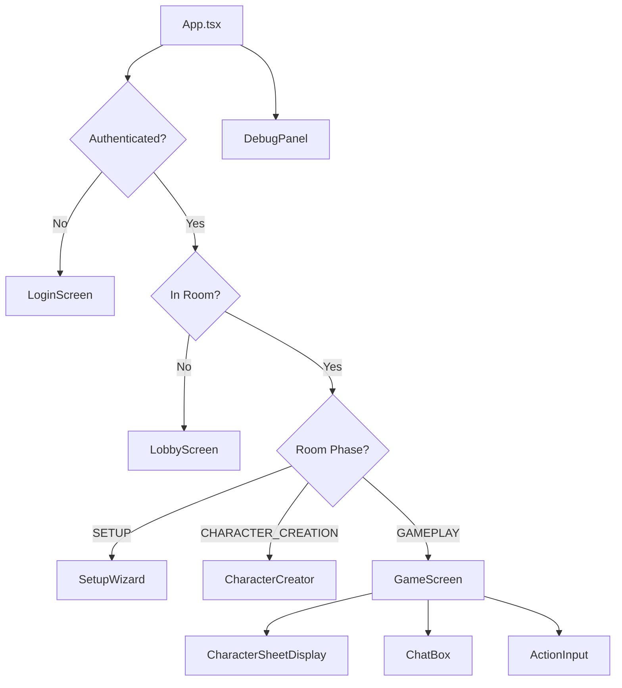

# Frontend Components

React components for the D20 AI multiplayer game.

## Architecture

## Components

- **LoginScreen** - Google OAuth authentication
- **LobbyScreen** - Create or join game rooms
- **SetupWizard** - Configure world settings
- **CharacterCreator** - Create player characters
- **GameScreen** - Main gameplay interface
- **DebugPanel** - Development/troubleshooting tool

## Conventions

- All components use TypeScript
- Functional components with hooks
- Props are fully typed
- JSDoc comments for complex logic
- Tailwind CSS for styling

