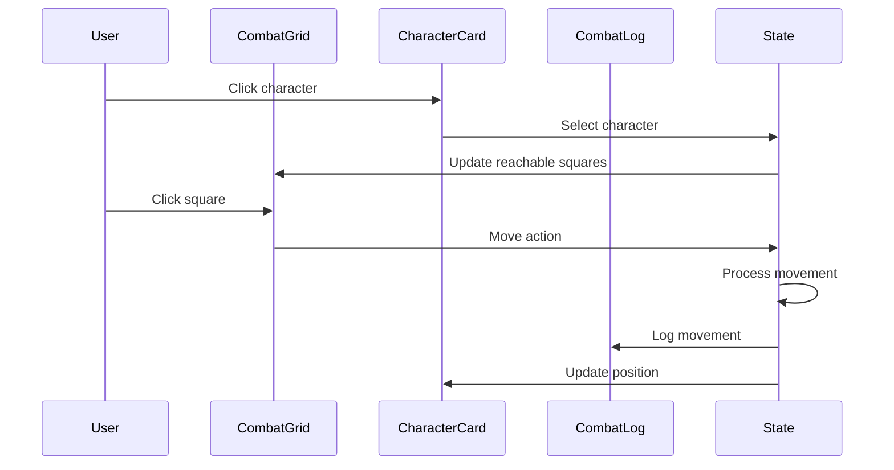

# Combat Components

D&D 5e combat system UI components for tactical grid-based battles with time-travel debugging.

## Architecture

```mermaid
graph TB
    A[Combat System] --> B[Grid View]
    A --> C[Character Display]
    A --> D[Combat Log]
    A --> E[Time Travel]

    B --> B1[CombatGrid]
    C --> C1[CharacterCard]
    D --> D1[CombatLog]
    E --> E1[TimeTravelPanel]

    B1 --> F[Position State]
    B1 --> G[Movement Calc]

    C1 --> H[HP Display]
    C1 --> I[Stats Display]
    C1 --> J[Conditions]

    D1 --> K[Log Entries]
    D1 --> L[Dice Rolls]

    E1 --> M[History Stack]
    E1 --> N[State Restoration]

    style A fill:#4a5568
    style B fill:#2d3748
    style C fill:#2d3748
    style D fill:#2d3748
    style E fill:#2d3748
```



## Components

### CombatGrid

Tactical grid for character positioning and movement visualization.

**Features:**

- Dynamic grid sizing (configurable width/height)
- Character placement with player/enemy differentiation
- Reachable square highlighting
- Click handlers for movement and targeting
- Coordinate display

```tsx
import { CombatGrid } from '@/components/combat';

<CombatGrid
  characters={combatState.characters}
  gridWidth={10}
  gridHeight={10}
  activeCharacterId={activeCharacter?.id}
  selectedCharacterId={selectedId}
  reachableSquares={moveableSquares}
  onSquareClick={handleMove}
  onCharacterClick={handleSelect}
/>;
```

### CharacterCard

Displays character stats, HP, and combat status.

**Features:**

- HP bar with color coding (green > 50%, yellow 25-50%, red < 25%)
- Temporary HP display
- Ability score modifiers
- Active/selected state indicators
- Turn action status (moved, acted)
- Condition badges
- Player vs enemy styling

```tsx
import { CharacterCard } from '@/components/combat';

<CharacterCard
  character={combatCharacter}
  isActive={character.id === activeId}
  isSelected={character.id === selectedId}
  onClick={() => handleCharacterClick(character.id)}
/>;
```

### CombatLog

Scrollable log of combat events with expandable dice rolls.

**Features:**

- Icon-coded log types (attack ⚔️, damage 💥, move 🏃, etc.)
- Color-coded by event type
- Expandable dice roll details
- Advantage/disadvantage display
- Markdown formatting support
- Auto-scroll to latest

```tsx
import { CombatLog } from '@/components/combat';

<CombatLog log={combatState.log} diceHistory={combatState.diceHistory} />;
```

### TimeTravelPanel

Debug panel for navigating combat history and restoring states.

**Features:**

- Visual timeline with dots
- Past/current/future state indicators
- Round and character count display
- Prev/Next navigation buttons
- Direct state restoration on click
- Collapsible floating panel

```tsx
import { TimeTravelPanel } from '@/components/combat';

<TimeTravelPanel
  history={combatHistory}
  currentIndex={historyIndex}
  onRestore={restoreToIndex}
  isOpen={isPanelOpen}
  onToggle={togglePanel}
/>;
```

## Data Flow



## Combat State Types

All components use shared types from `useCombat` hook:

```typescript
interface CombatCharacter {
  id: string;
  name: string;
  hp: number;
  maxHp: number;
  tempHp: number;
  armorClass: number;
  position: Position;
  initiative: number;
  // ... ability scores, conditions, etc.
}

interface CombatLogEntry {
  id: string;
  timestamp: number;
  message: string;
  type: string;
  relatedRolls: string[];
}
```

## Testing

```bash
# Run combat component tests
yarn test combat/__tests__
```

## Storybook

```bash
yarn storybook
```

Navigate to `Combat/` section to view:

- Character cards in various states
- Grid layouts with different sizes
- Combat log with dice rolls
- Time travel panel interactions

## Integration

Combat components integrate with:

- `useCombat` hook for state management
- LangGraph backend for combat resolution
- Socket.IO for real-time updates
- Firestore checkpointer for history persistence
