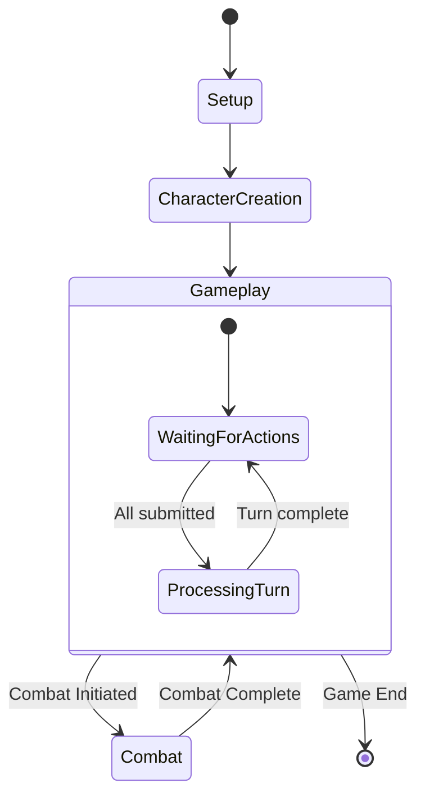
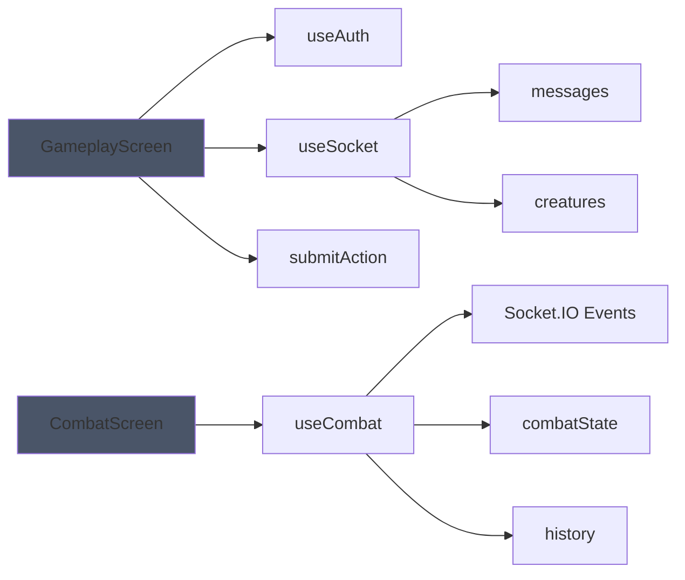
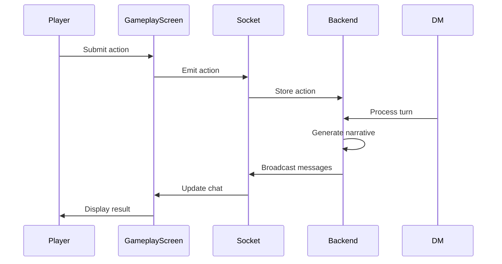

# Game Components

Main gameplay interface components for D&D narrative and combat phases.

## Architecture

```mermaid
graph TD
    A[Game Components] --> B[Screens]
    A --> C[Display]
    A --> D[Utility]

    B --> E[GameplayScreen]
    B --> F[CombatScreen]

    C --> G[ChatArea]
    C --> H[PlayerSidebar]

    D --> I[MarkdownMessage]

    E --> G
    E --> H
    E --> J[Action Input]

    F --> K[CombatGrid]
    F --> L[CharacterCards]
    F --> M[CombatLog]

    G --> I

    style A fill:#4a5568
    style B fill:#2d3748
    style C fill:#2d3748
    style D fill:#2d3748
```



## Components

### GameplayScreen

Main narrative gameplay interface.

**Features:**

- Chat area for DM narration and player messages
- Player sidebar with party info
- Action submission textarea
- Turn processing controls
- Action count display

```tsx
import GameplayScreen from '@/components/game';

<GameplayScreen room={currentRoom} players={activePlayers} />;
```

**States:**

- Waiting for player action
- Action submitted, waiting for others
- All actions submitted, ready to process (DM only)

### CombatScreen

Tactical combat interface.

**Features:**

- Combat grid with character positioning
- Player and enemy character cards
- Combat log with dice rolls
- Time-travel debugging panel
- End turn controls
- Victory/defeat overlay

```tsx
import { CombatScreen } from '@/components/game';

<CombatScreen roomId={room.id} />;
```

### ChatArea

Scrollable chat display for DM narration and player actions.

**Features:**

- World description card
- DM message rendering with markdown
- Player message display
- Private message indicators (🔒)
- Message filtering by recipient
- Image display support
- Timestamp display

```tsx
import ChatArea from '@/components/game';

<ChatArea messages={socketMessages} worldDescription={room.worldDescription} />;
```

**Message Types:**

- Public (all players see)
- Private (specific player only)
- DM (markdown formatted)
- Player (plain text)

### PlayerSidebar

Party and creature status display.

**Features:**

- Character cards with stats
- HP, AC, Initiative display
- Action submission indicators (✓)
- Creature list with stats
- Scrollable overflow

```tsx
import PlayerSidebar from '@/components/game';

<PlayerSidebar players={activePlayers} creatures={socketCreatures} />;
```

### MarkdownMessage

Styled markdown renderer for DM narration.

**Features:**

- Custom dark theme styling
- Sanitized HTML output
- GFM support (tables, strikethrough)
- Syntax highlighting for code blocks
- Link safety (target="\_blank", noopener)

```tsx
import MarkdownMessage from '@/components/game';

<MarkdownMessage content={dmNarrative} />;
```

**Supported Markdown:**

- Headers (h1-h3)
- Bold, italic, strikethrough
- Lists (ordered, unordered)
- Blockquotes
- Code blocks with language
- Tables
- Horizontal rules
- Links

## Game Flow



## Hooks Integration



## Message Flow



## Testing

```bash
# Run game component tests
yarn test game/__tests__
```

**Test Coverage:**

- Message rendering and filtering
- Markdown formatting and sanitization
- Player sidebar stats display
- Action submission flow
- Combat state transitions

## Storybook

```bash
yarn storybook
```

Navigate to `Game/` section to view:

- Chat area with different message types
- Markdown rendering examples
- Player sidebar states
- Gameplay screen layouts
- Combat screen interfaces

## State Management

Game components consume state from:

**Context/Hooks:**

- `useAuth` - Current user authentication
- `useSocket` - Real-time messaging and creatures
- `useCombat` - Combat state and actions

**Props:**

- Room configuration
- Player list
- Message history

## Styling

Uses dark theme with custom color palette:

- **Aurora** (cyan): Player actions, highlights
- **Nebula** (purple): Creatures, special effects
- **Midnight** (dark blue/gray): Backgrounds
- **Shadow** (gray): Text, borders
