# UI Components

Primitive UI components built with Radix UI primitives and Tailwind CSS. These form the foundation of the application's design system.

## Architecture

```mermaid
graph TD
    A[UI Components] --> B[Form Controls]
    A --> C[Layout]
    A --> D[Feedback]

    B --> E[Button]
    B --> F[Input]
    B --> G[Textarea]
    B --> H[Select]
    B --> I[Label]

    C --> J[Card]

    D --> K[AnimatedBackground]
    D --> L[LanguageSelector]

    style A fill:#4a5568
    style B fill:#2d3748
    style C fill:#2d3748
    style D fill:#2d3748
```



## Components

### Form Controls

#### Button

Multi-variant button component with size options.

**Variants:** `default` | `destructive` | `outline` | `secondary` | `ghost` | `link`  
**Sizes:** `default` | `sm` | `lg` | `icon`

```tsx
import { Button } from '@/components/ui';

<Button variant="default" size="lg">Click Me</Button>
<Button variant="destructive">Delete</Button>
<Button size="icon">★</Button>
```

#### Input

Styled text input with focus states.

```tsx
import Input from '@/components/ui';

<Input type="email" placeholder="Email address" />
<Input type="password" disabled />
```

#### Textarea

Multi-line text input with auto-resize.

```tsx
import Textarea from '@/components/ui';

<Textarea placeholder="Enter description" rows={4} />;
```

#### Select

Dropdown select with keyboard navigation (Radix UI).

```tsx
import { Select, SelectTrigger, SelectContent, SelectItem, SelectValue } from '@/components/ui';

<Select>
  <SelectTrigger>
    <SelectValue placeholder="Choose" />
  </SelectTrigger>
  <SelectContent>
    <SelectItem value="option1">Option 1</SelectItem>
    <SelectItem value="option2">Option 2</SelectItem>
  </SelectContent>
</Select>;
```

#### Label

Accessible form label component.

```tsx
import Label from '@/components/ui';

<Label htmlFor="username">Username</Label>
<Input id="username" />
```

### Layout

#### Card

Flexible card container with sub-components.

```tsx
import { Card, CardHeader, CardTitle, CardDescription, CardContent, CardFooter } from '@/components/ui';

<Card>
  <CardHeader>
    <CardTitle>Card Title</CardTitle>
    <CardDescription>Description text</CardDescription>
  </CardHeader>
  <CardContent>Main content</CardContent>
  <CardFooter>Footer content</CardFooter>
</Card>;
```

### Feedback & Visual

#### AnimatedBackground

Cosmic-themed animated background with aurora effects.

```tsx
import AnimatedBackground from '@/components/ui';

<AnimatedBackground />;
```

#### LanguageSelector

Dropdown for language selection with flag emojis.

```tsx
import LanguageSelector from '@/components/ui';

<LanguageSelector />;
```

## Design System

### Color Palette

- **Primary:** Aurora (cyan/blue gradients)
- **Secondary:** Nebula (purple/pink gradients)
- **Neutral:** Shadow/Midnight (dark grays/blues)
- **Semantic:** Red (destructive), Green (success)

### Spacing

Follows Tailwind's spacing scale (0.25rem increments).

### Typography

- **Font:** System font stack
- **Sizes:** `text-xs` to `text-4xl`
- **Weights:** `font-normal`, `font-medium`, `font-semibold`, `font-bold`

## Testing

All components have comprehensive test coverage using Vitest and Testing Library.

```bash
yarn test ui/__tests__
```

## Storybook

View all component variants and states:

```bash
yarn storybook
```

Navigate to `UI/` section in Storybook sidebar.

## Type Safety

All components are fully typed with TypeScript. Shared types are exported from `@/components/types`.

```tsx
import type { ButtonProps, InputSize } from '@/components/types';
```
