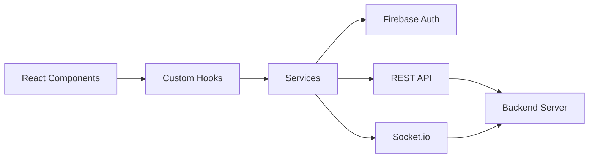

# Frontend Services

Service layer for external integrations.

## Services

- **firebase.ts** - Firebase client initialization
- **api.ts** - Backend HTTP client
- **socket.ts** - Socket.io real-time client

## Architecture

## Patterns

- All API calls return typed promises
- Errors are thrown and handled by components
- Auth token automatically included
- Socket reconnection handled automatically
