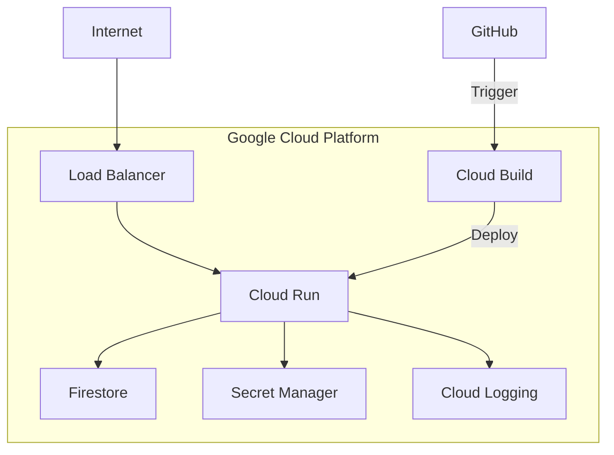

# Infrastructure as Code

Terraform configuration for Google Cloud resources.

## Architecture



## Resources

- **Cloud Run**: Backend service
- **Firestore**: Database
- **Secret Manager**: API keys and credentials
- **Cloud Build**: CI/CD pipeline
- **Cloud Logging**: Centralized logs
- **IAM**: Service accounts and permissions

## Usage

```bash
# Initialize
terraform init

# Plan changes
terraform plan

# Apply
terraform apply

# Destroy
terraform destroy
```

## Variables

See `variables.tf` for configuration options.

## Outputs

- `backend_url` - Cloud Run service URL
- `firestore_database` - Firestore database name

